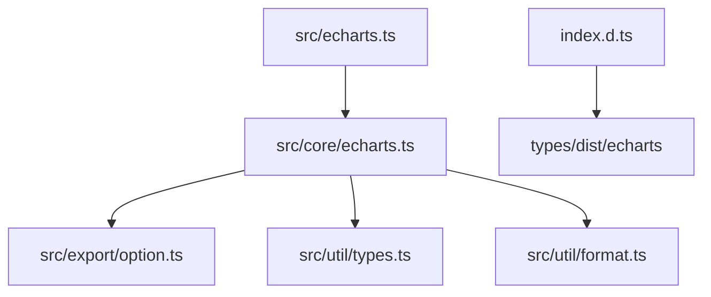
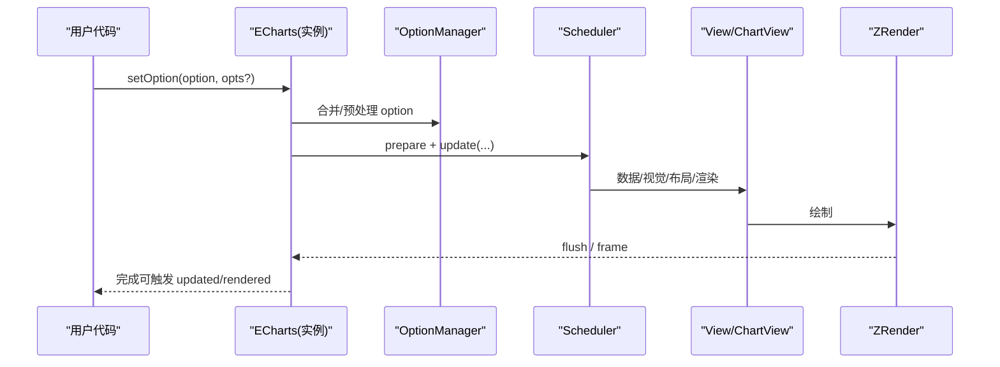
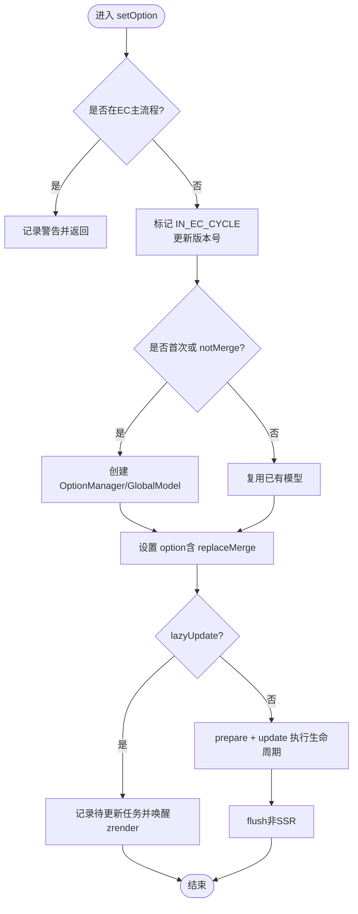
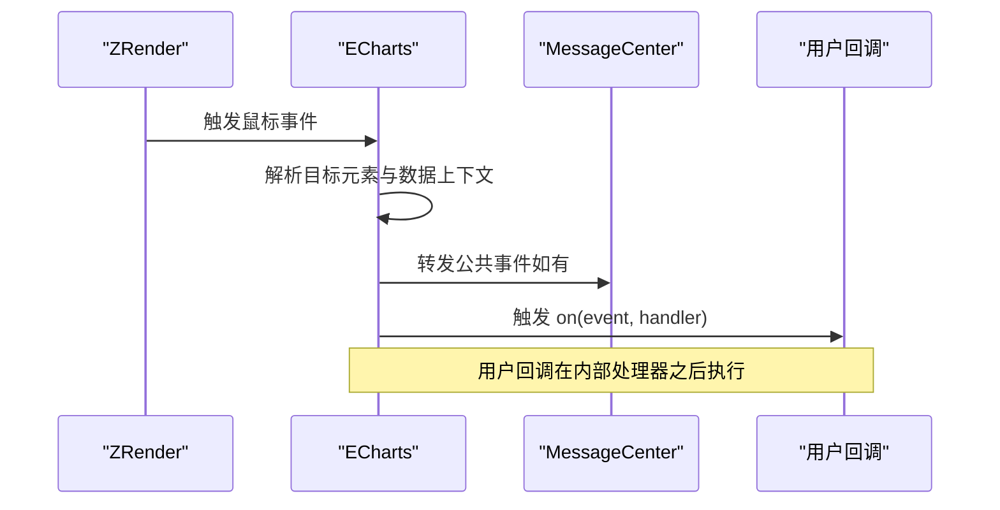
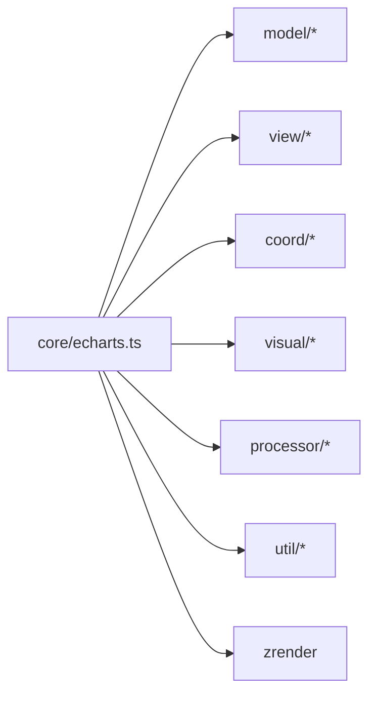

# API 参考

<cite>
**本文引用的文件**
- [src/echarts.ts](file://src/echarts.ts)
- [src/core/echarts.ts](file://src/core/echarts.ts)
- [src/export/option.ts](file://src/export/option.ts)
- [src/util/types.ts](file://src/util/types.ts)
- [src/util/format.ts](file://src/util/format.ts)
- [index.d.ts](file://index.d.ts)
</cite>

## 目录
1. [简介](#简介)
2. [项目结构](#项目结构)
3. [核心组件](#核心组件)
4. [架构总览](#架构总览)
5. [详细组件分析](#详细组件分析)
6. [依赖关系分析](#依赖关系分析)
7. [性能注意事项](#性能注意事项)
8. [故障排查指南](#故障排查指南)
9. [结论](#结论)
10. [附录](#附录)

## 简介
本参考文档面向 ECharts 的 API 使用与内部实现理解，覆盖以下要点：
- 初始化与生命周期：echarts.init()、chart.setOption()、chart.dispose()
- 配置项参考：option 的结构、类型约束与默认行为
- 事件系统：事件类型、回调参数与冒泡机制
- 工具方法：数据转换、格式化与辅助函数
- TypeScript 类型定义与接口规范
- 完整示例路径与错误处理建议

## 项目结构
ECharts 的核心入口与导出由 src/echarts.ts 提供，内部通过 use() 注册渲染器与数据集等默认能力，并暴露 init 方法。核心运行时逻辑集中在 src/core/echarts.ts，包含实例类 ECharts、更新周期、事件绑定、坐标转换、导出与清理等方法。配置项的类型定义集中在 src/export/option.ts 与 src/util/types.ts。工具方法（如数值、时间、模板格式化）位于 src/util/format.ts。根级 index.d.ts 用于兼容旧式引用方式。

**图示来源**
- [src/echarts.ts:20-46](file://src/echarts.ts#L20-L46)
- [src/core/echarts.ts:19-145](file://src/core/echarts.ts#L19-L145)
- [src/export/option.ts:20-129](file://src/export/option.ts#L20-L129)
- [src/util/types.ts:65-117](file://src/util/types.ts#L65-L117)
- [index.d.ts:20-34](file://index.d.ts#L20-L34)

**章节来源**
- [src/echarts.ts:20-46](file://src/echarts.ts#L20-L46)
- [src/core/echarts.ts:19-145](file://src/core/echarts.ts#L19-L145)
- [index.d.ts:20-34](file://index.d.ts#L20-L34)

## 核心组件
- 初始化与实例创建
  - 入口导出在 src/echarts.ts，默认启用 Canvas 渲染器与 Dataset 组件，并通过 use() 注册。
  - 实际初始化逻辑在 src/core/echarts.ts 的 ECharts 构造函数中，负责创建底层 zrender 实例、主题、本地化、调度器、消息中心与事件绑定。
- 配置更新
  - chart.setOption() 支持对象或布尔+布尔两种调用形式，内部进行模型合并、预处理、更新生命周期与可选懒更新。
- 清理与销毁
  - chart.dispose() 会释放视图、调度器、zrender 实例，并清空内部引用以避免内存泄漏。

**章节来源**
- [src/echarts.ts:20-46](file://src/echarts.ts#L20-L46)
- [src/core/echarts.ts:520-618](file://src/core/echarts.ts#L520-L618)
- [src/core/echarts.ts:737-819](file://src/core/echarts.ts#L737-L819)
- [src/core/echarts.ts:1401-1444](file://src/core/echarts.ts#L1401-L1444)

## 架构总览
ECharts 的运行基于“更新周期”与“调度器”，将数据处理、视觉编码、布局与渲染分阶段执行。setOption、dispatchAction、resize 等都会触发不同粒度的更新流程；事件系统统一封装 ZRender 事件并注入业务上下文。

**图示来源**
- [src/core/echarts.ts:211-277](file://src/core/echarts.ts#L211-L277)
- [src/core/echarts.ts:737-819](file://src/core/echarts.ts#L737-L819)
- [src/core/echarts.ts:620-704](file://src/core/echarts.ts#L620-L704)

## 详细组件分析

### 初始化：echarts.init()
- 入口与默认能力
  - 默认启用 Canvas 渲染器与 Dataset 组件，便于兼容。
- 初始化参数（EChartsInitOpts）
  - locale：语言或本地化选项
  - renderer：'canvas' | 'svg'
  - devicePixelRatio：设备像素比
  - useDirtyRect：是否使用脏矩形优化
  - useCoarsePointer：是否使用粗指针模式
  - pointerSize：指针命中区域大小
  - ssr：服务端渲染开关
  - width/height：画布尺寸
- 内部流程
  - 创建 zrender 实例，设置渲染器与 DPR
  - 初始化主题、本地化、坐标系管理器、调度器、消息中心
  - 绑定帧循环与事件，准备 resize 方法

**章节来源**
- [src/echarts.ts:20-46](file://src/echarts.ts#L20-L46)
- [src/core/echarts.ts:443-453](file://src/core/echarts.ts#L443-L453)
- [src/core/echarts.ts:520-618](file://src/core/echarts.ts#L520-L618)

### 配置更新：chart.setOption()
- 调用签名
  - setOption(option, notMerge?, lazyUpdate?)
  - setOption(option, { notMerge?, lazyUpdate?, silent?, replaceMerge?, transition? })
- 关键行为
  - 防止在主流程中嵌套调用
  - 首次或替换模式下创建 OptionManager 与 GlobalModel
  - 合并/预处理 option，进入更新生命周期
  - 支持懒更新：延迟到下一帧执行
  - 非 SSR 模式下同步 flush，确保像素可获取
- 返回值
  - 无返回值（void）

**图示来源**
- [src/core/echarts.ts:737-819](file://src/core/echarts.ts#L737-L819)

**章节来源**
- [src/core/echarts.ts:737-819](file://src/core/echarts.ts#L737-L819)

### 清理操作：chart.dispose()
- 行为
  - 标记已销毁，移除 DOM 属性
  - 遍历组件与图表视图，调用 dispose
  - 销毁 zrender 实例
  - 清空内部引用以释放内存
  - 从全局实例表中移除
- 注意
  - 重复调用会发出警告并直接返回

**章节来源**
- [src/core/echarts.ts:1401-1444](file://src/core/echarts.ts#L1401-L1444)

### 其他常用 API
- getOption()：获取当前配置快照
- getWidth()/getHeight()：获取画布宽高
- getDevicePixelRatio()：获取设备像素比
- renderToCanvas()/renderToSVGString()：导出渲染结果
- getDataURL()/getSvgDataURL()：导出图片数据 URL
- convertToPixel()/convertFromPixel()/convertToLayout()：坐标系统转换
- containPixel()：判断点是否在指定坐标系或组件内
- getVisual()：根据系列或数据项获取视觉映射值
- showLoading()/hideLoading()：显示/隐藏加载效果
- dispatchAction()：分发动作（如缩放、选择、高亮等）
- resize()：响应式调整

**章节来源**
- [src/core/echarts.ts:894-910](file://src/core/echarts.ts#L894-L910)
- [src/core/echarts.ts:923-1011](file://src/core/echarts.ts#L923-L1011)
- [src/core/echarts.ts:1139-1183](file://src/core/echarts.ts#L1139-L1183)
- [src/core/echarts.ts:1190-1230](file://src/core/echarts.ts#L1190-L1230)
- [src/core/echarts.ts:1247-1273](file://src/core/echarts.ts#L1247-L1273)
- [src/core/echarts.ts:1518-1557](file://src/core/echarts.ts#L1518-L1557)
- [src/core/echarts.ts:1574-1600](file://src/core/echarts.ts#L1574-L1600)
- [src/core/echarts.ts:1449-1511](file://src/core/echarts.ts#L1449-L1511)

### 事件系统
- 事件来源
  - 统一封装 ZRender 鼠标事件，注入业务上下文（组件类型、索引、数据项信息等）
  - 消息中心转发公共事件类型
- 事件参数
  - 包含目标元素、组件信息、数据项参数、原始事件对象
  - 特殊处理 markLine/markPoint/markArea 的事件查询兼容性
- 冒泡机制
  - 通过 zrender 的事件系统传递，ECharts 在事件处理器最后调用用户回调，避免内部更新干扰
- 常见事件
  - click、mouseover、mouseout、mousemove、globalout 等（来自 ZRender）
  - rendered、finished（渲染完成）
  - 自定义 action 事件（如选择变化等）

**图示来源**
- [src/core/echarts.ts:1290-1387](file://src/core/echarts.ts#L1290-L1387)

**章节来源**
- [src/core/echarts.ts:1290-1387](file://src/core/echarts.ts#L1290-L1387)

### 工具方法集合
- 数值与字符串
  - addCommas：千分位格式化
  - toCamelCase：连字符转驼峰
  - makeValueReadable：生成用户可读的值（时间、序数、数字、布尔等）
- 模板格式化
  - formatTpl/formatTplSimple：模板变量替换，支持 HTML 转义
- 提示标记
  - getTooltipMarker：生成富文本标记（颜色、样式、渲染模式）

**章节来源**
- [src/util/format.ts:32-55](file://src/util/format.ts#L32-L55)
- [src/util/format.ts:64-107](file://src/util/format.ts#L64-L107)
- [src/util/format.ts:124-166](file://src/util/format.ts#L124-L166)
- [src/util/format.ts:168-200](file://src/util/format.ts#L168-L200)

### TypeScript 类型定义与接口规范
- 渲染器类型
  - RendererType：'canvas' | 'svg'
- 通用类型
  - NullUndefined、ColorString、ZRColor、ZRLineType、ZRFontStyle、ZRFontWeight、ZREasing、ZRTextAlign、ZRTextVerticalAlign、ZRElementEvent、ZRElementEventName、ZRRectLike、ZRStyleProps
- 组件类型
  - ComponentFullType、ComponentMainType、ComponentSubType、ComponentTypeInfo
- 数据与模型
  - DataHost、DataModel、Payload、SelectChangedEvent、CallbackDataParams 等
- 选项类型
  - 各组件与系列的 Option 类型在 src/export/option.ts 中聚合导出，包括坐标轴、图例、提示框、数据缩放、视觉映射、标记线/点/区、工具箱、数据集等
- 版本与依赖
  - version、dependencies（zrender）

**章节来源**
- [src/util/types.ts:65-117](file://src/util/types.ts#L65-L117)
- [src/util/types.ts:160-200](file://src/util/types.ts#L160-L200)
- [src/export/option.ts:20-129](file://src/export/option.ts#L20-L129)
- [src/core/echarts.ts:150-154](file://src/core/echarts.ts#L150-L154)
- [index.d.ts:20-34](file://index.d.ts#L20-L34)

## 依赖关系分析
- 外部依赖
  - zrender：渲染与图形基础
- 内部模块
  - model/Global、model/OptionManager：配置管理与合并
  - view/Chart、view/Component：视图渲染
  - coord/*：坐标系与轴
  - visual/*：视觉编码与样式
  - processor/*：数据预处理（堆叠、过滤、采样等）
  - util/*：工具函数（事件、格式、类型、日志等）

**图示来源**
- [src/core/echarts.ts:19-145](file://src/core/echarts.ts#L19-L145)

**章节来源**
- [src/core/echarts.ts:19-145](file://src/core/echarts.ts#L19-L145)

## 性能注意事项
- 懒更新
  - setOption 支持 lazyUpdate，减少频繁更新的开销，适合高频数据推送场景
- 进度渲染
  - 调度器支持渐进式任务，按动画帧逐步完成大数据量渲染
- 刷新控制
  - 非 SSR 模式下 setOption 后同步 flush，确保像素可立即读取，但可能影响性能
- 事件回调顺序
  - 用户回调在内部处理器之后执行，避免中间状态不一致导致的重绘

[本节为通用指导，不直接分析具体文件]

## 故障排查指南
- 常见错误与警告
  - 在主流程中调用 setOption/resize/setTheme：会记录错误并提前返回
  - 对已销毁实例调用 API：会记录警告并忽略
  - 不支持的方法或组件：开发模式下输出警告
- 调试建议
  - 使用 getOption 检查当前配置
  - 使用 containPixel 验证坐标转换是否正确
  - 使用 renderToCanvas/getDataURL 验证渲染结果
  - 使用 showLoading/hideLoading 观察交互反馈

**章节来源**
- [src/core/echarts.ts:741-747](file://src/core/echarts.ts#L741-L747)
- [src/core/echarts.ts:827-838](file://src/core/echarts.ts#L827-L838)
- [src/core/echarts.ts:1450-1455](file://src/core/echarts.ts#L1450-L1455)
- [src/core/echarts.ts:1401-1405](file://src/core/echarts.ts#L1401-L1405)

## 结论
ECharts 提供了完善的初始化、配置更新、事件系统与工具方法，配合 TypeScript 类型定义与清晰的更新生命周期，能够满足复杂可视化需求。合理使用懒更新与渐进渲染，结合事件与导出能力，可实现高性能、可维护的数据可视化应用。

[本节为总结性内容，不直接分析具体文件]

## 附录
- 示例与测试用例
  - 大量 HTML 示例位于 test/ 目录，涵盖各类图表与组件用法，可作为实践参考
- 类型入口
  - 根级 index.d.ts 保留旧式引用兼容，实际类型定义来源于 types/dist/echarts

[本节为补充说明，不直接分析具体文件]