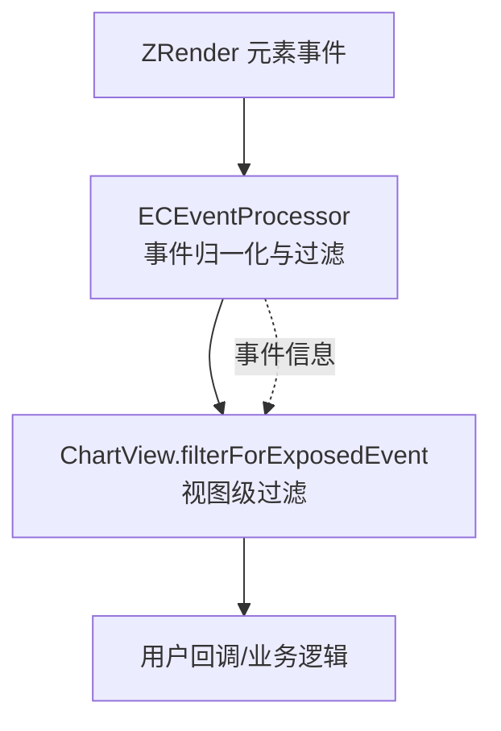
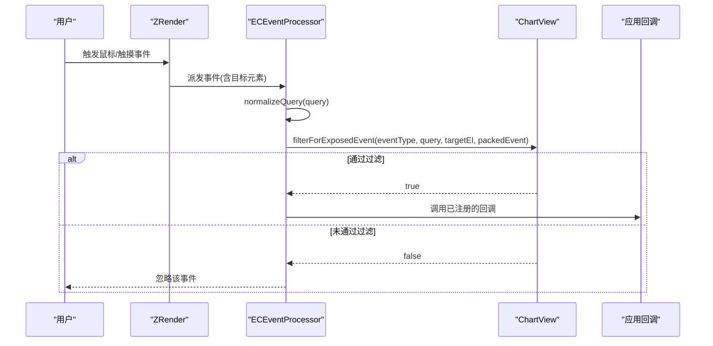
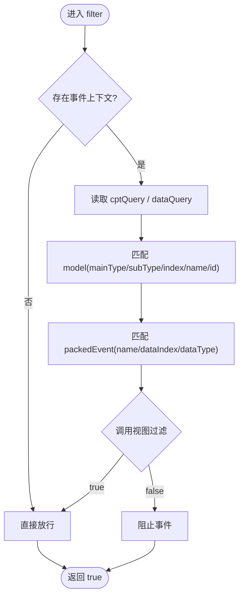
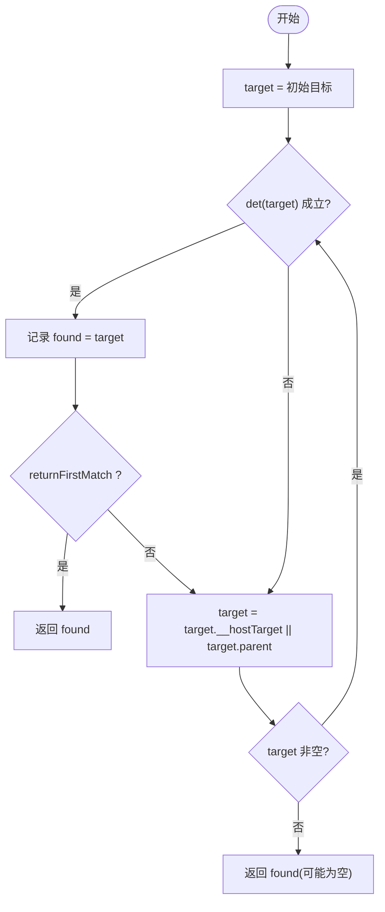
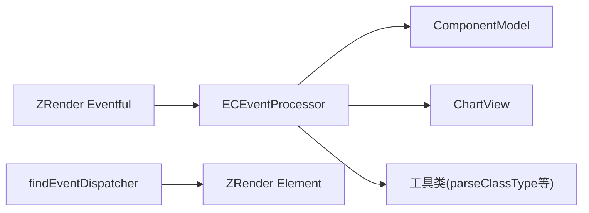

# 事件系统

<cite>
**本文引用的文件**
- [src/util/ECEventProcessor.ts](file://src/util/ECEventProcessor.ts)
- [src/util/event.ts](file://src/util/event.ts)
- [src/view/Chart.ts](file://src/view/Chart.ts)
- [src/core/echarts.ts](file://src/core/echarts.ts)
- [src/component/helper/RoamController.ts](file://src/component/helper/RoamController.ts)
- [extension-src/bmap/BMapView.ts](file://extension-src/bmap/BMapView.ts)
</cite>

## 目录
1. [简介](#简介)
2. [项目结构](#项目结构)
3. [核心组件](#核心组件)
4. [架构总览](#架构总览)
5. [详细组件分析](#详细组件分析)
6. [依赖关系分析](#依赖关系分析)
7. [性能考虑](#性能考虑)
8. [故障排查指南](#故障排查指南)
9. [结论](#结论)
10. [附录](#附录)

## 简介
本文件系统化梳理 ECharts 的事件体系，覆盖事件类型、回调参数与返回值、事件冒泡与委托、监听注册与移除、自定义事件创建与触发、性能优化与调试技巧，以及常见错误处理模式。文档基于源码实现进行归纳，确保内容与实际行为一致。

## 项目结构
ECharts 事件系统由“底层图形事件（ZRender）→ ECharts 事件处理器 → 图表视图过滤 → 业务回调”的链路组成：
- ZRender 负责捕获原生鼠标/触摸等事件，并向上派发。
- ECharts 通过 ECEventProcessor 对事件进行归一化、查询匹配与过滤。
- ChartView 提供 filterForExposedEvent 钩子，用于按视图维度进一步筛选事件。
- 用户代码通过 on/off 注册/移除监听器，或通过 dispatchAction 触发内置动作事件。

**图示来源**
- [src/util/ECEventProcessor.ts:47-151](file://src/util/ECEventProcessor.ts#L47-L151)
- [src/view/Chart.ts:90-97](file://src/view/Chart.ts#L90-L97)

**章节来源**
- [src/util/ECEventProcessor.ts:47-151](file://src/util/ECEventProcessor.ts#L47-L151)
- [src/view/Chart.ts:90-97](file://src/view/Chart.ts#L90-L97)

## 核心组件
- ECEventProcessor：实现事件查询归一化、条件匹配与过滤，维护事件上下文（目标元素、打包事件、模型、视图）。
- ChartView：暴露 filterForExposedEvent，允许视图层根据具体渲染结果决定是否响应某事件。
- findEventDispatcher：在图形树中沿 hostTarget/parent 查找满足条件的祖先节点，支撑事件委托。
- echarts 入口：定义 on/off 方法签名及事件生命周期事件（如 rendered），并提供 dispatchAction 机制。

**章节来源**
- [src/util/ECEventProcessor.ts:47-151](file://src/util/ECEventProcessor.ts#L47-L151)
- [src/util/event.ts:22-39](file://src/util/event.ts#L22-L39)
- [src/view/Chart.ts:90-97](file://src/view/Chart.ts#L90-L97)
- [src/core/echarts.ts:328-330](file://src/core/echarts.ts#L328-L330)
- [src/core/echarts.ts:433-434](file://src/core/echarts.ts#L433-L434)

## 架构总览
下图展示一次典型交互从原生事件到用户回调的完整流程，包括查询匹配、视图过滤与回调执行。

**图示来源**
- [src/util/ECEventProcessor.ts:57-145](file://src/util/ECEventProcessor.ts#L57-L145)
- [src/view/Chart.ts:90-97](file://src/view/Chart.ts#L90-L97)

## 详细组件分析

### ECEventProcessor：事件查询与过滤
- 职责
  - 将字符串或对象形式的查询条件解析为组件/数据/其他三类查询项。
  - 在事件触发时，依据当前事件上下文（目标元素、打包事件、模型、视图）逐项匹配。
  - 支持视图自定义过滤（filterForExposedEvent）。
- 关键流程
  - normalizeQuery：拆分 mainType/subType/index/name/id 与 dataIndex/name/dataType 等字段。
  - filter：逐项比对 model 与 packedEvent 的属性，并调用视图过滤。
  - afterTrigger：清理事件上下文，避免跨次调用污染。

**图示来源**
- [src/util/ECEventProcessor.ts:57-145](file://src/util/ECEventProcessor.ts#L57-L145)

**章节来源**
- [src/util/ECEventProcessor.ts:57-145](file://src/util/ECEventProcessor.ts#L57-L145)

### 事件委托与冒泡：findEventDispatcher
- 作用：在图形树中自底向上查找满足判定条件的祖先节点，支持事件委托。
- 行为：优先使用 __hostTarget，否则回退到 parent；可控制是否返回首个匹配项。
- 适用场景：在复杂图形结构中统一拦截并分发事件，减少重复监听。

**图示来源**
- [src/util/event.ts:22-39](file://src/util/event.ts#L22-L39)

**章节来源**
- [src/util/event.ts:22-39](file://src/util/event.ts#L22-L39)

### 视图级过滤：ChartView.filterForExposedEvent
- 作用：视图可根据自身渲染状态决定某事件是否对外暴露。
- 参数：事件类型、查询对象、目标元素、打包事件。
- 返回值：布尔值，true 表示允许事件继续传播至回调，false 则拦截。

**章节来源**
- [src/view/Chart.ts:90-97](file://src/view/Chart.ts#L90-L97)

### 事件注册与移除：on/off 与 Action 事件
- 事件注册/移除：通过 echarts 实例的 on/off 方法注册/移除事件监听器。
- 内置动作事件：可通过 dispatchAction 触发（例如缩放、刷选、图例切换等），被相应组件消费。
- 生命周期事件：如 rendered 等，用于感知渲染完成时机。

**章节来源**
- [src/core/echarts.ts:328-330](file://src/core/echarts.ts#L328-L330)
- [src/core/echarts.ts:433-434](file://src/core/echarts.ts#L433-L434)

### 漫游控制器事件：RoamController
- 封装了平移/缩放等交互的行为与事件，内部绑定原生指针事件，并在可用行为条件下触发。
- 适用于地图、坐标系等需要漫游能力的组件。

**章节来源**
- [src/component/helper/RoamController.ts:72-106](file://src/component/helper/RoamController.ts#L72-L106)
- [src/component/helper/RoamController.ts:446-457](file://src/component/helper/RoamController.ts#L446-L457)

### 第三方扩展事件集成：BMap 示例
- 在扩展中将外部地图事件（移动、缩放结束）桥接到 ECharts 的事件体系，便于统一处理。
- 演示了 addEventListener/removeEventListener 的使用方式。

**章节来源**
- [extension-src/bmap/BMapView.ts:90-95](file://extension-src/bmap/BMapView.ts#L90-L95)

## 依赖关系分析
- ECEventProcessor 依赖：
  - ZRender 事件接口（EventProcessor/EventQuery）
  - ECharts 模型与视图（ComponentModel/ComponentView/ChartView）
  - 工具函数（parseClassType、zrender util）
- ChartView 提供 filterForExposedEvent 作为扩展点。
- findEventDispatcher 依赖 ZRender Element 的宿主关系与父节点链。

**图示来源**
- [src/util/ECEventProcessor.ts:20-28](file://src/util/ECEventProcessor.ts#L20-L28)
- [src/util/event.ts:20-21](file://src/util/event.ts#L20-L21)

**章节来源**
- [src/util/ECEventProcessor.ts:20-28](file://src/util/ECEventProcessor.ts#L20-L28)
- [src/util/event.ts:20-21](file://src/util/event.ts#L20-L21)

## 性能考虑
- 精准查询：尽量使用具体的查询条件（如 seriesIndex、dataIndex）缩小匹配范围，减少不必要的回调执行。
- 视图过滤：在 filterForExposedEvent 中尽早拒绝无关事件，降低上层处理开销。
- 事件委托：利用 findEventDispatcher 在父级集中处理事件，避免大量子元素重复绑定监听。
- 节流/防抖：对高频事件（mousemove、mousewheel）建议在外层做节流/防抖，避免频繁重绘。
- 批量更新：合并多次状态变更，减少渲染次数。
- 最小化回调体：保持回调轻量，耗时逻辑异步化。

[本节为通用指导，不直接分析具体文件]

## 故障排查指南
- 事件未触发
  - 检查查询条件是否正确（mainType/subType/index/name/id 与 dataIndex/name/dataType）。
  - 确认视图 filterForExposedEvent 是否返回 true。
  - 确认目标元素是否存在且未被隐藏。
- 回调参数异常
  - 核对 packedEvent 的结构（name、dataIndex、dataType 等）是否符合预期。
  - 确认事件上下文是否在 afterTrigger 后被清空，避免复用污染。
- 内存泄漏
  - 及时移除不再使用的监听器（off）。
  - 在组件销毁时解绑第三方事件（如 BMap 的 moving/moveend/zoomend）。

**章节来源**
- [src/util/ECEventProcessor.ts:147-151](file://src/util/ECEventProcessor.ts#L147-L151)
- [extension-src/bmap/BMapView.ts:90-95](file://extension-src/bmap/BMapView.ts#L90-L95)

## 结论
ECharts 事件系统以 ECEventProcessor 为核心，结合 ChartView 的视图级过滤与 findEventDispatcher 的委托能力，形成高效、可扩展的事件处理框架。通过精准的查询匹配与合理的视图过滤，可在保证功能完备的同时获得良好性能。配合 on/off 与 dispatchAction，既能响应交互，也能驱动图表状态变化。

[本节为总结性内容，不直接分析具体文件]

## 附录

### 事件类型概览（基于源码定位）
- 鼠标/触摸事件：由 ZRender 捕获并透传到 ECharts，经 ECEventProcessor 过滤后交由用户回调。
- 数据事件：通过查询条件中的 dataIndex/name/dataType 精确匹配数据项。
- 组件事件：通过 mainType/subType/index/name/id 匹配组件实例。
- 动作事件：通过 dispatchAction 触发，被对应组件消费（如缩放、刷选、图例切换等）。
- 生命周期事件：如 rendered，用于感知渲染完成。

[本节为概念性说明，不直接分析具体文件]

### 事件回调参数与返回值
- 回调参数
  - 目标元素：来自事件上下文的目标 Element。
  - 打包事件：包含 name、dataIndex、dataType 等字段的事件载荷。
  - 模型与视图：当前匹配的 ComponentModel 与 ChartView/ComponentView。
- 返回值
  - 视图过滤：filterForExposedEvent 返回布尔值控制事件是否继续。
  - 用户回调：通常无强制返回值要求，但应避免阻塞主线程。

**章节来源**
- [src/util/ECEventProcessor.ts:49-55](file://src/util/ECEventProcessor.ts#L49-L55)
- [src/view/Chart.ts:90-97](file://src/view/Chart.ts#L90-L97)

### 事件冒泡与委托原理
- 冒泡：ZRender 元素树自下而上派发事件。
- 委托：findEventDispatcher 沿 __hostTarget/parent 查找匹配祖先，统一处理事件，减少监听数量。

**章节来源**
- [src/util/event.ts:22-39](file://src/util/event.ts#L22-L39)

### 监听器的注册与移除
- 注册/移除：使用 echarts 实例的 on/off 方法。
- 动作事件：通过 dispatchAction 触发，组件内部消费。

**章节来源**
- [src/core/echarts.ts:328-330](file://src/core/echarts.ts#L328-L330)

### 自定义事件的创建与触发
- 通过 dispatchAction 触发内置动作事件，供组件消费。
- 对于扩展场景，可将外部事件桥接到 ECharts 事件体系（参考 BMap 示例）。

**章节来源**
- [extension-src/bmap/BMapView.ts:90-95](file://extension-src/bmap/BMapView.ts#L90-L95)

### 性能优化建议
- 使用精准查询与视图过滤减少无效回调。
- 对高频事件做节流/防抖。
- 采用事件委托降低监听数量。
- 合并状态更新，减少渲染次数。

[本节为通用指导，不直接分析具体文件]

### 调试技巧
- 打印 packedEvent 的关键字段（name、dataIndex、dataType）确认匹配情况。
- 在 filterForExposedEvent 中输出日志，判断视图过滤是否生效。
- 逐步缩小查询条件，定位问题所在。

[本节为通用指导，不直接分析具体文件]

### 错误处理模式
- 未知 dataType：在 highlight/downplay 等路径中对非法 dataType 进行告警并安全返回。
- 事件上下文清理：afterTrigger 中清空 eventInfo，防止跨次调用污染。

**章节来源**
- [src/view/Chart.ts:160-183](file://src/view/Chart.ts#L160-L183)
- [src/util/ECEventProcessor.ts:147-151](file://src/util/ECEventProcessor.ts#L147-L151)