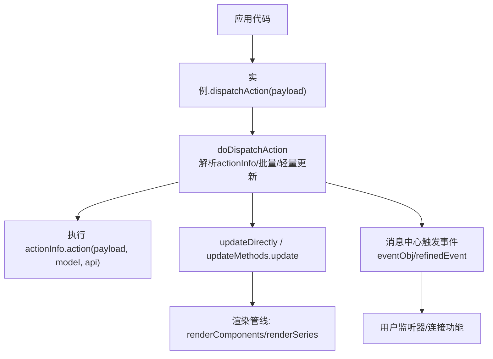
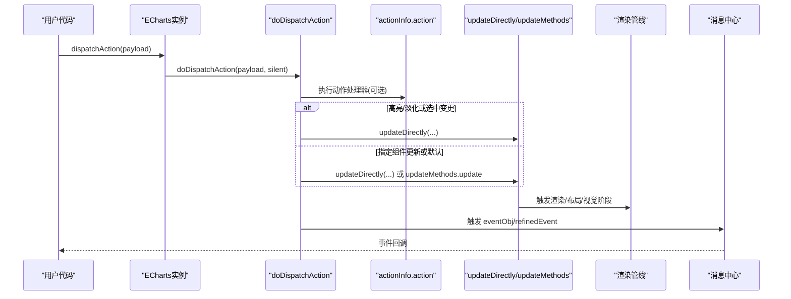
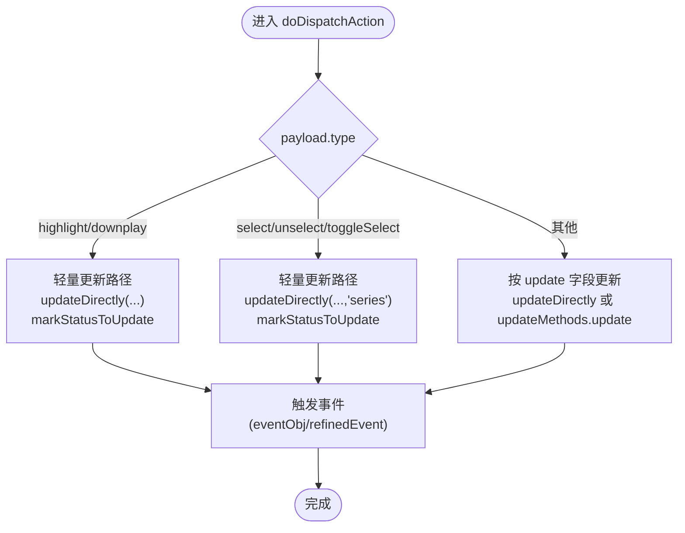
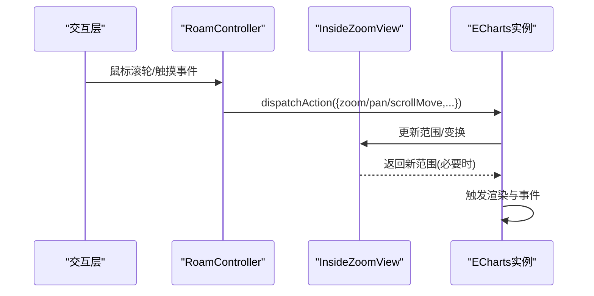
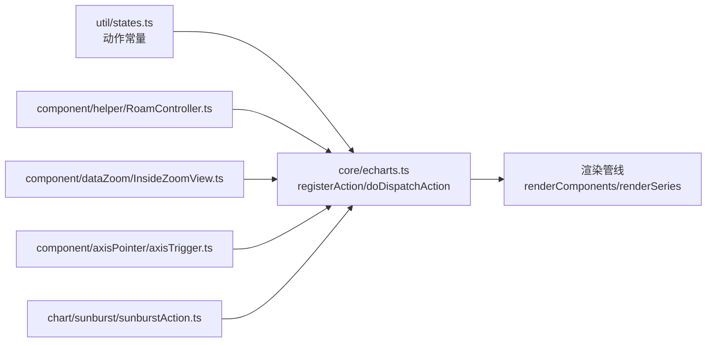

# 动作系统

<cite>
**本文引用的文件**
- [src/core/echarts.ts](file://src/core/echarts.ts)
- [src/util/states.ts](file://src/util/states.ts)
- [src/util/types.ts](file://src/util/types.ts)
- [src/component/helper/RoamController.ts](file://src/component/helper/RoamController.ts)
- [src/component/dataZoom/InsideZoomView.ts](file://src/component/dataZoom/InsideZoomView.ts)
- [src/component/dataZoom/roams.ts](file://src/component/dataZoom/roams.ts)
- [src/component/axisPointer/axisTrigger.ts](file://src/component/axisPointer/axisTrigger.ts)
- [src/chart/sunburst/sunburstAction.ts](file://src/chart/sunburst/sunburstAction.ts)
- [test/geo-svg.html](file://test/geo-svg.html)
</cite>

## 目录
1. [简介](#简介)
2. [项目结构](#项目结构)
3. [核心组件](#核心组件)
4. [架构总览](#架构总览)
5. [详细组件分析](#详细组件分析)
6. [依赖关系分析](#依赖关系分析)
7. [性能考虑](#性能考虑)
8. [故障排查指南](#故障排查指南)
9. [结论](#结论)
10. [附录：内置动作与示例](#附录内置动作与示例)

## 简介
本文件系统性说明 ECharts 的动作系统，包括：
- dispatchAction() 的调用方式与参数格式
- 内置动作类型（高亮、淡化、选中/取消选中/切换选中、缩放、刷新等）
- 动作处理流程与状态更新机制
- 自定义动作开发指南
- 动作与事件的关联关系
- 最佳实践与性能注意事项
- 完整使用示例与调试方法

## 项目结构
ECharts 的动作系统由“核心调度 + 内置动作注册 + 组件/图表动作实现 + 事件分发”构成。核心调度位于入口模块；内置动作常量定义在状态工具中；各类组件通过内部逻辑或视图触发动作；事件中心负责将动作结果以事件形式发布给上层。

图示来源
- [src/core/echarts.ts:2148-2272](file://src/core/echarts.ts#L2148-L2272)
- [src/core/echarts.ts:2450-2489](file://src/core/echarts.ts#L2450-L2489)

章节来源
- [src/core/echarts.ts:2148-2272](file://src/core/echarts.ts#L2148-L2272)
- [src/core/echarts.ts:2450-2489](file://src/core/echarts.ts#L2450-L2489)

## 核心组件
- 动作调度器：封装 doDispatchAction，负责解析 payload、拆分批量、选择轻量更新路径、触发事件。
- 动作注册器：registerAction(type, event?, handler|info)，维护 actions 表与事件映射。
- 动作信息模型：ActionInfo 描述 type、event、update、action、refineEvent 等。
- 状态常量：HIGHLIGHT/DOWNPLAY/SELECT/UNSELECT/TOGGLE_SELECT 等动作类型常量。
- 组件/图表动作：如 dataZoom 滚动/缩放、sunburst 钻取/回退、axisPointer 提示框控制等。

章节来源
- [src/core/echarts.ts:3114-3186](file://src/core/echarts.ts#L3114-L3186)
- [src/util/types.ts:296-346](file://src/util/types.ts#L296-L346)
- [src/util/states.ts:88-93](file://src/util/states.ts#L88-L93)

## 架构总览
动作从用户调用到最终渲染更新的时序如下：

图示来源
- [src/core/echarts.ts:2148-2272](file://src/core/echarts.ts#L2148-L2272)
- [src/core/echarts.ts:2450-2489](file://src/core/echarts.ts#L2450-L2489)

## 详细组件分析

### 动作调度与批量处理
- 支持 payload.batch 批量提交，内部会展开为多个 Payload 并合并公共字段。
- 针对高亮/淡化与选中变更走轻量更新路径，避免全量数据/布局重算。
- 支持 update 字段精确控制更新目标（如 'series'、'componentType:method'）。
- 事件分发：若无 refineEvent，则基于原始 payload 复制事件对象；若提供 refineEvent，则在最后生成更友好的公共事件，同时保留 connect 所需的事件副本。

章节来源
- [src/core/echarts.ts:2148-2272](file://src/core/echarts.ts#L2148-L2272)

### 动作注册与扩展点
- registerAction 支持多种签名：字符串+事件名+处理器，或 ActionInfo 对象。
- ActionInfo 关键字段：
  - type：动作类型
  - event：对外事件名（默认同 type）
  - update：更新策略（默认 'update'）
  - action：仅修改模型的处理器
  - refineEvent：生成用户友好事件，并在所有模型更新后调用
  - publishNonRefinedEvent：兼容旧行为，仍触发非精炼事件（不推荐新动作使用）

章节来源
- [src/core/echarts.ts:3114-3186](file://src/core/echarts.ts#L3114-L3186)
- [src/util/types.ts:296-346](file://src/util/types.ts#L296-L346)

### 内置动作：高亮/淡化/选中
- 高亮 highlight：用于强调某元素，触发轻量更新与状态标记。
- 淡化 downplay：取消强调，配合高亮成对使用。
- 选中 select/unselect/toggleSelect：统一通过 SELECT_CHANGED_EVENT_TYPE 事件上报选中变化，包含 selected 索引集合与是否来自点击的标志。

图示来源
- [src/core/echarts.ts:2148-2272](file://src/core/echarts.ts#L2148-L2272)
- [src/core/echarts.ts:3375-3423](file://src/core/echarts.ts#L3375-L3423)

章节来源
- [src/core/echarts.ts:3375-3423](file://src/core/echarts.ts#L3375-L3423)
- [src/util/states.ts:88-93](file://src/util/states.ts#L88-L93)

### 内置动作：缩放/平移（dataZoom）
- 内部交互（滚轮、触摸捏合、拖拽）通过 RoamController 计算增量，再调用 api.dispatchAction 派发 zoom/pan/scrollMove 等动作。
- InsideZoomView 根据坐标轴方向与控制器事件计算新的范围，并通过 sliderMove 限制范围后触发更新。
- roams.ts 确保同一坐标系下只创建一个漫游控制器，避免重复派发。

图示来源
- [src/component/helper/RoamController.ts:397-427](file://src/component/helper/RoamController.ts#L397-L427)
- [src/component/dataZoom/InsideZoomView.ts:97-149](file://src/component/dataZoom/InsideZoomView.ts#L97-L149)
- [src/component/dataZoom/roams.ts:20-30](file://src/component/dataZoom/roams.ts#L20-L30)

章节来源
- [src/component/helper/RoamController.ts:397-427](file://src/component/helper/RoamController.ts#L397-L427)
- [src/component/dataZoom/InsideZoomView.ts:97-149](file://src/component/dataZoom/InsideZoomView.ts#L97-L149)
- [src/component/dataZoom/roams.ts:20-30](file://src/component/dataZoom/roams.ts#L20-L30)

### 内置动作：提示框控制（axisPointer）
- axisTrigger 在合适时机触发 hideTip、showTip、updateAxisPointer 等动作，联动 tooltip 显示/隐藏与定位。

章节来源
- [src/component/axisPointer/axisTrigger.ts:143-498](file://src/component/axisPointer/axisTrigger.ts#L143-L498)

### 内置动作：树图/旭日图导航
- sunburstAction 在视图交互中派发 navigate 类动作（如钻取、回退），结合视图进行层级更新。

章节来源
- [src/chart/sunburst/sunburstAction.ts:94-109](file://src/chart/sunburst/sunburstAction.ts#L94-L109)

### 自定义动作开发指南
- 使用 registerAction 注册：
  - 简单模式：registerAction('myAction', handler)
  - 高级模式：registerAction({type:'myAction', event:'myActionChanged', update:'series', action, refineEvent}, handler)
- 建议：
  - action 仅修改模型，不直接操作视图
  - 使用 refineEvent 生成用户友好事件，并确保 batch/non-batch 行为一致
  - 如需共享事件名，必须使用 refineEvent
  - 谨慎使用 publishNonRefinedEvent（仅兼容旧行为）

章节来源
- [src/core/echarts.ts:3114-3186](file://src/core/echarts.ts#L3114-L3186)
- [src/util/types.ts:296-346](file://src/util/types.ts#L296-L346)

### 动作与事件的关联关系
- 每个动作对应一个“内部事件类型”（nonRefinedEventType），用于 connect 特性与内部通信。
- 若提供 refineEvent，则额外触发“公共事件”（refinedEventType），内容更友好且在所有模型更新后生成。
- 选中相关动作统一触发 SELECT_CHANGED_EVENT_TYPE，携带 selected 与 isFromClick 标志。

章节来源
- [src/core/echarts.ts:2148-2272](file://src/core/echarts.ts#L2148-L2272)
- [src/core/echarts.ts:3375-3423](file://src/core/echarts.ts#L3375-L3423)

## 依赖关系分析
- 动作常量来源于 util/states.ts，供 core/echarts.ts 注册与判断。
- 组件/图表通过 ExtensionAPI 提供的 dispatchAction 派发动作，形成“交互→动作→更新→事件”的闭环。
- 渲染管线在动作处理后按需执行，保证状态与视图一致。

图示来源
- [src/util/states.ts:88-93](file://src/util/states.ts#L88-L93)
- [src/core/echarts.ts:2148-2272](file://src/core/echarts.ts#L2148-L2272)
- [src/component/helper/RoamController.ts:397-427](file://src/component/helper/RoamController.ts#L397-L427)
- [src/component/dataZoom/InsideZoomView.ts:97-149](file://src/component/dataZoom/InsideZoomView.ts#L97-L149)
- [src/component/axisPointer/axisTrigger.ts:143-498](file://src/component/axisPointer/axisTrigger.ts#L143-L498)
- [src/chart/sunburst/sunburstAction.ts:94-109](file://src/chart/sunburst/sunburstAction.ts#L94-L109)

章节来源
- [src/util/states.ts:88-93](file://src/util/states.ts#L88-L93)
- [src/core/echarts.ts:2148-2272](file://src/core/echarts.ts#L2148-L2272)

## 性能考虑
- 优先使用轻量更新路径：高亮/淡化与选中变更会自动走轻量更新，避免全量重算。
- 合理使用 update 字段：精确指定更新目标（如 series 或特定组件），减少无关渲染。
- 批量动作：使用 payload.batch 合并多次调用，降低调度与事件开销。
- 节流与防抖：高频交互（如滚轮缩放）已在控制器内做节流与增量计算，避免过度触发。
- 避免在 action 中直接操作视图：保持 action 纯模型修改，交由渲染管线统一处理。

[本节为通用指导，无需具体文件引用]

## 故障排查指南
- 事件未触发：检查是否设置 silent=true 或 escapeConnect 导致事件被忽略；确认 refineEvent 是否正确返回 eventContent。
- 选中状态异常：确认 select/unselect/toggleSelect 的 payload 是否包含必要标识（如 isFromClick）；监听 SELECT_CHANGED_EVENT_TYPE 获取最新 selected。
- 缩放无效果：检查 dataZoom 配置与坐标系是否存在；确认 RoamController 是否启用；查看 InsideZoomView 的范围计算与限制逻辑。
- 高亮/淡化无效：确认 dispatcher 是否实现了 findHighDownDispatchers；检查是否在批量高亮时触发了 allLeaveBlur。

章节来源
- [src/core/echarts.ts:2148-2272](file://src/core/echarts.ts#L2148-L2272)
- [src/component/helper/RoamController.ts:397-427](file://src/component/helper/RoamController.ts#L397-L427)
- [src/component/dataZoom/InsideZoomView.ts:97-149](file://src/component/dataZoom/InsideZoomView.ts#L97-L149)

## 结论
ECharts 动作系统通过统一的调度与注册机制，将交互、状态与渲染解耦。借助轻量更新、批量处理与 refineEvent，既能满足高性能需求，又能提供友好的事件语义。开发者可基于 registerAction 扩展自定义动作，遵循“仅改模型、统一渲染”的原则，获得稳定可扩展的行为。

[本节为总结性内容，无需具体文件引用]

## 附录：内置动作与示例

### 内置动作清单（部分）
- 高亮：highlight
- 淡化：downplay
- 选中/取消选中/切换选中：select、unselect、toggleSelect
- 缩放/平移：zoom、pan、scrollMove（dataZoom）
- 提示框控制：hideTip、showTip、updateAxisPointer（axisPointer）
- 导航：navigate（sunburst 等）

章节来源
- [src/util/states.ts:88-93](file://src/util/states.ts#L88-L93)
- [src/component/axisPointer/axisTrigger.ts:143-498](file://src/component/axisPointer/axisTrigger.ts#L143-L498)
- [src/chart/sunburst/sunburstAction.ts:94-109](file://src/chart/sunburst/sunburstAction.ts#L94-L109)

### 调用方式与参数格式
- 调用入口：实例.dispatchAction(payload)
- 常用字段：
  - type：动作类型（必填）
  - batch：数组，批量动作（可选）
  - escapeConnect：是否跳过 connect 特性（可选）
  - 其他字段随动作类型而定（如 geoIndex/name、zoom/originX/originY、dx/dy 等）

章节来源
- [src/core/echarts.ts:2148-2272](file://src/core/echarts.ts#L2148-L2272)

### 使用示例（参考测试用例）
- 地理高亮/选中：
  - 高亮：dispatchAction({ type: 'highlight', geoIndex: 0, name: 'b' })
  - 选中：dispatchAction({ type: 'geoSelect', geoIndex: 0, name: 'a' })
  - 取消选中：dispatchAction({ type: 'geoUnSelect', geoIndex: 0, name: 'a' })

章节来源
- [test/geo-svg.html:474-506](file://test/geo-svg.html#L474-L506)

### 调试方法
- 监听动作事件：
  - 高亮/淡化：监听 'highlight'/'downplay'
  - 选中变更：监听 'selectedchanged'（SELECT_CHANGED_EVENT_TYPE）
- 打印 payload：在 refineEvent 或 action 中记录 payload 与 actionResultBatch，便于定位问题
- 观察渲染：在 updated 或 rendered 事件中检查视图状态

章节来源
- [src/core/echarts.ts:2148-2272](file://src/core/echarts.ts#L2148-L2272)
- [src/core/echarts.ts:3375-3423](file://src/core/echarts.ts#L3375-L3423)