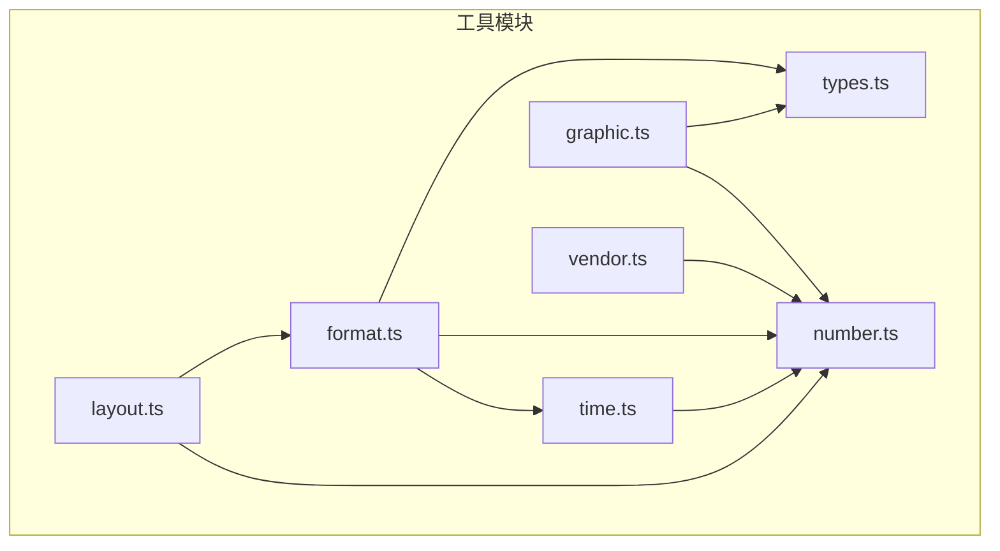
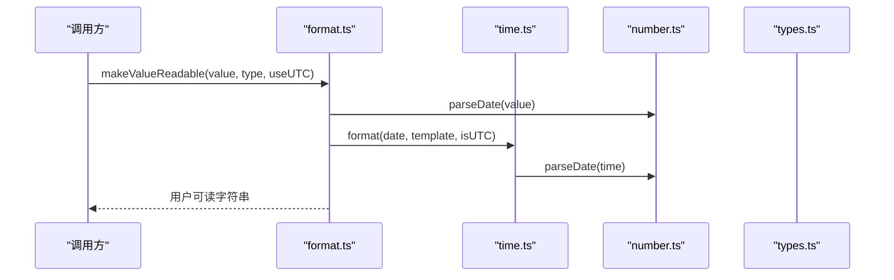
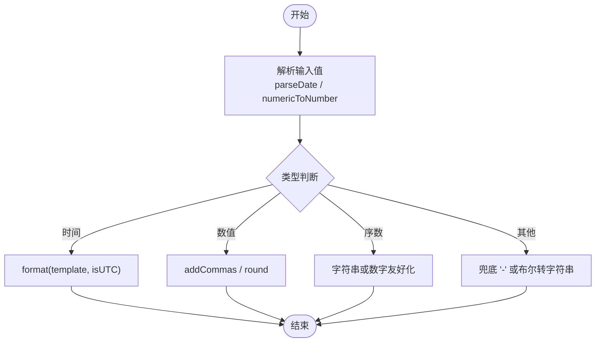
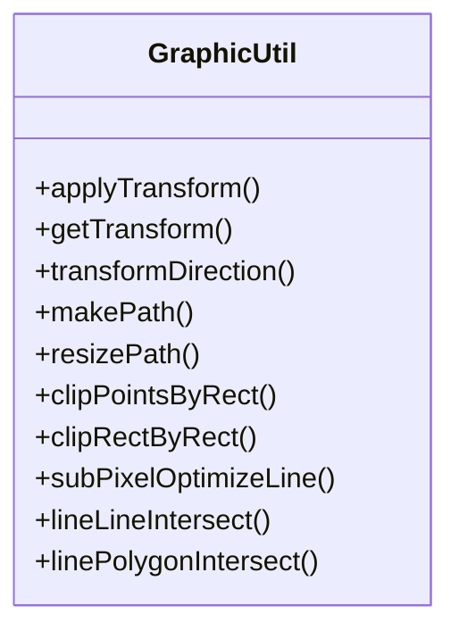
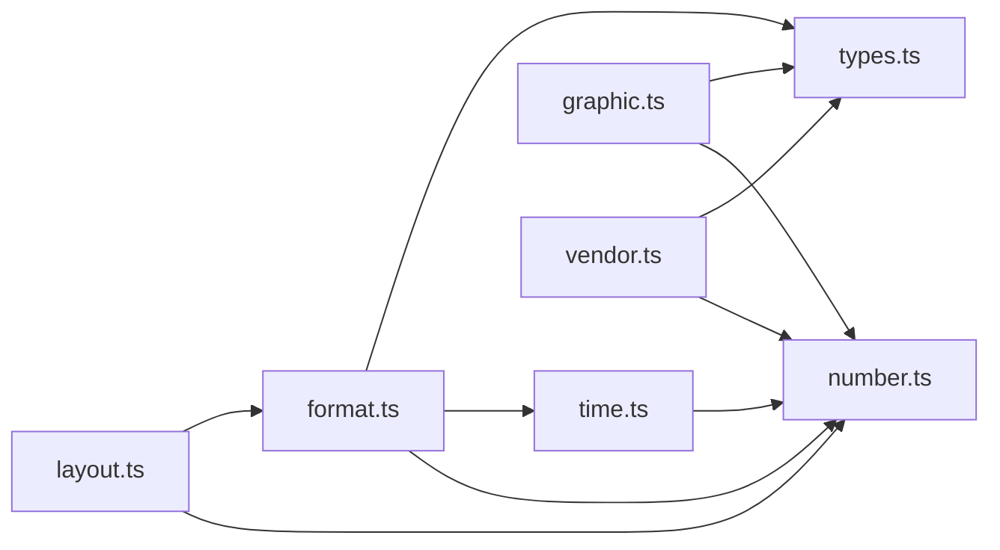

# 工具方法

<cite>
**本文引用的文件**   
- [src/util/format.ts](file://src/util/format.ts)
- [src/util/time.ts](file://src/util/time.ts)
- [src/util/number.ts](file://src/util/number.ts)
- [src/util/graphic.ts](file://src/util/graphic.ts)
- [src/util/layout.ts](file://src/util/layout.ts)
- [src/util/vendor.ts](file://src/util/vendor.ts)
- [src/util/types.ts](file://src/util/types.ts)
</cite>

## 目录
1. [简介](#简介)
2. [项目结构](#项目结构)
3. [核心组件](#核心组件)
4. [架构总览](#架构总览)
5. [详细组件分析](#详细组件分析)
6. [依赖分析](#依赖分析)
7. [性能考虑](#性能考虑)
8. [故障排查指南](#故障排查指南)
9. [结论](#结论)
10. [附录](#附录)

## 简介
本参考文档聚焦 ECharts 工具方法，覆盖以下能力：
- 数据格式化：数字、时间、百分比与模板渲染等
- 图形计算：坐标转换、尺寸计算、路径生成与裁剪等
- 数据处理辅助：数组操作、对象处理、类型判断等
- 颜色处理：颜色解析、混合、渐变（通过类型与映射）
- 数学计算：统计函数、几何计算、精度控制等

文档提供函数签名、参数说明与返回值示例，并辅以架构图与时序图帮助理解。

## 项目结构
ECharts 的工具方法主要位于 src/util 目录，按职责划分：
- format.ts：通用格式化（数字千分位、模板、可读化、颜色字符串化等）
- time.ts：时间解析与格式化、时间单位判定、刻度层级格式化
- number.ts：数值运算、精度控制、区间处理、统计与“美观”刻度
- graphic.ts：图形元素创建、变换、路径、裁剪、像素对齐优化
- layout.ts：布局计算、盒模型定位、圆形布局、比例保持
- vendor.ts：TypedArray 兼容与内存分配策略
- types.ts：公共类型定义（颜色、矩形、事件、维度等）

图表来源
- [src/util/format.ts:20-27](file://src/util/format.ts#L20-L27)
- [src/util/time.ts:20-35](file://src/util/time.ts#L20-L35)
- [src/util/graphic.ts:20-49](file://src/util/graphic.ts#L20-L49)
- [src/util/layout.ts:20-36](file://src/util/layout.ts#L20-L36)
- [src/util/vendor.ts:20-24](file://src/util/vendor.ts#L20-L24)
- [src/util/types.ts:65-97](file://src/util/types.ts#L65-L97)

章节来源
- [src/util/format.ts:20-27](file://src/util/format.ts#L20-L27)
- [src/util/time.ts:20-35](file://src/util/time.ts#L20-L35)
- [src/util/graphic.ts:20-49](file://src/util/graphic.ts#L20-L49)
- [src/util/layout.ts:20-36](file://src/util/layout.ts#L20-L36)
- [src/util/vendor.ts:20-24](file://src/util/vendor.ts#L20-L24)
- [src/util/types.ts:65-97](file://src/util/types.ts#L65-L97)

## 核心组件
- 数据格式化
  - 数字：addCommas、makeValueReadable、convertToColorString
  - 时间：parseDate、format、leveledFormat、getUnitFromValue、roundTime
  - 百分比：parsePositionOption、parsePositionSizeOption、getPercentSeats/getPercentWithPrecision
  - 模板：formatTpl、formatTplSimple、getTooltipMarker
- 图形计算
  - 变换：applyTransform、getTransform、transformDirection
  - 路径：extendPath、makePath、resizePath、mergePath
  - 裁剪：clipPointsByRect、clipRectByRect
  - 像素优化：subPixelOptimizeLine、subPixelOptimizeRect、subPixelOptimize
- 数据处理辅助
  - 数组/对象：asc、reformIntervals、ensureCopyRect/ensureCopyTransform
  - 类型判断：isNumeric、numericToNumber、isRadianAroundZero
- 颜色处理
  - 类型：ColorString、ZRColor（含渐变）
  - 转换：convertToColorString
- 数学计算
  - 线性映射：linearMap
  - 精度：round、getPrecision/getPrecisionSafe、getAcceptableTickPrecision
  - 统计：quantile、nice
  - 几何：remRadian、lineLineIntersect、linePolygonIntersect

章节来源
- [src/util/format.ts:32-336](file://src/util/format.ts#L32-L336)
- [src/util/time.ts:277-469](file://src/util/time.ts#L277-L469)
- [src/util/number.ts:67-120,219-247,339-369,382-448,454-473,613-688,716-756,774-787:67-120](file://src/util/number.ts#L67-L120)
- [src/util/graphic.ts:125-198,273-364,449-482,517-569,608-673:125-198](file://src/util/graphic.ts#L125-L198)
- [src/util/layout.ts:263-435,568-636:263-435](file://src/util/layout.ts#L263-L435)
- [src/util/vendor.ts:62-134](file://src/util/vendor.ts#L62-L134)
- [src/util/types.ts:65-97](file://src/util/types.ts#L65-L97)

## 架构总览
工具模块之间的调用关系如下：
- format 依赖 number、time、types
- time 依赖 number、types
- graphic 依赖 number、types、zrender 图形库
- layout 依赖 number、format、types
- vendor 依赖 number、types
- types 为全局类型定义中心

图表来源
- [src/util/format.ts:64-107](file://src/util/format.ts#L64-L107)
- [src/util/time.ts:277-329](file://src/util/time.ts#L277-L329)
- [src/util/number.ts:502-561](file://src/util/number.ts#L502-L561)
- [src/util/types.ts:65-97](file://src/util/types.ts#L65-L97)

## 详细组件分析

### 数据格式化
- 数字格式化
  - addCommas(x): 为数字添加千分位分隔符；非数字返回原字符串或占位符
  - makeValueReadable(value, valueType, useUTC): 将值转为对终端友好的显示文本，支持时间、序数、数值与布尔
  - convertToColorString(color, defaultColor): 将颜色或渐变的第一个色标转为字符串，否则返回默认色
- 时间格式化
  - parseDate(value): 解析多种日期格式（ISO、本地、带时区），返回 Date 或无效日期
  - format(time, template, isUTC, lang?): 基于模板输出时间字符串，支持本地/UTC 与国际化月名/星期
  - getUnitFromValue(value, isUTC): 根据时间分量推断主时间单位（年/月/日/时/分/秒/毫秒）
  - roundTime(date, unit, isUTC): 将时间舍入到指定单位的起始点
  - leveledFormat(tick, idx, formatter, lang, isUTC): 按刻度层级选择模板并格式化
- 百分比计算
  - parsePositionOption(option, percentBase, percentOffset?): 解析位置/尺寸选项，支持 center/left/right/top/bottom 与百分比
  - parsePositionSizeOption(option, percentBase, percentOffset?): 解析数字、百分比或字符串
  - getPercentSeats(valueList, precision)/getPercentWithPrecision(valueList, idx, precision): 最大余数法保证百分比总和为 100%
- 模板与标记
  - formatTpl(tpl, paramsList, encode?): 多系列模板替换，支持变量别名 a..g 及 HTML 转义
  - formatTplSimple(tpl, param, encode?): 简单键值替换
  - getTooltipMarker(color/opt): 生成提示项标记（HTML 或富文本）

图表来源
- [src/util/format.ts:64-107](file://src/util/format.ts#L64-L107)
- [src/util/time.ts:277-329](file://src/util/time.ts#L277-L329)
- [src/util/number.ts:502-561](file://src/util/number.ts#L502-L561)

章节来源
- [src/util/format.ts:32-336](file://src/util/format.ts#L32-L336)
- [src/util/time.ts:277-469](file://src/util/time.ts#L277-L469)
- [src/util/number.ts:132-175,382-448:132-175](file://src/util/number.ts#L132-L175)

### 图形计算工具
- 坐标与变换
  - applyTransform(target, transform, invert?): 对顶点应用变换矩阵或 Transformable 配置
  - getTransform(target, ancestor?): 获取目标相对祖先的累积变换矩阵
  - transformDirection(dir, transform, invert?): 方向在变换后的近似轴向判断
- 路径与图形
  - extendPath(pathData, opts): 扩展路径类
  - makePath(pathData, opts, rect, layout?): 从 SVG path 字符串创建路径并适配矩形
  - resizePath(path, rect): 缩放路径以适配目标矩形
  - mergePath(...): 合并多个路径
- 裁剪与像素优化
  - clipPointsByRect(points, rect): 将点集裁剪到矩形内
  - clipRectByRect(targetRect, rect): 计算两矩形交集
  - subPixelOptimizeLine/Rect/(): Canvas 亚像素对齐优化
- 几何与相交
  - lineLineIntersect(a1,a2,b1,b2): 线段相交判断
  - linePolygonIntersect(line, points): 线段与多边形边相交判断

图表来源
- [src/util/graphic.ts:351-394,184-198,273-283,449-482,517-569:351-394](file://src/util/graphic.ts#L351-L394)

章节来源
- [src/util/graphic.ts:125-198,273-364,449-482,517-569,608-673:125-198](file://src/util/graphic.ts#L125-L198)

### 数据处理辅助函数
- 数组与区间
  - asc(arr): 原地升序排序
  - reformIntervals(list): 区间排序与重叠拆分
- 对象与拷贝
  - ensureCopyRect(out, source): 复制或创建 BoundingRect
  - ensureCopyTransform(out, source): 复制或创建变换矩阵
- 类型判断
  - isNumeric(val): 是否为可解析的数字
  - numericToNumber(val): 安全转换为数字，非法返回 NaN
  - isRadianAroundZero(val): 弧度接近零的判断

章节来源
- [src/util/number.ts:253-258,716-756,774-787:253-258](file://src/util/number.ts#L253-L258)
- [src/util/graphic.ts:763-784](file://src/util/graphic.ts#L763-L784)

### 颜色处理工具
- 类型
  - ColorString: 颜色字符串
  - ZRColor: 颜色字符串或渐变/图案对象
- 转换
  - convertToColorString(color, defaultColor): 提取渐变的第一个色标或返回默认色

章节来源
- [src/util/types.ts:81-82](file://src/util/types.ts#L81-L82)
- [src/util/format.ts:302-313](file://src/util/format.ts#L302-L313)

### 数学计算工具
- 线性映射
  - linearMap(val, domain, range, clamp?): 值域映射，支持边界钳制与精度保护
- 精度控制
  - round(x, precision, returnStr?): 固定精度舍入，避免科学计数法
  - getPrecision/getPrecisionSafe(val): 获取小数位数
  - getAcceptableTickPrecision(dataExtent, pxSpan, pxDiffAcceptable?): 根据像素误差选择合适的数据精度
- 统计与“美观”刻度
  - quantile(ascArr, p): 分位数计算
  - nice(val, mode?): 生成“美观”刻度值
- 几何与角度
  - remRadian(radian): 归一化弧度到 [0, 2π]
  - lineLineIntersect/linePolygonIntersect: 几何相交

章节来源
- [src/util/number.ts:67-120,219-247,339-369,613-688,470-473:67-120](file://src/util/number.ts#L67-L120)
- [src/util/graphic.ts:517-569](file://src/util/graphic.ts#L517-L569)

## 依赖分析
- format.ts 依赖 number.ts（parseDate、isNumeric）、time.ts（format/pad）、types.ts（类型）
- time.ts 依赖 number.ts（parseDate）、types.ts（ScaleTick 等）
- graphic.ts 依赖 number.ts（mathMin/Max/Abs）、types.ts（样式/矩形）
- layout.ts 依赖 number.ts（parsePositionOption）、format.ts（normalizeCssArray）、types.ts（布局选项）
- vendor.ts 依赖 number.ts（MAX_SAFE_INTEGER）、types.ts（UNDEFINED_STR）

图表来源
- [src/util/format.ts:20-27](file://src/util/format.ts#L20-L27)
- [src/util/time.ts:20-35](file://src/util/time.ts#L20-L35)
- [src/util/graphic.ts:20-49](file://src/util/graphic.ts#L20-L49)
- [src/util/layout.ts:20-36](file://src/util/layout.ts#L20-L36)
- [src/util/vendor.ts:20-24](file://src/util/vendor.ts#L20-L24)

章节来源
- [src/util/format.ts:20-27](file://src/util/format.ts#L20-L27)
- [src/util/time.ts:20-35](file://src/util/time.ts#L20-L35)
- [src/util/graphic.ts:20-49](file://src/util/graphic.ts#L20-L49)
- [src/util/layout.ts:20-36](file://src/util/layout.ts#L20-L36)
- [src/util/vendor.ts:20-24](file://src/util/vendor.ts#L20-L24)

## 性能考虑
- 使用 TypedArray 优先：vendor.ts 的 tryEnsureTypedArray 在可用时采用 TypedArray，失败回退普通数组，避免 OOM
- 高精度场景：number.ts 的 getAcceptableTickPrecision 依据像素跨度选择合适精度，减少不必要的舍入误差
- 热点路径：linearMap 内部对边界与精度做了特判，避免极端情况下的精度问题
- 图形绘制：subPixelOptimize* 系列提升 Canvas 线条/矩形的清晰度，减少锯齿

章节来源
- [src/util/vendor.ts:86-134](file://src/util/vendor.ts#L86-L134)
- [src/util/number.ts:339-369](file://src/util/number.ts#L339-L369)
- [src/util/number.ts:67-120](file://src/util/number.ts#L67-L120)
- [src/util/graphic.ts:288-321](file://src/util/graphic.ts#L288-L321)

## 故障排查指南
- 时间解析异常
  - 现象：format 输出 “-” 或无效时间
  - 排查：检查 parseDate 是否返回有效 Date；确认 isUTC 与模板匹配
  - 参考：[src/util/time.ts:277-329](file://src/util/time.ts#L277-L329), [src/util/number.ts:502-561](file://src/util/number.ts#L502-L561)
- 百分比总和不等于 100%
  - 现象：饼图等百分比显示不一致
  - 排查：使用 getPercentSeats/getPercentWithPrecision 确保总和为 100%
  - 参考：[src/util/number.ts:382-448](file://src/util/number.ts#L382-L448)
- 数值精度导致显示错位
  - 现象：刻度或标签偏移
  - 排查：使用 getAcceptableTickPrecision 选择合适精度；必要时用 round 控制
  - 参考：[src/util/number.ts:339-369](file://src/util/number.ts#L339-L369), [src/util/number.ts:219-247](file://src/util/number.ts#L219-L247)
- 图形裁剪异常
  - 现象：元素被错误裁剪或溢出
  - 排查：检查 clipRectByRect/clipPointsByRect 的输入矩形与变换
  - 参考：[src/util/graphic.ts:449-482](file://src/util/graphic.ts#L449-L482)
- 颜色未生效
  - 现象：渐变不显示或颜色不正确
  - 排查：convertToColorString 仅取第一个色标；确认传入的是合法 ZRColor
  - 参考：[src/util/format.ts:302-313](file://src/util/format.ts#L302-L313), [src/util/types.ts:81-82](file://src/util/types.ts#L81-L82)

章节来源
- [src/util/time.ts:277-329](file://src/util/time.ts#L277-L329)
- [src/util/number.ts:382-448](file://src/util/number.ts#L382-L448)
- [src/util/number.ts:339-369](file://src/util/number.ts#L339-L369)
- [src/util/graphic.ts:449-482](file://src/util/graphic.ts#L449-L482)
- [src/util/format.ts:302-313](file://src/util/format.ts#L302-L313)

## 结论
ECharts 工具方法围绕“格式化、计算、布局、图形、类型”五大维度构建，提供了稳定且高性能的基础能力。通过统一的类型系统与模块化设计，各工具之间耦合低、复用度高，便于扩展与维护。在实际使用中，建议：
- 优先使用内置的时间与数字工具，避免重复造轮子
- 在高精度与大数据量场景下，关注精度与内存分配策略
- 图形相关计算尽量借助 graphic.ts 提供的变换与裁剪工具，保证一致性与性能

## 附录
- 常用函数速查
  - 格式化：addCommas、makeValueReadable、format、leveledFormat、formatTpl、getTooltipMarker
  - 时间：parseDate、getUnitFromValue、roundTime
  - 百分比：parsePositionOption、parsePositionSizeOption、getPercentSeats
  - 图形：applyTransform、makePath、resizePath、clipRectByRect、subPixelOptimizeLine
  - 数学：linearMap、round、getAcceptableTickPrecision、quantile、nice、remRadian
  - 类型：isNumeric、numericToNumber、ColorString/ZRColor

章节来源
- [src/util/format.ts:32-336](file://src/util/format.ts#L32-L336)
- [src/util/time.ts:277-469](file://src/util/time.ts#L277-L469)
- [src/util/number.ts:67-120,219-247,339-369,382-448,470-473,613-688,716-756,774-787:67-120](file://src/util/number.ts#L67-L120)
- [src/util/graphic.ts:184-198,273-283,449-482,517-569,288-321:184-198](file://src/util/graphic.ts#L184-L198)
- [src/util/types.ts:81-82](file://src/util/types.ts#L81-L82)