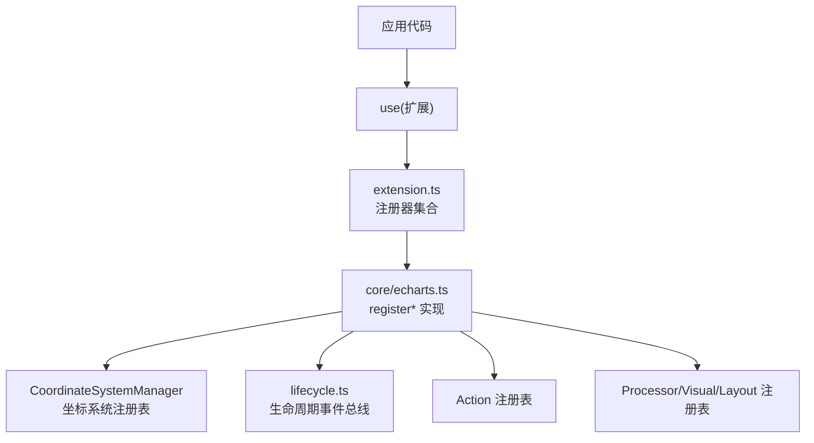
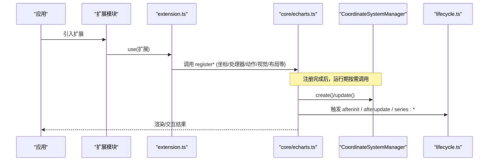
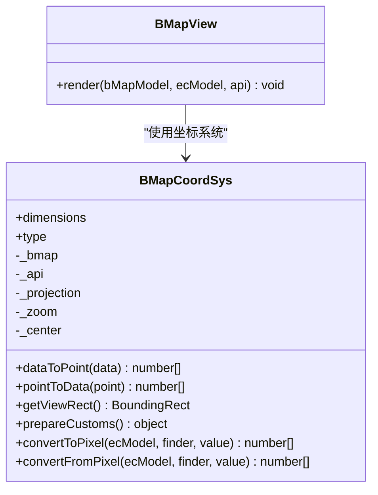
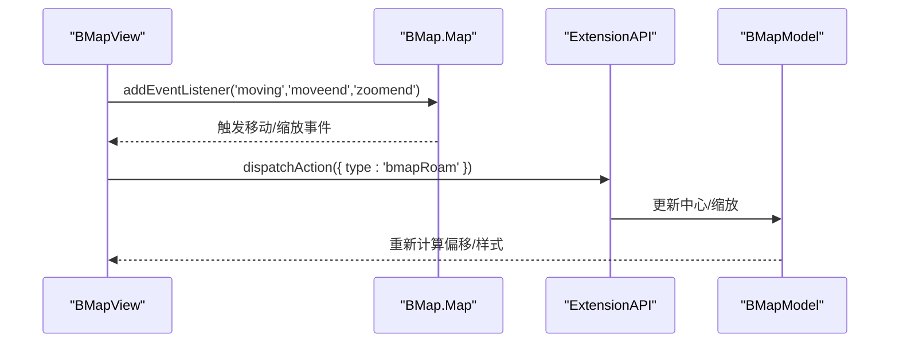
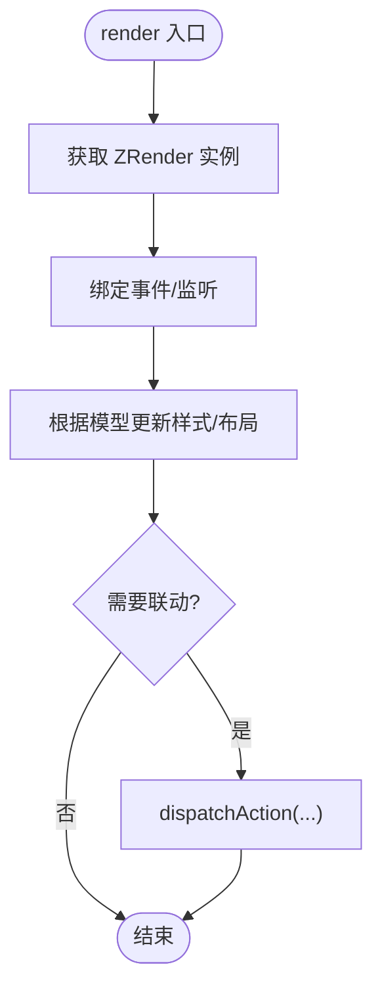
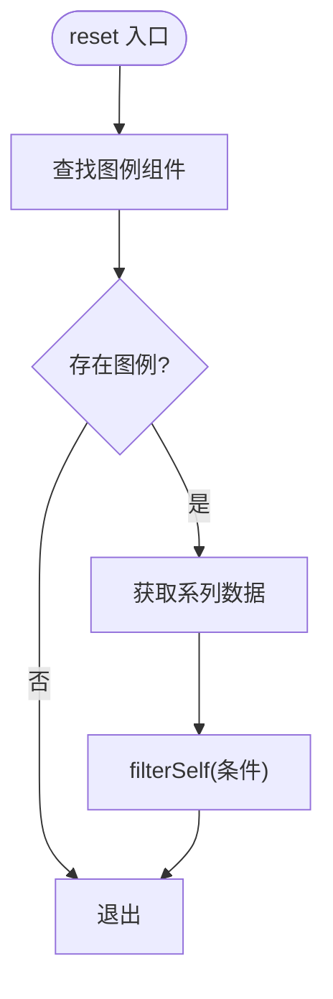
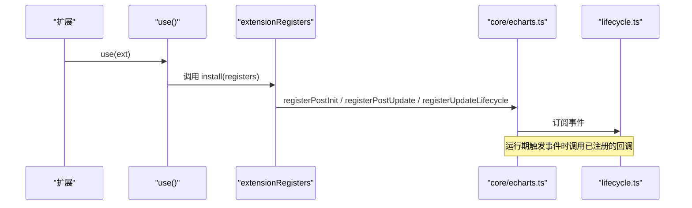
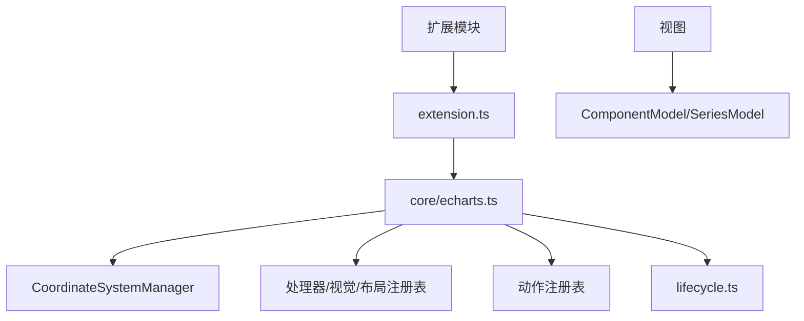

# 扩展 API

<cite>
**本文引用的文件**
- [src/core/ExtensionAPI.ts](file://src/core/ExtensionAPI.ts)
- [src/core/lifecycle.ts](file://src/core/lifecycle.ts)
- [src/core/CoordinateSystem.ts](file://src/core/CoordinateSystem.ts)
- [src/extension.ts](file://src/extension.ts)
- [src/core/echarts.ts](file://src/core/echarts.ts)
- [extension-src/bmap/BMapCoordSys.ts](file://extension-src/bmap/BMapCoordSys.ts)
- [extension-src/bmap/BMapView.ts](file://extension-src/bmap/BMapView.ts)
- [extension-src/bmap/bmap.ts](file://extension-src/bmap/bmap.ts)
- [src/model/Component.ts](file://src/model/Component.ts)
- [src/processor/dataFilter.ts](file://src/processor/dataFilter.ts)
</cite>

## 目录
1. [简介](#简介)
2. [项目结构](#项目结构)
3. [核心组件](#核心组件)
4. [架构总览](#架构总览)
5. [详细组件分析](#详细组件分析)
6. [依赖关系分析](#依赖关系分析)
7. [性能考量](#性能考量)
8. [故障排查指南](#故障排查指南)
9. [结论](#结论)
10. [附录](#附录)

## 简介
本文件面向 ECharts 扩展开发者，系统化说明 ExtensionAPI 提供的扩展接口与方法，覆盖坐标系扩展、视图扩展、处理器扩展的开发指南；解释插件注册机制与生命周期管理；提供自定义图表、组件、处理器的开发示例；阐述扩展间通信与数据共享方式；并给出最佳实践、性能优化建议以及完整的开发与调试流程。

## 项目结构
ECharts 的扩展能力由“注册中心 + 生命周期钩子 + 扩展点”构成：
- 注册中心：统一暴露 register* 系列方法（如 registerCoordinateSystem、registerAction、registerProcessor 等），供外部扩展调用。
- 生命周期：通过 lifecycle 事件在关键阶段触发回调（如 afterinit、afterupdate、series:* 等）。
- 扩展点：坐标系统、视图、处理器、视觉编码、布局、加载效果、地图、动作等。

图示来源
- [src/extension.ts:49-92](file://src/extension.ts#L49-L92)
- [src/core/echarts.ts:3091-3195](file://src/core/echarts.ts#L3091-L3195)
- [src/core/CoordinateSystem.ts:95-105](file://src/core/CoordinateSystem.ts#L95-L105)

章节来源
- [src/extension.ts:1-129](file://src/extension.ts#L1-L129)
- [src/core/echarts.ts:3068-3195](file://src/core/echarts.ts#L3068-L3195)

## 核心组件
- ExtensionAPI：扩展点内可访问的运行时 API 封装，绑定实例方法（如 getDom、getZr、getWidth、getHeight、dispatchAction、on/off、getOption 等），并提供抽象方法用于获取坐标系统、模型视图映射、高亮/选择/模糊状态切换等。
- 坐标系统管理器：维护普通与非序列盒型坐标系统的创建与更新，支持按类型注册与查询。
- 生命周期事件总线：提供 afterinit、coordsys:aftercreate、series:beforeupdate、series:layoutlabels、series:transition、series:afterupdate、afterupdate 等事件。
- 扩展注册入口：通过 use 接收扩展函数或对象，统一注入注册器集合，完成各类扩展点的注册。

章节来源
- [src/core/ExtensionAPI.ts:32-86](file://src/core/ExtensionAPI.ts#L32-L86)
- [src/core/CoordinateSystem.ts:47-105](file://src/core/CoordinateSystem.ts#L47-L105)
- [src/core/lifecycle.ts:55-72](file://src/core/lifecycle.ts#L55-L72)
- [src/extension.ts:49-123](file://src/extension.ts#L49-L123)

## 架构总览
下图展示了扩展从注册到执行的关键路径：扩展通过 use 注册，内部调用 core/echarts 的 register* 方法，将扩展点写入对应注册表；运行期由调度器在合适时机调用这些扩展（如坐标系统 create/update、处理器 reset、动作 handler 等），并通过 ExtensionAPI 与全局模型交互。

图示来源
- [src/extension.ts:101-123](file://src/extension.ts#L101-L123)
- [src/core/echarts.ts:3091-3195](file://src/core/echarts.ts#L3091-L3195)
- [src/core/CoordinateSystem.ts:59-89](file://src/core/CoordinateSystem.ts#L59-L89)
- [src/core/lifecycle.ts:55-72](file://src/core/lifecycle.ts#L55-L72)

## 详细组件分析

### 坐标系扩展（以 BMap 为例）
- 目标：为 ECharts 接入百度地图坐标系，使系列数据能在地图上以经纬度进行定位与交互。
- 关键点：
  - 定义坐标系统类，实现 dataToPoint、pointToData、getViewRect、prepareCustoms、convertToPixel/FromPixel 等方法。
  - 通过 registerCoordinateSystem('bmap', creator) 注册坐标系统。
  - 在 create 中初始化底层地图实例、叠加层、设置中心与缩放，并将坐标系统挂载到模型。
  - 视图负责监听地图移动/缩放事件，同步偏移并派发 roam 动作，驱动联动更新。

图示来源
- [extension-src/bmap/BMapCoordSys.ts:106-223](file://extension-src/bmap/BMapCoordSys.ts#L106-L223)
- [extension-src/bmap/BMapView.ts:34-150](file://extension-src/bmap/BMapView.ts#L34-L150)

图示来源
- [extension-src/bmap/BMapView.ts:41-98](file://extension-src/bmap/BMapView.ts#L41-L98)
- [extension-src/bmap/bmap.ts:30-40](file://extension-src/bmap/bmap.ts#L30-L40)

开发要点
- 坐标系统需声明维度（如 lng/lat），并提供数据与像素的双向转换。
- prepareCustoms 返回 coordSys 与 api，供自定义系列渲染时使用。
- 视图应正确处理地图事件，避免重复渲染，并在必要时派发动作以触发联动。

章节来源
- [extension-src/bmap/BMapCoordSys.ts:101-351](file://extension-src/bmap/BMapCoordSys.ts#L101-L351)
- [extension-src/bmap/BMapView.ts:1-151](file://extension-src/bmap/BMapView.ts#L1-L151)
- [extension-src/bmap/bmap.ts:1-43](file://extension-src/bmap/bmap.ts#L1-L43)

### 视图扩展（通用组件视图）
- 目标：为自定义组件提供视图渲染与交互逻辑。
- 关键点：
  - 继承 extendComponentView 提供的原型方法，实现 render(model, ecModel, api)。
  - 通过 api.getZr() 获取画布实例，操作 DOM 或图形元素。
  - 通过 api.dispatchAction 触发动作，驱动其他组件联动。

图示来源
- [extension-src/bmap/BMapView.ts:41-150](file://extension-src/bmap/BMapView.ts#L41-L150)

章节来源
- [extension-src/bmap/BMapView.ts:1-151](file://extension-src/bmap/BMapView.ts#L1-L151)

### 处理器扩展（数据预处理/后处理）
- 目标：对系列数据进行过滤、采样、堆叠、负值过滤等处理。
- 关键点：
  - 通过 registerProcessor 注册处理器，指定优先级与适用系列类型。
  - 在 reset(seriesModel, ecModel) 中读取/修改数据，例如基于图例选择过滤数据。

图示来源
- [src/processor/dataFilter.ts:22-45](file://src/processor/dataFilter.ts#L22-L45)

章节来源
- [src/processor/dataFilter.ts:1-46](file://src/processor/dataFilter.ts#L1-L46)
- [src/core/echarts.ts:3068-3072](file://src/core/echarts.ts#L3068-L3072)

### 插件注册机制与生命周期管理
- 注册机制：
  - 通过 extension.ts 暴露的 extensionRegisters，集中提供 register* 方法，便于扩展统一注册。
  - use 支持传入函数或对象形式，内部统一包装并调用 install(extensionRegisters)。
- 生命周期：
  - 通过 registerUpdateLifecycle 注册生命周期回调，支持 afterinit、afterupdate、series:* 等。
  - 也可通过 registerPostInit/registerPostUpdate 便捷注册常用生命周期。

图示来源
- [src/extension.ts:49-123](file://src/extension.ts#L49-L123)
- [src/core/echarts.ts:3079-3095](file://src/core/echarts.ts#L3079-L3095)
- [src/core/lifecycle.ts:55-72](file://src/core/lifecycle.ts#L55-L72)

章节来源
- [src/extension.ts:1-129](file://src/extension.ts#L1-L129)
- [src/core/echarts.ts:3079-3095](file://src/core/echarts.ts#L3079-L3095)
- [src/core/lifecycle.ts:1-74](file://src/core/lifecycle.ts#L1-L74)

### 自定义图表、组件、处理器的开发示例
- 自定义坐标系：参考 BMap 坐标系统，实现坐标转换、视图矩形、prepareCustoms，并通过 registerCoordinateSystem 注册。
- 自定义组件视图：继承 extendComponentView，实现 render，绑定事件，派发动作。
- 自定义处理器：实现 reset(seriesModel, ecModel)，通过 registerProcessor 注册，控制数据流。
- 自定义动作：通过 registerAction 注册动作类型与处理器，配合 update 策略驱动视图更新。

章节来源
- [extension-src/bmap/BMapCoordSys.ts:266-351](file://extension-src/bmap/BMapCoordSys.ts#L266-L351)
- [extension-src/bmap/BMapView.ts:34-150](file://extension-src/bmap/BMapView.ts#L34-L150)
- [src/processor/dataFilter.ts:22-45](file://src/processor/dataFilter.ts#L22-L45)
- [src/core/echarts.ts:3114-3195](file://src/core/echarts.ts#L3114-L3195)

### 扩展间的通信机制与数据共享
- 动作与事件：通过 api.dispatchAction 发送动作，配合 registerAction 定义处理器；动作可触发 update 流程，进而发布事件供其他扩展订阅。
- 生命周期事件：通过 lifecycle 事件在关键阶段通知各扩展，实现松耦合通信。
- 模型与视图：通过 ExtensionAPI 获取 GlobalModel、SeriesModel、ComponentModel 及其视图，读写配置与状态。
- 坐标系统与数据：坐标系统提供 dataToPoint/pointToData 等转换，prepareCustoms 暴露给自定义系列使用的辅助方法。

图示来源
- [src/core/echarts.ts:3114-3195](file://src/core/echarts.ts#L3114-L3195)
- [src/core/lifecycle.ts:55-72](file://src/core/lifecycle.ts#L55-L72)
- [src/core/ExtensionAPI.ts:32-86](file://src/core/ExtensionAPI.ts#L32-L86)

章节来源
- [src/core/echarts.ts:3114-3195](file://src/core/echarts.ts#L3114-L3195)
- [src/core/lifecycle.ts:1-74](file://src/core/lifecycle.ts#L1-L74)
- [src/core/ExtensionAPI.ts:1-98](file://src/core/ExtensionAPI.ts#L1-L98)

## 依赖关系分析
- 扩展模块依赖 extension.ts 提供的注册器集合，间接依赖 core/echarts.ts 的具体实现。
- 坐标系统依赖 CoordinateSystemManager 进行注册与管理。
- 处理器/视觉/布局等扩展依赖各自的注册表与优先级体系。
- 视图与模型通过 ComponentModel 基类建立关系，支持布局模式与默认选项合并。

图示来源
- [src/extension.ts:49-92](file://src/extension.ts#L49-L92)
- [src/core/echarts.ts:3068-3195](file://src/core/echarts.ts#L3068-L3195)
- [src/core/CoordinateSystem.ts:95-105](file://src/core/CoordinateSystem.ts#L95-L105)
- [src/model/Component.ts:53-152](file://src/model/Component.ts#L53-L152)

章节来源
- [src/extension.ts:1-129](file://src/extension.ts#L1-L129)
- [src/core/echarts.ts:3068-3195](file://src/core/echarts.ts#L3068-L3195)
- [src/model/Component.ts:1-200](file://src/model/Component.ts#L1-L200)

## 性能考量
- 优先使用轻量级处理器：数据过滤/采样应在必要阶段执行，避免阻塞主流程。
- 减少不必要的重绘：视图监听地图事件时，仅在偏移变化时更新样式，避免频繁 DOM 操作。
- 合理使用生命周期：仅注册必要的生命周期回调，避免在高频事件中做重型计算。
- 坐标转换优化：如 Mercator 投影较慢，可在必要时缓存或简化计算路径。
- 批量动作：利用 dispatchAction 的 batch 能力合并多次更新，降低调度开销。

[本节为通用指导，不直接分析具体文件]

## 故障排查指南
- 坐标系统未找到：检查是否在 setOption 前正确注册了坐标系统，并确保系列 coordinateSystem 名称一致。
- 动作未生效：确认 registerAction 的类型与 dispatchAction 的 type 一致，且 update 策略正确。
- 视图未更新：检查是否通过 api.dispatchAction 触发更新流程，或是否正确绑定了事件。
- 生命周期未触发：确认已通过 registerUpdateLifecycle 注册相应事件，且运行期确实进入对应阶段。
- 地图扩展报错：确保 BMap 库已加载，且只存在一个 bmap 组件实例。

章节来源
- [extension-src/bmap/BMapCoordSys.ts:266-351](file://extension-src/bmap/BMapCoordSys.ts#L266-L351)
- [src/core/echarts.ts:3114-3195](file://src/core/echarts.ts#L3114-L3195)
- [src/core/lifecycle.ts:55-72](file://src/core/lifecycle.ts#L55-L72)

## 结论
ECharts 的扩展体系通过统一的注册中心、清晰的生命周期与丰富的扩展点，为开发者提供了强大的定制能力。借助 ExtensionAPI，扩展可以安全地访问运行时能力；通过坐标系统、视图、处理器、动作等扩展点，可实现从数据到渲染的全链路定制。遵循最佳实践与性能优化建议，能够构建稳定高效的可视化扩展。

[本节为总结性内容，不直接分析具体文件]

## 附录
- 完整开发流程建议：
  1) 明确扩展目标（坐标系/视图/处理器/动作/视觉/布局等）。
  2) 在扩展模块中通过 use 注册，调用相应的 register* 方法。
  3) 实现核心逻辑（坐标转换、视图渲染、数据处理、动作处理器等）。
  4) 通过生命周期事件与动作进行扩展间通信。
  5) 编写测试用例，覆盖边界场景与性能瓶颈。
  6) 文档化配置项与 API，提供示例与使用说明。
- 调试方法：
  - 使用 console.log 输出关键节点数据与状态。
  - 通过浏览器开发者工具观察 DOM/Canvas/SVG 变化。
  - 利用生命周期事件打印调用栈，定位执行顺序问题。
  - 针对地图扩展，检查地图事件绑定与偏移同步逻辑。

[本节为通用指导，不直接分析具体文件]