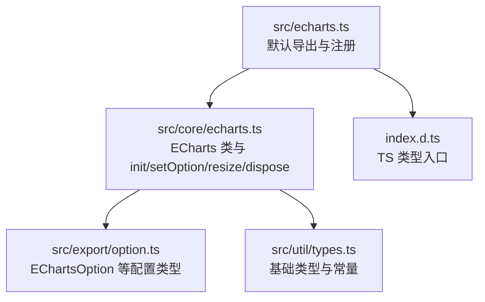
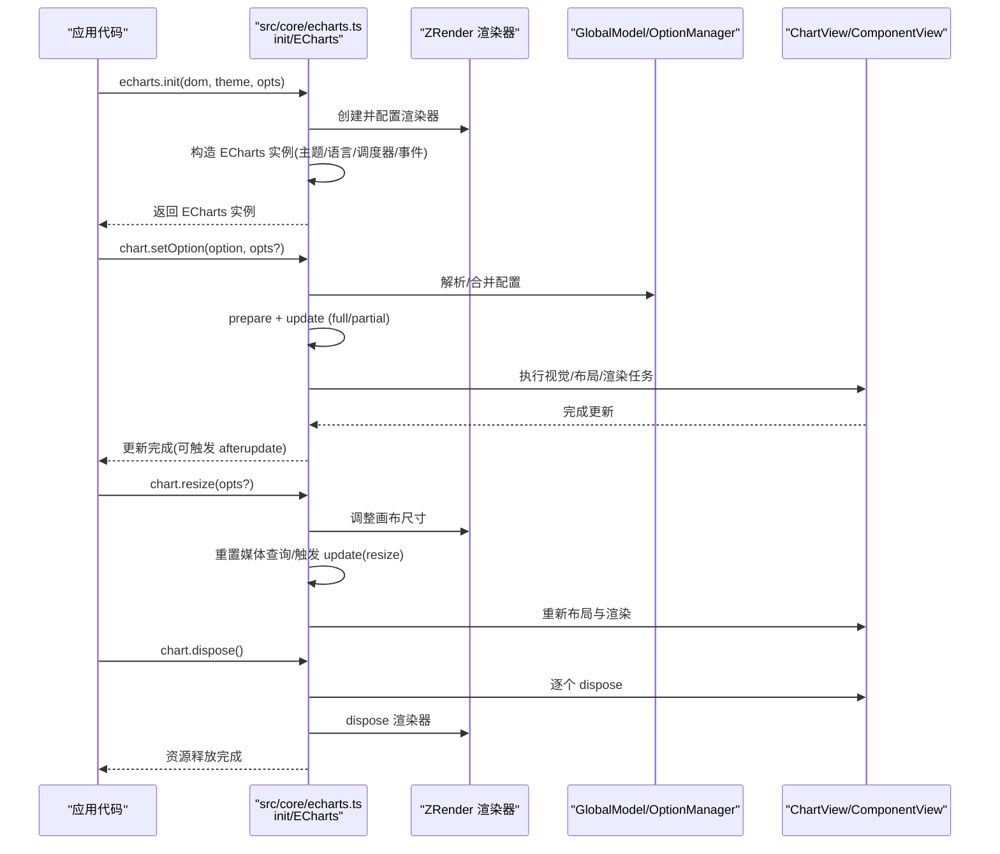
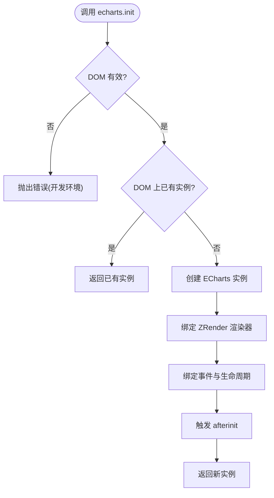
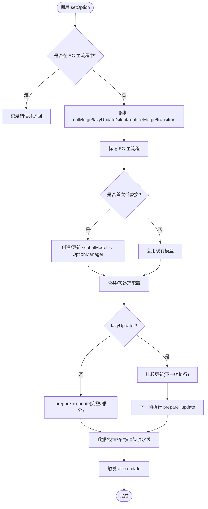
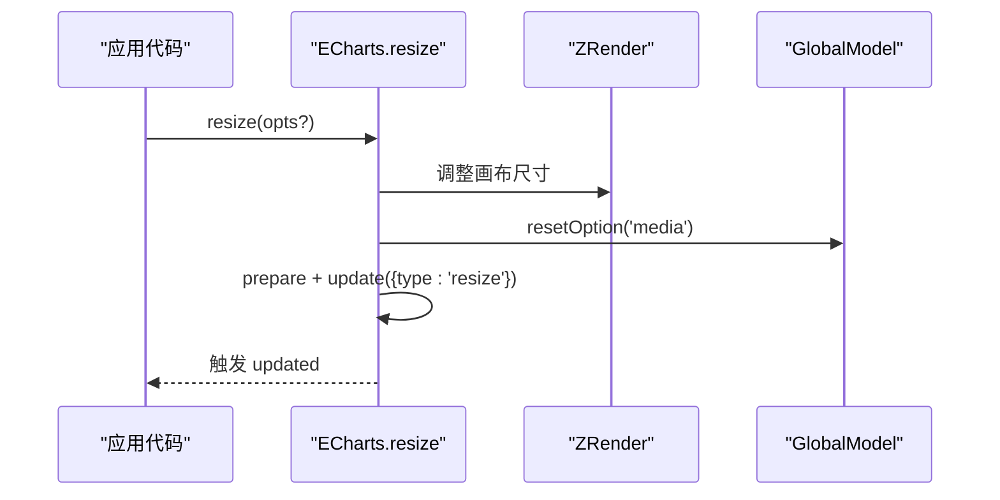
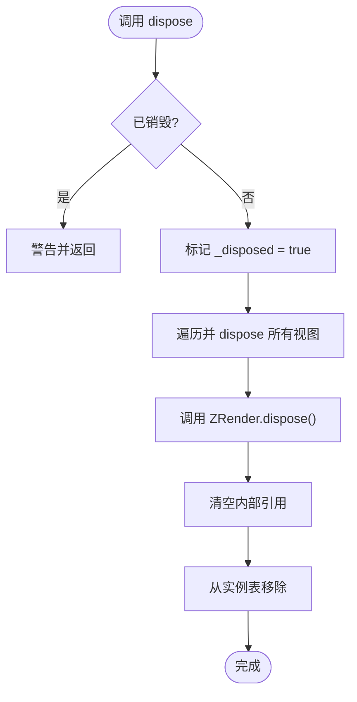
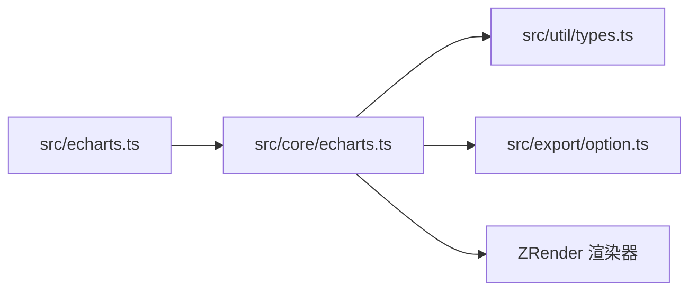

# 核心 API

<cite>
**本文引用的文件**
- [src/echarts.ts](file://src/echarts.ts)
- [src/core/echarts.ts](file://src/core/echarts.ts)
- [src/export/option.ts](file://src/export/option.ts)
- [src/util/types.ts](file://src/util/types.ts)
- [index.d.ts](file://index.d.ts)
</cite>

## 目录
1. [简介](#简介)
2. [项目结构](#项目结构)
3. [核心组件](#核心组件)
4. [架构总览](#架构总览)
5. [详细组件分析](#详细组件分析)
6. [依赖关系分析](#依赖关系分析)
7. [性能考量](#性能考量)
8. [故障排查指南](#故障排查指南)
9. [结论](#结论)
10. [附录：TypeScript 类型与示例](#附录typescript-类型与示例)

## 简介
本章节聚焦 ECharts 的核心 API，围绕以下关键点展开：
- echarts.init() 的初始化参数、配置选项与返回值
- chart.setOption() 的配置对象结构、合并策略与更新机制
- chart.dispose() 的清理操作与资源释放
- chart.resize() 的响应式调整方法
- 图表实例生命周期管理与状态控制
- 错误处理与最佳实践建议
- TypeScript 类型定义与使用指引

## 项目结构
ECharts 的核心入口与实现位于 src 目录：
- 顶层导出与默认渲染器注册：src/echarts.ts
- 核心类与 API 实现（init、setOption、resize、dispose 等）：src/core/echarts.ts
- 配置项类型聚合：src/export/option.ts
- 通用类型与常量：src/util/types.ts
- 根级类型声明入口：index.d.ts

**图示来源**
- [src/echarts.ts:20-46](file://src/echarts.ts#L20-L46)
- [src/core/echarts.ts:2927-2975](file://src/core/echarts.ts#L2927-L2975)
- [src/export/option.ts:262-297](file://src/export/option.ts#L262-L297)
- [src/util/types.ts:65-119](file://src/util/types.ts#L65-L119)
- [index.d.ts:20-35](file://index.d.ts#L20-L35)

**章节来源**
- [src/echarts.ts:20-46](file://src/echarts.ts#L20-L46)
- [src/core/echarts.ts:2927-2975](file://src/core/echarts.ts#L2927-L2975)
- [src/export/option.ts:262-297](file://src/export/option.ts#L262-L297)
- [src/util/types.ts:65-119](file://src/util/types.ts#L65-L119)
- [index.d.ts:20-35](file://index.d.ts#L20-L35)

## 核心组件
- ECharts 类：封装图表实例的生命周期、事件系统、调度器、视图与模型管理。
- 初始化函数 init：创建 ECharts 实例，绑定 ZRender 渲染器，挂载事件与生命周期钩子。
- setOption：解析并合并配置，触发完整或部分更新流程。
- resize：响应容器尺寸变化，重新布局与渲染。
- dispose：释放所有视图、模型与渲染资源，解除引用。

**章节来源**
- [src/core/echarts.ts:454-618](file://src/core/echarts.ts#L454-L618)
- [src/core/echarts.ts:741-820](file://src/core/echarts.ts#L741-L820)
- [src/core/echarts.ts:1449-1511](file://src/core/echarts.ts#L1449-L1511)
- [src/core/echarts.ts:1401-1444](file://src/core/echarts.ts#L1401-L1444)
- [src/core/echarts.ts:2927-2975](file://src/core/echarts.ts#L2927-L2975)

## 架构总览
下图展示了从调用 echarts.init 到图表渲染的关键路径，以及 setOption、resize、dispose 在生命周期中的位置。

**图示来源**
- [src/core/echarts.ts:2927-2975](file://src/core/echarts.ts#L2927-L2975)
- [src/core/echarts.ts:741-820](file://src/core/echarts.ts#L741-L820)
- [src/core/echarts.ts:1449-1511](file://src/core/echarts.ts#L1449-L1511)
- [src/core/echarts.ts:1401-1444](file://src/core/echarts.ts#L1401-L1444)

## 详细组件分析

### echarts.init()
- 作用：创建图表实例，绑定 DOM、渲染器、主题、语言、事件与生命周期钩子。
- 关键参数（opts）：
  - renderer：'canvas' | 'svg'
  - devicePixelRatio：设备像素比
  - width/height：初始宽高，支持数字或 'auto'
  - locale：国际化配置
  - useDirtyRect：是否启用脏矩形优化
  - useCoarsePointer/pointerSize：指针相关优化
  - ssr：服务端渲染模式开关
- 返回值：ECharts 实例（包含后续所有 API）。
- 行为要点：
  - 若同一 DOM 已存在实例，会返回已有实例（避免重复初始化）。
  - 开发环境下对无效 DOM 或宽高为 0 的情况给出警告。
  - 初始化后触发 afterinit 生命周期。

**图示来源**
- [src/core/echarts.ts:2927-2975](file://src/core/echarts.ts#L2927-L2975)

**章节来源**
- [src/core/echarts.ts:2927-2975](file://src/core/echarts.ts#L2927-L2975)
- [src/core/echarts.ts:520-618](file://src/core/echarts.ts#L520-L618)

### chart.setOption()
- 作用：设置或更新图表配置，支持合并与懒更新。
- 签名与参数：
  - setOption(option, notMerge?, lazyUpdate?)
  - setOption(option, { notMerge?, lazyUpdate?, silent?, replaceMerge?, transition? })
- 合并策略：
  - notMerge=false（默认）：深度合并配置，保留未覆盖的部分。
  - notMerge=true：替换式更新，仅以当前 option 为准。
  - replaceMerge：按 id 映射进行选择性替换合并（高级用法）。
- 更新机制：
  - 进入 EC 主流程标记，防止嵌套调用。
  - 首次或替换时创建/重建 GlobalModel 与 OptionManager。
  - 根据 lazyUpdate 决定立即执行还是延迟到下一帧。
  - 触发 prepare + update（完整或部分），执行数据/视觉/布局/渲染流水线。
  - 完成后触发 afterupdate 生命周期。

**图示来源**
- [src/core/echarts.ts:741-820](file://src/core/echarts.ts#L741-L820)
- [src/core/echarts.ts:620-704](file://src/core/echarts.ts#L620-L704)

**章节来源**
- [src/core/echarts.ts:741-820](file://src/core/echarts.ts#L741-L820)
- [src/core/echarts.ts:302-318](file://src/core/echarts.ts#L302-L318)

### chart.resize()
- 作用：响应容器尺寸变化，重新计算布局并渲染。
- 行为要点：
  - 委托 ZRender 调整画布尺寸。
  - 重置媒体查询（media）配置。
  - 若存在 pending 更新，则合并 silent 标志并触发准备与更新。
  - 触发 update({ type: 'resize', animation: ... })，默认禁用动画以避免抖动。
  - 完成后触发 updated 事件。

**图示来源**
- [src/core/echarts.ts:1449-1511](file://src/core/echarts.ts#L1449-L1511)

**章节来源**
- [src/core/echarts.ts:1449-1511](file://src/core/echarts.ts#L1449-L1511)

### chart.dispose()
- 作用：销毁图表实例，释放所有资源。
- 清理顺序：
  - 标记 disposed 状态。
  - 遍历并调用各 ComponentView/ChartView 的 dispose。
  - 调用 ZRender 的 dispose。
  - 清空内部引用（dom、model、views、scheduler、api、zrender 等）。
  - 从全局实例表中移除。
- 注意：已销毁实例再次调用会发出警告并直接返回。

**图示来源**
- [src/core/echarts.ts:1401-1444](file://src/core/echarts.ts#L1401-L1444)

**章节来源**
- [src/core/echarts.ts:1401-1444](file://src/core/echarts.ts#L1401-L1444)

### 图表实例生命周期与状态控制
- 生命周期阶段：
  - afterinit：实例创建完成后触发。
  - afterupdate：每次 setOption/update/resize 等更新完成后触发。
  - 自定义生命周期可通过 registerUpdateLifecycle 注册。
- 状态控制：
  - IN_EC_CYCLE_KEY：防止在渲染主流程中嵌套调用危险 API。
  - PENDING_UPDATE：懒更新队列，用于批量或异步更新。
  - CONNECT_STATUS：多图表联动时的连接状态。
  - STATUS_NEEDS_UPDATE：是否需要更新的标记。
- 事件系统：
  - 基于 ZRender 的事件转发，统一小写事件名。
  - 支持 on/off 注册与消息中心转发。

**章节来源**
- [src/core/echarts.ts:211-277](file://src/core/echarts.ts#L211-L277)
- [src/core/echarts.ts:329-353](file://src/core/echarts.ts#L329-L353)
- [src/core/echarts.ts:1290-1387](file://src/core/echarts.ts#L1290-L1387)
- [src/core/echarts.ts:3091-3095](file://src/core/echarts.ts#L3091-L3095)

## 依赖关系分析
- 入口层：src/echarts.ts 默认导出 init，并注册 CanvasRenderer 与 Dataset 组件。
- 核心层：src/core/echarts.ts 提供 ECharts 类与全部核心 API。
- 类型层：src/export/option.ts 聚合 EChartsOption 及各组件/系列配置类型；src/util/types.ts 提供基础类型与常量。
- 外部依赖：ZRender 作为底层渲染引擎，负责图形绘制与事件分发。

**图示来源**
- [src/echarts.ts:20-46](file://src/echarts.ts#L20-L46)
- [src/core/echarts.ts:19-145](file://src/core/echarts.ts#L19-L145)
- [src/export/option.ts:262-297](file://src/export/option.ts#L262-L297)
- [src/util/types.ts:65-119](file://src/util/types.ts#L65-L119)

**章节来源**
- [src/echarts.ts:20-46](file://src/echarts.ts#L20-L46)
- [src/core/echarts.ts:19-145](file://src/core/echarts.ts#L19-L145)
- [src/export/option.ts:262-297](file://src/export/option.ts#L262-L297)
- [src/util/types.ts:65-119](file://src/util/types.ts#L65-L119)

## 性能考量
- 懒更新（lazyUpdate）：高频 setOption 时使用，减少每帧多次重绘开销。
- 禁用动画（resize 默认 duration: 0）：避免频繁布局导致的闪烁。
- 脏矩形（useDirtyRect）：按需开启以提升复杂场景渲染效率。
- 流式渲染（progressive）：大数据量场景下分帧渲染，提升交互流畅度。
- 节流刷新（throttled flush）：在特定环境（如微信内置浏览器）下自动节流，避免卡顿。

[本节为通用指导，不直接分析具体文件]

## 故障排查指南
- 常见错误与警告：
  - 在 EC 主流程中调用 setOption/resize 等 API：会被阻止并记录错误。
  - DOM 无效或宽高为 0：初始化时会警告，建议在窗口加载回调中初始化。
  - 重复初始化同一 DOM：返回已有实例，避免内存泄漏。
  - 已销毁实例继续调用：发出警告并直接返回。
- 调试建议：
  - 使用 getOption() 获取当前配置，检查合并结果是否符合预期。
  - 通过 afterupdate 钩子定位更新时机与问题。
  - 使用 renderToCanvas/getDataURL 导出当前渲染结果，辅助视觉比对。

**章节来源**
- [src/core/echarts.ts:741-752](file://src/core/echarts.ts#L741-L752)
- [src/core/echarts.ts:1449-1460](file://src/core/echarts.ts#L1449-L1460)
- [src/core/echarts.ts:2933-2962](file://src/core/echarts.ts#L2933-L2962)
- [src/core/echarts.ts:1401-1406](file://src/core/echarts.ts#L1401-L1406)
- [src/core/echarts.ts:894-896](file://src/core/echarts.ts#L894-L896)
- [src/core/echarts.ts:923-938](file://src/core/echarts.ts#L923-L938)
- [src/core/echarts.ts:969-1011](file://src/core/echarts.ts#L969-L1011)

## 结论
ECharts 的核心 API 围绕 ECharts 类与 init/setOption/resize/dispose 构建，提供了完整的实例生命周期管理与高效的更新渲染机制。通过合理的配置与更新策略（如 notMerge、lazyUpdate、replaceMerge），可以在保证功能的同时获得良好的性能表现。结合 TypeScript 类型系统与丰富的扩展点，开发者可以灵活定制图表行为与样式。

[本节为总结性内容，不直接分析具体文件]

## 附录：TypeScript 类型与示例
- 类型入口：
  - index.d.ts 将 types/dist/echarts 暴露为命名空间 echarts。
  - src/export/option.ts 定义了 EChartsOption 及各类组件/系列配置类型。
  - src/util/types.ts 定义了基础类型（如 RendererType、AnimationEasing、Payload 等）。
- 常用类型参考：
  - EChartsInitOpts：init 的参数选项（renderer、devicePixelRatio、width/height、locale、useDirtyRect、useCoarsePointer、pointerSize、ssr）。
  - SetOptionOpts：setOption 的选项（notMerge、lazyUpdate、silent、replaceMerge、transition）。
  - ResizeOpts：resize 的选项（width、height、devicePixelRatio、animation、silent）。
  - EChartsOption：顶层配置对象，包含 series、grid、tooltip、legend、dataZoom、visualMap 等。
- 使用示例（描述性）：
  - 初始化：传入 DOM、可选主题与 opts，得到 ECharts 实例。
  - 设置配置：调用 setOption(option, { notMerge: false, lazyUpdate: false, silent: false })。
  - 响应式调整：监听容器尺寸变化，调用 resize({ animation: { duration: 0 } })。
  - 销毁实例：页面卸载或组件销毁时调用 dispose() 释放资源。

**章节来源**
- [index.d.ts:20-35](file://index.d.ts#L20-L35)
- [src/export/option.ts:262-297](file://src/export/option.ts#L262-L297)
- [src/util/types.ts:65-119](file://src/util/types.ts#L65-L119)
- [src/core/echarts.ts:443-453](file://src/core/echarts.ts#L443-L453)
- [src/core/echarts.ts:302-318](file://src/core/echarts.ts#L302-L318)