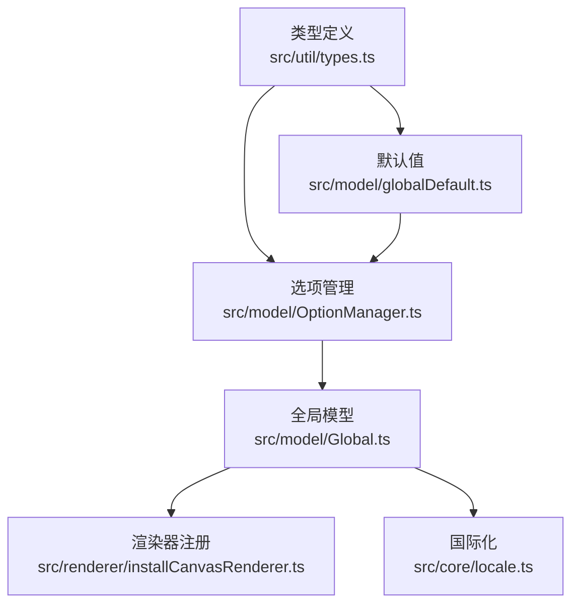
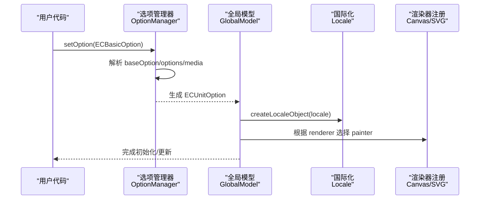
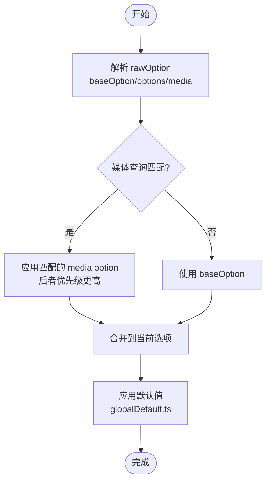
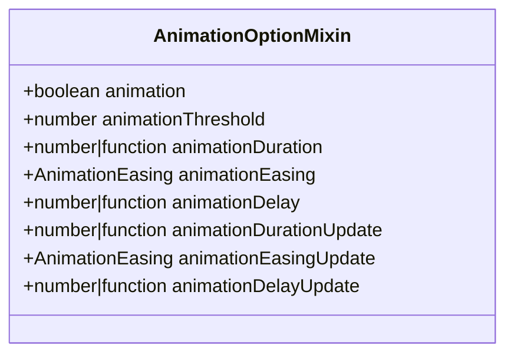
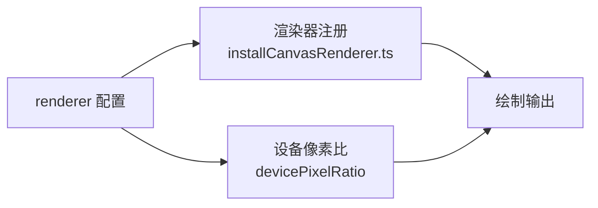
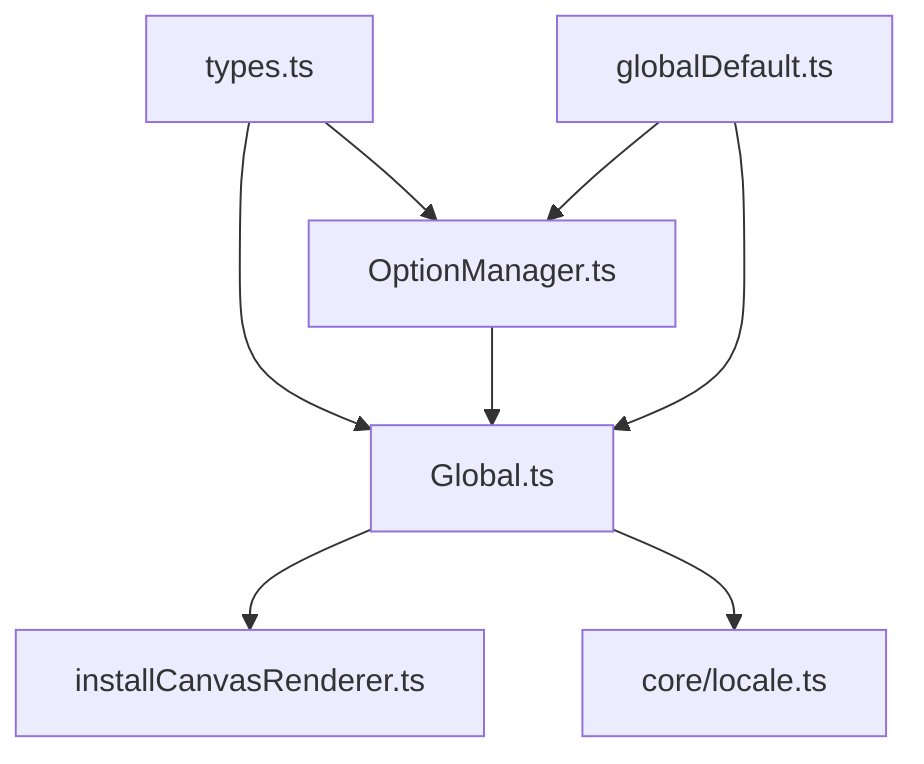

# 全局配置项

<cite>
**本文引用的文件**
- [src/util/types.ts](file://src/util/types.ts)
- [src/model/globalDefault.ts](file://src/model/globalDefault.ts)
- [src/model/Global.ts](file://src/model/Global.ts)
- [src/model/OptionManager.ts](file://src/model/OptionManager.ts)
- [src/core/locale.ts](file://src/core/locale.ts)
- [src/renderer/installCanvasRenderer.ts](file://src/renderer/installCanvasRenderer.ts)
</cite>

## 目录
1. [简介](#简介)
2. [项目结构](#项目结构)
3. [核心组件](#核心组件)
4. [架构总览](#架构总览)
5. [详细组件分析](#详细组件分析)
6. [依赖分析](#依赖分析)
7. [性能考虑](#性能考虑)
8. [故障排查指南](#故障排查指南)
9. [结论](#结论)
10. [附录：类型定义与智能提示](#附录类型定义与智能提示)

## 简介
本章节面向 ECharts 的“全局配置项”，围绕 ECBasicOption 接口及其继承的 ECUnitOption，系统说明以下属性的含义、数据类型、默认值、使用场景与示例路径：backgroundColor、animation、animationDuration、animationEasing、animationDelay、animationDurationUpdate、animationEasingUpdate、animationDelayUpdate、renderedCallback、finishedCallback、useTransition、hoverLayerThreshold、devicePixelRatio、renderer、locale。同时解释全局配置的优先级规则与继承机制，并给出 TypeScript 类型定义与智能提示支持要点，以及性能优化建议与最佳实践。

## 项目结构
ECharts 的全局配置由类型定义、默认值、选项管理与渲染器安装等模块共同构成：
- 类型定义集中在 src/util/types.ts，定义了 ECBasicOption、ECUnitOption、AnimationOptionMixin 等关键类型。
- 默认值集中在 src/model/globalDefault.ts，提供 animation、animationDuration、animationEasing、animationDurationUpdate、animationEasingUpdate、hoverLayerThreshold 等默认值。
- 选项解析与合并流程在 src/model/OptionManager.ts 中实现，负责 baseOption/options/media 的解析与优先级处理。
- 国际化 locale 在 src/core/locale.ts 中注册与创建。
- 渲染器通过 installCanvasRenderer.ts 等注册到扩展系统，供 renderer 配置选择。

图表来源
- [src/util/types.ts:800-859](file://src/util/types.ts#L800-L859)
- [src/model/globalDefault.ts:107-124](file://src/model/globalDefault.ts#L107-L124)
- [src/model/OptionManager.ts:294-335](file://src/model/OptionManager.ts#L294-L335)
- [src/model/Global.ts:201-233](file://src/model/Global.ts#L201-L233)
- [src/renderer/installCanvasRenderer.ts:20-25](file://src/renderer/installCanvasRenderer.ts#L20-L25)
- [src/core/locale.ts:39-69](file://src/core/locale.ts#L39-L69)

章节来源
- [src/util/types.ts:800-859](file://src/util/types.ts#L800-L859)
- [src/model/globalDefault.ts:107-124](file://src/model/globalDefault.ts#L107-L124)
- [src/model/OptionManager.ts:294-335](file://src/model/OptionManager.ts#L294-L335)
- [src/model/Global.ts:201-233](file://src/model/Global.ts#L201-L233)
- [src/renderer/installCanvasRenderer.ts:20-25](file://src/renderer/installCanvasRenderer.ts#L20-L25)
- [src/core/locale.ts:39-69](file://src/core/locale.ts#L39-L69)

## 核心组件
- 类型层（types.ts）：定义 ECBasicOption、ECUnitOption、AnimationOptionMixin、ColorPaletteOptionMixin、MediaUnit 等，为全局配置提供强类型约束与智能提示。
- 默认值层（globalDefault.ts）：提供动画、阈值、文本样式等默认值，如 animation、animationDuration、animationEasing、animationDurationUpdate、animationEasingUpdate、hoverLayerThreshold。
- 选项管理层（OptionManager.ts）：解析 rawOption，处理 baseOption/options/media 的组合与优先级，生成最终单元选项。
- 全局模型（Global.ts）：接收选项，进行初始化与合并，驱动后续组件构建与渲染。
- 国际化（locale.ts）：注册语言包，创建 locale 对象，供全局配置中的 locale 使用。
- 渲染器（installCanvasRenderer.ts）：注册 canvas 渲染器，配合 renderer 配置生效。

章节来源
- [src/util/types.ts:800-859](file://src/util/types.ts#L800-L859)
- [src/model/globalDefault.ts:107-124](file://src/model/globalDefault.ts#L107-L124)
- [src/model/OptionManager.ts:294-335](file://src/model/OptionManager.ts#L294-L335)
- [src/model/Global.ts:201-233](file://src/model/Global.ts#L201-L233)
- [src/core/locale.ts:39-69](file://src/core/locale.ts#L39-L69)
- [src/renderer/installCanvasRenderer.ts:20-25](file://src/renderer/installCanvasRenderer.ts#L20-L25)

## 架构总览
下图展示了从用户传入的 ECBasicOption 到最终渲染的关键流程，包括选项解析、合并、国际化与渲染器选择。

图表来源
- [src/model/OptionManager.ts:294-335](file://src/model/OptionManager.ts#L294-L335)
- [src/model/Global.ts:201-233](file://src/model/Global.ts#L201-L233)
- [src/core/locale.ts:56-69](file://src/core/locale.ts#L56-L69)
- [src/renderer/installCanvasRenderer.ts:20-25](file://src/renderer/installCanvasRenderer.ts#L20-L25)

## 详细组件分析

### 全局配置属性详解（ECBasicOption/ECUnitOption）
以下按属性逐一说明其数据类型、默认值、使用场景与示例路径（以源码位置代替具体代码片段）。

- backgroundColor
  - 类型：ZRColor（颜色字符串或渐变/图案）
  - 默认值：未显式设置时透明背景（参考默认值文件中注释掉的 backgroundColor）
  - 使用场景：设置画布背景色，常用于主题切换或深色模式
  - 示例路径：[src/model/globalDefault.ts:34-44](file://src/model/globalDefault.ts#L34-L44)、[src/util/types.ts:800-813](file://src/util/types.ts#L800-L813)

- animation
  - 类型：boolean | 'auto'
  - 默认值：'auto'（自动判断是否启用）
  - 使用场景：控制整体动画开关；大数据量时可关闭以提升性能
  - 示例路径：[src/model/globalDefault.ts:107-111](file://src/model/globalDefault.ts#L107-L111)、[src/util/types.ts:1116-1155](file://src/util/types.ts#L1116-L1155)

- animationDuration
  - 类型：number | AnimationDurationCallback
  - 默认值：1000（毫秒）
  - 使用场景：初始动画时长；可回调为每个元素指定时长
  - 示例路径：[src/model/globalDefault.ts:108-111](file://src/model/globalDefault.ts#L108-L111)、[src/util/types.ts:1116-1155](file://src/util/types.ts#L1116-L1155)

- animationEasing
  - 类型：AnimationEasing（缓动函数名）
  - 默认值：'cubicInOut'
  - 使用场景：初始动画缓动曲线
  - 示例路径：[src/model/globalDefault.ts:108-111](file://src/model/globalDefault.ts#L108-L111)、[src/util/types.ts:1116-1155](file://src/util/types.ts#L1116-L1155)

- animationDelay
  - 类型：number | AnimationDelayCallback
  - 默认值：未设置（无延迟）
  - 使用场景：初始动画延迟；可回调为每个元素指定延迟
  - 示例路径：[src/util/types.ts:1116-1155](file://src/util/types.ts#L1116-L1155)

- animationDurationUpdate
  - 类型：number | AnimationDurationCallback
  - 默认值：500（毫秒）
  - 使用场景：数据更新动画时长
  - 示例路径：[src/model/globalDefault.ts:108-111](file://src/model/globalDefault.ts#L108-L111)、[src/util/types.ts:1116-1155](file://src/util/types.ts#L1116-L1155)

- animationEasingUpdate
  - 类型：AnimationEasing
  - 默认值：'cubicInOut'
  - 使用场景：数据更新动画缓动曲线
  - 示例路径：[src/model/globalDefault.ts:108-111](file://src/model/globalDefault.ts#L108-L111)、[src/util/types.ts:1116-1155](file://src/util/types.ts#L1116-L1155)

- animationDelayUpdate
  - 类型：number | AnimationDelayCallback
  - 默认值：未设置（无延迟）
  - 使用场景：数据更新动画延迟；可回调为每个元素指定延迟
  - 示例路径：[src/util/types.ts:1116-1155](file://src/util/types.ts#L1116-L1155)

- renderedCallback
  - 类型：函数（在渲染完成后触发）
  - 默认值：无
  - 使用场景：用于统计渲染耗时、埋点或联动其他 UI
  - 示例路径：[src/util/types.ts:800-813](file://src/util/types.ts#L800-L813)

- finishedCallback
  - 类型：函数（在动画/渲染全部结束后触发）
  - 默认值：无
  - 使用场景：用于结束加载态、通知业务逻辑
  - 示例路径：[src/util/types.ts:800-813](file://src/util/types.ts#L800-L813)

- useTransition
  - 类型：boolean（用于开启过渡效果）
  - 默认值：未设置（遵循内部策略）
  - 使用场景：控制图形过渡行为，提升视觉连贯性
  - 示例路径：[src/util/types.ts:800-813](file://src/util/types.ts#L800-L813)

- hoverLayerThreshold
  - 类型：number
  - 默认值：3000
  - 使用场景：当元素数量超过阈值时启用悬浮层优化，避免频繁重绘
  - 示例路径：[src/model/globalDefault.ts:119-124](file://src/model/globalDefault.ts#L119-L124)

- devicePixelRatio
  - 类型：number（设备像素比）
  - 默认值：未设置（跟随浏览器环境）
  - 使用场景：在高 DPI 设备上提升清晰度
  - 示例路径：[src/util/types.ts:800-813](file://src/util/types.ts#L800-L813)

- renderer
  - 类型：'canvas' | 'svg'
  - 默认值：未设置（自动选择）
  - 使用场景：强制选择 Canvas 或 SVG 渲染器
  - 示例路径：[src/util/types.ts:65-66](file://src/util/types.ts#L65-L66)、[src/renderer/installCanvasRenderer.ts:20-25](file://src/renderer/installCanvasRenderer.ts#L20-L25)

- locale
  - 类型：string | LocaleOption
  - 默认值：根据系统语言选择 EN/ZH
  - 使用场景：设置国际化文案
  - 示例路径：[src/core/locale.ts:39-69](file://src/core/locale.ts#L39-L69)

章节来源
- [src/util/types.ts:800-859](file://src/util/types.ts#L800-L859)
- [src/model/globalDefault.ts:107-124](file://src/model/globalDefault.ts#L107-L124)
- [src/core/locale.ts:39-69](file://src/core/locale.ts#L39-L69)
- [src/renderer/installCanvasRenderer.ts:20-25](file://src/renderer/installCanvasRenderer.ts#L20-L25)

### 全局配置优先级与继承机制
- baseOption/options/media 解析与优先级
  - 若声明了 baseOption，则根级除 timeline 外的其他属性需放入 baseOption；timeline 可在根级兼容旧版本。
  - options 数组用于多套选项切换（如时间轴），media 用于响应式媒体查询。
  - media 匹配后按顺序应用，后者具有更高优先级。
- 合并策略
  - 非组件类属性（如 color、animation 等）直接克隆覆盖。
  - 组件类属性按 id/name 或索引进行合并或替换（replaceMerge）。
- 默认值继承
  - globalDefault.ts 提供默认值，被 OptionManager 与 GlobalModel 在初始化/合并时应用。

图表来源
- [src/model/OptionManager.ts:294-335](file://src/model/OptionManager.ts#L294-L335)
- [src/model/globalDefault.ts:107-124](file://src/model/globalDefault.ts#L107-L124)

章节来源
- [src/model/OptionManager.ts:294-335](file://src/model/OptionManager.ts#L294-L335)
- [src/model/globalDefault.ts:107-124](file://src/model/globalDefault.ts#L107-L124)

### 动画与过渡配置
- 动画开关与阈值
  - animation 支持布尔或 'auto'；animationThreshold 控制大数据量时禁用动画。
- 初始与更新动画
  - 初始：animationDuration、animationEasing、animationDelay
  - 更新：animationDurationUpdate、animationEasingUpdate、animationDelayUpdate
- 过渡效果
  - useTransition 控制过渡行为，提升交互流畅度

图表来源
- [src/util/types.ts:1116-1155](file://src/util/types.ts#L1116-L1155)

章节来源
- [src/util/types.ts:1116-1155](file://src/util/types.ts#L1116-L1155)
- [src/model/globalDefault.ts:107-111](file://src/model/globalDefault.ts#L107-L111)

### 渲染器与设备像素比
- renderer
  - 可选 'canvas' 或 'svg'；通过扩展注册机制注入渲染器。
- devicePixelRatio
  - 影响渲染清晰度，适合高 DPI 屏幕。

图表来源
- [src/renderer/installCanvasRenderer.ts:20-25](file://src/renderer/installCanvasRenderer.ts#L20-L25)
- [src/util/types.ts:65-66](file://src/util/types.ts#L65-L66)

章节来源
- [src/renderer/installCanvasRenderer.ts:20-25](file://src/renderer/installCanvasRenderer.ts#L20-L25)
- [src/util/types.ts:65-66](file://src/util/types.ts#L65-L66)

### 国际化 locale
- 支持 string 或 LocaleOption；系统语言检测后选择默认语言包。
- 可通过 registerLocale 注册自定义语言包。

章节来源
- [src/core/locale.ts:39-69](file://src/core/locale.ts#L39-L69)

## 依赖分析
- types.ts 为所有配置提供类型基础，被 Global.ts、OptionManager.ts 广泛引用。
- globalDefault.ts 提供默认值，被 OptionManager.ts 与 Global.ts 在初始化/合并时使用。
- OptionManager.ts 负责解析与合并，是全局配置的核心枢纽。
- Global.ts 协调选项、主题、国际化与调度器，驱动后续渲染。
- 渲染器安装文件提供具体渲染后端，供 renderer 配置选择。

图表来源
- [src/util/types.ts:800-859](file://src/util/types.ts#L800-L859)
- [src/model/globalDefault.ts:107-124](file://src/model/globalDefault.ts#L107-L124)
- [src/model/OptionManager.ts:294-335](file://src/model/OptionManager.ts#L294-L335)
- [src/model/Global.ts:201-233](file://src/model/Global.ts#L201-L233)
- [src/renderer/installCanvasRenderer.ts:20-25](file://src/renderer/installCanvasRenderer.ts#L20-L25)
- [src/core/locale.ts:39-69](file://src/core/locale.ts#L39-L69)

章节来源
- [src/util/types.ts:800-859](file://src/util/types.ts#L800-L859)
- [src/model/globalDefault.ts:107-124](file://src/model/globalDefault.ts#L107-L124)
- [src/model/OptionManager.ts:294-335](file://src/model/OptionManager.ts#L294-L335)
- [src/model/Global.ts:201-233](file://src/model/Global.ts#L201-L233)
- [src/renderer/installCanvasRenderer.ts:20-25](file://src/renderer/installCanvasRenderer.ts#L20-L25)
- [src/core/locale.ts:39-69](file://src/core/locale.ts#L39-L69)

## 性能考虑
- 大数据量场景
  - 设置 animation: false 或提高 animationThreshold，减少动画开销。
  - 合理设置 hoverLayerThreshold，避免频繁重绘。
- 渲染器选择
  - 复杂图形或大量节点建议使用 SVG；简单高频更新建议使用 Canvas。
- 设备像素比
  - 在高 DPI 设备上设置合适的 devicePixelRatio，平衡清晰度与性能。
- 动画回调
  - 使用 renderedCallback/finishedCallback 进行性能监控与资源释放。

## 故障排查指南
- 组件未导入
  - 若使用了未注册的组件，会打印错误日志提示导入方式。
- 选项非法
  - 检查传入 option 是否为空或包含内部标记，避免误用 getOption() 结果作为输入。
- 媒体查询不生效
  - 确认 media 的 query 条件与当前宽高匹配，且顺序正确（后者优先级更高）。

章节来源
- [src/model/Global.ts:216-233](file://src/model/Global.ts#L216-L233)
- [src/model/OptionManager.ts:194-237](file://src/model/OptionManager.ts#L194-L237)

## 结论
ECharts 的全局配置通过类型定义、默认值、选项管理与渲染器注册协同工作，提供了强大的可配置性与灵活性。理解 ECBasicOption/ECUnitOption 的属性、默认值与优先级规则，有助于在不同场景下做出合理的配置选择，并结合性能优化建议获得更好的用户体验。

## 附录：类型定义与智能提示
- 关键类型
  - ECBasicOption：扩展 ECUnitOption，支持 baseOption、timeline、options、media。
  - ECUnitOption：包含 backgroundColor、darkMode、textStyle、useUTC、hoverLayerThreshold 等。
  - AnimationOptionMixin：统一动画相关属性（animation、duration、easing、delay 及 update 系列）。
  - ColorPaletteOptionMixin：颜色调色板相关属性。
  - MediaUnit：媒体查询单元，包含 query 与 option。
- 智能提示
  - 使用 TypeScript 开发时，IDE 将基于上述类型提供补全与校验。
  - 推荐在项目中引入 echarts 的类型定义以获得完整提示。

章节来源
- [src/util/types.ts:800-859](file://src/util/types.ts#L800-L859)
- [src/util/types.ts:1116-1155](file://src/util/types.ts#L1116-L1155)
- [src/util/types.ts:1024-1035](file://src/util/types.ts#L1024-L1035)