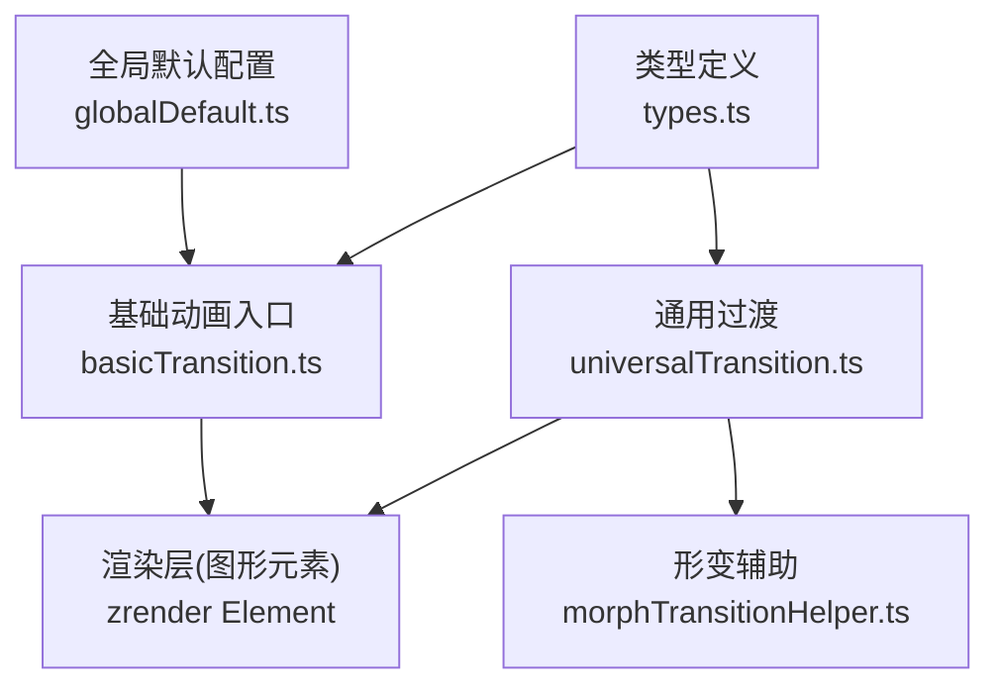
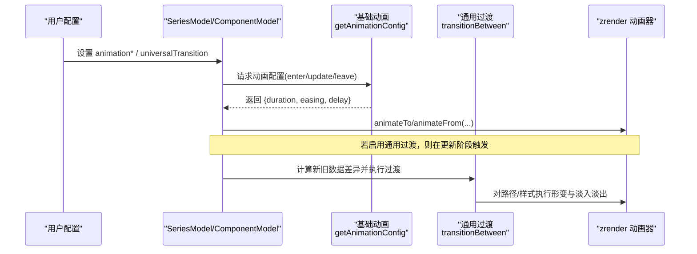
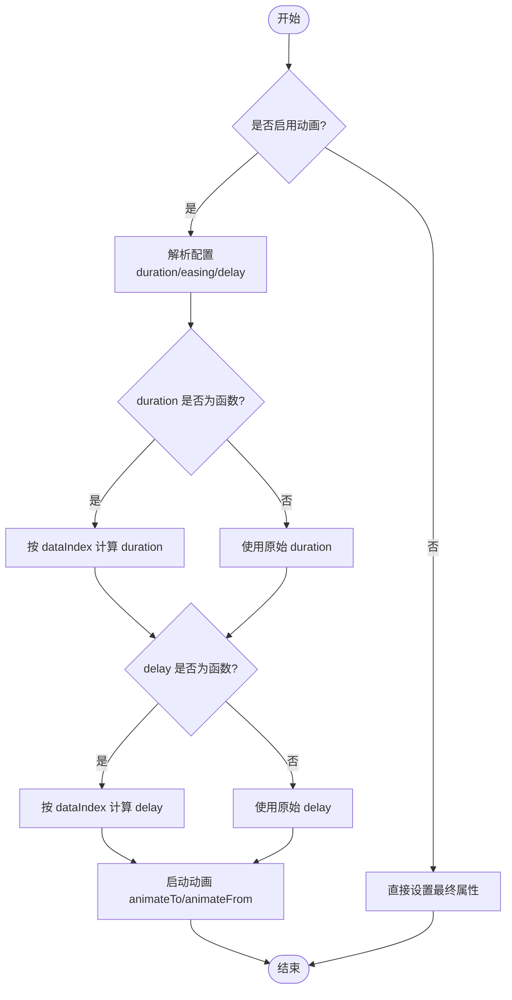
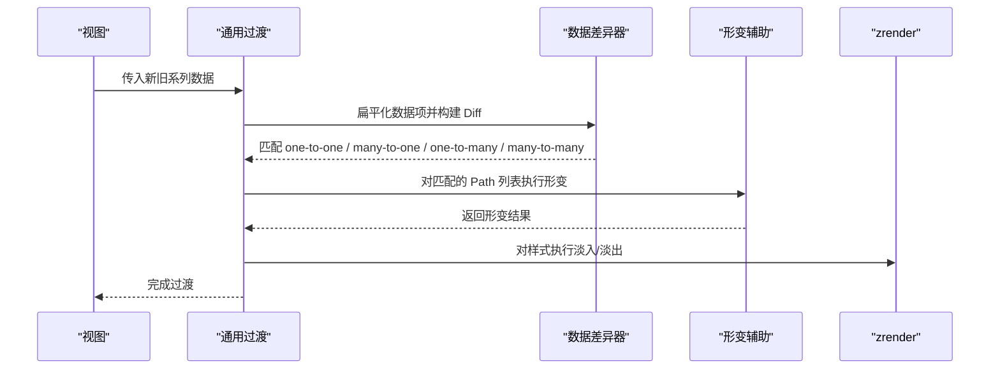
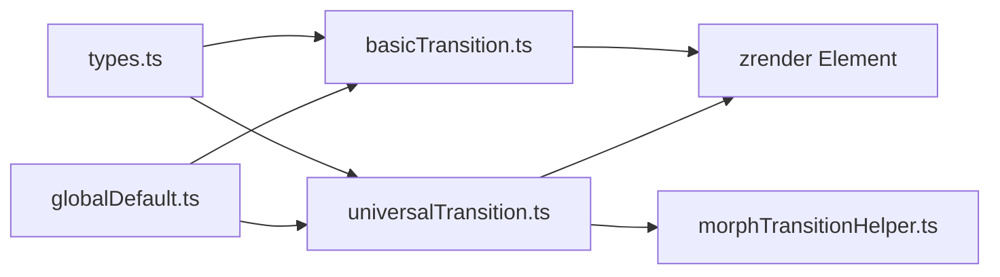

# 动画配置项

<cite>
**本文引用的文件**
- [basicTransition.ts](file://src/animation/basicTransition.ts)
- [universalTransition.ts](file://src/animation/universalTransition.ts)
- [morphTransitionHelper.ts](file://src/animation/morphTransitionHelper.ts)
- [globalDefault.ts](file://src/model/globalDefault.ts)
- [types.ts](file://src/util/types.ts)
</cite>

## 目录
1. [简介](#简介)
2. [项目结构](#项目结构)
3. [核心组件](#核心组件)
4. [架构总览](#架构总览)
5. [详细组件分析](#详细组件分析)
6. [依赖分析](#依赖分析)
7. [性能考虑](#性能考虑)
8. [故障排查指南](#故障排查指南)
9. [结论](#结论)
10. [附录](#附录)

## 简介
本参考文档聚焦 ECharts 的动画与过渡配置，覆盖全局与系列级动画属性、缓动函数、延迟策略、生命周期以及通用过渡（Universal Transition）能力。内容基于源码实现进行梳理，帮助你在不同场景下正确配置并优化动画体验。

## 项目结构
ECharts 的动画体系由基础动画、通用过渡和类型/默认值三部分构成：
- 基础动画：负责进入、更新、离开三类元素动画的统一入口与参数解析。
- 通用过渡：在数据或系列变化时，跨形状、跨系列的平滑过渡（形变、淡入淡出等）。
- 类型与默认值：定义动画相关选项类型、全局默认值与阈值。

图表来源
- [globalDefault.ts:102-113](file://src/model/globalDefault.ts#L102-L113)
- [basicTransition.ts:58-125](file://src/animation/basicTransition.ts#L58-L125)
- [universalTransition.ts:209-511](file://src/animation/universalTransition.ts#L209-L511)
- [morphTransitionHelper.ts:132-201](file://src/animation/morphTransitionHelper.ts#L132-L201)
- [types.ts:194-198](file://src/util/types.ts#L194-L198)

章节来源
- [globalDefault.ts:102-113](file://src/model/globalDefault.ts#L102-L113)
- [types.ts:194-198](file://src/util/types.ts#L194-L198)

## 核心组件
- 基础动画（Basic Transition）
  - 统一处理 enter/update/leave 三类动画的生命周期与参数合并。
  - 支持从模型读取 animationDuration、animationEasing、animationDelay 及其 Update 版本；支持通过 Payload 动态覆盖。
- 通用过渡（Universal Transition）
  - 在 setOption 或数据更新时，自动匹配旧/新数据项，执行多对一、一对多、多对多的形变与样式过渡。
  - 支持 divideShape（clone/split）、seriesKey 分组、delay 回调等。
- 类型与默认值
  - 全局默认包含 animation、animationDuration、animationDurationUpdate、animationEasing、animationEasingUpdate、animationThreshold 等。
  - 提供 PayloadAnimationPart 用于运行时覆盖动画参数。

章节来源
- [basicTransition.ts:58-125](file://src/animation/basicTransition.ts#L58-L125)
- [universalTransition.ts:544-674](file://src/animation/universalTransition.ts#L544-L674)
- [globalDefault.ts:102-113](file://src/model/globalDefault.ts#L102-L113)
- [types.ts:194-198](file://src/util/types.ts#L194-L198)

## 架构总览
下图展示了动画配置在 ECharts 中的调用链路与优先级关系：

图表来源
- [basicTransition.ts:58-125](file://src/animation/basicTransition.ts#L58-L125)
- [universalTransition.ts:209-511](file://src/animation/universalTransition.ts#L209-L511)

## 详细组件分析

### 基础动画（Basic Transition）
- 生命周期
  - enter：初始化元素时的入场动画。
  - update：元素属性更新时的过渡动画。
  - leave：元素移除时的离场动画（可带透明度渐变）。
- 配置来源与优先级
  - 优先使用 payload.animation（如来自 dataZoom/resize 等动作），其次使用模型上的 animationDuration/animationEasing/animationDelay 或其 Update 版本。
  - 支持 duration/delay/easing 为函数，按 dataIndex 与额外参数计算。
- 关键行为
  - 当 duration 为 0 或动画被禁用时，直接设置最终属性并触发回调。
  - remove 动画会停止其他 leave 动画，避免重复播放。

图表来源
- [basicTransition.ts:58-125](file://src/animation/basicTransition.ts#L58-L125)
- [basicTransition.ts:127-199](file://src/animation/basicTransition.ts#L127-L199)

章节来源
- [basicTransition.ts:58-125](file://src/animation/basicTransition.ts#L58-L125)
- [basicTransition.ts:127-199](file://src/animation/basicTransition.ts#L127-L199)
- [basicTransition.ts:219-286](file://src/animation/basicTransition.ts#L219-L286)

### 通用过渡（Universal Transition）
- 触发时机
  - 在 series:transition 生命周期中，根据上一帧与当前帧的数据差异，自动匹配数据项并执行过渡。
- 匹配策略
  - 支持 groupId/childGroupId 与 encode 维度作为键，决定父子方向（parent→child / child→parent）。
  - 大数据量（>10k）时自动禁用以避免性能问题。
- 形变与样式
  - 对 Path 列表执行形变动画（clone/split），并对 Displayable 样式执行淡入淡出。
  - 支持 per-item delay 回调，便于交错效果。
- 系列键（seriesKey）
  - 相同 seriesKey 的系列之间可进行过渡；支持字符串或数组形式，数组表示可与多个系列配对。

图表来源
- [universalTransition.ts:209-511](file://src/animation/universalTransition.ts#L209-L511)
- [morphTransitionHelper.ts:132-201](file://src/animation/morphTransitionHelper.ts#L132-L201)

章节来源
- [universalTransition.ts:544-674](file://src/animation/universalTransition.ts#L544-L674)
- [universalTransition.ts:723-785](file://src/animation/universalTransition.ts#L723-L785)
- [morphTransitionHelper.ts:132-201](file://src/animation/morphTransitionHelper.ts#L132-L201)

### 类型与默认值
- 全局默认
  - animation: 'auto'
  - animationDuration: 1000
  - animationDurationUpdate: 500
  - animationEasing: 'cubicInOut'
  - animationEasingUpdate: 'cubicInOut'
  - animationThreshold: 2000（超过阈值可能影响动画启用策略）
- Payload 覆盖
  - 可通过 PayloadAnimationPart 在运行时指定 duration/easing/delay，用于特定动作（如 dataZoom）的临时覆盖。

章节来源
- [globalDefault.ts:102-113](file://src/model/globalDefault.ts#L102-L113)
- [types.ts:194-198](file://src/util/types.ts#L194-L198)

## 依赖分析
- basicTransition 依赖 zrender 的 Element 动画接口与 easing 类型，并通过 Model 获取动画配置。
- universalTransition 依赖 DataDiffer 进行数据对比，依赖 morphTransitionHelper 执行路径形变，并通过 ExtensionAPI 访问视图与系列模型。
- globalDefault 提供全局默认动画参数，被各模块读取。
- types 提供 AnimationOptionMixin、PayloadAnimationPart、UniversalTransitionOption 等类型定义。

图表来源
- [types.ts:194-198](file://src/util/types.ts#L194-L198)
- [basicTransition.ts:22-38](file://src/animation/basicTransition.ts#L22-L38)
- [universalTransition.ts:22-49](file://src/animation/universalTransition.ts#L22-L49)
- [globalDefault.ts:102-113](file://src/model/globalDefault.ts#L102-L113)

章节来源
- [basicTransition.ts:22-38](file://src/animation/basicTransition.ts#L22-L38)
- [universalTransition.ts:22-49](file://src/animation/universalTransition.ts#L22-L49)
- [globalDefault.ts:102-113](file://src/model/globalDefault.ts#L102-L113)
- [types.ts:194-198](file://src/util/types.ts#L194-L198)

## 性能考虑
- 大数据量限制
  - 通用过渡对 >10k 的数据自动禁用，避免形变带来的性能开销。
- 动画阈值
  - 全局 animationThreshold 控制是否启用动画；数据量大时可关闭以提升交互流畅度。
- 延迟与交错
  - 使用 delay 回调为每个元素设置差异化延迟，避免同时大量动画导致的卡顿。
- 形变策略
  - divideShape 选择 clone 或 split，split 更适合复杂形变但计算成本更高。
- 过渡范围
  - 仅在必要时启用 universalTransition，减少不必要的形变计算。

[本节为通用指导，不直接分析具体文件]

## 故障排查指南
- 动画未生效
  - 检查是否启用了动画（isAnimationEnabled），确认 animation 不为 false。
  - 确认 duration 非 0，且未被 payload 覆盖为 0。
- 过渡错配
  - 检查 groupId/childGroupId 或 encode.itemGroupId 是否正确，确保新旧数据能正确匹配。
  - 对于多对多过渡，确认 seriesKey 一致且无重复。
- 性能抖动
  - 大数据集上禁用通用过渡或降低动画时长。
  - 使用 animationThreshold 提高阈值以在大图上禁用动画。
- 调试建议
  - 利用 during 回调观察动画进度，定位异常帧。
  - 在开发环境关注控制台警告（如数据过大禁用提示）。

章节来源
- [basicTransition.ts:58-125](file://src/animation/basicTransition.ts#L58-L125)
- [universalTransition.ts:118-144](file://src/animation/universalTransition.ts#L118-L144)
- [universalTransition.ts:544-674](file://src/animation/universalTransition.ts#L544-L674)

## 结论
ECharts 的动画体系通过基础动画与通用过渡协同工作，既保证了常规元素的平滑过渡，也提供了跨系列、跨形状的复杂形变能力。合理配置 animation* 系列属性、善用 delay 与 divideShape，并结合数据规模调整阈值，可在视觉表现与性能之间取得平衡。

[本节为总结性内容，不直接分析具体文件]

## 附录

### 动画配置项速查
- 全局与系列常用动画属性
  - animation：是否启用动画（可为布尔或 'auto'）
  - animationDuration：初始动画时长
  - animationDurationUpdate：更新动画时长
  - animationEasing：初始动画缓动函数
  - animationEasingUpdate：更新动画缓动函数
  - animationDelay：初始动画延迟（可为函数）
  - animationDelayUpdate：更新动画延迟（可为函数）
  - animationThreshold：动画阈值（超过则可能禁用）
- 通用过渡（Universal Transition）
  - enabled：是否启用
  - delay：每项形变的延迟回调（index, count）
  - divideShape：形变策略（'clone' | 'split'）
  - seriesKey：系列间过渡的键（字符串或数组）

章节来源
- [globalDefault.ts:102-113](file://src/model/globalDefault.ts#L102-L113)
- [types.ts:1952-1974](file://src/util/types.ts#L1952-L1974)