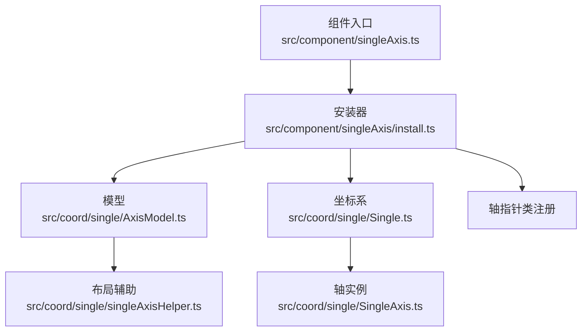
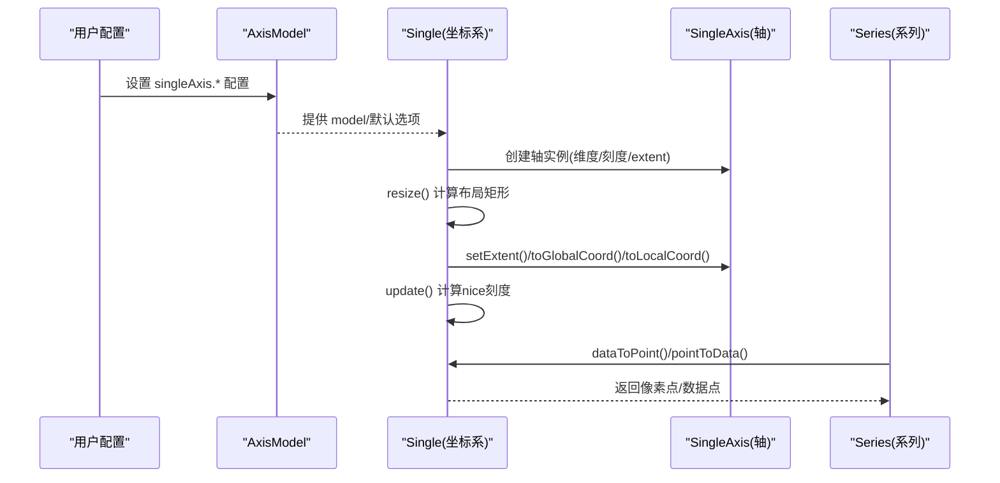
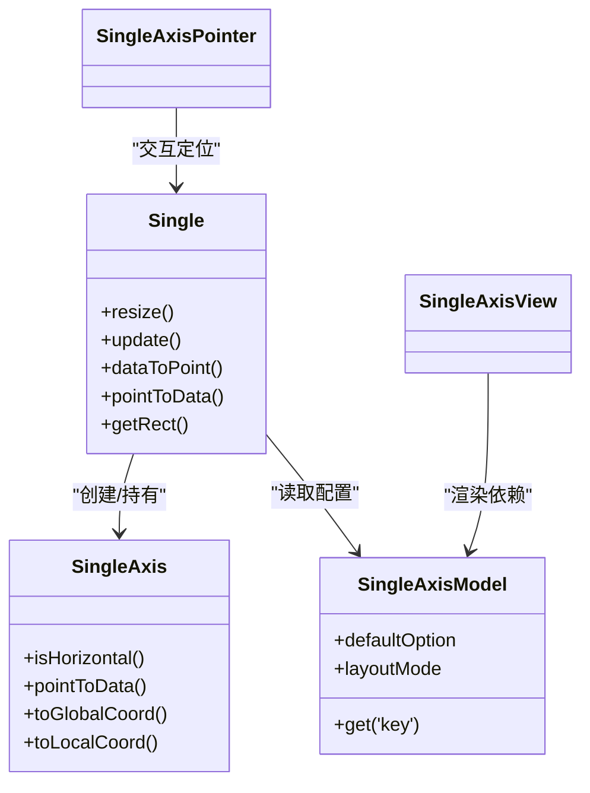

# 单轴坐标系配置

<cite>
**本文引用的文件**
- [src/component/singleAxis.ts](file://src/component/singleAxis.ts)
- [src/component/singleAxis/install.ts](file://src/component/singleAxis/install.ts)
- [src/coord/single/AxisModel.ts](file://src/coord/single/AxisModel.ts)
- [src/coord/single/Single.ts](file://src/coord/single/Single.ts)
- [src/coord/single/SingleAxis.ts](file://src/coord/single/SingleAxis.ts)
- [src/coord/single/singleAxisHelper.ts](file://src/coord/single/singleAxisHelper.ts)
- [test/scatter-single-axis.html](file://test/scatter-single-axis.html)
- [test/singleAxisScales.html](file://test/singleAxisScales.html)
</cite>

## 目录
1. [简介](#简介)
2. [项目结构](#项目结构)
3. [核心组件](#核心组件)
4. [架构总览](#架构总览)
5. [详细组件分析](#详细组件分析)
6. [依赖关系分析](#依赖关系分析)
7. [性能与布局特性](#性能与布局特性)
8. [故障排查指南](#故障排查指南)
9. [结论](#结论)
10. [附录：常用配置速查](#附录：常用配置速查)

## 简介
本参考聚焦 ECharts 的 singleAxis（单轴）坐标系，系统说明其配置对象、坐标轴类型、刻度范围与方向控制、标签与刻度定制、数据格式化、与其他组件的集成方式及交互行为。同时对比单轴与直角坐标系的使用场景差异，并给出时间轴、进度条、评分系统等典型应用的实践建议。

## 项目结构
singleAxis 由“组件注册 + 模型 + 视图 + 坐标系实现”共同构成：
- 组件入口与安装：负责注册视图、模型、坐标系统与轴指针类。
- 模型层：定义默认配置项、布局模式、位置与方向等。
- 坐标系实现：计算布局、更新刻度、提供数据与像素坐标转换。
- 辅助工具：根据位置与方向计算轴标签、刻度、名称的方向与旋转。

图表来源
- [src/component/singleAxis.ts:20-23](file://src/component/singleAxis.ts#L20-L23)
- [src/component/singleAxis/install.ts:35-48](file://src/component/singleAxis/install.ts#L35-L48)
- [src/coord/single/AxisModel.ts:53-120](file://src/coord/single/AxisModel.ts#L53-L120)
- [src/coord/single/Single.ts:63-113](file://src/coord/single/Single.ts#L63-L113)
- [src/coord/single/SingleAxis.ts:40-74](file://src/coord/single/SingleAxis.ts#L40-L74)
- [src/coord/single/singleAxisHelper.ts:34-84](file://src/coord/single/singleAxisHelper.ts#L34-L84)

章节来源
- [src/component/singleAxis.ts:20-23](file://src/component/singleAxis.ts#L20-L23)
- [src/component/singleAxis/install.ts:35-48](file://src/component/singleAxis/install.ts#L35-L48)

## 核心组件
- 组件安装器：注册 singleAxis 的视图、模型、坐标系统与轴指针类，使 singleAxis 可用。
- 模型 AxisModel：声明 singleAxis 的默认配置项（如 type、position、orient、axisLine、axisTick、axisLabel、splitLine、tooltip 等），并提供布局模式为 box。
- 坐标系 Single：创建并维护 SingleAxis，处理 resize、update、坐标转换、包含判断、tooltip 基轴暴露等。
- 轴 SingleAxis：继承通用轴能力，提供 isHorizontal、pointToData 等方法，维护 position、orient、type 等属性。
- 布局辅助 singleAxisHelper：根据 position 与 orient 计算轴的位置、旋转、标签/刻度/名称方向与层级 z2。

章节来源
- [src/component/singleAxis/install.ts:35-48](file://src/component/singleAxis/install.ts#L35-L48)
- [src/coord/single/AxisModel.ts:53-120](file://src/coord/single/AxisModel.ts#L53-L120)
- [src/coord/single/Single.ts:63-113](file://src/coord/single/Single.ts#L63-L113)
- [src/coord/single/SingleAxis.ts:40-74](file://src/coord/single/SingleAxis.ts#L40-L74)
- [src/coord/single/singleAxisHelper.ts:34-84](file://src/coord/single/singleAxisHelper.ts#L34-L84)

## 架构总览
下图展示了从配置到渲染的关键路径：配置经模型解析后，坐标系在初始化时创建轴实例，resize 阶段计算布局，update 阶段计算刻度；系列通过 coordinateSystem: 'singleAxis' 绑定该坐标系进行绘制。

图表来源
- [src/coord/single/AxisModel.ts:68-120](file://src/coord/single/AxisModel.ts#L68-L120)
- [src/coord/single/Single.ts:63-113](file://src/coord/single/Single.ts#L63-L113)
- [src/coord/single/Single.ts:119-156](file://src/coord/single/Single.ts#L119-L156)
- [src/coord/single/Single.ts:201-227](file://src/coord/single/Single.ts#L201-L227)

## 详细组件分析

### 配置项与默认值
- 基础属性
  - type：坐标轴类型，支持 value、category、log、time 等（由 scale 决定）。
  - position：轴位置，top/bottom/left/right。
  - orient：轴方向，horizontal/vertical。
  - inverse：是否反转刻度方向。
  - left/top/right/bottom：布局边距。
- 视觉与刻度
  - axisLine：轴线显示与样式。
  - axisTick：刻度线显示、长度、样式、是否 inside。
  - axisLabel：标签显示、interval、rotate、inside。
  - splitLine：分割线显示与样式。
  - splitArea：背景区域划分（示例中可见 show）。
- 交互与提示
  - tooltip：默认 show 为 true（作为父级 tooltip 模型）。
  - axisPointer：轴指针（通过安装器注册 SingleAxisPointer）。
- 抖动与重叠优化
  - jitter/jitterOverlap/jitterMargin：用于散点等系列的抖动策略。

章节来源
- [src/coord/single/AxisModel.ts:68-120](file://src/coord/single/AxisModel.ts#L68-L120)
- [src/component/singleAxis/install.ts:35-48](file://src/component/singleAxis/install.ts#L35-L48)

### 坐标轴类型与刻度范围
- 类型
  - value：数值型，适合进度、评分等连续量。
  - category：类目型，适合离散分类。
  - log：对数型，适合跨度极大的数据。
  - time：时间型，适合时间轴场景。
- 范围与间隔
  - min/max：可通过 scale 或 axis 配置限定范围（由通用轴能力提供）。
  - interval：标签间隔策略（auto 或固定值）。
  - inverse：反转刻度方向，常用于进度条从右向左或倒序展示。
- 刻度计算
  - 在坐标系 update 阶段调用 nice 刻度计算，确保刻度美观。

章节来源
- [src/coord/single/Single.ts:99-103](file://src/coord/single/Single.ts#L99-L103)
- [src/coord/single/Single.ts:87-88](file://src/coord/single/Single.ts#L87-L88)
- [test/singleAxisScales.html:98-140](file://test/singleAxisScales.html#L98-L140)

### 数据格式与坐标转换
- 数据形式
  - 单值：[x, x, ...]，适用于一维散点。
  - 二维：[[x, y], ...]，y 可用于 symbolSize 等映射。
- 坐标转换
  - dataToPoint：将数据转换为像素坐标（水平/垂直方向按 orient 选择）。
  - pointToData：将像素坐标转回数据值。
  - toGlobalCoord/toLocalCoord：全局坐标与局部坐标互转，考虑 invert 与 orient。

章节来源
- [src/coord/single/Single.ts:201-227](file://src/coord/single/Single.ts#L201-L227)
- [src/coord/single/Single.ts:135-156](file://src/coord/single/Single.ts#L135-L156)
- [test/scatter-single-axis.html:83-122](file://test/scatter-single-axis.html#L83-L122)
- [test/scatter-single-axis.html:155-179](file://test/scatter-single-axis.html#L155-L179)

### 标签显示与刻度定制
- 标签
  - axisLabel.show/interval/rotate/inside：控制显示、间隔、旋转角度与内外侧。
  - 布局辅助会根据 position 自动计算 labelDirection 与 labelRotate。
- 刻度
  - axisTick.show/length/lineStyle/inside：控制刻度线外观与方向。
- 分割线与背景
  - splitLine/show/lineStyle：网格线样式。
  - splitArea/show：背景分块，便于阅读。

章节来源
- [src/coord/single/AxisModel.ts:96-115](file://src/coord/single/AxisModel.ts#L96-L115)
- [src/coord/single/singleAxisHelper.ts:62-80](file://src/coord/single/singleAxisHelper.ts#L62-L80)
- [test/scatter-single-axis.html:219-260](file://test/scatter-single-axis.html#L219-L260)

### 特殊图表中的应用
- 时间轴
  - 使用 type: 'time' 的单轴，结合 dataZoom 实现时间范围缩放与滚动。
  - 示例展示了多单轴并列的时间轴与数值轴组合。
- 进度条
  - 使用 value 类型，配合 inverse 实现反向进度；symbolSize 可映射进度值。
- 评分系统
  - 使用 value 或 category 类型，结合 visualMap 或 symbolSize 表达等级与分值。

章节来源
- [test/singleAxisScales.html:98-140](file://test/singleAxisScales.html#L98-L140)
- [test/scatter-single-axis.html:219-260](file://test/scatter-single-axis.html#L219-L260)

### 与直角坐标系的区别与选型
- 区别
  - singleAxis 仅有一个维度，适合一维展示（进度、时间轴、评分等）。
  - 直角坐标系具备 x/y 双轴，适合二维关系图（折线、柱状、散点矩阵等）。
- 选型建议
  - 当数据本质是一维且强调沿单一维度的分布/变化时，优先 singleAxis。
  - 需要同时表达两个维度关系时，使用直角坐标系。

（本节为概念性说明，不直接分析具体文件）

### 与其他组件的集成与交互
- 数据缩放
  - dataZoom：支持 inside/slider，可指定 singleAxisIndex 控制对应单轴。
- 轴指针
  - axisPointer：通过安装器注册 SingleAxisPointer，支持 shadow/line 等类型。
- 提示框
  - tooltip：trigger: 'axis'，单轴作为 baseAxes 暴露给 tooltip。
- 多单轴
  - 通过 id 与 series.singleAxisId 绑定不同单轴，实现多面板/多图例联动。

章节来源
- [src/component/singleAxis/install.ts:35-48](file://src/component/singleAxis/install.ts#L35-L48)
- [test/singleAxisScales.html:85-97](file://test/singleAxisScales.html#L85-L97)
- [test/singleAxisScales.html:141-173](file://test/singleAxisScales.html#L141-L173)

## 依赖关系分析
- 组件注册依赖
  - install.ts 注册 SingleAxisView、SingleAxisModel、坐标系统 single、轴指针 SingleAxisPointer。
- 坐标系与轴
  - Single 依赖 AxisModel 获取配置，创建 SingleAxis，并在 update 中计算刻度。
  - SingleAxis 继承通用轴能力，提供 isHorizontal、pointToData 等。
- 布局辅助
  - singleAxisHelper 根据 position/orient 计算布局参数，影响标签/刻度方向与层级。

图表来源
- [src/coord/single/AxisModel.ts:53-120](file://src/coord/single/AxisModel.ts#L53-L120)
- [src/coord/single/Single.ts:63-113](file://src/coord/single/Single.ts#L63-L113)
- [src/coord/single/SingleAxis.ts:40-74](file://src/coord/single/SingleAxis.ts#L40-L74)
- [src/component/singleAxis/install.ts:35-48](file://src/component/singleAxis/install.ts#L35-L48)

章节来源
- [src/component/singleAxis/install.ts:35-48](file://src/component/singleAxis/install.ts#L35-L48)
- [src/coord/single/Single.ts:63-113](file://src/coord/single/Single.ts#L63-L113)
- [src/coord/single/SingleAxis.ts:40-74](file://src/coord/single/SingleAxis.ts#L40-L74)

## 性能与布局特性
- 布局计算
  - resize 阶段基于 box 布局计算 rect，并根据 orient/inverse 设置 extent 与坐标变换。
- 刻度计算
  - update 阶段调用 nice 刻度计算，减少过多/过少刻度的情况。
- 抖动与重叠
  - jitter/jitterOverlap/jitterMargin 帮助散点等避免重叠，提升可读性。
- 多单轴
  - 通过 id 区分多个单轴，分别管理布局与交互，避免相互干扰。

章节来源
- [src/coord/single/Single.ts:108-131](file://src/coord/single/Single.ts#L108-L131)
- [src/coord/single/Single.ts:99-103](file://src/coord/single/Single.ts#L99-L103)
- [src/coord/single/AxisModel.ts:117-119](file://src/coord/single/AxisModel.ts#L117-L119)
- [test/singleAxisScales.html:98-140](file://test/singleAxisScales.html#L98-L140)

## 故障排查指南
- 现象：标签被遮挡或方向异常
  - 检查 axisLabel.rotate 与 position/orient 的组合，必要时调整 labelInside。
  - 参考布局辅助逻辑，确认 labelDirection 与 labelRotate 的计算是否符合预期。
- 现象：刻度过多或过少
  - 调整 interval 或让系统自动计算（auto），或在 scale 层面限制范围。
- 现象：进度条方向不符合预期
  - 检查 inverse 是否为 true，以及 orient 与 position 的组合。
- 现象：tooltip 无法正确定位
  - 确认 singleAxis 已暴露 baseAxes，并确保 trigger 为 axis。

章节来源
- [src/coord/single/singleAxisHelper.ts:62-80](file://src/coord/single/singleAxisHelper.ts#L62-L80)
- [src/coord/single/Single.ts:176-182](file://src/coord/single/Single.ts#L176-L182)
- [test/scatter-single-axis.html:83-122](file://test/scatter-single-axis.html#L83-L122)

## 结论
singleAxis 提供简洁的一维坐标系能力，适用于时间轴、进度条、评分系统等场景。通过灵活的 type、position、orient、inverse 与丰富的刻度/标签/分割线配置，能够满足多样化需求。与直角坐标系相比，singleAxis 更专注于单维数据的表达与交互，常与 dataZoom、axisPointer、tooltip 等组件协同工作，形成高效的一维可视化方案。

## 附录：常用配置速查
- 基础
  - type：value/category/log/time
  - position：top/bottom/left/right
  - orient：horizontal/vertical
  - inverse：true/false
  - left/top/right/bottom：布局边距
- 刻度与标签
  - axisLine.show/lineStyle
  - axisTick.show/length/lineStyle/inside
  - axisLabel.show/interval/rotate/inside
  - splitLine.show/lineStyle
  - splitArea.show
- 交互与提示
  - tooltip.show（默认 true）
  - axisPointer.type/style
- 数据与系列
  - coordinateSystem: 'singleAxis'
  - series.data：单值或二维数组
  - symbolSize：可映射第二维数据
- 多单轴
  - singleAxis[].id
  - series.singleAxisId

（本节为概览性内容，不直接分析具体文件）