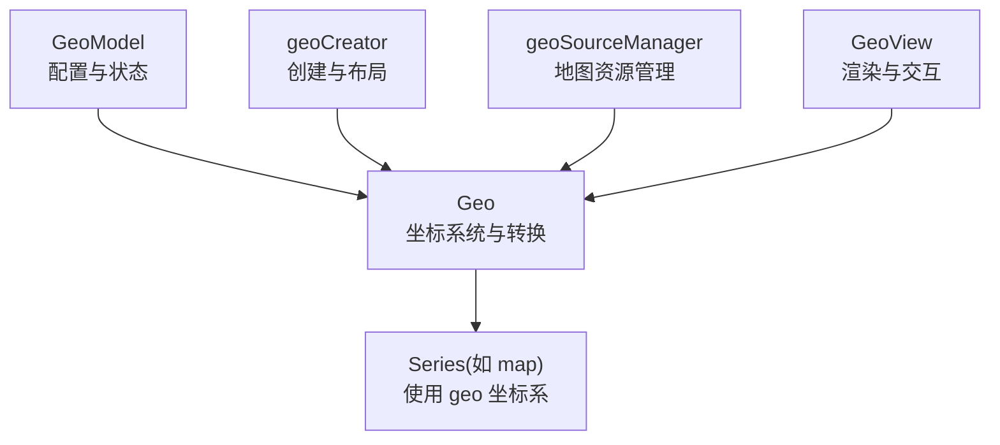
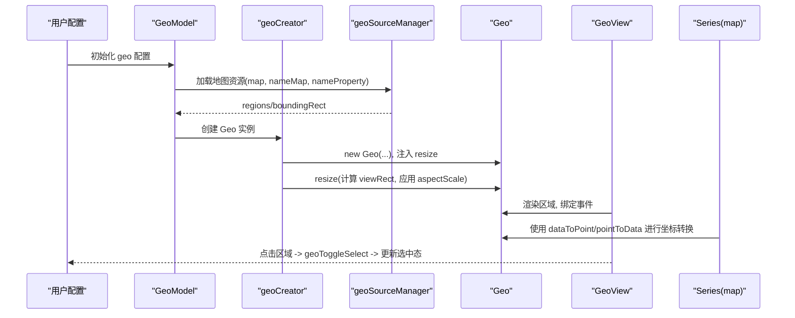
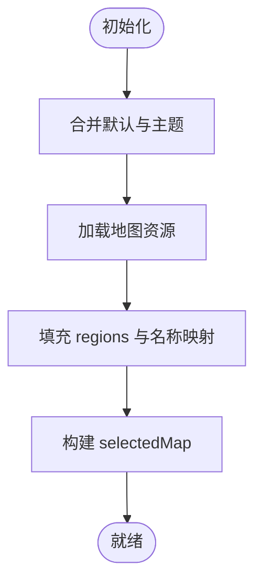
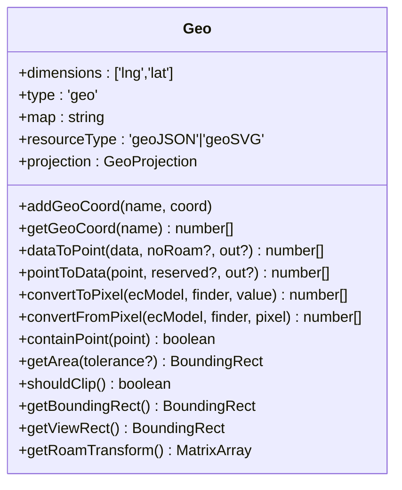
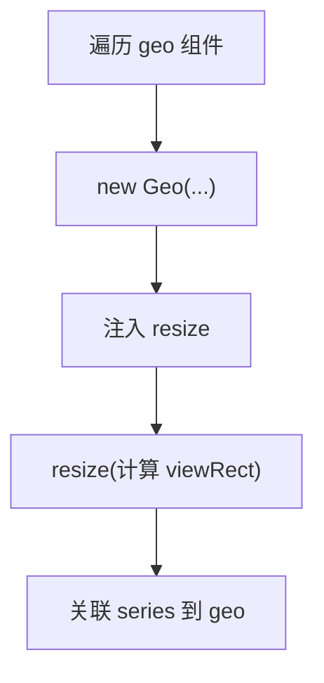
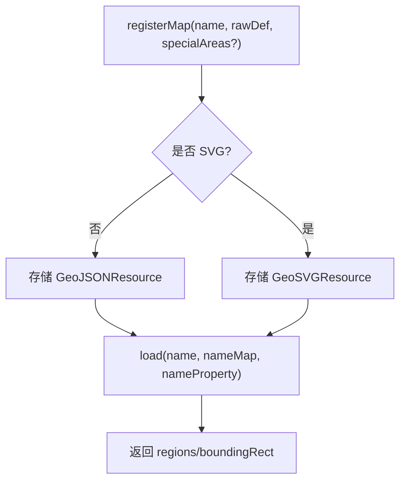
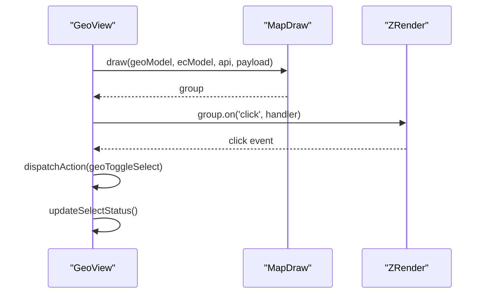
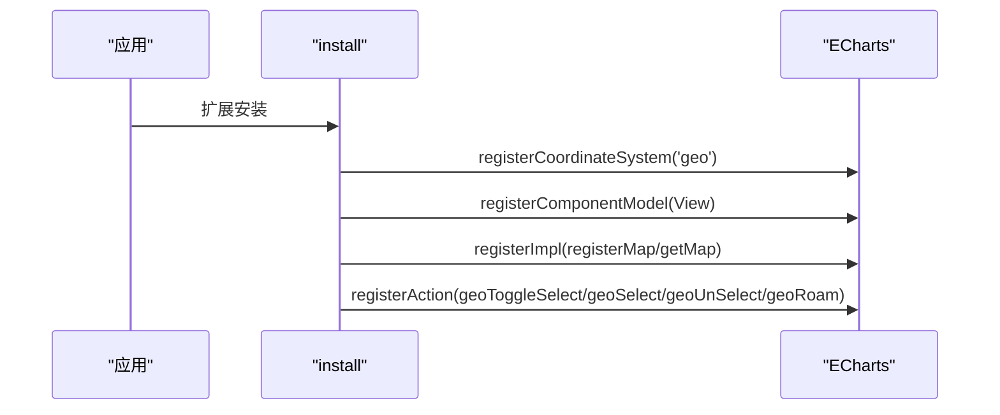
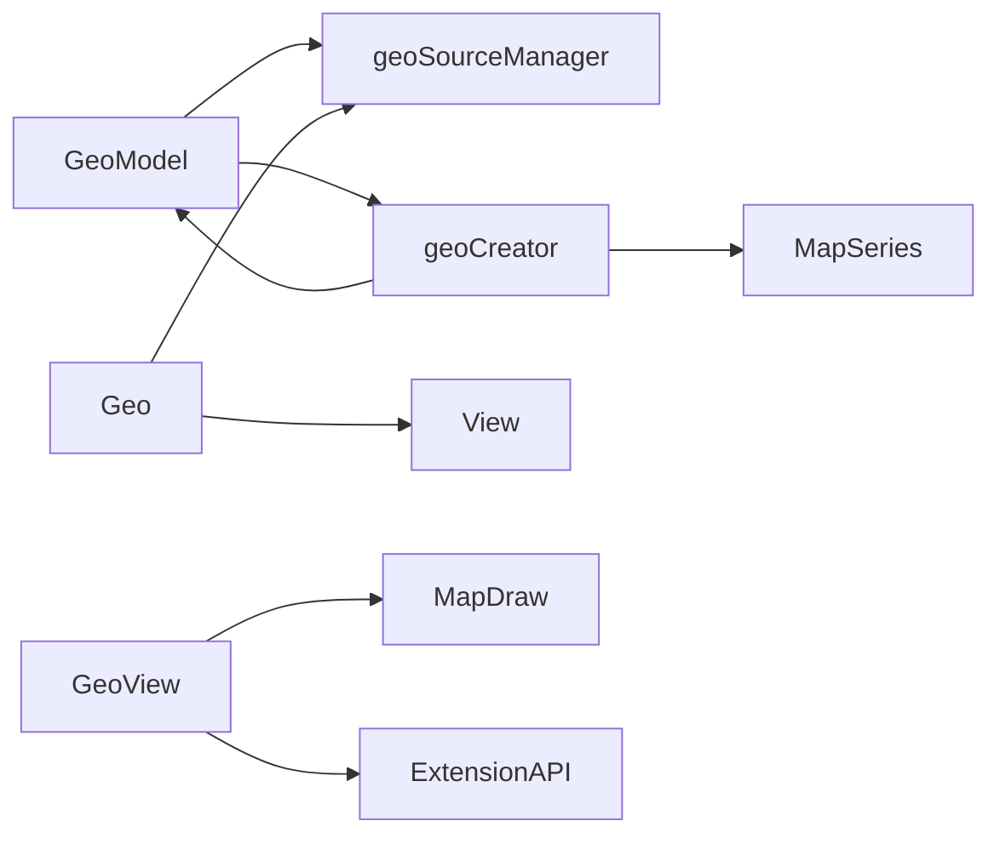

# 地理坐标系配置

<cite>
**本文引用的文件**
- [src/coord/geo/GeoModel.ts](file://src/coord/geo/GeoModel.ts)
- [src/coord/geo/Geo.ts](file://src/coord/geo/Geo.ts)
- [src/coord/geo/geoTypes.ts](file://src/coord/geo/geoTypes.ts)
- [src/coord/geo/geoCreator.ts](file://src/coord/geo/geoCreator.ts)
- [src/coord/geo/geoSourceManager.ts](file://src/coord/geo/geoSourceManager.ts)
- [src/component/geo/install.ts](file://src/component/geo/install.ts)
- [src/component/geo/GeoView.ts](file://src/component/geo/GeoView.ts)
- [test/geo-map.html](file://test/geo-map.html)
- [test/geo-map-roam.html](file://test/geo-map-roam.html)
- [test/map-projection.html](file://test/map-projection.html)
</cite>

## 目录
1. [简介](#简介)
2. [项目结构](#项目结构)
3. [核心组件](#核心组件)
4. [架构总览](#架构总览)
5. [详细组件分析](#详细组件分析)
6. [依赖关系分析](#依赖关系分析)
7. [性能考虑](#性能考虑)
8. [故障排查指南](#故障排查指南)
9. [结论](#结论)
10. [附录：常用场景与示例路径](#附录：常用场景与示例路径)

## 简介
本文件系统性说明 ECharts 地理坐标系（geo）的配置项与实现机制，重点覆盖以下方面：
- geo 配置对象的核心属性：地图投影（projection）、中心点（center）、缩放比例（zoom/scaleLimit）、视图模式（viewMode）等。
- 地图数据加载与配置：GeoJSON/SVG 数据源、区域（regions）配置、名称映射（nameMap/nameProperty）、样式设置。
- 交互能力：缩放、平移、点击选择、事件与动作（geoRoam、geoToggleSelect 等）。
- 多坐标系组合：与 grid、matrix、calendar 等布局坐标系的协作方式。
- 性能优化策略：裁剪、视口控制、数据采样与流式处理、资源复用等。

## 项目结构
ECharts 的地理坐标系由“模型-视图-创建器-资源管理”四部分构成：
- GeoModel：定义 geo 配置项、默认值、选中状态、标签格式化等。
- Geo：地理坐标系实例，负责坐标转换、区域查询、边界框计算、投影应用等。
- geoCreator：创建 geo 实例、注入 resize、绑定 series 到 geo。
- geoSourceManager：注册与加载地图资源（GeoJSON/SVG），提供 regions 与 boundingRect。
- GeoView：渲染地图区域、处理点击事件、更新选中态。

图表来源
- [src/coord/geo/GeoModel.ts:154-352](file://src/coord/geo/GeoModel.ts#L154-L352)
- [src/coord/geo/Geo.ts:58-295](file://src/coord/geo/Geo.ts#L58-L295)
- [src/coord/geo/geoCreator.ts:175-315](file://src/coord/geo/geoCreator.ts#L175-L315)
- [src/coord/geo/geoSourceManager.ts:49-150](file://src/coord/geo/geoSourceManager.ts#L49-L150)
- [src/component/geo/GeoView.ts:31-123](file://src/component/geo/GeoView.ts#L31-L123)

章节来源
- [src/coord/geo/GeoModel.ts:154-352](file://src/coord/geo/GeoModel.ts#L154-L352)
- [src/coord/geo/Geo.ts:58-295](file://src/coord/geo/Geo.ts#L58-L295)
- [src/coord/geo/geoCreator.ts:175-315](file://src/coord/geo/geoCreator.ts#L175-L315)
- [src/coord/geo/geoSourceManager.ts:49-150](file://src/coord/geo/geoSourceManager.ts#L49-L150)
- [src/component/geo/GeoView.ts:31-123](file://src/component/geo/GeoView.ts#L31-L123)

## 核心组件
- GeoModel（geo 配置模型）
  - 定义 geo 配置项：map、aspectScale、layoutCenter/layoutSize、boundingCoords、nameMap/nameProperty、projection、selectedMode、selectedMap、label/itemStyle/emphasis/select、tooltip 等。
  - 维护选中状态：select/unSelect/toggleSelected/isSelected。
  - 标签格式化：getFormattedLabel 支持字符串模板或回调。
  - 默认值：z、show、left/top、aspectScale、silent、map、boundingCoords、center、zoom、scaleLimit、label、itemStyle、emphasis、select、regions。
- Geo（地理坐标系）
  - 维度：['lng','lat']。
  - 资源类型：geoJSON/geoSVG。
  - 投影：projection.project/unproject/stream。
  - 区域访问：getRegion/getRegionByCoord。
  - 坐标转换：dataToPoint/pointToData/convertToPixel/convertFromPixel。
  - 视口与裁剪：getBoundingRect/getViewRect/shouldClip/getArea。
  - 漫游变换：getRoamTransform。
- geoCreator（创建器）
  - create：遍历 geo 组件创建 Geo 实例，注入 resize，关联 series。
  - getFilledRegions：将 GeoJSON 中的 regions 合并到配置中，并应用 echartsStyle。
  - 布局：根据 layoutCenter/layoutSize 或 left/top/width/height 计算 viewRect，并应用 aspectScale。
- geoSourceManager（资源管理器）
  - registerMap：注册 GeoJSON 或 SVG 地图资源。
  - load：加载资源并返回 regions、regionsMap、boundingRect。
  - getMapForUser：导出用户可访问的地图数据（仅 GeoJSON）。
- GeoView（视图）
  - render：创建 MapDraw 绘制地图区域，绑定 click 事件，设置 silent。
  - __updateOnOwnRoam：响应 geo 自身漫游更新。
  - _handleRegionClick：触发 geoToggleSelect 动作以切换选中。
  - updateSelectStatus：根据选中状态进入/离开选中视觉。

章节来源
- [src/coord/geo/GeoModel.ts:154-352](file://src/coord/geo/GeoModel.ts#L154-L352)
- [src/coord/geo/Geo.ts:58-295](file://src/coord/geo/Geo.ts#L58-L295)
- [src/coord/geo/geoCreator.ts:175-315](file://src/coord/geo/geoCreator.ts#L175-L315)
- [src/coord/geo/geoSourceManager.ts:49-150](file://src/coord/geo/geoSourceManager.ts#L49-L150)
- [src/component/geo/GeoView.ts:31-123](file://src/component/geo/GeoView.ts#L31-L123)

## 架构总览
下图展示 geo 从配置到渲染的完整流程，包括资源加载、坐标转换、布局与交互。

图表来源
- [src/coord/geo/GeoModel.ts:247-284](file://src/coord/geo/GeoModel.ts#L247-L284)
- [src/coord/geo/geoSourceManager.ts:134-147](file://src/coord/geo/geoSourceManager.ts#L134-L147)
- [src/coord/geo/geoCreator.ts:180-213](file://src/coord/geo/geoCreator.ts#L180-L213)
- [src/coord/geo/Geo.ts:104-166](file://src/coord/geo/Geo.ts#L104-L166)
- [src/component/geo/GeoView.ts:48-68](file://src/component/geo/GeoView.ts#L48-L68)

## 详细组件分析

### GeoModel：配置项与状态管理
- 关键配置项
  - map：地图名称，对应注册的 GeoJSON/SVG 资源。
  - aspectScale：宽高比缩放因子；GeoJSON 默认 0.75，SVG 默认 1。
  - layoutCenter/layoutSize：以容器百分比或像素定位地图中心与尺寸。
  - boundingCoords：经纬度矩形边界，优先级高于 center/zoom。
  - nameMap/nameProperty：区域名称映射与 GeoJSON 字段名。
  - projection：自定义投影（仅 GeoJSON 有效），需实现 project/unproject，可选 stream。
  - selectedMode/selectedMap：单选/多选与选中状态。
  - label/itemStyle/emphasis/select：区域标签与样式。
  - tooltip：区域提示框。
- 行为
  - init：合并主题与默认项，GeoJSON 时设置默认填充色。
  - optionUpdated：填充 regions，构建选中映射。
  - select/unSelect/toggleSelected/isSelected：管理选中状态。
  - getFormattedLabel：格式化标签文本。

图表来源
- [src/coord/geo/GeoModel.ts:247-284](file://src/coord/geo/GeoModel.ts#L247-L284)

章节来源
- [src/coord/geo/GeoModel.ts:154-352](file://src/coord/geo/GeoModel.ts#L154-L352)

### Geo：坐标系统与投影
- 维度与资源类型：['lng','lat']，geoJSON/geoSVG。
- 投影处理：当存在 projection 时，忽略默认 aspectScale，按投影后的区域计算边界；dataToPoint/pointToData 会调用 project/unproject。
- 区域查询：getRegion/getRegionByCoord。
- 视口与裁剪：getBoundingRect/getViewRect/shouldClip/getArea。
- 漫游变换：getRoamTransform。

图表来源
- [src/coord/geo/Geo.ts:58-295](file://src/coord/geo/Geo.ts#L58-L295)

章节来源
- [src/coord/geo/Geo.ts:58-295](file://src/coord/geo/Geo.ts#L58-L295)

### geoCreator：创建与布局
- create：为每个 geo 组件创建 Geo 实例，注入 resize，并将 series 注入到 geo 坐标系。
- resize：根据 boundingCoords、layoutCenter/layoutSize 或 left/top/width/height 计算 viewRect，应用 aspectScale 与 preserveAspect。
- getFilledRegions：将 GeoJSON 中的 regions 合并到配置，并应用 echartsStyle。

图表来源
- [src/coord/geo/geoCreator.ts:180-213](file://src/coord/geo/geoCreator.ts#L180-L213)
- [src/coord/geo/geoCreator.ts:278-309](file://src/coord/geo/geoCreator.ts#L278-L309)

章节来源
- [src/coord/geo/geoCreator.ts:175-315](file://src/coord/geo/geoCreator.ts#L175-L315)

### geoSourceManager：地图资源管理
- registerMap：注册 GeoJSON 或 SVG 地图资源，兼容多种输入格式。
- load：加载资源并返回 regions、regionsMap、boundingRect。
- getMapForUser：导出用户可用的地图数据（仅 GeoJSON）。

图表来源
- [src/coord/geo/geoSourceManager.ts:81-117](file://src/coord/geo/geoSourceManager.ts#L81-L117)
- [src/coord/geo/geoSourceManager.ts:134-147](file://src/coord/geo/geoSourceManager.ts#L134-L147)

章节来源
- [src/coord/geo/geoSourceManager.ts:49-150](file://src/coord/geo/geoSourceManager.ts#L49-L150)

### GeoView：渲染与交互
- render：创建 MapDraw 绘制地图区域，绑定 click 事件，设置 silent。
- __updateOnOwnRoam：响应 geo 自身漫游更新。
- _handleRegionClick：触发 geoToggleSelect 动作，更新选中态。
- updateSelectStatus：根据选中状态进入/离开选中视觉。

图表来源
- [src/component/geo/GeoView.ts:48-68](file://src/component/geo/GeoView.ts#L48-L68)
- [src/component/geo/GeoView.ts:84-98](file://src/component/geo/GeoView.ts#L84-L98)
- [src/component/geo/GeoView.ts:100-110](file://src/component/geo/GeoView.ts#L100-L110)

章节来源
- [src/component/geo/GeoView.ts:31-123](file://src/component/geo/GeoView.ts#L31-L123)

### 安装与动作：install.ts
- 注册坐标系统、组件模型与视图。
- 暴露 registerMap/getMap API。
- 注册 geo 选择动作（toggleSelected/select/unSelect）与 geoRoam 动作。

图表来源
- [src/component/geo/install.ts:42-150](file://src/component/geo/install.ts#L42-L150)

章节来源
- [src/component/geo/install.ts:42-150](file://src/component/geo/install.ts#L42-L150)

## 依赖关系分析
- GeoModel 依赖 geoSourceManager 获取地图资源，依赖 geoCreator 提供的 getFilledRegions。
- Geo 依赖 geoSourceManager 加载资源，依赖 View 进行布局与变换。
- geoCreator 依赖 GeoModel、MapSeries、geoSourceManager 完成创建与布局。
- GeoView 依赖 MapDraw 渲染，并通过 ExtensionAPI 分发动作。

图表来源
- [src/coord/geo/GeoModel.ts:247-284](file://src/coord/geo/GeoModel.ts#L247-L284)
- [src/coord/geo/Geo.ts:104-166](file://src/coord/geo/Geo.ts#L104-L166)
- [src/coord/geo/geoCreator.ts:180-213](file://src/coord/geo/geoCreator.ts#L180-L213)
- [src/component/geo/GeoView.ts:48-68](file://src/component/geo/GeoView.ts#L48-L68)

章节来源
- [src/coord/geo/GeoModel.ts:247-284](file://src/coord/geo/GeoModel.ts#L247-L284)
- [src/coord/geo/Geo.ts:104-166](file://src/coord/geo/Geo.ts#L104-L166)
- [src/coord/geo/geoCreator.ts:180-213](file://src/coord/geo/geoCreator.ts#L180-L213)
- [src/component/geo/GeoView.ts:48-68](file://src/component/geo/GeoView.ts#L48-L68)

## 性能考虑
- 裁剪与视口控制
  - shouldClip：根据 clip 配置决定是否裁剪，减少超出区域的绘制开销。
  - getArea/getBoundingRect/getViewRect：精确计算可视区域，避免无关元素参与交互。
- 投影与采样
  - 使用 boundingCoords 时，对经纬度矩形边进行采样并投影计算实际边界，平衡精度与性能。
- 资源复用
  - geoSourceManager 缓存已注册地图资源，避免重复解析。
- 数据与渲染
  - GeoJSON 默认 aspectScale 0.75，SVG 默认 1，合理设置可减少变形与重绘。
  - 使用 stream 接口（d3-geo 兼容）提升复杂投影下的绘制效率。
- 交互优化
  - silent 控制事件穿透，减少不必要的交互计算。
  - 通过 action 统一更新 transform，避免多次重排。

章节来源
- [src/coord/geo/Geo.ts:145-166](file://src/coord/geo/Geo.ts#L145-L166)
- [src/coord/geo/geoCreator.ts:50-165](file://src/coord/geo/geoCreator.ts#L50-L165)
- [src/coord/geo/geoSourceManager.ts:49-150](file://src/coord/geo/geoSourceManager.ts#L49-L150)
- [src/component/geo/GeoView.ts:64-68](file://src/component/geo/GeoView.ts#L64-L68)

## 故障排查指南
- 地图未注册或名称错误
  - 现象：控制台报错“地图不存在”。
  - 原因：geoSourceManager.load 找不到资源。
  - 解决：确保已通过 registerMap 注册地图名称，且名称一致。
- 投影无效或不支持
  - 现象：投影不生效或警告。
  - 原因：SVG 资源不支持 projection；或未同时提供 project/unproject。
  - 解决：仅对 GeoJSON 使用 projection；确保实现 project/unproject，必要时提供 stream。
- 布局参数无效
  - 现象：layoutCenter/layoutSize 无效，回退到 left/top/width/height。
  - 原因：参数解析失败或不在容器范围内。
  - 解决：检查百分比或像素值，确保在容器内有效。
- 点击无响应
  - 现象：点击区域不触发选择。
  - 原因：silent=true 或事件被拦截。
  - 解决：调整 silent，确保事件冒泡至 geo 视图。

章节来源
- [src/coord/geo/geoSourceManager.ts:134-147](file://src/coord/geo/geoSourceManager.ts#L134-L147)
- [src/coord/geo/Geo.ts:128-143](file://src/coord/geo/Geo.ts#L128-L143)
- [src/coord/geo/geoCreator.ts:122-137](file://src/coord/geo/geoCreator.ts#L122-L137)
- [src/component/geo/GeoView.ts:64-68](file://src/component/geo/GeoView.ts#L64-L68)

## 结论
ECharts 的 geo 坐标系提供了强大的地图投影、布局与交互能力。通过合理的配置（projection、center、zoom、scaleLimit、viewMode 等）与资源管理（GeoJSON/SVG），可以实现中国地图、世界地图与自定义地图的高效渲染与交互。结合其他坐标系（grid/matrix/calendar）可实现复杂布局，配合裁剪、视口控制与流式投影优化性能。建议在实际项目中优先使用 GeoJSON 资源以获得投影能力，并合理使用 boundingCoords 与 aspectScale 控制显示效果。

## 附录：常用场景与示例路径
- 中国地图基础展示与数据绑定
  - 示例路径：[test/geo-map.html](file://test/geo-map.html)
- 地图漫游（缩放/平移）与视口指示
  - 示例路径：[test/geo-map-roam.html](file://test/geo-map-roam.html)
- 自定义投影（墨卡托、圆锥等）与 d3-geo 集成
  - 示例路径：[test/map-projection.html](file://test/map-projection.html)

章节来源
- [test/geo-map.html:36-200](file://test/geo-map.html#L36-L200)
- [test/geo-map-roam.html:51-200](file://test/geo-map-roam.html#L51-L200)
- [test/map-projection.html:48-137](file://test/map-projection.html#L48-L137)