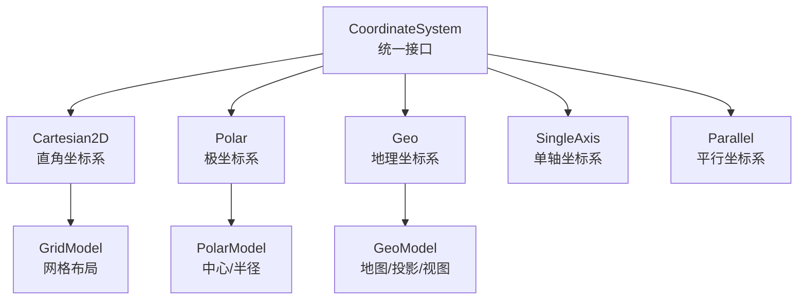
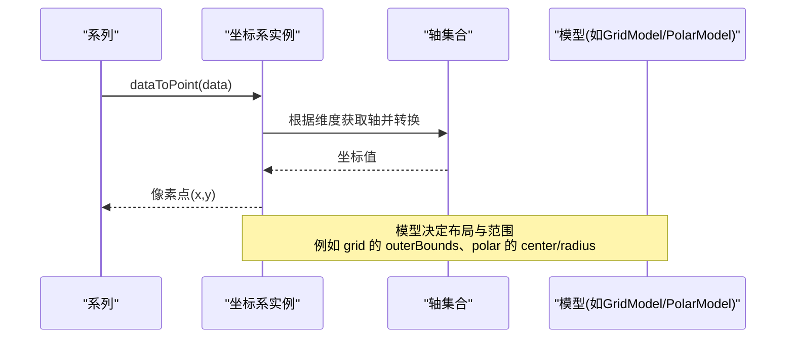
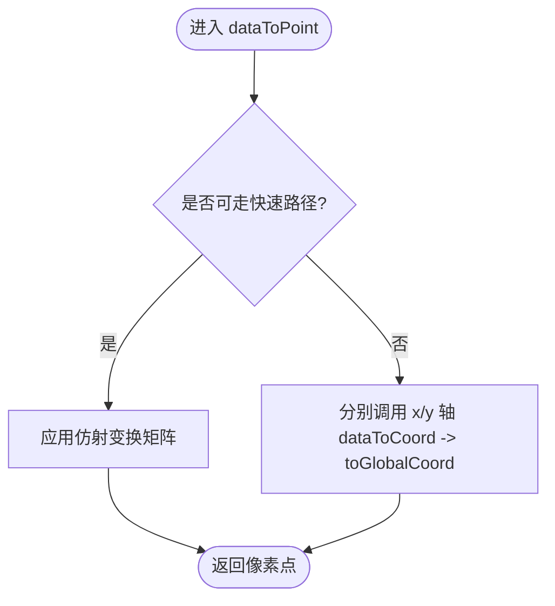
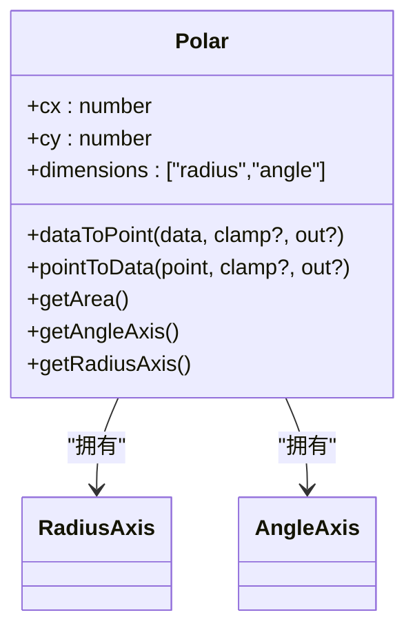
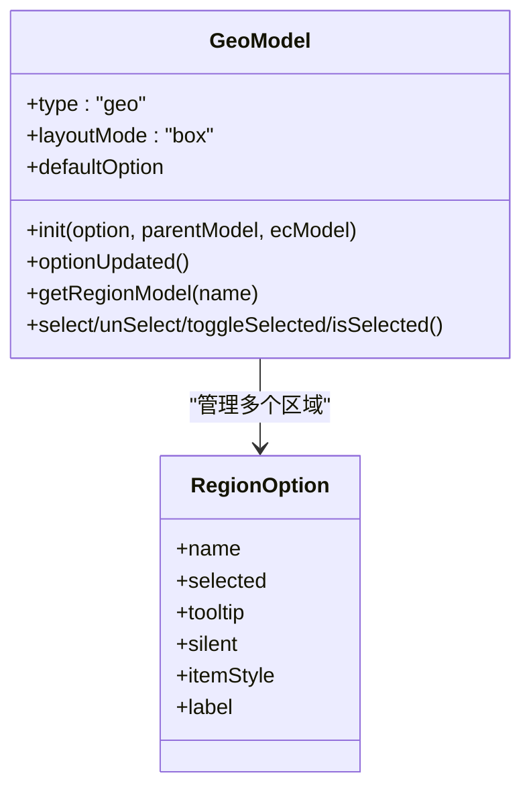
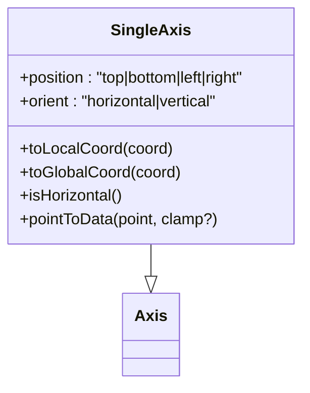
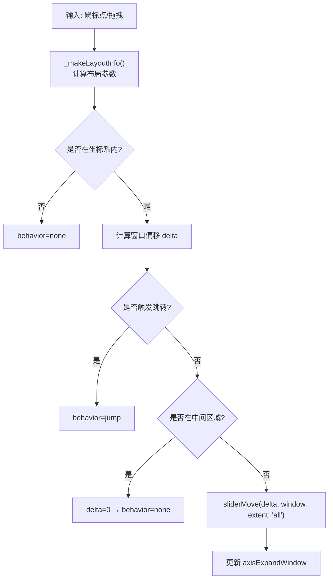
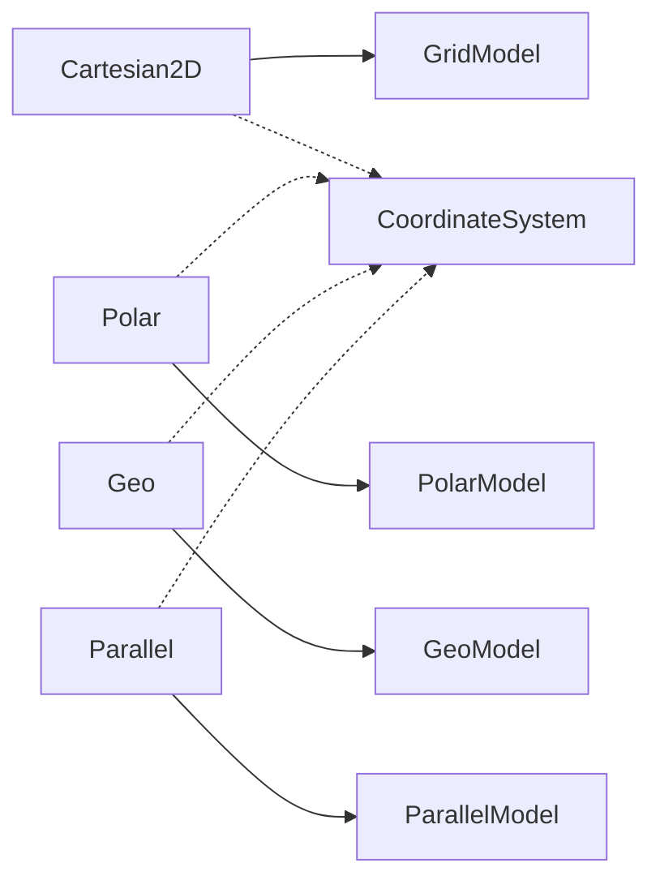

# 坐标系配置项

<cite>
**本文引用的文件**
- [CoordinateSystem.ts](file://src/coord/CoordinateSystem.ts)
- [Cartesian2D.ts](file://src/coord/cartesian/Cartesian2D.ts)
- [GridModel.ts](file://src/coord/cartesian/GridModel.ts)
- [Polar.ts](file://src/coord/polar/Polar.ts)
- [PolarModel.ts](file://src/coord/polar/PolarModel.ts)
- [GeoModel.ts](file://src/coord/geo/GeoModel.ts)
- [SingleAxis.ts](file://src/coord/single/SingleAxis.ts)
- [Parallel.ts](file://src/coord/parallel/Parallel.ts)
</cite>

## 目录
1. [简介](#简介)
2. [项目结构](#项目结构)
3. [核心组件](#核心组件)
4. [架构总览](#架构总览)
5. [详细组件分析](#详细组件分析)
6. [依赖关系分析](#依赖关系分析)
7. [性能考虑](#性能考虑)
8. [故障排查指南](#故障排查指南)
9. [结论](#结论)
10. [附录](#附录)

## 简介
本参考文档系统性梳理 ECharts 的坐标系配置体系，覆盖直角坐标系（cartesian）、极坐标系（polar）、地理坐标系（geo）、单轴坐标系（singleAxis）、平行坐标系（parallel）与矩阵坐标系（matrix）。重点说明 axis、grid、polar、geo 等核心配置项，解释坐标轴的刻度、标签、轴线、分割线等常见能力，并提供复杂坐标系组合使用的思路与性能优化建议。

## 项目结构
ECharts 将“坐标系”抽象为 CoordinateSystem 接口，并通过不同模块实现具体坐标系：
- 通用基座：CoordinateSystem 定义数据点与像素点转换、包含判断、区域裁剪、轴获取等统一能力。
- 直角坐标系：Cartesian2D 基于 Grid 布局，提供 x/y 两轴与矩形区域。
- 极坐标系：Polar 由半径轴与角度轴组成，支持环形区域与角度范围。
- 地理坐标系：Geo 负责地图投影、视图控制、区域样式与交互。
- 单轴坐标系：SingleAxis 用于一维展示场景（如时间轴、指标轴）。
- 平行坐标系：Parallel 支持多维并行轴，具备展开/折叠布局与窗口滑动。
- 矩阵坐标系：Matrix 用于矩阵类可视化（如热力矩阵），在 coord/matrix 目录下实现。

**图示来源**
- [CoordinateSystem.ts:121-233](file://src/coord/CoordinateSystem.ts#L121-L233)
- [Cartesian2D.ts:41-50](file://src/coord/cartesian/Cartesian2D.ts#L41-L50)
- [Polar.ts:34-58](file://src/coord/polar/Polar.ts#L34-L58)
- [GeoModel.ts:154-161](file://src/coord/geo/GeoModel.ts#L154-L161)
- [SingleAxis.ts:40-48](file://src/coord/single/SingleAxis.ts#L40-L48)
- [Parallel.ts:76-102](file://src/coord/parallel/Parallel.ts#L76-L102)

**章节来源**
- [CoordinateSystem.ts:121-233](file://src/coord/CoordinateSystem.ts#L121-L233)

## 核心组件
- 坐标系基座（CoordinateSystem）
  - 数据到像素/布局转换：dataToPoint、dataToLayout
  - 像素到数据转换：pointToData
  - 包含判断：containPoint、containData
  - 区域裁剪：getArea、shouldClip
  - 轴访问：getAxes、getAxis、getBaseAxis、getOtherAxis
  - 扩展：getBoundingRect、getViewRect、getRoamTransform（地理类）
- 直角坐标系（Cartesian2D）
  - 维度：x、y
  - 基础轴选择：优先 ordinal/time，否则 x
  - 仿射变换加速：当双轴均为线性或时间且无断点时，使用矩阵加速 dataToPoint/pointToData
  - 区域：矩形区域，支持容差
- 极坐标系（Polar）
  - 维度：radius、angle
  - 中心点 cx/cy，角度范围与方向，半径范围
  - 环形区域：r0/r、起止角、顺时针
- 地理坐标系（Geo）
  - 地图源、投影、视口 boundingCoords、center/zoom
  - 区域 regions、名称映射 nameMap/nameProperty
  - 样式 itemStyle、label、状态 emphasis/select
- 单轴坐标系（SingleAxis）
  - 一维轴，位置 top/bottom/left/right，方向水平/垂直
  - pointToData 返回该轴对应数据值
- 平行坐标系（Parallel）
  - 多轴并行，支持 horizontal/vertical 布局
  - 轴展开/折叠、窗口滑动、活跃态过滤
  - 轴布局信息：位置、旋转、变换矩阵、标签显示策略

**章节来源**
- [CoordinateSystem.ts:121-233](file://src/coord/CoordinateSystem.ts#L121-L233)
- [Cartesian2D.ts:41-105](file://src/coord/cartesian/Cartesian2D.ts#L41-L105)
- [Polar.ts:34-134](file://src/coord/polar/Polar.ts#L34-L134)
- [GeoModel.ts:125-152](file://src/coord/geo/GeoModel.ts#L125-L152)
- [SingleAxis.ts:40-73](file://src/coord/single/SingleAxis.ts#L40-L73)
- [Parallel.ts:76-179](file://src/coord/parallel/Parallel.ts#L76-L179)

## 架构总览
下图展示了坐标系与模型之间的依赖关系，以及数据到像素的转换路径。

**图示来源**
- [Cartesian2D.ts:131-152](file://src/coord/cartesian/Cartesian2D.ts#L131-L152)
- [Polar.ts:140-158](file://src/coord/polar/Polar.ts#L140-L158)
- [GridModel.ts:98-147](file://src/coord/cartesian/GridModel.ts#L98-L147)
- [PolarModel.ts:38-69](file://src/coord/polar/PolarModel.ts#L38-L69)

## 详细组件分析

### 直角坐标系（cartesian）
- 关键配置
  - grid：布局边界 left/top/right/bottom/width/height；outerBoundsMode/outerBounds/outerBoundsContain；outerBoundsClampWidth/Height；背景、边框等
  - xAxis/yAxis：类型、刻度、标签、轴线、分割线、范围、对齐、反转等
- 行为要点
  - 基础轴选择：ordinal > time > x
  - 仿射变换加速：当 x/y 均为 interval/time 且无断点时启用
  - 区域裁剪：矩形区域，支持容差
  - 包含判断：同时满足 x/y 轴范围

**图示来源**
- [Cartesian2D.ts:58-88](file://src/coord/cartesian/Cartesian2D.ts#L58-L88)
- [Cartesian2D.ts:131-152](file://src/coord/cartesian/Cartesian2D.ts#L131-L152)

**章节来源**
- [Cartesian2D.ts:41-105](file://src/coord/cartesian/Cartesian2D.ts#L41-L105)
- [Cartesian2D.ts:131-184](file://src/coord/cartesian/Cartesian2D.ts#L131-L184)
- [GridModel.ts:39-147](file://src/coord/cartesian/GridModel.ts#L39-L147)

### 极坐标系（polar）
- 关键配置
  - polar：center（中心点）、radius（半径）
  - angleAxis/radiusAxis：刻度、标签、轴线、分割线、范围、反转、起始角/结束角等
- 行为要点
  - 数据到像素：先转 radius/angle 坐标，再转 xy
  - 环形区域：r0/r、起止角、顺时针
  - 基础轴选择：ordinal > time > angleAxis

**图示来源**
- [Polar.ts:34-134](file://src/coord/polar/Polar.ts#L34-L134)
- [Polar.ts:140-248](file://src/coord/polar/Polar.ts#L140-L248)

**章节来源**
- [Polar.ts:34-134](file://src/coord/polar/Polar.ts#L34-L134)
- [Polar.ts:140-248](file://src/coord/polar/Polar.ts#L140-L248)
- [PolarModel.ts:38-69](file://src/coord/polar/PolarModel.ts#L38-L69)

### 地理坐标系（geo）
- 关键配置
  - geo：map、projection、boundingCoords、center、zoom、scaleLimit
  - regions：区域级样式、标签、选中模式 selectedMode、selectedMap
  - itemStyle/label/emphasis/select：区域外观与状态
  - layoutCenter/layoutSize：以固定宽高和比例放置地图
- 行为要点
  - 通过 GeoModel 管理资源与区域模型
  - 支持名称映射 nameMap/nameProperty
  - 默认 label/emphasis/show 等状态处理

**图示来源**
- [GeoModel.ts:125-152](file://src/coord/geo/GeoModel.ts#L125-L152)
- [GeoModel.ts:154-245](file://src/coord/geo/GeoModel.ts#L154-L245)
- [GeoModel.ts:247-352](file://src/coord/geo/GeoModel.ts#L247-L352)

**章节来源**
- [GeoModel.ts:125-152](file://src/coord/geo/GeoModel.ts#L125-L152)
- [GeoModel.ts:154-245](file://src/coord/geo/GeoModel.ts#L154-L245)
- [GeoModel.ts:247-352](file://src/coord/geo/GeoModel.ts#L247-L352)

### 单轴坐标系（singleAxis）
- 关键配置
  - singleAxis：类型、刻度、标签、轴线、分割线、范围、位置（top/bottom/left/right）
- 行为要点
  - 继承 Axis，提供 toLocalCoord/toGlobalCoord
  - pointToData 返回该轴对应数据值
  - isHorizontal 判断方向

**图示来源**
- [SingleAxis.ts:40-73](file://src/coord/single/SingleAxis.ts#L40-L73)

**章节来源**
- [SingleAxis.ts:40-73](file://src/coord/single/SingleAxis.ts#L40-L73)

### 平行坐标系（parallel）
- 关键配置
  - parallel：布局方向 layout（horizontal/vertical）、轴展开 axisExpandable、axisExpandWidth、axisExpandCount、axisExpandWindow、axisExpandCenter、axisExpandSlideTriggerArea
  - parallelAxis：每个维度的轴配置（类型、刻度、标签、范围、反转等）
- 行为要点
  - 动态布局：计算轴间距、展开窗口、折叠宽度
  - 活跃态：eachActiveState 遍历数据并根据各轴 activeState 判定
  - 滑动交互：getSlidedAxisExpandWindow 支持 slide/jump/none
  - 轴布局：position/rotation/transform、标签显示策略

**图示来源**
- [Parallel.ts:185-249](file://src/coord/parallel/Parallel.ts#L185-L249)
- [Parallel.ts:415-475](file://src/coord/parallel/Parallel.ts#L415-L475)

**章节来源**
- [Parallel.ts:76-179](file://src/coord/parallel/Parallel.ts#L76-L179)
- [Parallel.ts:185-249](file://src/coord/parallel/Parallel.ts#L185-L249)
- [Parallel.ts:323-410](file://src/coord/parallel/Parallel.ts#L323-L410)
- [Parallel.ts:415-475](file://src/coord/parallel/Parallel.ts#L415-L475)

### 矩阵坐标系（matrix）
- 说明
  - 矩阵坐标系用于矩阵类可视化（如矩阵图），其实现位于 coord/matrix 目录，通常配合 series.matrix 使用
  - 典型能力包括矩阵体渲染、行列维度定义、标签格式化等
  - 由于本文未直接读取 matrix 源码细节，此处不展开具体属性清单

[本节为概念性说明，不引用具体文件]

## 依赖关系分析
- Cartesian2D 依赖 GridModel 提供的布局与边界约束，并通过 x/y 轴完成数据到像素的转换
- Polar 依赖 PolarModel 的中心与半径配置，内部维护 angleAxis 与 radiusAxis
- Geo 通过 GeoModel 管理地图资源、区域模型与视图控制
- Parallel 通过 ParallelModel 驱动多轴布局与交互逻辑
- 所有坐标系均遵循 CoordinateSystem 的统一接口，便于系列与工具链复用

**图示来源**
- [Cartesian2D.ts:41-50](file://src/coord/cartesian/Cartesian2D.ts#L41-L50)
- [Polar.ts:34-58](file://src/coord/polar/Polar.ts#L34-L58)
- [GeoModel.ts:154-161](file://src/coord/geo/GeoModel.ts#L154-L161)
- [Parallel.ts:76-102](file://src/coord/parallel/Parallel.ts#L76-L102)
- [CoordinateSystem.ts:121-233](file://src/coord/CoordinateSystem.ts#L121-L233)

**章节来源**
- [CoordinateSystem.ts:121-233](file://src/coord/CoordinateSystem.ts#L121-L233)

## 性能考虑
- 直角坐标系
  - 启用仿射变换加速：当 x/y 均为 interval/time 且无断点时，dataToPoint/pointToData 使用矩阵运算，显著降低大数据量下的转换开销
  - 合理设置 grid.outerBounds* 避免不必要的重排与裁剪
- 极坐标系
  - 控制角度范围与半径范围，减少无效区域绘制
  - 对大量点采用采样或聚合策略
- 地理坐标系
  - 使用合适的 projection 与 boundingCoords 限制渲染范围
  - 合理使用 regions 的样式与标签，避免过多文本渲染
- 平行坐标系
  - 利用 axisExpandable/axisExpandWidth/axisExpandCount 控制可见轴数量，减少布局与绘制成本
  - 使用 eachActiveState 进行活跃态过滤，降低渲染压力
- 通用
  - 谨慎开启动画与过渡，必要时关闭以提升性能
  - 合理设置 dataZoom 与视觉映射，减少大规模数据的实时计算

[本节为通用指导，不引用具体文件]

## 故障排查指南
- 坐标转换异常
  - 检查 axis 的范围与类型是否与数据匹配（如时间轴需时间戳）
  - 确认是否启用了断点 scale.break，可能影响仿射变换加速
- 标签溢出或布局错乱
  - 调整 grid.outerBoundsMode/outerBounds/outerBoundsContain，确保标签与名称不被裁剪
  - 对于极坐标，检查 angleAxis 的起始/结束角与方向
- 地图显示问题
  - 确认 map 资源已正确加载，projection 与 center/zoom 匹配
  - 检查 regions 的名称映射 nameMap/nameProperty 是否正确
- 平行坐标轴不可见或重叠
  - 调整 axisExpandWidth/axisExpandCount/axisExpandWindow，确保展开窗口有效
  - 检查 axisExpandSlideTriggerArea 是否导致意外行为

**章节来源**
- [Cartesian2D.ts:58-88](file://src/coord/cartesian/Cartesian2D.ts#L58-L88)
- [GridModel.ts:126-147](file://src/coord/cartesian/GridModel.ts#L126-L147)
- [Polar.ts:163-189](file://src/coord/polar/Polar.ts#L163-L189)
- [GeoModel.ts:247-352](file://src/coord/geo/GeoModel.ts#L247-L352)
- [Parallel.ts:185-249](file://src/coord/parallel/Parallel.ts#L185-L249)

## 结论
ECharts 的坐标系体系以统一的 CoordinateSystem 接口为核心，针对不同可视化需求提供了直角、极坐标、地理、单轴、平行与矩阵等多种实现。通过合理的 axis/grid/polar/geo 配置，可以灵活控制刻度、标签、轴线、分割线与布局。结合仿射变换加速、区域裁剪、活跃态过滤等机制，可在保证表现力的同时获得良好的性能。

[本节为总结性内容，不引用具体文件]

## 附录
- 常用配置速查
  - grid：outerBoundsMode、outerBounds、outerBoundsContain、outerBoundsClampWidth/Height、backgroundColor、borderWidth、borderColor
  - polar：center、radius；angleAxis/radiusAxis：刻度、标签、轴线、分割线、范围、反转、起始/结束角
  - geo：map、projection、boundingCoords、center、zoom、scaleLimit；regions：itemStyle、label、selectedMode、selectedMap
  - singleAxis：类型、刻度、标签、轴线、分割线、范围、位置
  - parallel：layout、axisExpandable、axisExpandWidth、axisExpandCount、axisExpandWindow、axisExpandCenter、axisExpandSlideTriggerArea；parallelAxis：各维度轴配置
- 复杂坐标系组合建议
  - 在同一画布中混合使用 grid 与 geo：通过 boxCoordinateSystem 注入，使地图与直角图表共享布局空间
  - 极坐标与直角坐标切换：通过 series.coordinateSystem 与 model.finder 定位目标坐标系
  - 平行坐标与数据缩放：结合 dataZoom 与 eachActiveState 实现高效筛选与渲染

[本节为补充说明，不引用具体文件]