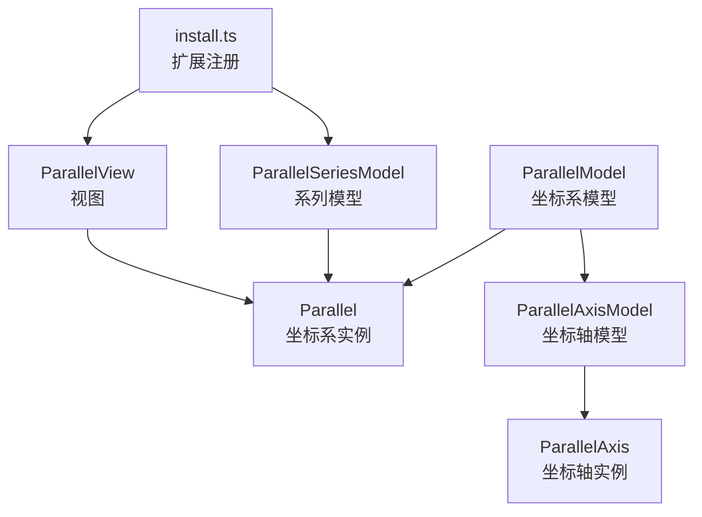
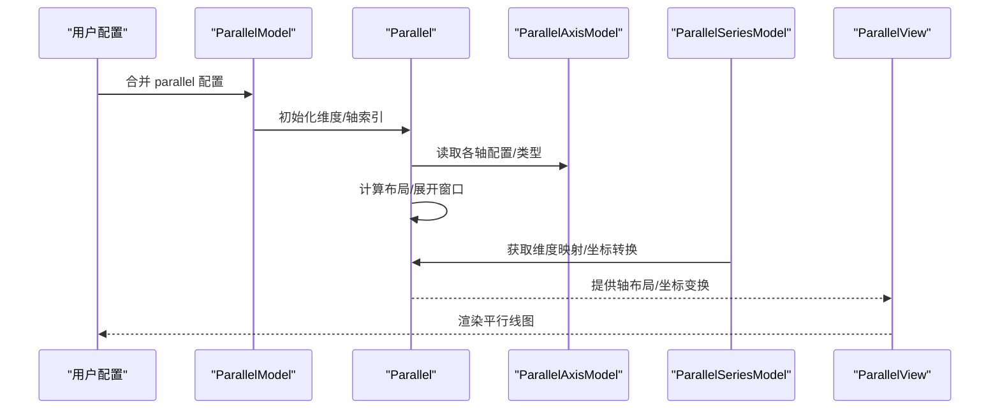
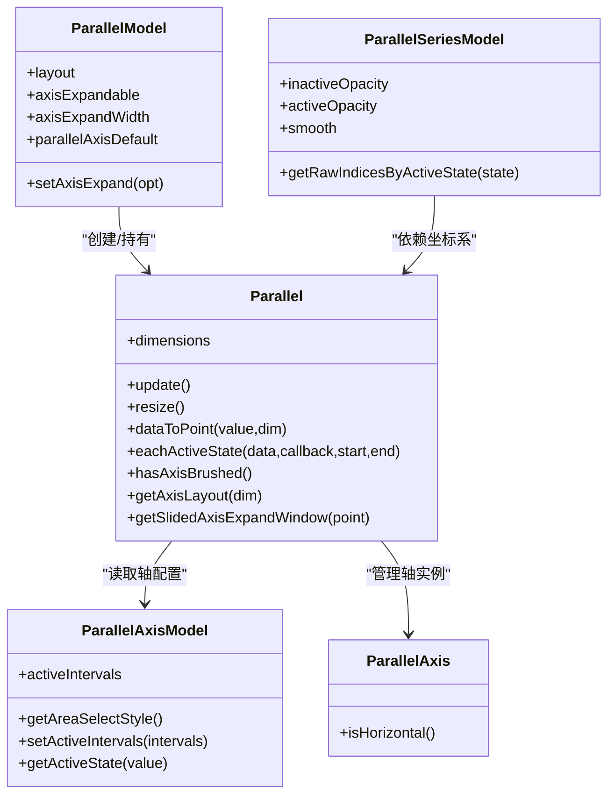
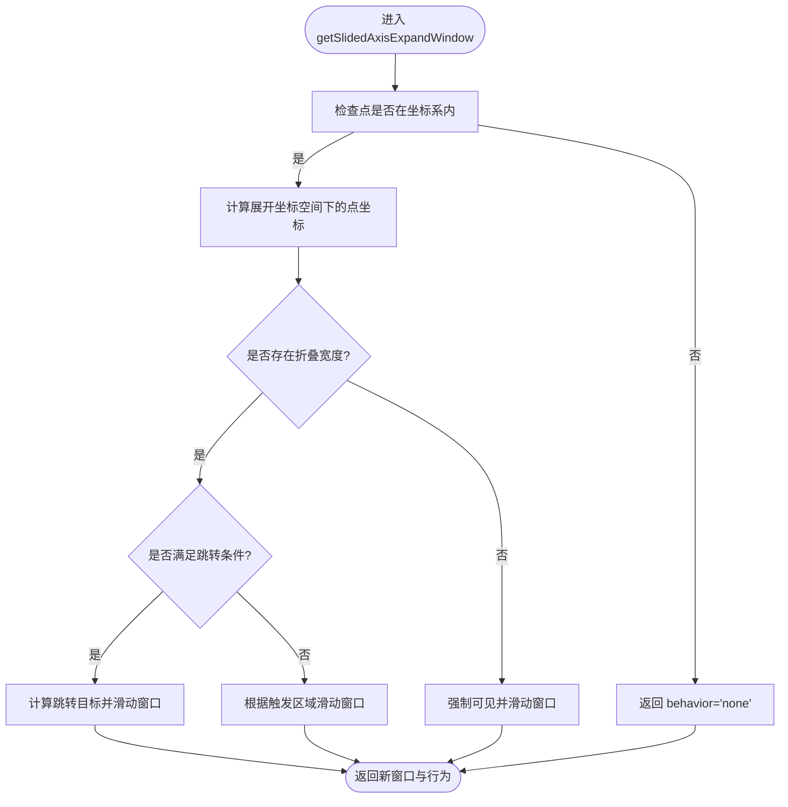
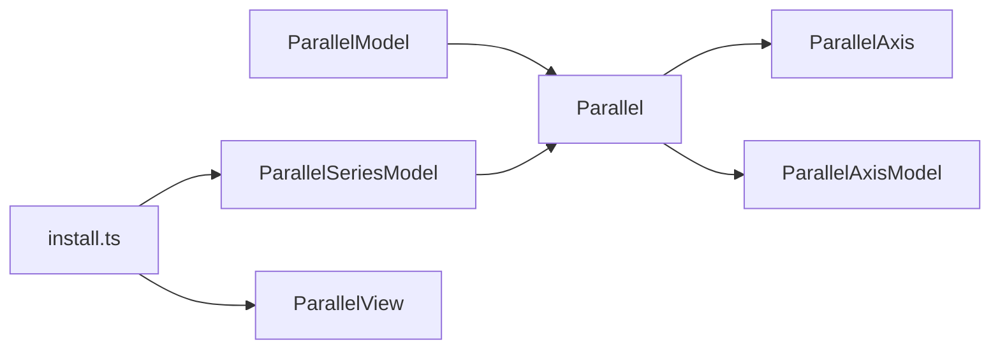

# 平行坐标系配置

<cite>
**本文引用的文件**
- [Parallel.ts](file://src/coord/parallel/Parallel.ts)
- [ParallelModel.ts](file://src/coord/parallel/ParallelModel.ts)
- [AxisModel.ts](file://src/coord/parallel/AxisModel.ts)
- [ParallelAxis.ts](file://src/coord/parallel/ParallelAxis.ts)
- [ParallelSeries.ts](file://src/chart/parallel/ParallelSeries.ts)
- [install.ts（chart）](file://src/chart/parallel/install.ts)
- [parallel-aqi.html](file://test/parallel-aqi.html)
- [parallel-feature.html](file://test/parallel-feature.html)
</cite>

## 目录
1. [简介](#简介)
2. [项目结构](#项目结构)
3. [核心组件](#核心组件)
4. [架构总览](#架构总览)
5. [详细组件分析](#详细组件分析)
6. [依赖关系分析](#依赖关系分析)
7. [性能考虑](#性能考虑)
8. [故障排查指南](#故障排查指南)
9. [结论](#结论)
10. [附录：配置项速查与示例路径](#附录：配置项速查与示例路径)

## 简介
本文件面向 ECharts 的平行坐标系（parallel），系统性说明 parallel 配置对象、坐标轴列表 axisIndicator（即 parallelAxis）、布局 layout、缩放 zoom（通过 dataZoom 集成）、以及每个平行轴的独立配置。文档同时覆盖高维数据分析的应用场景与优势，并提供多维数据可视化、数据筛选、动态更新等高级用法的路径指引与实现要点。

## 项目结构
平行坐标系由“坐标系模型 + 坐标轴模型 + 系列模型 + 视图”构成，并通过扩展机制注册到 ECharts。关键位置如下：
- 坐标系与布局：src/coord/parallel/Parallel.ts、src/coord/parallel/ParallelModel.ts
- 坐标轴模型与状态：src/coord/parallel/AxisModel.ts、src/coord/parallel/ParallelAxis.ts
- 系列与默认编码：src/chart/parallel/ParallelSeries.ts
- 扩展安装：src/chart/parallel/install.ts
- 测试用例（使用示例）：test/parallel-aqi.html、test/parallel-feature.html

图表来源
- [ParallelModel.ts:69-116](file://src/coord/parallel/ParallelModel.ts#L69-L116)
- [Parallel.ts:76-110](file://src/coord/parallel/Parallel.ts#L76-L110)
- [AxisModel.ts:60-148](file://src/coord/parallel/AxisModel.ts#L60-L148)
- [ParallelAxis.ts:29-57](file://src/coord/parallel/ParallelAxis.ts#L29-L57)
- [ParallelSeries.ts:89-157](file://src/chart/parallel/ParallelSeries.ts#L89-L157)
- [install.ts（chart）:26-33](file://src/chart/parallel/install.ts#L26-L33)

章节来源
- [Parallel.ts:76-110](file://src/coord/parallel/Parallel.ts#L76-L110)
- [ParallelModel.ts:69-116](file://src/coord/parallel/ParallelModel.ts#L69-L116)
- [AxisModel.ts:60-148](file://src/coord/parallel/AxisModel.ts#L60-L148)
- [ParallelAxis.ts:29-57](file://src/coord/parallel/ParallelAxis.ts#L29-L57)
- [ParallelSeries.ts:89-157](file://src/chart/parallel/ParallelSeries.ts#L89-L157)
- [install.ts（chart）:26-33](file://src/chart/parallel/install.ts#L26-L33)

## 核心组件
- 坐标系 Parallel：负责维度集合、坐标转换、布局计算、轴展开窗口交互、激活态遍历等。
- 坐标系模型 ParallelModel：维护 parallel 配置（布局、轴展开相关参数、默认轴配置）、维度与轴索引映射。
- 坐标轴模型 ParallelAxisModel：定义每个平行轴的选项（dim、类型、区间选择样式、实时反馈等）与激活区间管理。
- 坐标轴 ParallelAxis：继承通用 Axis，提供水平/垂直判断与类型信息。
- 系列 ParallelSeriesModel：定义 series.parallel 的配置（线条样式、透明度、平滑度、tooltip、encode 默认映射等）。

章节来源
- [Parallel.ts:76-110](file://src/coord/parallel/Parallel.ts#L76-L110)
- [ParallelModel.ts:69-116](file://src/coord/parallel/ParallelModel.ts#L69-L116)
- [AxisModel.ts:60-148](file://src/coord/parallel/AxisModel.ts#L60-L148)
- [ParallelAxis.ts:29-57](file://src/coord/parallel/ParallelAxis.ts#L29-L57)
- [ParallelSeries.ts:89-157](file://src/chart/parallel/ParallelSeries.ts#L89-L157)

## 架构总览
下图展示从配置到渲染的关键调用链：用户配置经 Model 合并后，创建坐标系与坐标轴，计算布局并驱动视图绘制；系列数据按维度映射到各轴进行连线绘制。

图表来源
- [ParallelModel.ts:123-183](file://src/coord/parallel/ParallelModel.ts#L123-L183)
- [Parallel.ts:112-151](file://src/coord/parallel/Parallel.ts#L112-L151)
- [Parallel.ts:185-249](file://src/coord/parallel/Parallel.ts#L185-L249)
- [ParallelSeries.ts:160-182](file://src/chart/parallel/ParallelSeries.ts#L160-L182)

## 详细组件分析

### parallel 配置对象（坐标系级）
- layout：布局方向，支持 horizontal 与 vertical，影响轴线排列与旋转。
- axisExpandable / axisExpandCenter / axisExpandCount / axisExpandWidth：控制多轴时的“展开窗口”，便于在大量维度中聚焦查看。
- axisExpandTriggerOn：触发展开的方式（点击或鼠标移动）。
- axisExpandSlideTriggerArea / axisExpandWindow：内部交互区域与窗口范围（百分比或像素范围）。
- parallelAxisDefault：为所有平行轴提供默认样式与行为（如 type、nameLocation、splitLine 等）。

这些属性在坐标系模型中定义与合并，并在布局阶段被读取以计算轴间距、可见性与交互行为。

章节来源
- [ParallelModel.ts:39-67](file://src/coord/parallel/ParallelModel.ts#L39-L67)
- [ParallelModel.ts:90-116](file://src/coord/parallel/ParallelModel.ts#L90-L116)
- [Parallel.ts:185-249](file://src/coord/parallel/Parallel.ts#L185-L249)

### 坐标轴列表 axisIndicator（即 parallelAxis）
- 每个轴通过 dim 指定对应数据维度（如 0,1,2...），可设置 type（value/category/time/log 等）、data（分类轴）、scale 相关配置（min/max、boundaryGap、interval 等）、label/name/splitLine/splitArea 等样式。
- 支持 areaSelectStyle 自定义区间选择的视觉样式，realtime 控制选择时是否实时更新视图。
- 通过 getActiveState(value) 判断某值是否在激活区间内，用于数据筛选与高亮。

章节来源
- [AxisModel.ts:43-58](file://src/coord/parallel/AxisModel.ts#L43-L58)
- [AxisModel.ts:75-139](file://src/coord/parallel/AxisModel.ts#L75-L139)
- [parallel-aqi.html:134-146](file://test/parallel-aqi.html#L134-L146)

### 布局配置 layout
- 当 layout 为 horizontal 时，轴线沿 x 方向排列，y 方向为数值轴；vertical 则相反。
- 布局算法会计算每个轴的 position、rotation、transform，并处理轴标签显示与名称截断宽度。
- 支持轴展开窗口：在维度较多时，仅展开部分轴，其余折叠以减少拥挤。

章节来源
- [Parallel.ts:185-249](file://src/coord/parallel/Parallel.ts#L185-L249)
- [Parallel.ts:251-311](file://src/coord/parallel/Parallel.ts#L251-L311)

### 缩放配置 zoom（dataZoom）
- 平行坐标系不内置独立的 zoom 配置，而是通过 ECharts 的 dataZoom 组件对各个平行轴进行范围缩放与筛选。
- 结合 parallelAxis 的 scale 配置（如 min、max、type）可实现数值/时间/对数/分类轴的缩放与过滤。
- 配合 visualMap 可实现按维度值的颜色映射，增强多维数据的可读性。

章节来源
- [parallel-aqi.html:120-133](file://test/parallel-aqi.html#L120-L133)
- [parallel-aqi.html:134-146](file://test/parallel-aqi.html#L134-L146)

### 每个平行轴的独立配置
- 数据类型：通过 type 指定 value/category/time/log 等；category 需提供 data。
- 刻度范围：min、max、boundaryGap、interval 等控制刻度生成与范围。
- 标签格式：name、nameTextStyle、label.formatter、axisLabel.formatter 等。
- 轴线样式：splitLine、splitArea、lineStyle、inverse 等。
- 交互：areaSelectStyle.width/borderWidth/borderColor/color/opacity、realtime 控制选择反馈。

章节来源
- [AxisModel.ts:43-58](file://src/coord/parallel/AxisModel.ts#L43-L58)
- [AxisModel.ts:75-87](file://src/coord/parallel/AxisModel.ts#L75-L87)
- [parallel-aqi.html:134-146](file://test/parallel-aqi.html#L134-L146)

### 系列 series.parallel 配置
- lineStyle：线条宽度、透明度、类型等。
- inactiveOpacity / activeOpacity：未激活与激活状态的透明度，配合轴区间选择实现数据筛选。
- smooth：折线平滑度（布尔或数值）。
- tooltip：提示框配置。
- encode：默认将 parallel 维度名（dim0、dim1…）映射到数据列；也可显式配置 encode 覆盖。

章节来源
- [ParallelSeries.ts:62-86](file://src/chart/parallel/ParallelSeries.ts#L62-L86)
- [ParallelSeries.ts:127-157](file://src/chart/parallel/ParallelSeries.ts#L127-L157)
- [ParallelSeries.ts:160-182](file://src/chart/parallel/ParallelSeries.ts#L160-L182)

### 交互与事件
- 轴区间选择：通过 areaSelectStyle 与 setActiveIntervals 设置激活区间；getActiveState 判断数据项是否处于激活状态。
- 事件：axisAreaSelected 可用于获取当前选中的原始数据索引，便于联动其他图表或后端查询。

章节来源
- [AxisModel.ts:97-139](file://src/coord/parallel/AxisModel.ts#L97-L139)
- [parallel-aqi.html:189-192](file://test/parallel-aqi.html#L189-L192)

### 类图（代码级）

图表来源
- [Parallel.ts:76-110](file://src/coord/parallel/Parallel.ts#L76-L110)
- [ParallelModel.ts:69-116](file://src/coord/parallel/ParallelModel.ts#L69-L116)
- [AxisModel.ts:60-148](file://src/coord/parallel/AxisModel.ts#L60-L148)
- [ParallelAxis.ts:29-57](file://src/coord/parallel/ParallelAxis.ts#L29-L57)
- [ParallelSeries.ts:89-157](file://src/chart/parallel/ParallelSeries.ts#L89-L157)

### 流程图（轴展开窗口交互）

图表来源
- [Parallel.ts:415-475](file://src/coord/parallel/Parallel.ts#L415-L475)

## 依赖关系分析
- 坐标系 Parallel 依赖 ParallelModel 提供的配置与维度信息，并创建/管理多个 ParallelAxis 实例。
- 系列 ParallelSeriesModel 依赖坐标系进行数据到坐标的转换，并依据激活状态计算透明度与选中集。
- 扩展 install.ts 将系列模型、视图与视觉方案注册到 ECharts，使 parallel 可用。

图表来源
- [ParallelModel.ts:69-116](file://src/coord/parallel/ParallelModel.ts#L69-L116)
- [Parallel.ts:76-110](file://src/coord/parallel/Parallel.ts#L76-L110)
- [install.ts（chart）:26-33](file://src/chart/parallel/install.ts#L26-L33)

章节来源
- [ParallelModel.ts:69-116](file://src/coord/parallel/ParallelModel.ts#L69-L116)
- [Parallel.ts:76-110](file://src/coord/parallel/Parallel.ts#L76-L110)
- [install.ts（chart）:26-33](file://src/chart/parallel/install.ts#L26-L33)

## 性能考虑
- 大数据量：合理设置 progressive 与 animationEasing，避免过多动画开销；必要时启用采样或降采样策略。
- 轴数量：维度较多时启用 axisExpandable 与合适的 axisExpandWidth/axisExpandCount，减少渲染压力并提升交互体验。
- 缩放与筛选：优先使用 dataZoom 与 areaSelect 进行前端筛选，减少不必要的数据重算。
- 样式复杂度：简化 splitLine/splitArea 与 label 密度，降低绘制成本。

[本节为通用建议，无需具体文件引用]

## 故障排查指南
- 轴未显示或重叠：检查 layout 与 axisExpandable 配置；确认 axisExpandWidth 与容器尺寸匹配。
- 数据无法映射：确认 parallelAxis.dim 与数据维度一致；必要时显式设置 series.encode。
- 区间选择不生效：确保已设置 areaSelectStyle 且 realtime 符合预期；监听 axisAreaSelected 事件验证选中结果。
- 缩放异常：核对 dataZoom 的 targetAxis 与 parallelAxis 的 type/min/max 是否匹配。

章节来源
- [AxisModel.ts:97-139](file://src/coord/parallel/AxisModel.ts#L97-L139)
- [ParallelSeries.ts:160-182](file://src/chart/parallel/ParallelSeries.ts#L160-L182)
- [parallel-aqi.html:120-146](file://test/parallel-aqi.html#L120-L146)

## 结论
平行坐标系通过并行展示多条多维数据，适合高维数据的对比、趋势分析与筛选。借助 parallel 配置、parallelAxis 独立配置、dataZoom 缩放与 visualMap 映射，可实现灵活的多维可视化与交互。对于大规模数据与复杂布局，应关注性能优化与合理的交互设计。

[本节为总结，无需具体文件引用]

## 附录：配置项速查与示例路径
- parallel 坐标系配置（布局、轴展开、默认轴）
  - 参考：[ParallelModel.ts:39-67](file://src/coord/parallel/ParallelModel.ts#L39-L67)、[ParallelModel.ts:90-116](file://src/coord/parallel/ParallelModel.ts#L90-L116)
- parallelAxis 坐标轴配置（类型、范围、标签、样式、区间选择）
  - 参考：[AxisModel.ts:43-58](file://src/coord/parallel/AxisModel.ts#L43-L58)、[AxisModel.ts:75-139](file://src/coord/parallel/AxisModel.ts#L75-L139)
- series.parallel 系列配置（线条、透明度、平滑、tooltip、encode）
  - 参考：[ParallelSeries.ts:62-86](file://src/chart/parallel/ParallelSeries.ts#L62-L86)、[ParallelSeries.ts:127-157](file://src/chart/parallel/ParallelSeries.ts#L127-L157)、[ParallelSeries.ts:160-182](file://src/chart/parallel/ParallelSeries.ts#L160-L182)
- 数据预处理与维度映射
  - 参考：[ParallelSeries.ts:160-182](file://src/chart/parallel/ParallelSeries.ts#L160-L182)
- 示例：AQI 多维数据 + visualMap + parallelAxis
  - 参考：[parallel-aqi.html:100-185](file://test/parallel-aqi.html#L100-L185)
- 示例：动态更新 smooth、双分类轴
  - 参考：[parallel-feature.html:68-133](file://test/parallel-feature.html#L68-L133)、[parallel-feature.html:147-181](file://test/parallel-feature.html#L147-L181)