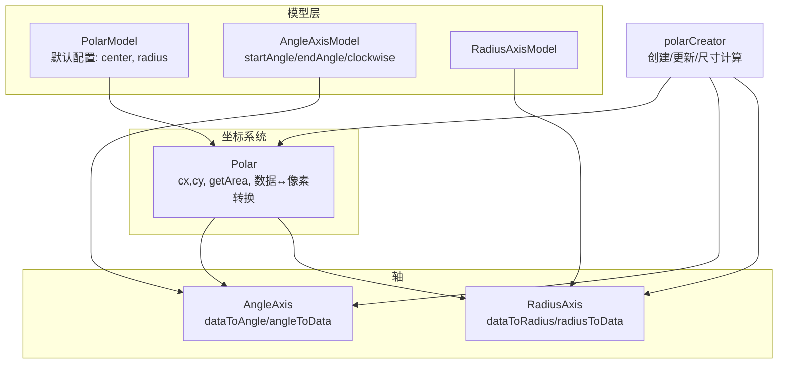
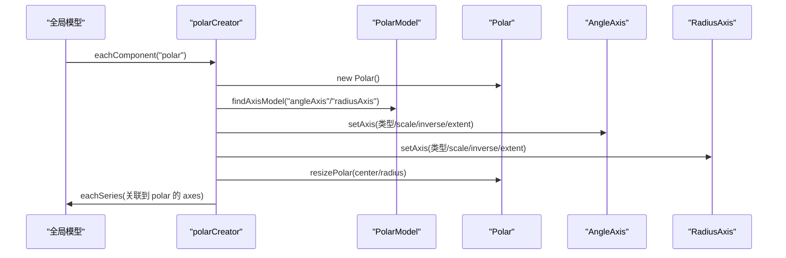
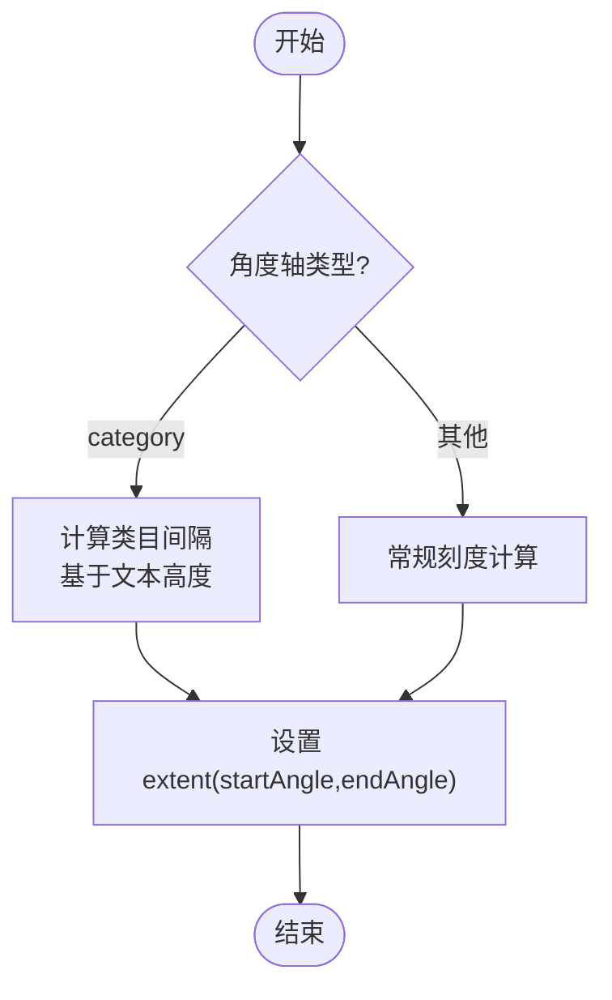
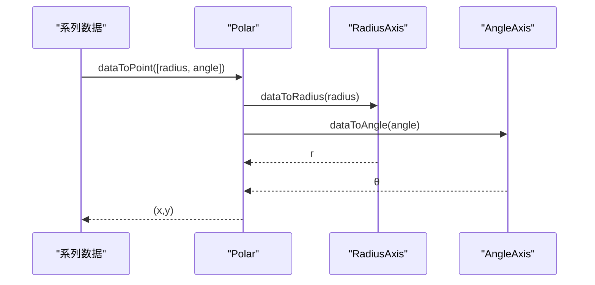
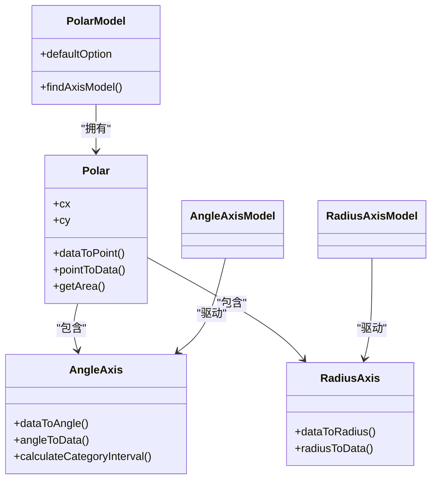

# 极坐标系配置

<cite>
**本文引用的文件**
- [src/coord/polar/Polar.ts](file://src/coord/polar/Polar.ts)
- [src/coord/polar/AxisModel.ts](file://src/coord/polar/AxisModel.ts)
- [src/coord/polar/AngleAxis.ts](file://src/coord/polar/AngleAxis.ts)
- [src/coord/polar/RadiusAxis.ts](file://src/coord/polar/RadiusAxis.ts)
- [src/coord/polar/polarCreator.ts](file://src/coord/polar/polarCreator.ts)
- [src/coord/polar/PolarModel.ts](file://src/coord/polar/PolarModel.ts)
- [test/bar-polar-basic-radial.html](file://test/bar-polar-basic-radial.html)
- [test/radar.html](file://test/radar.html)
- [test/polarLine.html](file://test/polarLine.html)
</cite>

## 目录
1. [简介](#简介)
2. [项目结构](#项目结构)
3. [核心组件](#核心组件)
4. [架构总览](#架构总览)
5. [详细组件分析](#详细组件分析)
6. [依赖关系分析](#依赖关系分析)
7. [性能注意事项](#性能注意事项)
8. [故障排查指南](#故障排查指南)
9. [结论](#结论)
10. [附录：常用配置速查与示例路径](#附录：常用配置速查与示例路径)

## 简介
本参考聚焦 ECharts 的极坐标系（polar）配置项，系统说明 polar 对象及其角度轴 angleAxis、半径轴 radiusAxis 的配置能力，涵盖中心位置、半径范围、起始角度、顺时针方向、刻度与标签、轴线样式、分割线等。同时对比极坐标与直角坐标的差异，并给出雷达图、极坐标柱状图等典型场景的应用要点，以及数据映射、动画与交互的高级用法指引。

## 项目结构
极坐标系由“模型层 + 坐标系统 + 轴”构成：
- PolarModel：定义 polar 组件默认配置（如 center、radius），声明依赖 angleAxis 与 radiusAxis。
- Polar：实现坐标转换、区域计算、点包含判断等核心逻辑。
- AngleAxis / RadiusAxis：分别表示角度轴与半径轴，继承通用 Axis，提供 dataToAngle/angleToData、dataToRadius/radiusToData 等转换方法。
- AxisModel：定义 angleAxis 与 radiusAxis 的配置类型与关联 polar 的能力。
- polarCreator：负责创建 polar 实例、绑定 resize/update、设置轴范围与刻度、将系列与轴关联。

图表来源
- [src/coord/polar/PolarModel.ts:38-69](file://src/coord/polar/PolarModel.ts#L38-L69)
- [src/coord/polar/AxisModel.ts:30-58](file://src/coord/polar/AxisModel.ts#L30-L58)
- [src/coord/polar/Polar.ts:31-90](file://src/coord/polar/Polar.ts#L31-L90)
- [src/coord/polar/AngleAxis.ts:37-45](file://src/coord/polar/AngleAxis.ts#L37-L45)
- [src/coord/polar/RadiusAxis.ts:30-38](file://src/coord/polar/RadiusAxis.ts#L30-L38)
- [src/coord/polar/polarCreator.ts:126-183](file://src/coord/polar/polarCreator.ts#L126-L183)

章节来源
- [src/coord/polar/PolarModel.ts:38-69](file://src/coord/polar/PolarModel.ts#L38-L69)
- [src/coord/polar/polarCreator.ts:47-124](file://src/coord/polar/polarCreator.ts#L47-L124)

## 核心组件
- polar（坐标系统）
  - 中心位置 center：通过解析百分比定位 cx、cy。
  - 半径范围 radius：支持单值或数组 [r0, r]，用于设置半径轴的显示范围。
  - 角度范围与方向：由 angleAxis 的 startAngle、endAngle、clockwise 决定。
  - 数据与像素互转：dataToPoint、pointToData、pointToCoord、coordToPoint。
  - 区域判定：getArea 返回环形区域及 contain 方法。
- angleAxis（角度轴）
  - 类型：category/interval/time/log 等均可；在极坐标中常用于分类维度。
  - 范围控制：startAngle、endAngle、clockwise（影响 inverse）。
  - 刻度与标签：继承通用 axisLabel/axisTick/splitLine/splitArea 等。
  - 类目间隔优化：calculateCategoryInterval 基于文本高度估算避免抖动。
- radiusAxis（半径轴）
  - 类型：通常为 interval/log 等数值型尺度。
  - 范围控制：由 polar.radius 决定显示区间，支持反向（inverse）。
  - 刻度与标签：同样继承通用 axisLabel/axisTick/splitLine/splitArea 等。

章节来源
- [src/coord/polar/Polar.ts:42-158](file://src/coord/polar/Polar.ts#L42-L158)
- [src/coord/polar/AngleAxis.ts:37-125](file://src/coord/polar/AngleAxis.ts#L37-L125)
- [src/coord/polar/RadiusAxis.ts:30-49](file://src/coord/polar/RadiusAxis.ts#L30-L49)
- [src/coord/polar/AxisModel.ts:30-58](file://src/coord/polar/AxisModel.ts#L30-L58)

## 架构总览
极坐标系的创建与更新流程如下：
- polarCreator.create 遍历所有 polar 模型，创建 Polar 实例，注入 update 与 resize。
- 为每个 polar 查找对应的 angleAxisModel 与 radiusAxisModel，调用 setAxis 设置类型、scale、范围与方向。
- 根据 polar.radius 计算半径轴范围，并根据 clockwise 调整角度轴范围。
- 将 series 与对应 polar 的 axes 关联，以便数据缩放、统计等功能。

图表来源
- [src/coord/polar/polarCreator.ts:126-183](file://src/coord/polar/polarCreator.ts#L126-L183)
- [src/coord/polar/polarCreator.ts:47-124](file://src/coord/polar/polarCreator.ts#L47-L124)

章节来源
- [src/coord/polar/polarCreator.ts:47-183](file://src/coord/polar/polarCreator.ts#L47-L183)

## 详细组件分析

### polar 对象基础属性
- center：二维数组，支持百分比与绝对值，最终解析为像素坐标 cx、cy。
- radius：支持字符串或数字，或数组 [r0, r]，用于设定半径轴的显示范围；当为单值时等价于 [0, value]。
- 与角度轴的关系：角度范围由 angleAxis.startAngle、endAngle、clockwise 共同决定；半径范围由 polar.radius 决定。

章节来源
- [src/coord/polar/PolarModel.ts:60-69](file://src/coord/polar/PolarModel.ts#L60-L69)
- [src/coord/polar/polarCreator.ts:50-77](file://src/coord/polar/polarCreator.ts#L50-L77)

### angleAxis（角度轴）配置要点
- 范围与方向
  - startAngle：起始角度（度）。
  - endAngle：结束角度；若未设置，将根据 startAngle 与 clockwise 自动推导。
  - clockwise：布尔值，true 表示顺时针；内部通过 inverse 控制角度轴方向。
- 刻度与标签
  - type：category/interval/time/log 等；在极坐标中 category 常见。
  - axisLabel/axisTick/splitLine/splitArea：继承通用轴配置，可自定义标签格式、刻度样式、分割线与分割区。
- 类目间隔优化
  - calculateCategoryInterval：基于文本高度估算合适的刻度间隔，避免大量类目时的抖动。

图表来源
- [src/coord/polar/AngleAxis.ts:58-117](file://src/coord/polar/AngleAxis.ts#L58-L117)
- [src/coord/polar/polarCreator.ts:108-124](file://src/coord/polar/polarCreator.ts#L108-L124)

章节来源
- [src/coord/polar/AngleAxis.ts:37-125](file://src/coord/polar/AngleAxis.ts#L37-L125)
- [src/coord/polar/AxisModel.ts:30-46](file://src/coord/polar/AxisModel.ts#L30-L46)
- [src/coord/polar/polarCreator.ts:108-124](file://src/coord/polar/polarCreator.ts#L108-L124)

### radiusAxis（半径轴）配置要点
- 范围控制
  - 由 polar.radius 决定显示范围；支持反向（inverse）以反转径向增长方向。
- 刻度与标签
  - type：interval/log 等数值型尺度。
  - axisLabel/axisTick/splitLine/splitArea：同通用轴配置。
- 数据映射
  - dataToRadius/radiusToData：实现数据与半径坐标的互转。

章节来源
- [src/coord/polar/RadiusAxis.ts:30-49](file://src/coord/polar/RadiusAxis.ts#L30-L49)
- [src/coord/polar/polarCreator.ts:50-77](file://src/coord/polar/polarCreator.ts#L50-L77)

### 数据映射与坐标转换
- 数据到像素：dataToPoint(data[0]=radius, data[1]=angle) → (x,y)。
- 像素到数据：pointToData(point) → [radius, angle]。
- 坐标互转：pointToCoord/coordToPoint 实现像素与极坐标（半径、角度）互转。
- 包含判断：containPoint/containData 基于两轴的包含性综合判定。

图表来源
- [src/coord/polar/Polar.ts:136-203](file://src/coord/polar/Polar.ts#L136-L203)

章节来源
- [src/coord/polar/Polar.ts:136-203](file://src/coord/polar/Polar.ts#L136-L203)

### 与直角坐标系的差异
- 维度语义：极坐标使用“半径 + 角度”，直角坐标使用“横轴 + 纵轴”。
- 布局与裁剪：极坐标 getArea 返回环形区域，支持 contain(x,y) 判断；直角坐标为矩形区域。
- 轴行为：角度轴具有循环特性（0°~360°），且可通过 clockwise 控制方向；半径轴为线性或对数尺度。
- 适用图表：极坐标适合雷达图、极坐标柱状图、极坐标折线图等；直角坐标适合大多数通用图表。

章节来源
- [src/coord/polar/Polar.ts:205-248](file://src/coord/polar/Polar.ts#L205-L248)

### 典型应用与示例路径
- 极坐标柱状图（bar in polar）
  - 示例路径：[test/bar-polar-basic-radial.html](file://test/bar-polar-basic-radial.html)
  - 关键点：angleAxis 使用 category，series 指定 coordinateSystem='polar'。
- 极坐标折线图
  - 示例路径：[test/polarLine.html](file://test/polarLine.html)
  - 关键点：可设置 polar.radius、angleAxis.startAngle、axisLine.symbol 等。
- 雷达图（radar）
  - 示例路径：[test/radar.html](file://test/radar.html)
  - 关键点：radar 组件独立于 polar，但概念上共享“多轴+环形”思想；indicator 定义各维度与最大值。

章节来源
- [test/bar-polar-basic-radial.html:46-66](file://test/bar-polar-basic-radial.html#L46-L66)
- [test/polarLine.html:59-140](file://test/polarLine.html#L59-L140)
- [test/radar.html:43-141](file://test/radar.html#L43-L141)

## 依赖关系分析
- PolarModel 依赖 angleAxis 与 radiusAxis 两个子组件。
- polarCreator 在创建 polar 时，会查找并绑定对应的 axisModel，设置 scale、extent 与方向。
- AngleAxis 与 RadiusAxis 均继承通用 Axis，复用刻度、标签、分割线等能力。
- Polar 作为坐标系统，聚合两轴并提供数据与像素的转换接口。

图表来源
- [src/coord/polar/PolarModel.ts:38-69](file://src/coord/polar/PolarModel.ts#L38-L69)
- [src/coord/polar/Polar.ts:31-90](file://src/coord/polar/Polar.ts#L31-L90)
- [src/coord/polar/AngleAxis.ts:37-125](file://src/coord/polar/AngleAxis.ts#L37-L125)
- [src/coord/polar/RadiusAxis.ts:30-49](file://src/coord/polar/RadiusAxis.ts#L30-L49)
- [src/coord/polar/AxisModel.ts:62-89](file://src/coord/polar/AxisModel.ts#L62-L89)

章节来源
- [src/coord/polar/AxisModel.ts:62-89](file://src/coord/polar/AxisModel.ts#L62-L89)
- [src/coord/polar/polarCreator.ts:126-183](file://src/coord/polar/polarCreator.ts#L126-L183)

## 性能注意事项
- 类目角度轴的大数量场景：calculateCategoryInterval 通过文本高度估算与缓存机制减少抖动，提升滚动/缩放体验。
- 半径轴范围合理设置：过大的 radius 会导致渲染面积过大，影响性能；建议结合容器尺寸合理设置。
- 分割线与标签密度：splitLine 与 axisLabel 过多会增加绘制开销，应适度精简。
- 动画时长：animationDuration 较大时会影响交互响应，需权衡视觉效果与性能。

章节来源
- [src/coord/polar/AngleAxis.ts:58-117](file://src/coord/polar/AngleAxis.ts#L58-L117)
- [test/polarLine.html:81-82](file://test/polarLine.html#L81-L82)

## 故障排查指南
- 找不到 polar 错误：当 series 指定 coordinateSystem='polar' 但未正确引用 polarIndex/polarId 时，开发环境会抛出错误提示。
  - 处理建议：确保 series 与 polar 的关联正确，或在默认情况下检查是否存在 polar 组件。
- 角度范围异常：若 startAngle 与 endAngle 设置不当，可能导致角度轴范围不闭合或方向反常。
  - 处理建议：确认 clockwise 与 inverse 的关系，必要时显式设置 endAngle。
- 半径范围无效：若 polar.radius 设置为空或未解析，可能回退为默认范围。
  - 处理建议：明确设置 radius 为数字或百分比，或数组形式 [r0, r]。

章节来源
- [src/coord/polar/polarCreator.ts:153-180](file://src/coord/polar/polarCreator.ts#L153-L180)
- [src/coord/polar/polarCreator.ts:108-124](file://src/coord/polar/polarCreator.ts#L108-L124)
- [src/coord/polar/polarCreator.ts:50-77](file://src/coord/polar/polarCreator.ts#L50-L77)

## 结论
ECharts 的极坐标系通过 polar、angleAxis、radiusAxis 三者的协同，提供了灵活的角度与半径维度建模能力。其核心在于：
- polar 负责中心与半径范围、坐标转换与区域判定；
- angleAxis 管理角度范围、方向与类目刻度；
- radiusAxis 管理半径范围与数值刻度；
- polarCreator 完成创建、更新与关联，确保数据与视图一致。
在实际应用中，结合雷达图、极坐标柱状图/折线图，可实现丰富的可视化效果；同时注意性能与交互的平衡，合理设置刻度、标签与动画参数。

## 附录：常用配置速查与示例路径
- polar
  - center：二维数组，支持百分比与绝对值。
  - radius：字符串/数字/数组 [r0, r]。
  - 示例路径：[test/polarLine.html](file://test/polarLine.html)
- angleAxis
  - type：category/interval/time/log。
  - data：类目数据（type=category）。
  - startAngle/endAngle/clockwise：控制角度范围与方向。
  - axisLabel/axisTick/splitLine/splitArea：标签、刻度、分割线与分割区样式。
  - 示例路径：[test/bar-polar-basic-radial.html](file://test/bar-polar-basic-radial.html)
- radiusAxis
  - type：interval/log。
  - axisLabel/axisTick/splitLine/splitArea：同上。
  - 示例路径：[test/polarLine.html](file://test/polarLine.html)
- 雷达图（radar）
  - indicator：定义维度与最大值。
  - radius/name/formatter：环形范围与名称格式化。
  - 示例路径：[test/radar.html](file://test/radar.html)