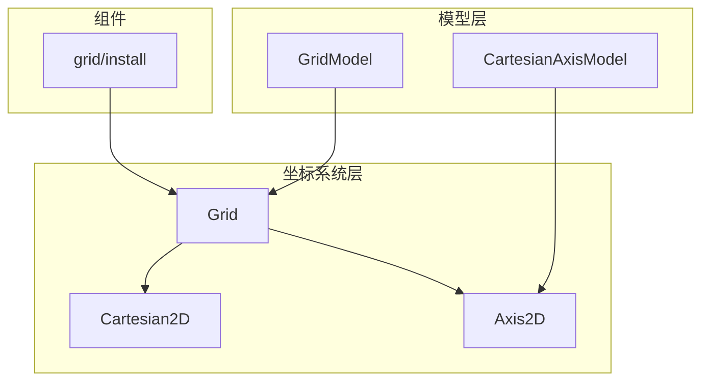
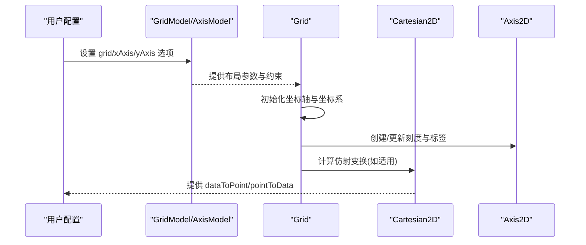
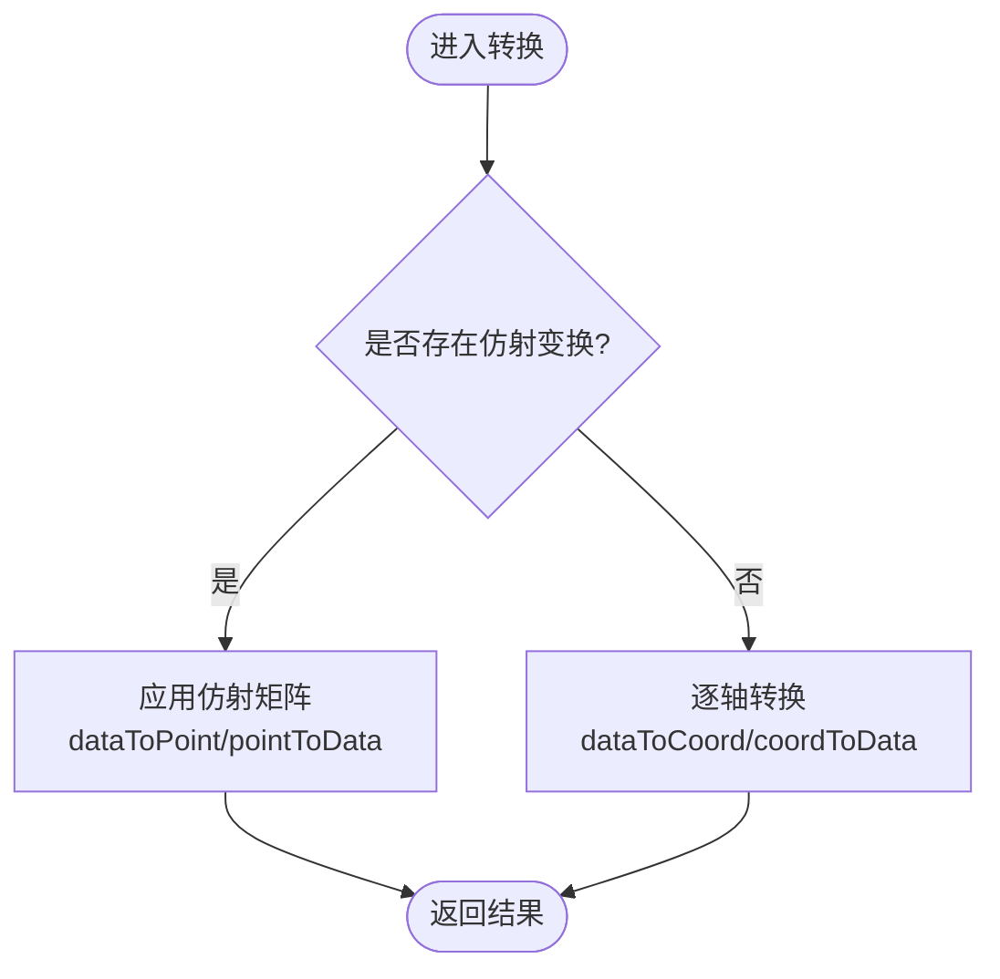
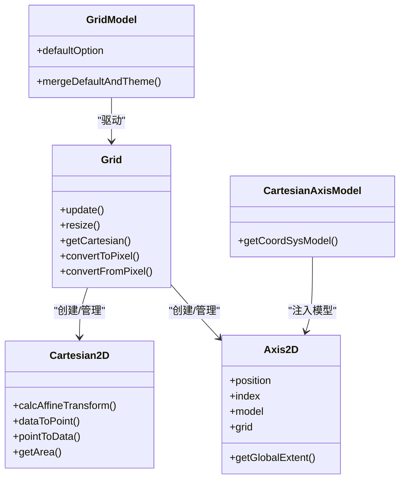
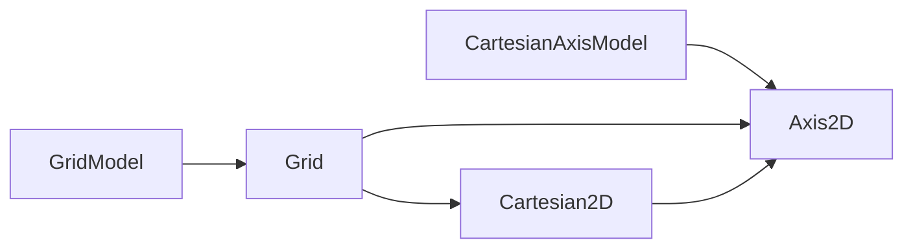

# 直角坐标系配置

<cite>
**本文引用的文件**
- [Grid.ts](file://src/coord/cartesian/Grid.ts)
- [Cartesian2D.ts](file://src/coord/cartesian/Cartesian2D.ts)
- [Axis2D.ts](file://src/coord/cartesian/Axis2D.ts)
- [GridModel.ts](file://src/coord/cartesian/GridModel.ts)
- [AxisModel.ts](file://src/coord/cartesian/AxisModel.ts)
- [install.ts](file://src/component/grid/install.ts)
</cite>

## 目录
1. [简介](#简介)
2. [项目结构](#项目结构)
3. [核心组件](#核心组件)
4. [架构总览](#架构总览)
5. [详细组件分析](#详细组件分析)
6. [依赖关系分析](#依赖关系分析)
7. [性能考量](#性能考量)
8. [故障排查指南](#故障排查指南)
9. [结论](#结论)
10. [附录](#附录)

## 简介
本文面向 ECharts 的直角坐标系（cartesian2d）配置，聚焦 grid、xAxis、yAxis 的核心属性与高级用法。内容涵盖：
- grid 的位置与尺寸控制（left/right/top/bottom/width/height）、边界处理（outerBoundsMode、outerBoundsContain、outerBoundsClampWidth/Height）、标签包含（containLabel）。
- xAxis/yAxis 的类型（type）、刻度（tick）、标签（label）、轴线样式（lineStyle）、分割线（splitLine）等常用配置要点。
- 多网格布局、坐标轴联动（alignTicks/onZero）、响应式适配的实践建议。
- 坐标转换、数据映射与性能优化机制说明。

## 项目结构
直角坐标系由“模型 + 坐标系统 + 视图”三层组成：
- 模型层：GridModel、CartesianAxisModel（定义配置项、默认值、合并策略）。
- 坐标系统层：Grid、Cartesian2D、Axis2D（负责布局、计算、转换）。
- 组件安装：grid 组件通过 install 注册并启用 axisPointer 能力。

图表来源
- [install.ts:20-26](file://src/component/grid/install.ts#L20-L26)
- [GridModel.ts:98-147](file://src/coord/cartesian/GridModel.ts#L98-L147)
- [Grid.ts:103-128](file://src/coord/cartesian/Grid.ts#L103-L128)
- [Cartesian2D.ts:41-49](file://src/coord/cartesian/Cartesian2D.ts#L41-L49)
- [Axis2D.ts:43-86](file://src/coord/cartesian/Axis2D.ts#L43-L86)

章节来源
- [install.ts:20-26](file://src/component/grid/install.ts#L20-L26)
- [GridModel.ts:98-147](file://src/coord/cartesian/GridModel.ts#L98-L147)
- [Grid.ts:103-128](file://src/coord/cartesian/Grid.ts#L103-L128)
- [Cartesian2D.ts:41-49](file://src/coord/cartesian/Cartesian2D.ts#L41-L49)
- [Axis2D.ts:43-86](file://src/coord/cartesian/Axis2D.ts#L43-L86)

## 核心组件
- Grid：管理一个或多个笛卡尔坐标系实例，负责创建 Axis、组合 Cartesian2D、执行布局与更新、提供坐标转换 API。
- Cartesian2D：二维笛卡尔坐标系，封装 dataToPoint/pointToData、区域判断、仿射变换加速等。
- Axis2D：直角坐标轴对象，维护位置、方向、全局范围、类目排序等信息。
- GridModel/CartesianAxisModel：承载 grid/xAxis/yAxis 的配置项、默认值与合并逻辑。

章节来源
- [Grid.ts:103-128](file://src/coord/cartesian/Grid.ts#L103-L128)
- [Cartesian2D.ts:41-49](file://src/coord/cartesian/Cartesian2D.ts#L41-L49)
- [Axis2D.ts:43-86](file://src/coord/cartesian/Axis2D.ts#L43-L86)
- [GridModel.ts:98-147](file://src/coord/cartesian/GridModel.ts#L98-L147)
- [AxisModel.ts:49-67](file://src/coord/cartesian/AxisModel.ts#L49-L67)

## 架构总览
下图展示了从配置到渲染的关键流程：模型解析 → 坐标系统创建 → 布局与刻度计算 → 坐标转换与绘制。

图表来源
- [Grid.ts:407-513](file://src/coord/cartesian/Grid.ts#L407-L513)
- [Grid.ts:134-189](file://src/coord/cartesian/Grid.ts#L134-L189)
- [Cartesian2D.ts:58-88](file://src/coord/cartesian/Cartesian2D.ts#L58-L88)

## 详细组件分析

### grid 配置详解
- 位置与尺寸
  - left/right/top/bottom/width/height：通过 BoxLayout 确定绘图区域矩形。
- 边界与包含
  - containLabel：旧版方式，近似包含标签；内部会触发基于 outerBounds 的新布局路径。
  - outerBoundsMode：'auto'/'same'/'none'，控制外边界约束模式。
  - outerBounds：以 box 布局参数形式定义的外边界矩形。
  - outerBoundsContain：'all'/'axisLabel'/'auto'，决定收缩目标（全部元素或仅标签）。
  - outerBoundsClampWidth/Height：防止因收缩导致宽高小于原设定值的下限（支持百分比）。
- 背景与边框
  - backgroundColor/borderWidth/borderColor：用于网格区域的视觉呈现。

行为要点
- 当开启 containLabel 时，内部会优先采用新的 outerBounds 布局路径，以保证更精确的包含效果。
- 若未显式指定 outerBounds，则使用默认外边界；在 containLabel:true 时等价于 outerBoundsMode:'same' 且 outerBoundsContain:'axisLabel'。

章节来源
- [GridModel.ts:39-96](file://src/coord/cartesian/GridModel.ts#L39-L96)
- [GridModel.ts:126-147](file://src/coord/cartesian/GridModel.ts#L126-L147)
- [Grid.ts:207-279](file://src/coord/cartesian/Grid.ts#L207-L279)

### xAxis / yAxis 配置要点
- 类型 type
  - 常见值：'value'、'category'、'time'、'log' 等，影响刻度生成、对齐与 onZero 行为。
- 刻度 tick
  - 可配置是否显示、间隔、数量、对齐策略（alignTicks）等。
- 标签 label
  - 文本格式、旋转、内边距、是否包含在布局中（受 grid.outerBoundsContain 影响）。
- 轴线 lineStyle
  - 颜色、宽度、箭头、onZero 等。
- 分割线 splitLine
  - 是否显示、样式、是否参与交互等。

注意
- 数值型轴（interval/log/time）支持 alignTicks 对齐刻度；类目轴不支持该特性。
- onZero 仅在合适的数值轴上生效，类目轴与时间轴默认禁用。

章节来源
- [AxisModel.ts:33-47](file://src/coord/cartesian/AxisModel.ts#L33-L47)
- [Grid.ts:723-762](file://src/coord/cartesian/Grid.ts#L723-L762)
- [Grid.ts:614-717](file://src/coord/cartesian/Grid.ts#L614-L717)

### 多网格布局
- 每个 grid 可拥有独立的 left/right/top/bottom/width/height，形成多个绘图区。
- 同一 grid 内的 xAxis/yAxis 共享布局空间，避免重叠；不同 grid 之间相互独立。
- 可通过 gridIndex/gridId 将系列绑定到指定 grid。

章节来源
- [Grid.ts:407-513](file://src/coord/cartesian/Grid.ts#L407-L513)
- [GridModel.ts:126-147](file://src/coord/cartesian/GridModel.ts#L126-L147)

### 坐标轴联动
- alignTicks：对数值型轴进行刻度对齐，使多轴刻度一致，便于对比阅读。
- onZero：让某轴轴线对齐另一轴的零点位置，适用于正负值对比场景。

章节来源
- [Grid.ts:723-762](file://src/coord/cartesian/Grid.ts#L723-L762)
- [Grid.ts:614-717](file://src/coord/cartesian/Grid.ts#L614-L717)

### 响应式适配
- 通过 left/right/top/bottom/width/height 的百分比或像素值，结合容器尺寸变化自动重排。
- 配合 outerBounds* 系列配置，确保在不同屏幕下标签与名称不溢出。

章节来源
- [GridModel.ts:126-147](file://src/coord/cartesian/GridModel.ts#L126-L147)
- [Grid.ts:207-279](file://src/coord/cartesian/Grid.ts#L207-L279)

### 坐标转换与数据映射
- dataToPoint(point)：数据坐标转画布像素点，支持快速路径（仿射矩阵）。
- pointToData(point)：画布像素点转数据坐标。
- convertToPixel/convertFromPixel：Grid 对外暴露的通用转换入口，支持按 series/xAxis/yAxis/grid 定位目标坐标系。

图表来源
- [Cartesian2D.ts:58-88](file://src/coord/cartesian/Cartesian2D.ts#L58-L88)
- [Cartesian2D.ts:131-184](file://src/coord/cartesian/Cartesian2D.ts#L131-L184)
- [Grid.ts:329-354](file://src/coord/cartesian/Grid.ts#L329-L354)

章节来源
- [Cartesian2D.ts:58-88](file://src/coord/cartesian/Cartesian2D.ts#L58-L88)
- [Cartesian2D.ts:131-184](file://src/coord/cartesian/Cartesian2D.ts#L131-L184)
- [Grid.ts:329-354](file://src/coord/cartesian/Grid.ts#L329-L354)

### 类图（代码级关系）

图表来源
- [Grid.ts:103-128](file://src/coord/cartesian/Grid.ts#L103-L128)
- [Cartesian2D.ts:41-49](file://src/coord/cartesian/Cartesian2D.ts#L41-L49)
- [Axis2D.ts:43-86](file://src/coord/cartesian/Axis2D.ts#L43-L86)
- [GridModel.ts:98-147](file://src/coord/cartesian/GridModel.ts#L98-L147)
- [AxisModel.ts:49-67](file://src/coord/cartesian/AxisModel.ts#L49-L67)

## 依赖关系分析
- Grid 依赖 GridModel 提供的布局参数与主题默认值，并在 create/update/resize 阶段协调 Axis 与 Cartesian2D。
- Cartesian2D 依赖 Axis2D 的 scale 与 extent 信息，必要时计算仿射矩阵以提升大数据量下的转换性能。
- Axis2D 依赖其 model 获取配置项（如 position、inverse、onZero 等），并通过 grid 访问布局上下文。

图表来源
- [Grid.ts:407-513](file://src/coord/cartesian/Grid.ts#L407-L513)
- [Cartesian2D.ts:58-88](file://src/coord/cartesian/Cartesian2D.ts#L58-L88)
- [Axis2D.ts:43-86](file://src/coord/cartesian/Axis2D.ts#L43-L86)
- [GridModel.ts:98-147](file://src/coord/cartesian/GridModel.ts#L98-L147)

章节来源
- [Grid.ts:407-513](file://src/coord/cartesian/Grid.ts#L407-L513)
- [Cartesian2D.ts:58-88](file://src/coord/cartesian/Cartesian2D.ts#L58-L88)
- [Axis2D.ts:43-86](file://src/coord/cartesian/Axis2D.ts#L43-L86)
- [GridModel.ts:98-147](file://src/coord/cartesian/GridModel.ts#L98-L147)

## 性能考量
- 仿射变换加速：当 x/y 轴均为线性或时间轴且无断点时，Cartesian2D 会计算并缓存仿射矩阵，显著降低 dataToPoint/pointToData 的计算开销。
- 刻度对齐与 Nice 计算：在 update 阶段对需要对齐的轴进行 scaleCalcAlign，减少重复计算。
- 布局与标签包含：containLabel 或 outerBoundsContain 会在布局阶段二次调整 extent，需权衡精度与性能。

章节来源
- [Cartesian2D.ts:58-88](file://src/coord/cartesian/Cartesian2D.ts#L58-L88)
- [Grid.ts:134-189](file://src/coord/cartesian/Grid.ts#L134-L189)
- [Grid.ts:207-279](file://src/coord/cartesian/Grid.ts#L207-L279)

## 故障排查指南
- 坐标轴未生效或未显示
  - 检查 xAxis/yAxis 是否属于当前 grid（gridIndex/gridId 是否正确）。
  - 确认 grid 的 left/right/top/bottom/width/height 是否合理，避免绘图区域被压缩为无效尺寸。
- 标签溢出或被裁剪
  - 开启 containLabel 或使用 outerBoundsMode:'same' 与 outerBoundsContain:'axisLabel'，确保标签不被裁剪。
  - 使用 outerBoundsClampWidth/Height 限制最小宽高，防止过度收缩。
- onZero 不生效
  - 类目轴与时间轴默认不支持 onZero；需在合适的数值轴上使用。
- 刻度不对齐
  - 确保轴类型为 interval/log/time，并启用 alignTicks；同时避免设置了固定 interval 导致无法对齐。

章节来源
- [Grid.ts:614-717](file://src/coord/cartesian/Grid.ts#L614-L717)
- [Grid.ts:723-762](file://src/coord/cartesian/Grid.ts#L723-L762)
- [GridModel.ts:126-147](file://src/coord/cartesian/GridModel.ts#L126-L147)

## 结论
- grid 的布局与边界控制是直角坐标系的核心，推荐优先使用 outerBounds* 系列配置以获得更精确的包含与响应式表现。
- xAxis/yAxis 的 type、tick、label、lineStyle、splitLine 等配置共同决定了坐标轴的展示与交互体验。
- 利用 alignTicks 与 onZero 可实现多轴联动与零点对齐，提升可读性。
- 在大数据场景下，Cartesian2D 的仿射变换能显著提升坐标转换性能。

## 附录
- 常用配置速查
  - grid：left/right/top/bottom/width/height、containLabel、outerBoundsMode、outerBounds、outerBoundsContain、outerBoundsClampWidth/Height、backgroundColor、borderWidth、borderColor。
  - xAxis/yAxis：type、position、offset、gridIndex/gridId、tick、label、lineStyle、splitLine、alignTicks、onZero。
- 实践建议
  - 多网格：为每个业务模块分配独立 grid，避免互相干扰。
  - 响应式：使用百分比尺寸并结合 outerBounds* 保证标签完整显示。
  - 性能：尽量使用数值/时间轴以启用仿射变换；避免不必要的复杂标签与过多刻度。