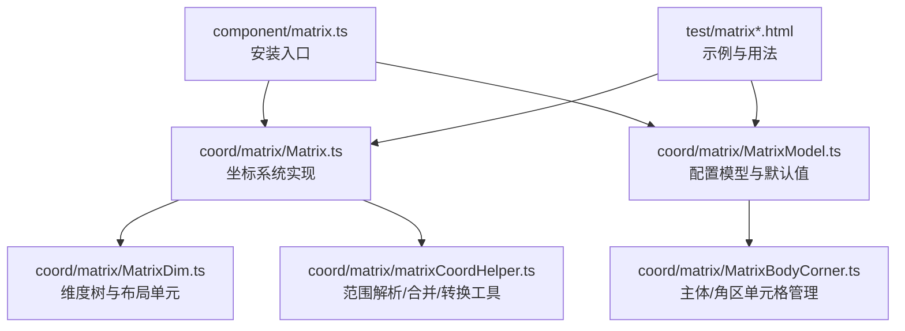
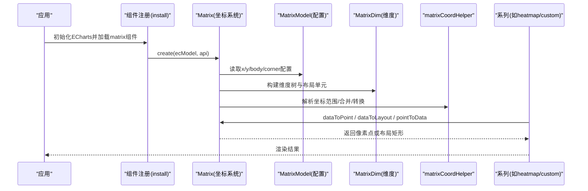
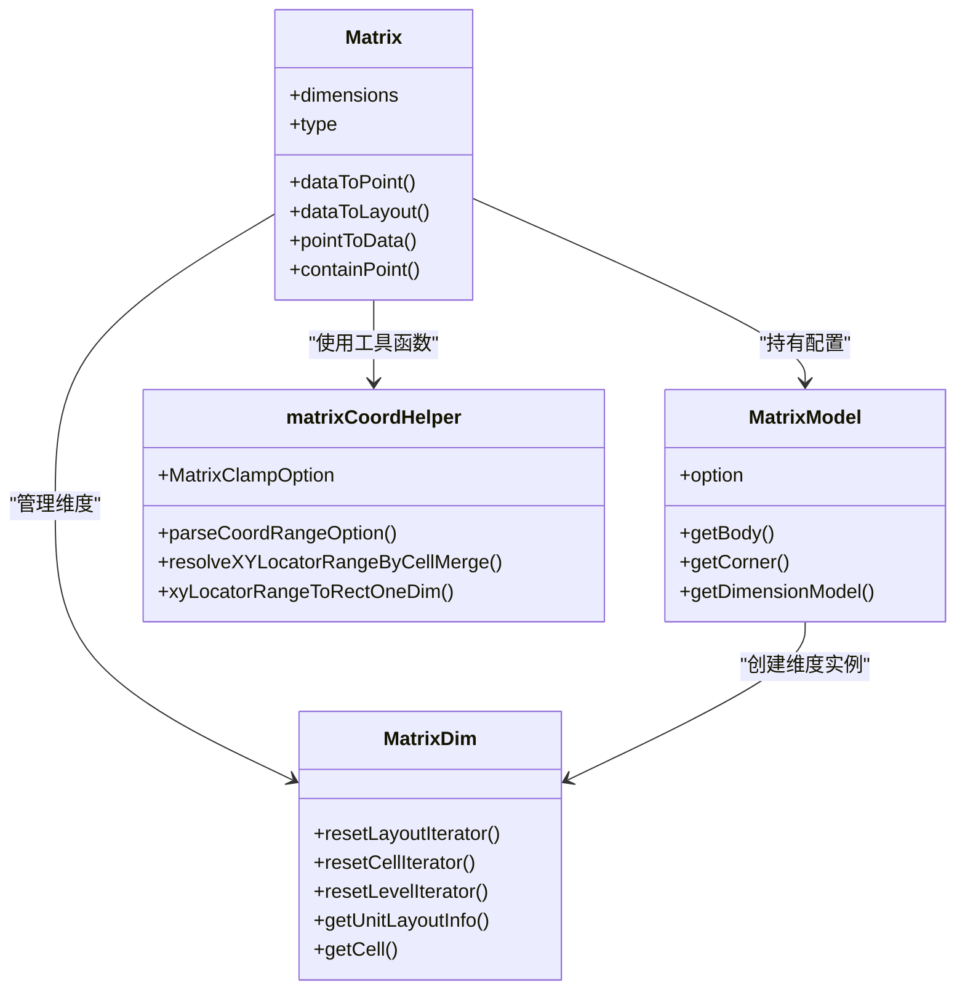

# 矩阵坐标系配置

<cite>
**本文引用的文件**
- [src/component/matrix.ts](file://src/component/matrix.ts)
- [src/coord/matrix/Matrix.ts](file://src/coord/matrix/Matrix.ts)
- [src/coord/matrix/MatrixModel.ts](file://src/coord/matrix/MatrixModel.ts)
- [src/coord/matrix/MatrixDim.ts](file://src/coord/matrix/MatrixDim.ts)
- [src/coord/matrix/matrixCoordHelper.ts](file://src/coord/matrix/matrixCoordHelper.ts)
- [test/matrix.html](file://test/matrix.html)
- [test/matrix_application.html](file://test/matrix_application.html)
</cite>

## 目录
1. [简介](#简介)
2. [项目结构](#项目结构)
3. [核心组件](#核心组件)
4. [架构总览](#架构总览)
5. [详细组件分析](#详细组件分析)
6. [依赖关系分析](#依赖关系分析)
7. [性能与优化](#性能与优化)
8. [故障排查指南](#故障排查指南)
9. [结论](#结论)
10. [附录：常用配置速查](#附录：常用配置速查)

## 简介
本参考文档系统性梳理 ECharts 矩阵坐标系（matrix）的配置项与实现机制，覆盖行列维度定义、单元格布局与样式、标签与数值格式化、边框与背景色等基础能力；并说明其在相关性分析、热力图、数据透视表等场景中的典型用法。同时提供大型矩阵渲染优化、交互与导出实践建议，以及与其它坐标系的组合使用要点和性能考量。

## 项目结构
矩阵坐标系由“组件注册 + 模型 + 视图 + 坐标系统”构成，核心位于 coord/matrix 目录，并通过 component/matrix 进行安装与注册。测试用例集中在 test 目录下，展示了多种组合与实战场景。

图表来源
- [src/component/matrix.ts:20-29](file://src/component/matrix.ts#L20-L29)
- [src/coord/matrix/Matrix.ts:84-119](file://src/coord/matrix/Matrix.ts#L84-L119)
- [src/coord/matrix/MatrixModel.ts:300-338](file://src/coord/matrix/MatrixModel.ts#L300-L338)
- [src/coord/matrix/MatrixDim.ts:116-172](file://src/coord/matrix/MatrixDim.ts#L116-L172)
- [src/coord/matrix/matrixCoordHelper.ts:42-55](file://src/coord/matrix/matrixCoordHelper.ts#L42-L55)

章节来源
- [src/component/matrix.ts:20-29](file://src/component/matrix.ts#L20-L29)
- [src/coord/matrix/Matrix.ts:84-119](file://src/coord/matrix/Matrix.ts#L84-L119)
- [src/coord/matrix/MatrixModel.ts:300-338](file://src/coord/matrix/MatrixModel.ts#L300-L338)

## 核心组件
- 坐标系统 Matrix：负责布局计算、数据点与像素坐标互转、区域包含判断等。
- 模型 MatrixModel：承载 matrix 配置对象，维护 x/y 维度与 body/corner 的单元格集合，提供默认样式与层级尺寸策略。
- 维度 MatrixDim：构建维度树（支持 children），维护叶子节点作为布局单元，提供迭代器、定位、序数元信息等。
- 辅助 matrixCoordHelper：解析坐标范围、处理单元格合并、将定位范围转换为矩形、边界钳制等。

章节来源
- [src/coord/matrix/Matrix.ts:55-119](file://src/coord/matrix/Matrix.ts#L55-L119)
- [src/coord/matrix/MatrixModel.ts:36-49](file://src/coord/matrix/MatrixModel.ts#L36-L49)
- [src/coord/matrix/MatrixDim.ts:116-172](file://src/coord/matrix/MatrixDim.ts#L116-L172)
- [src/coord/matrix/matrixCoordHelper.ts:88-170](file://src/coord/matrix/matrixCoordHelper.ts#L88-L170)

## 架构总览
下图展示矩阵坐标系在 ECharts 体系中的位置及关键调用链：组件安装 → 创建坐标系统 → 维度与布局 → 数据到布局/像素转换 → 系列渲染。

图表来源
- [src/component/matrix.ts:25-29](file://src/component/matrix.ts#L25-L29)
- [src/coord/matrix/Matrix.ts:84-119](file://src/coord/matrix/Matrix.ts#L84-L119)
- [src/coord/matrix/MatrixModel.ts:318-338](file://src/coord/matrix/MatrixModel.ts#L318-L338)
- [src/coord/matrix/MatrixDim.ts:174-298](file://src/coord/matrix/MatrixDim.ts#L174-L298)
- [src/coord/matrix/matrixCoordHelper.ts:92-170](file://src/coord/matrix/matrixCoordHelper.ts#L92-L170)

## 详细组件分析

### 配置对象：matrix
- 整体布局与外观
  - left/top/right/bottom：通过 box layout 控制矩阵区域。
  - backgroundStyle：矩阵背景样式（颜色、边框）。
  - borderZ2：外边框与分割线层级。
  - triggerEvent：是否触发事件（默认 false）。
- 行列维度：x/y
  - show：是否显示维度标题区域。
  - data：支持字符串数组或树形结构（value + children），用于定义行/列分类与层级。
  - length：当未指定 data 时，可仅用 length 声明行列数量（配合 series.data 或 dataset 自动收集）。
  - levels[i].levelSize：为每一层级设置固定尺寸（百分比基于矩阵宽高）。
  - dividerLineStyle：维度分隔线样式。
  - label：维度标签样式与格式化（formatter 接收 name/value/coord）。
  - itemStyle：维度单元格样式（颜色、边框等）。
  - cursor/silent/z2：交互与层级控制。
- 主体与角区：body/corner
  - data：单元格数据，支持 coord 定位（支持范围与负索引）、mergeCells 合并、clamp 行为等。
  - label/itemStyle/cursor/silent/z2：同维度样式与交互。
- 提示框：tooltip
  - 支持 formatter，参数含 name、xyLocator 等。

章节来源
- [src/coord/matrix/MatrixModel.ts:36-49](file://src/coord/matrix/MatrixModel.ts#L36-L49)
- [src/coord/matrix/MatrixModel.ts:158-194](file://src/coord/matrix/MatrixModel.ts#L158-L194)
- [src/coord/matrix/MatrixModel.ts:199-240](file://src/coord/matrix/MatrixModel.ts#L199-L240)
- [src/coord/matrix/MatrixModel.ts:242-297](file://src/coord/matrix/MatrixModel.ts#L242-L297)

### 行列配置：row/column（即 x/y 维度）
- 树形结构：通过 value 与 children 组织多级维度，便于分组与聚合展示。
- 定位与序数：
  - 非叶子节点也可参与定位，但返回的是该维度单元的中心位置。
  - 负索引用于定位角区维度单元。
- 尺寸策略：
  - 叶子节点可通过 size 指定具体尺寸（百分比基于矩阵宽高）。
  - 未指定的尺寸按剩余空间均分，并对齐到最边缘以消除累积误差。
- 迭代与查询：
  - 提供 resetLayoutIterator/resetCellIterator/resetLevelIterator 遍历不同粒度。
  - getUnitLayoutInfo/getCell 获取布局信息与维度单元。

章节来源
- [src/coord/matrix/MatrixDim.ts:174-298](file://src/coord/matrix/MatrixDim.ts#L174-L298)
- [src/coord/matrix/MatrixDim.ts:363-439](file://src/coord/matrix/MatrixDim.ts#L363-L439)
- [src/coord/matrix/Matrix.ts:325-403](file://src/coord/matrix/Matrix.ts#L325-L403)

### 单元格大小 cellSize
- 矩阵未暴露独立的 cellSize 属性，单元格尺寸由以下策略决定：
  - 叶子节点 size：显式指定宽度/高度（百分比基于矩阵宽高）。
  - 层级 levelSize：为某一层级统一设定尺寸。
  - 剩余空间均分：未指定尺寸的单元按剩余空间平均分配，末位对齐修正。
- 注意：百分比尺寸基于矩阵区域宽高，而非画布尺寸。

章节来源
- [src/coord/matrix/MatrixModel.ts:171-194](file://src/coord/matrix/MatrixModel.ts#L171-L194)
- [src/coord/matrix/Matrix.ts:346-403](file://src/coord/matrix/Matrix.ts#L346-L403)

### 颜色映射 colorMap
- 矩阵坐标系本身不直接提供 colorMap；颜色映射通常通过 visualMap 对 series.value（第三维）进行映射。
- 常见做法：
  - 使用 heatmap 系列，配合 visualMap 的 dimension: 2 映射颜色。
  - 自定义系列中根据 value 计算填充色。
- 示例参考：
  - 连续型视觉映射（颜色带）。
  - 离散分段映射。

章节来源
- [test/matrix.html:94-116](file://test/matrix.html#L94-L116)
- [test/matrix_application.html:199-236](file://test/matrix_application.html#L199-L236)
- [test/matrix_application.html:411-453](file://test/matrix_application.html#L411-L453)

### 数值格式化与标签显示
- 维度标签：matrix.x/y.label.formatter 可自定义文本，参数包含 name/value/coord。
- 单元格标签：body/corner 的 label 同样支持 formatter，结合 rich text 可实现多段样式。
- 提示框：tooltip.valueFormatter 可对数值进行格式化。
- 示例：
  - 混淆矩阵中富文本标签。
  - 相关系数矩阵中保留两位小数。

章节来源
- [test/matrix_application.html:81-106](file://test/matrix_application.html#L81-L106)
- [test/matrix_application.html:232-235](file://test/matrix_application.html#L232-L235)
- [test/matrix_application.html:528-531](file://test/matrix_application.html#L528-L531)

### 边框样式与背景色
- 维度分隔线：dividerLineStyle 控制行列分隔线样式。
- 单元格边框：itemStyle.borderWidth/borderColor 控制边框。
- 矩阵背景：backgroundStyle.color/borderColor/borderWidth 控制整体背景与外边框。
- 角区与主体默认边框差异：角区默认无边框，主体默认有浅色边框。

章节来源
- [src/coord/matrix/MatrixModel.ts:259-297](file://src/coord/matrix/MatrixModel.ts#L259-L297)
- [test/matrix_application.html:594-619](file://test/matrix_application.html#L594-L619)

### 单元格合并与定位
- 合并：body/corner.data 中 mergeCells: true 可将相邻单元格合并为一个绘制单元。
- 定位：
  - coord 支持字符串、序数或定位器（locator），支持范围表示 [[x1,x2],[y1,y2]]。
  - 负索引用于角区维度单元定位。
  - 合并后，dataToLayout 会扩展范围以覆盖合并区域。
- 钳制：clamp 选项控制越界输入的处理方式（none/all/body/corner）。

章节来源
- [src/coord/matrix/matrixCoordHelper.ts:144-170](file://src/coord/matrix/matrixCoordHelper.ts#L144-L170)
- [src/coord/matrix/Matrix.ts:181-231](file://src/coord/matrix/Matrix.ts#L181-L231)
- [test/matrix.html:76-88](file://test/matrix.html#L76-L88)

### 与其他坐标系的组合
- 可与 grid/polar/calendar 等共存，matrix 默认 z 较低以避免遮挡其他组件。
- 可在同一矩阵上叠加多种系列（如 heatmap、custom、scatter、graph、pie 等）。
- 示例：
  - 在矩阵上绘制饼图、折线图、散点图等。
  - 与 tooltip、visualMap、toolbox 等组件协同工作。

章节来源
- [src/coord/matrix/MatrixModel.ts:279-297](file://src/coord/matrix/MatrixModel.ts#L279-L297)
- [test/matrix.html:319-369](file://test/matrix.html#L319-L369)
- [test/matrix.html:404-436](file://test/matrix.html#L404-L436)
- [test/matrix.html:461-528](file://test/matrix.html#L461-L528)

## 依赖关系分析

图表来源
- [src/coord/matrix/Matrix.ts:55-119](file://src/coord/matrix/Matrix.ts#L55-L119)
- [src/coord/matrix/MatrixModel.ts:300-338](file://src/coord/matrix/MatrixModel.ts#L300-L338)
- [src/coord/matrix/MatrixDim.ts:116-172](file://src/coord/matrix/MatrixDim.ts#L116-L172)
- [src/coord/matrix/matrixCoordHelper.ts:88-170](file://src/coord/matrix/matrixCoordHelper.ts#L88-L170)

章节来源
- [src/coord/matrix/Matrix.ts:55-119](file://src/coord/matrix/Matrix.ts#L55-L119)
- [src/coord/matrix/MatrixModel.ts:300-338](file://src/coord/matrix/MatrixModel.ts#L300-L338)
- [src/coord/matrix/MatrixDim.ts:116-172](file://src/coord/matrix/MatrixDim.ts#L116-L172)
- [src/coord/matrix/matrixCoordHelper.ts:88-170](file://src/coord/matrix/matrixCoordHelper.ts#L88-L170)

## 性能与优化
- 大数据量渲染
  - 优先使用 heatmap 或 custom 系列，避免过多图形元素。
  - 合理设置 label.show，减少文本测量与绘制开销。
  - 使用 visualMap 批量映射颜色，减少逐条样式计算。
- 布局与计算
  - 尽量使用 data 或 length 明确维度规模，避免动态收集带来的额外开销。
  - 合并单元格可减少绘制单元数量。
- 交互与更新
  - 关闭不必要的 triggerEvent 以降低事件处理成本。
  - 使用 silent 控制标签/单元格的交互响应。
- 导出
  - 借助 toolbox.saveImage 导出当前视图；如需自定义导出内容，可使用 export API。
- 组合坐标系
  - 控制各组件 z 层级，避免重复绘制与遮挡。
  - 在复杂场景中按需隐藏维度标题或标签以提升性能。

[本节为通用指导，无需特定文件引用]

## 故障排查指南
- 坐标定位失败
  - 检查 coord 是否有效，必要时启用 clamp 以限制到矩阵边界。
  - 确认维度 data 是否正确构建，尤其是树形结构的 value 唯一性。
- 合并异常
  - 确保 mergeCells 与 coord 范围一致，避免跨层级的非法合并。
- 标签显示异常
  - 检查 label.formatter 返回值类型与 rich 文本配置。
  - 若 label 过长，考虑 overflow 与 lineOverflow 策略。
- 事件不触发
  - 确认 triggerEvent 与 silent 配置，必要时开启事件。
- 示例参考
  - 事件绑定与参数查看：点击单元格输出事件信息。
  - 无维度标题时的布局与渲染。

章节来源
- [test/matrix.html:717-800](file://test/matrix.html#L717-L800)
- [test/matrix.html:135-180](file://test/matrix.html#L135-L180)

## 结论
矩阵坐标系提供了强大的二维分类与层级组织能力，适合相关性分析、热力图、数据透视表等场景。通过灵活的行列维度定义、单元格合并、标签与颜色映射，以及与其他坐标系的组合，可以构建丰富且高性能的数据可视化界面。在实际项目中，应关注数据规模、标签与事件配置，合理使用合并与视觉映射，以获得最佳的用户体验与性能表现。

## 附录：常用配置速查
- matrix
  - 布局：left/top/right/bottom
  - 背景：backgroundStyle
  - 边框层级：borderZ2
  - 事件：triggerEvent
- matrix.x / matrix.y
  - show：显示维度标题
  - data：字符串或树形（value + children）
  - length：仅声明规模
  - levels[i].levelSize：层级尺寸
  - dividerLineStyle：分隔线样式
  - label：formatter、样式
  - itemStyle：单元格样式
  - cursor/silent/z2：交互与层级
- matrix.body / matrix.corner
  - data：coord、mergeCells、clamp、value
  - label/itemStyle/cursor/silent/z2
- 系列与视觉映射
  - coordinateSystem: 'matrix'
  - visualMap.dimension: 2
  - tooltip.valueFormatter
- 示例路径
  - 热力图与矩阵：[test/matrix.html](file://test/matrix.html)
  - 相关性矩阵与周期表：[test/matrix_application.html](file://test/matrix_application.html)