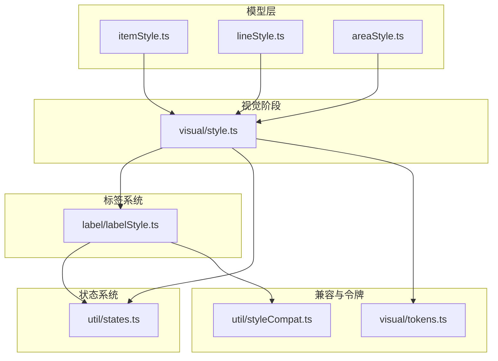
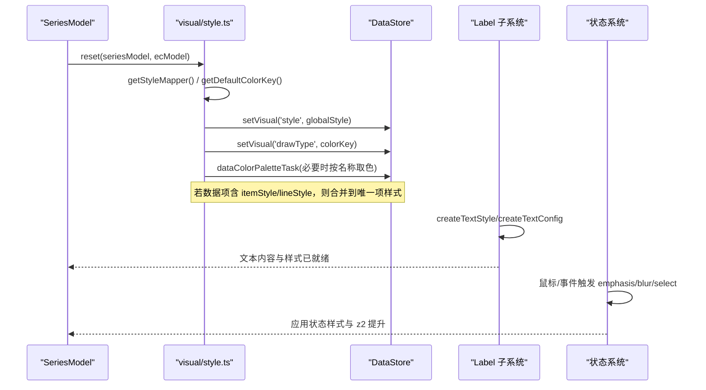
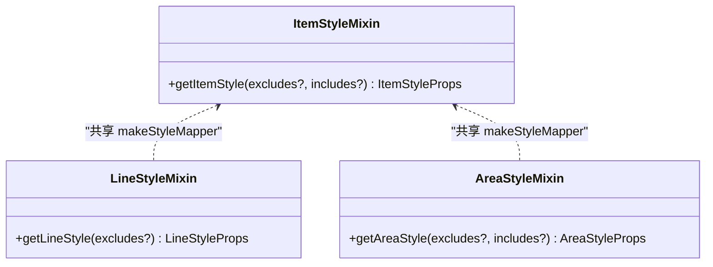
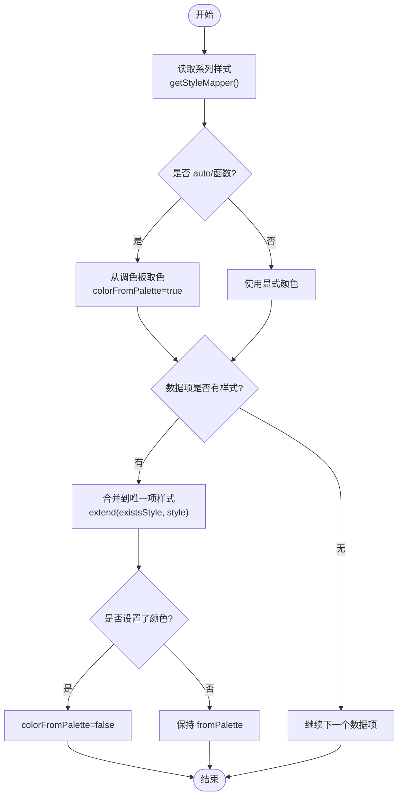
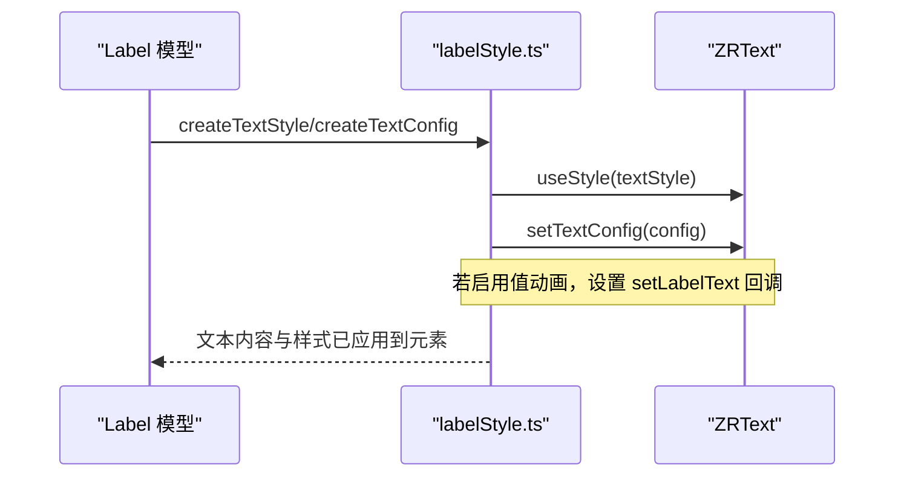
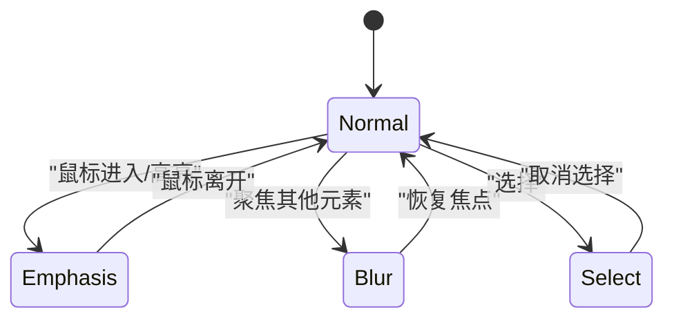
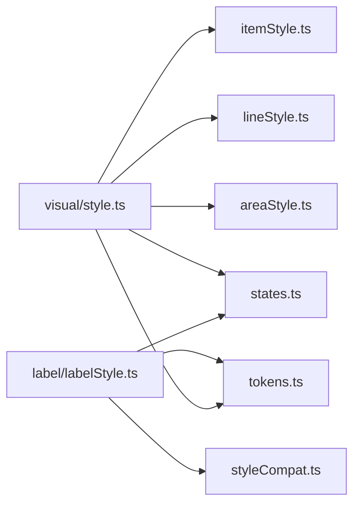

# 样式配置项

<cite>
**本文引用的文件**
- [src/visual/style.ts](file://src/visual/style.ts)
- [src/model/mixin/itemStyle.ts](file://src/model/mixin/itemStyle.ts)
- [src/model/mixin/lineStyle.ts](file://src/model/mixin/lineStyle.ts)
- [src/model/mixin/areaStyle.ts](file://src/model/mixin/areaStyle.ts)
- [src/label/labelStyle.ts](file://src/label/labelStyle.ts)
- [src/util/styleCompat.ts](file://src/util/styleCompat.ts)
- [src/util/states.ts](file://src/util/states.ts)
- [src/visual/tokens.ts](file://src/visual/tokens.ts)
</cite>

## 目录
1. [简介](#简介)
2. [项目结构](#项目结构)
3. [核心组件](#核心组件)
4. [架构总览](#架构总览)
5. [详细组件分析](#详细组件分析)
6. [依赖关系分析](#依赖关系分析)
7. [性能考虑](#性能考虑)
8. [故障排查指南](#故障排查指南)
9. [结论](#结论)
10. [附录](#附录)

## 简介
本文件系统性梳理 ECharts 的样式配置体系，覆盖 itemStyle、lineStyle、areaStyle、label、labelLine、emphasis、normal、disabled 等与视觉表现相关的配置。文档重点说明：
- 颜色、边框、阴影、透明度、渐变、纹理（decal）等视觉样式的来源与映射
- 样式继承机制、优先级规则与状态（normal/emphasis/blur/select）下的行为
- 动态更新方法与主题定制、响应式样式的实践建议
- 性能优化与兼容性注意事项

## 项目结构
ECharts 的样式系统由“模型层（Model Mixin）+ 视觉任务（Visual StageHandler）+ 标签子系统（Label）+ 状态系统（States）+ 兼容转换（styleCompat）+ 设计令牌（tokens）”构成：
- Model Mixin：itemStyle、lineStyle、areaStyle 定义键映射与获取方法
- Visual Style：seriesStyleTask/dataStyleTask/dataColorPaletteTask 负责从系列/数据读取并计算最终样式
- Label：统一创建和设置文本样式、位置、富文本、值动画等
- States：管理 normal/emphasis/blur/select 状态及默认提升策略
- styleCompat：EC4/EC5 样式兼容转换
- tokens：主题色板与设计令牌

**图表来源**
- [src/model/mixin/itemStyle.ts:25-43](file://src/model/mixin/itemStyle.ts#L25-L43)
- [src/model/mixin/lineStyle.ts:25-42](file://src/model/mixin/lineStyle.ts#L25-L42)
- [src/model/mixin/areaStyle.ts:25-35](file://src/model/mixin/areaStyle.ts#L25-L35)
- [src/visual/style.ts:32-131](file://src/visual/style.ts#L32-L131)
- [src/label/labelStyle.ts:200-339](file://src/label/labelStyle.ts#L200-L339)
- [src/util/states.ts:78-84](file://src/util/states.ts#L78-L84)
- [src/util/styleCompat.ts:36-128](file://src/util/styleCompat.ts#L36-L128)
- [src/visual/tokens.ts:105-197](file://src/visual/tokens.ts#L105-L197)

**章节来源**
- [src/model/mixin/itemStyle.ts:25-75](file://src/model/mixin/itemStyle.ts#L25-L75)
- [src/model/mixin/lineStyle.ts:25-71](file://src/model/mixin/lineStyle.ts#L25-L71)
- [src/model/mixin/areaStyle.ts:25-57](file://src/model/mixin/areaStyle.ts#L25-L57)
- [src/visual/style.ts:32-231](file://src/visual/style.ts#L32-L231)
- [src/label/labelStyle.ts:200-339](file://src/label/labelStyle.ts#L200-L339)
- [src/util/states.ts:78-84](file://src/util/states.ts#L78-L84)
- [src/util/styleCompat.ts:36-128](file://src/util/styleCompat.ts#L36-L128)
- [src/visual/tokens.ts:105-197](file://src/visual/tokens.ts#L105-L197)

## 核心组件
- itemStyle：映射 fill/stroke/lineWidth/opacity/shadow/lineDash/lineCap/lineJoin/miterLimit 等图形填充与描边属性，支持旧版别名（如 borderColor→stroke）。
- lineStyle：映射线型相关属性（宽度、颜色、虚线、端点、连接角、斜接限制等）。
- areaStyle：面积图区域填充与阴影、透明度等。
- label：统一处理文本内容、位置、富文本、溢出、对齐、内外描边、背景框、阴影等，并支持值动画与状态样式。
- states：提供 emphasis/blur/select 状态管理与默认提升策略（z2、颜色提亮、透明度降低等）。
- styleCompat：EC4/EC5 文本样式兼容转换，确保历史配置可用。
- tokens：主题色板与设计令牌，供全局样式与默认值使用。

**章节来源**
- [src/model/mixin/itemStyle.ts:25-75](file://src/model/mixin/itemStyle.ts#L25-L75)
- [src/model/mixin/lineStyle.ts:25-71](file://src/model/mixin/lineStyle.ts#L25-L71)
- [src/model/mixin/areaStyle.ts:25-57](file://src/model/mixin/areaStyle.ts#L25-L57)
- [src/label/labelStyle.ts:200-339](file://src/label/labelStyle.ts#L200-L339)
- [src/util/states.ts:78-84](file://src/util/states.ts#L78-L84)
- [src/util/styleCompat.ts:36-128](file://src/util/styleCompat.ts#L36-L128)
- [src/visual/tokens.ts:105-197](file://src/visual/tokens.ts#L105-L197)

## 架构总览
样式在渲染前经过“系列级样式任务 → 数据级样式任务 → 调色板补色”的流程，最终写入数据可视属性；标签子系统根据模型生成文本样式与配置；状态系统在交互时自动切换样式并应用默认提升。

**图表来源**
- [src/visual/style.ts:67-131](file://src/visual/style.ts#L67-L131)
- [src/visual/style.ts:173-225](file://src/visual/style.ts#L173-L225)
- [src/label/labelStyle.ts:200-339](file://src/label/labelStyle.ts#L200-L339)
- [src/util/states.ts:118-182](file://src/util/states.ts#L118-L182)

## 详细组件分析

### itemStyle/lineStyle/areaStyle：键映射与获取
- 键映射：将用户配置的语义化键（如 color/borderColor）映射到底层 PathStyleProps（如 fill/stroke），同时保留部分旧键兼容。
- 获取方法：通过 makeStyleMapper 生成 getter，支持 excludes/includes 过滤。
- 适用范围：
  - itemStyle：图形填充、描边、阴影、透明度、线帽/连接/斜接限制等
  - lineStyle：线条宽度、颜色、虚线、端点/连接/斜接限制等
  - areaStyle：面积填充、阴影、透明度等

**图表来源**
- [src/model/mixin/itemStyle.ts:43-75](file://src/model/mixin/itemStyle.ts#L43-L75)
- [src/model/mixin/lineStyle.ts:42-71](file://src/model/mixin/lineStyle.ts#L42-L71)
- [src/model/mixin/areaStyle.ts:35-57](file://src/model/mixin/areaStyle.ts#L35-L57)

**章节来源**
- [src/model/mixin/itemStyle.ts:25-75](file://src/model/mixin/itemStyle.ts#L25-L75)
- [src/model/mixin/lineStyle.ts:25-71](file://src/model/mixin/lineStyle.ts#L25-L71)
- [src/model/mixin/areaStyle.ts:25-57](file://src/model/mixin/areaStyle.ts#L25-L57)

### 系列与数据级样式任务：继承、优先级与调色板
- 系列级任务（seriesStyleTask）：
  - 读取 seriesModel.visualStyleAccessPath（默认 itemStyle）
  - 解析全局样式（fill/stroke/opacity/shadow 等）
  - 若未显式设置颜色或为 'auto'，则从调色板取值并标记 colorFromPalette
  - 支持回调函数作为颜色，逐数据项计算
- 数据级任务（dataStyleTask）：
  - 遍历数据项，若包含 itemStyle/lineStyle，则合并到该数据的唯一样式对象
  - 若设置了颜色，则取消 colorFromPalette 标记
- 调色板任务（dataColorPaletteTask）：
  - 对尚未设置颜色的数据项，按名称从调色板取色，保证图例切换一致性

**图表来源**
- [src/visual/style.ts:67-131](file://src/visual/style.ts#L67-L131)
- [src/visual/style.ts:133-171](file://src/visual/style.ts#L133-L171)
- [src/visual/style.ts:173-225](file://src/visual/style.ts#L173-L225)

**章节来源**
- [src/visual/style.ts:67-225](file://src/visual/style.ts#L67-L225)

### 标签样式：文本、富文本、位置与值动画
- 文本内容：支持 formatter、rich 富文本、继承父级 rich 样式
- 文本样式：字体、颜色、描边、背景框、内边距、边框、阴影、对齐、行高、溢出等
- 文本配置：位置、偏移、旋转、距离、外部填充策略
- 值动画：支持数值插值与精度控制，配合 label 显示
- 状态样式：normal/emphasis/blur/select 分别可独立设置 show、formatter、样式

**图表来源**
- [src/label/labelStyle.ts:200-339](file://src/label/labelStyle.ts#L200-L339)
- [src/label/labelStyle.ts:340-383](file://src/label/labelStyle.ts#L340-L383)
- [src/label/labelStyle.ts:739-800](file://src/label/labelStyle.ts#L739-L800)

**章节来源**
- [src/label/labelStyle.ts:200-383](file://src/label/labelStyle.ts#L200-L383)
- [src/label/labelStyle.ts:739-800](file://src/label/labelStyle.ts#L739-L800)

### 状态系统：emphasis/blur/select 默认提升与交互
- 状态集合：DISPLAY_STATES = ['normal','emphasis','blur','select']
- emphasis：
  - 若未设置 fill/stroke，则基于正常态颜色进行提亮
  - 默认提升 z2（可通过 z2EmphasisLift 自定义）
- blur：
  - 降低透明度（约 0.1 倍），用于聚焦外部的淡化
- select：
  - 选中态提升 z2（可通过 z2SelectLift 自定义）
- 交互：
  - 鼠标进入/离开触发 enterEmphasis/leaveEmphasis
  - 支持 focus/blurScope 控制模糊范围

**图表来源**
- [src/util/states.ts:78-84](file://src/util/states.ts#L78-L84)
- [src/util/states.ts:118-182](file://src/util/states.ts#L118-L182)
- [src/util/states.ts:225-325](file://src/util/states.ts#L225-L325)

**章节来源**
- [src/util/states.ts:78-84](file://src/util/states.ts#L78-L84)
- [src/util/states.ts:118-182](file://src/util/states.ts#L118-L182)
- [src/util/states.ts:225-325](file://src/util/states.ts#L225-L325)

### 兼容转换：EC4/EC5 文本样式
- isEC4CompatibleStyle：判断是否需要兼容 EC4 文本样式
- convertFromEC4CompatibleStyle：将宿主元素的 textXXX 迁移到独立的文本内容与配置
- convertToEC4StyleForCustomSerise：反向兼容，便于自定义系列使用 EC4 风格
- rich 项兼容：textFill/textStroke/font 等映射到现代 TextStyleProps

**章节来源**
- [src/util/styleCompat.ts:36-128](file://src/util/styleCompat.ts#L36-L128)
- [src/util/styleCompat.ts:169-250](file://src/util/styleCompat.ts#L169-L250)

### 主题与令牌：tokens
- tokens.color：中性色、强调色、主题色板、高亮色等
- tokens.darkColor：暗色模式派生色板
- tokens.size：尺寸令牌（xxs~xxxl）
- 用途：全局文本样式默认值、标签内外描边默认色、轴/网格/分割线等默认色

**章节来源**
- [src/visual/tokens.ts:105-197](file://src/visual/tokens.ts#L105-L197)

## 依赖关系分析
- visual/style.ts 依赖 model/mixin/* 的键映射，以及 util/states.ts 的状态能力
- label/labelStyle.ts 依赖 util/states.ts 的状态系统与 util/styleCompat.ts 的兼容逻辑
- model/mixin/* 通过 makeStyleMapper 统一生成样式获取器
- tokens 被多处默认值引用（如标签内外描边、高亮色）

**图表来源**
- [src/visual/style.ts:20-35](file://src/visual/style.ts#L20-L35)
- [src/label/labelStyle.ts:20-48](file://src/label/labelStyle.ts#L20-L48)
- [src/util/styleCompat.ts:20-26](file://src/util/styleCompat.ts#L20-L26)
- [src/visual/tokens.ts:20-22](file://src/visual/tokens.ts#L20-L22)

**章节来源**
- [src/visual/style.ts:20-35](file://src/visual/style.ts#L20-L35)
- [src/label/labelStyle.ts:20-48](file://src/label/labelStyle.ts#L20-L48)
- [src/util/styleCompat.ts:20-26](file://src/util/styleCompat.ts#L20-L26)
- [src/visual/tokens.ts:20-22](file://src/visual/tokens.ts#L20-L22)

## 性能考虑
- 避免频繁 setOption：尽量批量更新样式，减少重绘次数
- 合理使用 colorFromPalette：仅在需要时开启，避免不必要的调色板计算
- 谨慎使用回调颜色：回调会在每个数据项执行，大数据量下注意性能
- 控制阴影与渐变：shadowBlur、渐变、纹理（decal）会显著影响渲染性能，建议在必要场景启用
- 标签文本：富文本与复杂布局会增加测量与绘制开销，尽量简化 rich 结构与文本长度
- 状态切换：emphasis/blur/select 的 z2 提升与颜色提亮是轻量操作，但大量元素同时切换仍需注意帧率

[本节为通用指导，不直接分析具体文件]

## 故障排查指南
- 颜色未按预期生效：
  - 检查是否设置了 colorFromPalette，或被数据项样式覆盖
  - 确认系列级样式与数据级样式的优先级（数据项样式优先）
- 标签不显示或位置异常：
  - 检查 label.show 与各状态的 show 设置
  - 确认 textPosition/outsideFill/inheritColor 是否正确
- 高亮无效：
  - 确认元素启用了 hover 高亮（enableHoverEmphasis）
  - 检查 emphasis 样式是否覆盖了关键属性（如 fill/stroke）
- 兼容性问题：
  - 使用 styleCompat 提供的转换函数，确保 EC4/EC5 文本样式正确迁移
  - 关注废弃字段告警（__DEV__ 模式下）

**章节来源**
- [src/visual/style.ts:67-225](file://src/visual/style.ts#L67-L225)
- [src/label/labelStyle.ts:200-339](file://src/label/labelStyle.ts#L200-L339)
- [src/util/styleCompat.ts:36-128](file://src/util/styleCompat.ts#L36-L128)
- [src/util/states.ts:118-182](file://src/util/states.ts#L118-L182)

## 结论
ECharts 的样式系统以“模型键映射 + 视觉任务 + 标签子系统 + 状态系统 + 兼容转换 + 设计令牌”为核心，提供了灵活且高性能的视觉配置能力。通过理解继承与优先级、状态默认提升与交互流程，开发者可以高效定制主题与响应式样式，并在大数据量与复杂交互场景下保持良好性能。

[本节为总结性内容，不直接分析具体文件]

## 附录
- 主题定制建议：
  - 通过 tokens 调整全局色板与尺寸令牌，实现品牌化主题
  - 使用 emphasis/blur/select 状态统一交互反馈风格
- 响应式样式建议：
  - 结合媒体查询或窗口 resize，动态调整 label.fontSize、padding、borderRadius 等
  - 在大屏与小屏间切换时，合理设置标签位置与溢出策略（overflow/lineOverflow）
- 最佳实践：
  - 优先使用 itemStyle/lineStyle/areaStyle 的语义化键，避免直接使用底层属性
  - 谨慎使用回调与复杂样式（渐变/纹理/阴影），评估性能影响
  - 利用 dataStyleTask 的数据级样式覆盖，实现细粒度个性化

[本节为补充建议，不直接分析具体文件]