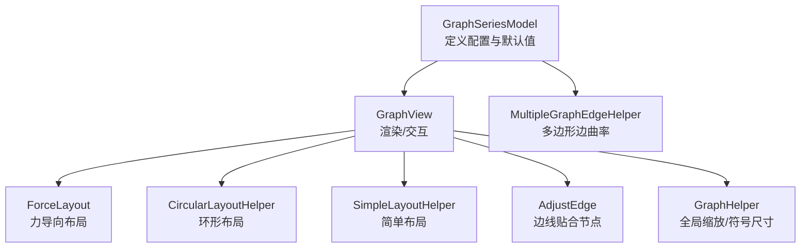
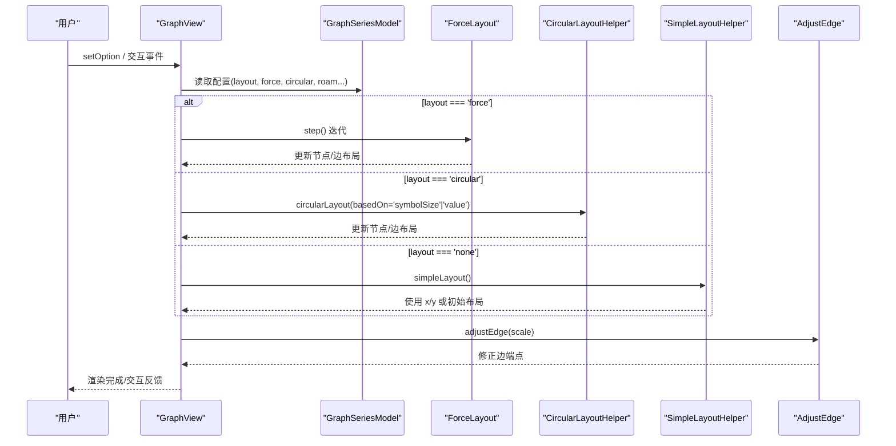
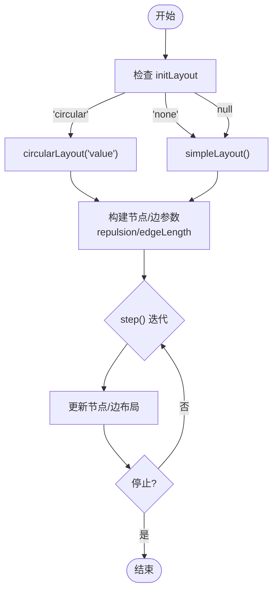
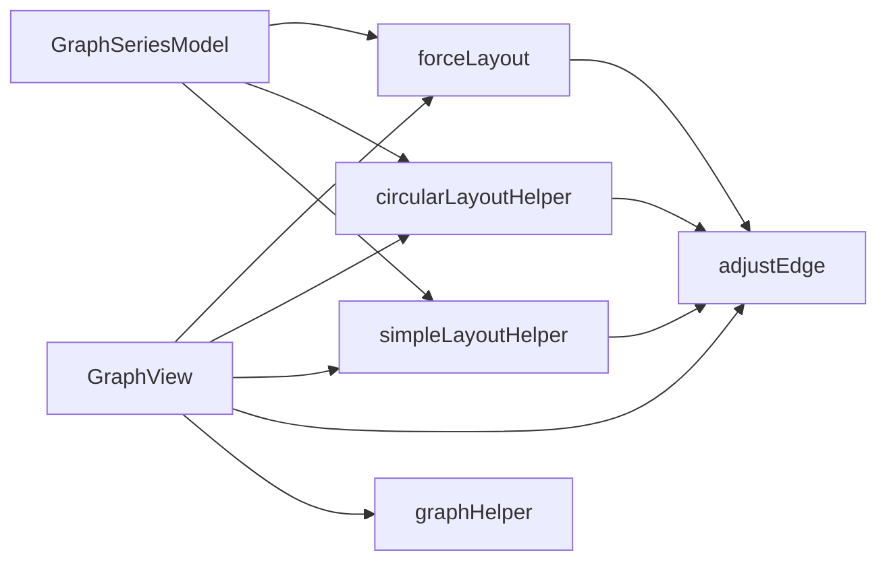

# 关系图系列配置项

<cite>
**本文引用的文件**
- [graphSeries.ts](file://src/chart/graph/GraphSeries.ts)
- [graphView.ts](file://src/chart/graph/graphView.ts)
- [forceLayout.ts](file://src/chart/graph/forceLayout.ts)
- [circularLayoutHelper.ts](file://src/chart/graph/circularLayoutHelper.ts)
- [simpleLayoutHelper.ts](file://src/chart/graph/simpleLayoutHelper.ts)
- [adjustEdge.ts](file://src/chart/graph/adjustEdge.ts)
- [graphHelper.ts](file://src/chart/graph/graphHelper.ts)
- [multipleGraphEdgeHelper.ts](file://src/chart/helper/multipleGraphEdgeHelper.ts)
- [graph.html](file://test/graph.html)
- [force.html](file://test/force.html)
- [graph-circular.html](file://test/graph-circular.html)
</cite>

## 目录
1. [简介](#简介)
2. [项目结构](#项目结构)
3. [核心组件](#核心组件)
4. [架构总览](#架构总览)
5. [详细组件分析](#详细组件分析)
6. [依赖分析](#依赖分析)
7. [性能考虑](#性能考虑)
8. [故障排查指南](#故障排查指南)
9. [结论](#结论)
10. [附录：配置项速查表](#附录配置项速查表)

## 简介
本文件聚焦 ECharts 关系图（series.graph）系列的配置项，系统说明布局与交互相关的关键选项，包括 layout、force、circular、roam、edgeSymbol、edgeSymbolSize、edgeLabel、lineStyle（即 edgeLine）、edgeShape、edgeSmooth、edgeAnimation、draggable、categories、linkLabel、nodeScaleRatio、animationDuration、animationEasing、animationDurationUpdate、animationEasingUpdate 等。文档从源码出发，解释每个属性的作用、数据类型、默认值与配置方法，并给出实际应用场景与参考示例路径。

## 项目结构
关系图系列由模型（Model）、视图（View）、布局（Layout）与辅助工具共同组成：
- 模型层：定义系列类型、默认配置、数据与类目处理、动画开关策略等。
- 视图层：负责渲染节点与边、处理拖拽、缩放漫游、缩略图等。
- 布局层：提供 force 力导向、circular 环形、simple 简单布局三种模式。
- 辅助工具：边线贴合节点、多边形曲线曲率计算、符号尺寸与全局缩放等。

**图示来源**
- [graphSeries.ts:237-516](file://src/chart/graph/GraphSeries.ts#L237-L516)
- [graphView.ts:56-240](file://src/chart/graph/graphView.ts#L56-L240)
- [forceLayout.ts:40-169](file://src/chart/graph/forceLayout.ts#L40-L169)
- [circularLayoutHelper.ts:53-116](file://src/chart/graph/circularLayoutHelper.ts#L53-L116)
- [simpleLayoutHelper.ts:27-60](file://src/chart/graph/simpleLayoutHelper.ts#L27-L60)
- [adjustEdge.ts:97-177](file://src/chart/graph/adjustEdge.ts#L97-L177)
- [multipleGraphEdgeHelper.ts:173-200](file://src/chart/helper/multipleGraphEdgeHelper.ts#L173-L200)
- [graphHelper.ts:24-40](file://src/chart/graph/graphHelper.ts#L24-L40)

**章节来源**
- [graphSeries.ts:237-516](file://src/chart/graph/GraphSeries.ts#L237-L516)
- [graphView.ts:56-240](file://src/chart/graph/graphView.ts#L56-L240)

## 核心组件
- GraphSeriesModel：声明 series.graph 的所有配置项与默认值，处理 categories、tooltip、动画开关等。
- GraphView：实现渲染流程、拖拽交互、缩放漫游、缩略图更新、布局迭代驱动。
- ForceLayout：根据 repulsion/gravity/friction/edgeLength 等参数进行力导向迭代，支持 initLayout 与 preservedPoints。
- CircularLayoutHelper：环形布局，支持按 value 或 symbolSize 分配角度，支持标签旋转。
- SimpleLayoutHelper：将节点位置直接取自 x/y，或作为力导向的初始布局。
- AdjustEdge：在缩放/交互后调整边线端点，避免与节点重叠。
- MultipleGraphEdgeHelper：为同一对节点的多条边自动计算曲率，避免重叠。
- GraphHelper：计算全局缩放比例以保持节点视觉大小稳定。

**章节来源**
- [graphSeries.ts:237-516](file://src/chart/graph/GraphSeries.ts#L237-L516)
- [graphView.ts:56-240](file://src/chart/graph/graphView.ts#L56-L240)
- [forceLayout.ts:40-169](file://src/chart/graph/forceLayout.ts#L40-L169)
- [circularLayoutHelper.ts:53-116](file://src/chart/graph/circularLayoutHelper.ts#L53-L116)
- [simpleLayoutHelper.ts:27-60](file://src/chart/graph/simpleLayoutHelper.ts#L27-L60)
- [adjustEdge.ts:97-177](file://src/chart/graph/adjustEdge.ts#L97-L177)
- [multipleGraphEdgeHelper.ts:173-200](file://src/chart/helper/multipleGraphEdgeHelper.ts#L173-L200)
- [graphHelper.ts:24-40](file://src/chart/graph/graphHelper.ts#L24-L40)

## 架构总览
下图展示一次渲染与布局迭代的关键调用链：

**图示来源**
- [graphView.ts:99-240](file://src/chart/graph/graphView.ts#L99-L240)
- [forceLayout.ts:40-169](file://src/chart/graph/forceLayout.ts#L40-L169)
- [circularLayoutHelper.ts:53-116](file://src/chart/graph/circularLayoutHelper.ts#L53-L116)
- [simpleLayoutHelper.ts:27-60](file://src/chart/graph/simpleLayoutHelper.ts#L27-L60)
- [adjustEdge.ts:97-177](file://src/chart/graph/adjustEdge.ts#L97-L177)

## 详细组件分析

### 布局与交互：layout、force、circular、roam、draggable
- layout
  - 作用：选择布局模式。可选 none、force、circular。
  - 类型：字符串枚举。
  - 默认值：null（未设置时不强制布局）。
  - 行为：
    - force：启用力导向布局，配合 force.* 参数；可结合 draggable 拖拽固定节点。
    - circular：环形布局，支持 circular.rotateLabel 控制标签是否随半径方向旋转。
    - none：使用节点显式 x/y 或由 simpleLayout 初始化。
  - 参考：[graphSeries.ts:160-161](file://src/chart/graph/GraphSeries.ts#L160-L161)、[graphSeries.ts:430-435](file://src/chart/graph/GraphSeries.ts#L430-L435)
- force
  - 作用：力导向布局参数。
  - 关键属性：
    - initLayout：'circular' | 'none'，控制初始布局方式。
    - repulsion：number | number[]，节点斥力范围。
    - gravity：number，向中心的引力。
    - friction：number，初始摩擦系数。
    - edgeLength：number | number[]，边长范围（数值越大边越长）。
    - layoutAnimation：boolean，是否在布局过程中逐帧动画更新。
  - 默认值：见 defaultOption。
  - 参考：[graphSeries.ts:215-227](file://src/chart/graph/GraphSeries.ts#L215-L227)、[graphSeries.ts:437-449](file://src/chart/graph/GraphSeries.ts#L437-L449)、[forceLayout.ts:40-169](file://src/chart/graph/forceLayout.ts#L40-L169)
- circular
  - 作用：环形布局细节。
  - 关键属性：
    - rotateLabel：boolean，开启后标签沿半径方向旋转，提升可读性。
  - 参考：[graphSeries.ts:209-212](file://src/chart/graph/GraphSeries.ts#L209-L212)、[circularLayoutHelper.ts:207-233](file://src/chart/graph/circularLayoutHelper.ts#L207-L233)
- roam
  - 作用：启用缩放和平移交互。
  - 类型：boolean。
  - 默认值：false。
  - 影响：启用后会触发 __updateOnOwnRoam，更新节点/边缩放与标签布局。
  - 参考：[graphSeries.ts:470](file://src/chart/graph/GraphSeries.ts#L470)、[graphView.ts:273-298](file://src/chart/graph/graphView.ts#L273-L298)
- draggable
  - 作用：允许拖拽节点。
  - 类型：boolean。
  - 默认值：false。
  - 行为：
    - force：拖拽时 warmUp 并重新进入迭代，节点被固定。
    - circular：拖拽后重算环形布局。
    - none：直接写入位置并更新边。
  - 参考：[graphView.ts:166-203](file://src/chart/graph/graphView.ts#L166-L203)、[graphSeries.ts:175](file://src/chart/graph/GraphSeries.ts#L175)

**章节来源**
- [graphSeries.ts:160-227](file://src/chart/graph/GraphSeries.ts#L160-L227)
- [graphSeries.ts:430-449](file://src/chart/graph/GraphSeries.ts#L430-L449)
- [graphView.ts:166-203](file://src/chart/graph/graphView.ts#L166-L203)
- [graphView.ts:273-298](file://src/chart/graph/graphView.ts#L273-L298)
- [forceLayout.ts:40-169](file://src/chart/graph/forceLayout.ts#L40-L169)
- [circularLayoutHelper.ts:207-233](file://src/chart/graph/circularLayoutHelper.ts#L207-L233)

### 边与标签：edgeSymbol、edgeSymbolSize、edgeLabel、lineStyle（edgeLine）、edgeShape、edgeSmooth、edgeAnimation
- edgeSymbol
  - 作用：边的两端箭头/标记。
  - 类型：string | string[]。
  - 默认值：['none', 'none']。
  - 参考：[graphSeries.ts:177](file://src/chart/graph/GraphSeries.ts#L177)、[graphSeries.ts:461](file://src/chart/graph/GraphSeries.ts#L461)
- edgeSymbolSize
  - 作用：边两端标记的大小。
  - 类型：number | number[]。
  - 默认值：10。
  - 参考：[graphSeries.ts:178](file://src/chart/graph/GraphSeries.ts#L178)、[graphSeries.ts:462](file://src/chart/graph/GraphSeries.ts#L462)
- edgeLabel
  - 作用：边标签样式与位置。
  - 类型：SeriesLineLabelOption。
  - 默认值：{ position: 'middle', distance: 5 }。
  - 参考：[graphSeries.ts:180](file://src/chart/graph/GraphSeries.ts#L180)、[graphSeries.ts:463-466](file://src/chart/graph/GraphSeries.ts#L463-L466)
- lineStyle（即 edgeLine）
  - 作用：边的线条样式，包含 color、width、opacity、curveness 等。
  - 类型：LineStyleOption（扩展 curveness）。
  - 默认值：color 中性色、width 1、opacity 0.5。
  - 参考：[graphSeries.ts:184](file://src/chart/graph/GraphSeries.ts#L184)、[graphSeries.ts:498-503](file://src/chart/graph/GraphSeries.ts#L498-L503)
- edgeShape
  - 作用：边的形状。通过 lineStyle.curveness 控制直线或二次贝塞尔曲线。
  - 类型：隐式由 curveness 决定。
  - 默认行为：curveness=0 为直线；非零时为曲线。
  - 参考：[simpleLayoutHelper.ts:42-59](file://src/chart/graph/simpleLayoutHelper.ts#L42-L59)、[circularLayoutHelper.ts:96-115](file://src/chart/graph/circularLayoutHelper.ts#L96-L115)
- edgeSmooth
  - 作用：平滑度。关系图中通过 curveness 表达弯曲程度，无独立 smooth 字段。
  - 类型：不适用（使用 curveness）。
  - 参考：同上
- edgeAnimation
  - 作用：边的动画。关系图未暴露独立的 edgeAnimation 字段，动画受全局 animation* 控制。
  - 类型：不适用（继承全局动画配置）。
  - 参考：[graphSeries.ts:403-407](file://src/chart/graph/GraphSeries.ts#L403-L407)

**章节来源**
- [graphSeries.ts:177-184](file://src/chart/graph/GraphSeries.ts#L177-L184)
- [graphSeries.ts:461-503](file://src/chart/graph/GraphSeries.ts#L461-L503)
- [simpleLayoutHelper.ts:42-59](file://src/chart/graph/simpleLayoutHelper.ts#L42-L59)
- [circularLayoutHelper.ts:96-115](file://src/chart/graph/circularLayoutHelper.ts#L96-L115)

### 节点与类目：categories、linkLabel、nodeScaleRatio
- categories
  - 作用：定义节点分类，用于图例与样式继承。
  - 类型：数组，每项含 name/value 等。
  - 默认值：[]。
  - 行为：构建 SeriesData 并提供 legend 视觉映射。
  - 参考：[graphSeries.ts:168](file://src/chart/graph/GraphSeries.ts#L168)、[graphSeries.ts:386-401](file://src/chart/graph/GraphSeries.ts#L386-L401)
- linkLabel
  - 作用：别名/兼容字段。实际边标签通过 edgeLabel 配置。
  - 类型：同 edgeLabel。
  - 默认值：沿用 edgeLabel 默认。
  - 参考：[graphSeries.ts:180](file://src/chart/graph/GraphSeries.ts#L180)
- nodeScaleRatio
  - 作用：在缩放时节点符号大小的缩放比例，避免缩放导致节点过大/过小。
  - 类型：number。
  - 默认值：0.6。
  - 行为：在 roam 缩放时应用全局缩放补偿。
  - 参考：[graphSeries.ts:476-477](file://src/chart/graph/GraphSeries.ts#L476-L477)、[graphHelper.ts:24-31](file://src/chart/graph/graphHelper.ts#L24-L31)、[graphView.ts:290-298](file://src/chart/graph/graphView.ts#L290-L298)

**章节来源**
- [graphSeries.ts:168-180](file://src/chart/graph/GraphSeries.ts#L168-L180)
- [graphSeries.ts:386-401](file://src/chart/graph/GraphSeries.ts#L386-L401)
- [graphSeries.ts:476-477](file://src/chart/graph/GraphSeries.ts#L476-L477)
- [graphHelper.ts:24-31](file://src/chart/graph/graphHelper.ts#L24-L31)
- [graphView.ts:290-298](file://src/chart/graph/graphView.ts#L290-L298)

### 动画：animationDuration、animationEasing、animationDurationUpdate、animationEasingUpdate
- 作用：控制初次渲染与更新时的动画时长与缓动函数。
- 类型：number（时长），string（缓动名）。
- 默认值：遵循 ECharts 全局默认。
- 行为：
  - 当 layout='force' 且 force.layoutAnimation=true 时，isAnimationEnabled 会禁用部分动画以避免冲突。
  - 测试用例中展示了 animationDurationUpdate 与 animationEasingUpdate 的使用。
- 参考：[graphSeries.ts:403-407](file://src/chart/graph/GraphSeries.ts#L403-L407)、[graph.html:84-85](file://test/graph.html#L84-L85)

**章节来源**
- [graphSeries.ts:403-407](file://src/chart/graph/GraphSeries.ts#L403-L407)
- [graph.html:84-85](file://test/graph.html#L84-L85)

### 边线贴合与多边形边：adjustEdge、multipleGraphEdgeHelper
- adjustEdge
  - 作用：在缩放/交互后调整边端点，使其与节点边缘相接，避免覆盖节点。
  - 算法：对直线与二次曲线分别计算交点并进行细分。
  - 参考：[adjustEdge.ts:97-177](file://src/chart/graph/adjustEdge.ts#L97-L177)
- multipleGraphEdgeHelper
  - 作用：为同一对节点的多条边自动计算曲率，避免重叠。
  - 参考：[multipleGraphEdgeHelper.ts:173-200](file://src/chart/helper/multipleGraphEdgeHelper.ts#L173-L200)

**章节来源**
- [adjustEdge.ts:97-177](file://src/chart/graph/adjustEdge.ts#L97-L177)
- [multipleGraphEdgeHelper.ts:173-200](file://src/chart/helper/multipleGraphEdgeHelper.ts#L173-L200)

### 布局流程图（力导向）

**图示来源**
- [forceLayout.ts:40-169](file://src/chart/graph/forceLayout.ts#L40-L169)
- [circularLayoutHelper.ts:53-116](file://src/chart/graph/circularLayoutHelper.ts#L53-L116)
- [simpleLayoutHelper.ts:27-60](file://src/chart/graph/simpleLayoutHelper.ts#L27-L60)

## 依赖分析
- GraphSeriesModel 依赖：
  - 数据与图结构：SeriesData、Graph。
  - 布局：forceLayout、circularLayoutHelper、simpleLayoutHelper。
  - 视觉：LegendVisualProvider、tokens。
  - 坐标系统：View、isViewCoordSys。
- GraphView 依赖：
  - 渲染：SymbolDraw、LineDraw。
  - 交互：RoamController、roamHelper。
  - 布局：同上布局模块。
  - 工具：adjustEdge、getNodeGlobalScale。
- 布局模块相互协作：
  - forceLayout 使用 simpleLayout/circularLayout 作为初始布局。
  - circularLayout 与 simpleLayout 均会设置边布局（含曲率）。
  - adjustEdge 在所有布局后统一修正边端点。

**图示来源**
- [graphSeries.ts:237-516](file://src/chart/graph/GraphSeries.ts#L237-L516)
- [graphView.ts:56-240](file://src/chart/graph/graphView.ts#L56-L240)
- [forceLayout.ts:40-169](file://src/chart/graph/forceLayout.ts#L40-L169)
- [circularLayoutHelper.ts:53-116](file://src/chart/graph/circularLayoutHelper.ts#L53-L116)
- [simpleLayoutHelper.ts:27-60](file://src/chart/graph/simpleLayoutHelper.ts#L27-L60)
- [adjustEdge.ts:97-177](file://src/chart/graph/adjustEdge.ts#L97-L177)
- [graphHelper.ts:24-40](file://src/chart/graph/graphHelper.ts#L24-L40)

**章节来源**
- [graphSeries.ts:237-516](file://src/chart/graph/GraphSeries.ts#L237-L516)
- [graphView.ts:56-240](file://src/chart/graph/graphView.ts#L56-L240)

## 性能考虑
- 力导向布局动画：
  - 当 layout='force' 且 force.layoutAnimation=true 时，isAnimationEnabled 会关闭整体动画以避免重复动画叠加。
  - 大量节点时建议适当增大 repulsion、edgeLength，减少迭代次数以提升性能。
- 多边形边曲率：
  - 多条边之间自动计算曲率，避免重叠但会增加计算量；可通过 autoCurveness 控制。
- 缩放与标签布局：
  - 缩放时会调用 updateLabelLayout，频繁缩放可能带来性能开销，建议合理设置 nodeScaleRatio。
- 拖拽与重布局：
  - 拖拽节点会触发 warmUp 与重新布局，建议在大数据集上谨慎启用 draggable。

**章节来源**
- [graphSeries.ts:403-407](file://src/chart/graph/GraphSeries.ts#L403-L407)
- [graphView.ts:166-203](file://src/chart/graph/graphView.ts#L166-L203)
- [graphView.ts:290-298](file://src/chart/graph/graphView.ts#L290-L298)

## 故障排查指南
- 边线与节点重叠：
  - 检查 adjustEdge 是否被调用（缩放/更新时会自动执行）。
  - 确认 lineStyle.curveness 设置是否合理。
- 环形布局标签方向异常：
  - 检查 circular.rotateLabel 是否开启。
- 力导向不收敛或发散：
  - 调整 repulsion、gravity、friction、edgeLength。
  - 尝试 initLayout='circular' 改善初始分布。
- 拖拽后布局错乱：
  - 确保在 dragend 时正确释放固定状态（forceLayout.setUnfixed）。
- 缩放后节点大小变化异常：
  - 检查 nodeScaleRatio 与 roam 配置。

**章节来源**
- [adjustEdge.ts:97-177](file://src/chart/graph/adjustEdge.ts#L97-L177)
- [circularLayoutHelper.ts:207-233](file://src/chart/graph/circularLayoutHelper.ts#L207-L233)
- [forceLayout.ts:40-169](file://src/chart/graph/forceLayout.ts#L40-L169)
- [graphView.ts:166-203](file://src/chart/graph/graphView.ts#L166-L203)
- [graphHelper.ts:24-31](file://src/chart/graph/graphHelper.ts#L24-L31)

## 结论
关系图系列通过灵活的布局与交互配置，能够适配多种可视化场景。理解 layout、force、circular、roam、边与标签样式、以及动画与性能调优，是高效使用关系图的关键。建议在实际项目中结合数据规模与交互需求，选择合适的布局与参数组合，并利用测试用例中的示例快速验证效果。

## 附录：配置项速查表
- layout
  - 类型：'none' | 'force' | 'circular'
  - 默认：null
  - 说明：选择布局模式
  - 参考：[graphSeries.ts:160-161](file://src/chart/graph/GraphSeries.ts#L160-L161)
- force
  - 类型：对象
  - 默认：initLayout=null, repulsion=[0,50], gravity=0.1, friction=0.6, edgeLength=30, layoutAnimation=true
  - 说明：力导向布局参数
  - 参考：[graphSeries.ts:215-227](file://src/chart/graph/GraphSeries.ts#L215-L227)、[graphSeries.ts:437-449](file://src/chart/graph/GraphSeries.ts#L437-L449)
- circular
  - 类型：对象
  - 默认：rotateLabel=false
  - 说明：环形布局细节
  - 参考：[graphSeries.ts:209-212](file://src/chart/graph/GraphSeries.ts#L209-L212)
- roam
  - 类型：boolean
  - 默认：false
  - 说明：启用缩放/平移
  - 参考：[graphSeries.ts:470](file://src/chart/graph/GraphSeries.ts#L470)
- edgeSymbol
  - 类型：string | string[]
  - 默认：['none','none']
  - 说明：边两端标记
  - 参考：[graphSeries.ts:177](file://src/chart/graph/GraphSeries.ts#L177)
- edgeSymbolSize
  - 类型：number | number[]
  - 默认：10
  - 说明：边两端标记大小
  - 参考：[graphSeries.ts:178](file://src/chart/graph/GraphSeries.ts#L178)
- edgeLabel
  - 类型：SeriesLineLabelOption
  - 默认：{position:'middle',distance:5}
  - 说明：边标签样式
  - 参考：[graphSeries.ts:180](file://src/chart/graph/GraphSeries.ts#L180)、[graphSeries.ts:463-466](file://src/chart/graph/GraphSeries.ts#L463-L466)
- lineStyle（edgeLine）
  - 类型：LineStyleOption（含 curveness）
  - 默认：color 中性色、width 1、opacity 0.5
  - 说明：边线条样式
  - 参考：[graphSeries.ts:184](file://src/chart/graph/GraphSeries.ts#L184)、[graphSeries.ts:498-503](file://src/chart/graph/GraphSeries.ts#L498-L503)
- edgeShape
  - 类型：由 curveness 决定
  - 默认：直线（curveness=0）
  - 说明：边形状
  - 参考：[simpleLayoutHelper.ts:42-59](file://src/chart/graph/simpleLayoutHelper.ts#L42-L59)
- edgeSmooth
  - 类型：不适用（使用 curveness）
  - 说明：平滑度由 curveness 控制
  - 参考：同上
- edgeAnimation
  - 类型：不适用（继承全局动画）
  - 说明：边动画受全局 animation* 控制
  - 参考：[graphSeries.ts:403-407](file://src/chart/graph/GraphSeries.ts#L403-L407)
- draggable
  - 类型：boolean
  - 默认：false
  - 说明：节点可拖拽
  - 参考：[graphSeries.ts:175](file://src/chart/graph/GraphSeries.ts#L175)、[graphView.ts:166-203](file://src/chart/graph/graphView.ts#L166-L203)
- categories
  - 类型：数组
  - 默认：[]
  - 说明：节点分类
  - 参考：[graphSeries.ts:168](file://src/chart/graph/GraphSeries.ts#L168)、[graphSeries.ts:386-401](file://src/chart/graph/GraphSeries.ts#L386-L401)
- linkLabel
  - 类型：同 edgeLabel
  - 默认：沿用 edgeLabel 默认
  - 说明：边标签别名
  - 参考：[graphSeries.ts:180](file://src/chart/graph/GraphSeries.ts#L180)
- nodeScaleRatio
  - 类型：number
  - 默认：0.6
  - 说明：缩放时节点大小比例
  - 参考：[graphSeries.ts:476-477](file://src/chart/graph/GraphSeries.ts#L476-L477)、[graphHelper.ts:24-31](file://src/chart/graph/graphHelper.ts#L24-L31)
- animationDuration / animationEasing / animationDurationUpdate / animationEasingUpdate
  - 类型：number / string
  - 默认：全局默认
  - 说明：动画时长与缓动
  - 参考：[graph.html:84-85](file://test/graph.html#L84-L85)

**章节来源**
- [graphSeries.ts:160-227](file://src/chart/graph/GraphSeries.ts#L160-L227)
- [graphSeries.ts:430-503](file://src/chart/graph/GraphSeries.ts#L430-L503)
- [graphView.ts:166-203](file://src/chart/graph/graphView.ts#L166-L203)
- [graph.html:84-85](file://test/graph.html#L84-L85)

## 实际应用场景与示例路径
- 基础关系图（none 布局 + 拖拽 + 邻接高亮）
  - 示例：[graph.html](file://test/graph.html)
- 力导向布局（force）
  - 示例：[force.html](file://test/force.html)
- 环形布局（circular + rotateLabel）
  - 示例：[graph-circular.html](file://test/graph-circular.html)

以上示例可直接查看配置与交互效果，便于快速上手与调试。