# 其他图表系列配置项

<cite>
**本文引用的文件**
- [src/chart/radar.ts](file://src/chart/radar.ts)
- [src/chart/radar/install.ts](file://src/chart/radar/install.ts)
- [src/chart/radar/RadarSeries.ts](file://src/chart/radar/RadarSeries.ts)
- [src/chart/radar/RadarView.ts](file://src/chart/radar/RadarView.ts)
- [src/component/radar.ts](file://src/component/radar.ts)
- [src/chart/tree.ts](file://src/chart/tree.ts)
- [src/chart/tree/install.ts](file://src/chart/tree/install.ts)
- [src/chart/tree/TreeSeries.ts](file://src/chart/tree/TreeSeries.ts)
- [src/chart/tree/TreeView.ts](file://src/chart/tree/TreeView.ts)
- [src/chart/treemap.ts](file://src/chart/treemap.ts)
- [src/chart/treemap/install.ts](file://src/chart/treemap/install.ts)
- [src/chart/treemap/TreemapSeries.ts](file://src/chart/treemap/TreemapSeries.ts)
- [src/chart/treemap/TreemapView.ts](file://src/chart/treemap/TreemapView.ts)
- [src/chart/gauge.ts](file://src/chart/gauge.ts)
- [src/chart/gauge/install.ts](file://src/chart/gauge/install.ts)
- [src/chart/gauge/GaugeSeries.ts](file://src/chart/gauge/GaugeSeries.ts)
- [src/chart/gauge/GaugeView.ts](file://src/chart/gauge/GaugeView.ts)
- [src/chart/sankey.ts](file://src/chart/sankey.ts)
- [src/chart/sankey/install.ts](file://src/chart/sankey/install.ts)
- [src/chart/sankey/SankeySeries.ts](file://src/chart/sankey/SankeySeries.ts)
- [src/chart/sankey/SankeyView.ts](file://src/chart/sankey/SankeyView.ts)
- [src/chart/boxplot/BoxplotSeries.ts](file://src/chart/boxplot/BoxplotSeries.ts)
- [src/chart/boxplot/BoxplotView.ts](file://src/chart/boxplot/BoxplotView.ts)
- [src/chart/candlestick/CandlestickSeries.ts](file://src/chart/candlestick/CandlestickSeries.ts)
- [src/chart/candlestick/CandlestickView.ts](file://src/chart/candlestick/CandlestickView.ts)
- [src/chart/heatmap/HeatmapSeries.ts](file://src/chart/heatmap/HeatmapSeries.ts)
- [src/chart/heatmap/HeatmapView.ts](file://src/chart/heatmap/HeatmapView.ts)
- [src/chart/themeRiver/ThemeRiverSeries.ts](file://src/chart/themeRiver/ThemeRiverSeries.ts)
- [src/chart/themeRiver/ThemeRiverView.ts](file://src/chart/themeRiver/ThemeRiverView.ts)
- [src/chart/sunburst/SunburstSeries.ts](file://src/chart/sunburst/SunburstSeries.ts)
- [src/chart/sunburst/SunburstView.ts](file://src/chart/sunburst/SunburstView.ts)
- [src/chart/custom/CustomSeries.ts](file://src/chart/custom/CustomSeries.ts)
- [src/chart/custom/CustomView.ts](file://src/chart/custom/CustomView.ts)
</cite>

## 目录
1. [简介](#简介)
2. [项目结构](#项目结构)
3. [核心组件](#核心组件)
4. [架构总览](#架构总览)
5. [详细组件分析](#详细组件分析)
6. [依赖关系分析](#依赖关系分析)
7. [性能考虑](#性能考虑)
8. [故障排查指南](#故障排查指南)
9. [结论](#结论)
10. [附录](#附录)

## 简介
本文件聚焦 ECharts “其他图表系列”的配置与使用，覆盖雷达图、树图、矩形树图、仪表盘、桑基图、箱线图、K线图、热力图、河流图、旭日图和自定义图表。文档从源码安装入口出发，梳理各系列的 SeriesModel/View/布局/视觉阶段/动作注册等关键实现位置，并给出属性说明、数据类型、默认值与配置方法指引，辅以流程图与时序图帮助理解数据流与渲染流程。

## 项目结构
这些“其他图表系列”在仓库中遵循统一的插件式架构：每个图表系列通过 install.ts 将 SeriesModel、ChartView、Layout、Visual、Action 等能力注册到 ECharts 扩展系统；用户侧通过 series.type 选择具体系列，并通过对应配置项进行定制。

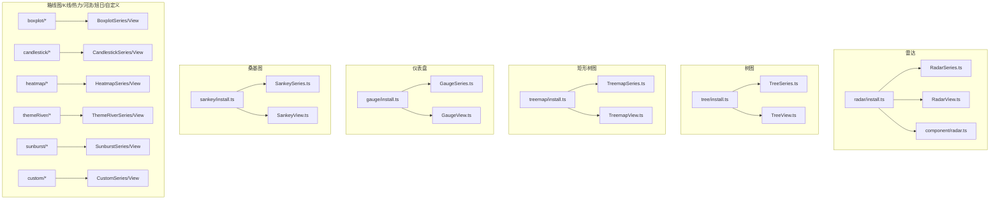

图示来源
- [src/chart/radar/install.ts:28-36](file://src/chart/radar/install.ts#L28-L36)
- [src/chart/tree/install.ts:27-33](file://src/chart/tree/install.ts#L27-L33)
- [src/chart/treemap/install.ts:28-34](file://src/chart/treemap/install.ts#L28-L34)
- [src/chart/gauge/install.ts:24-26](file://src/chart/gauge/install.ts#L24-L26)
- [src/chart/sankey/install.ts:34-56](file://src/chart/sankey/install.ts#L34-L56)

章节来源
- [src/chart/radar.ts:20-23](file://src/chart/radar.ts#L20-L23)
- [src/chart/tree.ts:20-23](file://src/chart/tree.ts#L20-L23)
- [src/chart/treemap.ts:20-23](file://src/chart/treemap.ts#L20-L23)
- [src/chart/gauge.ts:20-23](file://src/chart/gauge.ts#L20-L23)
- [src/chart/sankey.ts:20-23](file://src/chart/sankey.ts#L20-L23)

## 核心组件
- 雷达图（radar）
  - 安装入口：注册雷达组件、SeriesModel、ChartView、布局阶段与数据过滤处理器，并提供向后兼容预处理。
  - 典型配置维度：坐标轴（极坐标/雷达轴）、系列样式、标签、提示框、数据编码等。
- 树图（tree）
  - 安装入口：注册 SeriesModel、ChartView、布局与视觉阶段，以及交互动作。
  - 典型配置维度：节点/边样式、层级展开、布局方向、可视化映射等。
- 矩形树图（treemap）
  - 安装入口：注册 SeriesModel、ChartView、视觉与布局阶段，以及交互动作。
  - 典型配置维度：层级钻取、可视映射、节点样式、面包屑导航等。
- 仪表盘（gauge）
  - 安装入口：注册 SeriesModel、ChartView。
  - 典型配置维度：刻度、指针、进度条、标题与详情文本、范围分段等。
- 桑基图（sankey）
  - 安装入口：注册 SeriesModel、ChartView、布局与视觉阶段，以及拖拽节点与漫游动作。
  - 典型配置维度：节点对齐、连线样式、层级、是否环形、拖拽交互等。
- 箱线图（boxplot）
  - 安装入口：SeriesModel/View 位于 boxplot 子目录。
  - 典型配置维度：统计量计算、异常点标记、分组与堆叠、视觉映射等。
- K线图（candlestick）
  - 安装入口：SeriesModel/View 位于 candlestick 子目录。
  - 典型配置维度：涨跌颜色、蜡烛形态、坐标轴类型、标记等。
- 热力图（heatmap）
  - 安装入口：SeriesModel/View 位于 heatmap 子目录。
  - 典型配置维度：网格尺寸、颜色映射、标签格式化、大数据采样等。
- 河流图（themeRiver）
  - 安装入口：SeriesModel/View 位于 themeRiver 子目录。
  - 典型配置维度：时间轴、主题色带、宽度映射、滚动播放等。
- 旭日图（sunburst）
  - 安装入口：SeriesModel/View 位于 sunburst 子目录。
  - 典型配置维度：层级展示、中心定位、标签布局、高亮聚焦等。
- 自定义图表（custom）
  - 安装入口：SeriesModel/View 位于 custom 子目录。
  - 典型配置项：renderItem、getTooltipFormatter、图形元素构建逻辑等。

章节来源
- [src/chart/radar/install.ts:28-36](file://src/chart/radar/install.ts#L28-L36)
- [src/chart/tree/install.ts:27-33](file://src/chart/tree/install.ts#L27-L33)
- [src/chart/treemap/install.ts:28-34](file://src/chart/treemap/install.ts#L28-L34)
- [src/chart/gauge/install.ts:24-26](file://src/chart/gauge/install.ts#L24-L26)
- [src/chart/sankey/install.ts:34-56](file://src/chart/sankey/install.ts#L34-L56)
- [src/chart/boxplot/BoxplotSeries.ts](file://src/chart/boxplot/BoxplotSeries.ts)
- [src/chart/boxplot/BoxplotView.ts](file://src/chart/boxplot/BoxplotView.ts)
- [src/chart/candlestick/CandlestickSeries.ts](file://src/chart/candlestick/CandlestickSeries.ts)
- [src/chart/candlestick/CandlestickView.ts](file://src/chart/candlestick/CandlestickView.ts)
- [src/chart/heatmap/HeatmapSeries.ts](file://src/chart/heatmap/HeatmapSeries.ts)
- [src/chart/heatmap/HeatmapView.ts](file://src/chart/heatmap/HeatmapView.ts)
- [src/chart/themeRiver/ThemeRiverSeries.ts](file://src/chart/themeRiver/ThemeRiverSeries.ts)
- [src/chart/themeRiver/ThemeRiverView.ts](file://src/chart/themeRiver/ThemeRiverView.ts)
- [src/chart/sunburst/SunburstSeries.ts](file://src/chart/sunburst/SunburstSeries.ts)
- [src/chart/sunburst/SunburstView.ts](file://src/chart/sunburst/SunburstView.ts)
- [src/chart/custom/CustomSeries.ts](file://src/chart/custom/CustomSeries.ts)
- [src/chart/custom/CustomView.ts](file://src/chart/custom/CustomView.ts)

## 架构总览
ECharts 的系列以“模型-视图-布局-视觉-动作”分层协作：
- SeriesModel：声明式配置解析、数据准备、与 View 通信。
- ChartView：负责绘制与更新 DOM/Canvas/SVG。
- Layout：根据坐标系与数据计算几何布局（如树图布局、桑基布局）。
- Visual：完成视觉编码（颜色、大小、透明度等）。
- Action：提供交互能力（如桑基拖拽节点、通用漫游）。

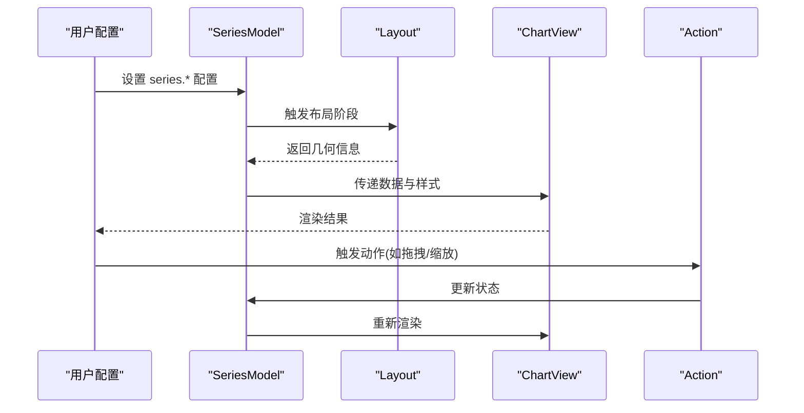

图示来源
- [src/chart/radar/install.ts:28-36](file://src/chart/radar/install.ts#L28-L36)
- [src/chart/tree/install.ts:27-33](file://src/chart/tree/install.ts#L27-L33)
- [src/chart/treemap/install.ts:28-34](file://src/chart/treemap/install.ts#L28-L34)
- [src/chart/sankey/install.ts:34-56](file://src/chart/sankey/install.ts#L34-L56)

## 详细组件分析

### 雷达图（radar）
- 安装与职责
  - 注册雷达组件、SeriesModel、ChartView、布局阶段与数据过滤器，并提供向后兼容预处理。
- 关键配置要点
  - 坐标轴：雷达轴数量、半径、起始角度、是否顺时针等。
  - 系列：数据维度映射、线条样式、区域填充、标签与提示框。
  - 交互：选中模式、高亮样式。
- 数据流
  - 数据经 dataFilter 处理后进入布局阶段，再由 View 渲染。

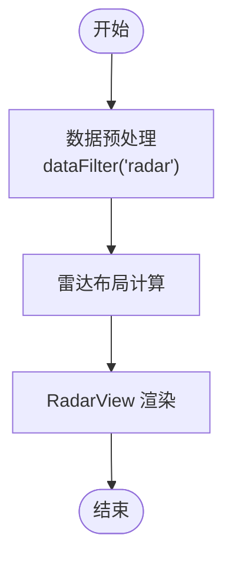

图示来源
- [src/chart/radar/install.ts:28-36](file://src/chart/radar/install.ts#L28-L36)

章节来源
- [src/chart/radar/install.ts:28-36](file://src/chart/radar/install.ts#L28-L36)
- [src/chart/radar/RadarSeries.ts](file://src/chart/radar/RadarSeries.ts)
- [src/chart/radar/RadarView.ts](file://src/chart/radar/RadarView.ts)
- [src/component/radar.ts](file://src/component/radar.ts)

### 树图（tree）
- 安装与职责
  - 注册 SeriesModel、ChartView、布局与视觉阶段，并安装树相关动作。
- 关键配置要点
  - 布局：方向（水平/垂直/径向）、层级间距、节点收缩/展开。
  - 样式：节点形状、边样式、标签位置与富文本。
  - 交互：点击展开/收起、漫游缩放。
- 处理流程
  - 数据 -> 布局 -> 视觉编码 -> 渲染。

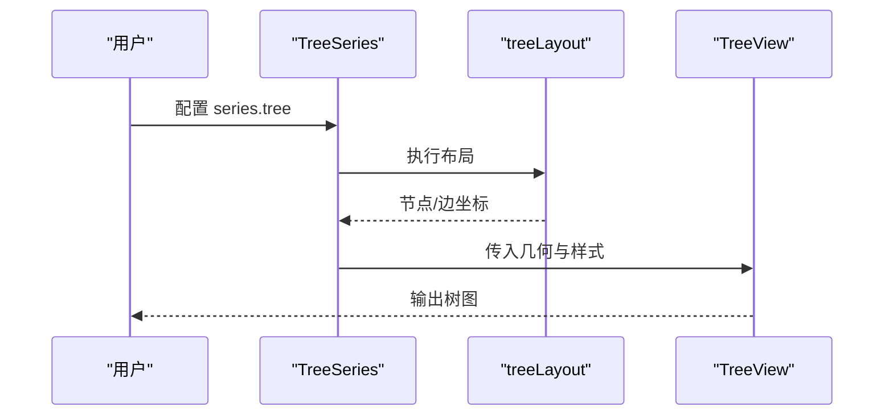

图示来源
- [src/chart/tree/install.ts:27-33](file://src/chart/tree/install.ts#L27-L33)

章节来源
- [src/chart/tree/install.ts:27-33](file://src/chart/tree/install.ts#L27-L33)
- [src/chart/tree/TreeSeries.ts](file://src/chart/tree/TreeSeries.ts)
- [src/chart/tree/TreeView.ts](file://src/chart/tree/TreeView.ts)

### 矩形树图（treemap）
- 安装与职责
  - 注册 SeriesModel、ChartView、视觉与布局阶段，并安装交互动作。
- 关键配置要点
  - 层级：根/子节点、可视映射、面包屑导航。
  - 样式：边框、内边距、标签显示策略。
  - 交互：点击钻取、缩放、键盘导航。
- 处理流程
  - 数据 -> 布局分块 -> 视觉映射 -> 渲染。

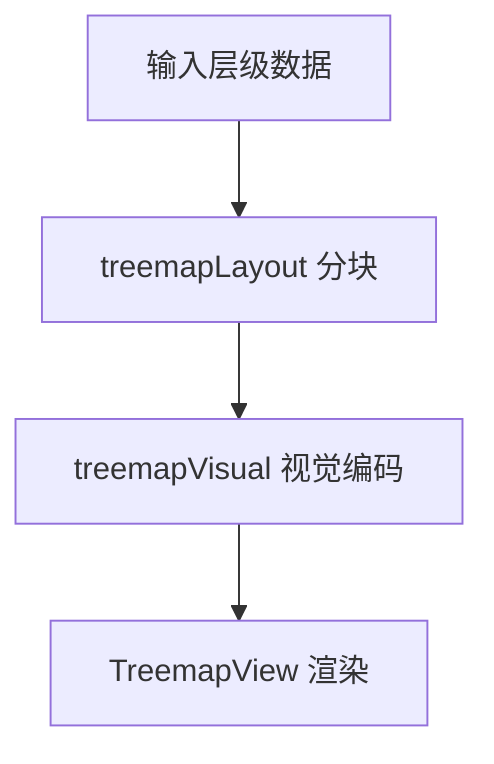

图示来源
- [src/chart/treemap/install.ts:28-34](file://src/chart/treemap/install.ts#L28-L34)

章节来源
- [src/chart/treemap/install.ts:28-34](file://src/chart/treemap/install.ts#L28-L34)
- [src/chart/treemap/TreemapSeries.ts](file://src/chart/treemap/TreemapSeries.ts)
- [src/chart/treemap/TreemapView.ts](file://src/chart/treemap/TreemapView.ts)

### 仪表盘（gauge）
- 安装与职责
  - 注册 SeriesModel、ChartView。
- 关键配置要点
  - 刻度：起止角度、间隔、刻度线长度。
  - 指针：长度、圆角、阴影。
  - 进度条：是否启用、颜色分段。
  - 文本：标题、数值、单位、字体样式。
- 处理流程
  - 数据 -> 计算刻度/指针角度 -> 渲染。

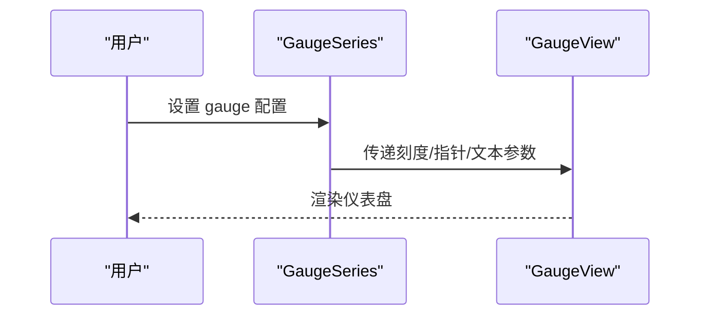

图示来源
- [src/chart/gauge/install.ts:24-26](file://src/chart/gauge/install.ts#L24-L26)

章节来源
- [src/chart/gauge/install.ts:24-26](file://src/chart/gauge/install.ts#L24-L26)
- [src/chart/gauge/GaugeSeries.ts](file://src/chart/gauge/GaugeSeries.ts)
- [src/chart/gauge/GaugeView.ts](file://src/chart/gauge/GaugeView.ts)

### 桑基图（sankey）
- 安装与职责
  - 注册 SeriesModel、ChartView、布局与视觉阶段；注册拖拽节点与漫游动作。
- 关键配置要点
  - 节点：对齐方式、层级、宽度映射。
  - 连线：颜色、透明度、曲率。
  - 交互：拖拽节点、缩放平移。
- 处理流程
  - 数据 -> 布局计算节点/边 -> 视觉编码 -> 渲染。

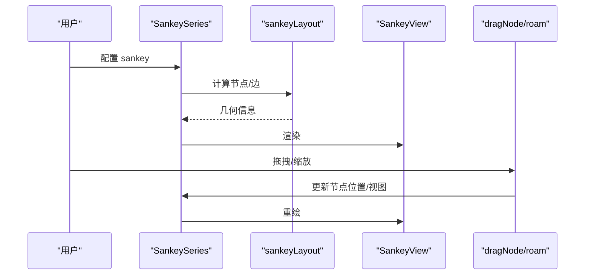

图示来源
- [src/chart/sankey/install.ts:34-56](file://src/chart/sankey/install.ts#L34-L56)

章节来源
- [src/chart/sankey/install.ts:34-56](file://src/chart/sankey/install.ts#L34-L56)
- [src/chart/sankey/SankeySeries.ts](file://src/chart/sankey/SankeySeries.ts)
- [src/chart/sankey/SankeyView.ts](file://src/chart/sankey/SankeyView.ts)

### 箱线图（boxplot）
- 安装与职责
  - SeriesModel/View 位于 boxplot 子目录，负责统计量计算与异常点绘制。
- 关键配置要点
  - 统计：四分位数、异常点阈值、组别划分。
  - 样式：箱体、须线、异常点符号。
  - 交互：提示框、高亮。
- 处理流程
  - 原始数据 -> 统计变换 -> 渲染。

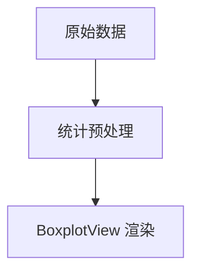

章节来源
- [src/chart/boxplot/BoxplotSeries.ts](file://src/chart/boxplot/BoxplotSeries.ts)
- [src/chart/boxplot/BoxplotView.ts](file://src/chart/boxplot/BoxplotView.ts)

### K线图（candlestick）
- 安装与职责
  - SeriesModel/View 位于 candlestick 子目录，用于金融时序数据展示。
- 关键配置要点
  - 涨跌颜色、蜡烛形态、坐标轴类型、标记与提示框。
- 处理流程
  - 时序数据 -> 坐标映射 -> 渲染。

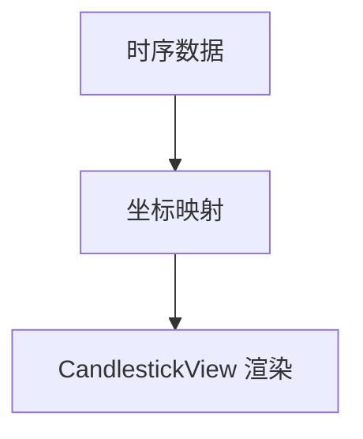

章节来源
- [src/chart/candlestick/CandlestickSeries.ts](file://src/chart/candlestick/CandlestickSeries.ts)
- [src/chart/candlestick/CandlestickView.ts](file://src/chart/candlestick/CandlestickView.ts)

### 热力图（heatmap）
- 安装与职责
  - SeriesModel/View 位于 heatmap 子目录，支持二维网格或地理网格。
- 关键配置要点
  - 网格：行列数、单元格大小、间隙。
  - 视觉：颜色映射、标签格式化、大数据采样。
- 处理流程
  - 数据 -> 网格化/采样 -> 视觉编码 -> 渲染。

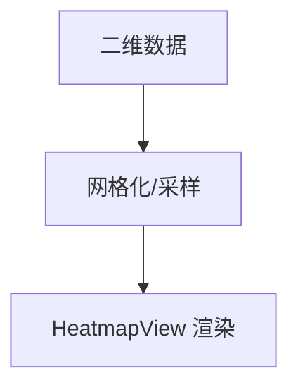

章节来源
- [src/chart/heatmap/HeatmapSeries.ts](file://src/chart/heatmap/HeatmapSeries.ts)
- [src/chart/heatmap/HeatmapView.ts](file://src/chart/heatmap/HeatmapView.ts)

### 河流图（themeRiver）
- 安装与职责
  - SeriesModel/View 位于 themeRiver 子目录，用于时间维度的主题流式展示。
- 关键配置要点
  - 时间轴、主题色带、宽度映射、滚动播放。
- 处理流程
  - 时间序列 -> 宽度计算 -> 渲染。

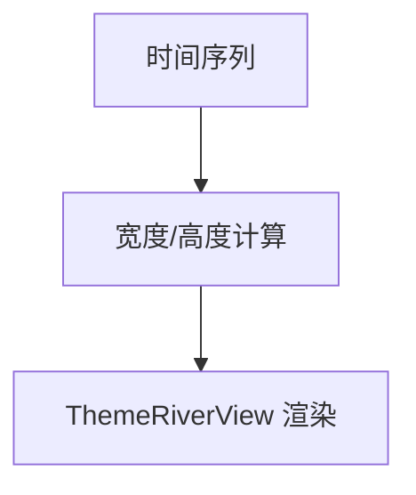

章节来源
- [src/chart/themeRiver/ThemeRiverSeries.ts](file://src/chart/themeRiver/ThemeRiverSeries.ts)
- [src/chart/themeRiver/ThemeRiverView.ts](file://src/chart/themeRiver/ThemeRiverView.ts)

### 旭日图（sunburst）
- 安装与职责
  - SeriesModel/View 位于 sunburst 子目录，用于层级数据的环形展示。
- 关键配置要点
  - 层级、中心定位、标签布局、高亮聚焦、可视化映射。
- 处理流程
  - 层级数据 -> 扇区计算 -> 渲染。

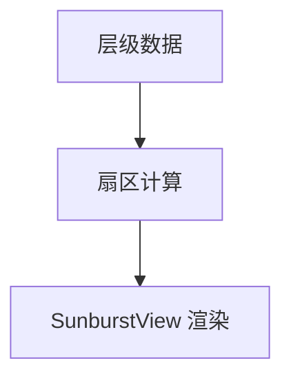

章节来源
- [src/chart/sunburst/SunburstSeries.ts](file://src/chart/sunburst/SunburstSeries.ts)
- [src/chart/sunburst/SunburstView.ts](file://src/chart/sunburst/SunburstView.ts)

### 自定义图表（custom）
- 安装与职责
  - SeriesModel/View 位于 custom 子目录，允许完全自定义图形元素与渲染逻辑。
- 关键配置要点
  - renderItem：按数据生成图形元素。
  - getTooltipFormatter：自定义提示框内容。
  - 样式与事件：自由控制。
- 处理流程
  - 数据 -> renderItem 生成图形 -> 渲染。

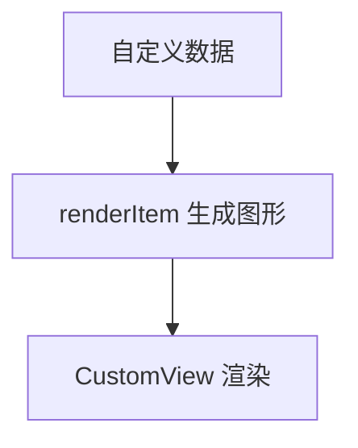

章节来源
- [src/chart/custom/CustomSeries.ts](file://src/chart/custom/CustomSeries.ts)
- [src/chart/custom/CustomView.ts](file://src/chart/custom/CustomView.ts)

## 依赖关系分析
- 各系列均依赖 ECharts 扩展机制进行注册，形成松耦合的可插拔体系。
- 布局与视觉阶段解耦，便于复用与优化。
- 动作（Action）统一注册，便于跨系列共享交互能力（如桑基拖拽、通用漫游）。

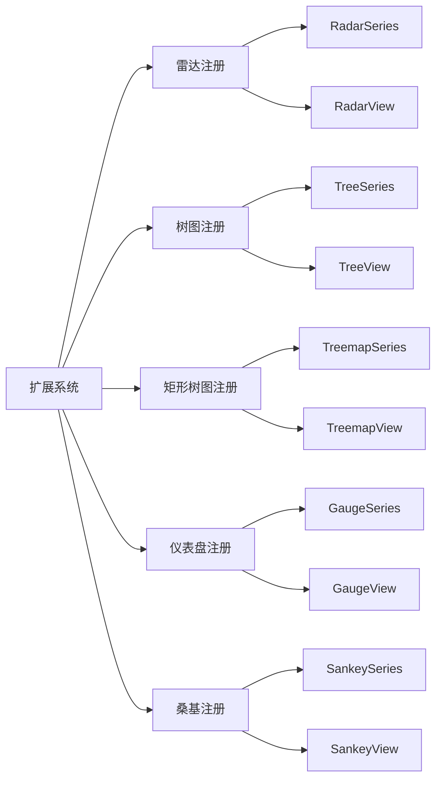

图示来源
- [src/chart/radar/install.ts:28-36](file://src/chart/radar/install.ts#L28-L36)
- [src/chart/tree/install.ts:27-33](file://src/chart/tree/install.ts#L27-L33)
- [src/chart/treemap/install.ts:28-34](file://src/chart/treemap/install.ts#L28-L34)
- [src/chart/gauge/install.ts:24-26](file://src/chart/gauge/install.ts#L24-L26)
- [src/chart/sankey/install.ts:34-56](file://src/chart/sankey/install.ts#L34-L56)

章节来源
- [src/chart/radar/install.ts:28-36](file://src/chart/radar/install.ts#L28-L36)
- [src/chart/tree/install.ts:27-33](file://src/chart/tree/install.ts#L27-L33)
- [src/chart/treemap/install.ts:28-34](file://src/chart/treemap/install.ts#L28-L34)
- [src/chart/gauge/install.ts:24-26](file://src/chart/gauge/install.ts#L24-L26)
- [src/chart/sankey/install.ts:34-56](file://src/chart/sankey/install.ts#L34-L56)

## 性能考虑
- 大数据场景优先使用合适的系列与采样策略（如热力图采样、箱线图聚合）。
- 合理设置布局与视觉阶段，避免不必要的重计算。
- 对频繁更新的图表，减少动画与复杂样式以提升性能。
- 利用数据过滤与预处理降低渲染压力。

## 故障排查指南
- 系列未生效
  - 检查是否正确引入并注册了对应 install 模块。
  - 确认 series.type 与安装入口一致。
- 布局异常
  - 检查数据格式是否符合该系列要求（如树图的层级结构、桑基的节点/边）。
  - 查看布局阶段是否有错误日志。
- 交互无效
  - 确认动作已注册（如桑基拖拽），且事件绑定正确。
- 渲染空白
  - 检查坐标系与数据维度映射是否正确。
  - 确认视觉映射（颜色、大小）未导致不可见。

章节来源
- [src/chart/radar/install.ts:28-36](file://src/chart/radar/install.ts#L28-L36)
- [src/chart/sankey/install.ts:34-56](file://src/chart/sankey/install.ts#L34-L56)

## 结论
通过对各“其他图表系列”的安装入口与核心模块进行分析，可以清晰看到 ECharts 以“模型-视图-布局-视觉-动作”的分层架构支撑多样化图表。掌握各系列的注册位置与关键配置维度，有助于快速定位问题、优化性能并实现丰富的业务场景。

## 附录
- 配置示例与最佳实践建议
  - 雷达图：多指标对比时，合理设置雷达轴数量与半径，避免标签重叠。
  - 树图：大层级数据建议开启懒加载与折叠，提升交互体验。
  - 矩形树图：结合可视映射突出重要区块，配合面包屑导航提升可探索性。
  - 仪表盘：明确刻度范围与分段颜色，增强可读性。
  - 桑基图：节点对齐与层级规划影响可读性，必要时调整布局方向。
  - 箱线图/K线图：金融数据注意时间轴精度与涨跌颜色一致性。
  - 热力图：大数据集务必启用采样与合理的网格尺寸。
  - 河流图：时间窗口与滚动速度需匹配业务节奏。
  - 旭日图：层级过深时考虑简化标签与聚焦高亮。
  - 自定义图表：renderItem 中尽量复用图形元素，减少重复创建。