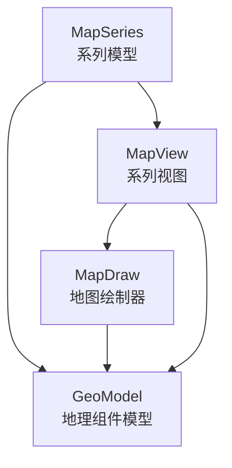
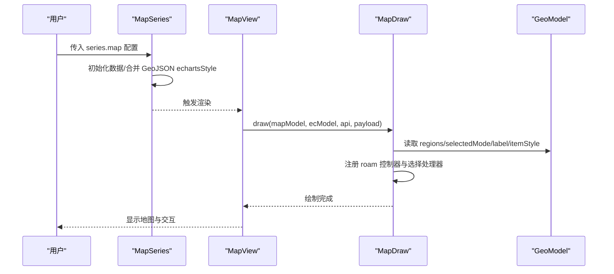
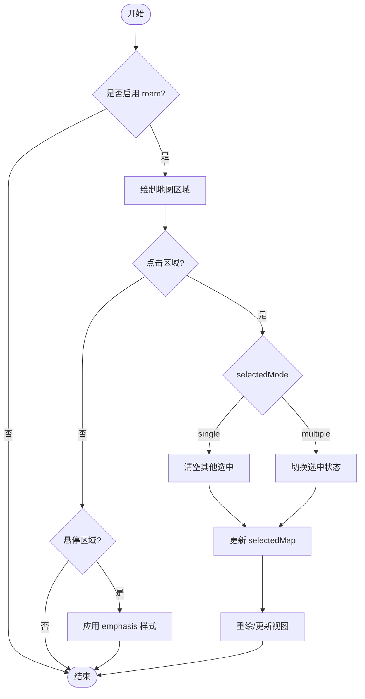
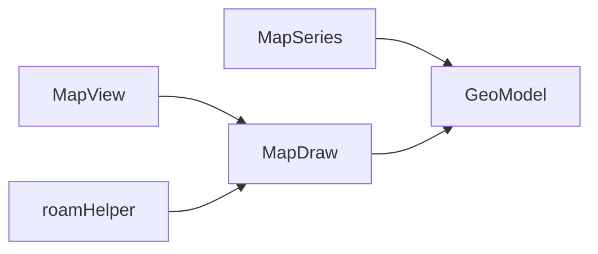

# 地图系列配置项

<cite>
**本文引用的文件**
- [src/chart/map/MapSeries.ts](file://src/chart/map/MapSeries.ts)
- [src/chart/map/MapView.ts](file://src/chart/map/MapView.ts)
- [src/chart/map/install.ts](file://src/chart/map/install.ts)
- [src/coord/geo/GeoModel.ts](file://src/coord/geo/GeoModel.ts)
- [src/component/helper/roamHelper.ts](file://src/component/helper/roamHelper.ts)
- [src/component/helper/MapDraw.ts](file://src/component/helper/MapDraw.ts)
- [test/map.html](file://test/map.html)
- [test/map-default.html](file://test/map-default.html)
- [test/geo-map-roam.html](file://test/geo-map-roam.html)
- [test/geo-svg.html](file://test/geo-svg.html)
</cite>

## 目录
1. [简介](#简介)
2. [项目结构](#项目结构)
3. [核心组件](#核心组件)
4. [架构总览](#架构总览)
5. [详细组件分析](#详细组件分析)
6. [依赖分析](#依赖分析)
7. [性能考虑](#性能考虑)
8. [故障排查指南](#故障排查指南)
9. [结论](#结论)
10. [附录：配置项速查与示例](#附录：配置项速查与示例)

## 简介
本文件面向 ECharts 的“地图系列（series.map）”配置，系统化说明地图特有的配置项及其作用、数据类型、默认值与使用方法。重点覆盖 mapType（map）、roam、selectedMode、label、itemStyle、emphasis、select、regions、geoIndex、animationDuration、animationEasing、animationDurationUpdate、animationEasingUpdate 等，并结合源码与测试用例给出实际应用场景与最佳实践。

## 项目结构
地图系列由“模型-视图-绘制器”三层协作完成：
- MapSeries：定义系列选项、默认值、数据初始化与交互逻辑（如选择、提示框）。
- MapView：负责渲染流程控制、图例符号与标签布局、漫游更新。
- MapDraw：具体绘制地图区域、处理 roam 控制器与选择事件。
- GeoModel：地理坐标系与 geo 组件的选项与状态（如 selectedMode、regions、label/itemStyle/emphasis/select）。

图表来源
- [src/chart/map/MapSeries.ts:117-372](file://src/chart/map/MapSeries.ts#L117-L372)
- [src/chart/map/MapView.ts:32-86](file://src/chart/map/MapView.ts#L32-L86)
- [src/component/helper/MapDraw.ts:201-236](file://src/component/helper/MapDraw.ts#L201-L236)
- [src/coord/geo/GeoModel.ts:154-245](file://src/coord/geo/GeoModel.ts#L154-L245)

章节来源
- [src/chart/map/install.ts:28-37](file://src/chart/map/install.ts#L28-L37)
- [src/chart/map/MapSeries.ts:117-372](file://src/chart/map/MapSeries.ts#L117-L372)
- [src/chart/map/MapView.ts:32-86](file://src/chart/map/MapView.ts#L32-L86)
- [src/coord/geo/GeoModel.ts:154-245](file://src/coord/geo/GeoModel.ts#L154-L245)

## 核心组件
- MapSeries
  - 职责：声明 series.map 的配置项与默认值；管理数据填充（含 GeoJSON 中 echartsStyle 合并）；提供 tooltip 格式化与图例图标；决定是否需要绘制地图主体。
  - 关键默认值：coordinateSystem='geo'、map=''、aspectScale=null、center=null、zoom=1、scaleLimit=null、selectedMode=true、label.show=false、itemStyle.borderWidth=0.5、emphasis/select 样式等。
- MapView
  - 职责：渲染流程控制；在需要时创建并复用 MapDraw；处理 legend symbol 与 label 布局；响应 geoRoam 更新。
- MapDraw
  - 职责：根据资源类型（geoJSON/geoSVG）构建图形；应用视图坐标变换；注册 roam 控制器与选择处理器。
- GeoModel
  - 职责：维护 geo 组件的选项与状态（selectedMode、regions、label/itemStyle/emphasis/select）；提供 select/unSelect/toggleSelected/isSelected 等方法；为 GeoJSON 源设置默认颜色。

章节来源
- [src/chart/map/MapSeries.ts:134-171](file://src/chart/map/MapSeries.ts#L134-L171)
- [src/chart/map/MapSeries.ts:286-372](file://src/chart/map/MapSeries.ts#L286-L372)
- [src/chart/map/MapView.ts:39-86](file://src/chart/map/MapView.ts#L39-L86)
- [src/component/helper/MapDraw.ts:201-236](file://src/component/helper/MapDraw.ts#L201-L236)
- [src/coord/geo/GeoModel.ts:165-245](file://src/coord/geo/GeoModel.ts#L165-L245)

## 架构总览
下图展示地图系列从配置到渲染的关键调用链：用户配置经 MapSeries 解析后，由 MapView 调度 MapDraw 进行绘制，并通过 roamHelper 与 MapDraw 内置控制器处理漫游交互。

图表来源
- [src/chart/map/MapSeries.ts:134-171](file://src/chart/map/MapSeries.ts#L134-L171)
- [src/chart/map/MapView.ts:59-86](file://src/chart/map/MapView.ts#L59-L86)
- [src/component/helper/MapDraw.ts:201-236](file://src/component/helper/MapDraw.ts#L201-L236)
- [src/coord/geo/GeoModel.ts:262-284](file://src/coord/geo/GeoModel.ts#L262-L284)

## 详细组件分析

### 配置项详解（按主题分组）

#### 地图类型与坐标系
- map / mapType
  - 作用：指定地图名称或类型。当未指定 geoIndex 时，系列将使用自身 map 作为地图源；若通过 geoIndex 引用外部 geo 组件，则忽略 map/mapType。
  - 类型：string
  - 默认值：''
  - 参考路径
    - [src/chart/map/MapSeries.ts:294-300](file://src/chart/map/MapSeries.ts#L294-L300)
    - [src/coord/geo/GeoModel.ts:190-191](file://src/coord/geo/GeoModel.ts#L190-L191)
- coordinateSystem
  - 作用：固定为 'geo'，表示地图系列基于地理坐标系。
  - 类型：'geo'
  - 默认值：'geo'
  - 参考路径
    - [src/chart/map/MapSeries.ts:292-293](file://src/chart/map/MapSeries.ts#L292-L293)

#### 漫游与缩放
- roam
  - 作用：启用地图平移/缩放交互。可设为 true/false 或字符串模式。
  - 类型：boolean | string
  - 默认值：false（由 roamHelper 获取系列或组件的 roam）
  - 行为要点：roam 控制器在 MapDraw 中注册，受 clipRect 与命中检测影响。
  - 参考路径
    - [src/component/helper/roamHelper.ts:70-90](file://src/component/helper/roamHelper.ts#L70-L90)
    - [src/component/helper/MapDraw.ts:220-233](file://src/component/helper/MapDraw.ts#L220-L233)
    - [test/geo-map-roam.html:201-210](file://test/geo-map-roam.html#L201-L210)
- zoom / center / scaleLimit / boundingCoords / aspectScale
  - 作用：控制初始缩放、中心点、缩放限制、边界坐标与宽高比。
  - 类型：number | null | [number,number] | number
  - 默认值：zoom=1，center=null，scaleLimit=null，boundingCoords=null，aspectScale=null
  - 参考路径
    - [src/chart/map/MapSeries.ts:311-336](file://src/chart/map/MapSeries.ts#L311-L336)
    - [src/coord/geo/GeoModel.ts:177-202](file://src/coord/geo/GeoModel.ts#L177-L202)

#### 选择模式与选中态
- selectedMode
  - 作用：控制地图区域的选择模式。支持布尔或 'single'/'multiple'。
  - 类型：boolean | 'single' | 'multiple'
  - 默认值：true（系列），geo 组件中为 false（需显式开启）
  - 行为要点：GeoModel.select 在非 multiple 模式下会清空已选集合；toggleSelected 切换选中状态。
  - 参考路径
    - [src/chart/map/MapSeries.ts:338-339](file://src/chart/map/MapSeries.ts#L338-L339)
    - [src/coord/geo/GeoModel.ts:204-205](file://src/coord/geo/GeoModel.ts#L204-L205)
    - [src/coord/geo/GeoModel.ts:315-343](file://src/coord/geo/GeoModel.ts#L315-L343)
- select
  - 作用：选中态的样式与标签配置（如高亮色、标签显示）。
  - 类型：对象（继承通用 states 选项）
  - 默认值：label.show=true，itemStyle.color=highlight
  - 参考路径
    - [src/chart/map/MapSeries.ts:361-369](file://src/chart/map/MapSeries.ts#L361-L369)
    - [src/coord/geo/GeoModel.ts:230-238](file://src/coord/geo/GeoModel.ts#L230-L238)

#### 标签与样式
- label
  - 作用：区域标签的显示与样式。
  - 类型：对象（包含 show、color、formatter 等）
  - 默认值：show=false，color=tertiary
  - 参考路径
    - [src/chart/map/MapSeries.ts:340-343](file://src/chart/map/MapSeries.ts#L340-L343)
    - [src/coord/geo/GeoModel.ts:206-209](file://src/coord/geo/GeoModel.ts#L206-L209)
- itemStyle
  - 作用：区域边框宽度、边框颜色、区域填充色等。
  - 类型：对象
  - 默认值：borderWidth=0.5，borderColor=border，areaColor=background
  - 参考路径
    - [src/chart/map/MapSeries.ts:345-349](file://src/chart/map/MapSeries.ts#L345-L349)
    - [src/coord/geo/GeoModel.ts:211-218](file://src/coord/geo/GeoModel.ts#L211-L218)
- emphasis
  - 作用：悬停态的标签与样式（如高亮背景、标签颜色）。
  - 类型：对象
  - 默认值：label.show=true，color=primary；itemStyle.areaColor=highlight
  - 参考路径
    - [src/chart/map/MapSeries.ts:351-359](file://src/chart/map/MapSeries.ts#L351-L359)
    - [src/coord/geo/GeoModel.ts:220-228](file://src/coord/geo/GeoModel.ts#L220-L228)

#### 区域级配置
- regions
  - 作用：为 geo 组件中的区域提供独立配置（如 name、selected、label/itemStyle 等）。
  - 类型：RegionOption[]
  - 默认值：[]
  - 行为要点：optionUpdated 时会填充缺失区域并构建 selectedMap。
  - 参考路径
    - [src/coord/geo/GeoModel.ts:240-241](file://src/coord/geo/GeoModel.ts#L240-L241)
    - [src/coord/geo/GeoModel.ts:262-284](file://src/coord/geo/GeoModel.ts#L262-L284)

#### 关联 geo 组件
- geoIndex
  - 作用：引用外部 geo 组件以共享地图配置与状态。若不指定，系列将创建内部独占 geo。
  - 类型：number
  - 默认值：未指定（内部 geo）
  - 行为要点：当存在 host geo 时，系列不重复绘制地图主体。
  - 参考路径
    - [src/chart/map/MapSeries.ts:297-300](file://src/chart/map/MapSeries.ts#L297-L300)
    - [src/chart/map/MapView.ts:55-57](file://src/chart/map/MapView.ts#L55-L57)

#### 动画相关
- animationDuration / animationEasing / animationDurationUpdate / animationEasingUpdate
  - 作用：控制进入与更新的动画时长与缓动函数。
  - 类型：number | function；AnimationEasing
  - 默认值：遵循全局动画配置（payload 可覆盖）
  - 行为要点：动画配置可从 payload 注入（duration/easing/delay），用于交互过渡。
  - 参考路径
    - [src/util/types.ts:194-198](file://src/util/types.ts#L194-L198)
    - [src/animation/basicTransition.ts:100-120](file://src/animation/basicTransition.ts#L100-L120)

章节来源
- [src/chart/map/MapSeries.ts:286-372](file://src/chart/map/MapSeries.ts#L286-L372)
- [src/coord/geo/GeoModel.ts:165-245](file://src/coord/geo/GeoModel.ts#L165-L245)
- [src/component/helper/roamHelper.ts:70-90](file://src/component/helper/roamHelper.ts#L70-L90)
- [src/component/helper/MapDraw.ts:220-233](file://src/component/helper/MapDraw.ts#L220-L233)
- [src/util/types.ts:194-198](file://src/util/types.ts#L194-L198)
- [src/animation/basicTransition.ts:100-120](file://src/animation/basicTransition.ts#L100-L120)

### 交互流程图（选择与漫游）

图表来源
- [src/coord/geo/GeoModel.ts:315-343](file://src/coord/geo/GeoModel.ts#L315-L343)
- [src/component/helper/MapDraw.ts:220-236](file://src/component/helper/MapDraw.ts#L220-L236)

## 依赖分析
- MapSeries 依赖 GeoModel 提供的 geo 能力（regions、selectedMode、label/itemStyle/emphasis/select）。
- MapView 通过 MapDraw 完成绘制，并在 geoRoam 事件中更新视图。
- roamHelper 统一处理 roam 控制器启用与事件派发。
- 测试用例展示了多系列共用 geo、不同 selectedMode、label 与 roam 的组合用法。

图表来源
- [src/chart/map/MapSeries.ts:117-126](file://src/chart/map/MapSeries.ts#L117-L126)
- [src/chart/map/MapView.ts:32-86](file://src/chart/map/MapView.ts#L32-L86)
- [src/component/helper/roamHelper.ts:70-90](file://src/component/helper/roamHelper.ts#L70-L90)
- [src/component/helper/MapDraw.ts:201-236](file://src/component/helper/MapDraw.ts#L201-L236)

章节来源
- [src/chart/map/install.ts:28-37](file://src/chart/map/install.ts#L28-L37)
- [src/chart/map/MapSeries.ts:117-126](file://src/chart/map/MapSeries.ts#L117-L126)
- [src/chart/map/MapView.ts:32-86](file://src/chart/map/MapView.ts#L32-L86)
- [src/component/helper/roamHelper.ts:70-90](file://src/component/helper/roamHelper.ts#L70-L90)
- [src/component/helper/MapDraw.ts:201-236](file://src/component/helper/MapDraw.ts#L201-L236)

## 性能考虑
- 避免不必要的重绘：在 geoRoam 且来自自身系列时，MapView 会跳过完整重绘，仅更新视图变换。
- 合理使用 selectedMode：单选中模式可减少状态维护开销。
- 控制 roam 范围：通过 scaleLimit 与 boundingCoords 限制缩放与可视范围，降低渲染压力。
- 大数据量场景：结合 visualMap 与按需加载区域数据，减少初始渲染成本。

[本节为通用指导，无需特定文件引用]

## 故障排查指南
- 地图无法交互（无法拖拽/缩放）
  - 检查 series.map 或 geo 组件是否设置了 roam=true。
  - 确认 MapDraw 中 roam 控制器已启用，且命中检测区域有效。
  - 参考路径
    - [src/component/helper/roamHelper.ts:70-90](file://src/component/helper/roamHelper.ts#L70-L90)
    - [src/component/helper/MapDraw.ts:220-233](file://src/component/helper/MapDraw.ts#L220-L233)
- 选择无效或状态异常
  - 确认 selectedMode 非 false；检查 GeoModel.selectedMap 是否正确更新。
  - 参考路径
    - [src/coord/geo/GeoModel.ts:315-343](file://src/coord/geo/GeoModel.ts#L315-L343)
- 标签不显示
  - 检查 label.show 与 emphasis.label.show；确认区域名称与数据匹配。
  - 参考路径
    - [src/chart/map/MapSeries.ts:340-343](file://src/chart/map/MapSeries.ts#L340-L343)
    - [src/coord/geo/GeoModel.ts:206-209](file://src/coord/geo/GeoModel.ts#L206-L209)

章节来源
- [src/component/helper/roamHelper.ts:70-90](file://src/component/helper/roamHelper.ts#L70-L90)
- [src/component/helper/MapDraw.ts:220-233](file://src/component/helper/MapDraw.ts#L220-L233)
- [src/coord/geo/GeoModel.ts:315-343](file://src/coord/geo/GeoModel.ts#L315-L343)
- [src/chart/map/MapSeries.ts:340-343](file://src/chart/map/MapSeries.ts#L340-L343)
- [src/coord/geo/GeoModel.ts:206-209](file://src/coord/geo/GeoModel.ts#L206-L209)

## 结论
地图系列的配置围绕“地图源、交互、样式与状态”四个维度展开。通过 MapSeries 与 GeoModel 的配合，可实现灵活的地图展示与交互；借助 MapView 与 MapDraw 的渲染管线，保证高效稳定的可视化体验。合理配置 roam、selectedMode、label/itemStyle/emphasis/select 以及动画参数，能够显著提升用户体验与性能。

[本节为总结性内容，无需特定文件引用]

## 附录：配置项速查与示例

### 配置项速查表
- map / mapType
  - 类型：string
  - 默认值：''
  - 说明：指定地图名称或类型；当未使用 geoIndex 时生效。
  - 参考路径
    - [src/chart/map/MapSeries.ts:294-300](file://src/chart/map/MapSeries.ts#L294-L300)
    - [src/coord/geo/GeoModel.ts:190-191](file://src/coord/geo/GeoModel.ts#L190-L191)
- roam
  - 类型：boolean | string
  - 默认值：false
  - 说明：启用地图平移/缩放交互。
  - 参考路径
    - [src/component/helper/roamHelper.ts:70-90](file://src/component/helper/roamHelper.ts#L70-L90)
    - [src/component/helper/MapDraw.ts:220-233](file://src/component/helper/MapDraw.ts#L220-L233)
- selectedMode
  - 类型：boolean | 'single' | 'multiple'
  - 默认值：true（系列），false（geo）
  - 说明：控制区域选择模式。
  - 参考路径
    - [src/chart/map/MapSeries.ts:338-339](file://src/chart/map/MapSeries.ts#L338-L339)
    - [src/coord/geo/GeoModel.ts:204-205](file://src/coord/geo/GeoModel.ts#L204-L205)
- label
  - 类型：对象
  - 默认值：show=false，color=tertiary
  - 说明：区域标签显示与样式。
  - 参考路径
    - [src/chart/map/MapSeries.ts:340-343](file://src/chart/map/MapSeries.ts#L340-L343)
    - [src/coord/geo/GeoModel.ts:206-209](file://src/coord/geo/GeoModel.ts#L206-L209)
- itemStyle
  - 类型：对象
  - 默认值：borderWidth=0.5，borderColor=border，areaColor=background
  - 说明：区域边框与填充样式。
  - 参考路径
    - [src/chart/map/MapSeries.ts:345-349](file://src/chart/map/MapSeries.ts#L345-L349)
    - [src/coord/geo/GeoModel.ts:211-218](file://src/coord/geo/GeoModel.ts#L211-L218)
- emphasis
  - 类型：对象
  - 默认值：label.show=true，color=primary；itemStyle.areaColor=highlight
  - 说明：悬停态样式。
  - 参考路径
    - [src/chart/map/MapSeries.ts:351-359](file://src/chart/map/MapSeries.ts#L351-L359)
    - [src/coord/geo/GeoModel.ts:220-228](file://src/coord/geo/GeoModel.ts#L220-L228)
- select
  - 类型：对象
  - 默认值：label.show=true，color=primary；itemStyle.color=highlight
  - 说明：选中态样式。
  - 参考路径
    - [src/chart/map/MapSeries.ts:361-369](file://src/chart/map/MapSeries.ts#L361-L369)
    - [src/coord/geo/GeoModel.ts:230-238](file://src/coord/geo/GeoModel.ts#L230-L238)
- regions
  - 类型：RegionOption[]
  - 默认值：[]
  - 说明：区域级配置（name、selected、label/itemStyle 等）。
  - 参考路径
    - [src/coord/geo/GeoModel.ts:240-241](file://src/coord/geo/GeoModel.ts#L240-L241)
    - [src/coord/geo/GeoModel.ts:262-284](file://src/coord/geo/GeoModel.ts#L262-L284)
- geoIndex
  - 类型：number
  - 默认值：未指定（内部 geo）
  - 说明：引用外部 geo 组件以共享地图配置与状态。
  - 参考路径
    - [src/chart/map/MapSeries.ts:297-300](file://src/chart/map/MapSeries.ts#L297-L300)
    - [src/chart/map/MapView.ts:55-57](file://src/chart/map/MapView.ts#L55-L57)
- animationDuration / animationEasing / animationDurationUpdate / animationEasingUpdate
  - 类型：number | function；AnimationEasing
  - 默认值：遵循全局动画配置（payload 可覆盖）
  - 说明：进入与更新的动画时长与缓动。
  - 参考路径
    - [src/util/types.ts:194-198](file://src/util/types.ts#L194-L198)
    - [src/animation/basicTransition.ts:100-120](file://src/animation/basicTransition.ts#L100-L120)

### 实际应用场景与参考
- 基础地图与标签显示
  - 参考：[test/map-default.html:93-138](file://test/map-default.html#L93-L138)
- 多系列地图与 selectedMode
  - 参考：[test/map.html:96-173](file://test/map.html#L96-L173)
- 启用 roam 与多选中
  - 参考：[test/geo-map-roam.html:201-210](file://test/geo-map-roam.html#L201-L210)
- 使用 SVG 地图资源与 geoIndex
  - 参考：[test/geo-svg.html:667-697](file://test/geo-svg.html#L667-L697)

[本节为配置速查与示例汇总，所有条目均附带参考路径]