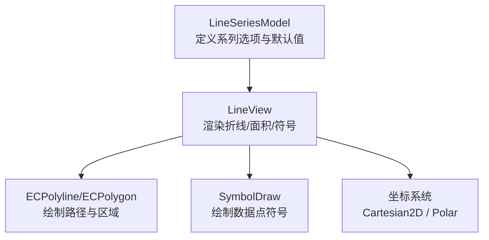
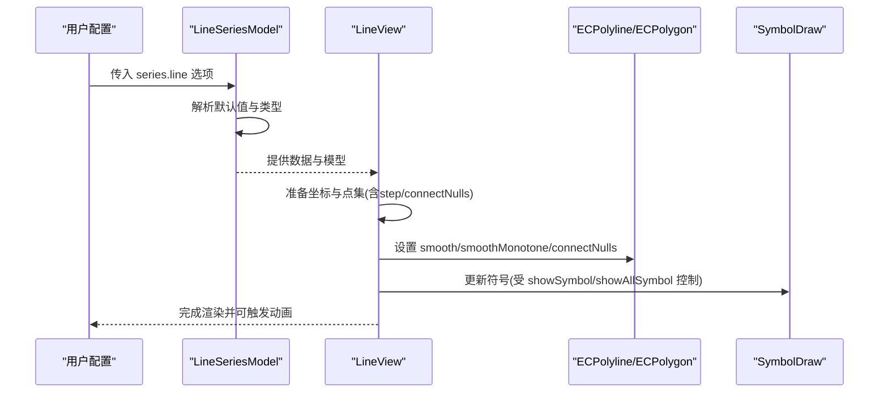
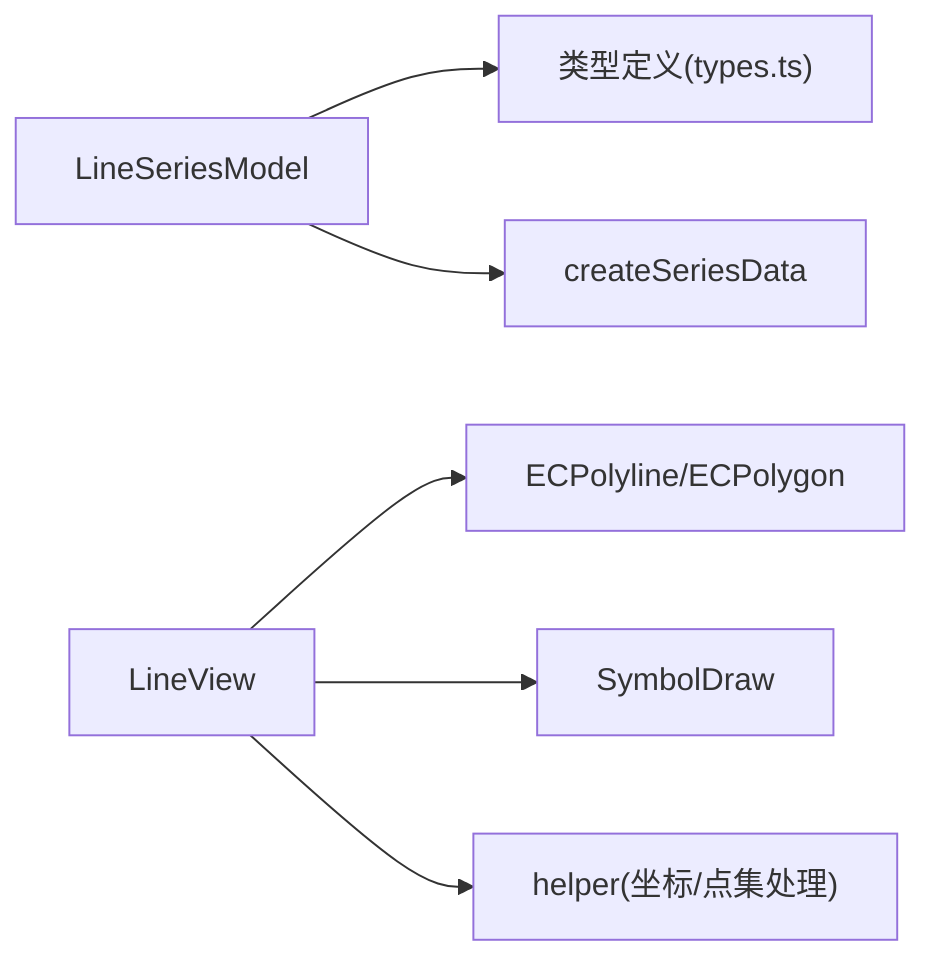

# 折线图系列配置项

<cite>
**本文引用的文件**
- [LineSeries.ts](file://src/chart/line/LineSeries.ts)
- [LineView.ts](file://src/chart/line/LineView.ts)
- [types.ts](file://src/util/types.ts)
</cite>

## 目录
1. [简介](#简介)
2. [项目结构](#项目结构)
3. [核心组件](#核心组件)
4. [架构总览](#架构总览)
5. [详细组件分析](#详细组件分析)
6. [依赖关系分析](#依赖关系分析)
7. [性能考量](#性能考量)
8. [故障排查指南](#故障排查指南)
9. [结论](#结论)
10. [附录](#附录)

## 简介
本文件面向 ECharts 折线图（series.line）系列，系统化说明折线图特有的配置项与行为，覆盖平滑曲线、符号样式、面积图、阶梯线、空值连接、数据采样、大数据渲染、裁剪溢出以及动画等关键能力。文档基于源码实现进行解读，帮助读者准确理解各属性的作用、数据类型、默认值与配置方法，并提供典型应用场景建议。

## 项目结构
折线图由“模型 + 视图”两部分组成：
- 模型层（LineSeriesModel）：定义系列选项、默认值与数据初始化逻辑。
- 视图层（LineView）：负责将数据转换为图形元素（折线、面积、符号），处理交互状态、动画与裁剪。

图表来源
- [LineSeries.ts:137-234](file://src/chart/line/LineSeries.ts#L137-L234)
- [LineView.ts:599-922](file://src/chart/line/LineView.ts#L599-L922)

章节来源
- [LineSeries.ts:137-234](file://src/chart/line/LineSeries.ts#L137-L234)
- [LineView.ts:599-922](file://src/chart/line/LineView.ts#L599-L922)

## 核心组件
- LineSeriesModel：声明 series.line 的可用选项、默认值与依赖坐标系统；提供 getInitialData 初始化数据。
- LineView：实现渲染流程，包括：
  - 计算并转换点集（含 step、connectNulls）
  - 设置 polyline/polygon 形状与样式（smooth、smoothMonotone、connectNulls）
  - 管理符号显示策略（showSymbol、showAllSymbol）
  - 处理 endLabel、clipPath、动画更新与事件触发

章节来源
- [LineSeries.ts:137-234](file://src/chart/line/LineSeries.ts#L137-L234)
- [LineView.ts:635-922](file://src/chart/line/LineView.ts#L635-L922)

## 架构总览
下图展示折线图从配置到渲染的关键调用链与数据流。

图表来源
- [LineSeries.ts:137-234](file://src/chart/line/LineSeries.ts#L137-L234)
- [LineView.ts:635-922](file://src/chart/line/LineView.ts#L635-L922)

## 详细组件分析

### 平滑曲线与单调性：smooth、smoothMonotone
- smooth
  - 作用：控制折线是否平滑及平滑程度。
  - 类型：boolean | number
  - 默认值：false
  - 行为：数值化后用于 polyline 的平滑参数；true 等价于固定系数，false 为直线段。
- smoothMonotone
  - 作用：在保持单调性的前提下进行平滑，避免过冲。
  - 类型："x" | "y" | "none"
  - 默认值：null（继承或关闭）
  - 行为：传递给 polyline/polygon 以影响面积图与折线的单调平滑。

章节来源
- [LineSeries.ts:108-113](file://src/chart/line/LineSeries.ts#L108-L113)
- [LineSeries.ts:196-200](file://src/chart/line/LineSeries.ts#L196-L200)
- [LineView.ts:853-860](file://src/chart/line/LineView.ts#L853-L860)
- [LineView.ts:876-885](file://src/chart/line/LineView.ts#L876-L885)

### 符号相关：symbol、symbolSize、symbolRotate、symbolKeepAspect、symbolOffset、showSymbol
- symbol
  - 作用：数据点标记的形状（如圆、矩形、自定义路径或图片）。
  - 类型：string | 回调
  - 默认值：'emptyCircle'
- symbolSize
  - 作用：标记大小，支持单值、数组或回调。
  - 类型：number | number[] | 回调
- symbolRotate
  - 作用：标记旋转角度，支持数值或回调。
  - 类型：number | 回调
- symbolKeepAspect
  - 作用：是否保持标记宽高比。
  - 类型：boolean
- symbolOffset
  - 作用：标记相对位置的偏移，支持字符串、数值、数组或回调。
  - 类型：string | number | (string|number)[] | 回调
- showSymbol
  - 作用：是否显示数据点符号。
  - 类型：boolean
  - 默认值：true
- showAllSymbol
  - 作用：在类目轴下控制是否尽可能显示所有符号，或跟随标签间隔策略。
  - 类型：'auto' | boolean
  - 默认值：'auto'

章节来源
- [LineSeries.ts:102-121](file://src/chart/line/LineSeries.ts#L102-L121)
- [LineSeries.ts:199-210](file://src/chart/line/LineSeries.ts#L199-L210)
- [types.ts:1227-1242](file://src/util/types.ts#L1227-L1242)
- [LineView.ts:662-667](file://src/chart/line/LineView.ts#L662-L667)
- [LineView.ts:370-410](file://src/chart/line/LineView.ts#L370-L410)

### 线条与面积：lineStyle、areaStyle
- lineStyle
  - 作用：折线描边样式（颜色、宽度、虚线等）。
  - 类型：LineStyleOption
  - 默认值：width=2, type='solid'
- areaStyle
  - 作用：面积填充样式与原点 origin（auto/start/end/数值）。
  - 类型：AreaStyleOption & { origin?: 'auto'|'start'|'end'|number }
  - 默认值：未开启时不渲染面积；origin 默认 auto
  - 行为：当存在 stackedOnSeries 时，面积上边界使用当前系列点集，下边界使用 stackedOnPoints。

章节来源
- [LineSeries.ts:102-106](file://src/chart/line/LineSeries.ts#L102-L106)
- [LineSeries.ts:180-183](file://src/chart/line/LineSeries.ts#L180-L183)
- [LineView.ts:832-847](file://src/chart/line/LineView.ts#L832-L847)
- [LineView.ts:862-891](file://src/chart/line/LineView.ts#L862-L891)

### 堆叠：stack
- stack
  - 作用：将多个同 stack 名称的系列进行堆叠，形成面积堆叠效果。
  - 类型：string
  - 默认值：无（未设置则不堆叠）
  - 行为：配合 areaStyle 生效；view 层会计算 stackedOnPoints 作为面积下边界。

章节来源
- [types.ts:2096-2100](file://src/util/types.ts#L2096-L2100)
- [LineView.ts:660-661](file://src/chart/line/LineView.ts#L660-L661)
- [LineView.ts:862-891](file://src/chart/line/LineView.ts#L862-L891)

### 阶梯线：step
- step
  - 作用：将折线转换为阶梯线，支持 'start' | 'end' | 'middle' 或 false。
  - 类型：false | 'start' | 'end' | 'middle'
  - 默认值：false
  - 行为：对 points 与 stackedOnPoints 进行点集转换；polar 坐标系不支持。

章节来源
- [LineSeries.ts:108-109](file://src/chart/line/LineSeries.ts#L108-L109)
- [LineSeries.ts:196-197](file://src/chart/line/LineSeries.ts#L196-L197)
- [LineView.ts:685-731](file://src/chart/line/LineView.ts#L685-L731)
- [LineView.ts:152-214](file://src/chart/line/LineView.ts#L152-L214)

### 空值连接：connectNulls
- connectNulls
  - 作用：是否在空值处断开连线或连接跨越空值。
  - 类型：boolean
  - 默认值：false
  - 行为：影响 polyline/polygon 的 connectNulls 属性以及阶梯线点集过滤。

章节来源
- [LineSeries.ts:114-115](file://src/chart/line/LineSeries.ts#L114-L115)
- [LineSeries.ts:212-213](file://src/chart/line/LineSeries.ts#L212-L213)
- [LineView.ts:664-665](file://src/chart/line/LineView.ts#L664-L665)
- [LineView.ts:853-860](file://src/chart/line/LineView.ts#L853-L860)
- [LineView.ts:168-181](file://src/chart/line/LineView.ts#L168-L181)

### 大数据与采样：sampling、large、clipOverflow
- sampling
  - 作用：对大量数据进行降采样以提升性能，支持多种算法或自定义函数。
  - 类型：'none' | 'average' | 'min' | 'max' | 'sum' | 'lttb' | 函数
  - 默认值：'none'
- large
  - 作用：启用大数据模式（阈值由全局或系列控制）。
  - 类型：boolean
  - 默认值：未在 series.line 中显式设置，通常由通用 mixin 提供。
- clipOverflow
  - 作用：是否裁剪超出坐标轴范围的值。
  - 类型：boolean
  - 默认值：true
  - 行为：通过 clipPath 控制渲染区域，避免溢出导致异常。

章节来源
- [LineSeries.ts:215-216](file://src/chart/line/LineSeries.ts#L215-L216)
- [types.ts:2092-2095](file://src/util/types.ts#L2092-L2095)
- [types.ts:2104-2106](file://src/util/types.ts#L2104-L2106)
- [LineSeries.ts:165-166](file://src/chart/line/LineSeries.ts#L165-L166)
- [LineView.ts:687-703](file://src/chart/line/LineView.ts#L687-L703)

### 动画：animationDuration、animationDurationUpdate、animationEasing、animationEasingUpdate
- animationDuration / animationEasing
  - 作用：初始渲染动画的时长与缓动函数。
  - 类型：number | 函数 / ZREasing
  - 默认值：linear（easing）
- animationDurationUpdate / animationEasingUpdate
  - 作用：数据更新时的动画时长与缓动函数。
  - 类型：number | 函数 / ZREasing
  - 行为：视图层在更新阶段读取这些配置驱动 polyline/polygon 的过渡动画。

章节来源
- [LineSeries.ts:218-219](file://src/chart/line/LineSeries.ts#L218-L219)
- [LineView.ts:1097-1104](file://src/chart/line/LineView.ts#L1097-L1104)
- [LineView.ts:1327-1445](file://src/chart/line/LineView.ts#L1327-L1445)

### 其他重要选项
- coordinateSystem
  - 作用：指定坐标系，支持 cartesian2d 与 polar。
  - 类型：'cartesian2d' | 'polar'
  - 默认值：'cartesian2d'
- triggerEvent
  - 作用：控制是否触发折线或面积的事件（兼容旧版 triggerLineEvent）。
  - 类型：boolean | 'line' | 'area'
  - 默认值：false

章节来源
- [LineSeries.ts:94-95](file://src/chart/line/LineSeries.ts#L94-L95)
- [LineSeries.ts:127-134](file://src/chart/line/LineSeries.ts#L127-L134)
- [LineSeries.ts:228-233](file://src/chart/line/LineSeries.ts#L228-L233)
- [LineView.ts:910-921](file://src/chart/line/LineView.ts#L910-L921)

## 依赖关系分析
- LineSeriesModel 依赖：
  - 坐标系统：grid、polar
  - 数据创建：createSeriesData
  - 类型定义：SymbolOptionMixin、SeriesStackOptionMixin、SeriesSamplingOptionMixin 等
- LineView 依赖：
  - 图形元素：ECPolyline、ECPolygon、SymbolDraw
  - 工具：prepareDataCoordInfo、getStackedOnPoint、turnPointsIntoStep
  - 动画：graphic.updateProps、lineAnimationDiff

图表来源
- [LineSeries.ts:20-45](file://src/chart/line/LineSeries.ts#L20-L45)
- [LineView.ts:22-58](file://src/chart/line/LineView.ts#L22-L58)
- [types.ts:1227-1242](file://src/util/types.ts#L1227-L1242)
- [types.ts:2096-2106](file://src/util/types.ts#L2096-L2106)

章节来源
- [LineSeries.ts:20-45](file://src/chart/line/LineSeries.ts#L20-L45)
- [LineView.ts:22-58](file://src/chart/line/LineView.ts#L22-L58)
- [types.ts:1227-1242](file://src/util/types.ts#L1227-L1242)
- [types.ts:2096-2106](file://src/util/types.ts#L2096-L2106)

## 性能考量
- 大数据场景
  - 使用 sampling 选择合适算法（如 lttb、average、minmax）降低点数。
  - 结合 large 模式与 hoverLayerThreshold 控制交互层开销。
- 渲染裁剪
  - clip=true 时通过 clipPath 限制绘制区域，减少溢出导致的重绘。
- 动画优化
  - 更新动画时若点集差异过大（边界差超过阈值）会跳过动画以避免内存爆炸。
- 符号显示策略
  - showAllSymbol='auto' 在类目轴下根据标签间隔与符号尺寸估算是否全部显示，避免重叠与性能问题。

章节来源
- [LineSeries.ts:215-222](file://src/chart/line/LineSeries.ts#L215-L222)
- [LineView.ts:687-703](file://src/chart/line/LineView.ts#L687-L703)
- [LineView.ts:1358-1376](file://src/chart/line/LineView.ts#L1358-L1376)
- [LineView.ts:370-410](file://src/chart/line/LineView.ts#L370-L410)

## 故障排查指南
- 极坐标不支持阶梯线
  - 现象：在 polar 坐标系下设置 step 无效。
  - 原因：view 层在 polar 下强制禁用 step。
  - 解决：改用 cartesian2d 或在 polar 下关闭 step。
- 面积图原点 origin
  - 现象：面积图填充方向不符合预期。
  - 解决：调整 areaStyle.origin 为 'start'/'end'/数值以控制填充基线。
- 空值连接
  - 现象：断点处连线断开或意外连接。
  - 解决：根据需求设置 connectNulls 为 true/false。
- 符号被裁剪
  - 现象：边缘符号被裁剪或显示异常。
  - 解决：检查 clip 设置与坐标系统裁剪区域；必要时微调 clipShapeForSymbol。

章节来源
- [LineView.ts:685-703](file://src/chart/line/LineView.ts#L685-L703)
- [LineView.ts:862-891](file://src/chart/line/LineView.ts#L862-L891)
- [LineView.ts:853-860](file://src/chart/line/LineView.ts#L853-L860)

## 结论
折线图系列提供了丰富的可视化与控制能力：平滑曲线与单调性保证视觉质量；符号与面积增强表达力；阶梯线与空值连接适配不同业务形态；采样与裁剪保障大数据性能；动画提升交互体验。合理组合上述配置，可在不同场景下获得清晰、流畅且高性能的折线图呈现。

## 附录
- 常用配置速查
  - 平滑：smooth、smoothMonotone
  - 符号：symbol、symbolSize、symbolRotate、symbolKeepAspect、symbolOffset、showSymbol、showAllSymbol
  - 线条与面积：lineStyle、areaStyle（含 origin）
  - 堆叠：stack
  - 阶梯线：step
  - 空值连接：connectNulls
  - 大数据：sampling、large、clipOverflow
  - 动画：animationDuration、animationDurationUpdate、animationEasing、animationEasingUpdate
  - 其他：coordinateSystem、triggerEvent

[本节为概念性汇总，不直接分析具体文件]