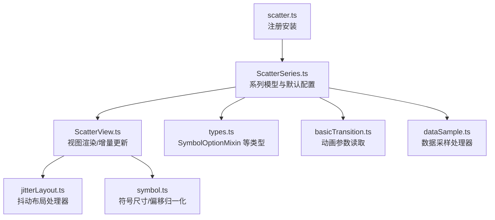
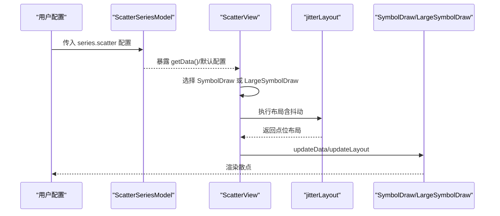
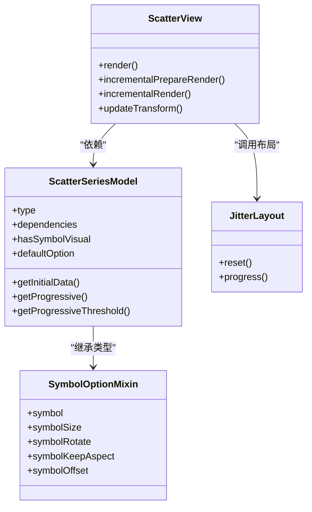

# 散点图系列配置项

<cite>
**本文引用的文件**
- [src/chart/scatter.ts](file://src/chart/scatter.ts)
- [src/chart/scatter/ScatterSeries.ts](file://src/chart/scatter/ScatterSeries.ts)
- [src/chart/scatter/ScatterView.ts](file://src/chart/scatter/ScatterView.ts)
- [src/chart/scatter/jitterLayout.ts](file://src/chart/scatter/jitterLayout.ts)
- [src/util/types.ts](file://src/util/types.ts)
- [src/util/symbol.ts](file://src/util/symbol.ts)
- [src/animation/basicTransition.ts](file://src/animation/basicTransition.ts)
- [src/processor/dataSample.ts](file://src/processor/dataSample.ts)
</cite>

## 目录
1. [简介](#简介)
2. [项目结构](#项目结构)
3. [核心组件](#核心组件)
4. [架构总览](#架构总览)
5. [详细组件分析](#详细组件分析)
6. [依赖关系分析](#依赖关系分析)
7. [性能考量](#性能考量)
8. [故障排查指南](#故障排查指南)
9. [结论](#结论)
10. [附录：配置项速查与示例路径](#附录配置项速查与示例路径)

## 简介
本文件聚焦 ECharts 散点图（scatter）系列的配置项，系统说明 symbol、symbolSize、symbolRotate、symbolKeepAspect、symbolOffset、scaleLimit、large、sampling、animationDuration、animationDurationUpdate、animationEasing、animationEasingUpdate 等属性的作用、数据类型、默认值与配置方法，并结合源码给出实现要点与使用建议。文档同时提供流程图与时序图，帮助读者理解渲染流程、动画与采样机制。

## 项目结构
散点图相关代码主要位于 src/chart/scatter 目录下，包含模型、视图、布局与安装入口；类型定义集中在 src/util/types.ts；符号绘制与归一化逻辑在 src/util/symbol.ts；动画参数读取在 src/animation/basicTransition.ts；数据采样在 src/processor/dataSample.ts。

图表来源
- [src/chart/scatter.ts:20-23](file://src/chart/scatter.ts#L20-L23)
- [src/chart/scatter/ScatterSeries.ts:84-166](file://src/chart/scatter/ScatterSeries.ts#L84-L166)
- [src/chart/scatter/ScatterView.ts:35-136](file://src/chart/scatter/ScatterView.ts#L35-L136)
- [src/chart/scatter/jitterLayout.ts:30-106](file://src/chart/scatter/jitterLayout.ts#L30-L106)
- [src/util/types.ts:1227-1242](file://src/util/types.ts#L1227-L1242)
- [src/util/symbol.ts:390-411](file://src/util/symbol.ts#L390-L411)
- [src/animation/basicTransition.ts:70-101](file://src/animation/basicTransition.ts#L70-L101)
- [src/processor/dataSample.ts:75-82](file://src/processor/dataSample.ts#L75-L82)

章节来源
- [src/chart/scatter.ts:20-23](file://src/chart/scatter.ts#L20-L23)
- [src/chart/scatter/ScatterSeries.ts:84-166](file://src/chart/scatter/ScatterSeries.ts#L84-L166)
- [src/chart/scatter/ScatterView.ts:35-136](file://src/chart/scatter/ScatterView.ts#L35-L136)

## 核心组件
- 系列模型 ScatterSeriesModel：声明系列类型、依赖坐标系、默认配置（如 symbolSize、large、emphasis.scale、clip 等），并处理渐进式渲染阈值。
- 视图 ScatterView：负责选择 SymbolDraw/LargeSymbolDraw、增量渲染、布局更新与裁剪区域设置。
- 抖动布局 jitterLayout：在直角坐标或单轴上对重叠点进行抖动，避免遮挡。
- 类型 SymbolOptionMixin：统一定义 symbol、symbolSize、symbolRotate、symbolKeepAspect、symbolOffset 的类型与回调签名。
- 符号工具 symbol.ts：提供符号尺寸与偏移的归一化逻辑。
- 动画 basicTransition.ts：统一读取 animationDuration/animationEasing 及其 Update 变体。
- 采样 dataSample.ts：为大数据量场景提供采样策略。

章节来源
- [src/chart/scatter/ScatterSeries.ts:84-166](file://src/chart/scatter/ScatterSeries.ts#L84-L166)
- [src/chart/scatter/ScatterView.ts:35-136](file://src/chart/scatter/ScatterView.ts#L35-L136)
- [src/chart/scatter/jitterLayout.ts:30-106](file://src/chart/scatter/jitterLayout.ts#L30-L106)
- [src/util/types.ts:1227-1242](file://src/util/types.ts#L1227-L1242)
- [src/util/symbol.ts:390-411](file://src/util/symbol.ts#L390-L411)
- [src/animation/basicTransition.ts:70-101](file://src/animation/basicTransition.ts#L70-L101)
- [src/processor/dataSample.ts:75-82](file://src/processor/dataSample.ts#L75-L82)

## 架构总览
下图展示从配置到渲染的关键链路：系列模型提供默认配置与能力开关，视图根据数据规模选择绘制器，布局阶段进行位置计算与抖动，最终由 SymbolDraw/LargeSymbolDraw 完成绘制。

图表来源
- [src/chart/scatter/ScatterSeries.ts:92-115](file://src/chart/scatter/ScatterSeries.ts#L92-L115)
- [src/chart/scatter/ScatterView.ts:45-115](file://src/chart/scatter/ScatterView.ts#L45-L115)
- [src/chart/scatter/jitterLayout.ts:36-103](file://src/chart/scatter/jitterLayout.ts#L36-L103)

## 详细组件分析

### 符号相关配置：symbol、symbolSize、symbolRotate、symbolKeepAspect、symbolOffset
- 作用与类型
  - symbol：符号类型或回调，支持内置图形、路径或图片。类型为 string 或回调函数。
  - symbolSize：符号大小，可为数字、数组或回调，支持按维度返回不同尺寸。
  - symbolRotate：符号旋转角度或回调。
  - symbolKeepAspect：是否保持宽高比，布尔值。
  - symbolOffset：符号相对中心点的偏移，支持数值、百分比或数组，内部会归一化为像素偏移。
- 默认值
  - 散点图默认 symbolSize 为 10；其他符号属性未显式设置时遵循通用默认行为。
- 实现要点
  - 类型定义来自 SymbolOptionMixin，确保回调签名一致。
  - 尺寸与偏移通过 symbol.ts 中的归一化函数处理，保证在不同坐标系下表现一致。
- 配置方法
  - 可在系列级别统一设置，也可在数据项级别覆盖。
  - 可通过回调基于数据值动态决定符号样式。

章节来源
- [src/util/types.ts:1227-1242](file://src/util/types.ts#L1227-L1242)
- [src/util/symbol.ts:390-411](file://src/util/symbol.ts#L390-L411)
- [src/chart/scatter/ScatterSeries.ts:127-161](file://src/chart/scatter/ScatterSeries.ts#L127-L161)

### scaleLimit
- 作用：限制缩放范围，防止过度放大或缩小导致视觉异常。
- 适用性：该配置通常用于地图、树图等具备缩放能力的组件；散点图本身不直接使用该字段控制缩放。
- 建议：若需限制散点图的缩放，请结合坐标轴的 scale 或 dataZoom 进行控制。

章节来源
- [src/chart/scatter/ScatterSeries.ts:64-81](file://src/chart/scatter/ScatterSeries.ts#L64-L81)

### large 与 largeThreshold
- 作用：开启“大量数据”优化模式，切换至高性能绘制路径（LargeSymbolDraw）。
- 默认值：large 默认为 false；largeThreshold 默认为 2000。
- 渐进式渲染：当 large 为 true 时，getProgressive/getProgressiveThreshold 会采用更激进的默认值以提升首屏速度。
- 使用建议：数据量较大（例如超过数千条）时建议开启 large，配合 progressive 与 progressiveThreshold 获得更好的交互体验。

章节来源
- [src/chart/scatter/ScatterSeries.ts:99-115](file://src/chart/scatter/ScatterSeries.ts#L99-L115)
- [src/chart/scatter/ScatterSeries.ts:127-161](file://src/chart/scatter/ScatterSeries.ts#L127-L161)

### sampling（数据采样）
- 作用：在数据量极大时，通过采样减少渲染点数，提升性能。
- 实现位置：由数据采样处理器提供，可针对不同类型的数据帧进行聚合或抽取。
- 使用建议：当数据量远超屏幕像素密度且不需要逐点显示时，启用采样可显著降低绘制开销。

章节来源
- [src/processor/dataSample.ts:75-82](file://src/processor/dataSample.ts#L75-L82)

### 动画相关：animationDuration、animationDurationUpdate、animationEasing、animationEasingUpdate
- 作用：控制初始渲染与更新时的动画时长与缓动函数。
- 读取逻辑：框架统一从模型中读取对应字段，update 场景优先使用 Update 后缀的配置。
- 使用建议：
  - 初次渲染可使用 animationDuration/animationEasing。
  - 数据更新时使用 animationDurationUpdate/animationEasingUpdate 以获得更平滑的过渡。
  - 大数据量场景可适当缩短时长或关闭动画以提升响应速度。

章节来源
- [src/animation/basicTransition.ts:70-101](file://src/animation/basicTransition.ts#L70-L101)

### 抖动布局（jitterLayout）
- 作用：在直角坐标或单轴上对重叠点进行随机偏移，避免标记完全遮挡。
- 触发条件：仅当基础轴为分类轴或特定方向时生效，依据数据点尺寸计算偏移幅度。
- 影响范围：修改的是布局阶段的点位坐标，不影响原始数据。

章节来源
- [src/chart/scatter/jitterLayout.ts:36-103](file://src/chart/scatter/jitterLayout.ts#L36-L103)

## 依赖关系分析
- 系列模型依赖坐标系（grid/polar/geo/singleAxis/calendar/matrix），以适配不同坐标系统下的散点绘制。
- 视图依赖 SymbolDraw/LargeSymbolDraw 完成具体绘制，并在需要时应用裁剪区域。
- 类型系统集中管理符号相关选项，确保各系列间一致性。
- 动画与采样作为横切关注点，贯穿渲染管线。

图表来源
- [src/chart/scatter/ScatterSeries.ts:84-166](file://src/chart/scatter/ScatterSeries.ts#L84-L166)
- [src/chart/scatter/ScatterView.ts:35-136](file://src/chart/scatter/ScatterView.ts#L35-L136)
- [src/chart/scatter/jitterLayout.ts:30-106](file://src/chart/scatter/jitterLayout.ts#L30-L106)
- [src/util/types.ts:1227-1242](file://src/util/types.ts#L1227-L1242)

## 性能考量
- 大数据量渲染
  - 启用 large 与合适的 largeThreshold，切换到 LargeSymbolDraw 提升性能。
  - 合理设置 progressive 与 progressiveThreshold，分片渲染提升首屏。
- 采样与抖动
  - 使用采样减少渲染点数；必要时开启抖动改善可读性。
- 动画与交互
  - 大数据量场景建议缩短动画时长或使用更轻量的缓动函数。
  - 频繁更新时可考虑禁用动画或降低更新动画时长。

[本节为通用指导，不直接分析具体文件]

## 故障排查指南
- 符号尺寸异常
  - 检查 symbolSize 是否为有效数字或数组；确认回调返回值类型正确。
  - 参考符号尺寸归一化逻辑，确保在不同坐标系下表现一致。
- 符号偏移错位
  - 检查 symbolOffset 格式与单位；确认已正确归一化为像素偏移。
- 大量数据卡顿
  - 评估是否应开启 large；调整 largeThreshold、progressive、progressiveThreshold。
  - 考虑启用采样以减少渲染压力。
- 动画不生效或卡顿
  - 确认 animationDuration/animationEasing 及 Update 变体是否正确设置。
  - 大数据量场景适当缩短时长或关闭动画。

章节来源
- [src/util/symbol.ts:390-411](file://src/util/symbol.ts#L390-L411)
- [src/chart/scatter/ScatterSeries.ts:99-115](file://src/chart/scatter/ScatterSeries.ts#L99-L115)
- [src/animation/basicTransition.ts:70-101](file://src/animation/basicTransition.ts#L70-L101)

## 结论
散点图的配置围绕“符号可视化”“大规模数据渲染”和“动画体验”三大主题展开。通过 SymbolOptionMixin 统一符号相关配置，借助 large/progressive/sampling 优化大数据量场景，并通过动画参数提升交互反馈。实际使用中，应根据数据规模与业务需求灵活组合这些配置，以获得最佳的性能与视觉效果。

[本节为总结性内容，不直接分析具体文件]

## 附录：配置项速查与示例路径
- symbol
  - 类型：string | 回调
  - 默认：未显式设置时遵循通用默认
  - 示例路径：见类型定义处
  - 章节来源
    - [src/util/types.ts:1227-1242](file://src/util/types.ts#L1227-L1242)
- symbolSize
  - 类型：number | number[] | 回调
  - 默认：10（散点图默认）
  - 示例路径：见系列默认配置
  - 章节来源
    - [src/chart/scatter/ScatterSeries.ts:127-161](file://src/chart/scatter/ScatterSeries.ts#L127-L161)
- symbolRotate
  - 类型：number | 回调
  - 默认：未显式设置
  - 示例路径：见类型定义
  - 章节来源
    - [src/util/types.ts:1227-1242](file://src/util/types.ts#L1227-L1242)
- symbolKeepAspect
  - 类型：boolean
  - 默认：未显式设置
  - 示例路径：见类型定义
  - 章节来源
    - [src/util/types.ts:1227-1242](file://src/util/types.ts#L1227-L1242)
- symbolOffset
  - 类型：string | number | (string|number)[] | 回调
  - 默认：未显式设置
  - 示例路径：见类型定义与归一化逻辑
  - 章节来源
    - [src/util/types.ts:1227-1242](file://src/util/types.ts#L1227-L1242)
    - [src/util/symbol.ts:390-411](file://src/util/symbol.ts#L390-L411)
- scaleLimit
  - 说明：散点图不直接使用此字段；如需限制缩放，请使用坐标轴或 dataZoom
  - 章节来源
    - [src/chart/scatter/ScatterSeries.ts:64-81](file://src/chart/scatter/ScatterSeries.ts#L64-L81)
- large / largeThreshold
  - 类型：boolean / number
  - 默认：false / 2000
  - 示例路径：见系列默认配置与渐进式逻辑
  - 章节来源
    - [src/chart/scatter/ScatterSeries.ts:99-115](file://src/chart/scatter/ScatterSeries.ts#L99-L115)
    - [src/chart/scatter/ScatterSeries.ts:127-161](file://src/chart/scatter/ScatterSeries.ts#L127-L161)
- sampling
  - 说明：通过数据采样处理器在大数据量场景下减少渲染点数
  - 章节来源
    - [src/processor/dataSample.ts:75-82](file://src/processor/dataSample.ts#L75-L82)
- animationDuration / animationEasing
  - 类型：number | 函数 / AnimationEasing
  - 默认：由框架统一读取
  - 示例路径：见动画参数读取逻辑
  - 章节来源
    - [src/animation/basicTransition.ts:70-101](file://src/animation/basicTransition.ts#L70-L101)
- animationDurationUpdate / animationEasingUpdate
  - 类型：同上（更新场景）
  - 默认：由框架统一读取
  - 示例路径：见动画参数读取逻辑
  - 章节来源
    - [src/animation/basicTransition.ts:70-101](file://src/animation/basicTransition.ts#L70-L101)