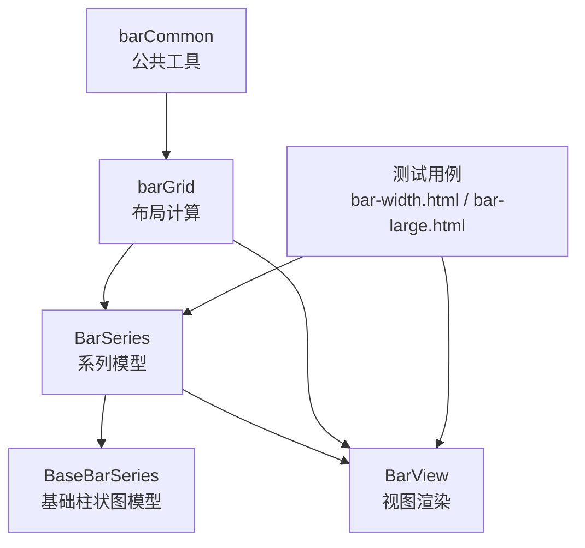
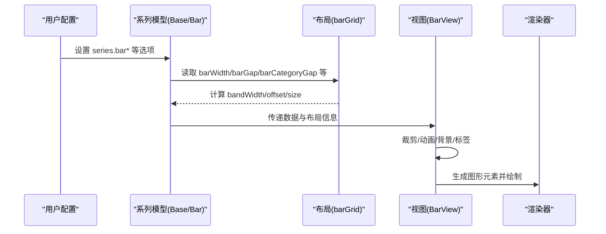
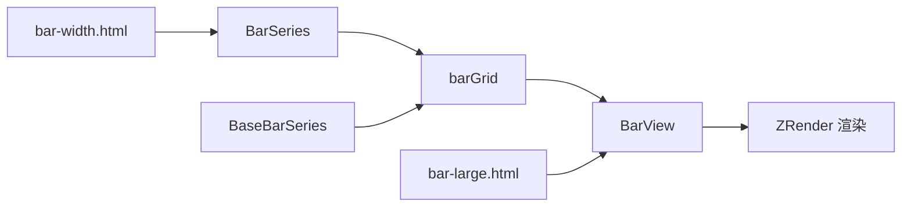

# 柱状图系列配置项

<cite>
**本文引用的文件**
- [src/chart/bar/BaseBarSeries.ts](file://src/chart/bar/BaseBarSeries.ts)
- [src/chart/bar/BarSeries.ts](file://src/chart/bar/BarSeries.ts)
- [src/layout/barGrid.ts](file://src/layout/barGrid.ts)
- [src/layout/barCommon.ts](file://src/layout/barCommon.ts)
- [src/chart/bar/BarView.ts](file://src/chart/bar/BarView.ts)
- [test/bar-width.html](file://test/bar-width.html)
- [test/bar-large.html](file://test/bar-large.html)
</cite>

## 目录
1. [简介](#简介)
2. [项目结构](#项目结构)
3. [核心组件](#核心组件)
4. [架构总览](#架构总览)
5. [详细组件分析](#详细组件分析)
6. [依赖关系分析](#依赖关系分析)
7. [性能考量](#性能考量)
8. [故障排查指南](#故障排查指南)
9. [结论](#结论)
10. [附录：配置项速查表与示例路径](#附录配置项速查表与示例路径)

## 简介
本文件系统性梳理 ECharts 柱状图（bar）系列的专属配置项，覆盖 barWidth、barMaxWidth、barMinWidth、barGap、barCategoryGap、barPercent、barCornerRadius、itemStyle、label、labelLayout、labelLine、markArea、markLine、markPoint、animationDuration、animationDurationUpdate、animationEasing、animationEasingUpdate、large、clipOverflow 等。文档从源码出发，解释每个属性的作用、数据类型、默认值与配置方法，并给出实际应用场景与参考示例路径，帮助读者快速掌握柱状图的精细化控制。

## 项目结构
围绕柱状图的核心代码主要分布在以下位置：
- 系列模型定义与默认选项：BaseBarSeries、BarSeries
- 布局计算与列宽分配：barGrid、barCommon
- 视图渲染与裁剪：BarView
- 测试用例与示例：test 目录下多个 bar*.html

图表来源
- [src/chart/bar/BarSeries.ts:100-178](file://src/chart/bar/BarSeries.ts#L100-L178)
- [src/chart/bar/BaseBarSeries.ts:87-227](file://src/chart/bar/BaseBarSeries.ts#L87-L227)
- [src/layout/barGrid.ts:154-376](file://src/layout/barGrid.ts#L154-L376)
- [src/layout/barCommon.ts:28-62](file://src/layout/barCommon.ts#L28-L62)
- [src/chart/bar/BarView.ts:122-171](file://src/chart/bar/BarView.ts#L122-L171)
- [test/bar-width.html:74-146](file://test/bar-width.html#L74-L146)
- [test/bar-large.html:115-152](file://test/bar-large.html#L115-L152)

章节来源
- [src/chart/bar/BaseBarSeries.ts:87-227](file://src/chart/bar/BaseBarSeries.ts#L87-L227)
- [src/chart/bar/BarSeries.ts:100-178](file://src/chart/bar/BarSeries.ts#L100-L178)
- [src/layout/barGrid.ts:154-376](file://src/layout/barGrid.ts#L154-L376)
- [src/layout/barCommon.ts:28-62](file://src/layout/barCommon.ts#L28-L62)
- [src/chart/bar/BarView.ts:122-171](file://src/chart/bar/BarView.ts#L122-L171)
- [test/bar-width.html:74-146](file://test/bar-width.html#L74-L146)
- [test/bar-large.html:115-152](file://test/bar-large.html#L115-L152)

## 核心组件
- BaseBarSeries：定义柱状图通用系列选项（如 barWidth、barMaxWidth、barMinWidth、barGap、barCategoryGap、large、largeThreshold 等）及默认值。
- BarSeries：在 BaseBarSeries 基础上扩展 cartesian2d/polar 支持、背景样式、圆角端帽、实时排序等特性。
- BarView：负责绘制矩形/扇形/香肠形柱体，处理裁剪、动画、大数模式、背景层、标签与交互。
- barGrid：计算类目轴上的列宽、间距、分组偏移，支撑多系列并列或堆叠布局。
- barCommon：提供系列类型常量与统计需求注册。

章节来源
- [src/chart/bar/BaseBarSeries.ts:41-85](file://src/chart/bar/BaseBarSeries.ts#L41-L85)
- [src/chart/bar/BarSeries.ts:72-98](file://src/chart/bar/BarSeries.ts#L72-L98)
- [src/chart/bar/BarView.ts:98-171](file://src/chart/bar/BarView.ts#L98-L171)
- [src/layout/barGrid.ts:154-376](file://src/layout/barGrid.ts#L154-L376)
- [src/layout/barCommon.ts:28-62](file://src/layout/barCommon.ts#L28-L62)

## 架构总览
柱状图的数据流与渲染流程如下：

图表来源
- [src/chart/bar/BaseBarSeries.ts:200-221](file://src/chart/bar/BaseBarSeries.ts#L200-L221)
- [src/layout/barGrid.ts:154-376](file://src/layout/barGrid.ts#L154-L376)
- [src/chart/bar/BarView.ts:122-171](file://src/chart/bar/BarView.ts#L122-L171)

## 详细组件分析

### 宽度与间距类配置
- barWidth
  - 作用：指定柱子的宽度，可传像素或百分比字符串；未设置时自动计算。
  - 数据类型：number | string
  - 默认值：由布局算法根据类目带宽与系列数量自动决定。
  - 配置方法：series.barWidth = 数值或百分比字符串。
  - 行为说明：当存在 barMaxWidth/barMinWidth 时，最终宽度受其约束；百分比基于类目带宽计算。
  - 参考实现：[src/layout/barGrid.ts:177-191](file://src/layout/barGrid.ts#L177-L191)、[src/layout/barGrid.ts:241-313](file://src/layout/barGrid.ts#L241-L313)

- barMaxWidth
  - 作用：限制柱子最大宽度，避免在大类目或少类目情况下过宽。
  - 数据类型：number | string
  - 默认值：cartesian 坐标系下为 1（单位与 bandWidth 相关），polar 为 null。
  - 配置方法：series.barMaxWidth = 数值或百分比。
  - 行为说明：优先级高于 barWidth；若 barWidth 超过 barMaxWidth，将被截断至最大值。
  - 参考实现：[src/chart/bar/BaseBarSeries.ts:55-59](file://src/chart/bar/BaseBarSeries.ts#L55-L59)、[src/layout/barGrid.ts:249-313](file://src/layout/barGrid.ts#L249-L313)

- barMinWidth
  - 作用：保证柱子最小可见宽度，尤其在 value 轴或缩放场景下保持可读性。
  - 数据类型：number | string
  - 默认值：cartesian 下 large 模式 0.5，非 large 模式 1；polar 为 null。
  - 配置方法：series.barMinWidth = 数值或百分比。
  - 行为说明：优先级最高，即使超出剩余空间也可强制显示；可与 barMaxWidth 组合使用。
  - 参考实现：[src/layout/barGrid.ts:181-185](file://src/layout/barGrid.ts#L181-L185)、[src/layout/barGrid.ts:283-313](file://src/layout/barGrid.ts#L283-L313)

- barGap
  - 作用：同一类目内不同系列之间的间距，支持绝对像素或百分比（相对自身宽度）。
  - 数据类型：string | number
  - 默认值：来自 defaultBarGap（通常为 10%），可通过系列覆盖。
  - 配置方法：series.barGap = 数值或百分比字符串。
  - 行为说明：负值可实现重叠效果；影响自动宽度分配与组内间距。
  - 参考实现：[src/chart/bar/BaseBarSeries.ts:68-76](file://src/chart/bar/BaseBarSeries.ts#L68-L76)、[src/layout/barGrid.ts:223-267](file://src/layout/barGrid.ts#L223-L267)

- barCategoryGap
  - 作用：类目之间的间距，支持绝对像素或百分比（相对类目带宽）。
  - 数据类型：string | number
  - 默认值：动态计算，随系列数量调整，确保视觉密度合理。
  - 配置方法：series.barCategoryGap = 数值或百分比字符串。
  - 行为说明：影响组间留白，配合 barGap 共同决定整体布局。
  - 参考实现：[src/chart/bar/BaseBarSeries.ts:78-81](file://src/chart/bar/BaseBarSeries.ts#L78-L81)、[src/layout/barGrid.ts:259-266](file://src/layout/barGrid.ts#L259-L266)

- barPercent
  - 说明：在源码中未发现名为 barPercent 的系列配置项；常见的是通过 barWidth 传入百分比字符串（如 "98%"）来控制宽度占比。
  - 建议：如需按类目带宽百分比控制宽度，请使用 barWidth 的百分比形式。
  - 参考实现：[src/layout/barGrid.ts:177-191](file://src/layout/barGrid.ts#L177-L191)

- barCornerRadius
  - 说明：在源码中未发现名为 barCornerRadius 的系列配置项；柱体圆角通常通过 itemStyle.borderRadius 或背景样式 backgroundStyle.borderRadius 控制。
  - 建议：使用 itemStyle.borderRadius 或 backgroundStyle.borderRadius 设置圆角。
  - 参考实现：[src/chart/bar/BarSeries.ts:62-65](file://src/chart/bar/BarSeries.ts#L62-L65)、[src/chart/bar/BarSeries.ts:152-163](file://src/chart/bar/BarSeries.ts#L152-L163)

章节来源
- [src/chart/bar/BaseBarSeries.ts:41-85](file://src/chart/bar/BaseBarSeries.ts#L41-L85)
- [src/layout/barGrid.ts:177-313](file://src/layout/barGrid.ts#L177-L313)
- [src/chart/bar/BarSeries.ts:62-65](file://src/chart/bar/BarSeries.ts#L62-L65)
- [src/chart/bar/BarSeries.ts:152-163](file://src/chart/bar/BarSeries.ts#L152-L163)

### 外观与标注类配置
- itemStyle
  - 作用：柱体的填充色、边框、阴影等样式；支持状态（normal/emphasis/select）与数据级覆盖。
  - 数据类型：ItemStyleOption（含 color、borderColor、borderWidth、shadow*、opacity 等）
  - 默认值：继承全局主题与 tokens。
  - 配置方法：series.itemStyle = {...}，或在 data 项中单独设置。
  - 行为说明：在 polar 坐标系下，itemStyle.borderRadius 可用于扇区圆角。
  - 参考实现：[src/chart/bar/BarSeries.ts:62-65](file://src/chart/bar/BarSeries.ts#L62-L65)、[src/chart/bar/BarView.ts:287-290](file://src/chart/bar/BarView.ts#L287-L290)

- label
  - 作用：柱体数据标签的显示、位置、格式化、富文本等。
  - 数据类型：SeriesLabelOption（含 show、position、formatter、rich、rotate 等）
  - 默认值：隐藏。
  - 配置方法：series.label = {...}，支持回调函数与数据级覆盖。
  - 行为说明：在 polar 坐标系下支持额外位置（如 start/end/insideStart/insideEnd）。
  - 参考实现：[src/chart/bar/BarSeries.ts:48-51](file://src/chart/bar/BarSeries.ts#L48-L51)、[src/chart/bar/BarView.ts:287-290](file://src/chart/bar/BarView.ts#L287-L290)

- labelLayout
  - 作用：标签布局策略，用于解决标签重叠、溢出等问题。
  - 数据类型：LabelLayoutOption（具体字段见 label 模块）
  - 默认值：无特殊策略时采用默认布局。
  - 配置方法：series.labelLayout = {...}
  - 行为说明：与 label.position、label.rotate 等配合工作。
  - 参考实现：[src/label/labelLayoutHelper.ts](file://src/label/labelLayoutHelper.ts)

- labelLine
  - 作用：连接标签与柱体的引导线样式（适用于标签在外部的情况）。
  - 数据类型：LabelLineOption（含 show、lineStyle、smooth 等）
  - 默认值：隐藏。
  - 配置方法：series.labelLine = {...}
  - 行为说明：常用于标签外置且需要明确指向的场景。
  - 参考实现：[src/label/labelStyle.ts](file://src/label/labelStyle.ts)

章节来源
- [src/chart/bar/BarSeries.ts:48-65](file://src/chart/bar/BarSeries.ts#L48-L65)
- [src/chart/bar/BarView.ts:287-290](file://src/chart/bar/BarView.ts#L287-L290)
- [src/label/labelLayoutHelper.ts](file://src/label/labelLayoutHelper.ts)
- [src/label/labelStyle.ts](file://src/label/labelStyle.ts)

### 标记类配置
- markArea、markLine、markPoint
  - 作用：在柱状图上添加区域标记、折线标记、点标记，用于强调阈值、目标值、异常区间等。
  - 数据类型：MarkAreaOption、MarkLineOption、MarkPointOption
  - 默认值：不显示。
  - 配置方法：series.markArea/markLine/markPoint = {...}
  - 行为说明：坐标映射与可视化遵循 ECharts 标记体系；可与数据缩放联动。
  - 参考实现：[src/component/marker/MarkAreaView.ts](file://src/component/marker/MarkAreaView.ts)、[src/component/marker/MarkLine.ts](file://src/component/marker/MarkLine.ts)、[src/component/marker/MarkPoint.ts](file://src/component/marker/MarkPoint.ts)

章节来源
- [src/component/marker/MarkAreaView.ts](file://src/component/marker/MarkAreaView.ts)
- [src/component/marker/MarkLine.ts](file://src/component/marker/MarkLine.ts)
- [src/component/marker/MarkPoint.ts](file://src/component/marker/MarkPoint.ts)

### 动画与过渡
- animationDuration
  - 作用：初始渲染动画时长。
  - 数据类型：number
  - 默认值：由全局动画配置决定。
  - 配置方法：series.animationDuration = 数值
  - 行为说明：与 animationEasing 配合控制入场动效。

- animationDurationUpdate
  - 作用：数据更新时的动画时长。
  - 数据类型：number
  - 默认值：由全局动画配置决定。
  - 配置方法：series.animationDurationUpdate = 数值
  - 行为说明：在数据变化、顺序调整时生效。

- animationEasing
  - 作用：初始渲染动画缓动函数。
  - 数据类型：string（如 'linear'、'cubicIn' 等）
  - 默认值：由全局动画配置决定。
  - 配置方法：series.animationEasing = 字符串

- animationEasingUpdate
  - 作用：数据更新时的动画缓动函数。
  - 数据类型：string
  - 默认值：由全局动画配置决定。
  - 配置方法：series.animationEasingUpdate = 字符串

章节来源
- [src/chart/bar/BarView.ts:194-210](file://src/chart/bar/BarView.ts#L194-L210)
- [test/bar-large.html:146-152](file://test/bar-large.html#L146-L152)

### 大数据与裁剪
- large
  - 作用：开启大数据模式，启用增量渲染与优化路径。
  - 数据类型：boolean
  - 默认值：false
  - 配置方法：series.large = true
  - 行为说明：配合 largeThreshold 控制触发阈值；在 large 模式下 clip 使用 clipPath 进行裁剪。
  - 参考实现：[src/chart/bar/BaseBarSeries.ts:83-85](file://src/chart/bar/BaseBarSeries.ts#L83-L85)、[src/chart/bar/BarSeries.ts:118-137](file://src/chart/bar/BarSeries.ts#L118-L137)、[src/chart/bar/BarView.ts:454-476](file://src/chart/bar/BarView.ts#L454-L476)

- clipOverflow（未在源码中发现同名配置）
  - 说明：源码中未见 clipOverflow 这一系列配置项；柱状图裁剪主要通过 clip 属性控制。
  - 建议：如需裁剪溢出内容，使用 series.clip = true/false。
  - 参考实现：[src/chart/bar/BarSeries.ts:81-87](file://src/chart/bar/BarSeries.ts#L81-L87)、[src/chart/bar/BarView.ts:202-210](file://src/chart/bar/BarView.ts#L202-L210)

章节来源
- [src/chart/bar/BaseBarSeries.ts:83-85](file://src/chart/bar/BaseBarSeries.ts#L83-L85)
- [src/chart/bar/BarSeries.ts:81-87](file://src/chart/bar/BarSeries.ts#L81-L87)
- [src/chart/bar/BarView.ts:202-210](file://src/chart/bar/BarView.ts#L202-L210)
- [src/chart/bar/BarView.ts:454-476](file://src/chart/bar/BarView.ts#L454-L476)

## 依赖关系分析
- 系列模型依赖布局计算：BarSeries/BaseBarSeries 通过 barGrid 获取 bandWidth、offset、size 等布局信息。
- 视图依赖系列模型：BarView 读取 seriesModel 的配置与数据，执行绘制与动画。
- 布局依赖坐标系统：barGrid 基于 Cartesian2D/Polar 的基轴与度量信息进行列宽与间距计算。
- 测试用例驱动验证：bar-width.html 与 bar-large.html 演示了 barMinWidth/barMaxWidth/large 等配置的实际效果。

图表来源
- [src/chart/bar/BarSeries.ts:100-178](file://src/chart/bar/BarSeries.ts#L100-L178)
- [src/chart/bar/BaseBarSeries.ts:87-227](file://src/chart/bar/BaseBarSeries.ts#L87-L227)
- [src/layout/barGrid.ts:154-376](file://src/layout/barGrid.ts#L154-L376)
- [src/chart/bar/BarView.ts:122-171](file://src/chart/bar/BarView.ts#L122-L171)
- [test/bar-width.html:74-146](file://test/bar-width.html#L74-L146)
- [test/bar-large.html:115-152](file://test/bar-large.html#L115-L152)

章节来源
- [src/chart/bar/BarSeries.ts:100-178](file://src/chart/bar/BarSeries.ts#L100-L178)
- [src/chart/bar/BaseBarSeries.ts:87-227](file://src/chart/bar/BaseBarSeries.ts#L87-L227)
- [src/layout/barGrid.ts:154-376](file://src/layout/barGrid.ts#L154-L376)
- [src/chart/bar/BarView.ts:122-171](file://src/chart/bar/BarView.ts#L122-L171)
- [test/bar-width.html:74-146](file://test/bar-width.html#L74-L146)
- [test/bar-large.html:115-152](file://test/bar-large.html#L115-L152)

## 性能考量
- 大数据模式（large）：在数据量大时启用 incremental 渲染与 clipPath 裁剪，减少重绘开销。
- 合理设置 barMinWidth/barMaxWidth：避免过小导致不可见或过大导致遮挡与性能下降。
- 标签与标记：过多 label/mark 会增加绘制成本，建议在必要时开启 labelLayout 与合适的动画时长。
- 背景层（showBackground）：开启背景会在每个数据项创建图形元素，注意数据规模。

章节来源
- [src/chart/bar/BarSeries.ts:118-137](file://src/chart/bar/BarSeries.ts#L118-L137)
- [src/chart/bar/BarView.ts:454-476](file://src/chart/bar/BarView.ts#L454-L476)
- [src/layout/barGrid.ts:177-313](file://src/layout/barGrid.ts#L177-L313)

## 故障排查指南
- 柱体过窄或不可见
  - 检查是否设置了 barMinWidth；在 value 轴或缩放场景下，过小可能导致不可见。
  - 参考示例：[test/bar-width.html:112-146](file://test/bar-width.html#L112-L146)

- 多系列间距异常
  - 检查 barGap 是否为负值或百分比不当；确认 defaultBarGap 与 barGap 的优先级。
  - 参考实现：[src/layout/barGrid.ts:223-267](file://src/layout/barGrid.ts#L223-L267)

- 大数模式裁剪问题
  - 确认 series.clip 与 large 模式下的 clipPath 设置；必要时关闭 clip 以观察完整形状。
  - 参考实现：[src/chart/bar/BarView.ts:202-210](file://src/chart/bar/BarView.ts#L202-L210)、[src/chart/bar/BarView.ts:454-476](file://src/chart/bar/BarView.ts#L454-L476)

- 动画卡顿
  - 降低 animationDuration/animationDurationUpdate；在大量数据时考虑关闭复杂动画。
  - 参考示例：[test/bar-large.html:146-152](file://test/bar-large.html#L146-L152)

章节来源
- [test/bar-width.html:112-146](file://test/bar-width.html#L112-L146)
- [src/layout/barGrid.ts:223-267](file://src/layout/barGrid.ts#L223-L267)
- [src/chart/bar/BarView.ts:202-210](file://src/chart/bar/BarView.ts#L202-L210)
- [src/chart/bar/BarView.ts:454-476](file://src/chart/bar/BarView.ts#L454-L476)
- [test/bar-large.html:146-152](file://test/bar-large.html#L146-L152)

## 结论
柱状图的系列配置围绕“宽度与间距”“外观与标注”“标记”“动画与大数据”四大维度展开。通过 barWidth/barMaxWidth/barMinWidth/barGap/barCategoryGap 精确控制布局；借助 itemStyle/label/labelLayout/labelLine/markArea/markLine/markPoint 丰富表达；利用 animation*/large 提升交互体验与性能；结合 clip 控制溢出裁剪。建议在实际项目中优先通过布局参数保证可读性，再按需叠加样式与标记，并在大数据场景下启用 large 模式与合理的动画策略。

## 附录：配置项速查表与示例路径

- barWidth
  - 作用：柱宽（像素或百分比）
  - 类型：number | string
  - 默认：自动计算
  - 示例路径：[test/bar-width.html:137-146](file://test/bar-width.html#L137-L146)

- barMaxWidth
  - 作用：最大柱宽
  - 类型：number | string
  - 默认：cartesian 下为 1（bandWidth 相关）
  - 示例路径：[test/bar-width.html:120-136](file://test/bar-width.html#L120-L136)

- barMinWidth
  - 作用：最小柱宽
  - 类型：number | string
  - 默认：cartesian 下 large=0.5，非 large=1
  - 示例路径：[test/bar-width.html:112-128](file://test/bar-width.html#L112-L128)

- barGap
  - 作用：同类目内系列间距
  - 类型：string | number
  - 默认：defaultBarGap（约 10%）
  - 示例路径：[test/bar-width.html:297-298](file://test/bar-width.html#L297-L298)

- barCategoryGap
  - 作用：类目间间距
  - 类型：string | number
  - 默认：动态计算
  - 示例路径：[test/universalTransition.html:610-611](file://test/universalTransition.html#L610-L611)

- barPercent
  - 说明：源码未提供该配置；建议使用 barWidth 的百分比形式
  - 示例路径：[test/bar-width.html:229-236](file://test/bar-width.html#L229-L236)

- barCornerRadius
  - 说明：源码未提供该配置；建议使用 itemStyle.borderRadius 或 backgroundStyle.borderRadius
  - 示例路径：[src/chart/bar/BarSeries.ts:152-163](file://src/chart/bar/BarSeries.ts#L152-L163)

- itemStyle
  - 作用：柱体样式（颜色、边框、阴影等）
  - 类型：ItemStyleOption
  - 示例路径：[test/bar.html:70-90](file://test/bar.html#L70-L90)

- label
  - 作用：数据标签（显示、位置、格式化）
  - 类型：SeriesLabelOption
  - 示例路径：[test/bar.html:73-76](file://test/bar.html#L73-L76)

- labelLayout
  - 作用：标签布局策略
  - 类型：LabelLayoutOption
  - 参考实现：[src/label/labelLayoutHelper.ts](file://src/label/labelLayoutHelper.ts)

- labelLine
  - 作用：标签引导线
  - 类型：LabelLineOption
  - 参考实现：[src/label/labelStyle.ts](file://src/label/labelStyle.ts)

- markArea/markLine/markPoint
  - 作用：区域/折线/点标记
  - 类型：MarkAreaOption/MarkLineOption/MarkPointOption
  - 参考实现：[src/component/marker/MarkAreaView.ts](file://src/component/marker/MarkAreaView.ts)、[src/component/marker/MarkLine.ts](file://src/component/marker/MarkLine.ts)、[src/component/marker/MarkPoint.ts](file://src/component/marker/MarkPoint.ts)

- animationDuration/animationDurationUpdate/animationEasing/animationEasingUpdate
  - 作用：动画时长与缓动（初始与更新）
  - 类型：number | string
  - 示例路径：[test/bar-large.html:146-152](file://test/bar-large.html#L146-L152)

- large
  - 作用：大数据模式开关
  - 类型：boolean
  - 示例路径：[test/bar-large.html:115-145](file://test/bar-large.html#L115-L145)

- clipOverflow
  - 说明：源码未提供该配置；建议使用 series.clip
  - 示例路径：[src/chart/bar/BarSeries.ts:81-87](file://src/chart/bar/BarSeries.ts#L81-L87)