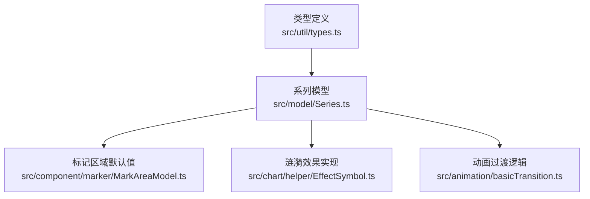
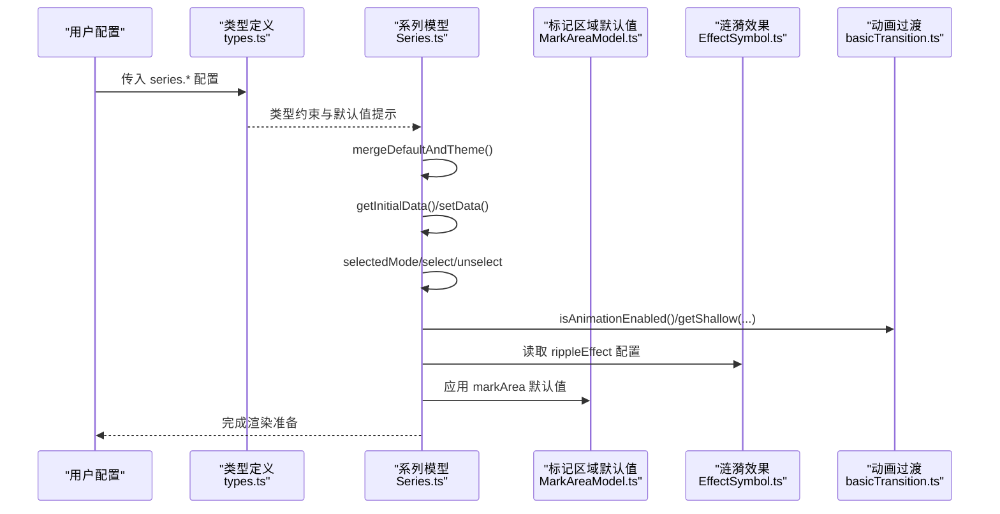
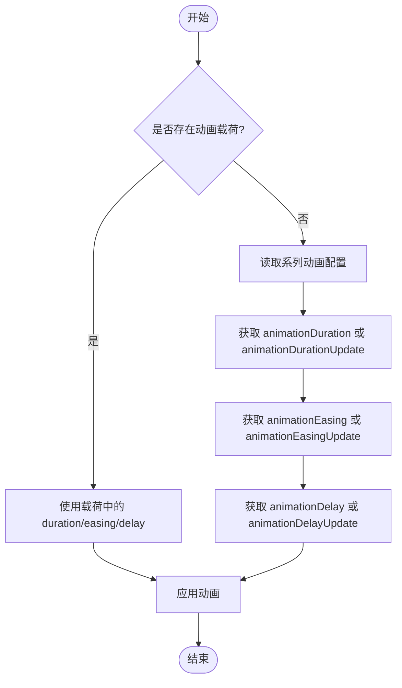
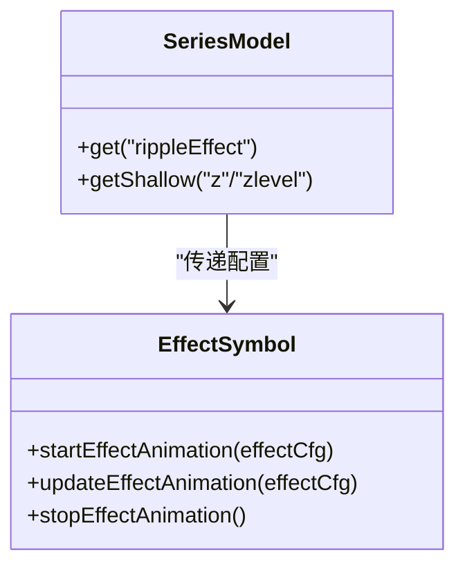
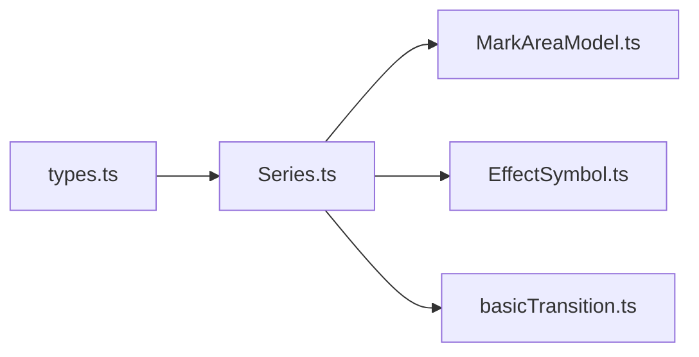

# 系列配置项

<cite>
**本文引用的文件**
- [src/model/Series.ts](file://src/model/Series.ts)
- [src/util/types.ts](file://src/util/types.ts)
- [src/component/marker/MarkAreaModel.ts](file://src/component/marker/MarkAreaModel.ts)
- [src/chart/helper/EffectSymbol.ts](file://src/chart/helper/EffectSymbol.ts)
- [src/preprocessor/backwardCompat.ts](file://src/preprocessor/backwardCompat.ts)
- [src/animation/basicTransition.ts](file://src/animation/basicTransition.ts)
</cite>

## 目录
1. [简介](#简介)
2. [项目结构](#项目结构)
3. [核心组件](#核心组件)
4. [架构总览](#架构总览)
5. [详细组件分析](#详细组件分析)
6. [依赖分析](#依赖分析)
7. [性能考虑](#性能考虑)
8. [故障排查指南](#故障排查指南)
9. [结论](#结论)
10. [附录](#附录)

## 简介
本章节提供 ECharts 系列（series）通用配置项的完整参考，覆盖所有图表类型共用的系列属性，包括 type、data、id、name、legendHoverLink、legendIgnore、tooltip、markArea、markLine、markPoint、zlevel、z、z2、rippleEffect、hoverAnimation、label、itemStyle、emphasis、select、selectable、selectedMode、disableTooltip、inertia、orientAnimation、animationDuration、animationDurationUpdate、animationEasing、animationEasingUpdate、animationDelay、animationDelayUpdate、progressive、progressiveThreshold、count 等。文档将逐一说明各属性的作用、数据类型、默认值与配置方法，并给出实际应用场景与示例路径指引。

## 项目结构
ECharts 系列配置由“类型定义 + 模型实现 + 组件默认值”三部分构成：
- 类型定义：在 types.ts 中集中声明 SeriesOption、动画选项、Tooltip 选项、选择模式等。
- 模型实现：SeriesModel 负责合并主题与默认配置、数据初始化、选择状态、渐进渲染、动画开关等。
- 组件默认值：如 markArea 的默认 z、tooltip、label、itemStyle 等。

**图示来源**
- [src/util/types.ts:1976-2052](file://src/util/types.ts#L1976-L2052)
- [src/model/Series.ts:225-328](file://src/model/Series.ts#L225-L328)
- [src/component/marker/MarkAreaModel.ts:80-108](file://src/component/marker/MarkAreaModel.ts#L80-L108)
- [src/chart/helper/EffectSymbol.ts:193-217](file://src/chart/helper/EffectSymbol.ts#L193-L217)
- [src/animation/basicTransition.ts:70-101](file://src/animation/basicTransition.ts#L70-L101)

**章节来源**
- [src/util/types.ts:1976-2052](file://src/util/types.ts#L1976-L2052)
- [src/model/Series.ts:225-328](file://src/model/Series.ts#L225-L328)

## 核心组件
- 系列模型（SeriesModel）：负责合并主题与默认配置、数据生命周期管理、选择状态、渐进渲染、动画开关等。
- 类型系统（types.ts）：定义 SeriesOption、动画选项、Tooltip、选择模式等通用类型。
- 标记区域默认值（MarkAreaModel）：为 markArea 提供默认 z、tooltip、label、itemStyle 等。
- 涟漪效果（EffectSymbol）：实现 rippleEffect 的可视化与动画控制。
- 动画过渡（basicTransition）：统一处理 animationDuration、animationEasing、animationDelay 及其 Update 版本。

**章节来源**
- [src/model/Series.ts:225-328](file://src/model/Series.ts#L225-L328)
- [src/util/types.ts:1976-2052](file://src/util/types.ts#L1976-L2052)
- [src/component/marker/MarkAreaModel.ts:80-108](file://src/component/marker/MarkAreaModel.ts#L80-L108)
- [src/chart/helper/EffectSymbol.ts:193-217](file://src/chart/helper/EffectSymbol.ts#L193-L217)
- [src/animation/basicTransition.ts:70-101](file://src/animation/basicTransition.ts#L70-L101)

## 架构总览
下图展示系列配置从用户输入到渲染的关键流程：类型定义驱动模型合并与校验，模型根据配置初始化数据、计算选择状态、启用或禁用动画与渐进渲染，最终交由视图层渲染。

**图示来源**
- [src/util/types.ts:1976-2052](file://src/util/types.ts#L1976-L2052)
- [src/model/Series.ts:225-328](file://src/model/Series.ts#L225-L328)
- [src/component/marker/MarkAreaModel.ts:80-108](file://src/component/marker/MarkAreaModel.ts#L80-L108)
- [src/chart/helper/EffectSymbol.ts:193-217](file://src/chart/helper/EffectSymbol.ts#L193-L217)
- [src/animation/basicTransition.ts:70-101](file://src/animation/basicTransition.ts#L70-L101)

## 详细组件分析

### 通用系列属性总览
以下属性适用于所有图表类型的 series 配置。每个属性均包含作用、数据类型、默认值与配置方法说明，并提供示例路径引用。

- type
  - 作用：指定系列类型（如 line、bar、pie 等）。
  - 数据类型：string。
  - 默认值：无（必须显式设置）。
  - 配置方法：在 series 对象中设置 type 字段。
  - 示例路径：[示例集合](file://test/data/basicChartsOptions.js)

- data
  - 作用：系列的数据源，支持多种格式（数组、对象数组、二维数组等）。
  - 数据类型：Array | Object | Array<Array>。
  - 默认值：无。
  - 配置方法：在 series 对象中设置 data 字段。
  - 示例路径：[示例集合](file://test/data/basicChartsOptions.js)

- id
  - 作用：系列唯一标识，用于联动与查询。
  - 数据类型：string | number。
  - 默认值：自动生成。
  - 配置方法：在 series 对象中设置 id 字段。
  - 示例路径：[示例集合](file://test/data/basicChartsOptions.js)

- name
  - 作用：系列名称，用于图例显示与 tooltip 内容。
  - 数据类型：string。
  - 默认值：可自动推导（当未显式设置时）。
  - 配置方法：在 series 对象中设置 name 字段。
  - 示例路径：[示例集合](file://test/data/basicChartsOptions.js)

- legendHoverLink
  - 作用：是否开启图例与系列的联动高亮。
  - 数据类型：boolean。
  - 默认值：true。
  - 配置方法：在 series 对象中设置 legendHoverLink 字段。
  - 示例路径：[示例集合](file://test/data/basicChartsOptions.js)

- legendIgnore
  - 作用：是否在图例中忽略该系列。
  - 数据类型：boolean。
  - 默认值：false。
  - 配置方法：在 series 对象中设置 legendIgnore 字段。
  - 示例路径：[示例集合](file://test/data/basicChartsOptions.js)

- tooltip
  - 作用：配置系列级别的 tooltip 行为与样式。
  - 数据类型：SeriesTooltipOption（继承 CommonTooltipOption）。
  - 默认值：使用全局 tooltip 配置。
  - 配置方法：在 series 对象中设置 tooltip 字段。
  - 示例路径：[示例集合](file://test/data/basicChartsOptions.js)

- markArea / markLine / markPoint
  - 作用：在系列上绘制标记区域、标记线、标记点，用于标注关键信息。
  - 数据类型：对应组件的 Option 类型。
  - 默认值：markArea 默认 z=1、tooltip.trigger='item'、label.show=true、itemStyle.borderWidth=0。
  - 配置方法：在 series 对象中分别设置 markArea/markLine/markPoint 字段。
  - 示例路径：[示例集合](file://test/data/basicChartsOptions.js)

- zlevel / z / z2
  - 作用：控制图层堆叠顺序。zlevel 为图层级别，z 为同图层内顺序，z2 为元素级顺序。
  - 数据类型：number。
  - 默认值：zlevel=0，z=0，z2 由具体元素决定。
  - 配置方法：在 series 或 itemStyle/emphasis 中设置。
  - 示例路径：[示例集合](file://test/data/basicChartsOptions.js)

- rippleEffect
  - 作用：为散点等图形添加涟漪动画效果。
  - 数据类型：对象（含 scale、brushType、period、color、number 等）。
  - 默认值：关闭（需显式启用）。
  - 配置方法：在 series 或 itemStyle 中设置 rippleEffect 字段。
  - 示例路径：[示例集合](file://test/data/basicChartsOptions.js)

- hoverAnimation
  - 作用：鼠标悬停时的缩放动画（已废弃，建议使用 emphasis.scale）。
  - 数据类型：boolean | string。
  - 默认值：false。
  - 配置方法：在 series 中设置 hoverAnimation（兼容旧版），推荐改用 emphasis.scale。
  - 示例路径：[向后兼容替换:244-250](file://src/preprocessor/backwardCompat.ts#L244-L250)

- label
  - 作用：系列数据标签的显示与格式化。
  - 数据类型：LabelOption（含 show、formatter、position 等）。
  - 默认值：show=false（部分类型可能不同）。
  - 配置方法：在 series 或 itemStyle 中设置 label 字段。
  - 示例路径：[示例集合](file://test/data/basicChartsOptions.js)

- itemStyle
  - 作用：系列数据项的样式（颜色、边框、阴影等）。
  - 数据类型：对象（支持 normal/emphasis/select 等状态）。
  - 默认值：使用主题色。
  - 配置方法：在 series 或 data 项中设置 itemStyle 字段。
  - 示例路径：[示例集合](file://test/data/basicChartsOptions.js)

- emphasis
  - 作用：高亮状态的样式与行为（如放大、变色）。
  - 数据类型：对象（可与 itemStyle 嵌套）。
  - 默认值：继承 itemStyle。
  - 配置方法：在 series 或 itemStyle 中设置 emphasis 字段。
  - 示例路径：[示例集合](file://test/data/basicChartsOptions.js)

- select / selectable / selectedMode
  - 作用：控制数据项的选择行为与模式（single/multiple/series）。
  - 数据类型：boolean | 'single' | 'multiple' | 'series'。
  - 默认值：false（不启用选择）。
  - 配置方法：在 series 中设置 select/selectable/selectedMode 字段。
  - 示例路径：[示例集合](file://test/data/basicChartsOptions.js)

- disableTooltip
  - 作用：禁用该系列的 tooltip。
  - 数据类型：boolean。
  - 默认值：false。
  - 配置方法：在 series 或 data 项中设置 disableTooltip 字段。
  - 示例路径：[示例集合](file://test/data/basicChartsOptions.js)

- inertia
  - 作用：交互惯性（如拖拽后的惯性滑动）。
  - 数据类型：boolean | number。
  - 默认值：视交互组件而定。
  - 配置方法：在相关交互组件或 series 中设置。
  - 示例路径：[示例集合](file://test/data/basicChartsOptions.js)

- orientAnimation
  - 作用：方向性动画（如柱状图的进出场动画方向）。
  - 数据类型：'vertical' | 'horizontal' | boolean。
  - 默认值：视图表类型而定。
  - 配置方法：在 series 中设置 orientAnimation 字段。
  - 示例路径：[示例集合](file://test/data/basicChartsOptions.js)

- animation / animationDuration / animationEasing / animationDelay
  - 作用：初始动画的开关、时长、缓动函数与延迟。
  - 数据类型：boolean | number | string。
  - 默认值：animation=true，duration/easing/delay 使用全局或系列默认。
  - 配置方法：在 series 中设置相应字段。
  - 示例路径：[示例集合](file://test/data/basicChartsOptions.js)

- animationDurationUpdate / animationEasingUpdate / animationDelayUpdate
  - 作用：更新动画的时长、缓动函数与延迟。
  - 数据类型：number | string。
  - 默认值：使用全局或系列默认。
  - 配置方法：在 series 中设置相应字段。
  - 示例路径：[示例集合](file://test/data/basicChartsOptions.js)

- progressive / progressiveThreshold / count
  - 作用：渐进渲染的分片数量、阈值与计数控制。
  - 数据类型：number | false。
  - 默认值：关闭（需显式启用）。
  - 配置方法：在 series 中设置 progressive/progressiveThreshold/count 字段。
  - 示例路径：[示例集合](file://test/data/basicChartsOptions.js)

**章节来源**
- [src/util/types.ts:1976-2052](file://src/util/types.ts#L1976-L2052)
- [src/component/marker/MarkAreaModel.ts:80-108](file://src/component/marker/MarkAreaModel.ts#L80-L108)
- [src/chart/helper/EffectSymbol.ts:193-217](file://src/chart/helper/EffectSymbol.ts#L193-L217)
- [src/preprocessor/backwardCompat.ts:244-250](file://src/preprocessor/backwardCompat.ts#L244-L250)
- [src/animation/basicTransition.ts:70-101](file://src/animation/basicTransition.ts#L70-L101)

### 动画与过渡机制
ECharts 通过统一的动画过渡模块处理进入与更新动画，优先使用 payload 中的动画参数，其次回退到系列配置的 animationDuration、animationEasing、animationDelay 及其 Update 版本。

**图示来源**
- [src/animation/basicTransition.ts:70-101](file://src/animation/basicTransition.ts#L70-L101)

**章节来源**
- [src/animation/basicTransition.ts:70-101](file://src/animation/basicTransition.ts#L70-L101)

### 涟漪效果（rippleEffect）
涟漪效果通过 EffectSymbol 实现，读取 series/itemStyle 中的 rippleEffect 配置，包括 scale、brushType、period、color、number 等，并在 render 或 emphasis 时触发动画。

**图示来源**
- [src/chart/helper/EffectSymbol.ts:193-217](file://src/chart/helper/EffectSymbol.ts#L193-L217)
- [src/model/Series.ts:569-577](file://src/model/Series.ts#L569-L577)

**章节来源**
- [src/chart/helper/EffectSymbol.ts:193-217](file://src/chart/helper/EffectSymbol.ts#L193-L217)
- [src/model/Series.ts:569-577](file://src/model/Series.ts#L569-L577)

### 标记区域默认值（markArea）
markArea 的默认值包括 z=1、tooltip.trigger='item'、label.show=true、itemStyle.borderWidth=0 等，确保在多数场景下具备合理的视觉表现。

**章节来源**
- [src/component/marker/MarkAreaModel.ts:80-108](file://src/component/marker/MarkAreaModel.ts#L80-L108)

### 选择模式（selectedMode）
selectedMode 支持 single、multiple、series 三种模式，配合 select/selectable 控制数据项的选择行为。SeriesModel 内部维护 selectedMap 与 _selectedDataIndicesMap 以跟踪选择状态。

**章节来源**
- [src/model/Series.ts:601-719](file://src/model/Series.ts#L601-L719)

## 依赖分析
系列配置依赖以下核心模块：
- 类型系统（types.ts）：提供 SeriesOption、动画选项、Tooltip、选择模式等类型定义。
- 系列模型（Series.ts）：实现配置合并、数据初始化、选择状态、渐进渲染、动画开关。
- 标记区域默认值（MarkAreaModel.ts）：提供 markArea 的默认配置。
- 涟漪效果（EffectSymbol.ts）：实现 rippleEffect 的可视化与动画。
- 动画过渡（basicTransition.ts）：统一处理动画参数优先级与执行。

**图示来源**
- [src/util/types.ts:1976-2052](file://src/util/types.ts#L1976-L2052)
- [src/model/Series.ts:225-328](file://src/model/Series.ts#L225-L328)
- [src/component/marker/MarkAreaModel.ts:80-108](file://src/component/marker/MarkAreaModel.ts#L80-L108)
- [src/chart/helper/EffectSymbol.ts:193-217](file://src/chart/helper/EffectSymbol.ts#L193-L217)
- [src/animation/basicTransition.ts:70-101](file://src/animation/basicTransition.ts#L70-L101)

**章节来源**
- [src/util/types.ts:1976-2052](file://src/util/types.ts#L1976-L2052)
- [src/model/Series.ts:225-328](file://src/model/Series.ts#L225-L328)

## 性能考虑
- 动画开关：isAnimationEnabled 会根据环境（如 Node 环境）与数据量（animationThreshold）决定是否启用动画，避免大数据集的性能问题。
- 渐进渲染：通过 progressive/progressiveThreshold/count 分片渲染，提升大数据集的渲染性能。
- 涟漪效果：rippleEffect 的 period、number 等参数会影响动画开销，建议根据数据规模合理配置。
- 选择模式：selectedMode 为 'series' 时会选中全部数据，注意与大数据集的性能权衡。

**章节来源**
- [src/model/Series.ts:548-562](file://src/model/Series.ts#L548-L562)
- [src/model/Series.ts:587-599](file://src/model/Series.ts#L587-L599)
- [src/chart/helper/EffectSymbol.ts:193-217](file://src/chart/helper/EffectSymbol.ts#L193-L217)

## 故障排查指南
- hoverAnimation 已废弃：若发现 hoverAnimation 不生效，请改用 emphasis.scale。
  - 参考路径：[向后兼容替换:244-250](file://src/preprocessor/backwardCompat.ts#L244-L250)
- 动画未生效：检查 isAnimationEnabled 返回值与 animationThreshold 设置。
  - 参考路径：[动画开关逻辑:548-562](file://src/model/Series.ts#L548-L562)
- 选择状态异常：确认 selectedMode 与 select/selectable 的配置是否正确。
  - 参考路径：[选择状态管理:601-719](file://src/model/Series.ts#L601-L719)

**章节来源**
- [src/preprocessor/backwardCompat.ts:244-250](file://src/preprocessor/backwardCompat.ts#L244-L250)
- [src/model/Series.ts:548-562](file://src/model/Series.ts#L548-L562)
- [src/model/Series.ts:601-719](file://src/model/Series.ts#L601-L719)

## 结论
ECharts 系列配置项通过类型系统与模型实现提供了高度一致的通用能力，覆盖数据、样式、交互、动画与性能优化等方面。开发者可根据实际需求灵活配置，结合示例路径快速上手。对于已废弃或不推荐的配置（如 hoverAnimation），应遵循最新实践进行迁移。

## 附录
- 示例路径：所有配置示例均可在测试用例中找到，便于对照学习。
  - [示例集合](file://test/data/basicChartsOptions.js)
- 类型定义：SeriesOption 及相关类型可在 types.ts 中查阅。
  - [类型定义:1976-2052](file://src/util/types.ts#L1976-L2052)
- 模型实现：SeriesModel 的核心逻辑可在 Series.ts 中阅读。
  - [模型实现:225-328](file://src/model/Series.ts#L225-L328)