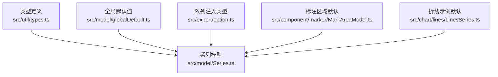
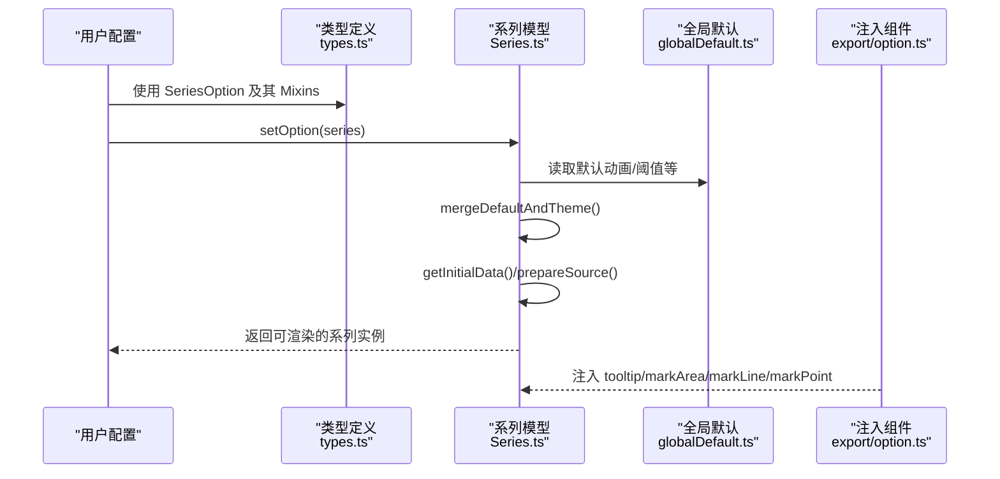
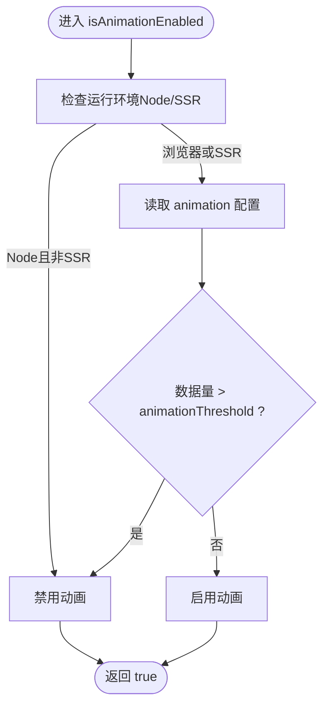
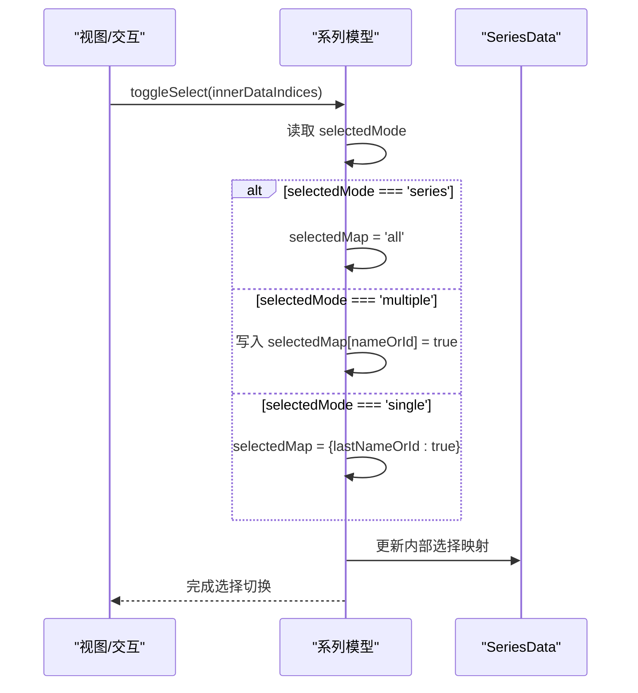
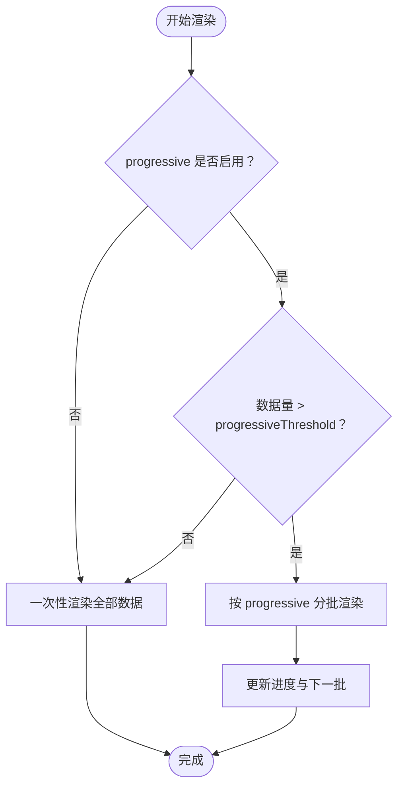
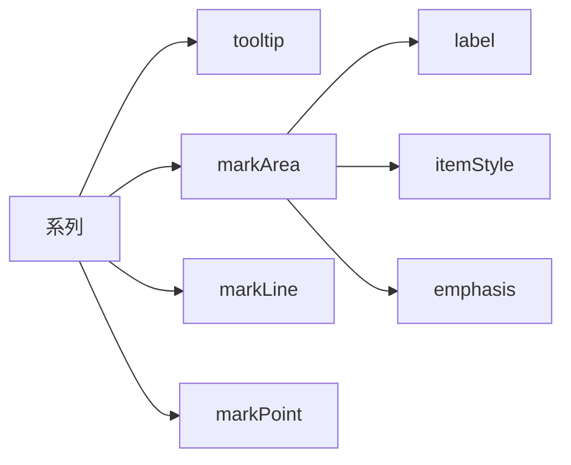
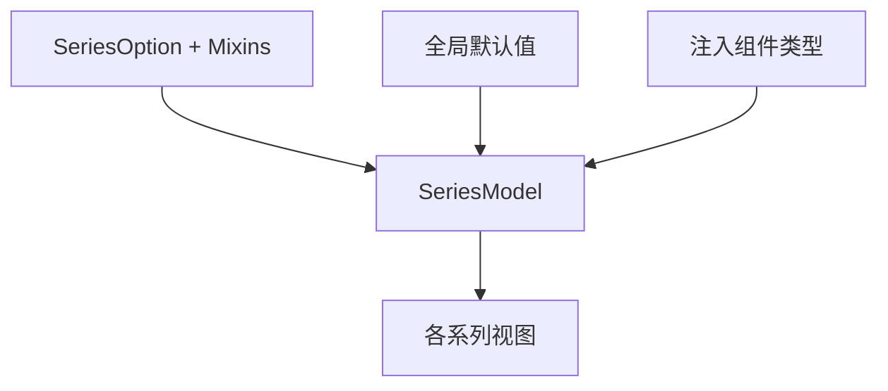

# 通用系列配置项

<cite>
**本文引用的文件**
- [src/util/types.ts](file://src/util/types.ts)
- [src/model/Series.ts](file://src/model/Series.ts)
- [src/model/globalDefault.ts](file://src/model/globalDefault.ts)
- [src/export/option.ts](file://src/export/option.ts)
- [src/component/marker/MarkAreaModel.ts](file://src/component/marker/MarkAreaModel.ts)
- [src/chart/lines/LinesSeries.ts](file://src/chart/lines/LinesSeries.ts)
</cite>

## 目录
1. [简介](#简介)
2. [项目结构](#项目结构)
3. [核心组件](#核心组件)
4. [架构总览](#架构总览)
5. [详细组件分析](#详细组件分析)
6. [依赖关系分析](#依赖关系分析)
7. [性能考量](#性能考量)
8. [故障排查指南](#故障排查指南)
9. [结论](#结论)
10. [附录](#附录)

## 简介
本章节面向所有 ECharts 图表类型，系统化说明“系列（series）”的通用配置项。这些属性在各类图表中均生效，用于控制数据、交互、视觉样式、动画与渲染行为等。文档覆盖以下关键属性：type、data、id、name、legendHoverLink、legendIgnore、tooltip、markArea、markLine、markPoint、zlevel、z、z2、rippleEffect、hoverAnimation、label、itemStyle、emphasis、select、selectable、selectedMode、disableTooltip、inertia、orientAnimation、animationDuration、animationDurationUpdate、animationEasing、animationEasingUpdate、animationDelay、animationDelayUpdate、progressive、progressiveThreshold、count 等。

## 项目结构
- 通用系列配置的类型定义集中在类型文件中，统一约束各系列的可用选项。
- 系列模型负责合并默认值与主题、初始化数据、处理选择状态、动画开关与渐进式渲染等。
- 全局默认值提供动画、渐进式渲染阈值、悬停层阈值等基础配置。
- 注入到系列的标记与提示组件（如 tooltip、markArea/markLine/markPoint）通过导出类型注入到各系列选项。

**图示来源**
- [src/util/types.ts:1116-1155](file://src/util/types.ts#L1116-L1155)
- [src/model/Series.ts:225-328](file://src/model/Series.ts#L225-L328)
- [src/model/globalDefault.ts:107-124](file://src/model/globalDefault.ts#L107-L124)
- [src/export/option.ts:187-193](file://src/export/option.ts#L187-L193)
- [src/component/marker/MarkAreaModel.ts:82-108](file://src/component/marker/MarkAreaModel.ts#L82-L108)
- [src/chart/lines/LinesSeries.ts:398-439](file://src/chart/lines/LinesSeries.ts#L398-L439)

**章节来源**
- [src/util/types.ts:1116-1155](file://src/util/types.ts#L1116-L1155)
- [src/model/Series.ts:225-328](file://src/model/Series.ts#L225-L328)
- [src/model/globalDefault.ts:107-124](file://src/model/globalDefault.ts#L107-L124)
- [src/export/option.ts:187-193](file://src/export/option.ts#L187-L193)
- [src/component/marker/MarkAreaModel.ts:82-108](file://src/component/marker/MarkAreaModel.ts#L82-L108)
- [src/chart/lines/LinesSeries.ts:398-439](file://src/chart/lines/LinesSeries.ts#L398-L439)

## 核心组件
- 系列模型（SeriesModel）：负责合并默认与主题、初始化数据、选择状态管理、动画开关判断、渐进式渲染参数读取等。
- 类型系统（SeriesOption 及 Mixins）：集中声明通用系列配置项，包括动画、颜色、标签布局、渐进式渲染、选择模式、通用过渡等。
- 全局默认值：提供动画时长、缓动、阈值等基础配置。
- 注入组件：tooltip、markArea、markLine、markPoint 作为系列级配置被注入到各系列选项。

**章节来源**
- [src/model/Series.ts:225-328](file://src/model/Series.ts#L225-L328)
- [src/util/types.ts:1976-2052](file://src/util/types.ts#L1976-L2052)
- [src/model/globalDefault.ts:107-124](file://src/model/globalDefault.ts#L107-L124)
- [src/export/option.ts:187-193](file://src/export/option.ts#L187-L193)

## 架构总览
下图展示通用系列配置在 ECharts 中的位置与作用范围：类型定义约束选项；系列模型在初始化时合并默认与主题并准备数据；全局默认提供基础动画与阈值；注入组件为系列提供交互与标注能力。

**图示来源**
- [src/util/types.ts:1116-1155](file://src/util/types.ts#L1116-L1155)
- [src/model/Series.ts:225-328](file://src/model/Series.ts#L225-L328)
- [src/model/globalDefault.ts:107-124](file://src/model/globalDefault.ts#L107-L124)
- [src/export/option.ts:187-193](file://src/export/option.ts#L187-L193)

## 详细组件分析

### 通用系列配置项总览
- type：系列类型标识，决定渲染与交互行为。由具体系列实现提供。
- data：系列数据源，支持多种数据结构，具体格式由系列类型决定。
- id/name：系列标识与名称，用于图例、工具提示、选择键等。
- legendHoverLink：是否联动图例与系列的悬停高亮。
- legendIgnore：是否在图例中忽略该系列。
- tooltip：系列级提示框配置，支持触发方式、内容格式化等。
- markArea/markLine/markPoint：系列级标注区域、标线、标注点。
- zlevel/z/z2：图层与堆叠层级控制，影响绘制顺序与焦点提升。
- rippleEffect：涟漪效果（适用于部分带符号的系列）。
- hoverAnimation：悬停时的动画开关。
- label/itemStyle/emphasis/select：标签、常规样式、强调态、选中态配置。
- selectable/selectedMode：数据项是否可选以及选择模式（single/multiple/series）。
- disableTooltip/inertia/orientAnimation：禁用提示、惯性滚动、方向动画等。
- animationDuration/animationDurationUpdate/animationEasing/animationEasingUpdate/animationDelay/animationDelayUpdate：初始与更新动画的时长、缓动与延迟。
- progressive/progressiveThreshold/count：渐进式渲染与每帧数量控制。

**章节来源**
- [src/util/types.ts:1116-1155](file://src/util/types.ts#L1116-L1155)
- [src/util/types.ts:1976-2052](file://src/util/types.ts#L1976-L2052)
- [src/export/option.ts:187-193](file://src/export/option.ts#L187-L193)

### 动画与过渡
- 动画开关与阈值：isAnimationEnabled 会结合环境（如 Node SSR）与数据量阈值决定是否启用动画。
- 动画配置：包含初始动画与更新动画的时长、缓动、延迟，支持回调以针对每个元素设置。
- 状态过渡动画：stateAnimation 控制状态切换（如 emphasis/select/blur）的动画。
- 通用过渡：universalTransition 支持跨系列形状过渡，可通过 seriesKey 匹配对应元素。

**图示来源**
- [src/model/Series.ts:548-562](file://src/model/Series.ts#L548-L562)

**章节来源**
- [src/model/Series.ts:548-562](file://src/model/Series.ts#L548-L562)
- [src/util/types.ts:1116-1155](file://src/util/types.ts#L1116-L1155)
- [src/model/globalDefault.ts:107-117](file://src/model/globalDefault.ts#L107-L117)

### 选择与交互
- selectedMode：支持 single、multiple、series 或布尔值，控制数据项选择模式。
- selectedMap：记录已选数据项映射，key 为 name 或 index。
- isSelected/getSelectedDataIndices：查询选择状态与索引集合。
- select/unselect/toggleSelect：执行选择、取消选择、切换选择。
- selectable：数据项级别是否允许选择。
- disableTooltip：禁用该数据项的提示框。

**图示来源**
- [src/model/Series.ts:602-719](file://src/model/Series.ts#L602-L719)

**章节来源**
- [src/model/Series.ts:602-719](file://src/model/Series.ts#L602-L719)
- [src/util/types.ts:1976-2052](file://src/util/types.ts#L1976-L2052)

### 渐进式渲染与大数据优化
- progressive：每帧渲染的数据条数，false 表示关闭。
- progressiveThreshold：启用渐进式渲染的数据量阈值。
- progressiveChunkMode：分块模式（如 'mod'）。
- hoverLayerThreshold：悬停层阈值，避免悬停导致渐进式重算。
- count：数据总量，用于任务调度与进度控制。

**图示来源**
- [src/model/Series.ts:587-599](file://src/model/Series.ts#L587-L599)
- [src/model/globalDefault.ts:115-124](file://src/model/globalDefault.ts#L115-L124)

**章节来源**
- [src/model/Series.ts:587-599](file://src/model/Series.ts#L587-L599)
- [src/model/globalDefault.ts:115-124](file://src/model/globalDefault.ts#L115-L124)

### 标注与提示（tooltip、markArea、markLine、markPoint）
- tooltip：系列级提示框配置，支持触发方式、内容格式化等。
- markArea/markLine/markPoint：系列级标注，支持样式、标签、强调态等。
- 默认行为：标注区域默认关闭动画，标签默认显示于顶部，边框宽度为 0 等。

**图示来源**
- [src/export/option.ts:187-193](file://src/export/option.ts#L187-L193)
- [src/component/marker/MarkAreaModel.ts:82-108](file://src/component/marker/MarkAreaModel.ts#L82-L108)

**章节来源**
- [src/export/option.ts:187-193](file://src/export/option.ts#L187-L193)
- [src/component/marker/MarkAreaModel.ts:82-108](file://src/component/marker/MarkAreaModel.ts#L82-L108)

### 层级与视觉（zlevel、z、z2、rippleEffect、hoverAnimation）
- zlevel/z/z2：控制图层与堆叠顺序，z2 常用于强调态提升。
- rippleEffect：涟漪效果，适用于带符号的系列。
- hoverAnimation：悬停动画开关，提升交互反馈。

**章节来源**
- [src/util/types.ts:1771-1773](file://src/util/types.ts#L1771-L1773)
- [src/chart/lines/LinesSeries.ts:398-439](file://src/chart/lines/LinesSeries.ts#L398-L439)

### 标签与样式（label、itemStyle、emphasis、select）
- label：标签文本与布局配置，支持整体布局策略。
- itemStyle：常规样式（填充、描边、透明度等）。
- emphasis：强调态样式（悬停、聚焦等）。
- select：选中态样式。

**章节来源**
- [src/util/types.ts:1976-2052](file://src/util/types.ts#L1976-L2052)
- [src/component/marker/MarkAreaModel.ts:91-107](file://src/component/marker/MarkAreaModel.ts#L91-L107)

## 依赖关系分析
- 类型依赖：SeriesOption 组合了动画 Mixin、颜色调色板 Mixin、状态 Mixin 等，形成统一的系列选项结构。
- 模型依赖：SeriesModel 依赖全局默认值进行合并，并在初始化阶段准备数据源与任务上下文。
- 注入依赖：tooltip/markArea/markLine/markPoint 通过导出类型注入到各系列选项，使系列具备丰富的交互与标注能力。

**图示来源**
- [src/util/types.ts:1976-2052](file://src/util/types.ts#L1976-L2052)
- [src/model/Series.ts:225-328](file://src/model/Series.ts#L225-L328)
- [src/export/option.ts:187-193](file://src/export/option.ts#L187-L193)

**章节来源**
- [src/util/types.ts:1976-2052](file://src/util/types.ts#L1976-L2052)
- [src/model/Series.ts:225-328](file://src/model/Series.ts#L225-L328)
- [src/export/option.ts:187-193](file://src/export/option.ts#L187-L193)

## 性能考量
- 动画阈值：当数据量超过 animationThreshold 时自动禁用动画，避免卡顿。
- 渐进式渲染：通过 progressive 与 progressiveThreshold 将大数据分批渲染，提升首屏与交互响应。
- 悬停层阈值：hoverLayerThreshold 避免悬停触发渐进式重算，保持流畅体验。
- 选择与标注：合理配置 selectedMode 与标注样式，减少不必要的重绘与计算。

[本节为通用指导，不直接分析具体文件]

## 故障排查指南
- 动画未生效：检查运行环境（Node/SSR）与 animationThreshold，确认 isAnimationEnabled 返回值。
- 选择状态异常：核对 selectedMode 与 selectedMap 的设置，确保 key（name/index）一致。
- 渐进式渲染无效：确认 progressive 与 progressiveThreshold 配置，以及数据量是否达到阈值。
- 标注不显示：检查 markArea/markLine/markPoint 的 show、label、itemStyle 配置，注意默认动画关闭。

**章节来源**
- [src/model/Series.ts:548-562](file://src/model/Series.ts#L548-L562)
- [src/model/Series.ts:602-719](file://src/model/Series.ts#L602-L719)
- [src/model/Series.ts:587-599](file://src/model/Series.ts#L587-L599)
- [src/component/marker/MarkAreaModel.ts:82-108](file://src/component/marker/MarkAreaModel.ts#L82-L108)

## 结论
通用系列配置项为 ECharts 所有图表类型提供了统一的配置入口，涵盖数据、交互、样式、动画与渲染优化等方面。通过类型系统与系列模型的协作，用户可以在不同图表中复用一致的配置语义，同时享受大数据场景下的性能保障与丰富的交互能力。

[本节为总结性内容，不直接分析具体文件]

## 附录
- 常用配置参考路径：
  - 动画与过渡：[src/util/types.ts:1116-1155](file://src/util/types.ts#L1116-L1155)
  - 系列选项与 Mixins：[src/util/types.ts:1976-2052](file://src/util/types.ts#L1976-L2052)
  - 系列模型初始化与合并：[src/model/Series.ts:225-328](file://src/model/Series.ts#L225-L328)
  - 全局默认值：[src/model/globalDefault.ts:107-124](file://src/model/globalDefault.ts#L107-L124)
  - 注入组件类型：[src/export/option.ts:187-193](file://src/export/option.ts#L187-L193)
  - 标注区域默认：[src/component/marker/MarkAreaModel.ts:82-108](file://src/component/marker/MarkAreaModel.ts#L82-L108)
  - 折线系列默认示例：[src/chart/lines/LinesSeries.ts:398-439](file://src/chart/lines/LinesSeries.ts#L398-L439)

[本节为参考路径汇总，不直接分析具体文件]