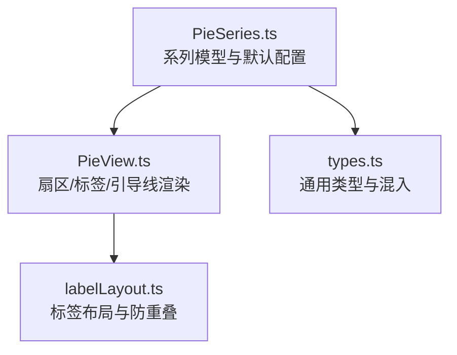
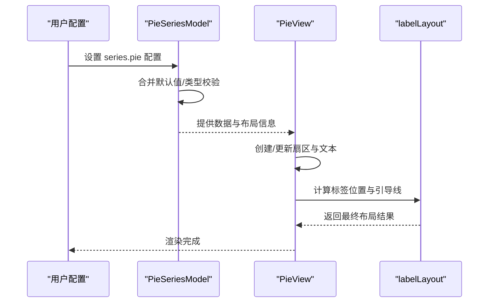

# 饼图系列配置项

<cite>
**本文引用的文件**
- [PieSeries.ts](file://src/chart/pie/PieSeries.ts)
- [PieView.ts](file://src/chart/pie/PieView.ts)
- [labelLayout.ts](file://src/chart/pie/labelLayout.ts)
- [pie.html](file://test/pie.html)
- [roseType.html](file://test/roseType.html)
- [pie-animation.html](file://test/pie-animation.html)
- [pie-cornerRadius.html](file://test/pie-cornerRadius.html)
- [types.ts](file://src/util/types.ts)
</cite>

## 目录
1. [简介](#简介)
2. [项目结构](#项目结构)
3. [核心组件](#核心组件)
4. [架构总览](#架构总览)
5. [详细组件分析](#详细组件分析)
6. [依赖关系分析](#依赖关系分析)
7. [性能考量](#性能考量)
8. [故障排查指南](#故障排查指南)
9. [结论](#结论)
10. [附录：配置项速查与示例路径](#附录配置项速查与示例路径)

## 简介
本文件系统性梳理 ECharts 饼图（series.type: 'pie'）的系列级配置项，重点覆盖以下属性：radius、center、roseType、avoidLabelOverlap、label、labelLine、itemStyle、emphasis、select、startAngle、clockwise、selectedOffset、animationType、animationDuration、animationEasing、animationDurationUpdate、animationEasingUpdate。内容包含各属性的作用、数据类型、默认值、行为说明与典型使用场景，并给出仓库内可运行的示例文件路径，便于快速验证与参考。

## 项目结构
与饼图系列相关的核心实现位于 chart/pie 目录，配合 label 布局与视图渲染逻辑：
- 模型层：定义系列选项类型、默认值与数据参数扩展
- 视图层：负责扇区创建、状态样式、标签与引导线更新、动画
- 布局层：计算标签位置、避免重叠、处理对齐与边距等

图表来源
- [PieSeries.ts:100-142](file://src/chart/pie/PieSeries.ts#L100-L142)
- [PieView.ts:230-303](file://src/chart/pie/PieView.ts#L230-L303)
- [labelLayout.ts:349-595](file://src/chart/pie/labelLayout.ts#L349-L595)
- [types.ts:184-230](file://src/util/types.ts#L184-L230)

章节来源
- [PieSeries.ts:100-142](file://src/chart/pie/PieSeries.ts#L100-L142)
- [PieView.ts:230-303](file://src/chart/pie/PieView.ts#L230-L303)
- [labelLayout.ts:349-595](file://src/chart/pie/labelLayout.ts#L349-L595)
- [types.ts:184-230](file://src/util/types.ts#L184-L230)

## 核心组件
- 系列模型（PieSeriesModel）
  - 定义饼图系列选项类型与默认值，包括 roseType、clockwise、startAngle、endAngle、padAngle、minAngle、minShowLabelAngle、selectedOffset、avoidLabelOverlap、percentPrecision、stillShowZeroSum、showEmptyCircle、emptyCircleStyle、动画相关属性等
  - 提供 getDataParams 扩展 percent 字段，供 formatter 使用
- 视图（PieView）
  - 管理扇区 PiePiece 的创建、更新、状态样式（normal/emphasis/select/blur）、标签与引导线的显示与隐藏
  - 根据 selectedOffset 计算选中偏移，应用 emphasis.scale/scaleSize
  - 控制空数据时的空圆展示
- 标签布局（labelLayout）
  - 计算标签位置、旋转、对齐方式、引导线折点
  - 支持 avoidLabelOverlap 自动避让、edgeDistance、alignTo、bleedMargin、minShowLabelAngle 等
  - 对标签宽度进行约束与换行，保证在有限空间可读

章节来源
- [PieSeries.ts:150-338](file://src/chart/pie/PieSeries.ts#L150-L338)
- [PieView.ts:42-227](file://src/chart/pie/PieView.ts#L42-L227)
- [labelLayout.ts:349-595](file://src/chart/pie/labelLayout.ts#L349-L595)

## 架构总览
下图展示了从配置到渲染的关键流程：用户配置通过系列模型合并默认值，视图根据布局数据生成扇区与标签，标签布局模块负责最终定位与避让。

图表来源
- [PieSeries.ts:150-338](file://src/chart/pie/PieSeries.ts#L150-L338)
- [PieView.ts:230-303](file://src/chart/pie/PieView.ts#L230-L303)
- [labelLayout.ts:349-595](file://src/chart/pie/labelLayout.ts#L349-L595)

## 详细组件分析

### radius
- 作用：控制饼图的内外半径，支持数值或百分比；数组形式表示 [内半径, 外半径]，可实现环形图
- 数据类型：number | string | number[] | string[]
- 默认值：[0, '50%']
- 行为说明：
  - 当为字符串时按视口宽高解析百分比
  - 环形图常用于强调“占比”同时保留中心区域用于标题或汇总信息
- 示例路径
  - [pie.html](file://test/pie.html) 中多处演示了 radius 的不同用法
  - [pie-cornerRadius.html](file://test/pie-cornerRadius.html) 演示环形图与圆角组合

章节来源
- [PieSeries.ts:222-230](file://src/chart/pie/PieSeries.ts#L222-L230)
- [pie.html:353-367](file://test/pie.html#L353-L367)
- [pie-cornerRadius.html:85-110](file://test/pie-cornerRadius.html#L85-L110)

### center
- 作用：设置饼图圆心坐标，支持像素或百分比；也支持单值（x,y 相同）
- 数据类型：string | number | (string|number)[]
- 默认值：['50%', '50%']
- 行为说明：
  - 与 box layout 结合时可由 left/top/right/bottom 推导
  - 在特定坐标系下允许传入非百分比的数值坐标
- 示例路径
  - [pie.html](file://test/pie.html) 中多处演示 center 的使用

章节来源
- [PieSeries.ts:222-229](file://src/chart/pie/PieSeries.ts#L222-L229)
- [types.ts:184-230](file://src/util/types.ts#L184-L230)
- [pie.html:353-367](file://test/pie.html#L353-L367)

### roseType
- 作用：切换南丁格尔玫瑰图模式
  - 'radius'：以半径变化表达数值
  - 'area'：以面积变化表达数值
  - 布尔 true 等价于 'radius'
- 数据类型：'radius' | 'area' | boolean
- 默认值：未设置（普通饼图）
- 行为说明：
  - 开启后，每个扇区的半径或面积随数据值变化，适合对比量级差异
- 示例路径
  - [roseType.html](file://test/roseType.html)
  - [pie-label.html](file://test/pie-label.html) 中的玫瑰图用例

章节来源
- [PieSeries.ts:118-119](file://src/chart/pie/PieSeries.ts#L118-L119)
- [roseType.html:61-78](file://test/roseType.html#L61-L78)
- [pie-label.html:637-643](file://test/pie-label.html#L637-L643)

### avoidLabelOverlap
- 作用：启用标签自动避让策略，减少标签重叠
- 数据类型：boolean
- 默认值：true
- 行为说明：
  - 基于标签尺寸与可视区域计算最大可用宽度，必要时换行或调整位置
  - 与 label.rotate、alignTo、edgeDistance、bleedMargin 等共同影响最终布局
- 示例路径
  - [labelLayout.ts](file://src/chart/pie/labelLayout.ts) 中实现了完整的避让算法
  - [pie-label.html](file://test/pie-label.html) 多组用例展示大量标签下的布局效果

章节来源
- [PieSeries.ts:324-325](file://src/chart/pie/PieSeries.ts#L324-L325)
- [labelLayout.ts:149-257](file://src/chart/pie/labelLayout.ts#L149-L257)
- [labelLayout.ts:552-554](file://src/chart/pie/labelLayout.ts#L552-L554)

### label
- 作用：配置扇区标签的显示、位置、旋转、对齐、富文本等
- 关键子属性
  - position：'outer'/'outside'/'inside'/'inner'/'center'
  - rotate：数字角度、'radial'、'tangential'、'tangential-noflip'
  - alignTo：'none'/'labelLine'/'edge'
  - edgeDistance：标签与边缘距离（百分比或像素）
  - bleedMargin：标签与图表边缘的最小留白
  - distanceToLabelLine：标签与引导线的间距
  - overflow：文本溢出处理策略
- 默认值：
  - show: true
  - position: 'outer'
  - rotate: 0
  - alignTo: 'none'
  - edgeDistance: '25%'
  - distanceToLabelLine: 5
- 行为说明：
  - 当 position 不是 'outside'/'outer' 时，引导线不显示
  - 支持富文本 rich 与背景、边框、圆角等样式
- 示例路径
  - [pie.html](file://test/pie.html) 中丰富的 label 样式与富文本示例
  - [pie-label.html](file://test/pie-label.html) 中多种位置与旋转的组合

章节来源
- [PieSeries.ts:265-286](file://src/chart/pie/PieSeries.ts#L265-L286)
- [PieView.ts:173-227](file://src/chart/pie/PieView.ts#L173-L227)
- [labelLayout.ts:434-506](file://src/chart/pie/labelLayout.ts#L434-L506)
- [pie.html:78-152](file://test/pie.html#L78-L152)
- [pie-label.html:141-155](file://test/pie-label.html#L141-L155)

### labelLine
- 作用：配置标签引导线的显示与样式
- 关键子属性
  - show：是否显示引导线
  - length / length2：两段引导线长度（百分比或像素）
  - smooth：是否平滑曲线
  - minTurnAngle：引导线与表面法向的最大夹角限制
  - maxSurfaceAngle：引导线与表面法向的最大夹角
  - lineStyle：颜色、宽度、线型等
- 默认值：
  - show: true
  - length: 15
  - length2: 30
  - smooth: false
  - minTurnAngle: 90
  - maxSurfaceAngle: 90
  - lineStyle.width: 1, type: 'solid'
- 行为说明：
  - 仅在 label.position 为 'outside'/'outer' 时生效
  - 会根据标签位置与对齐策略动态计算折点
- 示例路径
  - [pie.html](file://test/pie.html) 中演示了不同长度与样式
  - [pie-label.html](file://test/pie-label.html) 中演示了平滑与最小转角

章节来源
- [PieSeries.ts:287-302](file://src/chart/pie/PieSeries.ts#L287-L302)
- [PieView.ts:209-225](file://src/chart/pie/PieView.ts#L209-L225)
- [labelLayout.ts:447-465](file://src/chart/pie/labelLayout.ts#L447-L465)
- [pie.html:84-94](file://test/pie.html#L84-L94)

### itemStyle
- 作用：配置扇区外观，如填充色、边框、圆角等
- 关键子属性
  - color：填充色或渐变/纹理
  - borderColor / borderWidth：边框样式
  - borderRadius：支持数字、字符串、数组，分别表示内圆角与外圆角
- 默认值：
  - borderWidth: 1
  - borderJoin: 'round'
- 行为说明：
  - 支持在 normal/emphasis/select/blur 等不同状态下分别配置
  - 与 roseType 配合可产生更丰富的视觉效果
- 示例路径
  - [pie-cornerRadius.html](file://test/pie-cornerRadius.html) 演示 borderRadius 的多种形态
  - [pie.html](file://test/pie.html) 中演示纹理与边框

章节来源
- [PieSeries.ts:303-306](file://src/chart/pie/PieSeries.ts#L303-L306)
- [PieView.ts:65-68](file://src/chart/pie/PieView.ts#L65-L68)
- [pie-cornerRadius.html:94-110](file://test/pie-cornerRadius.html#L94-L110)
- [pie.html:48-64](file://test/pie.html#L48-L64)

### emphasis
- 作用：配置高亮状态的样式与行为
- 关键子属性
  - scale：是否放大扇区
  - scaleSize：放大尺寸
  - focus：聚焦策略（如 'self'、'series' 等）
  - itemStyle：高亮样式（颜色、阴影等）
  - label / labelLine：高亮时标签与引导线的显示与样式
- 默认值：
  - scale: true
  - scaleSize: 5
- 行为说明：
  - 高亮时可通过 scale/scaleSize 突出当前扇区
  - 可与 select 状态叠加
- 示例路径
  - [pie.html](file://test/pie.html) 中高亮阴影与标签显示
  - [pie-animation.html](file://test/pie-animation.html) 中演示无动画时高亮标签显示

章节来源
- [PieSeries.ts:319-322](file://src/chart/pie/PieSeries.ts#L319-L322)
- [PieView.ts:142-170](file://src/chart/pie/PieView.ts#L142-L170)
- [pie.html:95-103](file://test/pie.html#L95-L103)
- [pie-animation.html:175-197](file://test/pie-animation.html#L175-L197)

### select
- 作用：配置选中状态的样式与偏移
- 关键子属性
  - itemStyle：选中态样式
  - 与 selectedOffset 配合实现选中扇区位移
- 默认值：继承 itemStyle
- 行为说明：
  - 选中时扇区沿法向移动 selectedOffset 距离
  - 支持多选/单选模式（selectedMode）
- 示例路径
  - [pie.html](file://test/pie.html) 中演示 selectedMode 与 selectedOffset

章节来源
- [PieSeries.ts:128-129](file://src/chart/pie/PieSeries.ts#L128-L129)
- [PieView.ts:146-166](file://src/chart/pie/PieView.ts#L146-L166)
- [pie.html:78-83](file://test/pie.html#L78-L83)

### startAngle
- 作用：设置起始角度（度），默认从正上方开始
- 数据类型：number
- 默认值：90
- 行为说明：
  - 与 clockwise 共同决定绘制方向
  - endAngle 可为具体角度或 'auto'
- 示例路径
  - [pie-animation.html](file://test/pie-animation.html) 中演示 startAngle/endAngle

章节来源
- [PieSeries.ts:121-123](file://src/chart/pie/PieSeries.ts#L121-L123)
- [PieSeries.ts:231-234](file://src/chart/pie/PieSeries.ts#L231-L234)
- [pie-animation.html:93-104](file://test/pie-animation.html#L93-L104)

### clockwise
- 作用：控制扇区绘制方向
- 数据类型：boolean
- 默认值：true
- 行为说明：
  - true 表示顺时针，false 表示逆时针
- 示例路径
  - [pie.html](file://test/pie.html) 中演示顺时针/逆时针切换

章节来源
- [PieSeries.ts:120-121](file://src/chart/pie/PieSeries.ts#L120-L121)
- [PieSeries.ts:230-231](file://src/chart/pie/PieSeries.ts#L230-L231)
- [pie.html:273-308](file://test/pie.html#L273-L308)

### selectedOffset
- 作用：选中扇区相对原位置的偏移距离
- 数据类型：number
- 默认值：10
- 行为说明：
  - 选中时沿扇区法向移动指定像素
  - 与 select 状态联动
- 示例路径
  - [pie.html](file://test/pie.html) 中演示选中偏移

章节来源
- [PieSeries.ts:242-243](file://src/chart/pie/PieSeries.ts#L242-L243)
- [PieView.ts:132-136](file://src/chart/pie/PieView.ts#L132-L136)
- [pie.html:78-83](file://test/pie.html#L78-L83)

### animationType
- 作用：初始渲染动画类型
- 可选值：'expansion'（展开）、'scale'（缩放）
- 默认值：'expansion'
- 行为说明：
  - 'expansion'：扇区从起始角度逐步展开
  - 'scale'：扇区从内半径向外半径缩放出现
- 示例路径
  - [pie-animation.html](file://test/pie-animation.html) 中演示两种动画类型

章节来源
- [PieSeries.ts:135-136](file://src/chart/pie/PieSeries.ts#L135-L136)
- [PieSeries.ts:327-330](file://src/chart/pie/PieSeries.ts#L327-L330)
- [PieView.ts:80-118](file://src/chart/pie/PieView.ts#L80-L118)
- [pie-animation.html:93-104](file://test/pie-animation.html#L93-L104)
- [pie-animation.html:142-155](file://test/pie-animation.html#L142-L155)

### animationDuration
- 作用：初始渲染动画时长（毫秒）
- 数据类型：number
- 默认值：1000
- 行为说明：
  - 与 animationType 配合控制入场动画速度
- 示例路径
  - [pie-animation.html](file://test/pie-animation.html) 中演示不同时长

章节来源
- [PieSeries.ts:330-331](file://src/chart/pie/PieSeries.ts#L330-L331)
- [pie-animation.html:93-104](file://test/pie-animation.html#L93-L104)

### animationEasing
- 作用：初始渲染动画缓动函数
- 数据类型：AnimationEasing（如 'cubicInOut'）
- 默认值：'cubicInOut'
- 行为说明：
  - 控制动画节奏，提升视觉体验
- 示例路径
  - [PieSeries.ts](file://src/chart/pie/PieSeries.ts) 默认值定义

章节来源
- [PieSeries.ts:335-337](file://src/chart/pie/PieSeries.ts#L335-L337)

### animationDurationUpdate
- 作用：数据更新时的动画时长（毫秒）
- 数据类型：number
- 默认值：500
- 行为说明：
  - 与 animationTypeUpdate 配合控制过渡动画
- 示例路径
  - [pie-animation.html](file://test/pie-animation.html) 中演示更新动画时长

章节来源
- [PieSeries.ts:333-336](file://src/chart/pie/PieSeries.ts#L333-L336)
- [pie-animation.html:93-104](file://test/pie-animation.html#L93-L104)

### animationEasingUpdate
- 作用：数据更新时的动画缓动函数
- 数据类型：AnimationEasing（如 'cubicInOut'）
- 默认值：'cubicInOut'
- 行为说明：
  - 控制更新动画的节奏
- 示例路径
  - [PieSeries.ts](file://src/chart/pie/PieSeries.ts) 默认值定义

章节来源
- [PieSeries.ts:333-336](file://src/chart/pie/PieSeries.ts#L333-L336)

## 依赖关系分析
- 系列模型依赖类型系统（types.ts）中的 CircleLayoutOptionMixin、BoxLayoutOptionMixin、SeriesLabelOption、LabelLineOption、ItemStyleOption 等，确保配置项的类型安全与一致性
- 视图依赖 label 布局模块进行标签定位与避让，确保在不同屏幕尺寸与数据量下仍保持可读性
- 动画与状态样式由视图统一处理，保证交互反馈一致

图表来源
- [types.ts:184-230](file://src/util/types.ts#L184-L230)
- [PieSeries.ts:100-142](file://src/chart/pie/PieSeries.ts#L100-L142)
- [PieView.ts:230-303](file://src/chart/pie/PieView.ts#L230-L303)
- [labelLayout.ts:349-595](file://src/chart/pie/labelLayout.ts#L349-L595)

章节来源
- [types.ts:184-230](file://src/util/types.ts#L184-L230)
- [PieSeries.ts:100-142](file://src/chart/pie/PieSeries.ts#L100-L142)
- [PieView.ts:230-303](file://src/chart/pie/PieView.ts#L230-L303)
- [labelLayout.ts:349-595](file://src/chart/pie/labelLayout.ts#L349-L595)

## 性能考量
- 大量标签场景建议启用 avoidLabelOverlap，并结合 minShowLabelAngle 隐藏过小扇区的标签，减少重排与绘制开销
- 合理设置 radius 与 center，避免过大的可视区域导致标签计算复杂度高
- 动画时长与缓动函数应根据数据更新频率权衡，频繁更新时适当缩短 duration 或使用更轻量的 easing
- 使用 stillShowZeroSum 控制全零数据的展示，避免不必要的渲染

## 故障排查指南
- 标签被遮挡或不显示
  - 检查 avoidLabelOverlap 与 minShowLabelAngle 的设置
  - 确认 label.position 是否为 'outside'/'outer'，否则引导线不会显示
  - 查看 edgeDistance 与 bleedMargin 是否过小导致标签贴边被裁剪
- 选中偏移无效
  - 确认 selectedOffset 是否设置为 0 或被其他样式覆盖
  - 检查 select 状态是否启用
- 动画异常
  - 确认 animationType 与 animationTypeUpdate 的值是否在允许范围内
  - 检查数据更新时是否触发了正确的 setOption 调用

章节来源
- [labelLayout.ts:149-257](file://src/chart/pie/labelLayout.ts#L149-L257)
- [PieView.ts:209-225](file://src/chart/pie/PieView.ts#L209-L225)
- [PieSeries.ts:327-337](file://src/chart/pie/PieSeries.ts#L327-L337)

## 结论
饼图系列提供了丰富的配置能力，涵盖几何布局（radius、center、startAngle、clockwise）、可视化风格（itemStyle、label、labelLine）、交互状态（emphasis、select、selectedOffset）、以及动画（animationType、animationDuration、animationEasing、animationDurationUpdate、animationEasingUpdate）。通过合理组合这些配置项，可以构建出既美观又易读的饼图与玫瑰图，满足不同业务场景的数据呈现需求。

## 附录：配置项速查与示例路径
- radius
  - 类型：number | string | number[] | string[]
  - 默认：[0, '50%']
  - 示例：[pie.html](file://test/pie.html), [pie-cornerRadius.html](file://test/pie-cornerRadius.html)
- center
  - 类型：string | number | (string|number)[]
  - 默认：['50%', '50%']
  - 示例：[pie.html](file://test/pie.html)
- roseType
  - 类型：'radius' | 'area' | boolean
  - 默认：未设置
  - 示例：[roseType.html](file://test/roseType.html), [pie-label.html](file://test/pie-label.html)
- avoidLabelOverlap
  - 类型：boolean
  - 默认：true
  - 示例：[labelLayout.ts](file://src/chart/pie/labelLayout.ts), [pie-label.html](file://test/pie-label.html)
- label
  - 类型：对象（position、rotate、alignTo、edgeDistance、bleedMargin、distanceToLabelLine、overflow 等）
  - 默认：show:true, position:'outer', rotate:0, alignTo:'none', edgeDistance:'25%', distanceToLabelLine:5
  - 示例：[pie.html](file://test/pie.html), [pie-label.html](file://test/pie-label.html)
- labelLine
  - 类型：对象（show、length、length2、smooth、minTurnAngle、maxSurfaceAngle、lineStyle 等）
  - 默认：show:true, length:15, length2:30, smooth:false, minTurnAngle:90, maxSurfaceAngle:90
  - 示例：[pie.html](file://test/pie.html), [pie-label.html](file://test/pie-label.html)
- itemStyle
  - 类型：对象（color、borderColor、borderWidth、borderRadius 等）
  - 默认：borderWidth:1, borderJoin:'round'
  - 示例：[pie-cornerRadius.html](file://test/pie-cornerRadius.html), [pie.html](file://test/pie.html)
- emphasis
  - 类型：对象（scale、scaleSize、focus、itemStyle、label、labelLine 等）
  - 默认：scale:true, scaleSize:5
  - 示例：[pie.html](file://test/pie.html), [pie-animation.html](file://test/pie-animation.html)
- select
  - 类型：对象（itemStyle 等）
  - 默认：继承 itemStyle
  - 示例：[pie.html](file://test/pie.html)
- startAngle
  - 类型：number
  - 默认：90
  - 示例：[pie-animation.html](file://test/pie-animation.html)
- clockwise
  - 类型：boolean
  - 默认：true
  - 示例：[pie.html](file://test/pie.html)
- selectedOffset
  - 类型：number
  - 默认：10
  - 示例：[pie.html](file://test/pie.html)
- animationType
  - 类型：'expansion' | 'scale'
  - 默认：'expansion'
  - 示例：[pie-animation.html](file://test/pie-animation.html)
- animationDuration
  - 类型：number
  - 默认：1000
  - 示例：[pie-animation.html](file://test/pie-animation.html)
- animationEasing
  - 类型：AnimationEasing
  - 默认：'cubicInOut'
  - 示例：[PieSeries.ts](file://src/chart/pie/PieSeries.ts)
- animationDurationUpdate
  - 类型：number
  - 默认：500
  - 示例：[pie-animation.html](file://test/pie-animation.html)
- animationEasingUpdate
  - 类型：AnimationEasing
  - 默认：'cubicInOut'
  - 示例：[PieSeries.ts](file://src/chart/pie/PieSeries.ts)