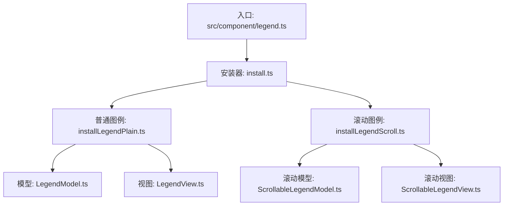
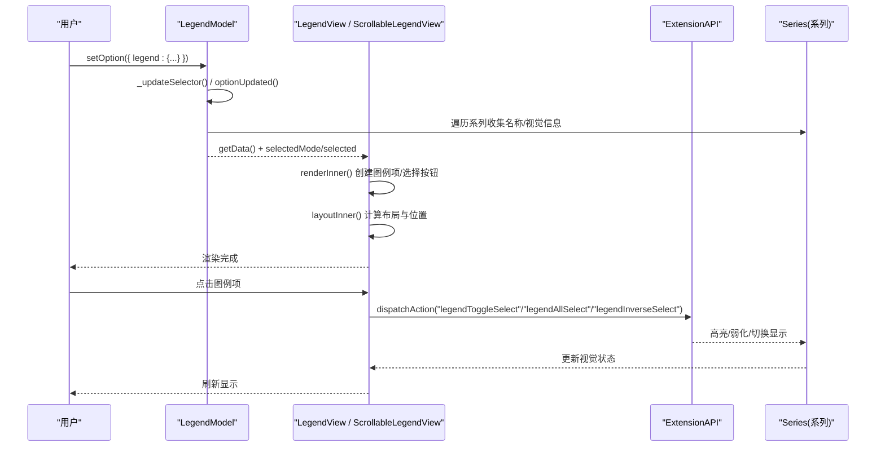
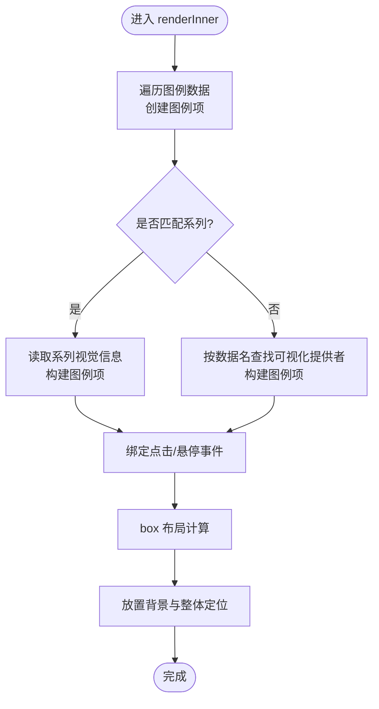
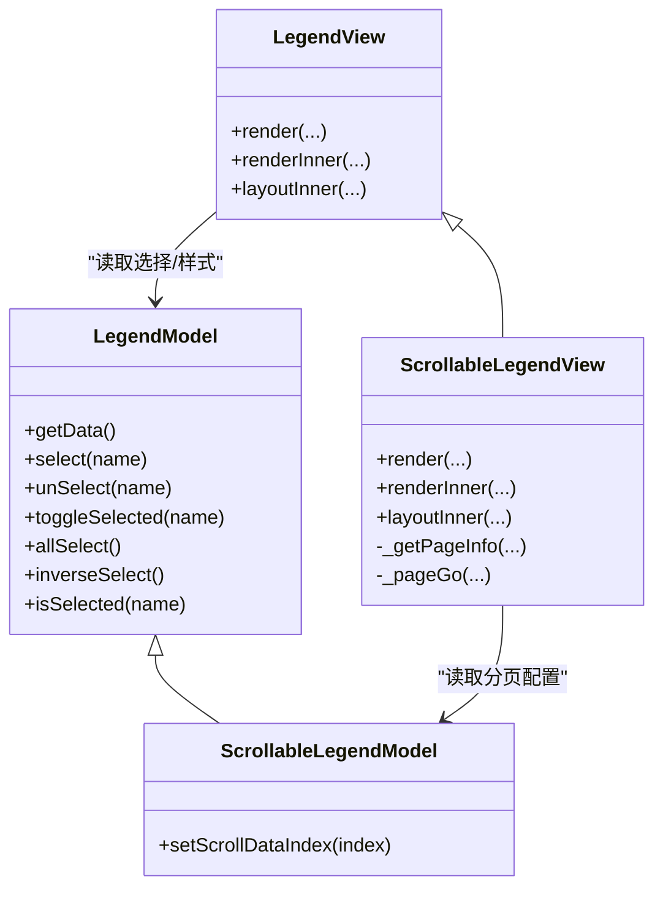
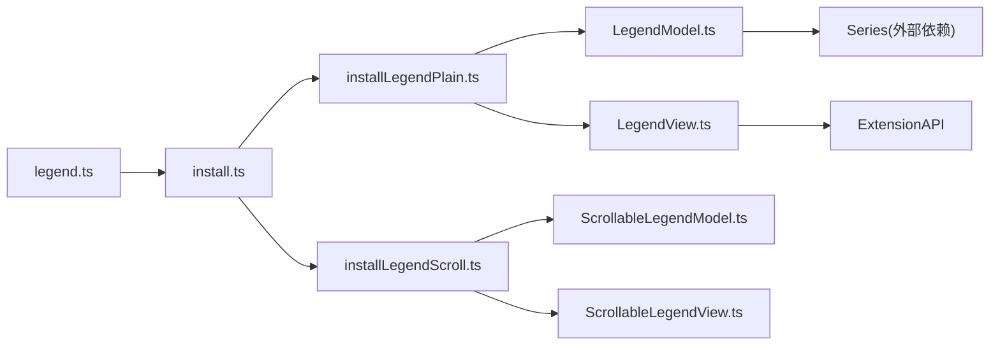

# 图例配置项

<cite>
**本文引用的文件**
- [src/component/legend.ts](file://src/component/legend.ts)
- [src/component/legendPlain.ts](file://src/component/legendPlain.ts)
- [src/component/legendScroll.ts](file://src/component/legendScroll.ts)
- [src/component/legend/install.ts](file://src/component/legend/install.ts)
- [src/component/legend/installLegendPlain.ts](file://src/component/legend/installLegendPlain.ts)
- [src/component/legend/installLegendScroll.ts](file://src/component/legend/installLegendScroll.ts)
- [src/component/legend/LegendModel.ts](file://src/component/legend/LegendModel.ts)
- [src/component/legend/LegendView.ts](file://src/component/legend/LegendView.ts)
- [src/component/legend/ScrollableLegendModel.ts](file://src/component/legend/ScrollableLegendModel.ts)
- [src/component/legend/ScrollableLegendView.ts](file://src/component/legend/ScrollableLegendView.ts)
- [test/legend.html](file://test/legend.html)
- [test/legend-feature.html](file://test/legend-feature.html)
- [test/legend-scroll2plain.html](file://test/legend-scroll2plain.html)
</cite>

## 目录
1. [简介](#简介)
2. [项目结构](#项目结构)
3. [核心组件](#核心组件)
4. [架构总览](#架构总览)
5. [详细组件分析](#详细组件分析)
6. [依赖关系分析](#依赖关系分析)
7. [性能考量](#性能考量)
8. [故障排查指南](#故障排查指南)
9. [结论](#结论)
10. [附录：常用配置与最佳实践](#附录：常用配置与最佳实践)

## 简介
本文件系统性梳理 ECharts 图例（legend）组件的配置项、行为机制与实现要点，覆盖普通图例与滚动图例的差异、图例与系列数据的关联方式、选择模式与交互流程，并提供可落地的配置建议与示例路径。读者无需深入源码即可掌握如何高效使用 legend 完成展示、筛选与交互控制。

## 项目结构
ECharts 将图例拆分为“普通图例”和“滚动图例”两个子模块，通过扩展机制注册到全局：
- 入口聚合：统一安装普通与滚动图例
- 普通图例：基础渲染、布局、样式、选择与事件分发
- 滚动图例：在普通图例基础上增加分页控制器与裁剪区域

图示来源
- [src/component/legend.ts:20-25](file://src/component/legend.ts#L20-L25)
- [src/component/legend/install.ts:20-27](file://src/component/legend/install.ts#L20-L27)
- [src/component/legend/installLegendPlain.ts:20-36](file://src/component/legend/installLegendPlain.ts#L20-L36)
- [src/component/legend/installLegendScroll.ts:20-33](file://src/component/legend/installLegendScroll.ts#L20-L33)

章节来源
- [src/component/legend.ts:20-25](file://src/component/legend.ts#L20-L25)
- [src/component/legend/install.ts:20-27](file://src/component/legend/install.ts#L20-L27)
- [src/component/legend/installLegendPlain.ts:20-36](file://src/component/legend/installLegendPlain.ts#L20-L36)
- [src/component/legend/installLegendScroll.ts:20-33](file://src/component/legend/installLegendScroll.ts#L20-L33)

## 核心组件
- 普通图例（legend.plain）
  - 负责图例项的创建、布局、样式、选择状态管理与事件派发
  - 支持选择按钮组（全选/反选）、文本格式化、图标继承系列视觉等
- 滚动图例（legend.scroll）
  - 继承普通图例能力，新增分页控制器（上一页/下一页）、页码文本、裁剪区域与翻页动画
  - 提供 pageFormatter、pageIcons、pageTextStyle、animationDurationUpdate 等专属配置

章节来源
- [src/component/legend/LegendModel.ts:245-543](file://src/component/legend/LegendModel.ts#L245-L543)
- [src/component/legend/LegendView.ts:61-759](file://src/component/legend/LegendView.ts#L61-L759)
- [src/component/legend/ScrollableLegendModel.ts:31-108](file://src/component/legend/ScrollableLegendModel.ts#L31-L108)
- [src/component/legend/ScrollableLegendView.ts:72-553](file://src/component/legend/ScrollableLegendView.ts#L72-L553)

## 架构总览
下图展示了从用户配置到渲染与交互的关键链路：

图示来源
- [src/component/legend/LegendModel.ts:267-316](file://src/component/legend/LegendModel.ts#L267-L316)
- [src/component/legend/LegendModel.ts:318-382](file://src/component/legend/LegendModel.ts#L318-L382)
- [src/component/legend/LegendView.ts:104-166](file://src/component/legend/LegendView.ts#L104-L166)
- [src/component/legend/LegendView.ts:174-325](file://src/component/legend/LegendView.ts#L174-L325)
- [src/component/legend/LegendView.ts:709-756](file://src/component/legend/LegendView.ts#L709-L756)

## 详细组件分析

### 普通图例（legend.plain）
- 数据源与关联机制
  - 自动扫描系列名称与可视化提供者提供的数据名，去重后生成图例项；若未显式设置 data，则使用潜在数据名集合
  - 支持为每个图例项单独设置 name、icon、textStyle、tooltip 等
- 选择模式
  - selectedMode: true | 'single' | 'multiple'
  - selected: 以 name 为键的布尔映射，默认未声明表示选中
  - 单选模式下首次渲染会尝试选择一个已选中的项，否则选择第一项
- 选择按钮组（selector）
  - 支持 'all'（全选）与 'inverse'（反选），可通过 selectorPosition、selectorItemGap、selectorButtonGap 控制布局
  - 按钮文案由国际化标题或自定义 title 决定
- 样式与文本
  - itemWidth/itemHeight 控制图例符号尺寸
  - itemGap 控制图例项间距
  - padding 控制内容与边框内边距
  - textStyle 控制文字样式
  - formatter 支持字符串模板或回调函数
  - icon/symbolRotate/symbolKeepAspect 控制图例图标及旋转
  - inactiveColor/inactiveBorderColor/inactiveBorderWidth 控制未选中态样式
  - lineStyle 控制线条类图例的线型与不选中态线宽/颜色
- 事件与交互
  - 点击触发 legendToggleSelect
  - 鼠标移入/移出触发 highlight/downplay
  - triggerEvent 可将事件包装并透传

图示来源
- [src/component/legend/LegendView.ts:174-325](file://src/component/legend/LegendView.ts#L174-L325)
- [src/component/legend/LegendView.ts:518-587](file://src/component/legend/LegendView.ts#L518-L587)

章节来源
- [src/component/legend/LegendModel.ts:267-316](file://src/component/legend/LegendModel.ts#L267-L316)
- [src/component/legend/LegendModel.ts:318-382](file://src/component/legend/LegendModel.ts#L318-L382)
- [src/component/legend/LegendModel.ts:388-440](file://src/component/legend/LegendModel.ts#L388-L440)
- [src/component/legend/LegendModel.ts:450-543](file://src/component/legend/LegendModel.ts#L450-L543)
- [src/component/legend/LegendView.ts:104-166](file://src/component/legend/LegendView.ts#L104-L166)
- [src/component/legend/LegendView.ts:174-325](file://src/component/legend/LegendView.ts#L174-L325)
- [src/component/legend/LegendView.ts:384-516](file://src/component/legend/LegendView.ts#L384-L516)
- [src/component/legend/LegendView.ts:518-587](file://src/component/legend/LegendView.ts#L518-L587)
- [src/component/legend/LegendView.ts:709-756](file://src/component/legend/LegendView.ts#L709-L756)

### 滚动图例（legend.scroll）
- 新增能力
  - 分页控制器：上一页/下一页按钮，支持水平/垂直方向图标
  - 页码文本：pageFormatter 支持字符串模板或回调
  - 裁剪区域：当内容超出容器时启用裁剪，保证翻页体验
  - 动画：animationDurationUpdate 控制翻页过渡时长
- 布局差异
  - 忽略 size 的方向维度，允许通过 left/right/top/bottom 精确控制
  - 控制器与内容区对齐策略：始终在另一维居中
  - 页面边界判定基于几何相交与“半项可见即翻页”的策略，提升可用性
- 交互
  - 点击控制器触发 legendScroll 动作，传入 scrollDataIndex 目标索引

图示来源
- [src/component/legend/LegendModel.ts:245-543](file://src/component/legend/LegendModel.ts#L245-L543)
- [src/component/legend/LegendView.ts:61-759](file://src/component/legend/LegendView.ts#L61-L759)
- [src/component/legend/ScrollableLegendModel.ts:31-108](file://src/component/legend/ScrollableLegendModel.ts#L31-L108)
- [src/component/legend/ScrollableLegendView.ts:72-553](file://src/component/legend/ScrollableLegendView.ts#L72-L553)

章节来源
- [src/component/legend/ScrollableLegendModel.ts:31-108](file://src/component/legend/ScrollableLegendModel.ts#L31-L108)
- [src/component/legend/ScrollableLegendView.ts:110-171](file://src/component/legend/ScrollableLegendView.ts#L110-L171)
- [src/component/legend/ScrollableLegendView.ts:176-231](file://src/component/legend/ScrollableLegendView.ts#L176-L231)
- [src/component/legend/ScrollableLegendView.ts:233-348](file://src/component/legend/ScrollableLegendView.ts#L233-L348)
- [src/component/legend/ScrollableLegendView.ts:350-398](file://src/component/legend/ScrollableLegendView.ts#L350-L398)
- [src/component/legend/ScrollableLegendView.ts:408-522](file://src/component/legend/ScrollableLegendView.ts#L408-L522)

## 依赖关系分析
- 组件注册与装配
  - 入口文件引入并调用安装器，分别注册普通与滚动图例的 Model/View
  - 普通图例额外注册过滤器处理器与默认 subType
  - 滚动图例复用普通图例安装逻辑，再叠加自身 Model/View 与动作
- 与系列的耦合点
  - 通过 eachRawSeries 收集系列名与可视化提供者数据名
  - 图例项样式继承系列视觉（如 color、symbol、lineStyle 等）
  - 点击/悬停通过 ExtensionAPI 派发 highlight/downplay 与 legendToggleSelect 等动作

图示来源
- [src/component/legend.ts:20-25](file://src/component/legend.ts#L20-L25)
- [src/component/legend/install.ts:20-27](file://src/component/legend/install.ts#L20-L27)
- [src/component/legend/installLegendPlain.ts:20-36](file://src/component/legend/installLegendPlain.ts#L20-L36)
- [src/component/legend/installLegendScroll.ts:20-33](file://src/component/legend/installLegendScroll.ts#L20-L33)

章节来源
- [src/component/legend/install.ts:20-27](file://src/component/legend/install.ts#L20-L27)
- [src/component/legend/installLegendPlain.ts:20-36](file://src/component/legend/installLegendPlain.ts#L20-L36)
- [src/component/legend/installLegendScroll.ts:20-33](file://src/component/legend/installLegendScroll.ts#L20-L33)

## 性能考量
- 普通图例
  - 大量图例项时，避免过大的 itemWidth/itemHeight 与过多换行（\n）导致布局开销增大
  - 合理使用 formatter 减少复杂计算
- 滚动图例
  - 仅在内容溢出时启用控制器与裁剪，避免不必要的计算
  - 合理设置 pageIconSize 与 pageButtonItemGap，减少控件绘制成本
  - 翻页动画时长 animationDurationUpdate 需权衡流畅度与性能

[本节为通用指导，不直接分析具体文件]

## 故障排查指南
- 图例项与系列不匹配
  - 现象：控制台告警提示系列不存在
  - 原因：legend.data 中的 name 与系列名或数据名不一致
  - 处理：确保 name 与 series.name 或可视化提供者暴露的数据名一致
- 单选模式未生效
  - 检查 selectedMode 是否为 'single'，并确保至少有一个项初始处于选中状态
- 滚动图例无翻页按钮
  - 检查内容宽度/高度是否超过容器；确认 pageButtonPosition 与 orient 组合
  - 确认 pageFormatter 未设置为 null/undefined（隐藏页码不影响按钮）
- 样式未继承
  - 检查 itemStyle/lineStyle 中 inherit/auto 的使用是否正确
  - 对于空图标类型（emptyXXX），注意填充与描边的特殊处理

章节来源
- [src/component/legend/LegendView.ts:313-319](file://src/component/legend/LegendView.ts#L313-L319)
- [src/component/legend/LegendModel.ts:300-316](file://src/component/legend/LegendModel.ts#L300-L316)
- [src/component/legend/LegendView.ts:600-681](file://src/component/legend/LegendView.ts#L600-L681)

## 结论
ECharts 的图例组件提供了完善的配置体系与灵活的交互能力。普通图例适用于大多数场景，滚动图例则在图例项较多时显著提升可用性。理解图例与系列的关联机制、选择模式与布局策略，有助于快速构建直观易用的图表界面。

[本节为总结性内容，不直接分析具体文件]

## 附录：常用配置与最佳实践

- 基本属性
  - show：是否显示图例
  - type：'plain' | 'scroll'（滚动图例需引入对应安装器）
  - selectedMode：true | 'single' | 'multiple'
- 布局配置
  - left/right/top/bottom：定位
  - width/height：滚动图例下作为最大宽高参考；普通图例实际尺寸由内容决定
  - orient：'horizontal' | 'vertical'
  - align：'auto' | 'left' | 'right'
- 样式配置
  - itemGap：图例项间距
  - itemWidth/itemHeight：图例符号尺寸
  - padding：内容与边框的内边距
  - backgroundColor/borderColor/borderRadius：背景与边框
  - textStyle：文字样式
  - icon/symbolRotate/symbolKeepAspect：图标与旋转
  - inactiveColor/inactiveBorderColor/inactiveBorderWidth：未选中态样式
  - lineStyle：线条类图例的线型与不选中态线宽/颜色
- 文本与格式化
  - formatter：字符串模板或回调函数，用于自定义图例文本
  - tooltip：为图例项提供悬浮提示
- 选择与按钮组
  - selected：以 name 为键的布尔映射，控制初始选中状态
  - selector：['all'|'inverse'] | boolean，控制全选/反选按钮
  - selectorLabel/selectorPosition/selectorItemGap/selectorButtonGap：按钮样式与布局
- 滚动图例专属
  - scrollDataIndex：当前滚动目标索引
  - pageButtonItemGap/pageButtonGap/pageButtonPosition：分页控件布局
  - pageFormatter：页码文本格式化
  - pageIcons/pageIconColor/pageIconInactiveColor/pageIconSize：分页图标与颜色
  - pageTextStyle：页码文字样式
  - animationDurationUpdate：翻页动画时长

- 与系列数据的关联机制
  - 自动收集：遍历所有系列，收集 series.name 与可视化提供者暴露的数据名，去重后形成图例项
  - 手动指定：通过 legend.data 显式声明 name，可与系列名或数据名对应
  - 视觉继承：图例项样式优先继承系列视觉（颜色、符号、线型等），也可通过 legend.itemStyle/lineStyle 覆盖

- 示例与参考
  - 普通图例与滚动图例的综合示例与多种布局场景
    - [test/legend.html:147-182](file://test/legend.html#L147-L182)
  - 多网格与数据集驱动的图例示例
    - [test/legend-feature.html:54-99](file://test/legend-feature.html#L54-L99)
  - 滚动图例与动态切换为普通图例的示例
    - [test/legend-scroll2plain.html:68-141](file://test/legend-scroll2plain.html#L68-L141)

章节来源
- [src/component/legend/LegendModel.ts:450-543](file://src/component/legend/LegendModel.ts#L450-L543)
- [src/component/legend/ScrollableLegendModel.ts:89-108](file://src/component/legend/ScrollableLegendModel.ts#L89-L108)
- [test/legend.html:147-182](file://test/legend.html#L147-L182)
- [test/legend-feature.html:54-99](file://test/legend-feature.html#L54-L99)
- [test/legend-scroll2plain.html:68-141](file://test/legend-scroll2plain.html#L68-L141)