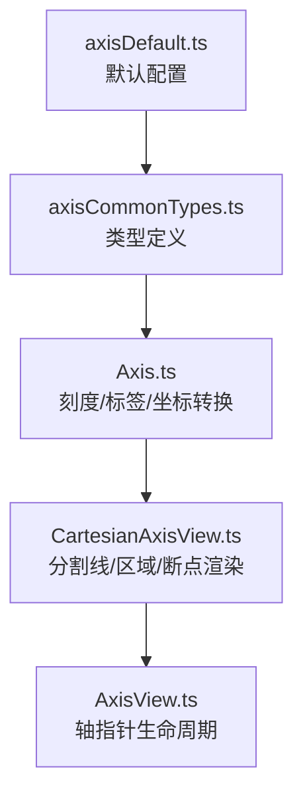
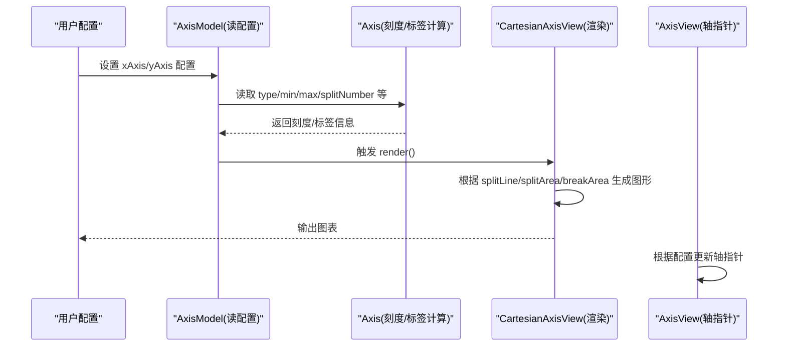
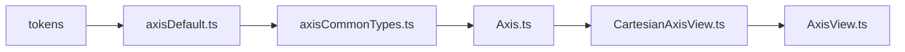

# 坐标轴配置项

<cite>
**本文引用的文件**
- [src/coord/axisDefault.ts](file://src/coord/axisDefault.ts)
- [src/coord/axisCommonTypes.ts](file://src/coord/axisCommonTypes.ts)
- [src/coord/Axis.ts](file://src/coord/Axis.ts)
- [src/component/axis/CartesianAxisView.ts](file://src/component/axis/CartesianAxisView.ts)
- [src/component/axis/AxisView.ts](file://src/component/axis/AxisView.ts)
- [test/axes.html](file://test/axes.html)
</cite>

## 目录
1. [简介](#简介)
2. [项目结构](#项目结构)
3. [核心组件](#核心组件)
4. [架构总览](#架构总览)
5. [详细组件分析](#详细组件分析)
6. [依赖关系分析](#依赖关系分析)
7. [性能考量](#性能考量)
8. [故障排查指南](#故障排查指南)
9. [结论](#结论)
10. [附录](#附录)

## 简介
本文件系统性梳理 ECharts 坐标轴（xAxis/yAxis）的配置体系，覆盖轴线、刻度、标签、分割线、分割区域等通用与类型相关配置，并说明 value/category/time/log 四类坐标轴的差异与典型用法。文档基于源码实现进行归纳，便于在工程实践中准确使用与扩展。

## 项目结构
坐标轴能力由“模型 + 视图 + 坐标系统”共同构成：
- 默认配置与类型定义集中在 coord 层，提供 axisDefault 与 axisCommonTypes。
- Axis 类负责刻度、标签计算与坐标转换。
- CartesianAxisView 负责在直角坐标系中渲染分割线、分割区域、断点区域等。
- AxisView 统一处理轴指针的挂载与更新。

**图示来源**
- [src/coord/axisDefault.ts:24-239](file://src/coord/axisDefault.ts#L24-L239)
- [src/coord/axisCommonTypes.ts:34-419](file://src/coord/axisCommonTypes.ts#L34-L419)
- [src/coord/Axis.ts:60-270](file://src/coord/Axis.ts#L60-L270)
- [src/component/axis/CartesianAxisView.ts:36-248](file://src/component/axis/CartesianAxisView.ts#L36-L248)
- [src/component/axis/AxisView.ts:36-127](file://src/component/axis/AxisView.ts#L36-L127)

**章节来源**
- [src/coord/axisDefault.ts:24-239](file://src/coord/axisDefault.ts#L24-L239)
- [src/coord/axisCommonTypes.ts:34-419](file://src/coord/axisCommonTypes.ts#L34-L419)
- [src/coord/Axis.ts:60-270](file://src/coord/Axis.ts#L60-L270)
- [src/component/axis/CartesianAxisView.ts:36-248](file://src/component/axis/CartesianAxisView.ts#L36-L248)
- [src/component/axis/AxisView.ts:36-127](file://src/component/axis/AxisView.ts#L36-L127)

## 核心组件
- 默认配置（axisDefault）：为 category/value/time/log 四类坐标轴提供默认样式与行为，包括 axisLine、axisTick、axisLabel、splitLine、splitArea、minorTick、minorSplitLine、breakArea 等。
- 类型定义（axisCommonTypes）：定义所有轴配置项的类型、可选值、回调签名以及不同轴类型的差异化字段。
- 轴对象（Axis）：提供刻度与标签的计算、坐标转换、区间判断、主/次刻度获取等能力。
- 视图（CartesianAxisView/AxisView）：负责将配置渲染为图形元素，管理分割线、分割区域、断点区域与轴指针。

**章节来源**
- [src/coord/axisDefault.ts:24-239](file://src/coord/axisDefault.ts#L24-L239)
- [src/coord/axisCommonTypes.ts:34-419](file://src/coord/axisCommonTypes.ts#L34-L419)
- [src/coord/Axis.ts:60-270](file://src/coord/Axis.ts#L60-L270)
- [src/component/axis/CartesianAxisView.ts:36-248](file://src/component/axis/CartesianAxisView.ts#L36-L248)
- [src/component/axis/AxisView.ts:36-127](file://src/component/axis/AxisView.ts#L36-L127)

## 架构总览
下图展示从配置到渲染的关键流程：模型读取配置 → 轴计算刻度/标签 → 视图绘制分割线与区域 → 轴指针联动。

**图示来源**
- [src/coord/axisDefault.ts:24-239](file://src/coord/axisDefault.ts#L24-L239)
- [src/coord/Axis.ts:167-231](file://src/coord/Axis.ts#L167-L231)
- [src/component/axis/CartesianAxisView.ts:48-79](file://src/component/axis/CartesianAxisView.ts#L48-L79)
- [src/component/axis/AxisView.ts:54-77](file://src/component/axis/AxisView.ts#L54-L77)

## 详细组件分析

### 通用配置项（适用于所有坐标轴）
- 显示与方向
  - show/inverse：控制是否显示与是否反向。
  - name/nameLocation/nameRotate/nameGap/nameTextStyle/nameTruncate/nameMoveOverlap：名称文本及其布局策略。
- 交互与提示
  - silent/triggerEvent：事件行为开关。
  - tooltip：轴上提示框开关。
  - axisPointer：轴指针配置（由 AxisView 统一管理）。
- 轴线（axisLine）
  - show/onZero/onZeroAxisIndex/symbol/symbolSize/symbolOffset/lineStyle/breakLine：轴线可见性、零点位置、箭头、线型、断点时是否显示断线等。
- 刻度（axisTick）
  - show/inside/length/lineStyle/customValues：刻度可见性、内外侧、长度、线型、自定义刻度值。
- 标签（axisLabel）
  - show/inside/rotate/showMinLabel/showMaxLabel/margin/hideOverlap/textMargin/color/formatter/interval/customValues：标签可见性、旋转、极值标签、间距、重叠隐藏、颜色、格式化器、间隔策略、自定义值。
- 分割线（splitLine）
  - show/showMinLine/showMaxLine/lineStyle/interval：网格线可见性、端点线、线型、间隔策略。
- 分割区域（splitArea）
  - show/areaStyle/interval：背景分块区域、颜色交替、间隔策略。
- 数值轴特有
  - boundaryGap/splitNumber/interval/minInterval/maxInterval/alignTicks/dataMin/dataMax：边界留白、刻度数量、间隔控制、对齐、数据范围参与计算。
- 对数轴特有
  - logBase：对数底数。
- 时间轴特有
  - axisLabel.rich：时间轴标签层级样式。
- 断点（breaks/breakArea/breakLabelLayout）
  - breaks：断点区间列表。
  - breakArea：断点区域样式与交互（如 expandOnClick）。
  - breakLabelLayout：断点附近标签避让策略。

**章节来源**
- [src/coord/axisDefault.ts:24-239](file://src/coord/axisDefault.ts#L24-L239)
- [src/coord/axisCommonTypes.ts:40-150](file://src/coord/axisCommonTypes.ts#L40-L150)
- [src/coord/axisCommonTypes.ts:159-245](file://src/coord/axisCommonTypes.ts#L159-L245)
- [src/coord/axisCommonTypes.ts:249-419](file://src/coord/axisCommonTypes.ts#L249-L419)

### 坐标轴类型与差异（type: value/category/time/log）
- category（类目轴）
  - boundaryGap：布尔值，决定是否在两端留白。
  - deduplication/jitter/jitterOverlap/jitterMargin：去重与抖动策略，用于大量类目或动画场景。
  - axisTick.alignWithLabel：当 boundaryGap 为 true 时，刻度是否与标签对齐。
  - axisLabel.interval：类目标签间隔策略。
  - splitLine.show：默认关闭。
- value（数值轴）
  - boundaryGap：数组形式，支持像素或百分比。
  - splitNumber：主刻度数量。
  - minorTick/minorSplitLine：次刻度与次分割线。
  - scale：是否强制包含零的策略。
- time（时间轴）
  - splitNumber：默认 6。
  - axisLabel.rich：时间轴标签层级样式。
  - splitLine.show：默认关闭。
- log（对数轴）
  - logBase：对数底数。
  - 继承数值轴的大部分特性。

**章节来源**
- [src/coord/axisDefault.ts:146-239](file://src/coord/axisDefault.ts#L146-L239)
- [src/coord/axisCommonTypes.ts:201-245](file://src/coord/axisCommonTypes.ts#L201-L245)

### 轴线（axisLine）详解
- onZero：控制轴线是否绘制在零点位置；可与另一轴的 min/max 配合，决定零点是否在可视范围内。
- symbol/symbolSize/symbolOffset：轴线两端的箭头样式与偏移。
- lineStyle：线条颜色、宽度、虚线等。
- breakLine：当存在 breaks 时，是否显示断线效果。

**章节来源**
- [src/coord/axisDefault.ts:60-73](file://src/coord/axisDefault.ts#L60-L73)
- [src/coord/axisCommonTypes.ts:253-264](file://src/coord/axisCommonTypes.ts#L253-L264)
- [test/axes.html:113-166](file://test/axes.html#L113-L166)

### 刻度（axisTick）与次刻度（minorTick）
- axisTick
  - inside：刻度在内侧或外侧。
  - length：刻度长度。
  - lineStyle：刻度线样式。
  - customValues：自定义刻度值数组。
  - interval：类目轴下的间隔策略。
  - alignWithLabel：类目轴下与标签对齐。
- minorTick（仅数值/时间/对数轴）
  - show/splitNumber/length/lineStyle：次刻度可见性、细分数量、长度、线型。

**章节来源**
- [src/coord/axisDefault.ts:74-83](file://src/coord/axisDefault.ts#L74-L83)
- [src/coord/axisDefault.ts:188-209](file://src/coord/axisDefault.ts#L188-L209)
- [src/coord/axisCommonTypes.ts:266-274](file://src/coord/axisCommonTypes.ts#L266-L274)
- [src/coord/axisCommonTypes.ts:370-375](file://src/coord/axisCommonTypes.ts#L370-L375)
- [src/coord/Axis.ts:203-225](file://src/coord/Axis.ts#L203-L225)

### 标签（axisLabel）详解
- 基础属性
  - show/inside/rotate/margin/hideOverlap/textMargin/color：可见性、内外侧、旋转、间距、重叠隐藏、文本边距、颜色。
  - showMinLabel/showMaxLabel/alignMinLabel/verticalAlignMinLabel 等：极值标签显示与对齐策略。
- 格式化
  - formatter：按轴类型提供不同的回调签名与参数（value/log/category/time），支持字符串模板与函数。
  - interval：类目轴下的标签间隔策略。
  - customValues：自定义标签值数组。
- 时间轴
  - rich：层级样式，支持 primary 等层级。

**章节来源**
- [src/coord/axisDefault.ts:84-103](file://src/coord/axisDefault.ts#L84-L103)
- [src/coord/axisDefault.ts:212-227](file://src/coord/axisDefault.ts#L212-L227)
- [src/coord/axisCommonTypes.ts:330-368](file://src/coord/axisCommonTypes.ts#L330-L368)
- [src/coord/axisCommonTypes.ts:276-328](file://src/coord/axisCommonTypes.ts#L276-L328)
- [src/coord/Axis.ts:227-236](file://src/coord/Axis.ts#L227-L236)

### 分割线（splitLine）与次分割线（minorSplitLine）
- splitLine
  - show/showMinLine/showMaxLine/lineStyle/interval：网格线可见性、端点线、线型、间隔策略。
  - 渲染逻辑：依据刻度坐标生成贯穿网格的线段，支持多色循环。
- minorSplitLine
  - show/lineStyle：次分割线可见性与样式。
  - 渲染逻辑：基于次刻度坐标生成更细密的网格线。

**章节来源**
- [src/coord/axisDefault.ts:104-122](file://src/coord/axisDefault.ts#L104-L122)
- [src/coord/axisDefault.ts:202-209](file://src/coord/axisDefault.ts#L202-L209)
- [src/coord/axisCommonTypes.ts:377-391](file://src/coord/axisCommonTypes.ts#L377-L391)
- [src/component/axis/CartesianAxisView.ts:98-221](file://src/component/axis/CartesianAxisView.ts#L98-L221)

### 分割区域（splitArea）
- show/areaStyle/interval：背景分块区域可见性、颜色交替、间隔策略。
- 渲染逻辑：根据刻度区间构建矩形区域，常用于强调区间。

**章节来源**
- [src/coord/axisDefault.ts:114-122](file://src/coord/axisDefault.ts#L114-L122)
- [src/coord/axisCommonTypes.ts:393-398](file://src/coord/axisCommonTypes.ts#L393-L398)
- [src/component/axis/CartesianAxisView.ts:223-225](file://src/component/axis/CartesianAxisView.ts#L223-L225)

### 断点（breaks/breakArea/breakLabelLayout）
- breaks：定义断点区间，用于跳过不连续的数据段。
- breakArea：断点区域的样式与交互（如 expandOnClick）。
- breakLabelLayout：断点附近标签的避让策略（moveOverlap）。
- 渲染逻辑：在非类目轴上启用断点区域渲染，结合轴指针与网格布局。

**章节来源**
- [src/coord/axisDefault.ts:123-142](file://src/coord/axisDefault.ts#L123-L142)
- [src/coord/axisCommonTypes.ts:132-144](file://src/coord/axisCommonTypes.ts#L132-L144)
- [src/component/axis/CartesianAxisView.ts:227-235](file://src/component/axis/CartesianAxisView.ts#L227-L235)

### 坐标轴类型选择与行为差异
- type 取值：value/category/time/log。
- 不同 type 的默认行为差异：
  - category：默认 boundaryGap 为 true，splitLine 默认关闭，刻度与标签间隔策略不同。
  - value：默认 boundaryGap 为 [0,0]，支持 splitNumber、minorTick/minorSplitLine。
  - time：默认 splitNumber=6，splitLine 默认关闭，支持 rich 层级样式。
  - log：继承 value 特性，增加 logBase。

**章节来源**
- [src/coord/axisDefault.ts:146-239](file://src/coord/axisDefault.ts#L146-L239)
- [src/coord/axisCommonTypes.ts:34-38](file://src/coord/axisCommonTypes.ts#L34-L38)
- [src/coord/axisCommonTypes.ts:201-245](file://src/coord/axisCommonTypes.ts#L201-L245)

### 坐标转换与刻度/标签计算
- 坐标转换：dataToCoord/coordToData 将数据与坐标相互转换，考虑 band 与边界。
- 刻度计算：getTicksCoords 基于刻度模型与断点策略生成刻度坐标。
- 标签计算：getViewLabels 生成标签信息，支持分类与时间轴的特殊处理。
- 次刻度：getMinorTicksCoords 为非类目轴提供次刻度坐标。

**章节来源**
- [src/coord/Axis.ts:136-231](file://src/coord/Axis.ts#L136-L231)
- [src/coord/Axis.ts:267-270](file://src/coord/Axis.ts#L267-L270)

### 轴指针（axisPointer）
- AxisView 负责轴指针的生命周期管理与渲染更新。
- 通过 updateAxisPointer 响应配置变化，确保指针与轴同步。

**章节来源**
- [src/component/axis/AxisView.ts:54-77](file://src/component/axis/AxisView.ts#L54-L77)
- [src/component/axis/AxisView.ts:95-109](file://src/component/axis/AxisView.ts#L95-L109)

## 依赖关系分析
- axisDefault 依赖 tokens 提供默认颜色，合并出 category/value/time/log 的默认配置。
- axisCommonTypes 定义所有配置项类型，被 Axis 与视图层引用。
- Axis 依赖 scale 系列实现刻度与坐标转换。
- CartesianAxisView 依赖 grid 与 axisSplitHelper 完成分割线与区域渲染。
- AxisView 依赖 axisPointer modelHelper 管理指针。

**图示来源**
- [src/coord/axisDefault.ts:20-23](file://src/coord/axisDefault.ts#L20-L23)
- [src/coord/axisDefault.ts:24-239](file://src/coord/axisDefault.ts#L24-L239)
- [src/coord/axisCommonTypes.ts:34-419](file://src/coord/axisCommonTypes.ts#L34-L419)
- [src/coord/Axis.ts:60-270](file://src/coord/Axis.ts#L60-L270)
- [src/component/axis/CartesianAxisView.ts:36-248](file://src/component/axis/CartesianAxisView.ts#L36-L248)
- [src/component/axis/AxisView.ts:36-127](file://src/component/axis/AxisView.ts#L36-L127)

**章节来源**
- [src/coord/axisDefault.ts:20-239](file://src/coord/axisDefault.ts#L20-L239)
- [src/coord/axisCommonTypes.ts:34-419](file://src/coord/axisCommonTypes.ts#L34-L419)
- [src/coord/Axis.ts:60-270](file://src/coord/Axis.ts#L60-L270)
- [src/component/axis/CartesianAxisView.ts:36-248](file://src/component/axis/CartesianAxisView.ts#L36-L248)
- [src/component/axis/AxisView.ts:36-127](file://src/component/axis/AxisView.ts#L36-L127)

## 性能考量
- 类目轴去重与抖动：deduplication/jitter/jitterOverlap/jitterMargin 可优化大数据量类目渲染与动画性能。
- 刻度数量控制：splitNumber/interval/minInterval/maxInterval 合理设置可减少计算与绘制开销。
- 隐藏不必要元素：splitLine/splitArea/minorTick/minorSplitLine 按需开启，避免多余图形。
- 标签重叠处理：hideOverlap/interval 减少标签碰撞与重排成本。
- 断点区域：breakArea 仅在必要时启用，避免复杂几何计算。

[本节为通用指导，无需特定文件来源]

## 故障排查指南
- 零点位置异常：检查 axisLine.onZero 与另一轴的 min/max 设置，确认零点是否在可视范围内。
- 刻度/标签不显示：确认 show 与 interval 设置，类目轴注意 alignWithLabel 与 boundaryGap 的组合。
- 分割线/区域未渲染：确认 splitLine/splitArea 的 show 与 interval，以及坐标轴是否为非类目轴（断点区域）。
- 时间轴标签格式不正确：检查 axisLabel.formatter 与 rich 层级配置。
- 轴指针不生效：确认 axisPointer 配置与 AxisView 的更新流程。

**章节来源**
- [test/axes.html:113-166](file://test/axes.html#L113-L166)
- [src/component/axis/CartesianAxisView.ts:98-221](file://src/component/axis/CartesianAxisView.ts#L98-L221)
- [src/component/axis/AxisView.ts:54-77](file://src/component/axis/AxisView.ts#L54-L77)

## 结论
ECharts 坐标轴通过统一的配置体系与类型化设计，提供了强大的可视化能力。理解 axisLine、axisTick、axisLabel、splitLine、splitArea 以及不同类型坐标轴的差异，是构建高质量图表的基础。结合性能与故障排查建议，可在实际项目中稳定高效地使用坐标轴组件。

[本节为总结，无需特定文件来源]

## 附录
- 常用组合示例参考：test/axes.html 展示了多种坐标轴方向、零点位置、位置设置的组合效果，可作为实践参考。

**章节来源**
- [test/axes.html:92-200](file://test/axes.html#L92-L200)