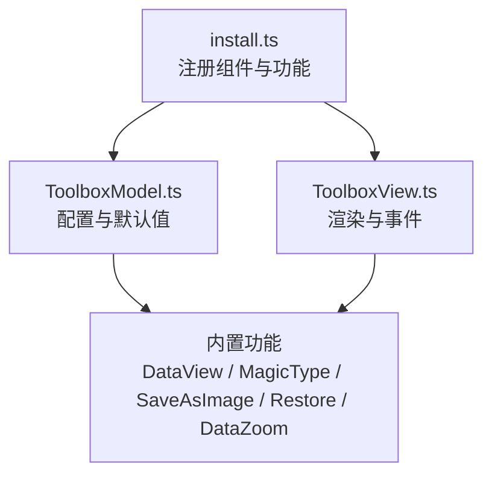
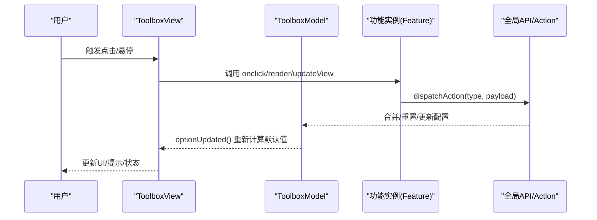
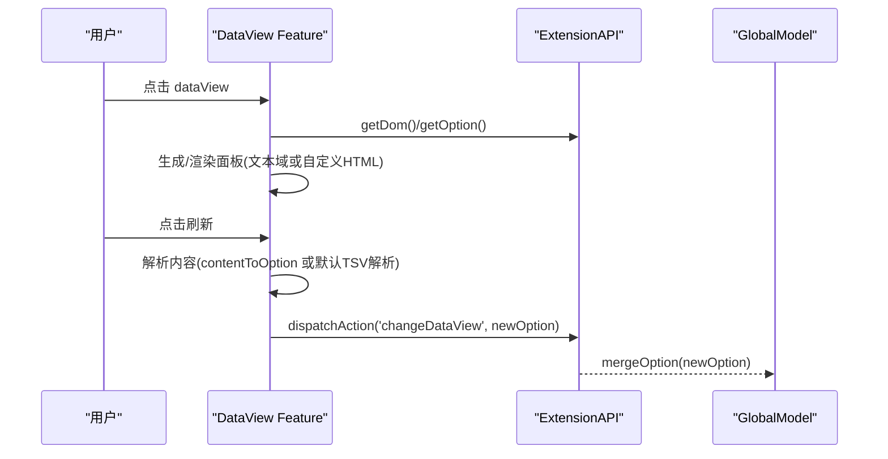
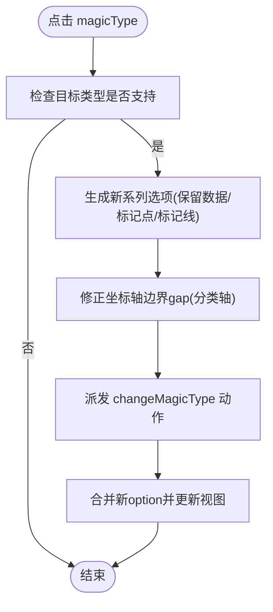
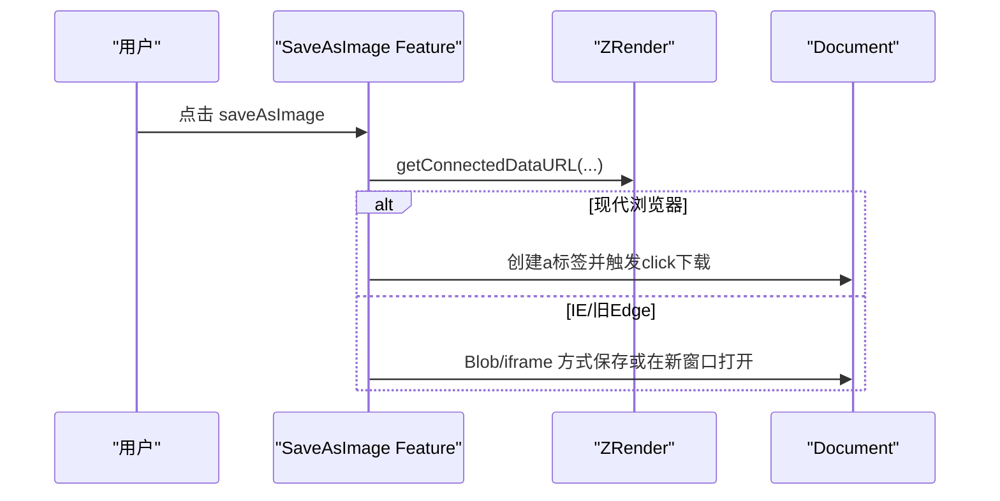
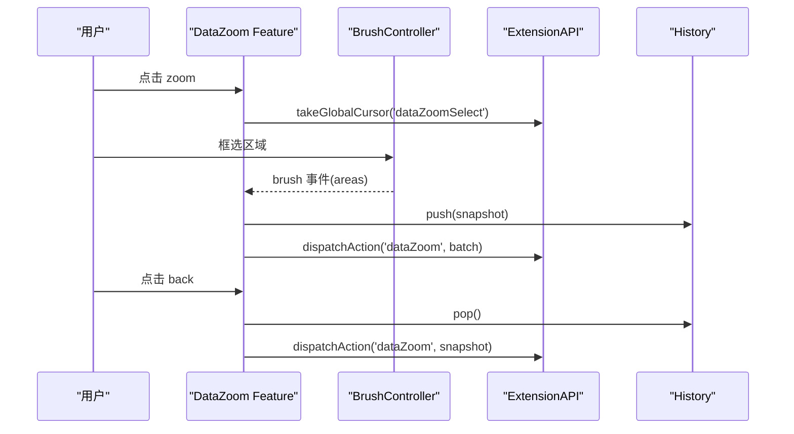
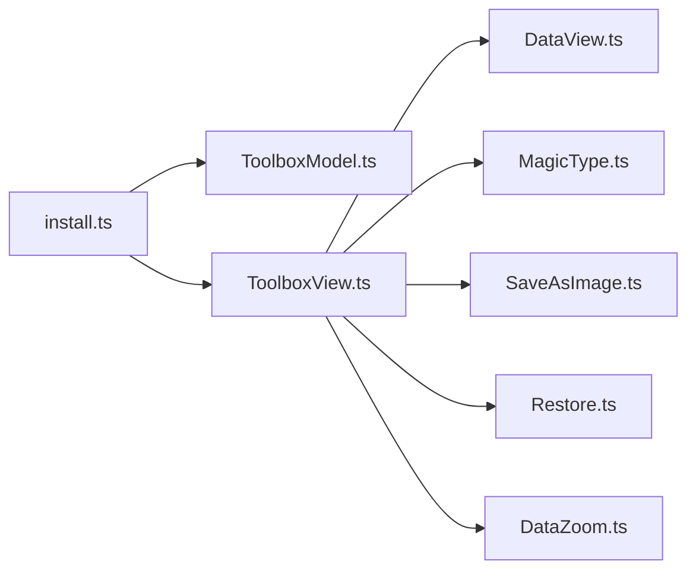

# 工具栏配置项

<cite>
**本文引用的文件**
- [src/component/toolbox.ts](file://src/component/toolbox.ts)
- [src/component/toolbox/install.ts](file://src/component/toolbox/install.ts)
- [src/component/toolbox/ToolboxModel.ts](file://src/component/toolbox/ToolboxModel.ts)
- [src/component/toolbox/ToolboxView.ts](file://src/component/toolbox/ToolboxView.ts)
- [src/component/toolbox/feature/DataView.ts](file://src/component/toolbox/feature/DataView.ts)
- [src/component/toolbox/feature/MagicType.ts](file://src/component/toolbox/feature/MagicType.ts)
- [src/component/toolbox/feature/SaveAsImage.ts](file://src/component/toolbox/feature/SaveAsImage.ts)
- [src/component/toolbox/feature/Restore.ts](file://src/component/toolbox/feature/Restore.ts)
- [src/component/toolbox/feature/DataZoom.ts](file://src/component/toolbox/feature/DataZoom.ts)
- [test/toolbox-custom.html](file://test/toolbox-custom.html)
- [test/toolbox-stack.html](file://test/toolbox-stack.html)
</cite>

## 目录
1. [简介](#简介)
2. [项目结构](#项目结构)
3. [核心组件](#核心组件)
4. [架构总览](#架构总览)
5. [详细组件分析](#详细组件分析)
6. [依赖关系分析](#依赖关系分析)
7. [性能考虑](#性能考虑)
8. [故障排查指南](#故障排查指南)
9. [结论](#结论)
10. [附录](#附录)

## 简介
本文件为 ECharts 工具栏（toolbox）组件的详细配置文档，覆盖基本配置、按钮与功能配置、图标样式、事件处理以及内置功能的完整使用方法。通过源码级分析，帮助读者准确理解 toolbox 的渲染流程、特性注册机制与各内置功能的交互方式。

## 项目结构
ECharts 的工具栏由“模型 + 视图 + 安装器 + 功能模块”构成：
- 安装器负责注册组件模型、视图及内置功能
- 模型定义配置项、默认值与主题合并逻辑
- 视图负责布局、图标创建、事件绑定与更新
- 功能模块实现具体行为（如数据视图、动态类型切换、保存图像、还原、数据缩放等）

图表来源
- [src/component/toolbox/install.ts:33-44](file://src/component/toolbox/install.ts#L33-L44)
- [src/component/toolbox/ToolboxModel.ts:88-197](file://src/component/toolbox/ToolboxModel.ts#L88-L197)
- [src/component/toolbox/ToolboxView.ts:53-408](file://src/component/toolbox/ToolboxView.ts#L53-L408)

章节来源
- [src/component/toolbox/install.ts:33-44](file://src/component/toolbox/install.ts#L33-L44)
- [src/component/toolbox/ToolboxModel.ts:88-197](file://src/component/toolbox/ToolboxModel.ts#L88-L197)
- [src/component/toolbox/ToolboxView.ts:53-408](file://src/component/toolbox/ToolboxView.ts#L53-L408)

## 核心组件
- 安装器 install.ts：注册 Toolbox 模型与视图，并注册内置功能 saveAsImage、magicType、dataView、dataZoom、restore；同时启用 dataZoom 选择模式。
- 模型 ToolboxModel.ts：定义 toolbox 的配置项接口、默认值、布局模式、主题合并策略与 feature 默认选项注入。
- 视图 ToolboxView.ts：根据 show/orient/layout 进行布局，按 feature 列表增量创建/更新/移除图标，处理 hover/emphasis、tooltip、点击事件，调用各功能的 onclick/render/dispose。

章节来源
- [src/component/toolbox/install.ts:33-44](file://src/component/toolbox/install.ts#L33-L44)
- [src/component/toolbox/ToolboxModel.ts:88-197](file://src/component/toolbox/ToolboxModel.ts#L88-L197)
- [src/component/toolbox/ToolboxView.ts:53-408](file://src/component/toolbox/ToolboxView.ts#L53-L408)

## 架构总览
下图展示了从配置到渲染再到用户交互的整体流程：

图表来源
- [src/component/toolbox/ToolboxView.ts:166-178](file://src/component/toolbox/ToolboxView.ts#L166-L178)
- [src/component/toolbox/ToolboxView.ts:303-305](file://src/component/toolbox/ToolboxView.ts#L303-L305)
- [src/component/toolbox/feature/DataView.ts:323-448](file://src/component/toolbox/feature/DataView.ts#L323-L448)
- [src/component/toolbox/feature/MagicType.ts:98-181](file://src/component/toolbox/feature/MagicType.ts#L98-L181)
- [src/component/toolbox/feature/SaveAsImage.ts:47-126](file://src/component/toolbox/feature/SaveAsImage.ts#L47-L126)
- [src/component/toolbox/feature/Restore.ts:33-40](file://src/component/toolbox/feature/Restore.ts#L33-L40)
- [src/component/toolbox/feature/DataZoom.ts:84-112](file://src/component/toolbox/feature/DataZoom.ts#L84-L112)

## 详细组件分析

### 工具栏基本配置（show、orient、layout、iconStyle、textStyle、tooltip）
- 显示与布局
  - show：是否显示工具栏
  - orient：水平或垂直排列
  - layout：基于 box 布局，支持 left/top/right/bottom、padding、itemSize、itemGap
  - z/zlevel：层级控制
- 外观
  - backgroundColor、borderColor、borderRadius、borderWidth
  - iconStyle：图标样式（含 emphasis.iconStyle）
  - textStyle：文本样式
  - tooltip：工具栏内按钮的提示框配置
- 主题与默认值
  - 默认值在模型中集中定义，包含尺寸、颜色、标题显示等
  - 主题中的 toolbox.feature 会在初始化时合并一次，避免后续 setOption 覆盖

章节来源
- [src/component/toolbox/ToolboxModel.ts:47-86](file://src/component/toolbox/ToolboxModel.ts#L47-L86)
- [src/component/toolbox/ToolboxModel.ts:100-141](file://src/component/toolbox/ToolboxModel.ts#L100-L141)
- [src/component/toolbox/ToolboxModel.ts:143-193](file://src/component/toolbox/ToolboxModel.ts#L143-L193)
- [src/component/toolbox/ToolboxView.ts:66-101](file://src/component/toolbox/ToolboxView.ts#L66-L101)
- [src/component/toolbox/ToolboxView.ts:181-308](file://src/component/toolbox/ToolboxView.ts#L181-L308)
- [src/component/toolbox/ToolboxView.ts:311-335](file://src/component/toolbox/ToolboxView.ts#L311-L335)

### 按钮与功能配置（feature）
- 通用属性
  - show：是否显示该功能按钮
  - title：按钮标题（可字符串或按图标名映射的对象）
  - icon：图标路径（可字符串或按图标名映射的对象）
  - onclick：自定义点击回调（仅用户自定义功能 my*）
- 内置功能键名
  - saveAsImage、magicType、dataView、dataZoom、restore
- 主题与默认值注入
  - 每个功能提供 getDefaultOption，并在 optionUpdated 时合并到最终配置

章节来源
- [src/component/toolbox/ToolboxModel.ts:125-141](file://src/component/toolbox/ToolboxModel.ts#L125-L141)
- [src/component/toolbox/ToolboxView.ts:103-179](file://src/component/toolbox/ToolboxView.ts#L103-L179)

### 图标样式与高亮（iconStyle、emphasis）
- 每个功能可独立设置 iconStyle 与 emphasis.iconStyle
- 视图会为每个图标创建 emphasis 状态，并在鼠标进入/离开时切换
- 文本标签位置与背景色会根据布局自动调整，避免溢出

章节来源
- [src/component/toolbox/ToolboxView.ts:181-308](file://src/component/toolbox/ToolboxView.ts#L181-L308)
- [src/component/toolbox/ToolboxView.ts:337-371](file://src/component/toolbox/ToolboxView.ts#L337-L371)

### 事件处理（onclick、tooltip）
- 点击事件
  - 内置功能通过各自的 onclick 实现业务逻辑，并通过 api.dispatchAction 触发全局动作
  - 用户自定义功能（my*）可直接在 feature.myXxx.onclick 中编写逻辑
- 提示框
  - 每个图标会绑定 tooltip，formatterParamsExtra 包含 title 等信息
  - 可通过 toolbox.tooltip 统一控制提示框行为

章节来源
- [src/component/toolbox/ToolboxView.ts:256-305](file://src/component/toolbox/ToolboxView.ts#L256-L305)
- [src/component/toolbox/ToolboxModel.ts:74-81](file://src/component/toolbox/ToolboxModel.ts#L74-L81)

### 内置功能详解

#### 数据视图（dataView）
- 作用：以可编辑/只读面板展示当前图表数据，支持将修改后的内容回写为新的 option
- 关键配置
  - readOnly：是否只读
  - optionToContent：将 option 转为 HTML/DOM
  - contentToOption：将面板内容解析为新的 option
  - lang：本地化文案数组（关闭、刷新等）
  - 样式：backgroundColor、textColor、textareaColor、textareaBorderColor、buttonColor、buttonTextColor
- 交互流程
  - 点击打开面板，默认使用 TSV/列表格式文本域
  - 点击刷新后，若提供了 contentToOption，则解析新数据并派发 changeDataView 动作
  - 动作处理器合并 series 数据，必要时推断系列类型

图表来源
- [src/component/toolbox/feature/DataView.ts:323-448](file://src/component/toolbox/feature/DataView.ts#L323-L448)
- [src/component/toolbox/feature/DataView.ts:505-533](file://src/component/toolbox/feature/DataView.ts#L505-L533)

章节来源
- [src/component/toolbox/feature/DataView.ts:299-474](file://src/component/toolbox/feature/DataView.ts#L299-L474)
- [src/component/toolbox/feature/DataView.ts:505-533](file://src/component/toolbox/feature/DataView.ts#L505-L533)

#### 动态类型切换（magicType）
- 作用：在折线图、柱状图、堆叠/平铺之间快速切换
- 关键配置
  - type：支持的类型集合（line、bar、stack）
  - icon/title：按类型映射的图标与标题
  - option：每种类型的系列选项覆盖
  - seriesIndex：指定受影响的系列索引
- 交互流程
  - 点击某类型，更新对应系列的 type/stack/markPoint/markLine 等
  - 对直角坐标系分类轴，自动设置 boundaryGap
  - 派发 changeMagicType 动作，合并新 option

图表来源
- [src/component/toolbox/feature/MagicType.ts:98-181](file://src/component/toolbox/feature/MagicType.ts#L98-L181)
- [src/component/toolbox/feature/MagicType.ts:199-236](file://src/component/toolbox/feature/MagicType.ts#L199-L236)
- [src/component/toolbox/feature/MagicType.ts:239-246](file://src/component/toolbox/feature/MagicType.ts#L239-L246)

章节来源
- [src/component/toolbox/feature/MagicType.ts:43-96](file://src/component/toolbox/feature/MagicType.ts#L43-L96)
- [src/component/toolbox/feature/MagicType.ts:98-181](file://src/component/toolbox/feature/MagicType.ts#L98-L181)
- [src/component/toolbox/feature/MagicType.ts:199-246](file://src/component/toolbox/feature/MagicType.ts#L199-L246)

#### 保存图像（saveAsImage）
- 作用：导出当前图表为图片（png/jpeg/svg），兼容不同浏览器
- 关键配置
  - type：导出类型（svg/png/jpeg）
  - backgroundColor/connectedBackgroundColor：背景色
  - name：文件名前缀
  - excludeComponents：排除导出的组件（默认排除 toolbox）
  - pixelRatio：像素比
  - lang：本地化文案
- 交互流程
  - 获取连接画布数据 URL，按浏览器能力选择下载/另存/新窗口打开

图表来源
- [src/component/toolbox/feature/SaveAsImage.ts:47-126](file://src/component/toolbox/feature/SaveAsImage.ts#L47-L126)
- [src/component/toolbox/feature/SaveAsImage.ts:128-145](file://src/component/toolbox/feature/SaveAsImage.ts#L128-L145)

章节来源
- [src/component/toolbox/feature/SaveAsImage.ts:29-43](file://src/component/toolbox/feature/SaveAsImage.ts#L29-L43)
- [src/component/toolbox/feature/SaveAsImage.ts:47-126](file://src/component/toolbox/feature/SaveAsImage.ts#L47-L126)
- [src/component/toolbox/feature/SaveAsImage.ts:128-145](file://src/component/toolbox/feature/SaveAsImage.ts#L128-L145)

#### 还原（restore）
- 作用：清空历史并恢复初始配置
- 交互流程
  - 清除 dataZoom 历史
  - 派发 restore 动作，重置选项

章节来源
- [src/component/toolbox/feature/Restore.ts:31-60](file://src/component/toolbox/feature/Restore.ts#L31-L60)

#### 数据缩放（dataZoom）
- 作用：通过框选/拖拽进行数据缩放，支持返回上一状态
- 关键配置
  - type：['zoom','back']
  - icon/title：按类型映射
  - filterMode：过滤模式（filter/weakFilter/empty/none）
  - xAxisIndex/yAxisIndex/xAxisId/yAxisId：限定作用的坐标轴
  - brushStyle：框选样式
- 交互流程
  - render 时挂载 BrushController，监听 brush 事件
  - 将框选范围转换为数据范围，限制最小/最大跨度并取整
  - 派发 dataZoom 批量动作，记录历史以便 back 返回
  - 自动生成内部 select 型 dataZoom 组件用于响应框选

图表来源
- [src/component/toolbox/feature/DataZoom.ts:84-112](file://src/component/toolbox/feature/DataZoom.ts#L84-L112)
- [src/component/toolbox/feature/DataZoom.ts:114-214](file://src/component/toolbox/feature/DataZoom.ts#L114-L214)
- [src/component/toolbox/feature/DataZoom.ts:237-328](file://src/component/toolbox/feature/DataZoom.ts#L237-L328)
- [src/component/toolbox/feature/DataZoom.ts:330-365](file://src/component/toolbox/feature/DataZoom.ts#L330-L365)

章节来源
- [src/component/toolbox/feature/DataZoom.ts:61-74](file://src/component/toolbox/feature/DataZoom.ts#L61-L74)
- [src/component/toolbox/feature/DataZoom.ts:84-112](file://src/component/toolbox/feature/DataZoom.ts#L84-L112)
- [src/component/toolbox/feature/DataZoom.ts:114-214](file://src/component/toolbox/feature/DataZoom.ts#L114-L214)
- [src/component/toolbox/feature/DataZoom.ts:216-234](file://src/component/toolbox/feature/DataZoom.ts#L216-L234)
- [src/component/toolbox/feature/DataZoom.ts:237-328](file://src/component/toolbox/feature/DataZoom.ts#L237-L328)
- [src/component/toolbox/feature/DataZoom.ts:330-365](file://src/component/toolbox/feature/DataZoom.ts#L330-L365)

### 自定义功能（my*）
- 名称必须以 my 开头，例如 myTool1
- 可配置 show、title、icon、onclick
- 视图会将 my* 视为用户自定义功能，直接绑定 onclick

章节来源
- [src/component/toolbox/ToolboxView.ts:120-138](file://src/component/toolbox/ToolboxView.ts#L120-L138)
- [src/component/toolbox/ToolboxView.ts:399-401](file://src/component/toolbox/ToolboxView.ts#L399-L401)
- [test/toolbox-custom.html:58-74](file://test/toolbox-custom.html#L58-L74)

## 依赖关系分析
- 安装器依赖：注册组件模型/视图，并注册内置功能；同时启用 dataZoom 选择模式
- 模型依赖：类型定义、布局混合、主题 tokens、全局模型
- 视图依赖：zrender 图形、布局工具、状态管理、扩展 API
- 功能模块依赖：各自实现 onclick/render/dispose，并通过 action 与全局模型交互

图表来源
- [src/component/toolbox/install.ts:33-44](file://src/component/toolbox/install.ts#L33-L44)
- [src/component/toolbox/ToolboxModel.ts:88-197](file://src/component/toolbox/ToolboxModel.ts#L88-L197)
- [src/component/toolbox/ToolboxView.ts:53-408](file://src/component/toolbox/ToolboxView.ts#L53-L408)

章节来源
- [src/component/toolbox/install.ts:33-44](file://src/component/toolbox/install.ts#L33-L44)
- [src/component/toolbox/ToolboxModel.ts:88-197](file://src/component/toolbox/ToolboxModel.ts#L88-L197)
- [src/component/toolbox/ToolboxView.ts:53-408](file://src/component/toolbox/ToolboxView.ts#L53-L408)

## 性能考虑
- 增量更新：视图使用 DataDiffer 对比 feature 列表，仅对新增/更新/移除进行处理，减少重绘
- 布局优化：先布局再绘制背景，避免重复计算；文本标签位置自动调整防止溢出
- 历史与快照：dataZoom 使用历史快照，避免频繁全量更新
- 导出优化：saveAsImage 根据渲染器类型选择最优导出方式，减少不必要的转换

[本节为通用指导，不直接分析具体文件]

## 故障排查指南
- dataView 刷新无效
  - 现象：点击刷新无变化
  - 原因：仅提供了 optionToContent 或 contentToOption 之一
  - 解决：成对提供两个回调，确保能双向转换
  - 参考：警告提示与关闭逻辑
- dataZoom 框选无效果
  - 现象：框选后未缩放
  - 原因：未启用 dataZoom 选择模式或未匹配到坐标轴
  - 解决：确保已启用 dataZoom 选择模式，且 xAxisIndex/yAxisIndex 正确
- 保存图像失败
  - 现象：点击无反应或无法下载
  - 原因：浏览器不支持或跨域资源限制
  - 解决：检查浏览器兼容性，必要时使用 SVG 导出或后端处理

章节来源
- [src/component/toolbox/feature/DataView.ts:398-427](file://src/component/toolbox/feature/DataView.ts#L398-L427)
- [src/component/toolbox/feature/DataZoom.ts:237-328](file://src/component/toolbox/feature/DataZoom.ts#L237-L328)
- [src/component/toolbox/feature/SaveAsImage.ts:60-126](file://src/component/toolbox/feature/SaveAsImage.ts#L60-L126)

## 结论
ECharts 工具栏通过清晰的模型/视图分离与可扩展的功能注册机制，提供了强大的交互能力。掌握基本配置、内置功能与自定义扩展方法，即可灵活构建符合业务需求的图表工具栏。建议在实际项目中结合主题与国际化，合理配置各功能，以获得一致的用户体验。

[本节为总结性内容，不直接分析具体文件]

## 附录
- 示例页面
  - 自定义工具栏按钮与主题：[test/toolbox-custom.html](file://test/toolbox-custom.html)
  - 动态类型切换示例：[test/toolbox-stack.html](file://test/toolbox-stack.html)

章节来源
- [test/toolbox-custom.html:48-75](file://test/toolbox-custom.html#L48-L75)
- [test/toolbox-stack.html:69-83](file://test/toolbox-stack.html#L69-L83)