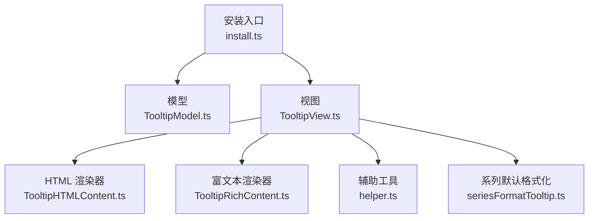
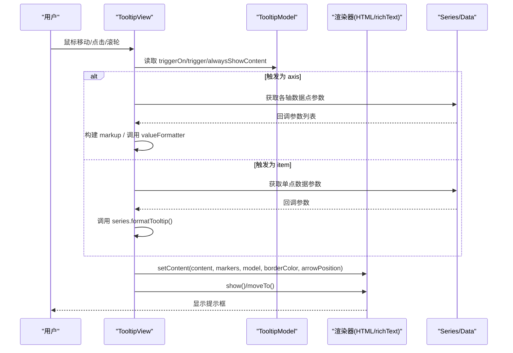
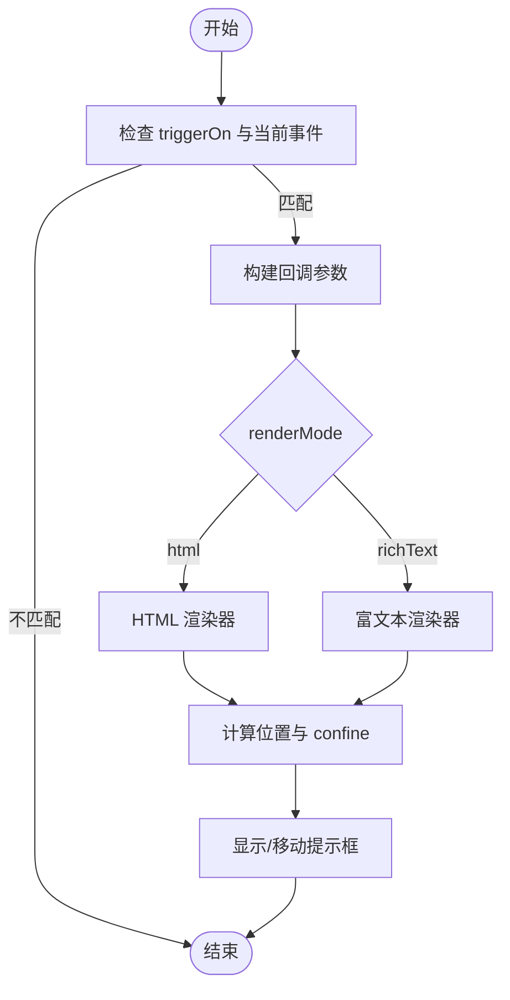
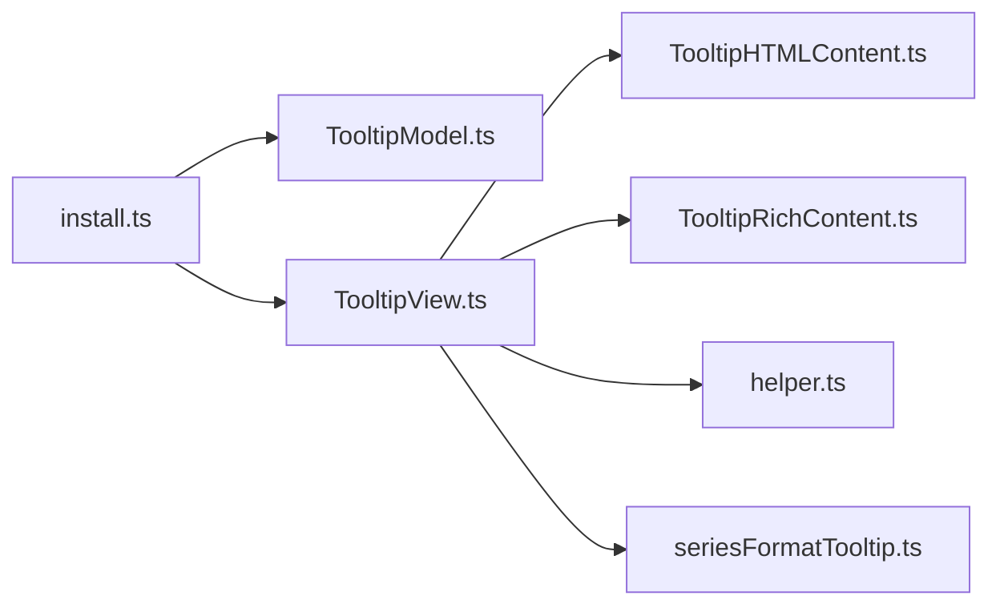

# 提示框配置项

<cite>
**本文引用的文件**
- [src/component/tooltip.ts](file://src/component/tooltip.ts)
- [src/component/tooltip/install.ts](file://src/component/tooltip/install.ts)
- [src/component/tooltip/TooltipModel.ts](file://src/component/tooltip/TooltipModel.ts)
- [src/component/tooltip/TooltipView.ts](file://src/component/tooltip/TooltipView.ts)
- [src/component/tooltip/TooltipHTMLContent.ts](file://src/component/tooltip/TooltipHTMLContent.ts)
- [src/component/tooltip/TooltipRichContent.ts](file://src/component/tooltip/TooltipRichContent.ts)
- [src/component/tooltip/helper.ts](file://src/component/tooltip/helper.ts)
- [src/component/tooltip/seriesFormatTooltip.ts](file://src/component/tooltip/seriesFormatTooltip.ts)
- [test/tooltip.html](file://test/tooltip.html)
- [test/tooltip-rich.html](file://test/tooltip-rich.html)
</cite>

## 目录
1. [简介](#简介)
2. [项目结构](#项目结构)
3. [核心组件](#核心组件)
4. [架构总览](#架构总览)
5. [详细组件分析](#详细组件分析)
6. [依赖关系分析](#依赖关系分析)
7. [性能考量](#性能考量)
8. [故障排查指南](#故障排查指南)
9. [结论](#结论)
10. [附录](#附录)

## 简介
本文件系统性梳理 ECharts 提示框（tooltip）组件的全部配置项与行为，覆盖触发方式、显示位置、内容格式化、样式与边框、背景与阴影、进入/隐藏动画、自定义 HTML 内容等。同时说明不同图表类型下的提示框行为差异，以及复杂数据格式化的方法与实践建议。

## 项目结构
ECharts 的 tooltip 以“模型-视图”模式组织：
- 模型层：定义默认选项与配置项类型（TooltipModel）。
- 视图层：负责渲染与交互（TooltipView），并选择 HTML 或 richText 两种渲染后端（TooltipHTMLContent / TooltipRichContent）。
- 工具与辅助：包含 confine 策略、系列默认格式化逻辑等。

图示来源
- [src/component/tooltip/install.ts:26-56](file://src/component/tooltip/install.ts#L26-L56)
- [src/component/tooltip/TooltipModel.ts:88-187](file://src/component/tooltip/TooltipModel.ts#L88-L187)
- [src/component/tooltip/TooltipView.ts:164-217](file://src/component/tooltip/TooltipView.ts#L164-L217)
- [src/component/tooltip/TooltipHTMLContent.ts:270-330](file://src/component/tooltip/TooltipHTMLContent.ts#L270-L330)
- [src/component/tooltip/TooltipRichContent.ts:30-64](file://src/component/tooltip/TooltipRichContent.ts#L30-L64)
- [src/component/tooltip/helper.ts:27-33](file://src/component/tooltip/helper.ts#L27-L33)
- [src/component/tooltip/seriesFormatTooltip.ts:33-101](file://src/component/tooltip/seriesFormatTooltip.ts#L33-L101)

章节来源
- [src/component/tooltip/install.ts:26-56](file://src/component/tooltip/install.ts#L26-L56)
- [src/component/tooltip/TooltipModel.ts:88-187](file://src/component/tooltip/TooltipModel.ts#L88-L187)
- [src/component/tooltip/TooltipView.ts:164-217](file://src/component/tooltip/TooltipView.ts#L164-L217)

## 核心组件
- 模型（TooltipModel）：集中声明 tooltip 的所有配置项与默认值，包括 trigger、triggerOn、position、confine、formatter、rich、textStyle、borderColor、borderWidth、backgroundColor、showDelay、hideDelay、transitionDuration、displayTransition、enterable、appendBody/appendTo、className、defaultBorderColor、order、axisPointer 等。
- 视图（TooltipView）：监听事件、组装数据、调用 formatter、计算位置、控制显隐、切换渲染模式。
- 渲染器：
  - HTML：基于 DOM 元素，支持自定义 HTML 内容、CSS 过渡、箭头、附加到 body 等。
  - richText：基于 ZRender 文本对象，支持 rich 文本样式、阴影、圆角等，且默认受 confine 限制。
- 辅助：shouldTooltipConfine 决定 confine 是否生效；seriesFormatTooltip 提供系列默认格式化逻辑。

章节来源
- [src/component/tooltip/TooltipModel.ts:36-86](file://src/component/tooltip/TooltipModel.ts#L36-L86)
- [src/component/tooltip/TooltipModel.ts:94-187](file://src/component/tooltip/TooltipModel.ts#L94-L187)
- [src/component/tooltip/TooltipView.ts:138-217](file://src/component/tooltip/TooltipView.ts#L138-L217)
- [src/component/tooltip/TooltipHTMLContent.ts:270-330](file://src/component/tooltip/TooltipHTMLContent.ts#L270-L330)
- [src/component/tooltip/TooltipRichContent.ts:30-64](file://src/component/tooltip/TooltipRichContent.ts#L30-L64)
- [src/component/tooltip/helper.ts:27-33](file://src/component/tooltip/helper.ts#L27-L33)
- [src/component/tooltip/seriesFormatTooltip.ts:33-101](file://src/component/tooltip/seriesFormatTooltip.ts#L33-L101)

## 架构总览
下图展示从事件触发到提示框显示的完整流程，涵盖 item/axis 两种触发路径、formatter 处理、位置计算与渲染。

图示来源
- [src/component/tooltip/TooltipView.ts:219-237](file://src/component/tooltip/TooltipView.ts#L219-L237)
- [src/component/tooltip/TooltipView.ts:533-657](file://src/component/tooltip/TooltipView.ts#L533-L657)
- [src/component/tooltip/TooltipView.ts:659-738](file://src/component/tooltip/TooltipView.ts#L659-L738)
- [src/component/tooltip/TooltipHTMLContent.ts:404-475](file://src/component/tooltip/TooltipHTMLContent.ts#L404-L475)
- [src/component/tooltip/TooltipRichContent.ts:78-139](file://src/component/tooltip/TooltipRichContent.ts#L78-L139)

## 详细组件分析

### 触发与显示控制
- trigger：item | axis | none。item 针对单个数据点；axis 针对坐标轴上所有系列同一点；none 表示不自动触发，可配合 API 手动控制。
- triggerOn：mousemove|click|mousewheel|none 的组合，控制响应的事件类型。
- alwaysShowContent：始终显示提示框，常用于固定信息面板。
- enterable：允许鼠标移入提示框内容区域，移出后按 hideDelay 隐藏。
- showDelay/hideDelay：显示/隐藏延迟时间。
- transitionDuration/displayTransition：提示框出现/移动的过渡时长与是否启用显示过渡。

章节来源
- [src/component/tooltip/TooltipModel.ts:94-187](file://src/component/tooltip/TooltipModel.ts#L94-L187)
- [src/component/tooltip/TooltipView.ts:219-237](file://src/component/tooltip/TooltipView.ts#L219-L237)
- [src/component/tooltip/TooltipView.ts:517-531](file://src/component/tooltip/TooltipView.ts#L517-L531)

### 位置与边界
- position：支持字符串（如 'top'/'bottom'/'left'/'right'/'inside'）、函数或数组。用于定位提示框相对目标的位置。
- confine：当为 true 或在 richText 模式下，提示框会被限制在可视区域内，避免溢出屏幕。
- appendTo/appendToBody：将提示框 DOM 挂载到指定容器或 body，便于层级与滚动场景控制。
- className：为提示框 DOM 添加类名，便于 CSS 定制。

章节来源
- [src/component/tooltip/TooltipModel.ts:60-86](file://src/component/tooltip/TooltipModel.ts#L60-L86)
- [src/component/tooltip/helper.ts:27-33](file://src/component/tooltip/helper.ts#L27-L33)
- [src/component/tooltip/TooltipHTMLContent.ts:301-330](file://src/component/tooltip/TooltipHTMLContent.ts#L301-L330)

### 内容与格式化
- formatter：支持字符串模板或回调函数，接收回调参数（含 name/value/marker/axisValue 等），返回字符串或结构化片段。
- valueFormatter：对数值进行统一格式化（例如千分位、单位转换）。
- rich：在 richText 模式下使用 rich 文本样式实现富文本排版。
- 系列默认格式化：未自定义 formatter 时，由 seriesFormatTooltip 生成“名称+值”的结构化内容，支持多维值与排序。

章节来源
- [src/component/tooltip/TooltipView.ts:533-657](file://src/component/tooltip/TooltipView.ts#L533-L657)
- [src/component/tooltip/TooltipView.ts:659-738](file://src/component/tooltip/TooltipView.ts#L659-L738)
- [src/component/tooltip/seriesFormatTooltip.ts:33-101](file://src/component/tooltip/seriesFormatTooltip.ts#L33-L101)
- [src/component/tooltip/TooltipRichContent.ts:78-139](file://src/component/tooltip/TooltipRichContent.ts#L78-L139)

### 样式与外观
- textStyle：字体颜色、字号、行高、对齐、装饰线、文字阴影等。
- backgroundColor：背景色。
- borderColor/borderWidth/borderRadius：边框颜色、宽度、圆角。
- shadowColor/shadowBlur/shadowOffsetX/shadowOffsetY：阴影效果。
- padding：内边距，支持数组或对象。
- extraCssText：额外注入的 CSS 文本。
- defaultBorderColor：多系列时的默认边框颜色。

章节来源
- [src/component/tooltip/TooltipModel.ts:131-187](file://src/component/tooltip/TooltipModel.ts#L131-L187)
- [src/component/tooltip/TooltipHTMLContent.ts:182-226](file://src/component/tooltip/TooltipHTMLContent.ts#L182-L226)
- [src/component/tooltip/TooltipRichContent.ts:94-118](file://src/component/tooltip/TooltipRichContent.ts#L94-L118)

### 轴指示器（axisPointer）
- type：line/shadow/cross。
- axis：x/y/angle/radius/auto，决定十字线或标尺所在轴。
- crossStyle：十字线的样式（颜色、宽度、虚线等）。
- 与 tooltip.trigger='axis' 配合，可在轴上联动显示多个系列的数据。

章节来源
- [src/component/tooltip/TooltipModel.ts:39-45](file://src/component/tooltip/TooltipModel.ts#L39-L45)
- [src/component/tooltip/TooltipModel.ts:155-182](file://src/component/tooltip/TooltipModel.ts#L155-L182)

### 渲染模式差异
- renderMode：auto/html/richText。
  - html：基于 DOM，支持自定义 HTML 内容、CSS 过渡、箭头、appendToBody 等。
  - richText：基于 ZRender 文本，支持 rich 文本样式、阴影、圆角，且默认 confine 生效。
- 在 richText 模式下，不支持传入 DOM 节点作为 content。

章节来源
- [src/component/tooltip/TooltipModel.ts:55-60](file://src/component/tooltip/TooltipModel.ts#L55-L60)
- [src/component/tooltip/TooltipView.ts:164-177](file://src/component/tooltip/TooltipView.ts#L164-L177)
- [src/component/tooltip/TooltipRichContent.ts:85-87](file://src/component/tooltip/TooltipRichContent.ts#L85-L87)

### 不同图表类型的提示框行为
- 柱状图/折线图/散点图等笛卡尔坐标系：
  - trigger='axis' 时，同一 x 值的多条系列会合并显示，支持排序与 valueFormatter。
  - 可通过 axisPointer 增强交互体验。
- 饼图/环形图/玫瑰图等极坐标：
  - 通常使用 trigger='item'，每个扇区独立显示。
- 地图/地理坐标系：
  - 支持 geo/region 级别的 tooltip，常结合 dataZoom/visualMap 使用。
- 树图/桑基图/关系图：
  - 节点/边均可设置 tooltip，支持自定义 formatter 输出丰富信息。

章节来源
- [src/component/tooltip/TooltipView.ts:533-657](file://src/component/tooltip/TooltipView.ts#L533-L657)
- [src/component/tooltip/TooltipView.ts:659-738](file://src/component/tooltip/TooltipView.ts#L659-L738)
- [test/tooltip.html:78-138](file://test/tooltip.html#L78-L138)

### 复杂数据格式化方法
- 多维值：当数据为数组或多维维度时，默认会将各维度分别列出，支持按首项值排序。
- 自定义 formatter：通过回调函数拼接任意 HTML 或 rich 文本，可使用 marker 占位符保持与系列颜色一致。
- valueFormatter：对数值进行统一格式化（如百分比、货币、时间）。
- 组件级 tooltip：非系列元素（如图例、标记点）也可提供 tooltip，支持 encodeHTMLContent 安全编码。

章节来源
- [src/component/tooltip/seriesFormatTooltip.ts:33-101](file://src/component/tooltip/seriesFormatTooltip.ts#L33-L101)
- [src/component/tooltip/seriesFormatTooltip.ts:103-156](file://src/component/tooltip/seriesFormatTooltip.ts#L103-L156)
- [src/component/tooltip/TooltipView.ts:740-800](file://src/component/tooltip/TooltipView.ts#L740-L800)

### 流程图：提示框显示决策

图示来源
- [src/component/tooltip/TooltipView.ts:219-237](file://src/component/tooltip/TooltipView.ts#L219-L237)
- [src/component/tooltip/TooltipView.ts:517-531](file://src/component/tooltip/TooltipView.ts#L517-L531)
- [src/component/tooltip/helper.ts:27-33](file://src/component/tooltip/helper.ts#L27-L33)

## 依赖关系分析
- install.ts 注册组件模型与视图，并暴露 showTip/hideTip 动作，供外部 API 调用。
- TooltipView 依赖 TooltipModel 获取配置，依赖 helper 判断 confine，依赖 seriesFormatTooltip 生成默认内容。
- 渲染器之间互斥：根据 renderMode 选择 HTML 或 richText 渲染。

图示来源
- [src/component/tooltip/install.ts:26-56](file://src/component/tooltip/install.ts#L26-L56)
- [src/component/tooltip/TooltipView.ts:164-217](file://src/component/tooltip/TooltipView.ts#L164-L217)

章节来源
- [src/component/tooltip/install.ts:26-56](file://src/component/tooltip/install.ts#L26-L56)
- [src/component/tooltip/TooltipView.ts:164-217](file://src/component/tooltip/TooltipView.ts#L164-L217)

## 性能考量
- 高频移动优化：当启用 transitionDuration 且非 richText 模式时，TooltipView 会对 updatePosition 进行节流，减少抖动与卡顿。
- 过渡动画：displayTransition 与 transitionDuration 控制淡入/位移动画，合理设置可提升流畅度。
- 大数/大数据集：建议使用 valueFormatter 简化显示内容，避免过长字符串导致重绘开销。
- confine：在 richText 模式下默认开启，可减少溢出导致的布局计算成本。

章节来源
- [src/component/tooltip/TooltipView.ts:205-217](file://src/component/tooltip/TooltipView.ts#L205-L217)
- [src/component/tooltip/TooltipHTMLContent.ts:106-124](file://src/component/tooltip/TooltipHTMLContent.ts#L106-L124)
- [src/component/tooltip/helper.ts:27-33](file://src/component/tooltip/helper.ts#L27-L33)

## 故障排查指南
- 提示框不显示：
  - 检查 trigger 是否为 'none'，或 triggerOn 是否包含当前事件。
  - 确认 alwaysShowContent 与 showDelay/hideDelay 设置是否符合预期。
- 提示框被遮挡：
  - 调整 z 层级或使用 appendTo/body 挂载到更高层级容器。
  - 在 richText 模式下注意 confine 限制。
- 内容乱码或 XSS 风险：
  - 组件级 tooltip 默认可能进行 HTML 转义，必要时关闭 encodeHTMLContent 并确保输入可信。
- 移动端交互异常：
  - 使用 triggerOn 包含 touch 相关事件（如 click），或结合 axisPointer 提升可用性。

章节来源
- [src/component/tooltip/TooltipView.ts:219-237](file://src/component/tooltip/TooltipView.ts#L219-L237)
- [src/component/tooltip/TooltipView.ts:740-800](file://src/component/tooltip/TooltipView.ts#L740-L800)
- [src/component/tooltip/helper.ts:27-33](file://src/component/tooltip/helper.ts#L27-L33)

## 结论
ECharts 的 tooltip 提供了高度可配置的触发、定位、内容与样式能力。通过合理的 trigger/triggerOn、position/confine、formatter/valueFormatter、textStyle/border/background/shadow 等配置，可以适配多种图表类型与业务场景。在性能敏感场景中，应关注 transition 与 confine 的影响，并结合测试用例验证交互体验。

## 附录
- 常用示例参考：
  - 基础与轴指针：[test/tooltip.html](file://test/tooltip.html)
  - richText 模式：[test/tooltip-rich.html](file://test/tooltip-rich.html)