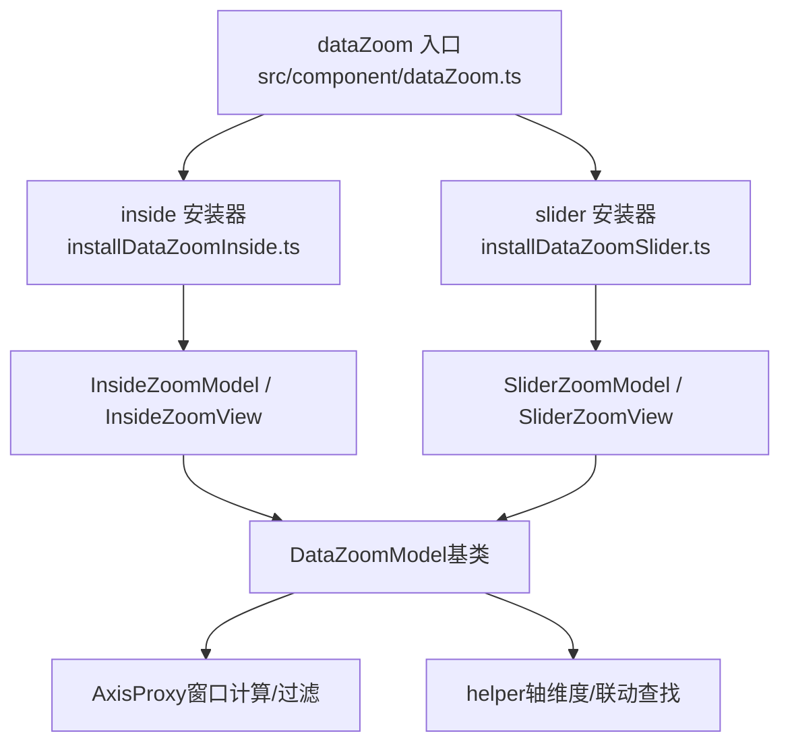
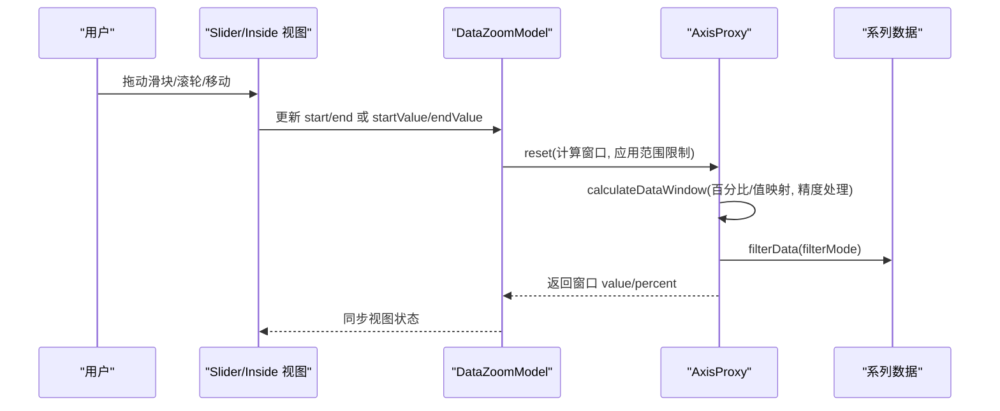
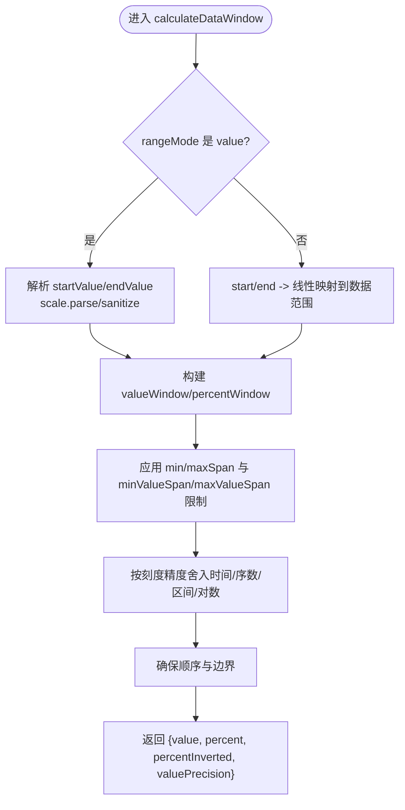
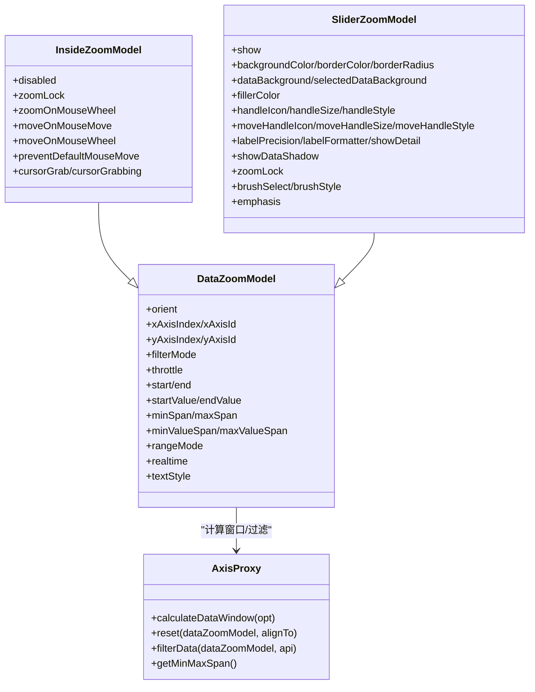

# 数据缩放配置项

<cite>
**本文引用的文件**
- [src/component/dataZoom.ts](file://src/component/dataZoom.ts)
- [src/component/dataZoomInside.ts](file://src/component/dataZoomInside.ts)
- [src/component/dataZoomSlider.ts](file://src/component/dataZoomSlider.ts)
- [src/component/dataZoom/DataZoomModel.ts](file://src/component/dataZoom/DataZoomModel.ts)
- [src/component/dataZoom/InsideZoomModel.ts](file://src/component/dataZoom/InsideZoomModel.ts)
- [src/component/dataZoom/SliderZoomModel.ts](file://src/component/dataZoom/SliderZoomModel.ts)
- [src/component/dataZoom/AxisProxy.ts](file://src/component/dataZoom/AxisProxy.ts)
- [src/component/dataZoom/helper.ts](file://src/component/dataZoom/helper.ts)
- [src/component/dataZoom/installDataZoomInside.ts](file://src/component/dataZoom/installDataZoomInside.ts)
- [src/component/dataZoom/installDataZoomSlider.ts](file://src/component/dataZoom/installDataZoomSlider.ts)
- [test/dataZoom-rainfall.html](file://test/dataZoom-rainfall.html)
- [test/dataZoom-cartesian-h.html](file://test/dataZoom-cartesian-h.html)
</cite>

## 目录
1. [简介](#简介)
2. [项目结构](#项目结构)
3. [核心组件](#核心组件)
4. [架构总览](#架构总览)
5. [详细组件分析](#详细组件分析)
6. [依赖关系分析](#依赖关系分析)
7. [性能考量](#性能考量)
8. [故障排查指南](#故障排查指南)
9. [结论](#结论)
10. [附录](#附录)

## 简介
本文件面向 ECharts 的数据缩放（dataZoom）组件，系统性说明其全部配置项与行为机制，覆盖：
- 类型与安装：inside、slider
- 控制方式：start/end、startValue/endValue、rangeMode
- 滑动条外观与交互：handleSize、handleStyle、fillerStyle、showDetail、showDataShadow、brushSelect 等
- 内部缩放交互：zoomOnMouseWheel、moveOnMouseMove、moveOnMouseWheel、preventDefaultMouseMove、cursorGrab/cursorGrabbing、zoomLock
- 过滤模式：filterMode（filter/weakFilter/empty/none）
- 联动坐标轴：xAxisIndex/xAxisId、yAxisIndex/yAxisId、radius/angle/singleAxis 的关联
- 与坐标轴的联动与窗口计算、精度处理、范围限制（minSpan/maxSpan/minValueSpan/maxValueSpan）

## 项目结构
ECharts 将 dataZoom 拆分为通用模型与视图、以及 inside/slider 两类具体实现。入口通过扩展注册机制加载对应 Model/View，并在运行时由 AxisProxy 统一管理与坐标轴的窗口计算和数据过滤。

图表来源
- [src/component/dataZoom.ts:20-23](file://src/component/dataZoom.ts#L20-L23)
- [src/component/dataZoom/installDataZoomInside.ts:26-33](file://src/component/dataZoom/installDataZoomInside.ts#L26-L33)
- [src/component/dataZoom/installDataZoomSlider.ts:25-30](file://src/component/dataZoom/installDataZoomSlider.ts#L25-L30)
- [src/component/dataZoom/DataZoomModel.ts:149-166](file://src/component/dataZoom/DataZoomModel.ts#L149-L166)
- [src/component/dataZoom/AxisProxy.ts:67-122](file://src/component/dataZoom/AxisProxy.ts#L67-L122)
- [src/component/dataZoom/helper.ts:50-61](file://src/component/dataZoom/helper.ts#L50-L61)

章节来源
- [src/component/dataZoom.ts:20-23](file://src/component/dataZoom.ts#L20-L23)
- [src/component/dataZoom/installDataZoomInside.ts:26-33](file://src/component/dataZoom/installDataZoomInside.ts#L26-L33)
- [src/component/dataZoom/installDataZoomSlider.ts:25-30](file://src/component/dataZoom/installDataZoomSlider.ts#L25-L30)

## 核心组件
- DataZoomModel：定义通用配置项与默认值、目标轴自动选择、范围模式（percent/value）、节流策略、原始选项缓存（settledOption）等。
- InsideZoomModel：在 DataZoomModel 基础上增加鼠标滚轮缩放、平移、光标样式、禁用/锁定等交互开关。
- SliderZoomModel：在 DataZoomModel 基础上增加滑块外观、背景、选中区域、阴影、标签、拖拽手柄、刷选等视觉与交互配置。
- AxisProxy：负责窗口计算、范围限制、数据过滤、与坐标轴联动、精度处理等核心逻辑。
- helper：提供轴维度映射、联动查找、坐标系统收集等工具方法。

章节来源
- [src/component/dataZoom/DataZoomModel.ts:39-166](file://src/component/dataZoom/DataZoomModel.ts#L39-L166)
- [src/component/dataZoom/InsideZoomModel.ts:23-67](file://src/component/dataZoom/InsideZoomModel.ts#L23-L67)
- [src/component/dataZoom/SliderZoomModel.ts:38-239](file://src/component/dataZoom/SliderZoomModel.ts#L38-L239)
- [src/component/dataZoom/AxisProxy.ts:151-331](file://src/component/dataZoom/AxisProxy.ts#L151-L331)
- [src/component/dataZoom/helper.ts:50-61](file://src/component/dataZoom/helper.ts#L50-L61)

## 架构总览
dataZoom 的工作流围绕“模型-代理-视图”展开：
- 用户配置或交互触发后，DataZoomModel 维护 settledOption 与 rangeMode，并确定目标轴集合。
- AxisProxy.reset 基于数据范围与模型配置计算窗口（value/percent），应用 min/maxSpan 限制与精度舍入。
- AxisProxy.filterData 根据 filterMode 对系列数据进行过滤或置空。
- Slider/Inside 视图渲染控件并响应交互，最终通过 Action/Processor 更新模型与视图。

图表来源
- [src/component/dataZoom/AxisProxy.ts:338-376](file://src/component/dataZoom/AxisProxy.ts#L338-L376)
- [src/component/dataZoom/AxisProxy.ts:151-331](file://src/component/dataZoom/AxisProxy.ts#L151-L331)
- [src/component/dataZoom/AxisProxy.ts:378-472](file://src/component/dataZoom/AxisProxy.ts#L378-L472)
- [src/component/dataZoom/DataZoomModel.ts:241-260](file://src/component/dataZoom/DataZoomModel.ts#L241-L260)

## 详细组件分析

### 通用配置项（DataZoomModel）
- orient：布局方向（horizontal/vertical），未指定时按目标轴自动推断。
- xAxisIndex/xAxisId、yAxisIndex/yAxisId、radiusAxisIndex/radiusAxisId、angleAxisIndex/angleAxisId、singleAxisIndex/singleAxisId：指定受控坐标轴；支持索引或 id 查询。
- filterMode：过滤模式
  - filter：超出窗口的数据项被移除（适合剔除异常点）。
  - weakFilter：仅当某数据项在所有相关维度均偏向窗口同一侧时才移除。
  - empty：超出窗口的数据项置为空（保留断点/占位）。
  - none：不执行过滤。
- throttle：事件节流间隔（毫秒），默认根据全局动画设置动态决定。
- start/end：百分比范围（0~100）。
- startValue/endValue：数值范围（可解析为时间/序数/数值）。
- minSpan/maxSpan：百分比跨度限制。
- minValueSpan/maxValueSpan：数值跨度限制（优先级高于百分比跨度）。
- rangeMode：['percent'|'value', 'percent'|'value']，控制 start/startValue 与 end/endValue 的生效模式。
- realtime：是否实时刷新（slider 默认开启）。
- textStyle：文本样式（仅 slider 支持）。

章节来源
- [src/component/dataZoom/DataZoomModel.ts:39-131](file://src/component/dataZoom/DataZoomModel.ts#L39-L131)
- [src/component/dataZoom/DataZoomModel.ts:158-166](file://src/component/dataZoom/DataZoomModel.ts#L158-L166)
- [src/component/dataZoom/DataZoomModel.ts:381-392](file://src/component/dataZoom/DataZoomModel.ts#L381-L392)
- [src/component/dataZoom/DataZoomModel.ts:394-415](file://src/component/dataZoom/DataZoomModel.ts#L394-L415)

### 内部缩放（type: inside）
- disabled：禁用该内部缩放。
- zoomLock：仅允许平移，禁止缩放。
- zoomOnMouseWheel：启用滚轮缩放，可为布尔或修饰键（shift/ctrl/alt）。
- moveOnMouseMove：启用鼠标移动平移。
- moveOnMouseWheel：启用滚轮平移。
- preventDefaultMouseMove：阻止默认鼠标移动行为。
- cursorGrab/cursorGrabbing：抓取前后光标样式。
- textStyle：不支持（类型约束）。

使用场景
- 适合嵌入网格内部，通过滚轮/拖拽快速浏览数据，无需额外控件占用空间。

章节来源
- [src/component/dataZoom/InsideZoomModel.ts:23-67](file://src/component/dataZoom/InsideZoomModel.ts#L23-L67)

### 滑动条缩放（type: slider）
- show：是否显示。
- backgroundColor/borderColor/borderRadius：背景与边框样式。
- dataBackground/selectedDataBackground：数据背景与选中区背景（线/面样式）。
- fillerColor：选中区域填充色。
- handleIcon/handleSize/handleStyle：手柄图标、尺寸、样式。
- moveHandleIcon/moveHandleSize/moveHandleStyle：整体移动手柄样式。
- labelPrecision/labelFormatter/showDetail：标签精度与格式化、详情显示。
- showDataShadow：数据阴影（auto/true/false）。
- zoomLock：锁定缩放（仅平移）。
- brushSelect/brushStyle：是否支持刷选及样式。
- emphasis：高亮态样式（手柄、移动手柄、标签）。
- defaultLocationEdgeGap：默认边距。

使用场景
- 适合需要明确可视范围、精确控制起止值的场景，如时间序列、类目轴筛选。

章节来源
- [src/component/dataZoom/SliderZoomModel.ts:38-239](file://src/component/dataZoom/SliderZoomModel.ts#L38-L239)

### 窗口计算与范围限制（AxisProxy）
- calculateDataWindow：根据 start/end 或 startValue/endValue 计算窗口，支持 percent/value 两种模式，并进行精度舍入与边界限制。
- reset：获取数据范围、应用 min/maxSpan 限制、写入窗口。
- filterData：依据 filterMode 对系列数据进行过滤或置空。
- getMinMaxSpan：读取当前 span 限制。

图表来源
- [src/component/dataZoom/AxisProxy.ts:151-331](file://src/component/dataZoom/AxisProxy.ts#L151-L331)
- [src/component/dataZoom/AxisProxy.ts:474-499](file://src/component/dataZoom/AxisProxy.ts#L474-L499)

章节来源
- [src/component/dataZoom/AxisProxy.ts:151-331](file://src/component/dataZoom/AxisProxy.ts#L151-L331)
- [src/component/dataZoom/AxisProxy.ts:378-472](file://src/component/dataZoom/AxisProxy.ts#L378-L472)
- [src/component/dataZoom/AxisProxy.ts:474-499](file://src/component/dataZoom/AxisProxy.ts#L474-L499)

### 与坐标轴的联动
- 通过 xAxisIndex/xAxisId、yAxisIndex/yAxisId 等属性绑定目标轴；支持 radius/angle/singleAxis。
- 自动推断：未显式指定时，按 orient 与坐标系自动选择平行轴作为目标。
- 多轴联动：同一 grid 内的多个同向轴可被同一个 dataZoom 同时控制。
- 对齐轴：若存在 alignTo 轴，dataZoom 会尝试与其对齐。

章节来源
- [src/component/dataZoom/DataZoomModel.ts:262-368](file://src/component/dataZoom/DataZoomModel.ts#L262-L368)
- [src/component/dataZoom/helper.ts:50-61](file://src/component/dataZoom/helper.ts#L50-L61)
- [src/component/dataZoom/helper.ts:248-256](file://src/component/dataZoom/helper.ts#L248-L256)

### 示例参考
- 垂直/水平双轴 dataZoom 组合、不同 filterMode 的使用：见 rainfall 示例。
- 同时使用 slider 与 inside 的联动、span 限制：见 cartesian-h 示例。

章节来源
- [test/dataZoom-rainfall.html:147-167](file://test/dataZoom-rainfall.html#L147-L167)
- [test/dataZoom-cartesian-h.html:177-196](file://test/dataZoom-cartesian-h.html#L177-L196)

## 依赖关系分析
- DataZoomModel 依赖 AxisBaseModel、GlobalModel、SeriesModel 等以完成目标轴查找与数据过滤。
- AxisProxy 依赖 scale 与 number 工具进行窗口计算与精度处理。
- installDataZoomInside/installDataZoomSlider 分别注册 inside/slider 的 Model/View，并复用公共处理器。

图表来源
- [src/component/dataZoom/DataZoomModel.ts:39-166](file://src/component/dataZoom/DataZoomModel.ts#L39-L166)
- [src/component/dataZoom/InsideZoomModel.ts:23-67](file://src/component/dataZoom/InsideZoomModel.ts#L23-L67)
- [src/component/dataZoom/SliderZoomModel.ts:38-239](file://src/component/dataZoom/SliderZoomModel.ts#L38-L239)
- [src/component/dataZoom/AxisProxy.ts:151-331](file://src/component/dataZoom/AxisProxy.ts#L151-L331)

## 性能考量
- throttle：合理设置节流间隔可降低高频交互带来的重绘压力；默认会根据全局动画参数自动设定。
- filterMode：
  - filter：直接 selectRange，性能较好。
  - weakFilter/empty：对大数据集可能较慢，需权衡交互体验与性能。
- 精度舍入：在时间/序数/区间/对数尺度下采用合适的精度，避免不必要的抖动与视觉伪影。
- showDataShadow：大数据量时建议关闭或设为 auto，减少渲染开销。

[本节为通用指导，不直接分析具体文件]

## 故障排查指南
- 现象：滚动缩放无效
  - 检查 inside 的 zoomOnMouseWheel 是否为 true 或绑定了修饰键；确认未被 zoomLock 锁定。
- 现象：拖动滑块后折线断开
  - 检查 filterMode 是否为 empty；如需连续折线，改为 filter。
- 现象：缩放范围不符合预期
  - 检查 minSpan/maxSpan 与 minValueSpan/maxValueSpan 的优先级与单位；确认 rangeMode 是否正确。
- 现象：多轴联动异常
  - 确认 xAxisIndex/xAxisId、yAxisIndex/yAxisId 指向正确的轴；必要时显式指定 orient。
- 现象：性能卡顿
  - 降低 throttle 频率或关闭 showDataShadow；评估 filterMode 的选择。

章节来源
- [src/component/dataZoom/InsideZoomModel.ts:23-67](file://src/component/dataZoom/InsideZoomModel.ts#L23-L67)
- [src/component/dataZoom/DataZoomModel.ts:381-392](file://src/component/dataZoom/DataZoomModel.ts#L381-L392)
- [src/component/dataZoom/AxisProxy.ts:378-472](file://src/component/dataZoom/AxisProxy.ts#L378-L472)

## 结论
dataZoom 提供了灵活的缩放与过滤能力，既能满足快速浏览（inside），也能提供精确控制（slider）。通过合理的配置（rangeMode、span 限制、filterMode、throttle）以及与坐标轴的联动，可以在复杂数据场景中兼顾交互性与性能。实际使用中建议结合示例与业务需求，选择合适的类型与参数组合。

[本节为总结性内容，不直接分析具体文件]

## 附录
- 常用配置速查
  - 类型：inside、slider
  - 控制范围：start/end、startValue/endValue、rangeMode
  - 滑动条：handleSize、handleStyle、fillerColor、showDataShadow、brushSelect
  - 内部缩放：zoomOnMouseWheel、moveOnMouseMove、moveOnMouseWheel、preventDefaultMouseMove、cursorGrab/cursorGrabbing、zoomLock
  - 过滤：filterMode（filter/weakFilter/empty/none）
  - 联动：xAxisIndex/xAxisId、yAxisIndex/yAxisId、radius/angle/singleAxis
- 参考示例
  - 多轴与不同 filterMode：dataZoom-rainfall.html
  - slider 与 inside 联动、span 限制：dataZoom-cartesian-h.html

章节来源
- [test/dataZoom-rainfall.html:147-167](file://test/dataZoom-rainfall.html#L147-L167)
- [test/dataZoom-cartesian-h.html:177-196](file://test/dataZoom-cartesian-h.html#L177-L196)