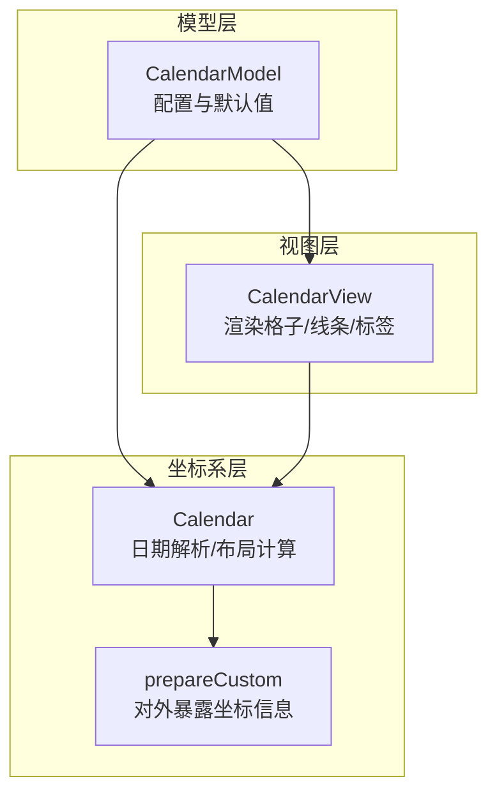
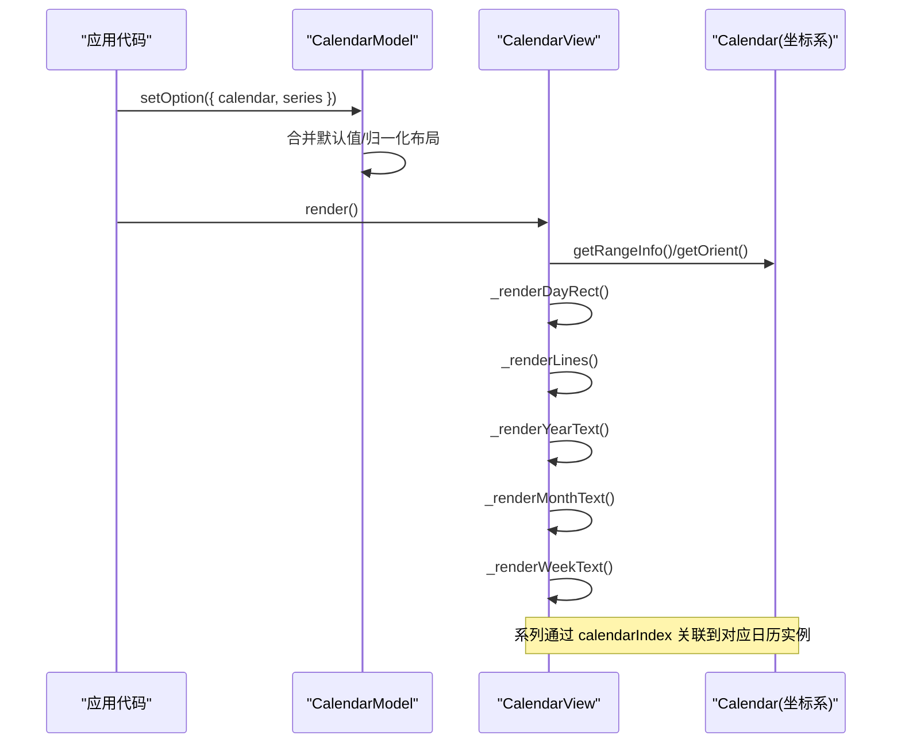
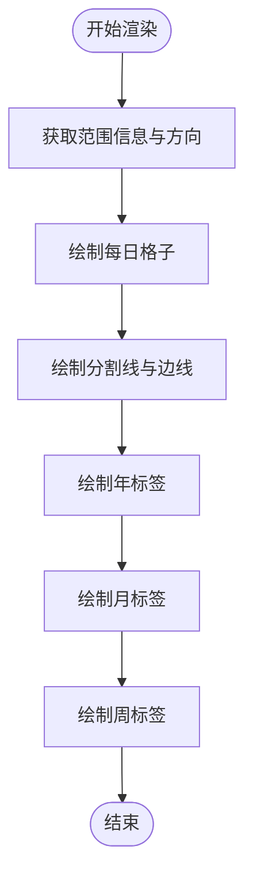
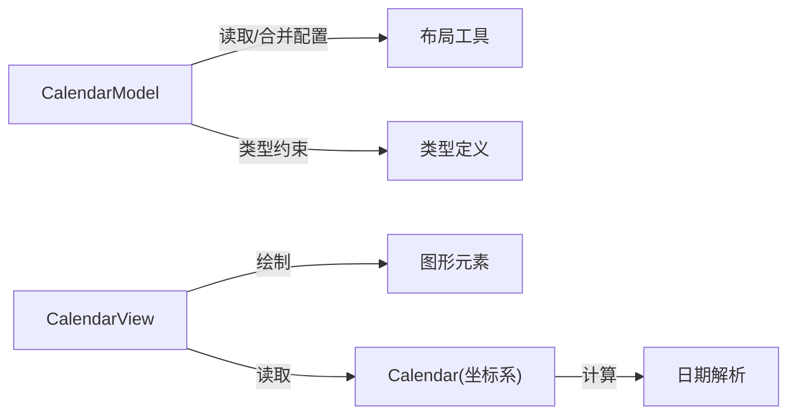

# 日历配置项

<cite>
**本文引用的文件**
- [calendar.ts](file://src/component/calendar.ts)
- [CalendarModel.ts](file://src/coord/calendar/CalendarModel.ts)
- [CalendarView.ts](file://src/component/calendar/CalendarView.ts)
- [Calendar.ts](file://src/coord/calendar/Calendar.ts)
- [prepareCustom.ts](file://src/coord/calendar/prepareCustom.ts)
- [calendar-simple.html](file://test/calendar-simple.html)
- [calendar-heatmap.html](file://test/calendar-heatmap.html)
- [calendar-range.html](file://test/calendar-range.html)
- [calendar-orient.html](file://test/calendar-orient.html)
- [calendar-size.html](file://test/calendar-size.html)
- [calendar-more.html](file://test/calendar-more.html)
- [calendar-week.html](file://test/calendar-week.html)
- [calendar-vertical.html](file://test/calendar-vertical.html)
</cite>

## 目录
1. [简介](#简介)
2. [项目结构](#项目结构)
3. [核心组件](#核心组件)
4. [架构总览](#架构总览)
5. [详细组件分析](#详细组件分析)
6. [依赖关系分析](#依赖关系分析)
7. [性能考量](#性能考量)
8. [故障排查指南](#故障排查指南)
9. [结论](#结论)
10. [附录](#附录)

## 简介
本文件面向 ECharts 的日历组件（calendar），系统性说明其全部配置项与使用方式，重点覆盖：
- 日期范围配置 range
- 方向配置 orient
- 单元格尺寸 cellSize
- 文本标签 dayLabel、monthLabel、yearLabel
- 分割线 splitLine、单元格样式 itemStyle
- 与热力图等系列结合实现按日期的数据可视化
- 多日历实例布局与坐标系统配合

文档同时提供架构图、流程图与调用时序图，帮助读者快速掌握日历组件的配置与集成方法。

## 项目结构
ECharts 日历组件由“模型-视图-坐标系”三层构成：
- 模型层：定义配置项、默认值与合并逻辑
- 视图层：负责绘制日历格子、分割线、年/月/周标签
- 坐标系层：计算日期范围、单元格尺寸、布局坐标等

图表来源
- [CalendarModel.ts:68-155](file://src/coord/calendar/CalendarModel.ts#L68-L155)
- [CalendarView.ts:61-86](file://src/component/calendar/CalendarView.ts#L61-L86)
- [Calendar.ts:44-89](file://src/coord/calendar/Calendar.ts#L44-L89)
- [prepareCustom.ts:22-37](file://src/coord/calendar/prepareCustom.ts#L22-L37)

章节来源
- [calendar.ts:20-23](file://src/component/calendar.ts#L20-L23)
- [CalendarModel.ts:157-263](file://src/coord/calendar/CalendarModel.ts#L157-L263)
- [CalendarView.ts:61-86](file://src/component/calendar/CalendarView.ts#L61-L86)
- [Calendar.ts:44-89](file://src/coord/calendar/Calendar.ts#L44-L89)
- [prepareCustom.ts:22-37](file://src/coord/calendar/prepareCustom.ts#L22-L37)

## 核心组件
- CalendarModel：承载 calendar 的所有配置项与默认值，处理布局参数归一化（如 cellSize、位置）
- CalendarView：根据模型配置渲染日历格子、分割线、年/月/周标签，并处理文本定位与对齐
- Calendar（坐标系）：解析日期范围、计算单元格宽高、生成布局坐标，供视图与系列使用
- prepareCustom：将坐标系信息暴露给外部自定义扩展使用

章节来源
- [CalendarModel.ts:68-155](file://src/coord/calendar/CalendarModel.ts#L68-L155)
- [CalendarModel.ts:190-263](file://src/coord/calendar/CalendarModel.ts#L190-L263)
- [CalendarView.ts:61-86](file://src/component/calendar/CalendarView.ts#L61-L86)
- [Calendar.ts:44-89](file://src/coord/calendar/Calendar.ts#L44-L89)
- [prepareCustom.ts:22-37](file://src/coord/calendar/prepareCustom.ts#L22-L37)

## 架构总览
日历组件在渲染时遵循“模型驱动视图”的流程：
- 初始化阶段：模型读取配置，合并默认值，归一化布局参数
- 渲染阶段：视图从坐标系获取范围信息与方向，依次绘制格子、分割线、年/月/周标签
- 交互阶段：系列（如 heatmap）通过 calendarIndex 绑定到指定日历实例，基于坐标系映射数据点

图表来源
- [CalendarView.ts:61-86](file://src/component/calendar/CalendarView.ts#L61-L86)
- [CalendarModel.ts:168-183](file://src/coord/calendar/CalendarModel.ts#L168-L183)

章节来源
- [CalendarView.ts:61-86](file://src/component/calendar/CalendarView.ts#L61-L86)
- [CalendarModel.ts:168-183](file://src/coord/calendar/CalendarModel.ts#L168-L183)

## 详细组件分析

### 配置项总览
以下配置项均来源于模型层的类型定义与默认选项，涵盖范围、方向、单元格、文本、样式等维度：

- 范围与方向
  - range：支持年份、月份或起止日期数组；用于限定日历显示的时间范围
  - orient：水平或垂直方向，影响标签与布局方向
- 单元格与网格
  - cellSize：单元格宽高，可设为数值或 'auto'，也可为二维数组分别控制横纵尺寸
  - splitLine.show / lineStyle：是否显示分割线及线条样式
  - itemStyle：单元格矩形样式（填充色、边框等）
- 文本标签
  - dayLabel：周标签，支持 firstDay（一周起始日）、position（start/end）、margin、nameMap（本地化或自定义数组）
  - monthLabel：月标签，支持 position、margin、align、formatter、nameMap
  - yearLabel：年标签，支持 position、margin、formatter
- 其他
  - z：层级控制
  - 布局参数：left/top/right/bottom/width/height 等（继承自 BoxLayoutOptionMixin）

章节来源
- [CalendarModel.ts:68-155](file://src/coord/calendar/CalendarModel.ts#L68-L155)
- [CalendarModel.ts:190-263](file://src/coord/calendar/CalendarModel.ts#L190-L263)

### 日期范围配置 range
- 支持形式
  - 单一年份：如 2017
  - 单一个月：如 '2017-02'
  - 起止范围：如 ['2017-01-02', '2017-02-23'] 或 ['2017-01', '2017-02']
- 行为说明
  - 内部会识别并规范化为完整的起止日期
  - 多个日历实例可通过数组形式在同一画布中展示不同范围

示例参考
- 多范围日历：[calendar-range.html:82-99](file://test/calendar-range.html#L82-L99)

章节来源
- [CalendarModel.ts:80-90](file://src/coord/calendar/CalendarModel.ts#L80-L90)
- [calendar-range.html:82-99](file://test/calendar-range.html#L82-L99)

### 方向配置 orient
- 取值：'horizontal' | 'vertical'
- 影响
  - 标签位置与对齐方式
  - 分割线与边缘线的走向
  - 年标签的默认位置（水平时为左侧，垂直时为顶部）

示例参考
- 水平/垂直对比：[calendar-orient.html:82-108](file://test/calendar-orient.html#L82-L108)
- 垂直布局示例：[calendar-vertical.html:82-98](file://test/calendar-vertical.html#L82-L98)

章节来源
- [CalendarModel.ts:71-72](file://src/coord/calendar/CalendarModel.ts#L71-L72)
- [CalendarView.ts:303-305](file://src/component/calendar/CalendarView.ts#L303-L305)
- [calendar-orient.html:82-108](file://test/calendar-orient.html#L82-L108)
- [calendar-vertical.html:82-98](file://test/calendar-vertical.html#L82-L98)

### 单元格配置 cellSize
- 取值
  - 数字：统一设置宽高
  - 'auto'：根据布局自动计算
  - 数组：[宽, 高] 分别设置
- 行为
  - 当设置了 width/height 或 left+right 时，对应方向的 cellSize 会自动变为 'auto'，避免冲突

示例参考
- 单元格大小调整：[calendar-size.html:82-96](file://test/calendar-size.html#L82-L96)

章节来源
- [CalendarModel.ts:71-72](file://src/coord/calendar/CalendarModel.ts#L71-L72)
- [CalendarModel.ts:267-296](file://src/coord/calendar/CalendarModel.ts#L267-L296)
- [calendar-size.html:82-96](file://test/calendar-size.html#L82-L96)

### 文本配置 dayLabel、monthName（monthLabel）、yearLabel
- dayLabel
  - firstDay：一周起始日（0-6）
  - position：'start' | 'end'
  - margin：与轴线的间距，支持百分比
  - nameMap：本地化名称或自定义数组
- monthLabel
  - position：'start' | 'end'
  - margin：与轴线的间距
  - align：'center' | 'left'
  - formatter：字符串模板或回调函数
  - nameMap：本地化名称或自定义数组
- yearLabel
  - position：'top' | 'bottom' | 'left' | 'right'
  - margin：与轴线/边缘的间距
  - formatter：字符串模板或回调函数

示例参考
- 多语言与周标签位置：[calendar-week.html:98-176](file://test/calendar-week.html#L98-L176)

章节来源
- [CalendarModel.ts:92-154](file://src/coord/calendar/CalendarModel.ts#L92-L154)
- [CalendarView.ts:391-461](file://src/component/calendar/CalendarView.ts#L391-L461)
- [CalendarView.ts:493-559](file://src/component/calendar/CalendarView.ts#L493-L559)
- [calendar-week.html:98-176](file://test/calendar-week.html#L98-L176)

### 选中配置 selectedMode
- 当前源码未包含 calendar.selectedMode 的定义与实现
- 如需选择功能，建议结合 tooltip、dataZoom 或自定义交互事件进行扩展

章节来源
- [CalendarModel.ts:68-155](file://src/coord/calendar/CalendarModel.ts#L68-L155)

### 与热力图（heatmap）结合使用
- 系列类型：series.type = 'heatmap'
- 坐标系：coordinateSystem = 'calendar'
- 绑定日历实例：calendarIndex 指向 calendar 数组中的索引
- 数据格式：通常为 [日期字符串, 数值] 的数组

示例参考
- 基础日历热力图：[calendar-simple.html:69-92](file://test/calendar-simple.html#L69-L92)
- 带标题与视觉映射的热力图：[calendar-heatmap.html:69-98](file://test/calendar-heatmap.html#L69-L98)
- 多日历多系列组合：[calendar-more.html:190-256](file://test/calendar-more.html#L190-L256)

章节来源
- [calendar-simple.html:69-92](file://test/calendar-simple.html#L69-L92)
- [calendar-heatmap.html:69-98](file://test/calendar-heatmap.html#L69-L98)
- [calendar-more.html:190-256](file://test/calendar-more.html#L190-L256)

### 渲染流程与算法
日历视图渲染步骤包括：
- 获取范围信息与方向
- 绘制每日格子
- 绘制分割线（含首尾边线）
- 绘制年/月/周标签（含本地化与格式化）

图表来源
- [CalendarView.ts:61-86](file://src/component/calendar/CalendarView.ts#L61-L86)
- [CalendarView.ts:88-117](file://src/component/calendar/CalendarView.ts#L88-L117)
- [CalendarView.ts:119-178](file://src/component/calendar/CalendarView.ts#L119-L178)
- [CalendarView.ts:287-346](file://src/component/calendar/CalendarView.ts#L287-L346)
- [CalendarView.ts:391-461](file://src/component/calendar/CalendarView.ts#L391-L461)
- [CalendarView.ts:493-559](file://src/component/calendar/CalendarView.ts#L493-L559)

章节来源
- [CalendarView.ts:61-86](file://src/component/calendar/CalendarView.ts#L61-L86)
- [CalendarView.ts:88-117](file://src/component/calendar/CalendarView.ts#L88-L117)
- [CalendarView.ts:119-178](file://src/component/calendar/CalendarView.ts#L119-L178)
- [CalendarView.ts:287-346](file://src/component/calendar/CalendarView.ts#L287-L346)
- [CalendarView.ts:391-461](file://src/component/calendar/CalendarView.ts#L391-L461)
- [CalendarView.ts:493-559](file://src/component/calendar/CalendarView.ts#L493-L559)

### 坐标系与自定义扩展
- 坐标系提供 rect、cellWidth、cellHeight、rangeInfo 等信息
- prepareCustom 将这些信息封装后供外部扩展使用

章节来源
- [prepareCustom.ts:22-37](file://src/coord/calendar/prepareCustom.ts#L22-L37)

## 依赖关系分析
- CalendarModel 依赖布局工具与类型定义，负责配置合并与默认值
- CalendarView 依赖图形元素与文本样式工具，负责具体绘制
- Calendar（坐标系）提供日期解析与布局计算能力
- 示例文件展示了多种配置组合与系列绑定方式

图表来源
- [CalendarModel.ts:20-40](file://src/coord/calendar/CalendarModel.ts#L20-L40)
- [CalendarView.ts:20-35](file://src/component/calendar/CalendarView.ts#L20-L35)
- [Calendar.ts:32-39](file://src/coord/calendar/Calendar.ts#L32-L39)

章节来源
- [CalendarModel.ts:20-40](file://src/coord/calendar/CalendarModel.ts#L20-L40)
- [CalendarView.ts:20-35](file://src/component/calendar/CalendarView.ts#L20-L35)
- [Calendar.ts:32-39](file://src/coord/calendar/Calendar.ts#L32-L39)

## 性能考量
- 大量日期格子与标签渲染可能带来性能压力，建议：
  - 合理设置 cellSize，避免过小导致过多 DOM/Canvas 元素
  - 按需显示标签（如隐藏不必要的年/月/周标签）
  - 使用合适的 visualMap 分段以减少颜色计算开销
- 多日历实例时注意布局重叠与重绘次数

## 故障排查指南
- 标签不显示
  - 检查 dayLabel/monthLabel/yearLabel 的 show 属性（默认值为 true）
  - 确认 margin 与 position 设置是否合理
- 格子错位或大小异常
  - 检查 cellSize 与布局参数（left/top/right/bottom/width/height）是否存在冲突
  - 当设置了 width/height 时，对应方向 cellSize 会被置为 'auto'
- 热力图数据未映射
  - 确认 series.coordinateSystem = 'calendar'
  - 确认 series.calendarIndex 与 calendar 数组索引一致
  - 数据格式应为 [日期字符串, 数值]

章节来源
- [CalendarModel.ts:190-263](file://src/coord/calendar/CalendarModel.ts#L190-L263)
- [CalendarView.ts:287-346](file://src/component/calendar/CalendarView.ts#L287-L346)
- [calendar-simple.html:69-92](file://test/calendar-simple.html#L69-L92)
- [calendar-heatmap.html:69-98](file://test/calendar-heatmap.html#L69-L98)

## 结论
ECharts 日历组件提供了丰富的配置项以支持按日期的数据可视化。通过合理设置 range、orient、cellSize、dayLabel/monthLabel/yearLabel 以及 splitLine/itemStyle，可以灵活定制日历外观与行为。与热力图等系列的结合，使得时间维度的数据展示更加直观。对于选择交互，当前版本未内置 selectedMode，可通过扩展实现。

## 附录
- 示例文件路径
  - 基础日历热力图：[calendar-simple.html](file://test/calendar-simple.html)
  - 带标题与视觉映射：[calendar-heatmap.html](file://test/calendar-heatmap.html)
  - 多范围日历：[calendar-range.html](file://test/calendar-range.html)
  - 方向与布局：[calendar-orient.html](file://test/calendar-orient.html)、[calendar-vertical.html](file://test/calendar-vertical.html)
  - 单元格大小：[calendar-size.html](file://test/calendar-size.html)
  - 多日历多系列：[calendar-more.html](file://test/calendar-more.html)
  - 多语言与周标签：[calendar-week.html](file://test/calendar-week.html)