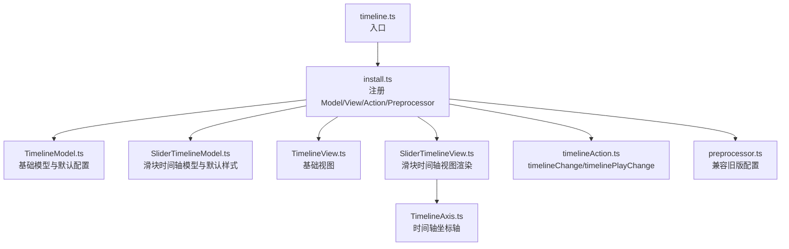
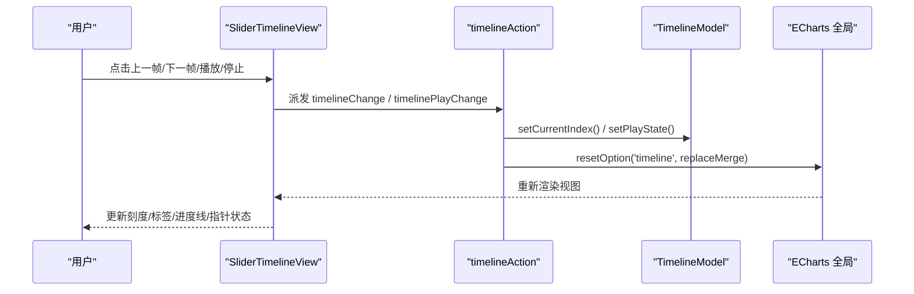
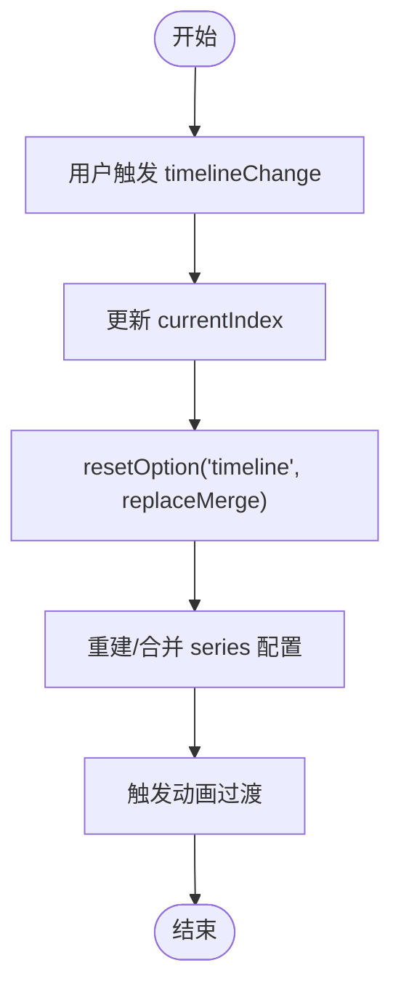
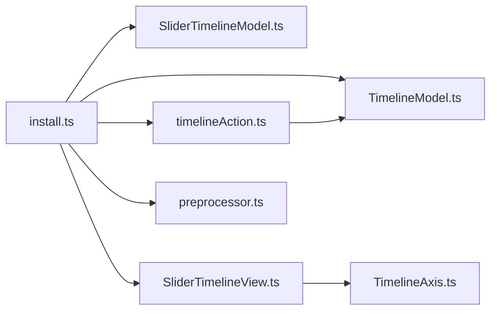

# 时间轴配置项

<cite>
**本文引用的文件**
- [src/component/timeline.ts](file://src/component/timeline.ts)
- [src/component/timeline/install.ts](file://src/component/timeline/install.ts)
- [src/component/timeline/preprocessor.ts](file://src/component/timeline/preprocessor.ts)
- [src/component/timeline/TimelineModel.ts](file://src/component/timeline/TimelineModel.ts)
- [src/component/timeline/SliderTimelineModel.ts](file://src/component/timeline/SliderTimelineModel.ts)
- [src/component/timeline/TimelineView.ts](file://src/component/timeline/TimelineView.ts)
- [src/component/timeline/SliderTimelineView.ts](file://src/component/timeline/SliderTimelineView.ts)
- [src/component/timeline/TimelineAxis.ts](file://src/component/timeline/TimelineAxis.ts)
- [src/component/timeline/timelineAction.ts](file://src/component/timeline/timelineAction.ts)
- [test/timeline-case.html](file://test/timeline-case.html)
- [test/timeline-dynamic-series.html](file://test/timeline-dynamic-series.html)
</cite>

## 目录
1. [简介](#简介)
2. [项目结构](#项目结构)
3. [核心组件](#核心组件)
4. [架构总览](#架构总览)
5. [详细组件分析](#详细组件分析)
6. [依赖关系分析](#依赖关系分析)
7. [性能考量](#性能考量)
8. [故障排查指南](#故障排查指南)
9. [结论](#结论)
10. [附录](#附录)

## 简介
本文件为 ECharts 时间轴（timeline）组件的详细配置文档，覆盖基本配置、时间轴数据与坐标轴类型、播放控制、样式与交互、以及多数据集动态切换与动画过渡机制。内容基于源码实现进行梳理，帮助开发者准确理解并高效使用 timeline 组件。

## 项目结构
时间轴组件由模型（Model）、视图（View）、坐标轴（Axis）、动作（Action）和预处理（Preprocessor）等模块组成，并通过安装器注册到 ECharts 扩展系统。

**图表来源**
- [src/component/timeline.ts:20-28](file://src/component/timeline.ts#L20-L28)
- [src/component/timeline/install.ts:25-37](file://src/component/timeline/install.ts#L25-L37)
- [src/component/timeline/TimelineModel.ts:173-336](file://src/component/timeline/TimelineModel.ts#L173-L336)
- [src/component/timeline/SliderTimelineModel.ts:30-145](file://src/component/timeline/SliderTimelineModel.ts#L30-L145)
- [src/component/timeline/TimelineView.ts:20-27](file://src/component/timeline/TimelineView.ts#L20-L27)
- [src/component/timeline/SliderTimelineView.ts:81-149](file://src/component/timeline/SliderTimelineView.ts#L81-L149)
- [src/component/timeline/TimelineAxis.ts:28-62](file://src/component/timeline/TimelineAxis.ts#L28-L62)
- [src/component/timeline/timelineAction.ts:37-84](file://src/component/timeline/timelineAction.ts#L37-L84)
- [src/component/timeline/preprocessor.ts:24-38](file://src/component/timeline/preprocessor.ts#L24-L38)

**章节来源**
- [src/component/timeline.ts:20-28](file://src/component/timeline.ts#L20-L28)
- [src/component/timeline/install.ts:25-37](file://src/component/timeline/install.ts#L25-L37)

## 核心组件
- TimelineModel：定义时间轴的基础配置项、默认值、数据初始化、当前索引管理、播放状态管理等。
- SliderTimelineModel：在基础模型之上提供滑块时间轴的默认样式与布局相关配置。
- SliderTimelineView：负责渲染时间轴刻度、标签、控件按钮、进度线、当前指针，处理拖拽与播放逻辑。
- TimelineAxis：时间轴坐标轴，支持 category/time/value 三种类型。
- timelineAction：定义 timelineChange 与 timelinePlayChange 两个动作，驱动数据切换与播放状态变更。
- preprocessor：兼容旧版配置（如 type -> axisType、controlPosition -> controlStyle.position 等）。

**章节来源**
- [src/component/timeline/TimelineModel.ts:173-336](file://src/component/timeline/TimelineModel.ts#L173-L336)
- [src/component/timeline/SliderTimelineModel.ts:30-145](file://src/component/timeline/SliderTimelineModel.ts#L30-L145)
- [src/component/timeline/SliderTimelineView.ts:81-149](file://src/component/timeline/SliderTimelineView.ts#L81-L149)
- [src/component/timeline/TimelineAxis.ts:28-62](file://src/component/timeline/TimelineAxis.ts#L28-L62)
- [src/component/timeline/timelineAction.ts:37-84](file://src/component/timeline/timelineAction.ts#L37-L84)
- [src/component/timeline/preprocessor.ts:24-38](file://src/component/timeline/preprocessor.ts#L24-L38)

## 架构总览
时间轴组件通过“模型-视图-动作”的协作完成配置解析、渲染与交互：
- 用户配置经 preprocessor 兼容处理后进入 TimelineModel。
- SliderTimelineView 根据模型配置渲染 UI，并在交互时派发 action。
- timelineAction 更新 currentIndex 或 playState，触发全局选项重置与重绘，联动图表系列切换。

**图表来源**
- [src/component/timeline/SliderTimelineView.ts:603-713](file://src/component/timeline/SliderTimelineView.ts#L603-L713)
- [src/component/timeline/timelineAction.ts:37-84](file://src/component/timeline/timelineAction.ts#L37-L84)
- [src/component/timeline/TimelineModel.ts:200-243](file://src/component/timeline/TimelineModel.ts#L200-L243)

## 详细组件分析

### 配置项总览（按功能分组）
以下为 timeline 组件的主要配置项及其作用说明（具体默认值与行为以源码为准）：

- 显示与布局
  - show：是否显示时间轴
  - orient：方向（horizontal | vertical）
  - left/top/right/bottom/width/height/padding：布局参数
  - inverse：是否反转时间轴方向
  - controlPosition：控件位置（left | right | top | bottom），已迁移至 controlStyle.position

- 时间轴数据与类型
  - data：时间轴数据项数组，可为字符串、数值或对象（含 value/name/itemStyle/label/checkpointStyle/tooltip 等）
  - axisType：坐标轴类型（category | time | value）
  - currentIndex：当前索引
  - loop：是否循环播放
  - rewind：反向播放（配合自动播放）
  - realtime：拖拽时是否实时更新图表

- 播放控制
  - autoPlay：是否自动播放
  - playInterval：自动播放间隔（毫秒）
  - controlStyle：控件样式与可见性（show/showPlayBtn/showPrevBtn/showNextBtn/itemSize/itemGap/position/playIcon/stopIcon/nextIcon/prevIcon/各按钮尺寸等）

- 样式
  - lineStyle：轴线样式（show/颜色/宽度等）
  - itemStyle：刻度点样式
  - label：标签样式（show/position/interval/formatter/color/rotate/对齐方式等）
  - checkpointStyle：当前指针样式（symbol/symbolSize/color/borderColor/shadow/animation 等）
  - emphasis：强调态样式（label/itemStyle/controlStyle）
  - progress：进行中样式（lineStyle/itemStyle/label）

- 其他
  - backgroundColor/borderColor/borderWidth：容器背景与边框
  - tooltip：时间轴项提示框（trigger 通常为 'item'）
  - replaceMerge：合并策略（normalMerge 或 replaceMerge），影响后续 setOption 的行为

以上配置项来源于 TimelineModel 与 SliderTimelineModel 的默认配置与接口定义，并在 SliderTimelineView 中参与渲染与交互。

**章节来源**
- [src/component/timeline/TimelineModel.ts:107-172](file://src/component/timeline/TimelineModel.ts#L107-L172)
- [src/component/timeline/TimelineModel.ts:304-336](file://src/component/timeline/TimelineModel.ts#L304-L336)
- [src/component/timeline/SliderTimelineModel.ts:38-145](file://src/component/timeline/SliderTimelineModel.ts#L38-L145)
- [src/component/timeline/SliderTimelineView.ts:166-264](file://src/component/timeline/SliderTimelineView.ts#L166-L264)

### 时间轴数据与坐标轴类型
- axisType 支持三类：
  - category：类别型，data 中的每项可仅用 name 表示，内部会转换为 value（索引）
  - time：时间型，适合日期时间序列
  - value：数值型，直接以数值作为刻度值
- data 项支持对象形式，可自定义每个刻度的样式与标签，以及 tooltip 开关
- 预处理阶段会将旧版 type 映射为 axisType，并将 ec2 的 name 迁移为 value

**章节来源**
- [src/component/timeline/TimelineModel.ts:248-289](file://src/component/timeline/TimelineModel.ts#L248-L289)
- [src/component/timeline/preprocessor.ts:40-73](file://src/component/timeline/preprocessor.ts#L40-L73)

### 播放控制与自动播放
- autoPlay：开启后按 playInterval 定时前进或后退（受 rewind 控制）
- playInterval：自动播放间隔
- controlStyle：控制按钮可见性与图标、尺寸、位置等
- 播放状态变更通过 timelinePlayChange 动作设置，到达末尾且未循环时会自动停止并派发事件

**章节来源**
- [src/component/timeline/TimelineModel.ts:200-243](file://src/component/timeline/TimelineModel.ts#L200-L243)
- [src/component/timeline/SliderTimelineView.ts:650-666](file://src/component/timeline/SliderTimelineView.ts#L650-L666)
- [src/component/timeline/timelineAction.ts:48-61](file://src/component/timeline/timelineAction.ts#L48-L61)

### 多数据集动态切换与动画过渡
- 通过 options 数组为不同时间点提供不同的 series 配置，timeline 切换时会依据 replaceMerge 策略合并/替换系列
- 切换过程由 timelineChange 动作驱动，调用 setCurrentIndex 并重置 timeline 选项，从而触发图表重绘与动画过渡
- 示例展示了在不同时间点切换不同数量的系列，验证了动态切换能力

**图表来源**
- [src/component/timeline/timelineAction.ts:42-70](file://src/component/timeline/timelineAction.ts#L42-L70)
- [test/timeline-dynamic-series.html:42-114](file://test/timeline-dynamic-series.html#L42-L114)

**章节来源**
- [test/timeline-dynamic-series.html:42-114](file://test/timeline-dynamic-series.html#L42-L114)

### 交互与可视化细节
- 拖拽指针：实时预览目标刻度，若开启 realtime 则立即切换；否则释放时切换
- 进度线：从起点到当前指针的渐变指示
- 刻度与标签：支持 hover 强调态与 progress 态（已播放部分高亮）
- 控件按钮：播放/停止/上一帧/下一帧，支持自定义图标与尺寸

**章节来源**
- [src/component/timeline/SliderTimelineView.ts:512-619](file://src/component/timeline/SliderTimelineView.ts#L512-L619)
- [src/component/timeline/SliderTimelineView.ts:621-734](file://src/component/timeline/SliderTimelineView.ts#L621-L734)

## 依赖关系分析
- install.ts 将 SliderTimelineModel、SliderTimelineView、timelineAction、preprocessor 注册到 ECharts
- TimelineModel 依赖 SeriesData 管理时间轴数据，并提供 getCurrentIndex/setCurrentIndex/getPlayState/setPlayState 等方法
- SliderTimelineView 依赖 TimelineAxis 计算刻度与标签，依赖 zrender 图形元素进行绘制
- timelineAction 通过 GlobalModel 获取 timeline 组件实例并更新状态

**图表来源**
- [src/component/timeline/install.ts:25-37](file://src/component/timeline/install.ts#L25-L37)
- [src/component/timeline/TimelineModel.ts:173-336](file://src/component/timeline/TimelineModel.ts#L173-L336)
- [src/component/timeline/SliderTimelineView.ts:81-149](file://src/component/timeline/SliderTimelineView.ts#L81-L149)
- [src/component/timeline/timelineAction.ts:37-84](file://src/component/timeline/timelineAction.ts#L37-L84)

**章节来源**
- [src/component/timeline/install.ts:25-37](file://src/component/timeline/install.ts#L25-L37)

## 性能考量
- 大量刻度与标签：可通过 label.interval 控制显示密度，减少文本渲染开销
- 自动播放：playInterval 不宜过小，避免频繁调度导致卡顿
- 拖拽实时切换：realtime 为 true 时会在拖动过程中频繁切换，建议在大数据量场景下关闭以提升流畅度
- 动画过渡：checkpointStyle.animation 与 duration/easing 会影响过渡性能，可根据需求调整

[本节为通用建议，不直接分析具体文件]

## 故障排查指南
- 控件位置无效：检查 controlStyle.position 是否正确，旧版 controlPosition 会被迁移
- 自动播放不停止：确认 loop 与 rewind 组合行为，到达末尾且非循环时将自动停止
- 切换无动画：确认 replaceMerge 策略与 options 中 series 差异，必要时调整合并方式
- 标签重叠：调整 label.interval、rotate 或 position，或使用自适应布局

**章节来源**
- [src/component/timeline/preprocessor.ts:53-63](file://src/component/timeline/preprocessor.ts#L53-L63)
- [src/component/timeline/timelineAction.ts:48-61](file://src/component/timeline/timelineAction.ts#L48-L61)

## 结论
时间轴组件提供了丰富的配置项与灵活的交互能力，能够以直观的方式展示多数据集随时间的变化。通过合理配置 axisType、data、controlStyle 以及 replaceMerge 等选项，可实现稳定高效的动态切换与动画过渡效果。

[本节为总结性内容，不直接分析具体文件]

## 附录
- 示例参考
  - 基础用法与配置：[test/timeline-case.html](file://test/timeline-case.html)
  - 动态系列切换：[test/timeline-dynamic-series.html](file://test/timeline-dynamic-series.html)

**章节来源**
- [test/timeline-case.html:47-98](file://test/timeline-case.html#L47-L98)
- [test/timeline-dynamic-series.html:42-114](file://test/timeline-dynamic-series.html#L42-L114)