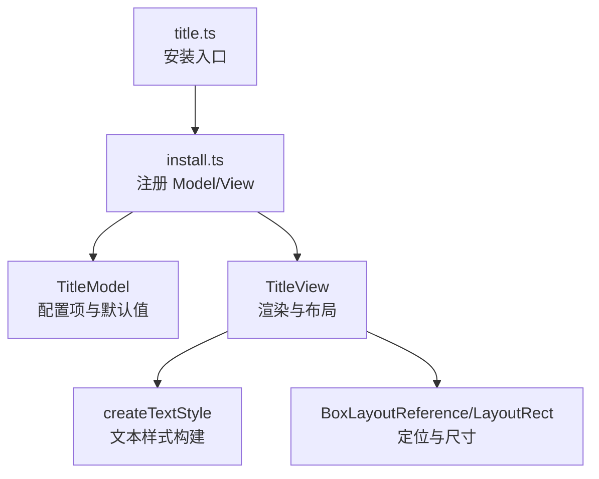
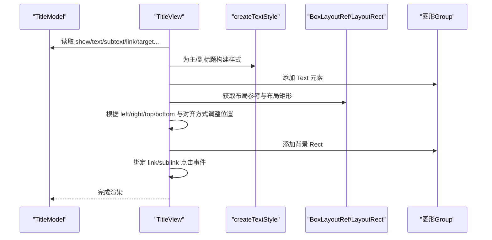
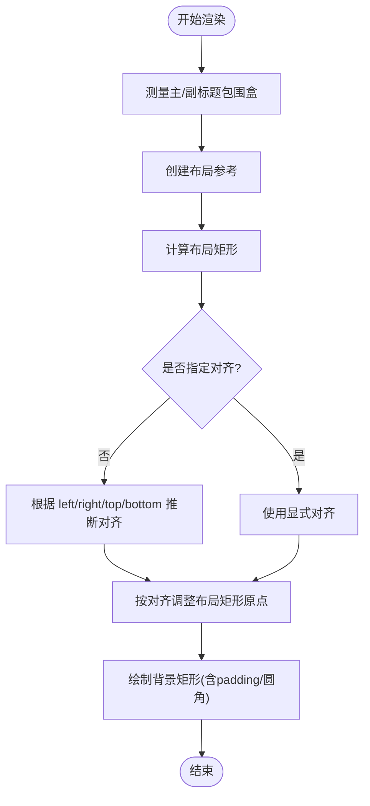
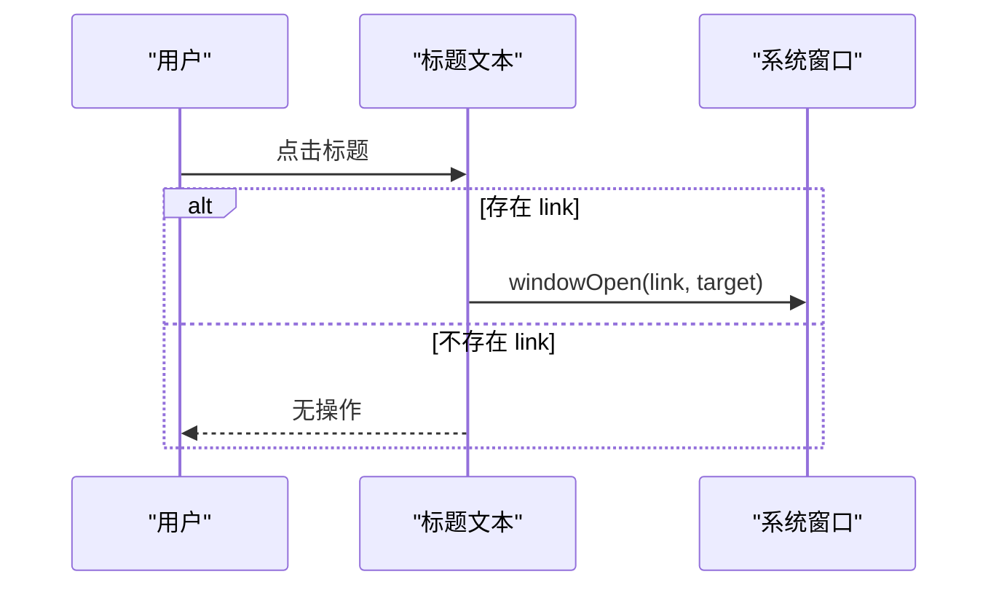
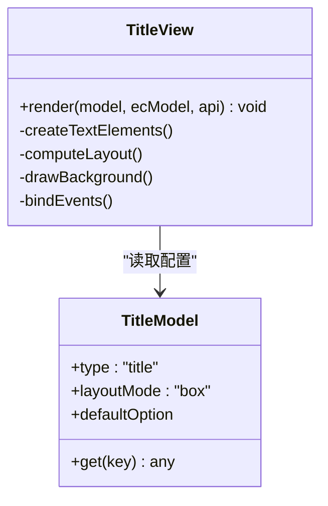
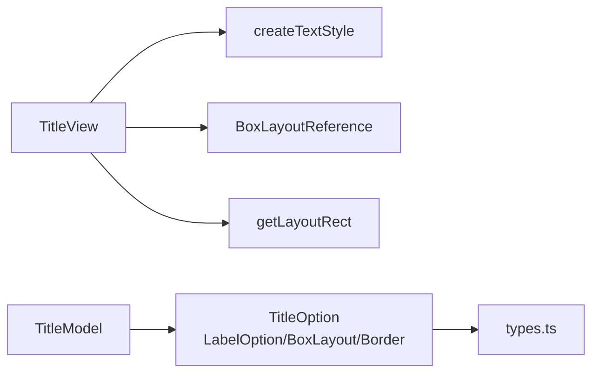

# 标题配置项

<cite>
**本文引用的文件**
- [src/component/title.ts](file://src/component/title.ts)
- [src/component/title/install.ts](file://src/component/title/install.ts)
- [src/label/labelStyle.ts](file://src/label/labelStyle.ts)
- [src/util/types.ts](file://src/util/types.ts)
</cite>

## 目录
1. [简介](#简介)
2. [项目结构](#项目结构)
3. [核心组件](#核心组件)
4. [架构总览](#架构总览)
5. [详细组件分析](#详细组件分析)
6. [依赖关系分析](#依赖关系分析)
7. [性能注意事项](#性能注意事项)
8. [故障排查指南](#故障排查指南)
9. [结论](#结论)
10. [附录：配置项速查表](#附录：配置项速查表)

## 简介
本章节面向 ECharts 的标题组件，系统化说明 title 的所有配置选项与行为，包括主标题与副标题、文本样式、位置布局、背景与边框、链接与交互、以及富文本支持等。文档基于源码实现进行梳理，帮助读者准确理解并高效定制标题的外观与行为。

## 项目结构
标题组件由“模型 + 视图”两部分组成，并通过扩展机制注册到 ECharts：
- 入口文件负责安装组件（注册 Model 与 View）
- 模型定义默认值与配置项类型
- 视图负责渲染文本、计算布局、绘制背景、绑定事件

图表来源
- [src/component/title.ts:20-23](file://src/component/title.ts#L20-L23)
- [src/component/title/install.ts:290-293](file://src/component/title/install.ts#L290-L293)
- [src/component/title/install.ts:100-139](file://src/component/title/install.ts#L100-L139)
- [src/component/title/install.ts:148-286](file://src/component/title/install.ts#L148-L286)
- [src/label/labelStyle.ts:20-78](file://src/label/labelStyle.ts#L20-L78)
- [src/util/types.ts:1054-1090](file://src/util/types.ts#L1054-L1090)

章节来源
- [src/component/title.ts:20-23](file://src/component/title.ts#L20-L23)
- [src/component/title/install.ts:100-139](file://src/component/title/install.ts#L100-L139)
- [src/component/title/install.ts:148-286](file://src/component/title/install.ts#L148-L286)

## 核心组件
- TitleModel：声明标题的配置项类型、默认值与布局模式（box），并提供 get 访问器读取配置。
- TitleView：根据模型配置创建文本元素、计算布局矩形、设置对齐方式、绘制背景矩形、处理链接点击与事件透传。

章节来源
- [src/component/title/install.ts:100-139](file://src/component/title/install.ts#L100-L139)
- [src/component/title/install.ts:148-286](file://src/component/title/install.ts#L148-L286)

## 架构总览
标题组件在渲染流程中的关键步骤如下：
- 读取 show 控制是否渲染
- 构建主/副标题文本元素及其样式
- 计算组包围盒，生成布局参考与布局矩形
- 根据 left/right/top/bottom 及 textAlign/textVerticalAlign 调整对齐与偏移
- 绘制背景矩形（支持圆角、边框、内边距）
- 为标题/副标题绑定链接点击事件，并支持事件透传

图表来源
- [src/component/title/install.ts:148-286](file://src/component/title/install.ts#L148-L286)
- [src/label/labelStyle.ts:20-78](file://src/label/labelStyle.ts#L20-L78)
- [src/util/types.ts:1054-1090](file://src/util/types.ts#L1054-L1090)

## 详细组件分析

### 配置项总览与语义
- 显示与内容
  - show：是否显示标题
  - text：主标题文本
  - subtext：副标题文本
- 链接与打开方式
  - link：主标题链接
  - target：主标题链接打开方式（self/blank）
  - sublink：副标题链接
  - subtarget：副标题链接打开方式（self/blank）
- 文本样式
  - textStyle：主标题样式（继承通用标签样式能力）
  - subtextStyle：副标题样式（继承通用标签样式能力）
  - textAlign：水平对齐（left/center/right）
  - textVerticalAlign：垂直对齐（top/middle/bottom）
  - textBaseline：已废弃，使用 textVerticalAlign
- 背景与边框
  - backgroundColor：背景色
  - borderColor：边框颜色
  - borderWidth：边框宽度
  - borderRadius：背景圆角
  - padding：内边距（可单值或数组）
  - itemGap：主副标题间距
- 布局定位
  - left/right/top/bottom：相对容器定位
  - width/height：布局宽高（由视图自动计算后回填）
- 交互
  - triggerEvent：是否触发组件级事件（如 titleClick）

章节来源
- [src/component/title/install.ts:44-99](file://src/component/title/install.ts#L44-L99)
- [src/component/title/install.ts:106-139](file://src/component/title/install.ts#L106-L139)

### 文本样式与富文本支持
- 主/副标题样式通过 createTextStyle 构建，支持字体、字号、粗细、颜色、阴影、背景、边框、内边距等通用文本样式能力。
- 富文本：当样式中包含 rich 时，可使用富文本片段语法对局部文本进行样式覆盖（例如不同颜色、字号）。该能力由底层文本系统提供，标题组件通过 createTextStyle 启用。
- 注意：标题组件本身不直接解析富文本，而是将样式对象传递给文本元素，由渲染层完成富文本排版。

章节来源
- [src/component/title/install.ts:157-184](file://src/component/title/install.ts#L157-L184)
- [src/label/labelStyle.ts:20-78](file://src/label/labelStyle.ts#L20-L78)

### 布局与定位
- 布局模式：box。视图会先测量文本包围盒，再结合 left/right/top/bottom 与 textAlign/textVerticalAlign 计算最终位置。
- 对齐策略：
  - 未显式设置 textAlign 时，会根据 left/right 推断；'middle' 会被规范化为 'center'。
  - 未显式设置 textVerticalAlign 时，会根据 top/bottom 推断；'center' 会被规范化为 'middle'。
- 尺寸：width/height 由视图在渲染过程中根据文本包围盒计算并回填到布局参数中，供后续布局系统使用。
- 内边距与背景：padding 影响背景矩形的绘制范围；borderRadius 支持圆角背景。

图表来源
- [src/component/title/install.ts:215-258](file://src/component/title/install.ts#L215-L258)
- [src/component/title/install.ts:266-285](file://src/component/title/install.ts#L266-L285)

章节来源
- [src/component/title/install.ts:215-258](file://src/component/title/install.ts#L215-L258)
- [src/component/title/install.ts:266-285](file://src/component/title/install.ts#L266-L285)

### 链接与交互
- 链接点击：若配置了 link/sublink，则对应文本元素会绑定点击事件，调用 windowOpen 打开目标 URL，并按 target/subtarget 决定打开方式。
- 事件透传：triggerEvent 为 true 时，会将组件信息注入事件数据，便于上层捕获 titleClick 等事件。
- 静默模式：若无链接且未开启事件透传，文本元素将设为 silent，避免不必要的交互事件冒泡。

图表来源
- [src/component/title/install.ts:186-202](file://src/component/title/install.ts#L186-L202)
- [src/component/title/install.ts:204-209](file://src/component/title/install.ts#L204-L209)

章节来源
- [src/component/title/install.ts:186-209](file://src/component/title/install.ts#L186-L209)

### 类图（模型与视图）

图表来源
- [src/component/title/install.ts:100-139](file://src/component/title/install.ts#L100-L139)
- [src/component/title/install.ts:148-286](file://src/component/title/install.ts#L148-L286)

## 依赖关系分析
- 样式构建：标题视图通过 createTextStyle 复用统一的文本样式构建逻辑，确保与其他组件一致的样式能力。
- 布局系统：通过 BoxLayoutReference 与 getLayoutRect 统一计算布局矩形，保证与网格、坐标轴等组件的布局一致性。
- 类型定义：标题配置项类型来自 types.ts 中的通用类型（如 LabelOption、BoxLayoutOptionMixin、BorderOptionMixin 等），保证类型安全与一致性。

图表来源
- [src/component/title/install.ts:148-286](file://src/component/title/install.ts#L148-L286)
- [src/label/labelStyle.ts:20-78](file://src/label/labelStyle.ts#L20-L78)
- [src/util/types.ts:1054-1090](file://src/util/types.ts#L1054-L1090)

章节来源
- [src/component/title/install.ts:148-286](file://src/component/title/install.ts#L148-L286)
- [src/label/labelStyle.ts:20-78](file://src/label/labelStyle.ts#L20-L78)
- [src/util/types.ts:1054-1090](file://src/util/types.ts#L1054-L1090)

## 性能注意事项
- 文本测量与重绘：每次渲染都会测量文本包围盒并重新计算布局，建议在大数据量场景下避免频繁更新标题内容。
- 背景绘制：背景矩形会在对齐调整后再次测量包围盒，尽量减少不必要的样式变更。
- 事件开销：若无需交互，建议关闭 triggerEvent 以减少事件监听与冒泡成本。

## 故障排查指南
- 标题不显示
  - 检查 show 是否为 false
  - 检查 text/subtext 是否为空字符串
- 位置异常
  - 确认 left/right/top/bottom 与 textAlign/textVerticalAlign 的组合是否符合预期
  - 注意 middle/center 的规范化行为
- 背景不生效
  - 检查 backgroundColor、borderColor、borderWidth、borderRadius、padding 是否正确设置
- 链接无效
  - 确认 link/sublink 是否存在，target/subtarget 是否合法
- 事件未触发
  - 确认 triggerEvent 是否为 true，且未被 silent 抑制

章节来源
- [src/component/title/install.ts:148-209](file://src/component/title/install.ts#L148-L209)
- [src/component/title/install.ts:215-285](file://src/component/title/install.ts#L215-L285)

## 结论
ECharts 标题组件提供了灵活的文本样式、布局定位、背景与边框、链接与交互能力。通过 box 布局模式与通用的文本样式构建，标题可以无缝融入整体图表布局。合理配置 textAlign/textVerticalAlign、padding、itemGap 等属性，即可满足大多数展示需求。对于复杂富文本场景，可通过 rich 样式实现精细化排版。

## 附录：配置项速查表
- 显示与内容
  - show：布尔，控制标题可见性
  - text：字符串，主标题文本
  - subtext：字符串，副标题文本
- 链接与打开方式
  - link：字符串，主标题链接
  - target：'self'|'blank'，主标题链接打开方式
  - sublink：字符串，副标题链接
  - subtarget：'self'|'blank'，副标题链接打开方式
- 文本样式
  - textStyle：对象，主标题样式（继承通用标签样式）
  - subtextStyle：对象，副标题样式（继承通用标签样式）
  - textAlign：'left'|'center'|'right'，水平对齐
  - textVerticalAlign：'top'|'middle'|'bottom'，垂直对齐
  - textBaseline：已废弃，请使用 textVerticalAlign
- 背景与边框
  - backgroundColor：颜色/渐变/图案，背景填充
  - borderColor：颜色，边框颜色
  - borderWidth：数字，边框宽度
  - borderRadius：数字或数组，背景圆角
  - padding：数字或数组，内边距
  - itemGap：数字，主副标题间距
- 布局定位
  - left/right/top/bottom：数值或百分比，相对容器定位
  - width/height：数值，布局宽高（由视图计算回填）
- 交互
  - triggerEvent：布尔，是否触发组件事件

章节来源
- [src/component/title/install.ts:44-99](file://src/component/title/install.ts#L44-L99)
- [src/component/title/install.ts:106-139](file://src/component/title/install.ts#L106-L139)