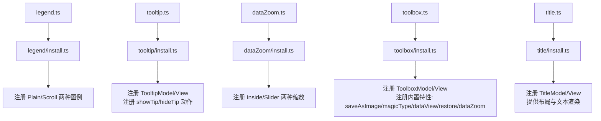
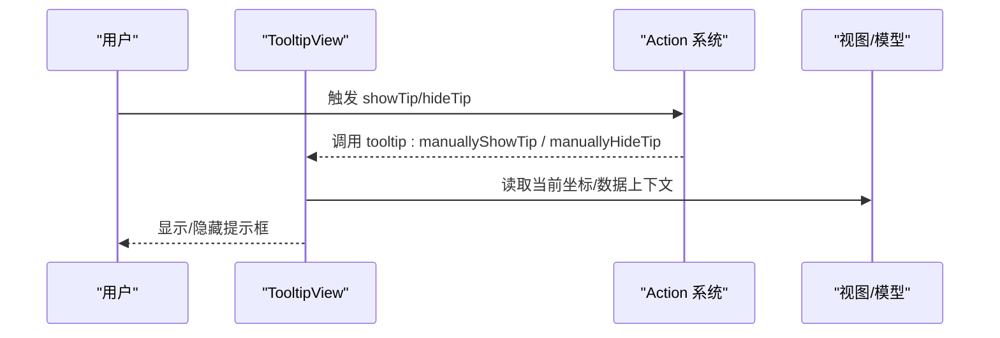
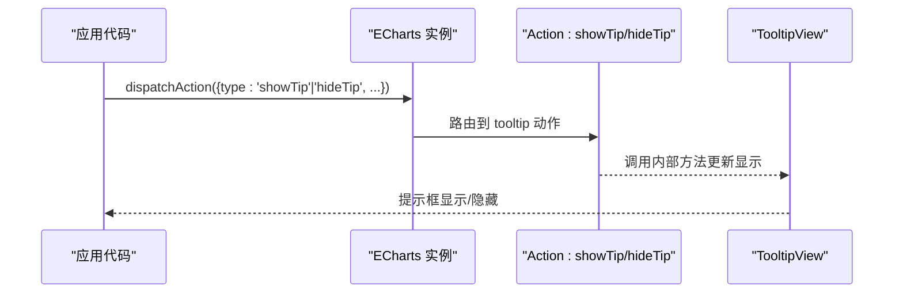
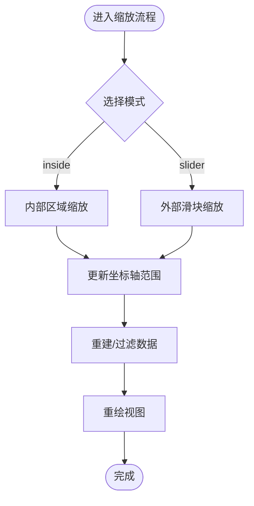
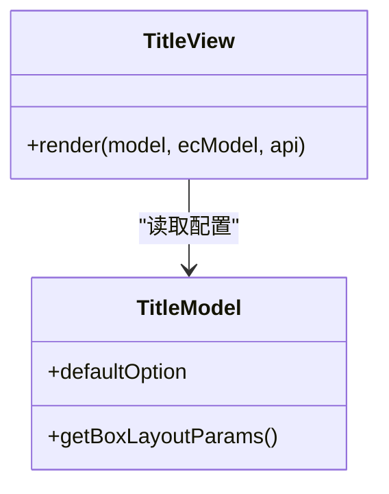
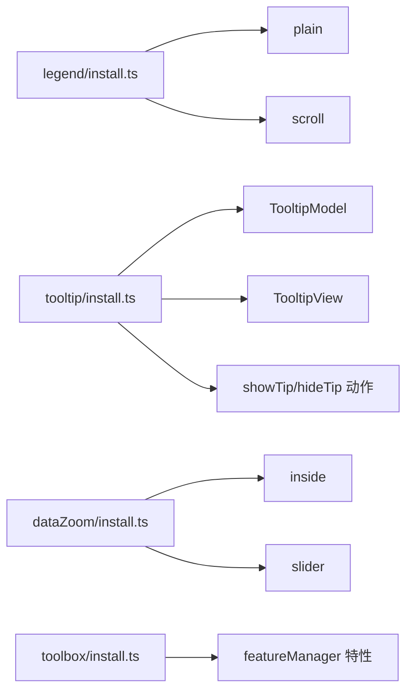

# 组件配置项

<cite>
**本文引用的文件**
- [src/component/legend.ts](file://src/component/legend.ts)
- [src/component/legend/install.ts](file://src/component/legend/install.ts)
- [src/component/tooltip.ts](file://src/component/tooltip.ts)
- [src/component/tooltip/install.ts](file://src/component/tooltip/install.ts)
- [src/component/dataZoom.ts](file://src/component/dataZoom.ts)
- [src/component/dataZoom/install.ts](file://src/component/dataZoom/install.ts)
- [src/component/toolbox.ts](file://src/component/toolbox.ts)
- [src/component/toolbox/install.ts](file://src/component/toolbox/install.ts)
- [src/component/title.ts](file://src/component/title.ts)
- [src/component/title/install.ts](file://src/component/title/install.ts)
</cite>

## 目录
1. [简介](#简介)
2. [项目结构](#项目结构)
3. [核心组件](#核心组件)
4. [架构总览](#架构总览)
5. [详细组件分析](#详细组件分析)
6. [依赖关系分析](#依赖关系分析)
7. [性能注意事项](#性能注意事项)
8. [故障排查指南](#故障排查指南)
9. [结论](#结论)
10. [附录](#附录)

## 简介
本文件面向 ECharts 的“组件”层，聚焦常用内置组件的配置与协作：图例(legend)、提示框(tooltip)、数据缩放(dataZoom)、工具栏(toolbox)、标题(title)，并补充坐标系(axis/grid/calendar/timeline)等关键组件的定位与协作方式。文档基于源码实现进行梳理，说明各组件的安装入口、模型与视图职责、默认行为、事件机制以及与其他组件的联动关系，帮助你在实际项目中正确组合与动态更新这些组件。

## 项目结构
ECharts 采用“扩展安装器 + 模型/视图”的分层组织方式：
- 顶层入口文件负责通过 use(install) 注册组件；
- install.ts 中完成 Model/View 的注册、动作(action)的绑定、子组件或特性的按需加载；
- 具体渲染逻辑在 View 中实现，配置解析与默认值在 Model 中定义。

图表来源
- [src/component/legend.ts:20-25](file://src/component/legend.ts#L20-L25)
- [src/component/legend/install.ts:20-27](file://src/component/legend/install.ts#L20-L27)
- [src/component/tooltip.ts:20-23](file://src/component/tooltip.ts#L20-L23)
- [src/component/tooltip/install.ts:20-57](file://src/component/tooltip/install.ts#L20-L57)
- [src/component/dataZoom.ts:20-24](file://src/component/dataZoom.ts#L20-L24)
- [src/component/dataZoom/install.ts:20-31](file://src/component/dataZoom/install.ts#L20-L31)
- [src/component/toolbox.ts:20-23](file://src/component/toolbox.ts#L20-L23)
- [src/component/toolbox/install.ts:20-44](file://src/component/toolbox/install.ts#L20-L44)
- [src/component/title.ts:20-23](file://src/component/title.ts#L20-L23)
- [src/component/title/install.ts:290-293](file://src/component/title/install.ts#L290-L293)

章节来源
- [src/component/legend.ts:20-25](file://src/component/legend.ts#L20-L25)
- [src/component/tooltip.ts:20-23](file://src/component/tooltip.ts#L20-L23)
- [src/component/dataZoom.ts:20-24](file://src/component/dataZoom.ts#L20-L24)
- [src/component/toolbox.ts:20-23](file://src/component/toolbox.ts#L20-L23)
- [src/component/title.ts:20-23](file://src/component/title.ts#L20-L23)

## 核心组件
本节概述各组件的职责与配置要点（以源码为依据）：
- 图例 legend：提供系列可见性切换与视觉映射，支持普通与滚动两种模式，由 install 统一注册。
- 提示框 tooltip：悬浮信息展示，依赖 axisPointer，暴露 showTip/hideTip 动作用于手动控制显示隐藏。
- 数据缩放 dataZoom：提供区域选择与滑动缩放，包含 inside 与 slider 两种实现，可作用于多种坐标系。
- 工具栏 toolbox：聚合常用操作（保存图片、类型切换、数据视图、还原、数据缩放），通过 featureManager 注册特性。
- 标题 title：图表主副标题，支持链接跳转、文本对齐、背景边框、内边距与布局定位。

章节来源
- [src/component/legend/install.ts:20-27](file://src/component/legend/install.ts#L20-L27)
- [src/component/tooltip/install.ts:20-57](file://src/component/tooltip/install.ts#L20-L57)
- [src/component/dataZoom/install.ts:20-31](file://src/component/dataZoom/install.ts#L20-L31)
- [src/component/toolbox/install.ts:20-44](file://src/component/toolbox/install.ts#L20-L44)
- [src/component/title/install.ts:100-139](file://src/component/title/install.ts#L100-L139)

## 架构总览
组件通过扩展系统注册到全局，后续由调度器在渲染阶段调用对应 View.render。组件之间通过“动作”和“模型/视图”解耦协作：例如 tooltip 通过动作触发显示/隐藏，toolbox 通过特性驱动 dataZoom 等。

图表来源
- [src/component/tooltip/install.ts:20-57](file://src/component/tooltip/install.ts#L20-L57)

章节来源
- [src/component/tooltip/install.ts:20-57](file://src/component/tooltip/install.ts#L20-L57)

## 详细组件分析

### 图例(legend)
- 安装与模式
  - 通过 install.ts 同时注册 plain 与 scroll 两种图例模式，便于在不同数据量下选择合适交互。
- 配置要点
  - 常见属性包括：显示开关、位置与布局、样式、选中状态、滚动条相关参数等（具体字段请参考官方文档）。
  - 与 series 的 name 关联，控制系列的显示/隐藏与视觉映射。
- 事件与交互
  - 点击切换系列可见性；滚动模式下支持滚动浏览更多图例项。
- 协作关系
  - 与 visualMap、series 联动，影响颜色/符号等视觉通道。

章节来源
- [src/component/legend/install.ts:20-27](file://src/component/legend/install.ts#L20-L27)

### 提示框(tooltip)
- 安装与依赖
  - 安装时先启用 axisPointer，再注册 TooltipModel/View，并注册 showTip/hideTip 动作。
- 配置要点
  - 常见属性包括：显示策略、触发方式、内容格式化、样式、跟随鼠标/轴指针、appendToBody 等。
- 事件与交互
  - 支持手动 showTip/hideTip；可与 axisPointer 联动，实现十字线/标线等。
- 协作关系
  - 与 series、axis、dataZoom 配合，确保在缩放后仍准确定位数据点。

图表来源
- [src/component/tooltip/install.ts:20-57](file://src/component/tooltip/install.ts#L20-L57)

章节来源
- [src/component/tooltip/install.ts:20-57](file://src/component/tooltip/install.ts#L20-L57)

### 数据缩放(dataZoom)
- 安装与模式
  - 安装时注册 inside 与 slider 两种缩放模式；select 模式仅与 toolbox 的数据缩放特性配合使用。
- 配置要点
  - 常见属性包括：类型(type)、起始/结束百分比(start/end)、轴向(axisId/axisIndex)、过滤模式(filterMode)、手柄样式、滚动条样式等。
- 事件与交互
  - 支持拖拽、滚轮、键盘等交互；可通过 action 同步多个 dataZoom。
- 协作关系
  - 与 grid、polar、geo、calendar 等坐标系联动；与 toolbox 的 dataZoom 特性结合提供快捷入口。

图表来源
- [src/component/dataZoom/install.ts:20-31](file://src/component/dataZoom/install.ts#L20-L31)

章节来源
- [src/component/dataZoom/install.ts:20-31](file://src/component/dataZoom/install.ts#L20-L31)

### 工具栏(toolbox)
- 安装与特性
  - 注册 ToolboxModel/View，并通过 registerFeature 注册内置特性：saveAsImage、magicType、dataView、restore、dataZoom。
- 配置要点
  - 常见属性包括：按钮列表(feature)、布局位置、图标、标题、提示等。
- 事件与交互
  - 点击按钮触发对应特性；dataZoom 特性会联动 dataZoom 组件。
- 协作关系
  - 与 dataZoom、visualMap、export 等能力集成，提升图表可操作性。

章节来源
- [src/component/toolbox/install.ts:20-44](file://src/component/toolbox/install.ts#L20-L44)

### 标题(title)
- 安装与渲染
  - 注册 TitleModel/View；默认 z 层级较高，保证标题位于上层；支持主/副标题、链接跳转、文本对齐、背景与边框、内边距与 itemGap。
- 配置要点
  - 常见属性包括：text/subtext、link/target、textAlign/textVerticalAlign、backgroundColor/padding/borderRadius、triggerEvent 等。
- 事件与交互
  - 当设置 link 或 triggerEvent 为真时，标题文本可响应点击事件并打开链接。
- 协作关系
  - 与布局系统协作，根据 left/top/right/bottom 等定位参数计算最终矩形。

图表来源
- [src/component/title/install.ts:100-139](file://src/component/title/install.ts#L100-L139)
- [src/component/title/install.ts:148-286](file://src/component/title/install.ts#L148-L286)

章节来源
- [src/component/title/install.ts:100-139](file://src/component/title/install.ts#L100-L139)
- [src/component/title/install.ts:148-286](file://src/component/title/install.ts#L148-L286)

### 坐标系与网格(grid/axis/calendar/timeline)
- grid：二维直角坐标系绘图区域，决定坐标轴、系列、dataZoom、tooltip 等的布局与裁剪。
- axis：xAxis/yAxis 等，定义刻度、标签、名称、scale、splitLine/splitArea 等。
- calendar：日历坐标系，适合时间序列按日/周/月展示。
- timeline：时间轴组件，用于多期数据的时序切换与播放。
- 协作关系
  - dataZoom 与 axis/grid 联动；tooltip 与 axisPointer 联动；timeline 驱动多组 series 切换。

章节来源
- [src/component/dataZoom/install.ts:20-31](file://src/component/dataZoom/install.ts#L20-L31)
- [src/component/tooltip/install.ts:20-57](file://src/component/tooltip/install.ts#L20-L57)

## 依赖关系分析
- 组件注册依赖
  - 各组件通过 install.ts 将 Model/View 注册到全局，供调度器在渲染阶段调用。
- 动作依赖
  - tooltip 依赖 showTip/hideTip 动作，便于外部 API 控制显示隐藏。
- 特性依赖
  - toolbox 依赖 featureManager 注册的内置特性，如 dataZoom、saveAsImage 等。
- 子组件依赖
  - legend 同时注册 plain 与 scroll 两种实现；dataZoom 同时注册 inside 与 slider。

图表来源
- [src/component/legend/install.ts:20-27](file://src/component/legend/install.ts#L20-L27)
- [src/component/tooltip/install.ts:20-57](file://src/component/tooltip/install.ts#L20-L57)
- [src/component/dataZoom/install.ts:20-31](file://src/component/dataZoom/install.ts#L20-L31)
- [src/component/toolbox/install.ts:20-44](file://src/component/toolbox/install.ts#L20-L44)

章节来源
- [src/component/legend/install.ts:20-27](file://src/component/legend/install.ts#L20-L27)
- [src/component/tooltip/install.ts:20-57](file://src/component/tooltip/install.ts#L20-L57)
- [src/component/dataZoom/install.ts:20-31](file://src/component/dataZoom/install.ts#L20-L31)
- [src/component/toolbox/install.ts:20-44](file://src/component/toolbox/install.ts#L20-L44)

## 性能注意事项
- 合理选择 dataZoom 模式：大数据量建议使用 inside 模式减少 DOM 开销；需要精细控制时使用 slider。
- 避免频繁 setOption：批量更新配置，合并多次变更，减少重绘次数。
- 控制 tooltip 触发频率：在高密度数据场景下，关闭不必要的动画或降低刷新频率。
- 合理使用 legend 滚动：大量图例项时启用 scroll 模式，避免首屏渲染压力。
- 标题与背景：过多背景绘制会增加渲染成本，按需开启。

[本节为通用指导，不直接分析具体文件]

## 故障排查指南
- 提示框不显示
  - 检查是否已安装 tooltip 组件；确认 showTip/hideTip 动作是否正确触发；核对坐标轴与数据是否存在。
  - 参考：tooltip 安装与动作注册。
- 数据缩放无效
  - 确认 dataZoom 的 type、axisId/axisIndex 与目标坐标系匹配；检查 filterMode 是否导致数据被过滤为空。
  - 参考：dataZoom 安装与模式。
- 工具栏按钮无响应
  - 检查对应特性是否已注册；若使用 dataZoom 特性，需确保 dataZoom 组件已安装且配置正确。
  - 参考：toolbox 特性注册。
- 标题点击无效
  - 确认 link 已设置且 triggerEvent 为真；检查 target 是否为 self/blank。
  - 参考：title 渲染与事件处理。

章节来源
- [src/component/tooltip/install.ts:20-57](file://src/component/tooltip/install.ts#L20-L57)
- [src/component/dataZoom/install.ts:20-31](file://src/component/dataZoom/install.ts#L20-L31)
- [src/component/toolbox/install.ts:20-44](file://src/component/toolbox/install.ts#L20-L44)
- [src/component/title/install.ts:148-286](file://src/component/title/install.ts#L148-L286)

## 结论
通过对各组件安装入口、模型/视图职责与动作机制的分析，可以清晰掌握 ECharts 组件的配置与协作方式。实际使用中，建议：
- 优先通过 install.ts 了解组件能力边界与依赖；
- 使用动作与特性进行跨组件联动；
- 针对数据规模与交互需求选择合适的组件模式（如 legend scroll、dataZoom inside/slider）；
- 遵循批量更新与最小化重绘原则，保障性能。

[本节为总结性内容，不直接分析具体文件]

## 附录
- 组件间协作示例思路
  - 图例 + 系列：通过 legend 切换系列可见性，配合 visualMap 控制颜色/符号。
  - 提示框 + 轴指针：启用 axisPointer，使 tooltip 随十字线移动，提升读图体验。
  - 数据缩放 + 工具栏：使用 toolbox 的 dataZoom 特性快速开启/关闭缩放，或在移动端使用 slider。
  - 标题 + 链接：为标题设置 link 与 target，实现从图表跳转到详情页面。
- 响应式与动态更新最佳实践
  - 使用 media 查询对不同屏幕尺寸调整 grid、legend、toolbox 布局。
  - 动态更新时合并 option，避免全量替换；对频繁更新的组件（如 tooltip、dataZoom）谨慎开启动画。
  - 大数据场景下，结合 dataZoom 的 filterMode 与采样策略，平衡精度与性能。

[本节为概念性指导，不直接分析具体文件]