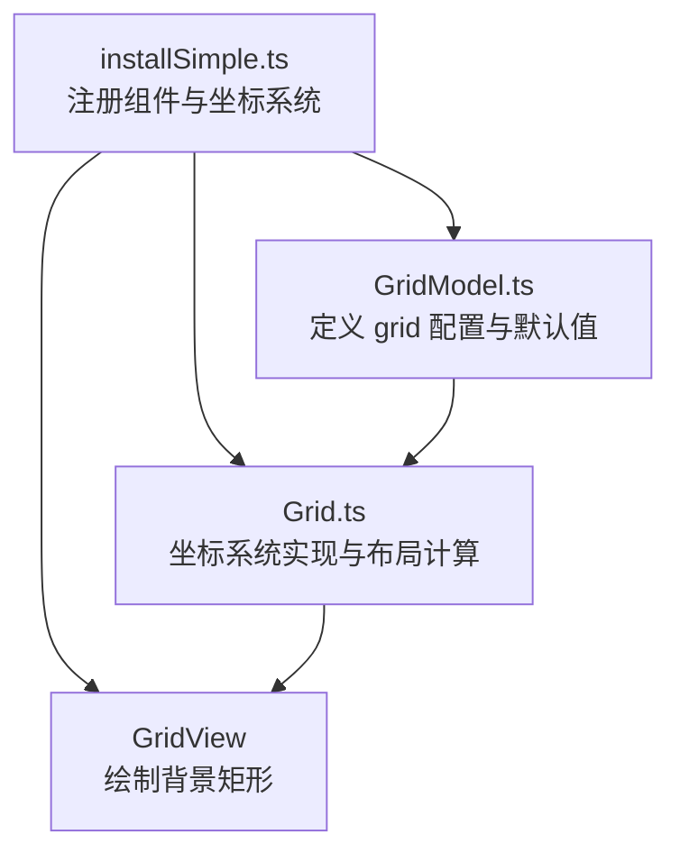
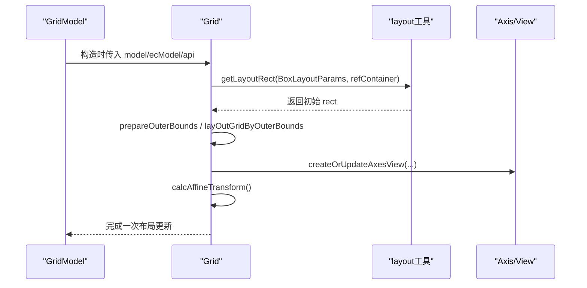
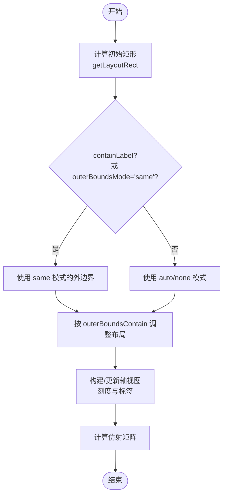
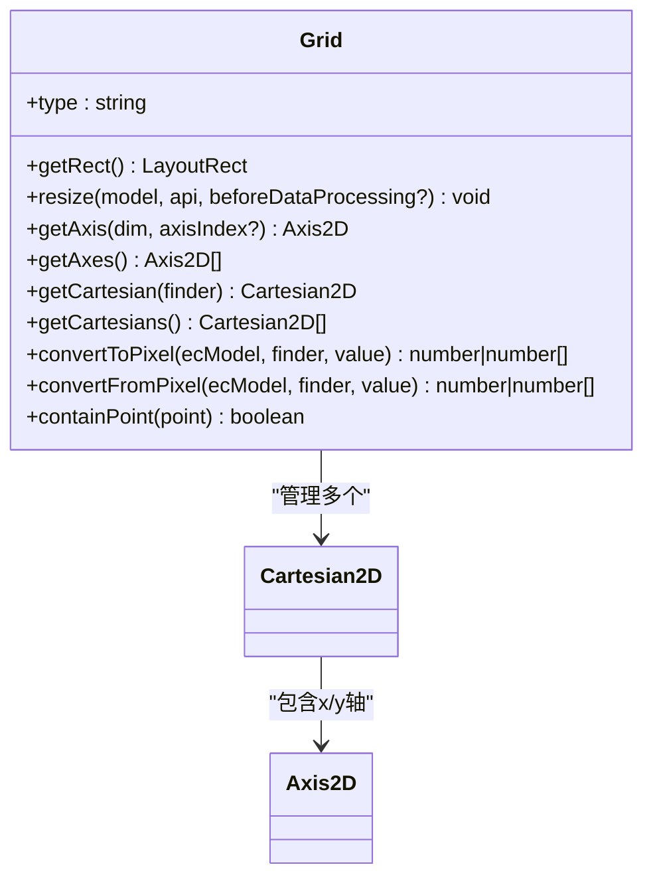
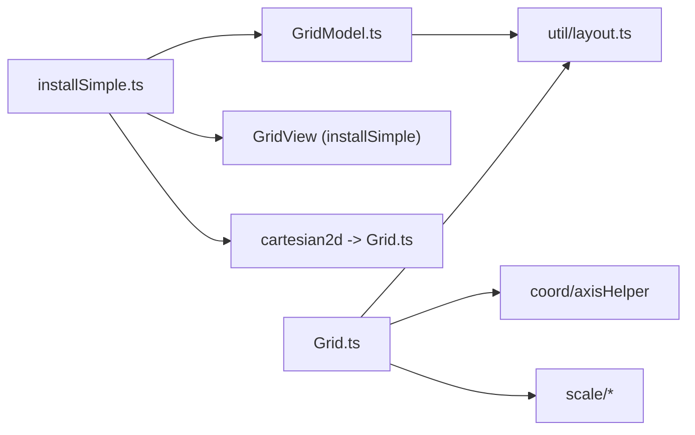

# 网格配置项

<cite>
**本文引用的文件**
- [src/coord/cartesian/GridModel.ts](file://src/coord/cartesian/GridModel.ts)
- [src/coord/cartesian/Grid.ts](file://src/coord/cartesian/Grid.ts)
- [src/component/grid/installSimple.ts](file://src/component/grid/installSimple.ts)
- [src/util/layout.ts](file://src/util/layout.ts)
</cite>

## 目录
1. [简介](#简介)
2. [项目结构](#项目结构)
3. [核心组件](#核心组件)
4. [架构总览](#架构总览)
5. [详细组件分析](#详细组件分析)
6. [依赖关系分析](#依赖关系分析)
7. [性能与响应式](#性能与响应式)
8. [故障排查指南](#故障排查指南)
9. [结论](#结论)
10. [附录：配置项速查表](#附录配置项速查表)

## 简介
本文件系统性说明 ECharts 直角坐标系中的“网格（grid）”组件，聚焦其布局控制能力与在图表整体布局中的作用。内容涵盖：
- 布局定位与尺寸：left、right、top、bottom、width、height
- 边界与包含策略：outerBoundsMode、outerBoundsContain、outerBoundsClampWidth/Height、containLabel（兼容旧版）
- 外观：backgroundColor、borderWidth、borderColor
- 阴影相关：shadowColor、shadowBlur、shadowOffsetX、shadowOffsetY（通过 ShadowOptionMixin 继承）
- 响应式：基于 box 布局的自适应与 resize 流程
- 网格在直角坐标系中的作用：为 xAxis/yAxis 提供布局容器，并参与刻度对齐、标签避让、数据到像素转换等

## 项目结构
网格由模型（GridModel）、坐标系统（Grid）、视图（GridView）三部分构成，并通过安装脚本注册到 ECharts 扩展系统中。

图示来源
- [src/component/grid/installSimple.ts:57-77](file://src/component/grid/installSimple.ts#L57-L77)
- [src/coord/cartesian/GridModel.ts:98-147](file://src/coord/cartesian/GridModel.ts#L98-L147)
- [src/coord/cartesian/Grid.ts:103-128](file://src/coord/cartesian/Grid.ts#L103-L128)

章节来源
- [src/component/grid/installSimple.ts:57-77](file://src/component/grid/installSimple.ts#L57-L77)
- [src/coord/cartesian/GridModel.ts:98-147](file://src/coord/cartesian/GridModel.ts#L98-L147)
- [src/coord/cartesian/Grid.ts:103-128](file://src/coord/cartesian/Grid.ts#L103-L128)

## 核心组件
- GridModel：承载 grid 的配置项、默认值与主题合并逻辑；声明布局模式为 box，支持 left/right/top/bottom/width/height 以及 outerBounds 系列选项。
- Grid：坐标系统主对象，负责创建/管理 Cartesian2D、Axis2D，执行 resize 与刻度对齐、标签避让、数据到像素转换等。
- GridView：渲染网格背景（可选），使用 grid 的样式与 ItemStyle。

章节来源
- [src/coord/cartesian/GridModel.ts:39-96](file://src/coord/cartesian/GridModel.ts#L39-L96)
- [src/coord/cartesian/GridModel.ts:126-147](file://src/coord/cartesian/GridModel.ts#L126-L147)
- [src/coord/cartesian/Grid.ts:103-128](file://src/coord/cartesian/Grid.ts#L103-L128)
- [src/component/grid/installSimple.ts:32-48](file://src/component/grid/installSimple.ts#L32-L48)

## 架构总览
网格作为直角坐标系的宿主，协调 x/y 轴与绘图区域的关系，并在 resize 阶段完成：
- 根据 box 布局参数计算初始矩形
- 依据 outerBounds 策略调整布局以容纳轴标签/名称
- 构建或更新 Axis2D 视图，计算刻度与标签
- 为 Cartesian2D 计算仿射矩阵，加速数据到像素转换

图示来源
- [src/coord/cartesian/Grid.ts:207-279](file://src/coord/cartesian/Grid.ts#L207-L279)
- [src/util/layout.ts:476-480](file://src/util/layout.ts#L476-L480)

## 详细组件分析

### 网格配置项详解（GridOption）
以下配置均来源于 GridModel 的类型定义与默认值，覆盖布局、外观与阴影。

- 布局定位与尺寸
  - left/right/top/bottom：相对于容器的偏移（支持百分比与数值）
  - width/height：网格宽高（可与边距组合，遵循 box 布局规则）
  - 这些属性来自 BoxLayoutOptionMixin，由 layout 工具统一解析与合并

- 边界与包含策略
  - containLabel（已弃用，兼容旧版）：是否将轴标签纳入网格大小估算
  - outerBoundsMode：'auto' | 'same' | 'none' | undefined
    - 'same'：外边界与 grid 自身布局矩形一致
    - 'none'：不限制外边界
    - 'auto'：默认行为，当 containLabel 为 true 时等价于 'same'
  - outerBounds：{left,right,top,bottom,width,height}，定义外边界矩形
  - outerBoundsContain：'all' | 'axisLabel' | 'auto' | undefined
    - 'all'：同时包含笛卡尔矩形、轴标签与轴名
    - 'axisLabel'：仅包含笛卡尔矩形与轴标签（更精确）
  - outerBoundsClampWidth/Height：防止因外边界约束导致网格宽/高小于原始设定（可设百分比）

- 外观
  - backgroundColor：网格背景色
  - borderWidth：网格边框宽度
  - borderColor：网格边框颜色

- 阴影（ShadowOptionMixin）
  - shadowColor：阴影颜色
  - shadowBlur：阴影模糊半径
  - shadowOffsetX：阴影水平偏移
  - shadowOffsetY：阴影垂直偏移
  - 注：阴影属于通用样式混入，具体渲染取决于视图层对阴影的支持

章节来源
- [src/coord/cartesian/GridModel.ts:39-96](file://src/coord/cartesian/GridModel.ts#L39-L96)
- [src/coord/cartesian/GridModel.ts:126-147](file://src/coord/cartesian/GridModel.ts#L126-L147)

### 布局与响应式机制
- 布局参考容器：通过 createBoxLayoutReference 获取 refContainer（视口或指定坐标系）
- 初始矩形：getLayoutRect 根据 left/right/top/bottom/width/height 计算
- 外边界约束：prepareOuterBounds + layOutGridByOuterBounds 按 outerBounds* 系列配置收缩布局
- 轴视图构建：createOrUpdateAxesView 决定刻度、标签位置与可见性
- 仿射矩阵：calcAffineTransform 加速 dataToPoint/pointToData

图示来源
- [src/coord/cartesian/Grid.ts:207-279](file://src/coord/cartesian/Grid.ts#L207-L279)
- [src/util/layout.ts:476-480](file://src/util/layout.ts#L476-L480)

章节来源
- [src/coord/cartesian/Grid.ts:207-279](file://src/coord/cartesian/Grid.ts#L207-L279)
- [src/util/layout.ts:476-480](file://src/util/layout.ts#L476-L480)

### 网格在直角坐标系中的作用
- 坐标系统宿主：Grid 持有多个 Cartesian2D（每个由一对 x/y 轴组成），并提供 getCartesian/getCartesians 等方法
- 轴管理与对齐：维护 axesMap/axesList，处理 alignTicks、onZero 等对齐逻辑
- 数据转换：convertToPixel/convertFromPixel 将数据值与像素坐标相互转换
- 包含判断：containPoint 用于事件命中检测等

图示来源
- [src/coord/cartesian/Grid.ts:103-128](file://src/coord/cartesian/Grid.ts#L103-L128)
- [src/coord/cartesian/Grid.ts:281-354](file://src/coord/cartesian/Grid.ts#L281-L354)
- [src/coord/cartesian/Grid.ts:394-402](file://src/coord/cartesian/Grid.ts#L394-L402)

章节来源
- [src/coord/cartesian/Grid.ts:103-128](file://src/coord/cartesian/Grid.ts#L103-L128)
- [src/coord/cartesian/Grid.ts:281-354](file://src/coord/cartesian/Grid.ts#L281-L354)
- [src/coord/cartesian/Grid.ts:394-402](file://src/coord/cartesian/Grid.ts#L394-L402)

### 视图渲染与阴影
- GridView 在 show=true 时绘制一个矩形，填充 backgroundColor，并应用 itemStyle（含边框等）
- 阴影相关属性（shadowColor/shadowBlur/shadowOffsetX/shadowOffsetY）由 ShadowOptionMixin 提供，具体渲染效果取决于底层图形库对阴影的支持与调用方式

章节来源
- [src/component/grid/installSimple.ts:32-48](file://src/component/grid/installSimple.ts#L32-L48)
- [src/coord/cartesian/GridModel.ts:39-96](file://src/coord/cartesian/GridModel.ts#L39-L96)

## 依赖关系分析
- installSimple 注册 GridView、GridModel、cartesian2d 坐标系统，并注册 x/y 轴模型与视图
- Grid 依赖 layout 工具进行布局计算，依赖 axisHelper/scale 等进行刻度与对齐
- GridModel 依赖 tokens 提供默认视觉值，依赖 layout 工具合并布局参数

图示来源
- [src/component/grid/installSimple.ts:57-77](file://src/component/grid/installSimple.ts#L57-L77)
- [src/coord/cartesian/Grid.ts:26-78](file://src/coord/cartesian/Grid.ts#L26-L78)
- [src/coord/cartesian/GridModel.ts:21-30](file://src/coord/cartesian/GridModel.ts#L21-L30)

章节来源
- [src/component/grid/installSimple.ts:57-77](file://src/component/grid/installSimple.ts#L57-L77)
- [src/coord/cartesian/Grid.ts:26-78](file://src/coord/cartesian/Grid.ts#L26-L78)
- [src/coord/cartesian/GridModel.ts:21-30](file://src/coord/cartesian/GridModel.ts#L21-L30)

## 性能与响应式
- 响应式：grid 采用 box 布局模式，窗口变化时会触发 resize，重新计算布局与轴视图
- 性能优化：
  - 仿射矩阵：在坐标系统内计算 affine matrix，加速数据到像素转换
  - 刻度对齐：alignTicks 减少重复计算，提升多轴一致性
  - 外边界约束：outerBounds 系列避免标签溢出导致的重绘抖动

章节来源
- [src/coord/cartesian/Grid.ts:273-277](file://src/coord/cartesian/Grid.ts#L273-L277)
- [src/coord/cartesian/Grid.ts:146-174](file://src/coord/cartesian/Grid.ts#L146-L174)

## 故障排查指南
- 网格未显示：确认 show 是否为 true；若为 false，则不会绘制背景矩形
- 标签溢出：启用 outerBoundsContain='axisLabel' 或 outerBoundsMode='same'，或使用 containLabel（兼容旧版）
- 多轴刻度不对齐：检查 alignTicks 设置与 interval 是否冲突；必要时移除 interval 让系统自动对齐
- onZero 异常：确保目标轴类型允许 onZero（非 category/time），且存在有效范围跨越零点
- 阴影无效：确认底层渲染器支持阴影；如需强一致效果，优先使用背景与边框

章节来源
- [src/coord/cartesian/GridModel.ts:126-147](file://src/coord/cartesian/GridModel.ts#L126-L147)
- [src/coord/cartesian/Grid.ts:614-717](file://src/coord/cartesian/Grid.ts#L614-L717)

## 结论
网格是 ECharts 直角坐标系的核心布局容器，通过 box 布局与 outerBounds 系列策略，精确控制绘图区域与轴标签/名称的空间关系。配合坐标系统的刻度对齐、仿射矩阵优化与响应式 resize，能够在复杂场景下保持稳定的布局与高性能表现。阴影与外观配置进一步满足视觉需求。

## 附录：配置项速查表
- 布局定位与尺寸
  - left/right/top/bottom：相对容器的偏移（支持百分比/数值）
  - width/height：网格宽高（与边距共同决定最终矩形）
- 边界与包含策略
  - containLabel：是否将轴标签纳入网格大小估算（兼容旧版）
  - outerBoundsMode：'auto' | 'same' | 'none' | undefined
  - outerBounds：{left,right,top,bottom,width,height}
  - outerBoundsContain：'all' | 'axisLabel' | 'auto' | undefined
  - outerBoundsClampWidth/Height：最小宽/高约束（百分比）
- 外观
  - backgroundColor：背景色
  - borderWidth：边框宽度
  - borderColor：边框颜色
- 阴影（ShadowOptionMixin）
  - shadowColor：阴影颜色
  - shadowBlur：模糊半径
  - shadowOffsetX：水平偏移
  - shadowOffsetY：垂直偏移

章节来源
- [src/coord/cartesian/GridModel.ts:39-96](file://src/coord/cartesian/GridModel.ts#L39-L96)
- [src/coord/cartesian/GridModel.ts:126-147](file://src/coord/cartesian/GridModel.ts#L126-L147)