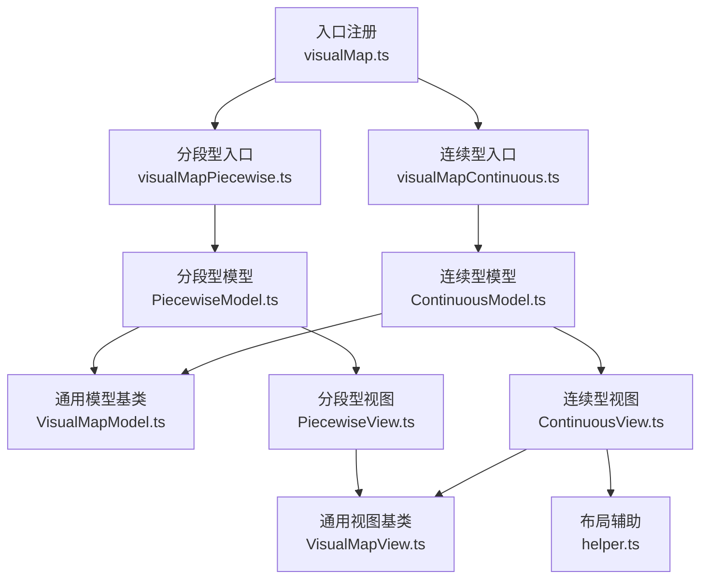
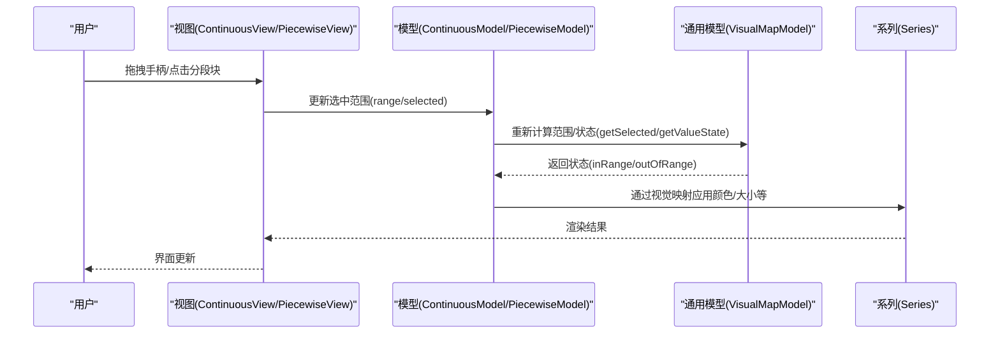
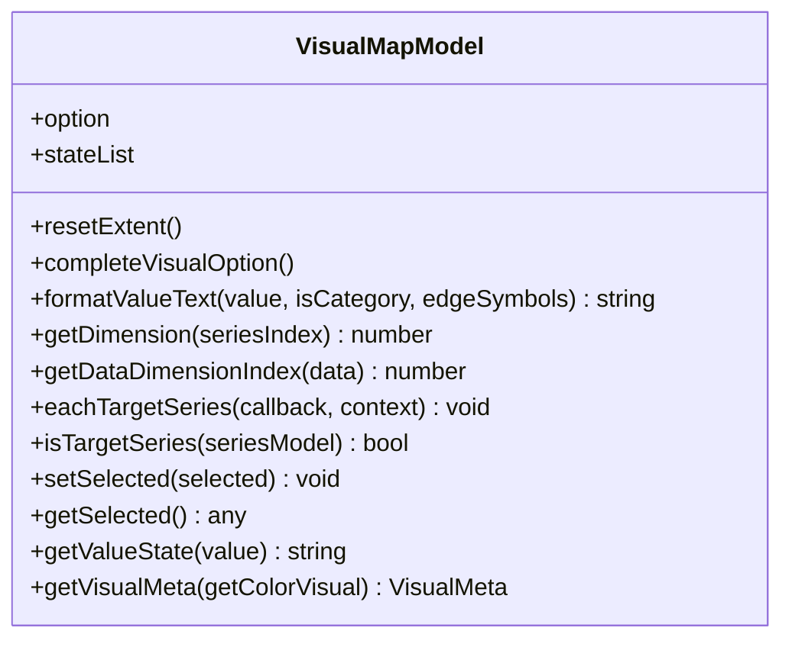
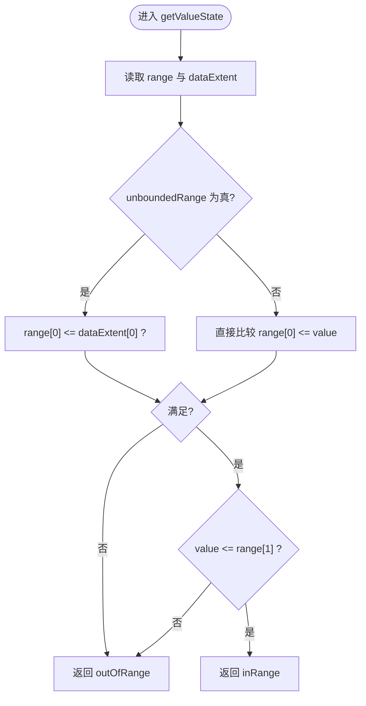
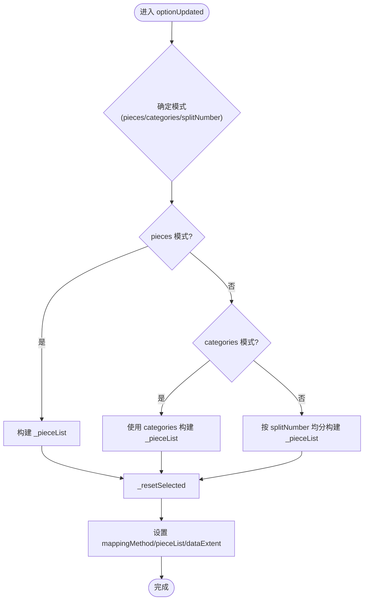
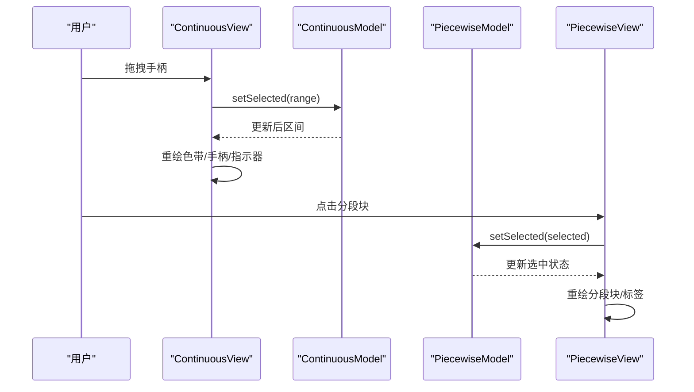
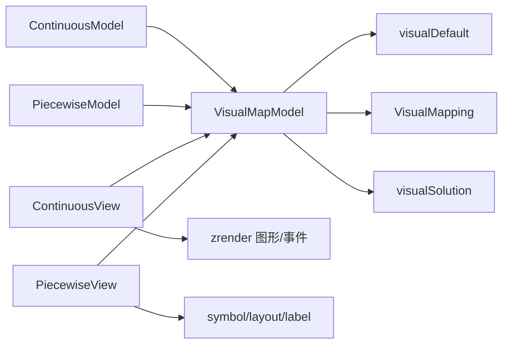

# 视觉映射配置项

<cite>
**本文引用的文件**
- [src/component/visualMap.ts](file://src/component/visualMap.ts)
- [src/component/visualMapContinuous.ts](file://src/component/visualMapContinuous.ts)
- [src/component/visualMapPiecewise.ts](file://src/component/visualMapPiecewise.ts)
- [src/component/visualMap/VisualMapModel.ts](file://src/component/visualMap/VisualMapModel.ts)
- [src/component/visualMap/ContinuousModel.ts](file://src/component/visualMap/ContinuousModel.ts)
- [src/component/visualMap/PiecewiseModel.ts](file://src/component/visualMap/PiecewiseModel.ts)
- [src/component/visualMap/VisualMapView.ts](file://src/component/visualMap/VisualMapView.ts)
- [src/component/visualMap/ContinuousView.ts](file://src/component/visualMap/ContinuousView.ts)
- [src/component/visualMap/PiecewiseView.ts](file://src/component/visualMap/PiecewiseView.ts)
- [src/component/visualMap/helper.ts](file://src/component/visualMap/helper.ts)
- [test/visualMap-continuous.html](file://test/visualMap-continuous.html)
- [test/visualMap-pieces.html](file://test/visualMap-pieces.html)
</cite>

## 目录
1. [简介](#简介)
2. [项目结构](#项目结构)
3. [核心组件](#核心组件)
4. [架构总览](#架构总览)
5. [详细组件分析](#详细组件分析)
6. [依赖关系分析](#依赖关系分析)
7. [性能考量](#性能考量)
8. [故障排查指南](#故障排查指南)
9. [结论](#结论)
10. [附录：配置项速查表](#附录：配置项速查表)

## 简介
本文件面向 ECharts 的“视觉映射”组件，系统说明其所有配置项与工作机制，覆盖连续型映射（continuous）与分段型映射（piecewise），包括范围配置（min、max）、颜色映射（color、inRange/outOfRange）、文本配置（text、formatter、textStyle）、选中范围（selectedRange/range）、以及根据数据值自动应用颜色、大小等视觉属性的流程。文档同时提供架构图、类图、时序图与流程图，帮助读者从概念到代码实现全面理解。

## 项目结构
视觉映射由“模型-视图”分层构成：
- 模型层：负责解析配置、计算数据范围、生成视觉映射规则、维护选中状态等。
- 视图层：负责渲染控件（滑块、色带、分段块）、处理交互（拖拽、点击、悬停联动）。

图表来源
- [src/component/visualMap.ts:20-23](file://src/component/visualMap.ts#L20-L23)
- [src/component/visualMapContinuous.ts:20-23](file://src/component/visualMapContinuous.ts#L20-L23)
- [src/component/visualMapPiecewise.ts:20-23](file://src/component/visualMapPiecewise.ts#L20-L23)
- [src/component/visualMap/VisualMapModel.ts:179-230](file://src/component/visualMap/VisualMapModel.ts#L179-L230)
- [src/component/visualMap/ContinuousModel.ts:106-125](file://src/component/visualMap/ContinuousModel.ts#L106-L125)
- [src/component/visualMap/PiecewiseModel.ts:117-163](file://src/component/visualMap/PiecewiseModel.ts#L117-L163)
- [src/component/visualMap/VisualMapView.ts:33-67](file://src/component/visualMap/VisualMapView.ts#L33-L67)
- [src/component/visualMap/ContinuousView.ts:92-166](file://src/component/visualMap/ContinuousView.ts#L92-L166)
- [src/component/visualMap/PiecewiseView.ts:31-106](file://src/component/visualMap/PiecewiseView.ts#L31-L106)
- [src/component/visualMap/helper.ts:40-72](file://src/component/visualMap/helper.ts#L40-L72)

章节来源
- [src/component/visualMap.ts:20-23](file://src/component/visualMap.ts#L20-L23)
- [src/component/visualMap/VisualMapModel.ts:179-230](file://src/component/visualMap/VisualMapModel.ts#L179-L230)

## 核心组件
- 通用模型 VisualMapModel：定义通用选项（如 min/max、seriesIndex/seriesId、dimension、inRange/outOfRange、target/controller、text/textStyle、precision、orient、padding、backgroundColor/borderColor/contentColor/inactiveColor 等），并负责合并主题、补全默认视觉、计算数据范围、格式化文本、选择状态判定等。
- 连续型模型 ContinuousModel：在通用模型基础上增加 range、unboundedRange、hoverLink、handle/indicator 样式等；维护当前选中区间，提供 getValueState、getVisualMeta 等。
- 分段型模型 PiecewiseModel：支持 pieces/categories/splitNumber 三种模式；维护 _pieceList、selected、selectedMode；提供 findTargetDataIndices、getRepresentValue、getVisualMeta 等。
- 通用视图 VisualMapView：提供 renderBackground、getControllerVisual、positionGroup 等通用能力。
- 连续型视图 ContinuousView：渲染渐变条、手柄、指示器、两端文本；处理拖拽、实时刷新、悬停联动系列。
- 分段型视图 PiecewiseView：渲染分段块、标签、两端文本；处理点击切换选中、悬停联动系列。

章节来源
- [src/component/visualMap/VisualMapModel.ts:59-170](file://src/component/visualMap/VisualMapModel.ts#L59-L170)
- [src/component/visualMap/VisualMapModel.ts:670-704](file://src/component/visualMap/VisualMapModel.ts#L670-L704)
- [src/component/visualMap/ContinuousModel.ts:37-99](file://src/component/visualMap/ContinuousModel.ts#L37-L99)
- [src/component/visualMap/ContinuousModel.ts:300-332](file://src/component/visualMap/ContinuousModel.ts#L300-L332)
- [src/component/visualMap/PiecewiseModel.ts:67-115](file://src/component/visualMap/PiecewiseModel.ts#L67-L115)
- [src/component/visualMap/PiecewiseModel.ts:414-431](file://src/component/visualMap/PiecewiseModel.ts#L414-L431)
- [src/component/visualMap/VisualMapView.ts:33-173](file://src/component/visualMap/VisualMapView.ts#L33-L173)
- [src/component/visualMap/ContinuousView.ts:92-166](file://src/component/visualMap/ContinuousView.ts#L92-L166)
- [src/component/visualMap/PiecewiseView.ts:31-106](file://src/component/visualMap/PiecewiseView.ts#L31-L106)

## 架构总览
视觉映射的工作流：
- 配置解析：模型读取用户配置，合并默认值与主题，确定映射策略（线性/分段/分类）。
- 范围计算：基于 min/max 或数据推断得到数据范围（_dataExtent）。
- 视觉映射构建：为 inRange/outOfRange 分别创建映射规则（颜色、透明度、符号、符号大小等）。
- 视图渲染：根据模型生成的元信息（如 stops、outerColors）绘制控件与数据可视化。
- 交互更新：拖拽/点击触发 selectDataRange 动作，更新 selectedRange/range/selected，重算并刷新视图。

图表来源
- [src/component/visualMap/ContinuousView.ts:385-442](file://src/component/visualMap/ContinuousView.ts#L385-L442)
- [src/component/visualMap/PiecewiseView.ts:217-245](file://src/component/visualMap/PiecewiseView.ts#L217-L245)
- [src/component/visualMap/ContinuousModel.ts:180-216](file://src/component/visualMap/ContinuousModel.ts#L180-L216)
- [src/component/visualMap/PiecewiseModel.ts:282-297](file://src/component/visualMap/PiecewiseModel.ts#L282-L297)
- [src/component/visualMap/VisualMapModel.ts:235-247](file://src/component/visualMap/VisualMapModel.ts#L235-L247)

## 详细组件分析

### 通用模型 VisualMapModel
- 关键选项
  - 范围：min、max（当未指定 pieces 时必须提供）
  - 维度：dimension、seriesTargets（可精确指定某系列的某维）
  - 视觉：inRange、outOfRange、controller/target（分别为控制器与目标数据的视觉配置）
  - 文本：text、formatter、textStyle、precision
  - 布局：orient、align、itemWidth/itemHeight、padding、backgroundColor/borderColor/contentColor/inactiveColor
  - 其他：show、inverse、categories（用于分类模式）
- 核心方法
  - resetExtent：设置数据范围（基于 min/max）
  - completeVisualOption：补全 inRange/outOfRange、controller/target 的默认视觉属性
  - formatValueText：将数值或区间格式化为显示文本
  - getDimension/getDataDimensionIndex：定位参与映射的数据维度
  - eachTargetSeries/isTargetSeries：遍历或判断目标系列
  - setSelected/getSelected：抽象接口，具体类型实现
  - getValueState：抽象接口，具体类型实现
  - getVisualMeta：抽象接口，具体类型实现

图表来源
- [src/component/visualMap/VisualMapModel.ts:179-230](file://src/component/visualMap/VisualMapModel.ts#L179-L230)
- [src/component/visualMap/VisualMapModel.ts:351-408](file://src/component/visualMap/VisualMapModel.ts#L351-L408)
- [src/component/visualMap/VisualMapModel.ts:448-482](file://src/component/visualMap/VisualMapModel.ts#L448-L482)
- [src/component/visualMap/VisualMapModel.ts:632-667](file://src/component/visualMap/VisualMapModel.ts#L632-L667)

章节来源
- [src/component/visualMap/VisualMapModel.ts:59-170](file://src/component/visualMap/VisualMapModel.ts#L59-L170)
- [src/component/visualMap/VisualMapModel.ts:211-247](file://src/component/visualMap/VisualMapModel.ts#L211-L247)
- [src/component/visualMap/VisualMapModel.ts:484-619](file://src/component/visualMap/VisualMapModel.ts#L484-L619)
- [src/component/visualMap/VisualMapModel.ts:670-704](file://src/component/visualMap/VisualMapModel.ts#L670-L704)

### 连续型映射 ContinuousModel
- 新增选项
  - range：当前选中的数值区间（可为 auto）
  - unboundedRange：当 range 触达 min/max 时是否视为无界
  - hoverLink/hoverLinkOnHandle/hoverLinkDataSize：悬停联动系列
  - handleIcon/handleSize/handleStyle、indicatorIcon/indicatorSize/indicatorStyle：控件外观
  - calculable：是否启用可计算（拖拽手柄）
- 行为要点
  - optionUpdated：重置范围、设置线性映射、初始化 range
  - setSelected/getSelected：维护并规范化选中区间
  - getValueState：依据 range 与 unboundedRange 判定 inRange/outOfRange
  - getVisualMeta：生成 stops 与 outerColors 供视图绘制渐变条
  - findTargetDataIndices：按区间筛选系列数据索引

图表来源
- [src/component/visualMap/ContinuousModel.ts:207-216](file://src/component/visualMap/ContinuousModel.ts#L207-L216)

章节来源
- [src/component/visualMap/ContinuousModel.ts:106-125](file://src/component/visualMap/ContinuousModel.ts#L106-L125)
- [src/component/visualMap/ContinuousModel.ts:143-183](file://src/component/visualMap/ContinuousModel.ts#L143-L183)
- [src/component/visualMap/ContinuousModel.ts:218-240](file://src/component/visualMap/ContinuousModel.ts#L218-L240)
- [src/component/visualMap/ContinuousModel.ts:245-298](file://src/component/visualMap/ContinuousModel.ts#L245-L298)
- [src/component/visualMap/ContinuousModel.ts:300-332](file://src/component/visualMap/ContinuousModel.ts#L300-L332)

### 分段型映射 PiecewiseModel
- 模式
  - pieces：显式定义分段（支持 lt/gt/lte/gte/min/max/value）
  - categories：以 categories 作为分类段
  - splitNumber：按数量均分
- 选项
  - minOpen/maxOpen：最小/最大端开闭
  - itemWidth/itemHeight/itemSymbol/itemGap：分段块外观与间距
  - selected/selectedMode：选中状态与单选/多选
  - showLabel：是否显示分段标签
  - hoverLink：悬停联动系列
- 行为要点
  - optionUpdated：确定模式、构建 _pieceList、重置选中、设置映射方法与 pieceList
  - completeVisualOption：若仅在 pieces 中定义了某些视觉属性，则补齐 inRange/outOfRange 的默认值
  - getValueState：查找值所在分段，结合 selected 判定状态
  - getVisualMeta：构造 stops 与 outerColors（非分类模式）
  - findTargetDataIndices：按分段索引筛选系列数据

图表来源
- [src/component/visualMap/PiecewiseModel.ts:130-163](file://src/component/visualMap/PiecewiseModel.ts#L130-L163)
- [src/component/visualMap/PiecewiseModel.ts:269-277](file://src/component/visualMap/PiecewiseModel.ts#L269-L277)
- [src/component/visualMap/PiecewiseModel.ts:441-587](file://src/component/visualMap/PiecewiseModel.ts#L441-L587)

章节来源
- [src/component/visualMap/PiecewiseModel.ts:67-115](file://src/component/visualMap/PiecewiseModel.ts#L67-L115)
- [src/component/visualMap/PiecewiseModel.ts:117-163](file://src/component/visualMap/PiecewiseModel.ts#L117-L163)
- [src/component/visualMap/PiecewiseModel.ts:169-210](file://src/component/visualMap/PiecewiseModel.ts#L169-L210)
- [src/component/visualMap/PiecewiseModel.ts:212-242](file://src/component/visualMap/PiecewiseModel.ts#L212-L242)
- [src/component/visualMap/PiecewiseModel.ts:289-326](file://src/component/visualMap/PiecewiseModel.ts#L289-L326)
- [src/component/visualMap/PiecewiseModel.ts:353-411](file://src/component/visualMap/PiecewiseModel.ts#L353-L411)
- [src/component/visualMap/PiecewiseModel.ts:414-431](file://src/component/visualMap/PiecewiseModel.ts#L414-L431)

### 视图层：渲染与交互
- 通用视图 VisualMapView
  - renderBackground：绘制背景矩形（含 padding、边框、填充）
  - getControllerVisual：根据目标值与视觉集群（color/opacity/symbol/symbolSize）获取控制器视觉值
  - positionGroup：按 boxLayout 参数定位组件
- 连续型视图 ContinuousView
  - 渲染：色带（inRange/outOfRange）、手柄、指示器、两端文本
  - 交互：拖拽手柄更新区间、实时更新视图、可选实时派发 selectDataRange、悬停联动系列
  - 颜色渐变：采样多段点生成 LinearGradient
- 分段型视图 PiecewiseView
  - 渲染：分段块、标签、两端文本
  - 交互：点击切换选中（单选/多选）、悬停联动系列

图表来源
- [src/component/visualMap/ContinuousView.ts:124-166](file://src/component/visualMap/ContinuousView.ts#L124-L166)
- [src/component/visualMap/ContinuousView.ts:385-442](file://src/component/visualMap/ContinuousView.ts#L385-L442)
- [src/component/visualMap/ContinuousView.ts:517-581](file://src/component/visualMap/ContinuousView.ts#L517-L581)
- [src/component/visualMap/PiecewiseView.ts:39-106](file://src/component/visualMap/PiecewiseView.ts#L39-L106)
- [src/component/visualMap/PiecewiseView.ts:217-245](file://src/component/visualMap/PiecewiseView.ts#L217-L245)

章节来源
- [src/component/visualMap/VisualMapView.ts:53-173](file://src/component/visualMap/VisualMapView.ts#L53-L173)
- [src/component/visualMap/ContinuousView.ts:92-166](file://src/component/visualMap/ContinuousView.ts#L92-L166)
- [src/component/visualMap/ContinuousView.ts:385-442](file://src/component/visualMap/ContinuousView.ts#L385-L442)
- [src/component/visualMap/ContinuousView.ts:517-581](file://src/component/visualMap/ContinuousView.ts#L517-L581)
- [src/component/visualMap/PiecewiseView.ts:39-106](file://src/component/visualMap/PiecewiseView.ts#L39-L106)
- [src/component/visualMap/PiecewiseView.ts:217-245](file://src/component/visualMap/PiecewiseView.ts#L217-L245)

## 依赖关系分析
- 入口注册：visualMap.ts、visualMapContinuous.ts、visualMapPiecewise.ts 分别调用扩展机制安装对应组件。
- 模型依赖：
  - VisualMapModel 依赖 visualDefault、VisualMapping、visualSolution、modelUtil、numberUtil、tokens 等工具与默认值。
  - ContinuousModel/PiecewiseModel 继承自 VisualMapModel，并在 optionUpdated 中调用父类逻辑。
- 视图依赖：
  - VisualMapView 依赖 layout、graphic、format、VisualMapping 等。
  - ContinuousView 依赖 zrender 图形元素、事件处理、动画等。
  - PiecewiseView 依赖 symbol、layout、label 等。

图表来源
- [src/component/visualMap/VisualMapModel.ts:20-47](file://src/component/visualMap/VisualMapModel.ts#L20-L47)
- [src/component/visualMap/ContinuousModel.ts:20-27](file://src/component/visualMap/ContinuousModel.ts#L20-L27)
- [src/component/visualMap/PiecewiseModel.ts:20-28](file://src/component/visualMap/PiecewiseModel.ts#L20-L28)
- [src/component/visualMap/VisualMapView.ts:20-30](file://src/component/visualMap/VisualMapView.ts#L20-L30)
- [src/component/visualMap/ContinuousView.ts:20-43](file://src/component/visualMap/ContinuousView.ts#L20-L43)
- [src/component/visualMap/PiecewiseView.ts:20-30](file://src/component/visualMap/PiecewiseView.ts#L20-L30)

章节来源
- [src/component/visualMap/VisualMapModel.ts:20-47](file://src/component/visualMap/VisualMapModel.ts#L20-L47)
- [src/component/visualMap/ContinuousModel.ts:20-27](file://src/component/visualMap/ContinuousModel.ts#L20-L27)
- [src/component/visualMap/PiecewiseModel.ts:20-28](file://src/component/visualMap/PiecewiseModel.ts#L20-L28)
- [src/component/visualMap/VisualMapView.ts:20-30](file://src/component/visualMap/VisualMapView.ts#L20-L30)

## 性能考量
- 连续型映射的颜色渐变采样：为避免 colorHue 等非线性的误差，内部对区间进行多次采样生成渐变色标，保证视觉平滑但带来一定计算开销。
- 大数据量下的视觉编码：建议合理设置 dimension/seriesTargets，避免对所有系列进行不必要的映射。
- 交互频率：realtime 模式下频繁更新视图可能影响性能，可根据场景关闭 realtime 或在数据量大时减少精度（precision）。
- 分段模式：splitNumber 过大可能导致分段过多，影响渲染与交互体验。

[本节为通用指导，不直接分析具体文件]

## 故障排查指南
- 问题：颜色或大小未按预期变化
  - 检查 inRange/outOfRange 是否正确配置，确认映射类型（color、symbol、symbolSize、opacity 等）是否被支持。
  - 确认 seriesIndex/seriesId/dimension/seriesTargets 是否指向了正确的系列与维度。
- 问题：范围无效或越界
  - 确保 min/max 已正确设置（未使用 pieces 时必填）。
  - 对于 continuous，检查 range 是否在数据范围内，必要时开启 unboundedRange。
- 问题：分段选中不生效
  - 检查 selectedMode 与 selected 的配置，确认点击事件是否触发 selectDataRange。
- 问题：文本显示异常
  - 检查 formatter 与 precision，确认 text 与 align/verticalAlign 的设置。

章节来源
- [src/component/visualMap/VisualMapModel.ts:484-619](file://src/component/visualMap/VisualMapModel.ts#L484-L619)
- [src/component/visualMap/ContinuousModel.ts:143-183](file://src/component/visualMap/ContinuousModel.ts#L143-L183)
- [src/component/visualMap/PiecewiseModel.ts:212-242](file://src/component/visualMap/PiecewiseModel.ts#L212-L242)

## 结论
ECharts 视觉映射组件通过统一的模型-视图架构，提供了灵活的连续型与分段型映射能力。借助 inRange/outOfRange、controller/target、text/formatter、range/selectedRange 等配置，可以精确控制数据到视觉属性的映射，并通过交互（拖拽、点击、悬停）动态调整展示效果。理解各配置项的作用与底层实现，有助于在不同业务场景中高效构建直观且高性能的数据可视化。

## 附录：配置项速查表
- 通用配置（适用于 continuous 与 piecewise）
  - 范围：min、max
  - 维度：dimension、seriesTargets
  - 视觉：inRange、outOfRange、controller、target
  - 文本：text、formatter、textStyle、precision
  - 布局：orient、align、itemWidth、itemHeight、padding、backgroundColor、borderColor、contentColor、inactiveColor
  - 其他：show、inverse、categories
- 连续型专属
  - range、unboundedRange、hoverLink、hoverLinkOnHandle、hoverLinkDataSize
  - handleIcon、handleSize、handleStyle、indicatorIcon、indicatorSize、indicatorStyle
  - calculable、realtime
- 分段型专属
  - pieces、categories、splitNumber
  - minOpen、maxOpen、itemSymbol、itemGap
  - selected、selectedMode、showLabel、hoverLink

示例参考
- 连续型示例：参见测试用例中的连续型配置与交互
- 分段型示例：参见测试用例中的分段配置与地图着色

章节来源
- [test/visualMap-continuous.html:89-145](file://test/visualMap-continuous.html#L89-L145)
- [test/visualMap-pieces.html:84-110](file://test/visualMap-pieces.html#L84-L110)