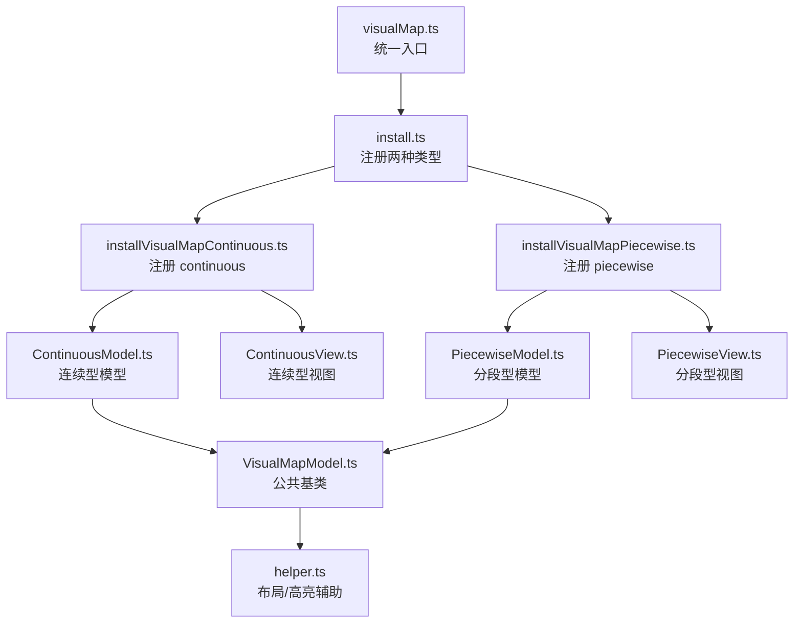
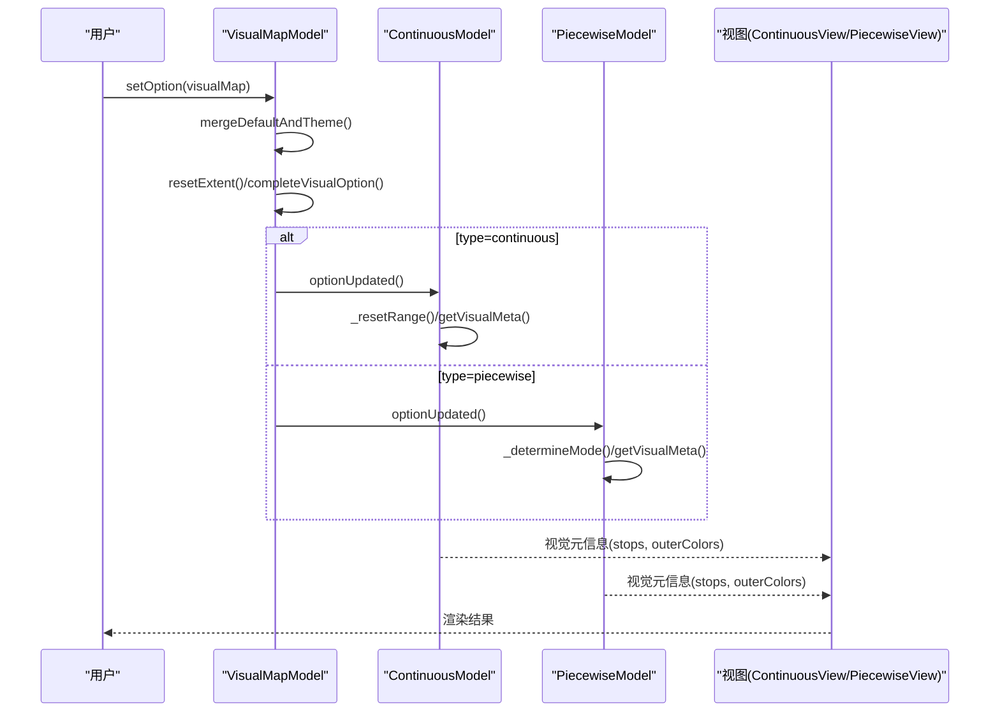
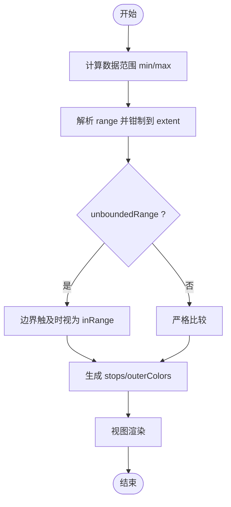
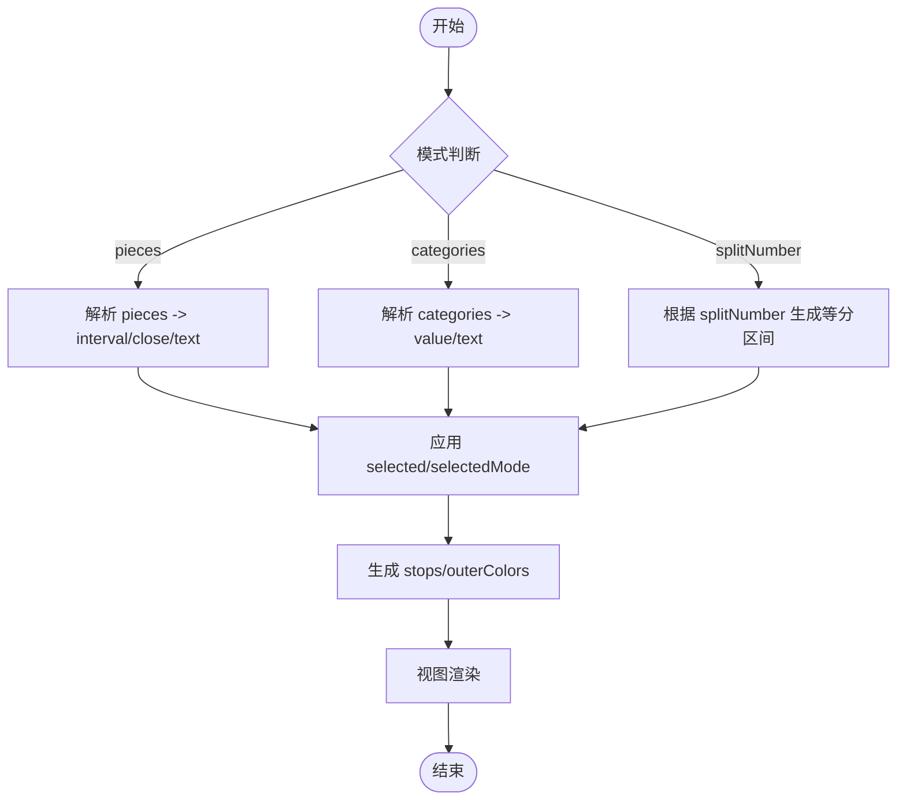
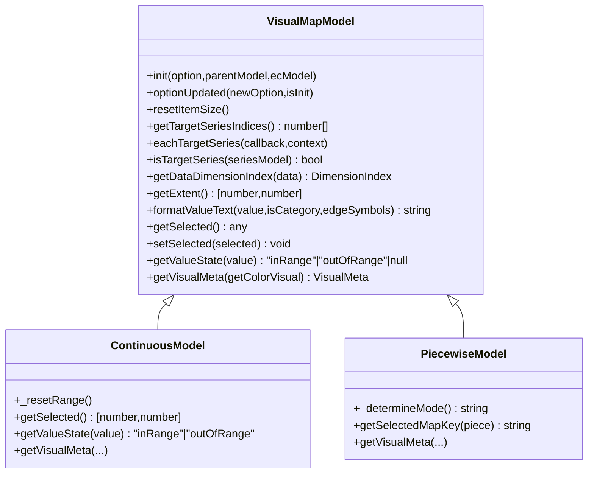
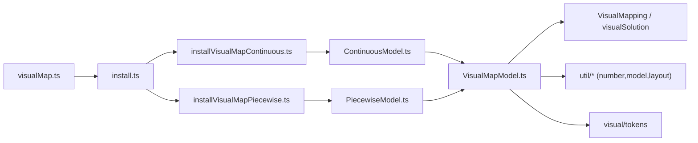

# 视觉映射配置项

<cite>
**本文引用的文件**
- [src/component/visualMap.ts](file://src/component/visualMap.ts)
- [src/component/visualMapContinuous.ts](file://src/component/visualMapContinuous.ts)
- [src/component/visualMapPiecewise.ts](file://src/component/visualMapPiecewise.ts)
- [src/component/visualMap/install.ts](file://src/component/visualMap/install.ts)
- [src/component/visualMap/installVisualMapContinuous.ts](file://src/component/visualMap/installVisualMapContinuous.ts)
- [src/component/visualMap/installVisualMapPiecewise.ts](file://src/component/visualMap/installVisualMapPiecewise.ts)
- [src/component/visualMap/VisualMapModel.ts](file://src/component/visualMap/VisualMapModel.ts)
- [src/component/visualMap/ContinuousModel.ts](file://src/component/visualMap/ContinuousModel.ts)
- [src/component/visualMap/PiecewiseModel.ts](file://src/component/visualMap/PiecewiseModel.ts)
- [src/component/visualMap/helper.ts](file://src/component/visualMap/helper.ts)
- [test/visualMap-continuous.html](file://test/visualMap-continuous.html)
- [test/visualMap-pieces.html](file://test/visualMap-pieces.html)
</cite>

## 目录
1. [简介](#简介)
2. [项目结构](#项目结构)
3. [核心组件](#核心组件)
4. [架构总览](#架构总览)
5. [详细组件分析](#详细组件分析)
6. [依赖关系分析](#依赖关系分析)
7. [性能与使用建议](#性能与使用建议)
8. [故障排查指南](#故障排查指南)
9. [结论](#结论)
10. [附录：常用配置速查与示例路径](#附录：常用配置速查与示例路径)

## 简介
本文件系统性说明 ECharts 的视觉映射（visualMap）能力，覆盖连续型（continuous）与分段型（piecewise）两类映射的配置项、数据流向、渲染流程与动态更新方式。文档面向不同技术背景的读者，既提供高层概览，也给出代码级结构与关键实现要点，帮助快速上手与深入定制。

## 项目结构
ECharts 将 visualMap 作为独立组件进行模块化安装与扩展：
- 顶层入口负责注册 continuous 与 piecewise 两种类型
- 每种类型包含 Model（模型）与 View（视图），以及通用逻辑与工具方法
- 测试用例提供了丰富的可视化配置示例

**图表来源**
- [src/component/visualMap.ts:20-23](file://src/component/visualMap.ts#L20-L23)
- [src/component/visualMap/install.ts:20-30](file://src/component/visualMap/install.ts#L20-L30)
- [src/component/visualMap/installVisualMapContinuous.ts:20-30](file://src/component/visualMap/installVisualMapContinuous.ts#L20-L30)
- [src/component/visualMap/installVisualMapPiecewise.ts:20-30](file://src/component/visualMap/installVisualMapPiecewise.ts#L20-L30)
- [src/component/visualMap/VisualMapModel.ts:179-230](file://src/component/visualMap/VisualMapModel.ts#L179-L230)
- [src/component/visualMap/ContinuousModel.ts:106-125](file://src/component/visualMap/ContinuousModel.ts#L106-L125)
- [src/component/visualMap/PiecewiseModel.ts:117-163](file://src/component/visualMap/PiecewiseModel.ts#L117-L163)
- [src/component/visualMap/helper.ts:34-72](file://src/component/visualMap/helper.ts#L34-L72)

**章节来源**
- [src/component/visualMap.ts:20-23](file://src/component/visualMap.ts#L20-L23)
- [src/component/visualMap/install.ts:20-30](file://src/component/visualMap/install.ts#L20-L30)

## 核心组件
- 公共基类 VisualMapModel：定义通用选项、默认值、目标系列选择、维度解析、范围计算、视觉状态（inRange/outOfRange）、格式化等
- 连续型 ContinuousModel：基于线性映射，支持 range、unboundedRange、hoverLink、handle/indicator 样式等
- 分段型 PiecewiseModel：支持 pieces/categories/splitNumber 三种模式，维护内部 pieceList，处理选中态与区间补全
- 视图层 ContinuousView/PiecewiseView：负责 UI 绘制与交互（如滑块、分段块）
- 工具 helper：自动对齐、尺寸计算、高亮批处理等

**章节来源**
- [src/component/visualMap/VisualMapModel.ts:59-170](file://src/component/visualMap/VisualMapModel.ts#L59-L170)
- [src/component/visualMap/VisualMapModel.ts:670-704](file://src/component/visualMap/VisualMapModel.ts#L670-L704)
- [src/component/visualMap/ContinuousModel.ts:37-99](file://src/component/visualMap/ContinuousModel.ts#L37-L99)
- [src/component/visualMap/PiecewiseModel.ts:67-115](file://src/component/visualMap/PiecewiseModel.ts#L67-L115)
- [src/component/visualMap/helper.ts:34-72](file://src/component/visualMap/helper.ts#L34-L72)

## 架构总览
visualMap 在初始化时完成以下关键步骤：
- 合并主题与默认选项
- 确定目标系列与维度
- 计算数据范围（min/max）
- 构建视觉映射（颜色、符号、大小等）
- 生成视觉元信息（stops、outerColors）供渲染使用

**图表来源**
- [src/component/visualMap/VisualMapModel.ts:211-230](file://src/component/visualMap/VisualMapModel.ts#L211-L230)
- [src/component/visualMap/ContinuousModel.ts:114-125](file://src/component/visualMap/ContinuousModel.ts#L114-L125)
- [src/component/visualMap/PiecewiseModel.ts:130-163](file://src/component/visualMap/PiecewiseModel.ts#L130-L163)

## 详细组件分析

### 连续型视觉映射（continuous）
- 适用场景：数值型数据的渐变映射，如颜色、透明度、符号大小随数值变化
- 关键特性：
  - 线性映射（mappingMethod='linear'）
  - 可交互范围选择（range），支持无界范围（unboundedRange）
  - 悬停联动（hoverLink/hoverLinkOnHandle）
  - 手柄与指示器样式（handleStyle/indicatorStyle）
  - 多系列/多维度映射（seriesIndex/seriesId/dimension/seriesTargets）

**图表来源**
- [src/component/visualMap/ContinuousModel.ts:143-160](file://src/component/visualMap/ContinuousModel.ts#L143-L160)
- [src/component/visualMap/ContinuousModel.ts:207-216](file://src/component/visualMap/ContinuousModel.ts#L207-L216)
- [src/component/visualMap/ContinuousModel.ts:245-298](file://src/component/visualMap/ContinuousModel.ts#L245-L298)

**章节来源**
- [src/component/visualMap/ContinuousModel.ts:106-125](file://src/component/visualMap/ContinuousModel.ts#L106-L125)
- [src/component/visualMap/ContinuousModel.ts:180-216](file://src/component/visualMap/ContinuousModel.ts#L180-L216)
- [src/component/visualMap/ContinuousModel.ts:245-298](file://src/component/visualMap/ContinuousModel.ts#L245-L298)

### 分段型视觉映射（piecewise）
- 适用场景：离散区间或类别映射，支持自定义标签、特殊值、开闭区间
- 三种模式：
  - pieces：显式定义区间或单值
  - categories：按类别名称映射
  - splitNumber：自动均分区间
- 关键特性：
  - 选中态控制（selected/selectedMode）
  - 区间补全与边界处理（minOpen/maxOpen）
  - 文本格式化（formatValueText）
  - 视觉元信息生成（stops/outerColors）

**图表来源**
- [src/component/visualMap/PiecewiseModel.ts:130-163](file://src/component/visualMap/PiecewiseModel.ts#L130-L163)
- [src/component/visualMap/PiecewiseModel.ts:269-277](file://src/component/visualMap/PiecewiseModel.ts#L269-L277)
- [src/component/visualMap/PiecewiseModel.ts:441-587](file://src/component/visualMap/PiecewiseModel.ts#L441-L587)
- [src/component/visualMap/PiecewiseModel.ts:353-411](file://src/component/visualMap/PiecewiseModel.ts#L353-L411)

**章节来源**
- [src/component/visualMap/PiecewiseModel.ts:117-163](file://src/component/visualMap/PiecewiseModel.ts#L117-L163)
- [src/component/visualMap/PiecewiseModel.ts:212-242](file://src/component/visualMap/PiecewiseModel.ts#L212-L242)
- [src/component/visualMap/PiecewiseModel.ts:289-326](file://src/component/visualMap/PiecewiseModel.ts#L289-L326)
- [src/component/visualMap/PiecewiseModel.ts:353-411](file://src/component/visualMap/PiecewiseModel.ts#L353-L411)

### 公共基类与通用能力（VisualMapModel）
- 目标系列选择：支持 seriesIndex/seriesId/seriesTargets
- 维度解析：dimension/getDataDimensionIndex
- 范围计算：resetExtent/getExtent
- 视觉状态：getValueState（由子类实现）
- 文本格式化：formatValueText（支持字符串模板与函数）
- 默认选项：show、orient、textGap、precision、textStyle、backgroundColor、borderColor、padding 等

**图表来源**
- [src/component/visualMap/VisualMapModel.ts:179-230](file://src/component/visualMap/VisualMapModel.ts#L179-L230)
- [src/component/visualMap/VisualMapModel.ts:259-331](file://src/component/visualMap/VisualMapModel.ts#L259-L331)
- [src/component/visualMap/VisualMapModel.ts:351-408](file://src/component/visualMap/VisualMapModel.ts#L351-L408)
- [src/component/visualMap/VisualMapModel.ts:480-505](file://src/component/visualMap/VisualMapModel.ts#L480-L505)
- [src/component/visualMap/VisualMapModel.ts:621-630](file://src/component/visualMap/VisualMapModel.ts#L621-L630)
- [src/component/visualMap/VisualMapModel.ts:665-667](file://src/component/visualMap/VisualMapModel.ts#L665-L667)
- [src/component/visualMap/ContinuousModel.ts:106-125](file://src/component/visualMap/ContinuousModel.ts#L106-L125)
- [src/component/visualMap/ContinuousModel.ts:180-216](file://src/component/visualMap/ContinuousModel.ts#L180-L216)
- [src/component/visualMap/ContinuousModel.ts:245-298](file://src/component/visualMap/ContinuousModel.ts#L245-L298)
- [src/component/visualMap/PiecewiseModel.ts:117-163](file://src/component/visualMap/PiecewiseModel.ts#L117-L163)
- [src/component/visualMap/PiecewiseModel.ts:212-242](file://src/component/visualMap/PiecewiseModel.ts#L212-L242)
- [src/component/visualMap/PiecewiseModel.ts:289-326](file://src/component/visualMap/PiecewiseModel.ts#L289-L326)
- [src/component/visualMap/PiecewiseModel.ts:353-411](file://src/component/visualMap/PiecewiseModel.ts#L353-L411)

**章节来源**
- [src/component/visualMap/VisualMapModel.ts:59-170](file://src/component/visualMap/VisualMapModel.ts#L59-L170)
- [src/component/visualMap/VisualMapModel.ts:670-704](file://src/component/visualMap/VisualMapModel.ts#L670-L704)

## 依赖关系分析
- 安装与注册：
  - visualMap.ts 调用 install.ts，后者分别注册 continuous 与 piecewise
  - 各自 install* 文件注册对应的 Model 与 View，并调用通用安装逻辑
- 运行时依赖：
  - VisualMapping/visualSolution：用于创建视觉映射与替换选项
  - 工具模块：numberUtil、modelUtil、layout 等
  - 主题 tokens：默认颜色、边框、尺寸等

**图表来源**
- [src/component/visualMap.ts:20-23](file://src/component/visualMap.ts#L20-L23)
- [src/component/visualMap/install.ts:20-30](file://src/component/visualMap/install.ts#L20-L30)
- [src/component/visualMap/installVisualMapContinuous.ts:20-30](file://src/component/visualMap/installVisualMapContinuous.ts#L20-L30)
- [src/component/visualMap/installVisualMapPiecewise.ts:20-30](file://src/component/visualMap/installVisualMapPiecewise.ts#L20-L30)
- [src/component/visualMap/VisualMapModel.ts:20-46](file://src/component/visualMap/VisualMapModel.ts#L20-L46)

**章节来源**
- [src/component/visualMap/install.ts:20-30](file://src/component/visualMap/install.ts#L20-L30)
- [src/component/visualMap/VisualMapModel.ts:20-46](file://src/component/visualMap/VisualMapModel.ts#L20-L46)

## 性能与使用建议
- 大数据量：
  - 合理设置 dimension 与 seriesTargets，避免对无关系列/维度进行映射
  - 使用 outOfRange 降低非关注数据的视觉复杂度
- 交互性能：
  - realtime 控制连续型映射是否实时响应拖拽
  - hoverLink 开启后可联动高亮，注意数据量大时的渲染开销
- 精度与显示：
  - precision 控制小数位数；splitNumber 自动调整精度
  - textGap、itemWidth/itemHeight 影响控件布局与可读性
- 内存与重绘：
  - 频繁 setOption 时尽量只变更必要字段（如 inRange/outOfRange/target/controller）
  - 利用 replacableOptionKeys 减少不必要的重建

[本节为通用指导，不直接分析具体文件]

## 故障排查指南
- 未生效或映射异常：
  - 检查 dimension 是否正确指向目标维度
  - 确认 seriesIndex/seriesId/seriesTargets 是否匹配实际系列
  - 校验 min/max 与数据范围是否一致
- 文本显示问题：
  - formatter 返回格式是否符合预期（字符串模板或函数）
  - precision 与 splitNumber 导致的精度差异
- 交互问题：
  - calculable/realtime/hoverLink 等开关是否启用
  - handle/indicator 样式是否被覆盖导致不可见
- 分段模式问题：
  - pieces 区间是否合法（下界不大于上界）
  - minOpen/maxOpen 是否满足需求
  - selected/selectedMode 是否正确控制选中态

**章节来源**
- [src/component/visualMap/PiecewiseModel.ts:551-558](file://src/component/visualMap/PiecewiseModel.ts#L551-L558)
- [src/component/visualMap/VisualMapModel.ts:351-408](file://src/component/visualMap/VisualMapModel.ts#L351-L408)
- [src/component/visualMap/ContinuousModel.ts:143-160](file://src/component/visualMap/ContinuousModel.ts#L143-L160)

## 结论
visualMap 通过统一的模型抽象与两种具体实现（continuous/piecewise），为数值与类别数据提供了灵活、强大的视觉编码能力。理解其核心属性、数据流与渲染流程，有助于在不同业务场景中高效配置与优化。

[本节为总结，不直接分析具体文件]

## 附录：常用配置速查与示例路径
- 基础与布局
  - show、orient、left/right/top/bottom、width/height、align、padding、itemGap、itemWidth/itemHeight、backgroundColor、borderColor、borderWidth、contentColor、inactiveColor
- 数据与映射
  - seriesIndex/seriesId/seriesTargets、dimension、min、max、range（continuous）、unboundedRange（continuous）、pieces/categories/splitNumber（piecewise）、selected/selectedMode（piecewise）
- 视觉样式
  - inRange/outOfRange/target/controller（支持 color、symbol、symbolSize、opacity、colorHue/colorSaturation/colorLightness 等）
  - color（兼容旧版，已弃用）
- 文本与提示
  - text、textGap、formatter、textStyle、label（piecewise 中可由 formatValueText 生成）
- 交互与联动
  - calculable、realtime、hoverLink、hoverLinkOnHandle、tooltip（配合 tooltip 组件）
- 示例参考
  - 连续型示例：[test/visualMap-continuous.html](file://test/visualMap-continuous.html)
  - 分段型示例：[test/visualMap-pieces.html](file://test/visualMap-pieces.html)

[本节为速查与示例索引，不直接分析具体文件]