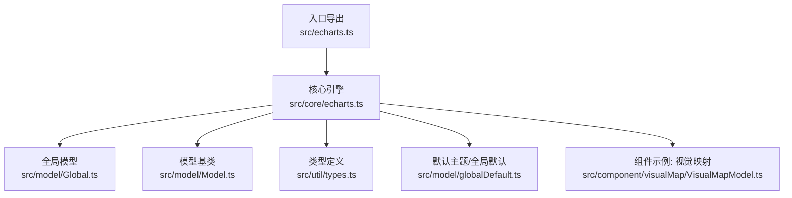
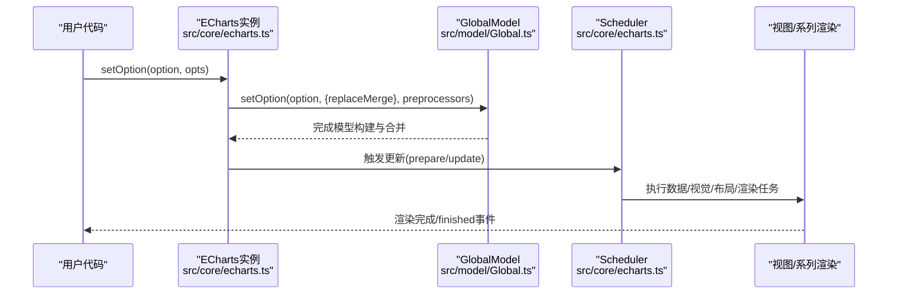
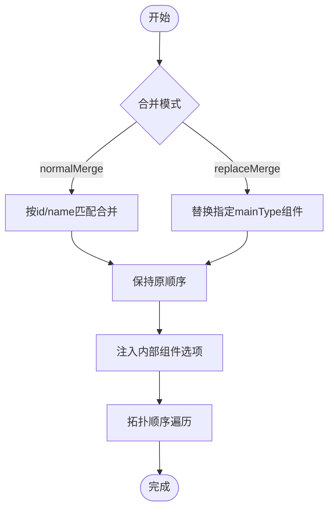
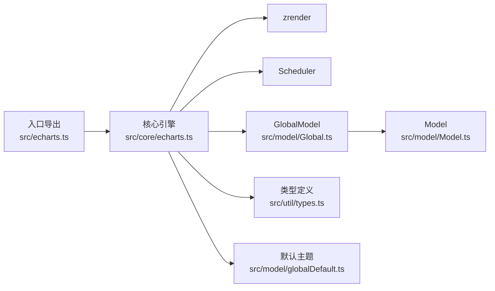

# 配置项参考

<cite>
**本文引用的文件**
- [src/echarts.ts](file://src/echarts.ts)
- [index.d.ts](file://index.d.ts)
- [src/core/echarts.ts](file://src/core/echarts.ts)
- [src/model/globalDefault.ts](file://src/model/globalDefault.ts)
- [src/util/types.ts](file://src/util/types.ts)
- [src/model/Global.ts](file://src/model/Global.ts)
- [src/model/Model.ts](file://src/model/Model.ts)
- [src/component/visualMap/VisualMapModel.ts](file://src/component/visualMap/VisualMapModel.ts)
</cite>

## 目录
1. [简介](#简介)
2. [项目结构](#项目结构)
3. [核心组件](#核心组件)
4. [架构总览](#架构总览)
5. [详细组件分析](#详细组件分析)
6. [依赖关系分析](#依赖关系分析)
7. [性能考量](#性能考量)
8. [故障排查指南](#故障排查指南)
9. [结论](#结论)
10. [附录](#附录)

## 简介
本参考文档面向 ECharts 的完整配置项体系，覆盖全局配置、系列配置与组件配置的属性范围、类型、默认值来源、继承与优先级规则、验证与错误处理、动态更新机制与性能影响，并提供 TypeScript 类型定义与智能提示支持说明。文档基于源码实现进行梳理，确保内容与实际行为一致。

## 项目结构
ECharts 的配置系统由入口模块、核心引擎、模型层、类型定义与默认主题共同构成：
- 入口导出与默认能力装配：负责注册渲染器、数据集等默认能力，并暴露初始化入口。
- 核心引擎：管理实例生命周期、选项合并、调度器、渲染流程与事件。
- 模型层：维护全局模型、组件模型、选项合并策略与拓扑顺序。
- 类型定义：提供完整的 Option 类型、公共 Mixin、动画与视觉相关类型。
- 默认主题与全局默认：提供默认颜色、文本样式、动画阈值等。

图表来源
- [src/echarts.ts:20-46](file://src/echarts.ts#L20-L46)
- [src/core/echarts.ts:44-144](file://src/core/echarts.ts#L44-L144)
- [src/model/Global.ts:334-572](file://src/model/Global.ts#L334-L572)
- [src/model/Model.ts:65-104](file://src/model/Model.ts#L65-L104)
- [src/util/types.ts:750-1200](file://src/util/types.ts#L750-L1200)
- [src/model/globalDefault.ts:20-128](file://src/model/globalDefault.ts#L20-L128)
- [src/component/visualMap/VisualMapModel.ts:73-130](file://src/component/visualMap/VisualMapModel.ts#L73-L130)

章节来源
- [src/echarts.ts:20-46](file://src/echarts.ts#L20-L46)
- [src/core/echarts.ts:44-144](file://src/core/echarts.ts#L44-L144)
- [src/model/Global.ts:334-572](file://src/model/Global.ts#L334-L572)
- [src/model/Model.ts:65-104](file://src/model/Model.ts#L65-L104)
- [src/util/types.ts:750-1200](file://src/util/types.ts#L750-L1200)
- [src/model/globalDefault.ts:20-128](file://src/model/globalDefault.ts#L20-L128)
- [src/component/visualMap/VisualMapModel.ts:73-130](file://src/component/visualMap/VisualMapModel.ts#L73-L130)

## 核心组件
- 入口导出与默认能力
  - 默认启用 Canvas 渲染器与 Dataset 组件，保证兼容性与开箱即用。
  - 暴露 init 方法用于创建图表实例。
- 核心引擎（ECharts 类）
  - 管理 setOption、dispatchAction、resize、事件绑定、渲染循环与调度。
  - 维护 EC_CYCLE 生命周期（准备、全量更新、增量更新、渐进式渲染）。
  - 提供优先级常量（处理器与视觉阶段），控制数据流与视觉编码顺序。
- 模型层
  - GlobalModel：负责组件拓扑遍历、选项合并（normalMerge/replaceMerge）、内部组件注入。
  - Model：提供 get/mergeOption 等通用能力。
- 类型定义
  - ECBasicOption/ECUnitOption：顶层 option 结构，包含 title、legend、series、grid、tooltip 等组件键。
  - 动画、布局、颜色、位置等 Mixin 类型，统一各组件可选项。
- 默认主题与全局默认
  - 提供 color、textStyle、animation*、progressive*、hoverLayerThreshold、useUTC 等默认值。

章节来源
- [src/echarts.ts:20-46](file://src/echarts.ts#L20-L46)
- [src/core/echarts.ts:150-209](file://src/core/echarts.ts#L150-L209)
- [src/core/echarts.ts:211-277](file://src/core/echarts.ts#L211-L277)
- [src/model/Global.ts:334-572](file://src/model/Global.ts#L334-L572)
- [src/model/Model.ts:65-104](file://src/model/Model.ts#L65-L104)
- [src/util/types.ts:750-1200](file://src/util/types.ts#L750-L1200)
- [src/model/globalDefault.ts:20-128](file://src/model/globalDefault.ts#L20-L128)

## 架构总览
下图展示从用户调用 setOption 到渲染输出的关键路径，以及配置在模型层的合并与优先级应用。

图表来源
- [src/core/echarts.ts:722-800](file://src/core/echarts.ts#L722-L800)
- [src/model/Global.ts:334-572](file://src/model/Global.ts#L334-L572)

章节来源
- [src/core/echarts.ts:722-800](file://src/core/echarts.ts#L722-L800)
- [src/model/Global.ts:334-572](file://src/model/Global.ts#L334-L572)

## 详细组件分析

### 全局配置（ECBasicOption/ECUnitOption）
- 顶层键集合
  - backgroundColor、darkMode、textStyle、useUTC、hoverLayerThreshold、stateAnimation 等。
  - 通过类型定义可知这些键属于 ECUnitOption，并可扩展为任意组件键（如 series、title、legend 等）。
- 默认值来源
  - globalDefault.ts 提供默认颜色、文本样式、动画阈值、渐进式渲染阈值、hoverLayerThreshold、useUTC 等。
- 继承与优先级
  - 主题/默认值 -> 用户 option -> 组件级覆盖；具体合并由 GlobalModel 的 normalMerge/replaceMerge 控制。
- 使用场景
  - 全局主题切换（darkMode）、跨组件文本样式统一（textStyle）、交互优化（hoverLayerThreshold）、时间轴时区（useUTC）。

章节来源
- [src/util/types.ts:793-859](file://src/util/types.ts#L793-L859)
- [src/model/globalDefault.ts:20-128](file://src/model/globalDefault.ts#L20-L128)
- [src/model/Global.ts:334-572](file://src/model/Global.ts#L334-L572)

### 系列配置（series.*）
- 类型与结构
  - series 数组中的每个元素对应一个系列，其子类型（bar、line、pie 等）由组件注册决定。
  - 通用 Mixin（动画、颜色、布局、视觉映射等）适用于多数系列。
- 数据与维度
  - OptionSourceData 支持多种数据格式（原始数组、对象行、键列、TypedArray）。
  - encode 允许将数据维度映射到坐标轴或视觉通道。
- 默认值与继承
  - 系列级样式可覆盖全局 textStyle/color；itemStyle、label 等可在数据项级别进一步覆盖。
- 使用场景
  - 大数据量下的动画阈值控制（animationThreshold）、堆叠/分组（stack）、视觉映射（visualMap）。

章节来源
- [src/util/types.ts:861-954](file://src/util/types.ts#L861-L954)
- [src/util/types.ts:1043-1155](file://src/util/types.ts#L1043-L1155)
- [src/model/globalDefault.ts:20-128](file://src/model/globalDefault.ts#L20-L128)

### 组件配置（title、legend、grid、tooltip、dataZoom、visualMap 等）
- 通用布局与样式
  - BoxLayoutOptionMixin 提供 width/height/top/right/bottom/left 等定位尺寸。
  - ShadowOptionMixin、BorderOptionMixin 提供阴影与边框样式。
- 交互与漫游
  - RoamOptionMixin 提供 roam、center、zoom、scaleLimit 等交互能力。
- 视觉映射（以 visualMap 为例）
  - seriesIndex/seriesId/dimension/seriesTargets 指定作用域与维度。
  - inRange/outRange 定义选中/未选中范围的视觉映射。
  - itemWidth/itemHeight 控制控件显示尺寸。
- 使用场景
  - 多系列联动着色（visualMap）、图例筛选（legend）、区域缩放（dataZoom）、提示框格式化（tooltip）。

章节来源
- [src/util/types.ts:1051-1200](file://src/util/types.ts#L1051-L1200)
- [src/component/visualMap/VisualMapModel.ts:73-130](file://src/component/visualMap/VisualMapModel.ts#L73-L130)

### 动画与状态过渡
- 动画选项
  - AnimationOption 与 AnimationOptionMixin 提供 duration/easing/delay 及更新动画参数。
- 状态动画
  - stateAnimation 控制高亮/失焦等状态切换动画。
- 使用场景
  - 大数据集禁用动画（animationThreshold）、平滑过渡（easing）、按需延迟（delay）。

章节来源
- [src/util/types.ts:1099-1155](file://src/util/types.ts#L1099-L1155)
- [src/model/globalDefault.ts:102-117](file://src/model/globalDefault.ts#L102-L117)

### 配置合并与优先级规则
- 合并模式
  - normalMerge：按 id/name 匹配合并，保持原有顺序。
  - replaceMerge：仅替换指定 mainType 的组件，保留序列一致性。
- 内部组件注入
  - internalComponentCreator 可为某些 mainType 自动注入内部组件选项。
- 拓扑顺序
  - GlobalModel.topologicalTravel 确保组件依赖顺序正确，避免初始化时的相互引用问题。

图表来源
- [src/model/Global.ts:334-572](file://src/model/Global.ts#L334-L572)
- [src/model/internalComponentCreator.ts:58-74](file://src/model/internalComponentCreator.ts#L58-L74)

章节来源
- [src/model/Global.ts:334-572](file://src/model/Global.ts#L334-L572)
- [src/model/internalComponentCreator.ts:58-74](file://src/model/internalComponentCreator.ts#L58-L74)

### 配置验证与错误处理
- 运行时校验
  - 在开发模式下对非法 id/name 输出警告；禁止在主流程中调用 setOption。
  - 对无效输入进行断言与日志记录。
- 错误处理策略
  - 捕获异常并清理状态，避免不一致渲染结果。
  - 通过 warn/error 输出诊断信息，便于定位问题。

章节来源
- [src/core/echarts.ts:741-800](file://src/core/echarts.ts#L741-L800)
- [src/util/model.ts:535-578](file://src/util/model.ts#L535-L578)

### 动态更新与性能影响
- setOption 与 lazyUpdate
  - 支持 lazyUpdate 延迟到下一帧执行，减少频繁调用带来的开销。
- 渐进式渲染
  - progressive/progressiveThreshold 控制大数据集的渐进渲染，提升首屏体验。
- 悬停层优化
  - hoverLayerThreshold 控制是否启用独立悬停层，避免大规模重绘。
- 调度器优先级
  - PRIORITY.PROCESSOR/VISUAL 控制数据/视觉阶段顺序，确保正确性与性能平衡。

章节来源
- [src/core/echarts.ts:150-209](file://src/core/echarts.ts#L150-L209)
- [src/core/echarts.ts:722-800](file://src/core/echarts.ts#L722-L800)
- [src/model/globalDefault.ts:113-128](file://src/model/globalDefault.ts#L113-L128)

## 依赖关系分析
- 入口依赖
  - 默认安装 Canvas 渲染器与 Dataset 组件，确保基础能力可用。
- 核心依赖
  - 依赖 zrender 进行图形绘制；依赖 Scheduler 管理任务执行顺序。
- 模型依赖
  - GlobalModel 依赖 ComponentModel 的拓扑遍历与合并逻辑。
- 类型依赖
  - types.ts 集中定义公共类型与 Mixin，被各组件与系列复用。

图表来源
- [src/echarts.ts:20-46](file://src/echarts.ts#L20-L46)
- [src/core/echarts.ts:44-144](file://src/core/echarts.ts#L44-L144)
- [src/model/Global.ts:334-572](file://src/model/Global.ts#L334-L572)
- [src/model/Model.ts:65-104](file://src/model/Model.ts#L65-L104)
- [src/util/types.ts:750-1200](file://src/util/types.ts#L750-L1200)
- [src/model/globalDefault.ts:20-128](file://src/model/globalDefault.ts#L20-L128)

章节来源
- [src/echarts.ts:20-46](file://src/echarts.ts#L20-L46)
- [src/core/echarts.ts:44-144](file://src/core/echarts.ts#L44-L144)
- [src/model/Global.ts:334-572](file://src/model/Global.ts#L334-L572)
- [src/model/Model.ts:65-104](file://src/model/Model.ts#L65-L104)
- [src/util/types.ts:750-1200](file://src/util/types.ts#L750-L1200)
- [src/model/globalDefault.ts:20-128](file://src/model/globalDefault.ts#L20-L128)

## 性能考量
- 大数据集
  - 合理设置 animationThreshold、progressiveThreshold、hoverLayerThreshold，避免不必要的动画与重绘。
- 频繁更新
  - 使用 lazyUpdate 合并多次 setOption，降低主线程压力。
- 渲染器选择
  - 根据设备与场景选择 canvas/svg，必要时通过初始化参数调整 devicePixelRatio、useDirtyRect、useCoarsePointer。
- 视觉阶段优先级
  - 利用 PRIORITY.VISUAL 自定义视觉任务的执行顺序，确保关键视觉优先计算。

[本节为通用指导，不直接分析具体文件]

## 故障排查指南
- 常见问题
  - 在主流程中调用 setOption：会抛出错误并中止更新。
  - 非法 id/name：开发模式下输出警告，可能导致合并失败。
  - 动画卡顿：检查 animationThreshold、progressiveThreshold、hoverLayerThreshold。
- 调试建议
  - 开启开发模式查看控制台日志；逐步缩小 option 范围定位问题。
  - 使用 media 查询与 replaceMerge 精确控制不同场景的配置。

章节来源
- [src/core/echarts.ts:741-800](file://src/core/echarts.ts#L741-L800)
- [src/util/model.ts:535-578](file://src/util/model.ts#L535-L578)

## 结论
ECharts 的配置系统以类型化、模块化与可扩展为核心设计，通过 GlobalModel 的合并策略与 Scheduler 的优先级控制，实现了灵活而高效的配置解析与渲染流程。掌握全局默认、组件 Mixin、动画与视觉优先级，并结合 lazyUpdate 与渐进式渲染，可以在复杂场景中取得良好的性能与用户体验。

[本节为总结性内容，不直接分析具体文件]

## 附录

### TypeScript 类型定义与智能提示
- 入口类型导出
  - index.d.ts 将 echarts 命名空间指向 types/dist/echarts，提供完整的类型声明。
- 顶层 Option 类型
  - ECBasicOption/ECUnitOption 定义了所有支持的配置键，包括 timeline、media、base-option 等。
- 公共 Mixin
  - AnimationOptionMixin、BoxLayoutOptionMixin、RoamOptionMixin 等为系列与组件提供统一的可选属性。
- 数据与维度
  - OptionSourceData、OptionEncode 等类型支持多种数据格式与维度映射。

章节来源
- [index.d.ts:20-35](file://index.d.ts#L20-L35)
- [src/util/types.ts:750-1200](file://src/util/types.ts#L750-L1200)

### 配置示例与最佳实践（路径指引）
- 全局主题与默认值
  - 参考默认主题与全局默认配置，了解 color、textStyle、animation*、progressive* 等默认值来源。
- 系列与组件
  - 参考类型定义中的 Mixin 与组件键，结合具体业务需求组合配置。
- 动态更新
  - 使用 setOption 的 lazyUpdate 与 media 查询，实现响应式与批量更新。

章节来源
- [src/model/globalDefault.ts:20-128](file://src/model/globalDefault.ts#L20-L128)
- [src/util/types.ts:750-1200](file://src/util/types.ts#L750-L1200)