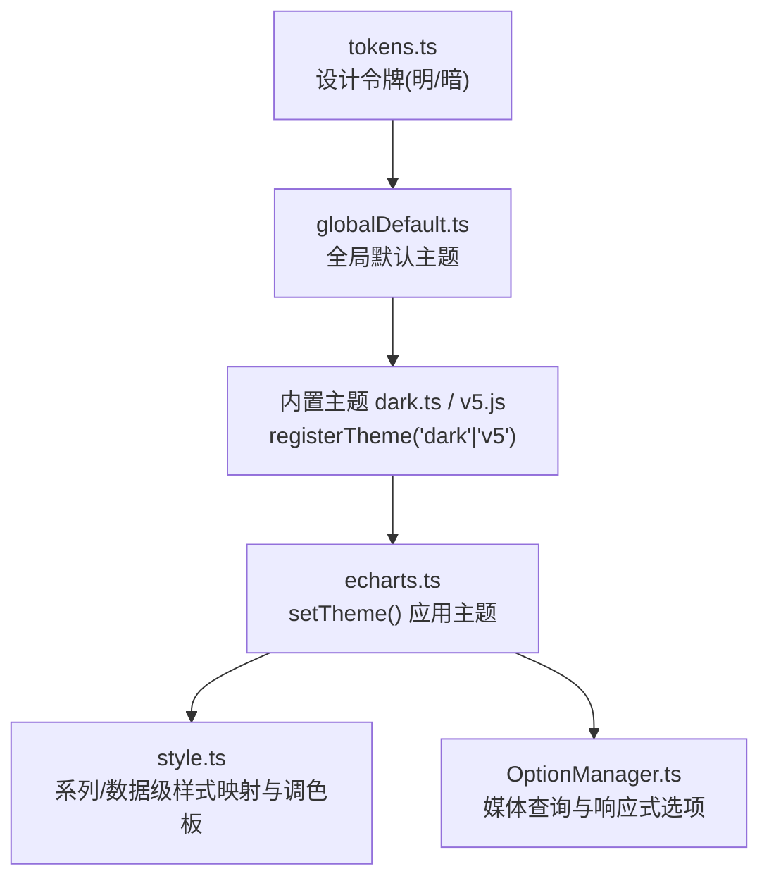
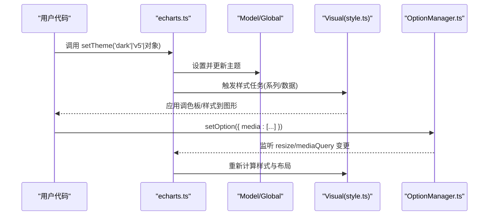
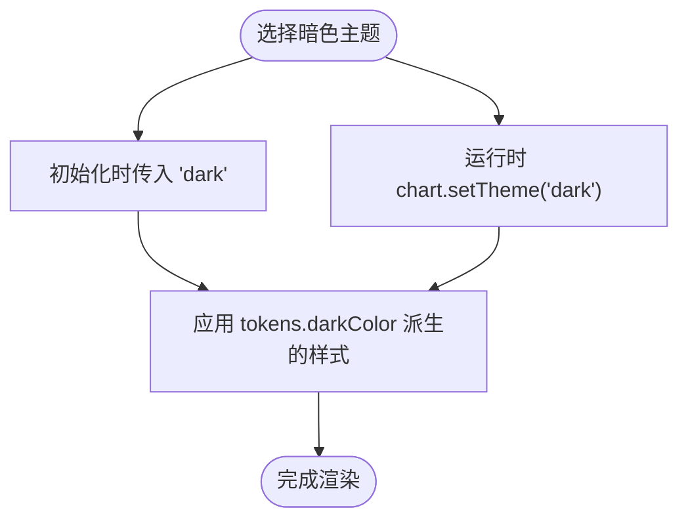
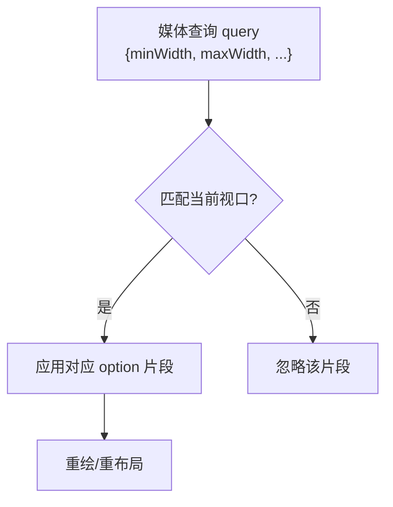
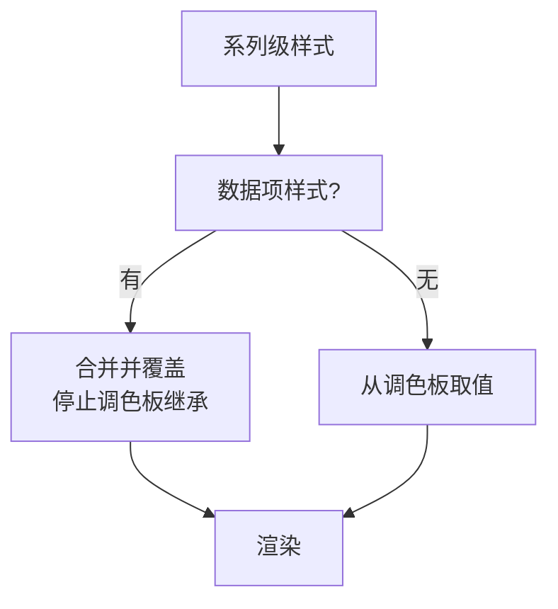
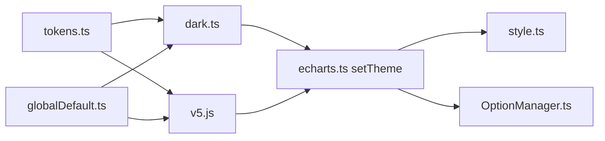

# 主题与样式

<cite>
**本文引用的文件**
- [src/theme/dark.ts](file://src/theme/dark.ts)
- [theme/dark.js](file://theme/dark.js)
- [theme/v5.js](file://theme/v5.js)
- [src/visual/tokens.ts](file://src/visual/tokens.ts)
- [src/model/globalDefault.ts](file://src/model/globalDefault.ts)
- [src/core/echarts.ts](file://src/core/echarts.ts)
- [src/visual/style.ts](file://src/visual/style.ts)
- [src/model/OptionManager.ts](file://src/model/OptionManager.ts)
- [test/theme.html](file://test/theme.html)
- [test/theme-list.html](file://test/theme-list.html)
</cite>

## 目录
1. [简介](#简介)
2. [项目结构](#项目结构)
3. [核心组件](#核心组件)
4. [架构总览](#架构总览)
5. [详细组件分析](#详细组件分析)
6. [依赖关系分析](#依赖关系分析)
7. [性能考虑](#性能考虑)
8. [故障排查指南](#故障排查指南)
9. [结论](#结论)
10. [附录](#附录)

## 简介
本文件系统性介绍 ECharts 的主题系统与样式定制能力，覆盖内置主题（暗色、明亮、专业风格等）的切换方式，自定义主题的创建流程（颜色调色板、字体配置、边框与阴影），响应式设计与媒体查询，样式优先级与继承机制，以及最佳实践与性能优化建议。文末提供实际项目中的品牌化案例与可操作指引。

## 项目结构
ECharts 主题系统由“设计令牌 + 默认主题 + 内置主题 + 运行时注册与应用”构成：
- 设计令牌：集中定义明/暗两套色彩体系与尺寸规范，供主题复用。
- 默认主题：提供全局默认值（如字体、动画、配色来源等）。
- 内置主题：dark、v5 等主题以独立模块形式存在，通过 registerTheme 注册。
- 运行时应用：通过 setTheme 或初始化参数选择主题，并在渲染管线中合并到最终样式。

图表来源
- [src/visual/tokens.ts:105-233](file://src/visual/tokens.ts#L105-L233)
- [src/model/globalDefault.ts:31-95](file://src/model/globalDefault.ts#L31-L95)
- [src/theme/dark.ts:68-329](file://src/theme/dark.ts#L68-L329)
- [theme/v5.js:84-580](file://theme/v5.js#L84-L580)
- [src/core/echarts.ts:824-871](file://src/core/echarts.ts#L824-L871)
- [src/visual/style.ts:67-131](file://src/visual/style.ts#L67-L131)
- [src/model/OptionManager.ts:380-406](file://src/model/OptionManager.ts#L380-L406)

章节来源
- [src/visual/tokens.ts:105-233](file://src/visual/tokens.ts#L105-L233)
- [src/model/globalDefault.ts:31-95](file://src/model/globalDefault.ts#L31-L95)
- [src/theme/dark.ts:68-329](file://src/theme/dark.ts#L68-L329)
- [theme/v5.js:84-580](file://theme/v5.js#L84-L580)
- [src/core/echarts.ts:824-871](file://src/core/echarts.ts#L824-L871)
- [src/visual/style.ts:67-131](file://src/visual/style.ts#L67-L131)
- [src/model/OptionManager.ts:380-406](file://src/model/OptionManager.ts#L380-L406)

## 核心组件
- 设计令牌 tokens：统一维护明/暗两套颜色与尺寸，主题基于此派生，确保一致性。
- 默认主题 globalDefault：提供全局默认（字体、动画、渐变、颜色来源等）。
- 内置主题：
  - 暗色主题：dark.ts（源码）与 theme/dark.js（构建产物）均实现暗色系样式。
  - 专业/明亮主题：v5.js 提供现代、专业的视觉风格。
- 主题应用：echarts.ts 暴露 setTheme，支持字符串名或对象直接应用。
- 样式映射：style.ts 负责 itemStyle/lineStyle 的解析、调色板分配与数据级覆盖。
- 响应式：OptionManager.ts 支持 media 查询（width/height/aspectRatio），按视口变化动态切换选项。

章节来源
- [src/visual/tokens.ts:105-233](file://src/visual/tokens.ts#L105-L233)
- [src/model/globalDefault.ts:31-95](file://src/model/globalDefault.ts#L31-L95)
- [src/theme/dark.ts:68-329](file://src/theme/dark.ts#L68-L329)
- [theme/dark.js:82-223](file://theme/dark.js#L82-L223)
- [theme/v5.js:84-580](file://theme/v5.js#L84-L580)
- [src/core/echarts.ts:824-871](file://src/core/echarts.ts#L824-L871)
- [src/visual/style.ts:67-131](file://src/visual/style.ts#L67-L131)
- [src/model/OptionManager.ts:380-406](file://src/model/OptionManager.ts#L380-L406)

## 架构总览
下图展示从主题注册到渲染的关键路径：主题对象经 setTheme 进入模型层，随后在可视化阶段被应用到系列与数据项，同时媒体查询根据视口调整布局与样式。

图表来源
- [src/core/echarts.ts:824-871](file://src/core/echarts.ts#L824-L871)
- [src/visual/style.ts:67-131](file://src/visual/style.ts#L67-L131)
- [src/model/OptionManager.ts:380-406](file://src/model/OptionManager.ts#L380-L406)

## 详细组件分析

### 内置主题：暗色主题（dark）
- 特点
  - 深色背景与高对比度文本，适合低光环境。
  - 坐标轴、网格、提示框、缩放条等组件均有统一的暗色样式。
  - 使用 tokens 的 darkColor 派生，保证明暗一致的设计语言。
- 使用方式
  - 初始化时指定名称：new echarts instance 时传入 'dark'。
  - 运行时切换：chart.setTheme('dark')。
  - 也可引入构建产物 theme/dark.js 后自动注册。

图表来源
- [src/theme/dark.ts:68-329](file://src/theme/dark.ts#L68-L329)
- [theme/dark.js:82-223](file://theme/dark.js#L82-L223)
- [src/core/echarts.ts:824-871](file://src/core/echarts.ts#L824-L871)

章节来源
- [src/theme/dark.ts:68-329](file://src/theme/dark.ts#L68-L329)
- [theme/dark.js:82-223](file://theme/dark.js#L82-L223)
- [src/core/echarts.ts:824-871](file://src/core/echarts.ts#L824-L871)

### 内置主题：专业/明亮主题（v5）
- 特点
  - 明亮背景、柔和分割线与中性色文字，强调信息层级。
  - 丰富的组件默认值（图例、工具栏、缩放条、日历等）。
  - 使用独立的 colorPalette 与 gradientColor 组合。
- 使用方式
  - 引入 theme/v5.js 后，可通过 setTheme('v5') 切换。
  - 也可在 setOption 中直接覆盖部分样式。

章节来源
- [theme/v5.js:84-580](file://theme/v5.js#L84-L580)

### 自定义主题：创建与扩展
- 颜色调色板
  - 通过主题对象的 color 字段定义主色调数组；未显式指定的系列/数据将按顺序取用。
  - 可在 series/itemStyle 中覆盖单点颜色。
- 字体配置
  - 全局字体来自默认主题 textStyle（family、size、weight 等）。
  - 可在主题中覆盖 title/textStyle/legend.textStyle 等。
- 边框与阴影
  - 通过 axisLine.lineStyle、splitLine.lineStyle、tooltip.borderWidth、shadow* 等属性定义。
  - 暗色主题中大量使用 tokens 的 border/shadow 派生值。
- 推荐流程
  - 基于 tokens 的明/暗两套基础色，派生出你的品牌色板。
  - 在主题对象中声明 color、gradientColor、textStyle、各组件样式。
  - 使用 echarts.registerTheme('your-theme', themeObj) 注册。
  - 通过 setTheme('your-theme') 或初始化参数应用。

章节来源
- [src/visual/tokens.ts:105-233](file://src/visual/tokens.ts#L105-L233)
- [src/model/globalDefault.ts:31-95](file://src/model/globalDefault.ts#L31-L95)
- [src/theme/dark.ts:68-329](file://src/theme/dark.ts#L68-L329)
- [theme/v5.js:84-580](file://theme/v5.js#L84-L580)

### 响应式设计：媒体查询与自适应
- 媒体查询
  - 支持 width、height、aspectRatio，可使用 min/max 前缀。
  - 在 option.media 中为不同视口定义不同 option，运行时自动匹配。
- 自适应布局
  - 结合 grid、legend、toolbox、dataZoom 等组件的相对定位与边距，实现多屏适配。
  - 配合 resize 事件与 media 查询，实现即时切换。
- 示例参考
  - test/theme-list.html 演示了根据 prefers-color-scheme 切换主题，以及多种组件在不同视口下的表现。

图表来源
- [src/model/OptionManager.ts:380-406](file://src/model/OptionManager.ts#L380-L406)
- [test/theme-list.html:112-121](file://test/theme-list.html#L112-L121)

章节来源
- [src/model/OptionManager.ts:380-406](file://src/model/OptionManager.ts#L380-L406)
- [test/theme-list.html:112-121](file://test/theme-list.html#L112-L121)

### 样式优先级与继承机制
- 层级关系
  - 全局默认主题 < 主题对象 < 组件级样式 < 系列级样式 < 数据项样式。
  - 数据项样式仅在开启允许覆盖时生效，且会打断调色板继承。
- 关键规则
  - itemStyle/lineStyle 通过 makeStyleMapper 解析，支持浅层合并与回调函数。
  - 若未显式设置颜色，将从调色板自动填充；若设置了回调或 auto，则按数据逐项计算。
  - 数据项若包含 itemStyle，会与系列级样式合并，并标记不再从调色板继承。
- 实践建议
  - 尽量在主题与系列层定义通用样式，数据层仅做必要覆盖。
  - 避免在数据层频繁设置样式，以减少重绘开销。

图表来源
- [src/visual/style.ts:67-131](file://src/visual/style.ts#L67-L131)
- [src/visual/style.ts:134-171](file://src/visual/style.ts#L134-L171)
- [src/visual/style.ts:175-225](file://src/visual/style.ts#L175-L225)

章节来源
- [src/visual/style.ts:67-131](file://src/visual/style.ts#L67-L131)
- [src/visual/style.ts:134-171](file://src/visual/style.ts#L134-L171)
- [src/visual/style.ts:175-225](file://src/visual/style.ts#L175-L225)

### 主题开发最佳实践
- 使用 tokens 作为设计基础，保持明/暗一致性与可维护性。
- 将品牌主色放入 color 与 gradientColor，减少硬编码。
- 对高频组件（axis、legend、tooltip、dataZoom）提供完整默认值，降低业务侧配置成本。
- 合理使用 media 查询，避免过多断点导致复杂度过高。
- 控制数据层样式粒度，优先在系列/主题层定义，提升性能。

章节来源
- [src/visual/tokens.ts:105-233](file://src/visual/tokens.ts#L105-L233)
- [src/model/globalDefault.ts:31-95](file://src/model/globalDefault.ts#L31-L95)
- [src/visual/style.ts:67-131](file://src/visual/style.ts#L67-L131)

### 实际项目案例与品牌化方案
- 快速切换内置主题
  - 使用 setTheme('dark'|'v5') 或初始化时传入主题名。
  - 参考测试用例：test/theme.html 演示了动态注册与切换。
- 品牌化主题
  - 基于 tokens 的明/暗色板，替换 color、gradientColor、textStyle、组件边框与阴影。
  - 通过 registerTheme 注册后，全局统一应用。
- 响应式品牌体验
  - 在 media 中针对不同屏幕调整 legend、toolbox、grid 的位置与大小。
  - 结合 prefers-color-scheme 自动切换明/暗主题。

章节来源
- [test/theme.html:146-220](file://test/theme.html#L146-L220)
- [test/theme-list.html:112-121](file://test/theme-list.html#L112-L121)
- [theme/v5.js:84-580](file://theme/v5.js#L84-L580)

## 依赖关系分析
- 主题与令牌
  - 暗色主题依赖 tokens.darkColor，明亮主题使用独立色板。
- 主题与默认值
  - 默认主题提供全局字体、动画、颜色来源等，主题可覆盖。
- 主题与渲染
  - setTheme 触发模型更新与可视化阶段，style.ts 将主题色应用到系列与数据。
- 响应式与主题
  - OptionManager 根据媒体查询合并选项，影响主题生效范围。

图表来源
- [src/visual/tokens.ts:105-233](file://src/visual/tokens.ts#L105-L233)
- [src/theme/dark.ts:68-329](file://src/theme/dark.ts#L68-L329)
- [theme/v5.js:84-580](file://theme/v5.js#L84-L580)
- [src/model/globalDefault.ts:31-95](file://src/model/globalDefault.ts#L31-L95)
- [src/core/echarts.ts:824-871](file://src/core/echarts.ts#L824-L871)
- [src/visual/style.ts:67-131](file://src/visual/style.ts#L67-L131)
- [src/model/OptionManager.ts:380-406](file://src/model/OptionManager.ts#L380-L406)

## 性能考虑
- 减少数据层样式：优先在系列/主题层定义样式，避免逐数据项设置带来的额外开销。
- 合理设置动画阈值：animationThreshold、progressiveThreshold、hoverLayerThreshold 可根据数据规模调优。
- 控制媒体查询数量：过多断点会增加计算与重绘次数。
- 主题切换频率：避免频繁 setTheme，必要时批量更新。
- 使用 tokens：集中管理颜色与尺寸，减少重复计算与不一致导致的重绘。

[本节为通用指导，不直接分析具体文件]

## 故障排查指南
- 主题未生效
  - 检查是否已正确注册主题（registerTheme）或在 setTheme 中传入正确的名称/对象。
  - 确认是否在 main 生命周期外调用 setTheme。
- 颜色未按预期
  - 检查是否在数据项设置了 itemStyle.color，这会中断调色板继承。
  - 确认系列级 itemStyle/lineStyle 是否正确覆盖。
- 响应式不工作
  - 检查 media.query 语法（width/height/aspectRatio，min/max 前缀）。
  - 确认容器尺寸变化触发了 resize，从而触发媒体查询评估。

章节来源
- [src/core/echarts.ts:824-871](file://src/core/echarts.ts#L824-L871)
- [src/visual/style.ts:67-131](file://src/visual/style.ts#L67-L131)
- [src/model/OptionManager.ts:380-406](file://src/model/OptionManager.ts#L380-L406)

## 结论
ECharts 的主题系统以 tokens 为基础，结合默认主题与内置主题，提供了灵活而一致的视觉框架。通过 registerTheme 与 setTheme，开发者可以便捷地切换或定制主题；借助 style.ts 的样式映射与媒体查询，可实现精细的样式控制与响应式体验。遵循最佳实践与性能建议，能够在复杂项目中稳定落地品牌化与多端适配。

## 附录
- 常用 API
  - 注册主题：echarts.registerTheme(name, themeObj)
  - 应用主题：chart.setTheme(name|themeObj)
  - 媒体查询：option.media = [{query:{...}, option:{...}}]
- 参考用例
  - 动态切换与注册：test/theme.html
  - 多主题与组件展示：test/theme-list.html

[本节为补充说明，不直接分析具体文件]