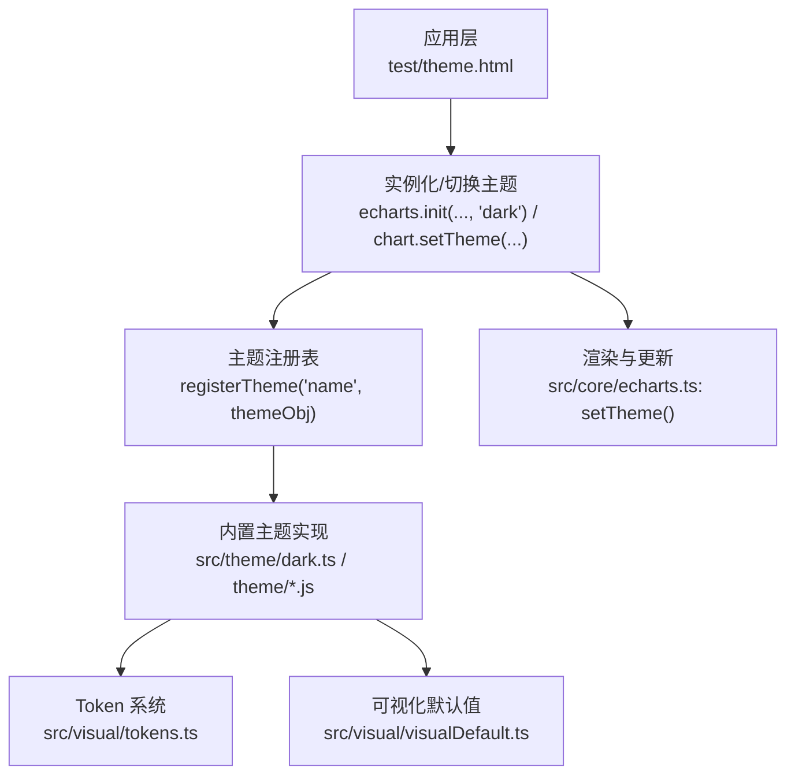
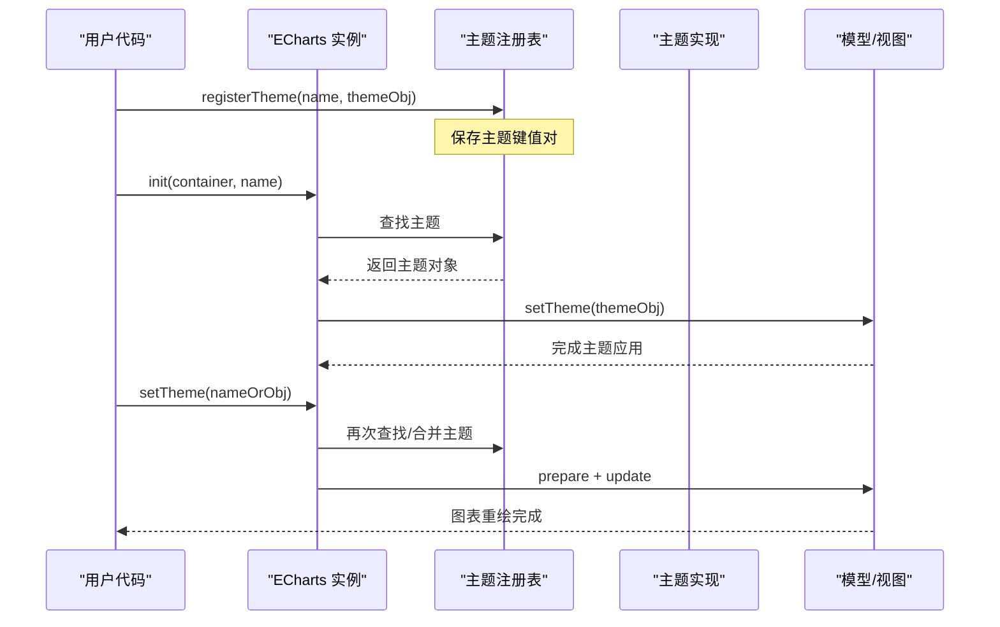
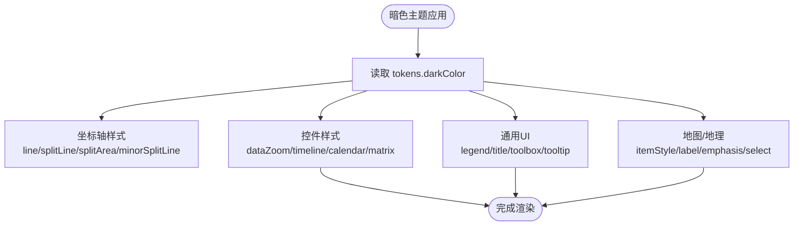
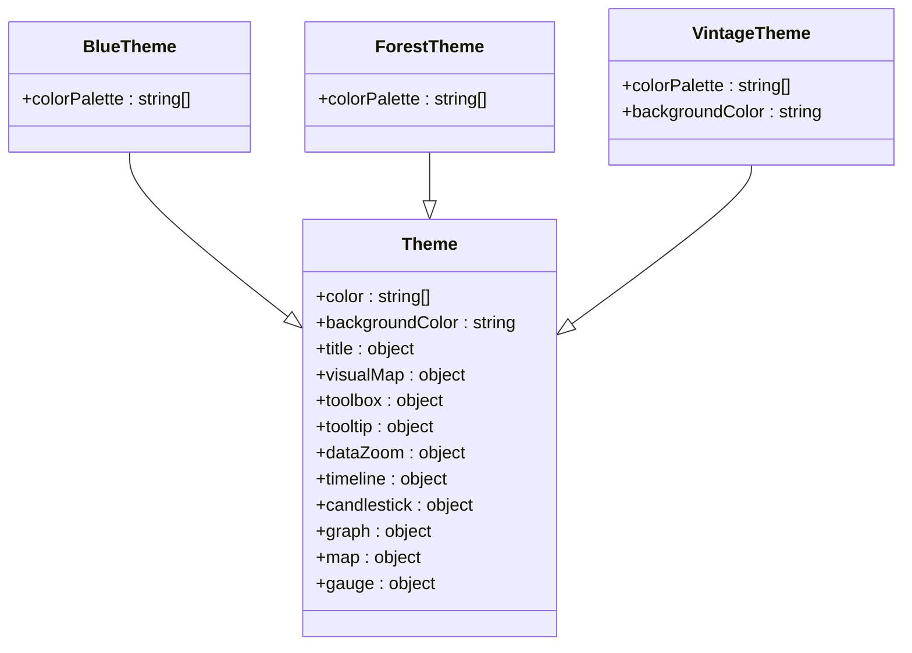
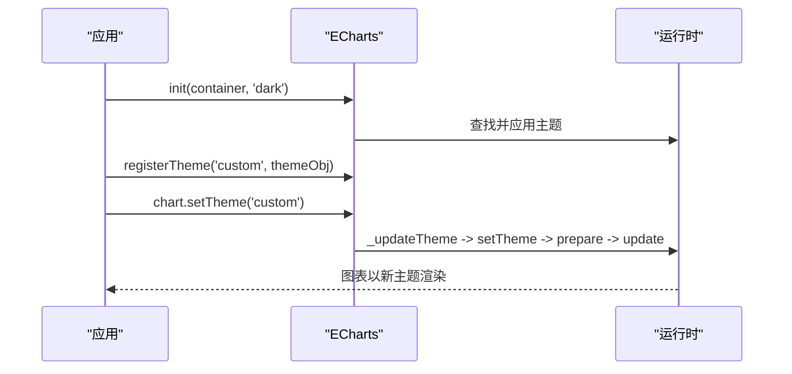
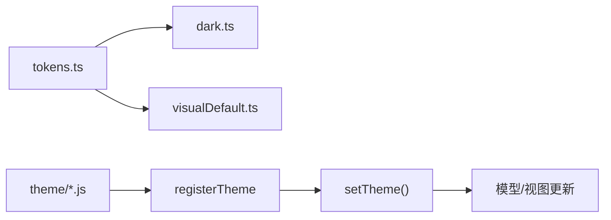

# 内置主题

<cite>
**本文引用的文件**
- [src/theme/dark.ts](file://src/theme/dark.ts)
- [theme/dark.js](file://theme/dark.js)
- [src/visual/tokens.ts](file://src/visual/tokens.ts)
- [src/visual/visualDefault.ts](file://src/visual/visualDefault.ts)
- [src/core/echarts.ts](file://src/core/echarts.ts)
- [test/theme.html](file://test/theme.html)
- [test/theme-list.html](file://test/theme-list.html)
- [theme/blue.js](file://theme/blue.js)
- [theme/forest.js](file://theme/forest.js)
- [theme/vintage.js](file://theme/vintage.js)
</cite>

## 目录
1. [简介](#简介)
2. [项目结构](#项目结构)
3. [核心组件](#核心组件)
4. [架构总览](#架构总览)
5. [详细组件分析](#详细组件分析)
6. [依赖关系分析](#依赖关系分析)
7. [性能考虑](#性能考虑)
8. [故障排查指南](#故障排查指南)
9. [结论](#结论)
10. [附录](#附录)

## 简介
ECharts 的内置主题系统通过统一的配色、字体、边框与阴影等视觉 Token，为图表提供一致的视觉风格。仓库提供了暗色主题（dark）以及多种风格的主题文件（如 blue、forest、vintage 等）。主题可通过两种方式应用：
- 在初始化或更新时通过 theme 配置项指定主题名称
- 使用 registerTheme() 注册自定义主题，并通过 setTheme() 动态切换

本文将深入解析内置主题的配色方案、字体设置、边框样式和阴影效果，并给出实际示例路径与最佳实践建议。

## 项目结构
与主题相关的代码主要分布在以下位置：
- src/theme/dark.ts：基于设计 Token 的暗色主题实现
- theme/*.js：预置主题包（如 dark、blue、forest、vintage 等），通过 echarts.registerTheme 注册
- src/visual/tokens.ts：统一的颜色与尺寸 Token，供主题复用
- src/visual/visualDefault.ts：可视化映射默认值（用于颜色、透明度、符号等）
- src/core/echarts.ts：setTheme 运行时逻辑
- test/theme.html、test/theme-list.html：主题演示与对比用例

**图示来源**
- [test/theme.html:38-43](file://test/theme.html#L38-L43)
- [src/core/echarts.ts:824-871](file://src/core/echarts.ts#L824-L871)
- [src/theme/dark.ts:68-329](file://src/theme/dark.ts#L68-L329)
- [src/visual/tokens.ts:105-233](file://src/visual/tokens.ts#L105-L233)
- [src/visual/visualDefault.ts:27-88](file://src/visual/visualDefault.ts#L27-L88)

**章节来源**
- [test/theme.html:38-43](file://test/theme.html#L38-L43)
- [src/core/echarts.ts:824-871](file://src/core/echarts.ts#L824-L871)
- [src/theme/dark.ts:68-329](file://src/theme/dark.ts#L68-L329)
- [src/visual/tokens.ts:105-233](file://src/visual/tokens.ts#L105-L233)
- [src/visual/visualDefault.ts:27-88](file://src/visual/visualDefault.ts#L27-L88)

## 核心组件
- 主题 Token 系统：集中管理颜色、中性色、强调色、背景、边框、阴影、坐标轴相关色板等，支持亮/暗两套派生规则
- 内置暗色主题：基于 Token 构建，覆盖坐标轴、图例、标题、工具栏、提示框、缩放、时间轴、日历、矩阵、地图等组件
- 预置主题包：以 JS 模块形式导出主题对象并调用 registerTheme 注册，便于按需引入
- 运行时主题切换：通过 setTheme 将主题应用到已创建的图表实例，触发重新准备与更新

**章节来源**
- [src/visual/tokens.ts:105-233](file://src/visual/tokens.ts#L105-L233)
- [src/theme/dark.ts:68-329](file://src/theme/dark.ts#L68-L329)
- [theme/blue.js:45-177](file://theme/blue.js#L45-L177)
- [theme/forest.js:45-162](file://theme/forest.js#L45-L162)
- [theme/vintage.js:44-62](file://theme/vintage.js#L44-L62)
- [src/core/echarts.ts:824-871](file://src/core/echarts.ts#L824-L871)

## 架构总览
主题系统的运行流程如下：
- 初始化阶段：通过 echarts.init(container, themeName) 选择内置主题名，或传入主题对象
- 主题注册：通过 echarts.registerTheme(name, themeObj) 将主题加入全局注册表
- 运行时切换：通过 chart.setTheme(themeNameOrObj) 动态切换主题，内部会执行 _updateTheme、模型 setTheme、prepare 与 update

**图示来源**
- [src/core/echarts.ts:824-871](file://src/core/echarts.ts#L824-L871)
- [theme/dark.js:222-224](file://theme/dark.js#L222-L224)
- [theme/blue.js:177-178](file://theme/blue.js#L177-L178)
- [theme/forest.js:162-163](file://theme/forest.js#L162-L163)
- [theme/vintage.js:56-62](file://theme/vintage.js#L56-L62)

## 详细组件分析

### 暗色主题（dark）
- 特点
  - 深色背景与高对比度文本，适合夜间模式或数据大屏
  - 坐标轴、网格线、刻度、标签均使用低饱和度的中性色，避免视觉干扰
  - 提示框、工具栏、缩放控件采用半透明与强调色点缀，提升交互可辨识度
  - 地图、地理、树图等组件的选中/强调状态使用高亮色块
- 适用场景
  - 监控大屏、数据分析后台、夜间使用环境
- 关键实现要点
  - 使用 tokens.darkColor 派生的颜色体系，保证一致性与可维护性
  - 针对各组件（axis、legend、title、toolbox、tooltip、dataZoom、timeline、calendar、matrix、map、geo）分别定义样式
  - 关闭分类轴的分割线显示，减少视觉噪音

**图示来源**
- [src/theme/dark.ts:25-55](file://src/theme/dark.ts#L25-L55)
- [src/theme/dark.ts:68-196](file://src/theme/dark.ts#L68-L196)
- [src/theme/dark.ts:197-329](file://src/theme/dark.ts#L197-L329)
- [src/visual/tokens.ts:105-233](file://src/visual/tokens.ts#L105-L233)

**章节来源**
- [src/theme/dark.ts:25-55](file://src/theme/dark.ts#L25-L55)
- [src/theme/dark.ts:68-196](file://src/theme/dark.ts#L68-L196)
- [src/theme/dark.ts:197-329](file://src/theme/dark.ts#L197-L329)
- [src/visual/tokens.ts:105-233](file://src/visual/tokens.ts#L105-L233)

### 明亮主题（default）
- 说明
  - 未显式加载任何主题时，ECharts 使用默认主题（白色背景、中性色文本、标准色板）
  - 默认主题由 Token 的亮色派生与 visualDefault 共同决定
- 适用场景
  - 常规文档、浅色背景的报表页面、对外展示型看板
- 关键实现要点
  - 使用 tokens.color 作为基础色板
  - visualDefault 提供激活/非激活状态的默认映射（颜色、透明度、符号大小等）

**章节来源**
- [src/visual/tokens.ts:105-197](file://src/visual/tokens.ts#L105-L197)
- [src/visual/visualDefault.ts:27-88](file://src/visual/visualDefault.ts#L27-L88)

### 专业主题（以 blue、forest、vintage 为例）
- blue
  - 蓝色系主色调，强调科技感与冷静感；适用于金融、科技类数据可视化
  - 定义了 color、title、visualMap、toolbox、tooltip、dataZoom、timeline、candlestick、chord、graph、map、gauge 等组件样式
- forest
  - 自然绿色调，适合生态、农业、健康等领域的数据呈现
  - 同样覆盖多组件样式，保持整体一致性
- vintage
  - 复古暖色调，背景偏米白，适合历史数据、人文类主题
  - 仅覆盖 color、backgroundColor、graph 等关键属性，轻量简洁

**图示来源**
- [theme/blue.js:45-177](file://theme/blue.js#L45-L177)
- [theme/forest.js:45-162](file://theme/forest.js#L45-L162)
- [theme/vintage.js:44-62](file://theme/vintage.js#L44-L62)

**章节来源**
- [theme/blue.js:45-177](file://theme/blue.js#L45-L177)
- [theme/forest.js:45-162](file://theme/forest.js#L45-L162)
- [theme/vintage.js:44-62](file://theme/vintage.js#L44-L62)

### 主题切换与使用方式
- 通过 theme 配置项指定主题名称
  - 在 echarts.init 时传入主题名，例如 'dark'
- 通过 registerTheme 注册自定义主题
  - 在任意时机调用 echarts.registerTheme('name', themeObj)
- 通过 setTheme 动态切换
  - 在图表实例上调用 chart.setTheme('name' | themeObj)，内部会执行主题更新与重绘

**图示来源**
- [test/theme.html:38-43](file://test/theme.html#L38-L43)
- [test/theme.html:150-158](file://test/theme.html#L150-L158)
- [test/theme.html:187-205](file://test/theme.html#L187-L205)
- [src/core/echarts.ts:824-871](file://src/core/echarts.ts#L824-L871)

**章节来源**
- [test/theme.html:38-43](file://test/theme.html#L38-L43)
- [test/theme.html:150-158](file://test/theme.html#L150-L158)
- [test/theme.html:187-205](file://test/theme.html#L187-L205)
- [src/core/echarts.ts:824-871](file://src/core/echarts.ts#L824-L871)

### 配色方案、字体、边框与阴影
- 配色方案
  - 暗色主题使用 tokens.darkColor，包含主题色、中性色、强调色、背景、边框、阴影等完整语义化命名
  - 明亮主题使用 tokens.color 与 visualDefault 的组合
- 字体设置
  - 标题、图例、提示框等文本颜色由主题对象中的 textStyle 控制
  - 暗色主题中 title、legend、tooltip 的文本颜色均基于 Token 的 secondary/tertiary 等层级
- 边框样式
  - 坐标轴、网格线、分割线、刻度线等通过 axisLine、splitLine、minorSplitLine 等配置
  - 地图、地理组件的 itemStyle.borderColor 控制边界线
- 阴影效果
  - 阴影颜色由 shadow/shadowTint 控制，暗色主题下降低饱和度与亮度，确保对比度
  - 提示框、工具栏等交互元素可使用阴影增强层次

**章节来源**
- [src/theme/dark.ts:25-55](file://src/theme/dark.ts#L25-L55)
- [src/theme/dark.ts:68-196](file://src/theme/dark.ts#L68-L196)
- [src/theme/dark.ts:197-329](file://src/theme/dark.ts#L197-L329)
- [src/visual/tokens.ts:105-233](file://src/visual/tokens.ts#L105-L233)
- [src/visual/visualDefault.ts:27-88](file://src/visual/visualDefault.ts#L27-L88)

### 实际示例与效果对比
- 暗色主题示例
  - 初始化时使用 'dark' 主题，展示柱状图堆叠效果
  - 参考路径：[test/theme.html:38-43](file://test/theme.html#L38-L43)
- 动态切换主题
  - 通过按钮调用 chart.setTheme('dark') 或注册新主题后切换
  - 参考路径：[test/theme.html:187-205](file://test/theme.html#L187-L205)
- 多主题列表对比
  - 根据系统深色模式自动切换 dark/default，展示不同系列图表在不同主题下的表现
  - 参考路径：[test/theme-list.html:112-121](file://test/theme-list.html#L112-L121)

**章节来源**
- [test/theme.html:38-43](file://test/theme.html#L38-L43)
- [test/theme.html:187-205](file://test/theme.html#L187-L205)
- [test/theme-list.html:112-121](file://test/theme-list.html#L112-L121)

## 依赖关系分析
- 主题实现依赖 Token 系统
  - 暗色主题从 tokens.darkColor 派生颜色，保证一致性与可维护性
- 主题注册与运行时切换
  - 预置主题通过 registerTheme 注册到全局
  - setTheme 在运行时查找并应用主题，触发 prepare 与 update
- 可视化默认值
  - visualDefault 提供激活/非激活状态的默认映射，影响颜色、透明度、符号等

**图示来源**
- [src/visual/tokens.ts:105-233](file://src/visual/tokens.ts#L105-L233)
- [src/theme/dark.ts:68-329](file://src/theme/dark.ts#L68-L329)
- [src/visual/visualDefault.ts:27-88](file://src/visual/visualDefault.ts#L27-L88)
- [theme/dark.js:222-224](file://theme/dark.js#L222-L224)
- [src/core/echarts.ts:824-871](file://src/core/echarts.ts#L824-L871)

**章节来源**
- [src/visual/tokens.ts:105-233](file://src/visual/tokens.ts#L105-L233)
- [src/theme/dark.ts:68-329](file://src/theme/dark.ts#L68-L329)
- [src/visual/visualDefault.ts:27-88](file://src/visual/visualDefault.ts#L27-L88)
- [theme/dark.js:222-224](file://theme/dark.js#L222-L224)
- [src/core/echarts.ts:824-871](file://src/core/echarts.ts#L824-L871)

## 性能考虑
- 主题切换开销
  - setTheme 会触发 prepare 与 update，频繁切换可能带来重绘成本
  - 建议在批量更新选项后再切换主题，或使用 silent 参数减少不必要的刷新
- 主题体积
  - 按需引入主题文件，避免一次性加载过多主题包
- 颜色计算
  - Token 系统在构建暗色主题时对颜色进行 HSL 变换，属于一次性计算，不影响运行时性能
- 大数据量图表
  - 主题本身不改变数据规模，但应避免在主题中启用昂贵的视觉效果（如大量阴影、渐变）

[本节为通用指导，无需具体文件引用]

## 故障排查指南
- 主题未生效
  - 检查是否已正确调用 registerTheme，并确保主题名与 setTheme/init 中使用的一致
  - 确认 echarts 实例未被销毁（disposed），否则 setTheme 会提前返回
- 切换无响应
  - 检查是否在 main process 中调用 setTheme（不应在主流程中调用）
  - 确认是否存在 pending update 导致的冲突
- 视觉异常
  - 检查主题对象是否覆盖了必要字段（如 backgroundColor、color、textStyle）
  - 对于地图/地理组件，确认 itemStyle、label、emphasis、select 等字段是否正确设置

**章节来源**
- [src/core/echarts.ts:824-871](file://src/core/echarts.ts#L824-L871)
- [theme/dark.js:40-43](file://theme/dark.js#L40-L43)
- [theme/blue.js:40-43](file://theme/blue.js#L40-L43)
- [theme/forest.js:40-43](file://theme/forest.js#L40-L43)

## 结论
ECharts 的主题系统以 Token 为核心，提供一致的视觉语言与灵活的扩展能力。暗色主题适合夜间与大屏场景，明亮主题适合常规文档与报表，专业主题（如 blue、forest、vintage）则满足特定行业与风格需求。通过 registerTheme 与 setTheme，开发者可以便捷地注册与切换主题，结合示例与最佳实践，快速打造符合业务需求的可视化界面。

[本节为总结性内容，无需具体文件引用]

## 附录
- 常用主题文件路径
  - 暗色主题：[src/theme/dark.ts](file://src/theme/dark.ts)、[theme/dark.js](file://theme/dark.js)
  - 蓝色主题：[theme/blue.js](file://theme/blue.js)
  - 森林主题：[theme/forest.js](file://theme/forest.js)
  - 复古主题：[theme/vintage.js](file://theme/vintage.js)
- 示例与演示
  - 主题基本用法与动态切换：[test/theme.html](file://test/theme.html)
  - 多主题列表对比与系统深色模式适配：[test/theme-list.html](file://test/theme-list.html)

[本节为索引性内容，无需具体文件引用]