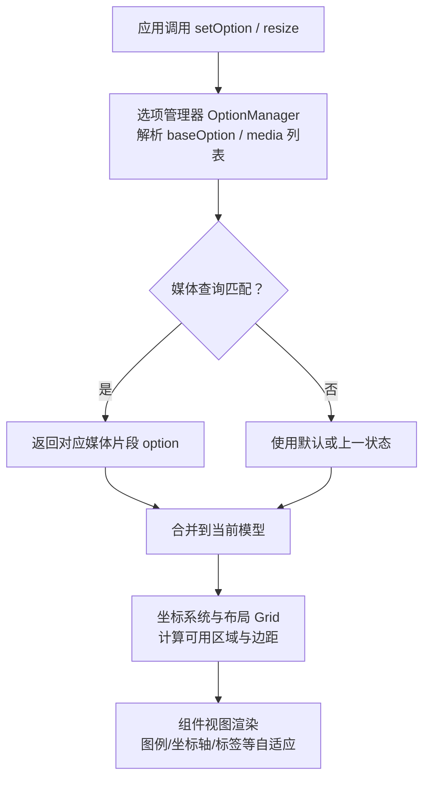
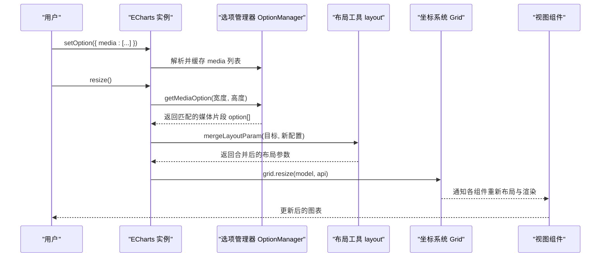
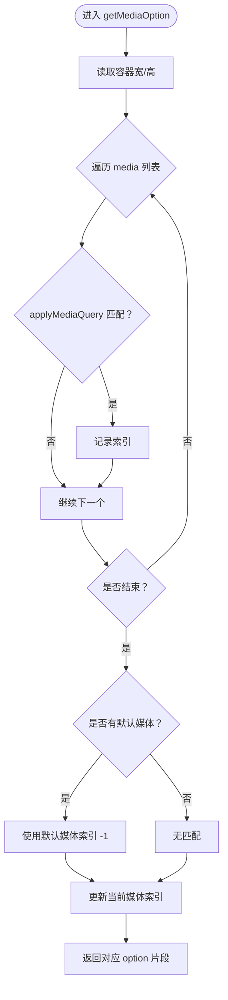
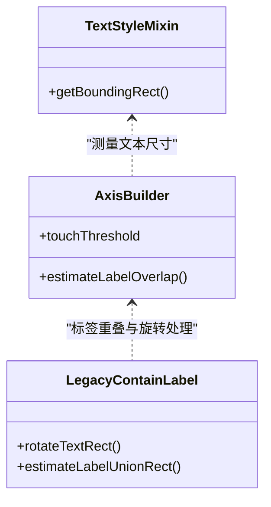
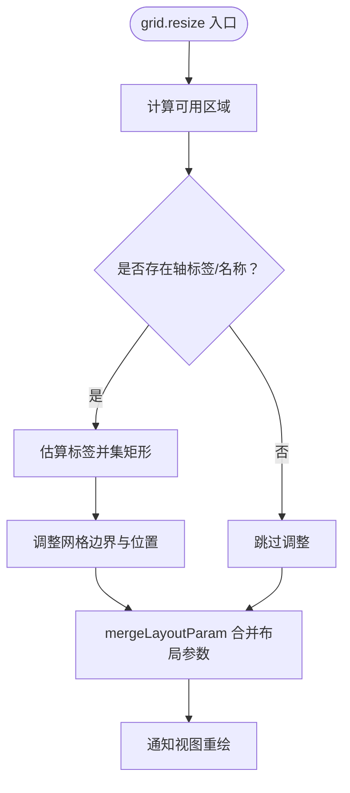
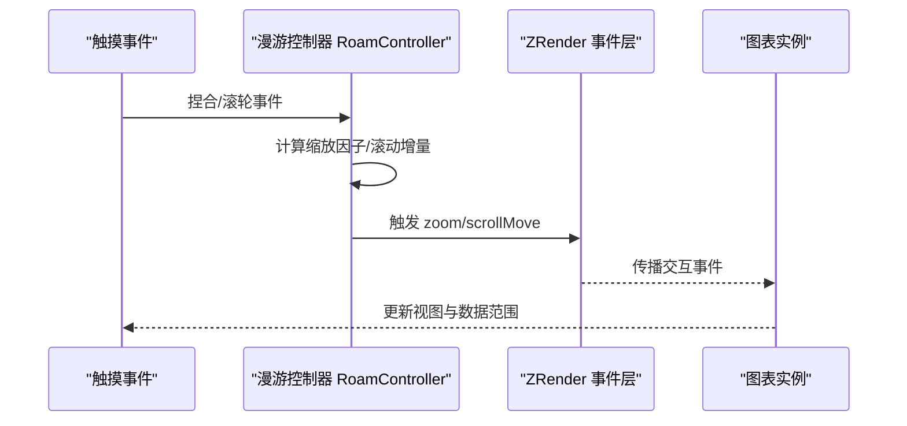
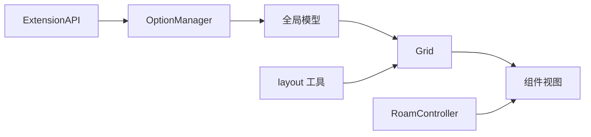

# 响应式设计

<cite>
**本文引用的文件**
- [OptionManager.ts](file://src/model/OptionManager.ts)
- [layout.ts](file://src/util/layout.ts)
- [Grid.ts](file://src/coord/cartesian/Grid.ts)
- [legacyContainLabel.ts](file://src/coord/cartesian/legacyContainLabel.ts)
- [AxisBuilder.ts](file://src/component/axis/AxisBuilder.ts)
- [RoamController.ts](file://src/component/helper/RoamController.ts)
- [media-pie.html](file://test/media-pie.html)
- [coarse-pointer.html](file://test/coarse-pointer.html)
- [touch-slide.html](file://test/touch-slide.html)
</cite>

## 目录
1. [简介](#简介)
2. [项目结构](#项目结构)
3. [核心组件](#核心组件)
4. [架构总览](#架构总览)
5. [详细组件分析](#详细组件分析)
6. [依赖关系分析](#依赖关系分析)
7. [性能考量](#性能考量)
8. [故障排查指南](#故障排查指南)
9. [结论](#结论)
10. [附录：移动端最佳实践与案例](#附录移动端最佳实践与案例)

## 简介
本章节系统阐述 ECharts 的响应式设计能力，包括：
- 媒体查询（media）在不同断点下的样式与布局切换
- 字体与文本的动态缩放策略
- 网格、坐标轴标签、图例等元素的自适应布局
- 移动端触摸交互与性能优化建议
- 基于仓库示例的实际开发案例

## 项目结构
ECharts 的响应式能力由“选项管理 + 布局计算 + 渲染视图”三层协作完成：
- 选项管理：解析 media 配置并依据容器尺寸匹配规则
- 布局计算：根据容器宽高、标签占用空间等动态调整网格与元素位置
- 渲染视图：在 resize 时重新计算布局并触发重绘

图表来源
- [OptionManager.ts:190-229](file://src/model/OptionManager.ts#L190-L229)
- [Grid.ts:207-215](file://src/coord/cartesian/Grid.ts#L207-L215)

章节来源
- [OptionManager.ts:190-229](file://src/model/OptionManager.ts#L190-L229)
- [layout.ts:679-757](file://src/util/layout.ts#L679-L757)
- [Grid.ts:207-215](file://src/coord/cartesian/Grid.ts#L207-L215)

## 核心组件
- 媒体查询与选项管理：负责解析 media 配置、按容器尺寸匹配规则、返回对应 option 片段并合并到当前模型
- 布局工具：提供布局参数合并与提取，确保 left/right/top/bottom/width/height 的正确覆盖与兼容
- 坐标系统与网格：在 resize 阶段重新计算网格区域，考虑坐标轴名称与标签占用空间
- 轴标签与重叠处理：估算标签占用矩形，必要时调整网格边界以避免遮挡
- 交互控制器：统一处理滚轮、捏合缩放、拖拽等交互，适配不同设备指针精度

章节来源
- [OptionManager.ts:190-229](file://src/model/OptionManager.ts#L190-L229)
- [layout.ts:679-757](file://src/util/layout.ts#L679-L757)
- [Grid.ts:207-215](file://src/coord/cartesian/Grid.ts#L207-L215)
- [legacyContainLabel.ts:34-58](file://src/coord/cartesian/legacyContainLabel.ts#L34-L58)
- [AxisBuilder.ts:409-415](file://src/component/axis/AxisBuilder.ts#L409-L415)

## 架构总览
下图展示了从用户操作到最终渲染的关键流程，突出媒体查询与布局自适应的协作。

图表来源
- [OptionManager.ts:190-229](file://src/model/OptionManager.ts#L190-L229)
- [layout.ts:679-757](file://src/util/layout.ts#L679-L757)
- [Grid.ts:207-215](file://src/coord/cartesian/Grid.ts#L207-L215)

## 详细组件分析

### 媒体查询（media）机制
- 支持属性：width、height、aspectRatio（可通过 min/max 前缀表达范围）
- 匹配逻辑：遍历 media 列表，按当前容器宽高与纵横比判断是否适用；若未命中且存在默认媒体片段则回退
- 优先级：后定义的媒体片段优先级更高；当 indices 变化时才克隆并返回对应 option
- 典型用法：在不同断点下切换图例方向、系列中心与半径、标题位置等

图表来源
- [OptionManager.ts:190-229](file://src/model/OptionManager.ts#L190-L229)
- [OptionManager.ts:385-422](file://src/model/OptionManager.ts#L385-L422)

章节来源
- [OptionManager.ts:190-229](file://src/model/OptionManager.ts#L190-L229)
- [OptionManager.ts:385-422](file://src/model/OptionManager.ts#L385-L422)
- [media-pie.html:146-232](file://test/media-pie.html#L146-L232)

### 字体与文本自适应
- 文本测量：通过临时文本对象获取包围盒，用于标签布局与碰撞检测
- 轴标签阈值：引入 touchThreshold 控制相邻标签重叠判定，避免在小屏上过度隐藏
- 旋转标签包围盒：对旋转后的标签进行矩形变换，保证布局准确

图表来源
- [textStyle.ts:68-79](file://src/model/mixin/textStyle.ts#L68-L79)
- [AxisBuilder.ts:409-415](file://src/component/axis/AxisBuilder.ts#L409-L415)
- [legacyContainLabel.ts:104-120](file://src/coord/cartesian/legacyContainLabel.ts#L104-L120)

章节来源
- [textStyle.ts:68-79](file://src/model/mixin/textStyle.ts#L68-L79)
- [AxisBuilder.ts:409-415](file://src/component/axis/AxisBuilder.ts#L409-L415)
- [legacyContainLabel.ts:104-120](file://src/coord/cartesian/legacyContainLabel.ts#L104-L120)

### 布局自适应策略（网格、坐标轴、图例）
- 网格区域计算：在 resize 阶段重新计算可用区域，考虑坐标轴名称与标签占用空间
- 标签占用估算：估算轴标签的并集矩形，必要时收缩网格边界并移动位置
- 布局参数合并：正确处理 left/right/top/bottom/width/height 的冲突与覆盖，确保媒体查询中的布局设置生效

图表来源
- [Grid.ts:207-215](file://src/coord/cartesian/Grid.ts#L207-L215)
- [legacyContainLabel.ts:34-58](file://src/coord/cartesian/legacyContainLabel.ts#L34-L58)
- [layout.ts:679-757](file://src/util/layout.ts#L679-L757)

章节来源
- [Grid.ts:207-215](file://src/coord/cartesian/Grid.ts#L207-L215)
- [legacyContainLabel.ts:34-58](file://src/coord/cartesian/legacyContainLabel.ts#L34-L58)
- [layout.ts:679-757](file://src/util/layout.ts#L679-L757)

### 移动端交互与性能优化
- 滚轮与捏合缩放：根据输入幅度动态调整缩放因子，提升小屏交互体验
- 指针精度：在非移动设备上可开启粗指针模式以扩大命中区域；也可自定义 pointerSize
- 滑动与页面滚动：在图表区域内平滑拖动 tooltip，区域外允许页面滚动，避免阻塞原生滚动

图表来源
- [RoamController.ts:397-427](file://src/component/helper/RoamController.ts#L397-L427)
- [coarse-pointer.html:113-158](file://test/coarse-pointer.html#L113-L158)
- [touch-slide.html:63-80](file://test/touch-slide.html#L63-L80)

章节来源
- [RoamController.ts:397-427](file://src/component/helper/RoamController.ts#L397-L427)
- [coarse-pointer.html:113-158](file://test/coarse-pointer.html#L113-L158)
- [touch-slide.html:63-80](file://test/touch-slide.html#L63-L80)

## 依赖关系分析
- OptionManager 依赖 ExtensionAPI 获取容器尺寸，驱动媒体查询匹配
- Grid 在 resize 时协调各组件布局，依赖 axis 与 label 的占用估算
- layout 工具为组件提供统一的布局参数合并策略，避免媒体查询中布局覆盖失效
- RoamController 统一封装交互行为，屏蔽设备差异

图表来源
- [OptionManager.ts:190-229](file://src/model/OptionManager.ts#L190-L229)
- [Grid.ts:207-215](file://src/coord/cartesian/Grid.ts#L207-L215)
- [layout.ts:679-757](file://src/util/layout.ts#L679-L757)
- [RoamController.ts:397-427](file://src/component/helper/RoamController.ts#L397-L427)

章节来源
- [OptionManager.ts:190-229](file://src/model/OptionManager.ts#L190-L229)
- [Grid.ts:207-215](file://src/coord/cartesian/Grid.ts#L207-L215)
- [layout.ts:679-757](file://src/util/layout.ts#L679-L757)
- [RoamController.ts:397-427](file://src/component/helper/RoamController.ts#L397-L427)

## 性能考量
- 媒体查询仅在容器尺寸变化时评估，避免频繁重算
- 布局参数合并采用最小化变更策略，减少不必要的重绘
- 轴标签重叠检测使用阈值与估算矩形，降低计算复杂度
- 交互缩放因子根据输入幅度自适应，提升移动端流畅度

[本节为通用性能讨论，不直接分析具体文件]

## 故障排查指南
- 媒体查询未生效
  - 检查 query 字段是否正确书写 width/height/aspectRatio 及 min/max 前缀
  - 确认容器尺寸已正确传入（如通过 resize 或窗口监听）
  - 参考媒体片段优先级与默认回退逻辑
- 布局参数覆盖无效
  - 使用 mergeLayoutParam 合并布局参数，避免普通合并导致 right/left 冲突
  - 确保媒体查询中的布局设置不被后续 setOption 覆盖
- 标签被遮挡或溢出
  - 启用坐标轴标签估算与网格边界调整
  - 调整 touchThreshold 或标签旋转角度
- 移动端交互异常
  - 检查指针精度设置与粗指针模式
  - 确认滚动与图表拖拽的事件冲突处理

章节来源
- [OptionManager.ts:385-422](file://src/model/OptionManager.ts#L385-L422)
- [layout.ts:679-757](file://src/util/layout.ts#L679-L757)
- [legacyContainLabel.ts:34-58](file://src/coord/cartesian/legacyContainLabel.ts#L34-L58)
- [RoamController.ts:397-427](file://src/component/helper/RoamController.ts#L397-L427)

## 结论
ECharts 的响应式设计通过媒体查询、布局自适应与交互优化形成完整闭环：
- 媒体查询实现断点级样式与布局切换
- 布局工具与坐标系统在 resize 时动态调整元素位置与大小
- 文本测量与标签重叠处理保障可读性
- 统一的交互控制器提升多端体验一致性

[本节为总结性内容，不直接分析具体文件]

## 附录：移动端最佳实践与案例
- 媒体查询案例
  - 在不同纵横比与宽度下切换图例方向与系列布局
  - 参考示例：[media-pie.html:146-232](file://test/media-pie.html#L146-L232)
- 指针精度与命中区域
  - 非移动设备可开启粗指针模式或自定义 pointerSize
  - 参考示例：[coarse-pointer.html:113-158](file://test/coarse-pointer.html#L113-L158)
- 滑动与页面滚动协同
  - 图表内平滑拖动 tooltip，图表外允许页面滚动
  - 参考示例：[touch-slide.html:63-80](file://test/touch-slide.html#L63-L80)

章节来源
- [media-pie.html:146-232](file://test/media-pie.html#L146-L232)
- [coarse-pointer.html:113-158](file://test/coarse-pointer.html#L113-L158)
- [touch-slide.html:63-80](file://test/touch-slide.html#L63-L80)