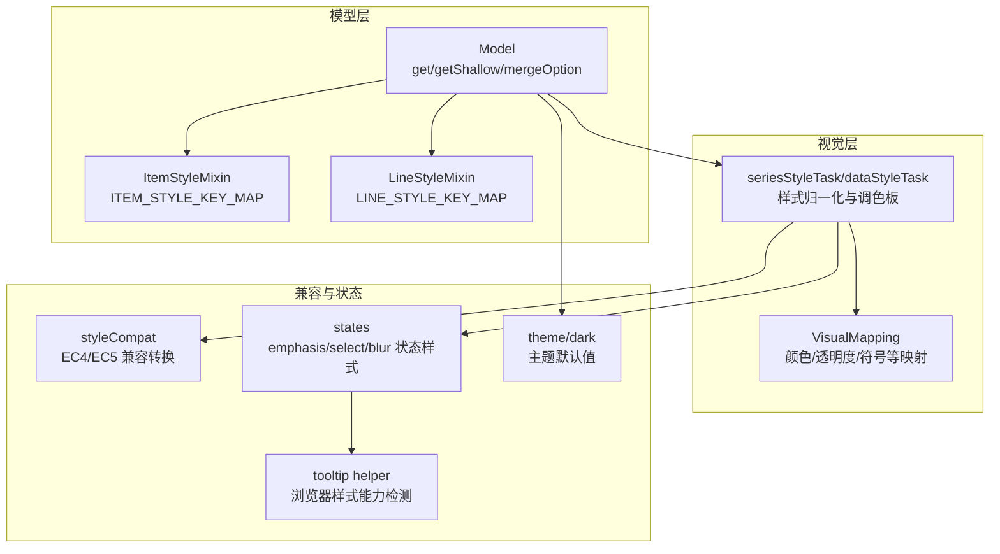
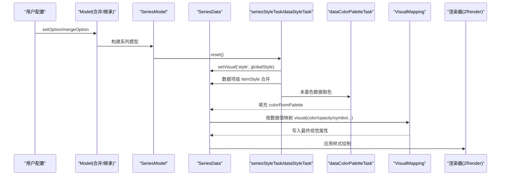
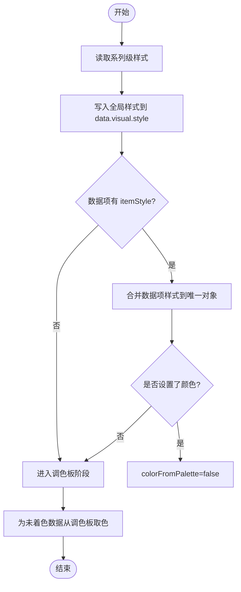
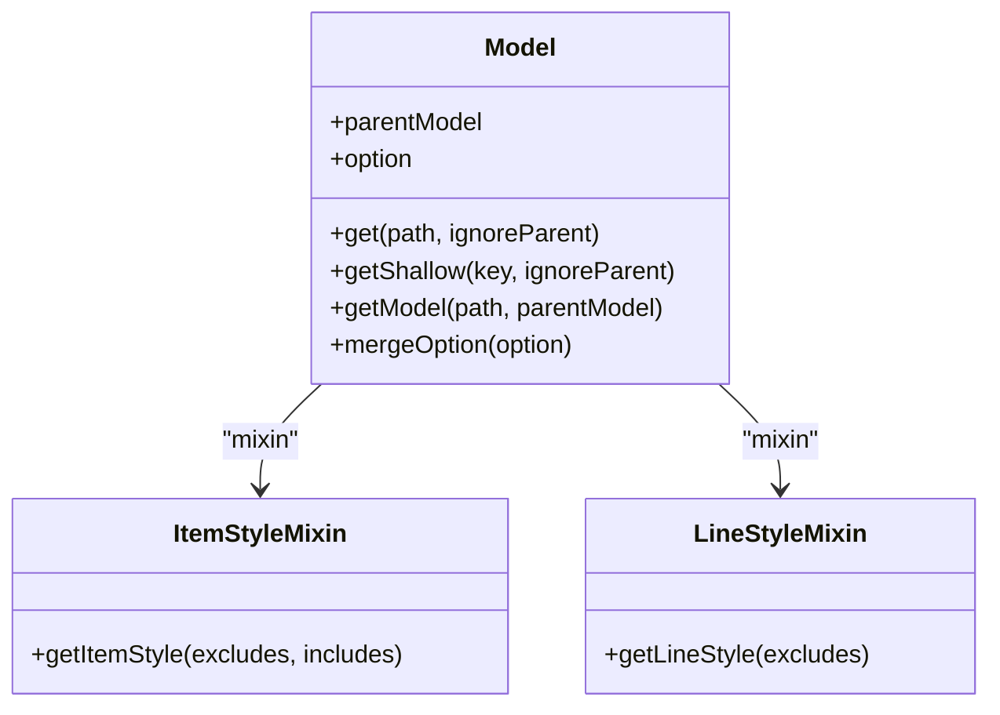
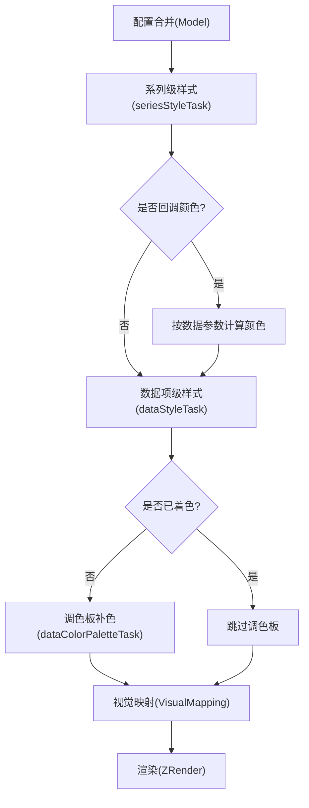
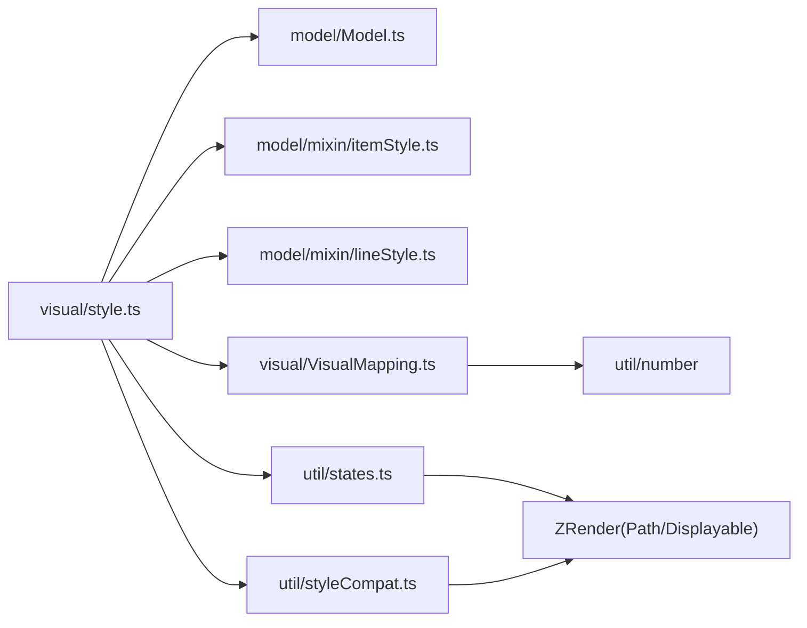

# 样式优先级与继承

<cite>
**本文引用的文件**
- [src/visual/style.ts](file://src/visual/style.ts)
- [src/visual/VisualMapping.ts](file://src/visual/VisualMapping.ts)
- [src/model/Model.ts](file://src/model/Model.ts)
- [src/model/mixin/itemStyle.ts](file://src/model/mixin/itemStyle.ts)
- [src/model/mixin/lineStyle.ts](file://src/model/mixin/lineStyle.ts)
- [src/util/styleCompat.ts](file://src/util/styleCompat.ts)
- [src/util/states.ts](file://src/util/states.ts)
- [src/component/tooltip/helper.ts](file://src/component/tooltip/helper.ts)
- [src/theme/dark.ts](file://src/theme/dark.ts)
</cite>

## 目录
1. [简介](#简介)
2. [项目结构](#项目结构)
3. [核心组件](#核心组件)
4. [架构总览](#架构总览)
5. [详细组件分析](#详细组件分析)
6. [依赖关系分析](#依赖关系分析)
7. [性能考量](#性能考量)
8. [故障排查指南](#故障排查指南)
9. [结论](#结论)
10. [附录](#附录)

## 简介
本文件系统性解析 ECharts 的样式优先级与继承机制，覆盖以下主题：
- 样式覆盖规则：全局样式、组件样式、系列样式的优先级顺序
- 样式继承链：父级样式如何传递给子级元素
- 特殊样式处理：important 标记、内联样式、CSS 变量的处理方式
- 样式计算流程：从配置解析到最终渲染的样式处理过程
- 样式调试工具与方法：如何定位样式冲突和解决覆盖问题
- 复杂定制案例与最佳实践

## 项目结构
ECharts 的样式系统由“模型层（Model）—视觉映射层（Visual）—兼容与状态层（Util/States）”构成。关键路径如下：
- 模型层负责合并与读取配置（含 itemStyle/lineStyle/textStyle），并支持父子 Model 的 get/getShallow 继承
- 视觉层将系列与数据项的样式统一归一为“可视化属性”，并通过 StageHandler 流水线执行
- 兼容层处理 EC4/EC5 风格差异与文本样式迁移
- 状态层管理 emphasis/select/blur 等状态的样式提升与继承

图表来源
- [src/model/Model.ts:84-168](file://src/model/Model.ts#L84-L168)
- [src/model/mixin/itemStyle.ts:25-43](file://src/model/mixin/itemStyle.ts#L25-L43)
- [src/model/mixin/lineStyle.ts:25-42](file://src/model/mixin/lineStyle.ts#L25-L42)
- [src/visual/style.ts:67-171](file://src/visual/style.ts#L67-L171)
- [src/visual/VisualMapping.ts:217-336](file://src/visual/VisualMapping.ts#L217-L336)
- [src/util/styleCompat.ts:33-128](file://src/util/styleCompat.ts#L33-L128)
- [src/util/states.ts:225-296](file://src/util/states.ts#L225-L296)
- [src/component/tooltip/helper.ts:35-73](file://src/component/tooltip/helper.ts#L35-L73)
- [src/theme/dark.ts](file://src/theme/dark.ts)

章节来源
- [src/model/Model.ts:84-168](file://src/model/Model.ts#L84-L168)
- [src/visual/style.ts:67-171](file://src/visual/style.ts#L67-L171)
- [src/visual/VisualMapping.ts:217-336](file://src/visual/VisualMapping.ts#L217-L336)
- [src/util/styleCompat.ts:33-128](file://src/util/styleCompat.ts#L33-L128)
- [src/util/states.ts:225-296](file://src/util/states.ts#L225-L296)
- [src/component/tooltip/helper.ts:35-73](file://src/component/tooltip/helper.ts#L35-L73)

## 核心组件
- 模型与样式映射
  - Model 提供 get/getShallow 实现父子配置继承；mergeOption 用于合并配置
  - ItemStyleMixin/LineStyleMixin 通过 key map 将用户配置的别名映射到 ZRender 样式键
- 视觉流水线
  - seriesStyleTask：从系列 itemStyle/lineStyle 提取全局样式，必要时注入调色板颜色，写入 data 的 visual style
  - dataStyleTask：对每个数据项的 itemStyle 进行覆盖合并，保留唯一性以避免共享对象污染
  - dataColorPaletteTask：为未显式设置颜色的数据点从调色板取值，保证图例切换一致性
- 视觉映射
  - VisualMapping：将数值/类别映射为 color/opacity/symbol 等视觉属性，支持 linear/piecewise/category/fixed
- 兼容与状态
  - styleCompat：在 EC4/EC5 之间做文本样式兼容转换
  - states：为 emphasis/select/blur 生成状态样式，支持 inherit 与颜色提升
- 环境检测
  - tooltip helper：检测浏览器 CSS 特性前缀，辅助 DOM 渲染时的样式兼容性

章节来源
- [src/model/Model.ts:84-168](file://src/model/Model.ts#L84-L168)
- [src/model/mixin/itemStyle.ts:25-75](file://src/model/mixin/itemStyle.ts#L25-L75)
- [src/model/mixin/lineStyle.ts:25-71](file://src/model/mixin/lineStyle.ts#L25-L71)
- [src/visual/style.ts:67-232](file://src/visual/style.ts#L67-L232)
- [src/visual/VisualMapping.ts:217-336](file://src/visual/VisualMapping.ts#L217-L336)
- [src/util/styleCompat.ts:33-128](file://src/util/styleCompat.ts#L33-L128)
- [src/util/states.ts:225-296](file://src/util/states.ts#L225-L296)
- [src/component/tooltip/helper.ts:35-73](file://src/component/tooltip/helper.ts#L35-L73)

## 架构总览
下图展示了从配置到渲染的样式处理主流程，以及各阶段的关键职责与数据流向。

图表来源
- [src/visual/style.ts:67-171](file://src/visual/style.ts#L67-L171)
- [src/visual/style.ts:175-224](file://src/visual/style.ts#L175-L224)
- [src/visual/VisualMapping.ts:217-336](file://src/visual/VisualMapping.ts#L217-L336)

## 详细组件分析

### 样式优先级与覆盖规则
- 层级顺序（从高到低）
  1) 数据项级 itemStyle（dataStyleTask 对单项覆盖）
  2) 系列级 itemStyle/lineStyle（seriesStyleTask 的全局样式）
  3) 调色板颜色（dataColorPaletteTask 为未显式设置颜色的数据点补色）
  4) 主题/全局默认（如 theme/dark 提供的默认 token）
- 覆盖策略
  - 数据项级样式会合并到已存在的数据项样式对象中，避免共享对象污染
  - 若数据项设置了颜色，则标记 colorFromPalette=false，不再被调色板覆盖
  - 系列级 auto 颜色会被替换为调色板颜色，确保多系列配色一致

图表来源
- [src/visual/style.ts:67-171](file://src/visual/style.ts#L67-L171)
- [src/visual/style.ts:175-224](file://src/visual/style.ts#L175-L224)

章节来源
- [src/visual/style.ts:67-232](file://src/visual/style.ts#L67-L232)

### 样式继承链（父级到子级）
- 模型继承
  - Model.get/getShallow 支持沿 parentModel 向上查找，实现父子配置继承
  - getModel 可创建子模型并绑定父模型，便于局部覆盖
- 状态继承
  - emphasis/select/blur 状态样式可从 normal 状态继承，支持 inherit 关键字与颜色提升
- 文本样式兼容
  - styleCompat 将 EC4 风格的 text* 属性转换为 EC5 的 textContent/textConfig，保持行为一致

图表来源
- [src/model/Model.ts:84-168](file://src/model/Model.ts#L84-L168)
- [src/model/mixin/itemStyle.ts:25-75](file://src/model/mixin/itemStyle.ts#L25-L75)
- [src/model/mixin/lineStyle.ts:25-71](file://src/model/mixin/lineStyle.ts#L25-L71)

章节来源
- [src/model/Model.ts:84-168](file://src/model/Model.ts#L84-L168)
- [src/util/styleCompat.ts:33-128](file://src/util/styleCompat.ts#L33-L128)
- [src/util/states.ts:225-296](file://src/util/states.ts#L225-L296)

### 特殊样式处理
- important 标记
  - ECharts 内部不直接解析 CSS 字符串中的 !important；重要样式应通过 API 或配置以更高优先级设置（如数据项级样式）
- 内联样式
  - 数据项级 itemStyle 作为“内联”级别最高，会覆盖系列级与调色板颜色
- CSS 变量
  - 通过 tooltip helper 的环境检测可知，ECharts 使用原生 getComputedStyle 获取样式；CSS 变量在运行时会被浏览器解析为具体值，ECharts 无需额外处理
- 主题与默认值
  - 主题（如 dark）提供默认 token，作为最低优先级的基础样式

章节来源
- [src/component/tooltip/helper.ts:35-73](file://src/component/tooltip/helper.ts#L35-L73)
- [src/visual/style.ts:67-171](file://src/visual/style.ts#L67-L171)
- [src/theme/dark.ts](file://src/theme/dark.ts)

### 样式计算流程（从配置到渲染）
- 步骤概览
  1) 配置解析与合并：Model.mergeOption 合并主题与用户配置
  2) 系列级样式提取：seriesStyleTask 读取 itemStyle/lineStyle，必要时注入调色板
  3) 数据项级样式合并：dataStyleTask 逐项合并，确保唯一对象
  4) 调色板补色：dataColorPaletteTask 为未着色数据点分配颜色
  5) 视觉映射：VisualMapping 将数据值映射为 color/opacity/symbol 等
  6) 渲染：ZRender 应用最终样式绘制
- 关键点
  - 调色板作用域：同类型系列共享 scope，保证图例切换时颜色稳定
  - 回调颜色：若 itemStyle.color 为函数，按数据参数动态计算

图表来源
- [src/visual/style.ts:67-232](file://src/visual/style.ts#L67-L232)
- [src/visual/VisualMapping.ts:217-336](file://src/visual/VisualMapping.ts#L217-L336)

章节来源
- [src/visual/style.ts:67-232](file://src/visual/style.ts#L67-L232)
- [src/visual/VisualMapping.ts:217-336](file://src/visual/VisualMapping.ts#L217-L336)

### 复杂定制案例与最佳实践
- 案例一：系列级自动颜色 + 数据项覆盖
  - 系列级 itemStyle.color 设为 'auto'，由调色板分配；数据项设置 color 后不再受调色板影响
- 案例二：强调态继承与颜色提升
  - emphasis 中 fill='inherit' 会从 normal/select 继承填充色；未设置时自动提升颜色亮度
- 案例三：EC4/EC5 文本样式兼容
  - 使用 styleCompat 将 textFill/textStroke 等迁移至 EC5 的 textContent/textConfig，避免样式丢失
- 最佳实践
  - 尽量在数据项级设置关键样式，以获得最高优先级
  - 使用视觉映射（VisualMapping）将数据值映射为颜色/透明度/符号，减少硬编码
  - 利用主题 token 统一管理基础样式，降低维护成本

章节来源
- [src/visual/style.ts:67-232](file://src/visual/style.ts#L67-L232)
- [src/util/states.ts:225-296](file://src/util/states.ts#L225-L296)
- [src/util/styleCompat.ts:33-128](file://src/util/styleCompat.ts#L33-L128)

## 依赖关系分析
- 模块耦合
  - visual/style 依赖 model 的 ItemStyle/LineStyle mixin 与 SeriesModel
  - visual/VisualMapping 独立于渲染器，仅输出视觉属性
  - util/states 依赖 ZRender 的 Path/Displayable 状态机制
  - util/styleCompat 桥接 EC4/EC5 文本样式
- 外部依赖
  - ZRender：图形绘制与样式应用
  - 浏览器 API：getComputedStyle 用于样式能力检测

图表来源
- [src/visual/style.ts:67-232](file://src/visual/style.ts#L67-L232)
- [src/visual/VisualMapping.ts:217-336](file://src/visual/VisualMapping.ts#L217-L336)
- [src/util/styleCompat.ts:33-128](file://src/util/styleCompat.ts#L33-L128)
- [src/util/states.ts:225-296](file://src/util/states.ts#L225-L296)

章节来源
- [src/visual/style.ts:67-232](file://src/visual/style.ts#L67-L232)
- [src/visual/VisualMapping.ts:217-336](file://src/visual/VisualMapping.ts#L217-L336)
- [src/util/styleCompat.ts:33-128](file://src/util/styleCompat.ts#L33-L128)
- [src/util/states.ts:225-296](file://src/util/states.ts#L225-L296)

## 性能考量
- 避免共享样式对象污染：dataStyleTask 使用 ensureUniqueItemVisual 为每项创建唯一样式对象
- 调色板作用域：按系列类型分组 scope，减少重复计算与冲突
- 颜色缓存：VisualMapping 对颜色数组进行缓存解析，提升高频调用性能
- 回调颜色仅在可见系列上计算，减少不必要开销

章节来源
- [src/visual/style.ts:117-171](file://src/visual/style.ts#L117-L171)
- [src/visual/style.ts:175-224](file://src/visual/style.ts#L175-L224)
- [src/visual/VisualMapping.ts:693-705](file://src/visual/VisualMapping.ts#L693-L705)

## 故障排查指南
- 样式未生效
  - 检查是否在数据项级设置了覆盖样式；确认 colorFromPalette 标志是否正确设置
  - 若使用回调颜色，确认回调返回值有效且未被过滤
- 强调态异常
  - 检查 emphasis 中是否使用了 inherit；确认 normal/select 状态的基础样式存在
- 文本样式不一致
  - 使用 styleCompat 的兼容逻辑，确保 EC4/EC5 文本属性正确迁移
- 浏览器兼容
  - 通过 tooltip helper 的能力检测，确认 transform/transition 等前缀支持

章节来源
- [src/visual/style.ts:117-171](file://src/visual/style.ts#L117-L171)
- [src/util/states.ts:225-296](file://src/util/states.ts#L225-L296)
- [src/util/styleCompat.ts:33-128](file://src/util/styleCompat.ts#L33-L128)
- [src/component/tooltip/helper.ts:35-73](file://src/component/tooltip/helper.ts#L35-L73)

## 结论
ECharts 的样式系统以“模型继承 + 视觉流水线”为核心，实现了清晰且可扩展的优先级与覆盖规则。通过数据项级、系列级、调色板与主题的协同，既能满足复杂定制需求，又保证了性能与一致性。建议在实际项目中：
- 明确样式层级，优先在数据项级设置关键样式
- 使用 VisualMapping 将数据驱动样式，减少硬编码
- 借助主题与兼容层，统一风格并平滑升级

## 附录
- 术语说明
  - 数据项级：单个数据点的 itemStyle
  - 系列级：整个系列的 itemStyle/lineStyle
  - 调色板：按系列或维度分配的颜色集合
  - 视觉映射：将数据值映射为颜色/透明度/符号等视觉属性
- 参考路径
  - 样式任务：[src/visual/style.ts:67-232](file://src/visual/style.ts#L67-L232)
  - 视觉映射：[src/visual/VisualMapping.ts:217-336](file://src/visual/VisualMapping.ts#L217-L336)
  - 模型继承：[src/model/Model.ts:84-168](file://src/model/Model.ts#L84-L168)
  - 文本兼容：[src/util/styleCompat.ts:33-128](file://src/util/styleCompat.ts#L33-L128)
  - 状态样式：[src/util/states.ts:225-296](file://src/util/states.ts#L225-L296)