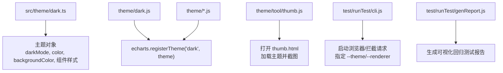
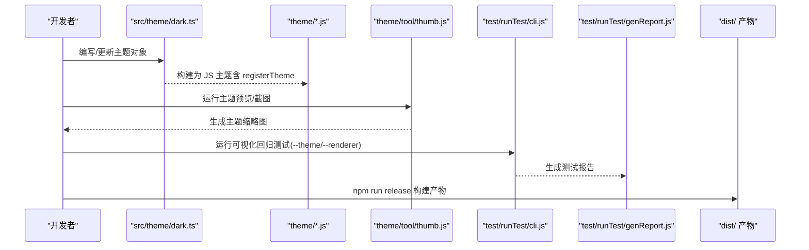
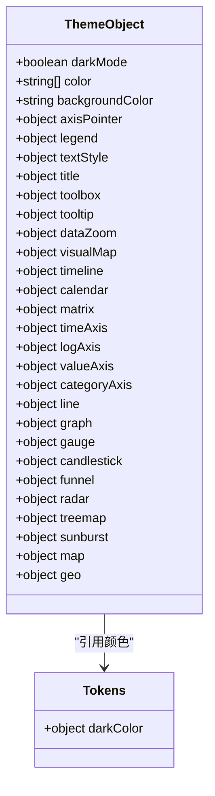
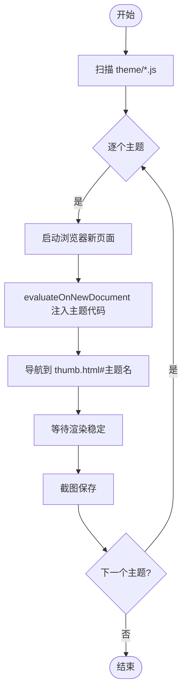
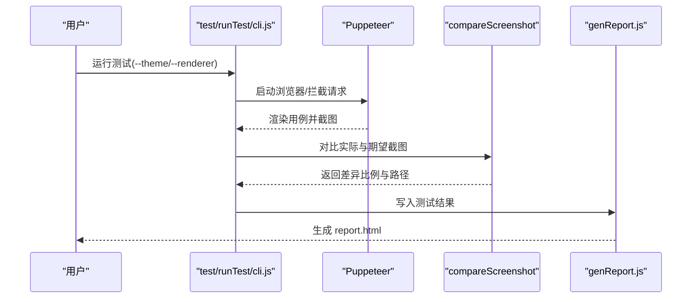
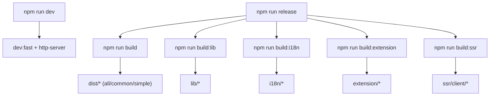
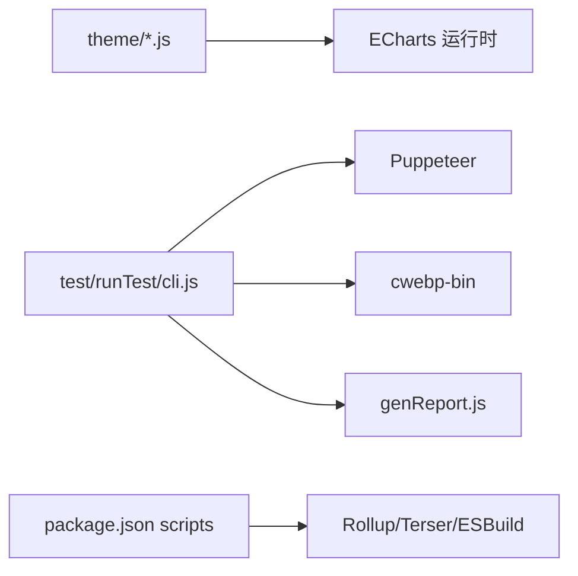

# 主题开发工作流

<cite>
**本文引用的文件**
- [README.md](file://README.md)
- [package.json](file://package.json)
- [src/theme/dark.ts](file://src/theme/dark.ts)
- [theme/dark.js](file://theme/dark.js)
- [theme/azul.js](file://theme/azul.js)
- [theme/tool/thumb.js](file://theme/tool/thumb.js)
- [test/runTest/cli.js](file://test/runTest/cli.js)
- [test/runTest/genReport.js](file://test/runTest/genReport.js)
- [test/runTest/visual-test-copy-from-examples.js](file://test/runTest/visual-test-copy-from-examples.js)
- [CONTRIBUTING.md](file://CONTRIBUTING.md)
</cite>

## 目录
1. [简介](#简介)
2. [项目结构](#项目结构)
3. [核心组件](#核心组件)
4. [架构总览](#架构总览)
5. [详细组件分析](#详细组件分析)
6. [依赖分析](#依赖分析)
7. [性能考虑](#性能考虑)
8. [故障排查指南](#故障排查指南)
9. [结论](#结论)
10. [附录](#附录)

## 简介
本文件面向 ECharts 主题开发者，系统化阐述从需求分析到最终发布的完整工作流。内容涵盖：
- 主题文件的结构组织与命名规范
- 主题开发环境搭建与构建流程
- 主题测试与调试方法（视觉回归测试、兼容性测试）
- 主题发布与版本管理策略
- 从设计稿到代码实现、测试验证、文档编写的完整案例
- 团队协作与代码审查最佳实践

## 项目结构
ECharts 的主题相关资源主要分布在以下位置：
- src/theme：TypeScript 源码中的内置主题（例如 dark），通过 tokens 统一色彩体系
- theme：预编译的 JS 主题包，每个主题一个文件，并在末尾注册主题名
- theme/tool：主题预览与截图工具（Puppeteer + 本地 HTML）
- test/runTest：可视化回归测试框架（基于 Puppeteer），支持多渲染器、多主题、多浏览器实例并行执行与报告生成
- package.json：构建脚本、测试命令、产物导出配置等

图表来源
- [src/theme/dark.ts:68-329](file://src/theme/dark.ts#L68-L329)
- [theme/dark.js:20-44](file://theme/dark.js#L20-L44)
- [theme/azul.js:177-177](file://theme/azul.js#L177-L177)
- [theme/tool/thumb.js:31-49](file://theme/tool/thumb.js#L31-L49)
- [test/runTest/cli.js:37-60](file://test/runTest/cli.js#L37-L60)
- [test/runTest/genReport.js:228-369](file://test/runTest/genReport.js#L228-L369)

章节来源
- [README.md:36-60](file://README.md#L36-L60)
- [package.json:43-73](file://package.json#L43-L73)
- [package.json:120-150](file://package.json#L120-L150)

## 核心组件
- 主题定义与注册
  - TypeScript 源主题（如 dark）集中定义主题对象，并通过 tokens 统一管理颜色与语义变量
  - 预编译主题（theme/*.js）在模块末尾调用 echarts.registerTheme(主题名, 主题对象) 完成注册
- 主题预览与截图
  - theme/tool/thumb.js 使用 Puppeteer 遍历 theme 目录下所有主题文件，注入主题后访问 thumb.html 并截图，便于快速核对视觉效果
- 可视化回归测试
  - test/runTest/cli.js 提供命令行入口，支持指定 --theme、--renderer、--expected/--actual 等参数，驱动浏览器运行用例并截图对比
  - test/runTest/genReport.js 汇总测试结果，输出 HTML 报告，包含失败项与“预期差异”标记
- 构建与发布
  - package.json scripts 提供 dev、build、release 等命令；release 会依次构建 lib、i18n、dist、esm、extension、ssr 等多形态产物
  - package.json exports 暴露 ./theme/* 路径，供外部直接引入主题

章节来源
- [src/theme/dark.ts:20-329](file://src/theme/dark.ts#L20-L329)
- [theme/dark.js:20-44](file://theme/dark.js#L20-L44)
- [theme/azul.js:177-177](file://theme/azul.js#L177-L177)
- [theme/tool/thumb.js:31-49](file://theme/tool/thumb.js#L31-L49)
- [test/runTest/cli.js:37-60](file://test/runTest/cli.js#L37-L60)
- [test/runTest/genReport.js:228-369](file://test/runTest/genReport.js#L228-L369)
- [package.json:43-73](file://package.json#L43-L73)
- [package.json:120-150](file://package.json#L120-L150)

## 架构总览
下图展示了主题从定义、预览、测试到产物的整体链路：

图表来源
- [src/theme/dark.ts:68-329](file://src/theme/dark.ts#L68-L329)
- [theme/dark.js:20-44](file://theme/dark.js#L20-L44)
- [theme/tool/thumb.js:31-49](file://theme/tool/thumb.js#L31-L49)
- [test/runTest/cli.js:37-60](file://test/runTest/cli.js#L37-L60)
- [test/runTest/genReport.js:228-369](file://test/runTest/genReport.js#L228-L369)
- [package.json:43-73](file://package.json#L43-L73)

## 详细组件分析

### 主题定义与注册（dark 主题为例）
- 主题对象结构
  - 顶层字段：darkMode、color、backgroundColor
  - 组件样式：axisPointer、legend、textStyle、title、toolbox、tooltip、dataZoom、visualMap、timeline、calendar、matrix、timeAxis/logAxis/valueAxis/categoryAxis
  - 图表样式：line、graph、gauge、candlestick、funnel、radar、treemap、sunburst、map、geo
- 颜色体系
  - 通过导入 tokens 获取统一的暗色主题色板，确保全局一致性
- 注册机制
  - 预编译主题在文件末尾调用 echarts.registerTheme('dark', theme) 完成注册，外部可通过名称切换主题

图表来源
- [src/theme/dark.ts:20-329](file://src/theme/dark.ts#L20-L329)
- [theme/dark.js:20-44](file://theme/dark.js#L20-L44)

章节来源
- [src/theme/dark.ts:68-329](file://src/theme/dark.ts#L68-L329)
- [theme/dark.js:20-44](file://theme/dark.js#L20-L44)

### 主题预览与截图工具
- 工作原理
  - 遍历 theme 目录下所有 .js 主题文件
  - 使用 Puppeteer 打开本地 thumb.html，将主题代码注入页面
  - 设置视口尺寸，等待渲染完成后截图至 theme/thumb 目录
- 适用场景
  - 快速校验主题在不同图表下的显示效果
  - 作为视觉回归前的预检查手段

图表来源
- [theme/tool/thumb.js:31-49](file://theme/tool/thumb.js#L31-L49)

章节来源
- [theme/tool/thumb.js:31-49](file://theme/tool/thumb.js#L31-L49)

### 可视化回归测试与兼容性测试
- 测试入口与参数
  - CLI 支持 --theme 指定主题、--renderer 指定渲染器（canvas/svg）、--expected/--actual 指定期望与实际版本、--use-coarse-pointer 模拟触控指针等
- 执行流程
  - 启动 Puppeteer，拦截请求以替换 ECharts 版本或主题
  - 对每个用例截图（实际与期望），转换为 WebP 节省空间
  - 计算差异比例，记录日志与错误
- 报告生成
  - 汇总结果生成 HTML 报告，列出失败项与“预期差异”项，便于定位问题

图表来源
- [test/runTest/cli.js:37-60](file://test/runTest/cli.js#L37-L60)
- [test/runTest/cli.js:117-149](file://test/runTest/cli.js#L117-L149)
- [test/runTest/cli.js:410-448](file://test/runTest/cli.js#L410-L448)
- [test/runTest/genReport.js:228-369](file://test/runTest/genReport.js#L228-L369)

章节来源
- [test/runTest/cli.js:37-60](file://test/runTest/cli.js#L37-L60)
- [test/runTest/cli.js:117-149](file://test/runTest/cli.js#L117-L149)
- [test/runTest/cli.js:410-448](file://test/runTest/cli.js#L410-L448)
- [test/runTest/genReport.js:228-369](file://test/runTest/genReport.js#L228-L369)

### 构建与发布流程
- 开发模式
  - npm run dev：构建 i18n 并启动开发服务器，自动打开 test 目录以便手工验证
- 构建产物
  - npm run build：构建 all/common/simple 并压缩
  - npm run build:lib：构建 lib 产物
  - npm run build:i18n：构建国际化资源
  - npm run build:extension / build:ssr：构建扩展与 SSR 客户端
- 全量发布
  - npm run release：按顺序构建 lib、i18n、dist、esm、extension、ssr，产出完整发布包
- 主题导出
  - package.json exports 暴露 ./theme/*，允许按需引入主题

图表来源
- [package.json:43-73](file://package.json#L43-L73)

章节来源
- [package.json:43-73](file://package.json#L43-L73)
- [package.json:120-150](file://package.json#L120-L150)

### 主题命名与组织结构规范
- 文件命名
  - 每个主题独立文件，位于 theme 目录，文件名即主题名（如 azul.js、dark.js）
  - 文件名需与 registerTheme 中注册的字符串一致，便于外部通过名称引入
- 主题对象
  - 遵循 ECharts Option 的结构化约定，覆盖必要组件与图表样式
  - 推荐使用 tokens 提供的语义化颜色，保证可维护性与一致性
- 导出方式
  - 预编译主题在文件末尾调用 echarts.registerTheme('主题名', theme)
  - 通过 package.json exports 暴露 ./theme/*，供使用者按需引入

章节来源
- [theme/azul.js:177-177](file://theme/azul.js#L177-L177)
- [theme/dark.js:20-44](file://theme/dark.js#L20-L44)
- [package.json:120-150](file://package.json#L120-L150)

### 从需求到发布的完整案例（示例）
- 需求分析
  - 明确目标风格（如深色主题）、品牌色、对比度要求、无障碍可读性
- 设计稿转换
  - 将设计稿色板映射到 tokens 或主题色数组，确定背景、文字、边框、强调色等
- 代码实现
  - 在 src/theme 下新增或修改主题对象，覆盖必要组件与图表样式
  - 在 theme 目录生成对应 JS 主题文件，并在末尾注册主题名
- 测试验证
  - 使用 theme/tool/thumb.js 快速预览各图表效果
  - 使用 test/runTest/cli.js 运行可视化回归测试，指定 --theme 与 --renderer，必要时开启 --use-coarse-pointer 进行移动端兼容验证
  - 根据 genReport.js 生成的报告修复问题
- 文档编写
  - 补充主题使用说明、适用场景、注意事项
- 发布与版本管理
  - 使用 npm run release 构建并发布；遵循贡献指南中的里程碑与分支策略

[本节为概念性说明，不直接分析具体文件]

## 依赖分析
- 主题与运行时
  - 主题对象依赖 ECharts 运行时 API（registerTheme）
  - 预编译主题通过 CommonJS/UMD 包装，兼容多种加载方式
- 测试与工具
  - 可视化回归测试依赖 Puppeteer、WebP 编码工具（cwebp-bin）
  - 报告生成依赖文件系统与模板拼接
- 构建系统
  - 构建脚本依赖 Rollup、Terser、ESBuild 等工具链

图表来源
- [theme/dark.js:20-44](file://theme/dark.js#L20-L44)
- [test/runTest/cli.js:22-34](file://test/runTest/cli.js#L22-L34)
- [test/runTest/cli.js:99-114](file://test/runTest/cli.js#L99-L114)
- [package.json:43-73](file://package.json#L43-L73)

章节来源
- [theme/dark.js:20-44](file://theme/dark.js#L20-L44)
- [test/runTest/cli.js:22-34](file://test/runTest/cli.js#L22-L34)
- [test/runTest/cli.js:99-114](file://test/runTest/cli.js#L99-L114)
- [package.json:43-73](file://package.json#L43-L73)

## 性能考虑
- 主题体积
  - 仅声明必要的样式字段，避免冗余配置
  - 复用 tokens 减少重复颜色定义
- 渲染性能
  - 合理设置 background、splitArea、splitLine 等大面积绘制元素的颜色与透明度
  - 控制动画与过渡的复杂度，避免过度重绘
- 测试效率
  - 使用 WebP 截图降低存储与传输开销
  - 并行线程执行测试任务，缩短回归时间

[本节提供通用指导，不直接分析具体文件]

## 故障排查指南
- 主题未生效
  - 确认主题文件已正确调用 echarts.registerTheme('主题名', theme)
  - 确认引入的是正确的主题文件路径（./theme/*）
- 视觉回归失败
  - 检查 --theme 与 --renderer 参数是否与预期一致
  - 查看测试报告中的差异截图与 diffRatio，定位具体用例
  - 若为预期差异，可在 marks 中标记为“预期”，避免误报
- 构建失败
  - 检查 Node 环境与依赖安装是否完整
  - 使用 npm run checktype 检查类型错误
  - 使用 npm run lint 检查代码规范

章节来源
- [theme/dark.js:20-44](file://theme/dark.js#L20-L44)
- [test/runTest/cli.js:37-60](file://test/runTest/cli.js#L37-L60)
- [test/runTest/genReport.js:228-369](file://test/runTest/genReport.js#L228-L369)
- [package.json:67-73](file://package.json#L67-L73)

## 结论
ECharts 的主题开发具备清晰的工程化流程：从 TypeScript 源主题到预编译 JS 主题，配合完善的预览、测试与构建工具链，能够高效支撑多风格、多场景的主题交付。建议团队遵循命名与结构规范，结合可视化回归测试与报告机制，保障主题质量与稳定性。

## 附录
- 团队协作与代码审查最佳实践
  - 提交前运行 lint 与类型检查，确保代码质量
  - 变更主题时同步更新预览截图与回归用例，确保可追溯
  - 遵循贡献指南中的 Issue、PR 流程与版本里程碑策略
  - 对影响广泛的样式变更进行跨图表、跨渲染器的兼容性验证

章节来源
- [CONTRIBUTING.md:30-46](file://CONTRIBUTING.md#L30-L46)
- [package.json:67-73](file://package.json#L67-L73)