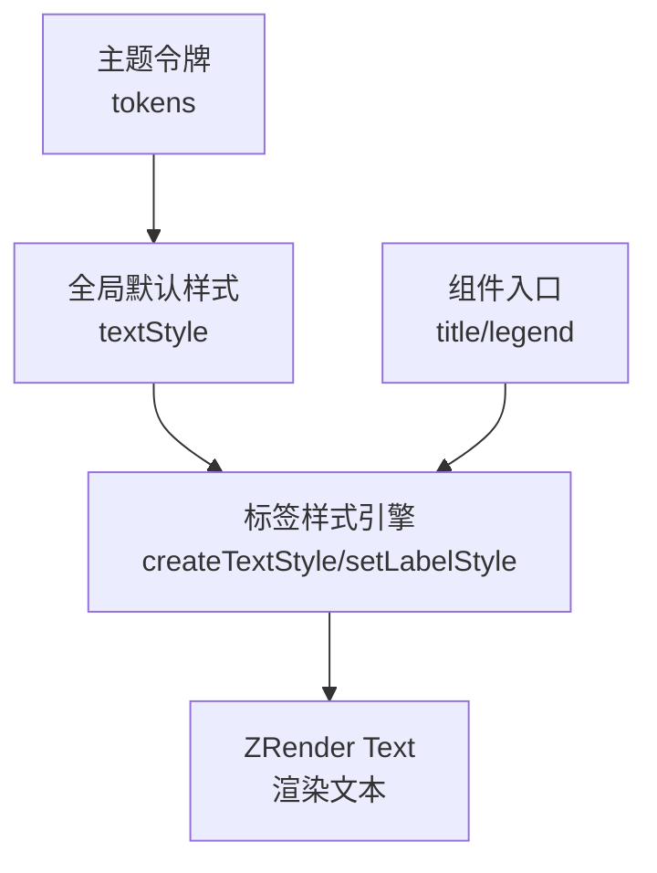
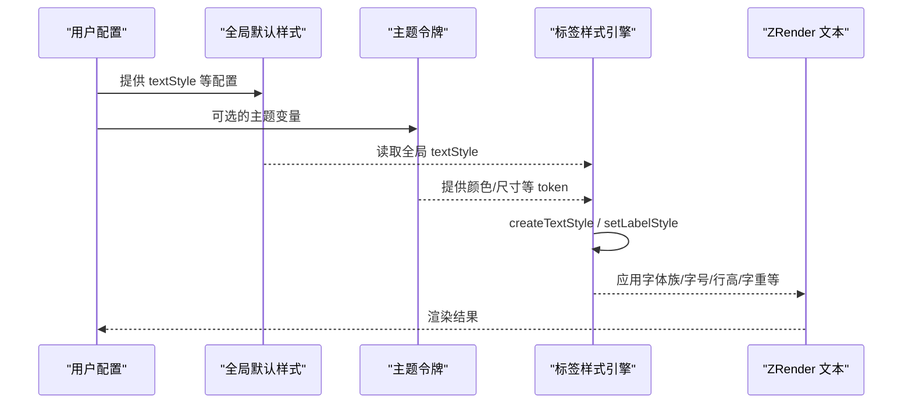
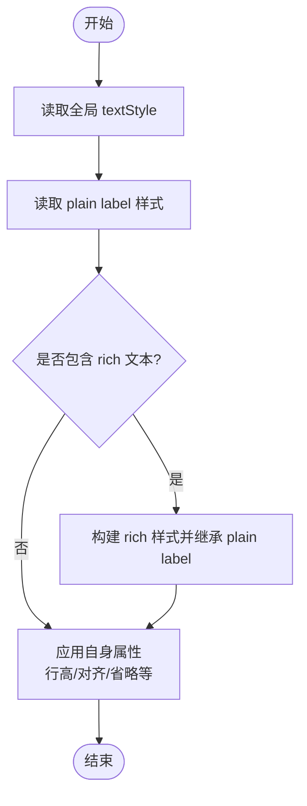
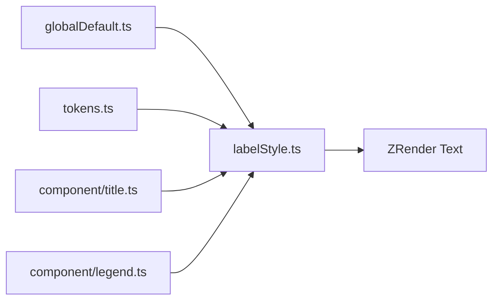

# 字体样式配置

<cite>
**本文引用的文件**
- [src/model/globalDefault.ts](file://src/model/globalDefault.ts)
- [src/label/labelStyle.ts](file://src/label/labelStyle.ts)
- [src/visual/tokens.ts](file://src/visual/tokens.ts)
- [src/component/title.ts](file://src/component/title.ts)
- [src/component/legend.ts](file://src/component/legend.ts)
</cite>

## 目录
1. [简介](#简介)
2. [项目结构](#项目结构)
3. [核心组件](#核心组件)
4. [架构总览](#架构总览)
5. [详细组件分析](#详细组件分析)
6. [依赖关系分析](#依赖关系分析)
7. [性能考虑](#性能考虑)
8. [故障排查指南](#故障排查指南)
9. [结论](#结论)
10. [附录：完整示例与最佳实践](#附录完整示例与最佳实践)

## 简介
本章节聚焦 ECharts 的字体样式配置，系统说明字体族、字号、行高、字重等属性的设置方式，解释全局文本样式与各组件（标题、图例、坐标轴标签等）的继承与覆盖机制，阐述字体加载策略与跨平台兼容性处理，并提供中文字体优化、多语言支持、响应式字体调整的实践建议与性能优化要点。

## 项目结构
ECharts 的字体样式由“全局默认 + 主题令牌 + 标签样式引擎”共同构成：
- 全局默认样式定义在模型层，提供基础字体族、字号、字重等默认值，并针对平台差异做兼容处理。
- 主题令牌集中管理颜色与尺寸等设计变量，供全局与组件使用。
- 标签样式引擎统一负责将模型中的样式解析为渲染所需的样式对象，支持 rich 文本、状态样式、溢出控制等高级能力。
- 各组件（如标题、图例）通过安装器引入，复用统一的标签样式能力。

图表来源
- [src/model/globalDefault.ts:86-95](file://src/model/globalDefault.ts#L86-L95)
- [src/visual/tokens.ts:105-231](file://src/visual/tokens.ts#L105-L231)
- [src/label/labelStyle.ts:325-485](file://src/label/labelStyle.ts#L325-L485)
- [src/component/title.ts:20-23](file://src/component/title.ts#L20-L23)
- [src/component/legend.ts:22-25](file://src/component/legend.ts#L22-L25)

章节来源
- [src/model/globalDefault.ts:86-95](file://src/model/globalDefault.ts#L86-L95)
- [src/visual/tokens.ts:105-231](file://src/visual/tokens.ts#L105-L231)
- [src/label/labelStyle.ts:325-485](file://src/label/labelStyle.ts#L325-L485)
- [src/component/title.ts:20-23](file://src/component/title.ts#L20-L23)
- [src/component/legend.ts:22-25](file://src/component/legend.ts#L22-L25)

## 核心组件
- 全局文本样式：定义全局字体族、字号、字重、样式等，作为所有文本的基线。
- 标签样式引擎：统一创建和合并文本样式，支持 rich 文本、状态样式、溢出控制、边框与阴影等。
- 主题令牌：集中化颜色与尺寸变量，便于主题切换与一致性维护。
- 组件入口：标题、图例等组件通过安装器注册，复用标签样式引擎完成文本渲染。

章节来源
- [src/model/globalDefault.ts:86-95](file://src/model/globalDefault.ts#L86-L95)
- [src/label/labelStyle.ts:325-485](file://src/label/labelStyle.ts#L325-L485)
- [src/visual/tokens.ts:105-231](file://src/visual/tokens.ts#L105-L231)
- [src/component/title.ts:20-23](file://src/component/title.ts#L20-L23)
- [src/component/legend.ts:22-25](file://src/component/legend.ts#L22-L25)

## 架构总览
下图展示了从配置到渲染的关键路径：全局默认样式与主题令牌被标签样式引擎读取，生成最终样式并应用到 ZRender 文本元素；组件入口通过安装器启用相应功能。

图表来源
- [src/model/globalDefault.ts:86-95](file://src/model/globalDefault.ts#L86-L95)
- [src/visual/tokens.ts:105-231](file://src/visual/tokens.ts#L105-L231)
- [src/label/labelStyle.ts:325-485](file://src/label/labelStyle.ts#L325-L485)

## 详细组件分析

### 全局文本样式与继承机制
- 全局文本样式包含字体族、字号、字重、样式等属性，作为所有文本的默认基线。
- 标签样式引擎在构建样式时，会按优先级合并：组件级样式 > 父级 plain label > 全局 textStyle。
- 对于部分字体相关属性（如字体族、字号、字重、字体样式、文本阴影），允许从 plain label 与全局 textStyle 继承，确保一致性与可维护性。
- 行高、对齐、宽度、高度、垂直对齐、省略等属于“自身属性”，仅从当前样式模型获取，不直接继承自全局。

图表来源
- [src/label/labelStyle.ts:394-485](file://src/label/labelStyle.ts#L394-L485)
- [src/label/labelStyle.ts:520-685](file://src/label/labelStyle.ts#L520-L685)

章节来源
- [src/label/labelStyle.ts:394-485](file://src/label/labelStyle.ts#L394-L485)
- [src/label/labelStyle.ts:520-685](file://src/label/labelStyle.ts#L520-L685)
- [src/model/globalDefault.ts:86-95](file://src/model/globalDefault.ts#L86-L95)

### 标题组件样式
- 标题组件通过安装器引入，复用统一的标签样式引擎进行文本渲染。
- 标题文本样式遵循全局与组件级的继承规则，可通过标题自身的 textStyle 覆盖默认行为。

章节来源
- [src/component/title.ts:20-23](file://src/component/title.ts#L20-L23)
- [src/label/labelStyle.ts:325-485](file://src/label/labelStyle.ts#L325-L485)

### 图例组件样式
- 图例组件同样通过安装器引入，并使用标签样式引擎渲染图例文本。
- 图例文本样式继承全局与组件级配置，支持 rich 文本与状态样式。

章节来源
- [src/component/legend.ts:22-25](file://src/component/legend.ts#L22-L25)
- [src/label/labelStyle.ts:325-485](file://src/label/labelStyle.ts#L325-L485)

### 坐标轴标签样式
- 坐标轴标签样式通过标签样式引擎统一处理，支持继承全局与组件级样式。
- 可配置溢出、行高、对齐、省略等行为，保证在不同分辨率下的可读性。

章节来源
- [src/label/labelStyle.ts:394-485](file://src/label/labelStyle.ts#L394-L485)
- [src/label/labelStyle.ts:520-685](file://src/label/labelStyle.ts#L520-L685)

### 字体字符串生成与平台兼容
- 字体字符串由样式引擎根据字体样式、字重、字号与字体族拼接而成，未指定时回退到全局或默认值。
- 全局默认样式在 Windows 平台优先使用微软雅黑，其他平台使用无衬线字体，提升中文显示效果与兼容性。

章节来源
- [src/label/labelStyle.ts:687-699](file://src/label/labelStyle.ts#L687-L699)
- [src/model/globalDefault.ts:23-27](file://src/model/globalDefault.ts#L23-L27)
- [src/model/globalDefault.ts:86-95](file://src/model/globalDefault.ts#L86-L95)

## 依赖关系分析
- 全局默认样式依赖平台信息以选择合适字体族。
- 标签样式引擎依赖全局样式与主题令牌，生成最终样式。
- 组件入口依赖安装器与标签样式引擎，实现统一的文本渲染。

图表来源
- [src/model/globalDefault.ts:86-95](file://src/model/globalDefault.ts#L86-L95)
- [src/visual/tokens.ts:105-231](file://src/visual/tokens.ts#L105-L231)
- [src/label/labelStyle.ts:325-485](file://src/label/labelStyle.ts#L325-L485)
- [src/component/title.ts:20-23](file://src/component/title.ts#L20-L23)
- [src/component/legend.ts:22-25](file://src/component/legend.ts#L22-L25)

章节来源
- [src/model/globalDefault.ts:86-95](file://src/model/globalDefault.ts#L86-L95)
- [src/visual/tokens.ts:105-231](file://src/visual/tokens.ts#L105-L231)
- [src/label/labelStyle.ts:325-485](file://src/label/labelStyle.ts#L325-L485)
- [src/component/title.ts:20-23](file://src/component/title.ts#L20-L23)
- [src/component/legend.ts:22-25](file://src/component/legend.ts#L22-L25)

## 性能考虑
- 避免频繁变更字体族：字体族切换可能触发浏览器字体加载与布局重排，建议在主题或全局配置中固定字体族。
- 合理使用行高与溢出：过小的行高可能导致文本重叠，过大则浪费空间；结合溢出与省略策略减少重绘。
- 精简 rich 文本层级：rich 文本层级越深，样式计算成本越高，应尽量减少不必要的嵌套。
- 利用主题令牌：通过 tokens 统一管理颜色与尺寸，减少重复配置与运行时计算。
- 按需启用动画与状态样式：仅在必要时启用文本值动画与复杂状态样式，降低渲染压力。

[本节为通用指导，不直接分析具体文件]

## 故障排查指南
- 中文显示异常：检查全局默认字体族是否在目标平台可用；Windows 下默认使用微软雅黑，其他平台使用无衬线字体。
- 行高不生效：确认行高属于“自身属性”，不会从全局继承；需在对应组件或标签样式中显式设置。
- 字体大小不一致：确认 fontSize 是否正确设置，且未被后续样式覆盖；注意 rich 文本与 plain label 的继承关系。
- 文本溢出问题：检查 overflow 与 lineOverflow 配置，必要时调整布局区域或启用省略。
- 主题颜色影响文本：若使用 inherit/auto 颜色策略，需确保上下文色正确传递；避免误用已废弃的 auto 值。

章节来源
- [src/model/globalDefault.ts:23-27](file://src/model/globalDefault.ts#L23-L27)
- [src/model/globalDefault.ts:86-95](file://src/model/globalDefault.ts#L86-L95)
- [src/label/labelStyle.ts:520-685](file://src/label/labelStyle.ts#L520-L685)
- [src/label/labelStyle.ts:394-485](file://src/label/labelStyle.ts#L394-L485)

## 结论
ECharts 的字体样式体系以全局默认样式为基础，通过标签样式引擎统一处理继承、合并与渲染，并结合主题令牌实现一致的视觉表达。理解继承与覆盖机制、合理配置字体族与字号、关注溢出与行高，以及遵循性能优化建议，可在不同平台与场景下获得稳定、清晰、高效的文本呈现。

[本节为总结，不直接分析具体文件]

## 附录：完整示例与最佳实践

### 中文字体优化
- 在 Windows 平台，全局默认字体族已优先使用微软雅黑，有助于中文显示；在其他平台建议使用合适的无衬线字体族。
- 如需自定义字体族，请在全局 textStyle 中设置 fontFamily，并确保目标环境已加载该字体。

章节来源
- [src/model/globalDefault.ts:23-27](file://src/model/globalDefault.ts#L23-L27)
- [src/model/globalDefault.ts:86-95](file://src/model/globalDefault.ts#L86-L95)

### 多语言支持
- 通过 i18n 资源文件提供多语言文案，配合 formatter 或标签文本获取器动态生成文本内容。
- 在多语言环境下，注意字体族对字符集的支持，必要时为不同语言选择更合适的字体族。

[本节为概念性说明，不直接分析具体文件]

### 响应式字体调整
- 根据容器尺寸或屏幕密度动态调整 fontSize，保持可读性与布局平衡。
- 结合行高与溢出策略，在小屏设备上优化文本展示。

[本节为概念性说明，不直接分析具体文件]

### 完整配置清单（参考路径）
- 全局文本样式：参见 [src/model/globalDefault.ts:86-95](file://src/model/globalDefault.ts#L86-L95)
- 标签样式引擎：参见 [src/label/labelStyle.ts:325-485](file://src/label/labelStyle.ts#L325-L485)
- 主题令牌：参见 [src/visual/tokens.ts:105-231](file://src/visual/tokens.ts#L105-L231)
- 组件入口：参见 [src/component/title.ts:20-23](file://src/component/title.ts#L20-L23)、[src/component/legend.ts:22-25](file://src/component/legend.ts#L22-L25)

[本节为指引，不直接分析具体文件]