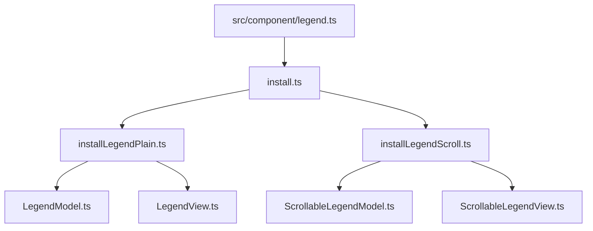
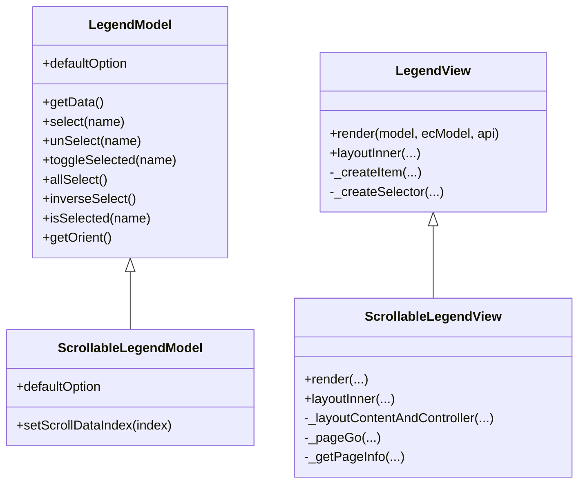
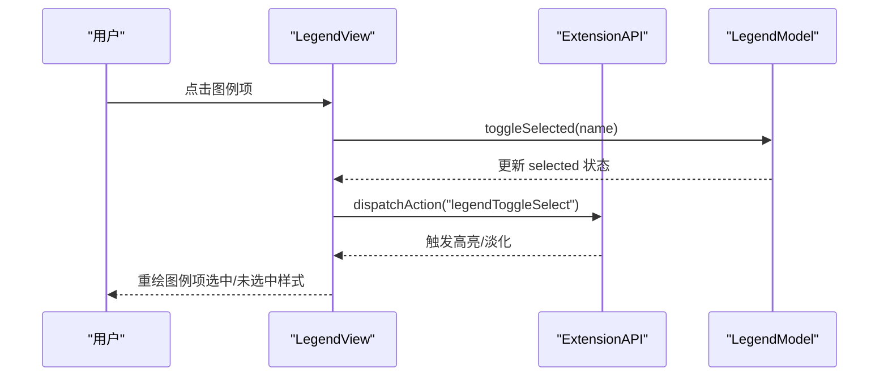
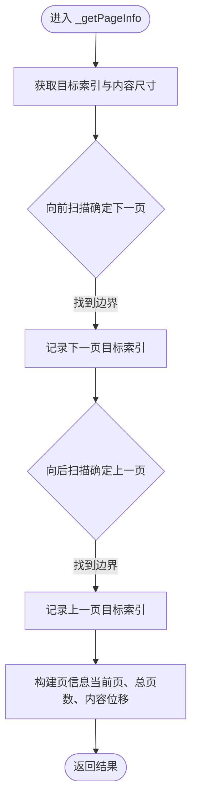
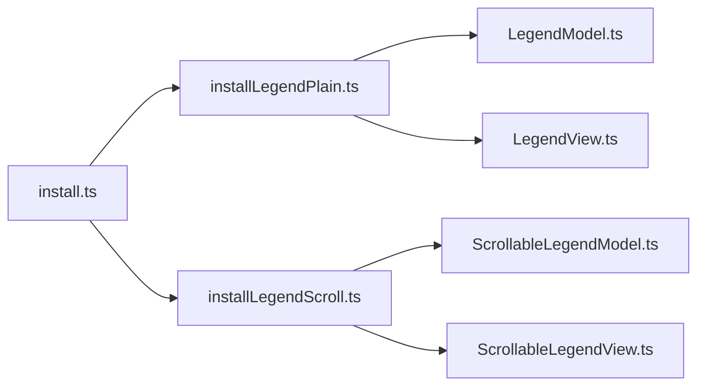

# 图例样式定制

<cite>
**本文引用的文件**
- [src/component/legend.ts](file://src/component/legend.ts)
- [src/component/legendPlain.ts](file://src/component/legendPlain.ts)
- [src/component/legendScroll.ts](file://src/component/legendScroll.ts)
- [src/component/legend/install.ts](file://src/component/legend/install.ts)
- [src/component/legend/installLegendPlain.ts](file://src/component/legend/installLegendPlain.ts)
- [src/component/legend/installLegendScroll.ts](file://src/component/legend/installLegendScroll.ts)
- [src/component/legend/LegendModel.ts](file://src/component/legend/LegendModel.ts)
- [src/component/legend/LegendView.ts](file://src/component/legend/LegendView.ts)
- [src/component/legend/ScrollableLegendModel.ts](file://src/component/legend/ScrollableLegendModel.ts)
- [src/component/legend/ScrollableLegendView.ts](file://src/component/legend/ScrollableLegendView.ts)
- [test/legend-style.html](file://test/legend-style.html)
- [test/legend-scroll2plain.html](file://test/legend-scroll2plain.html)
</cite>

## 目录
1. [简介](#简介)
2. [项目结构](#项目结构)
3. [核心组件](#核心组件)
4. [架构总览](#架构总览)
5. [详细组件分析](#详细组件分析)
6. [依赖关系分析](#依赖关系分析)
7. [性能考虑](#性能考虑)
8. [故障排查指南](#故障排查指南)
9. [结论](#结论)
10. [附录](#附录)

## 简介
本章节聚焦 ECharts 图例组件的样式定制能力，覆盖以下方面：
- 文本样式、图标样式、布局与间距、滚动分页控件样式
- 位置、尺寸、对齐方式与响应式布局
- 普通图例与滚动图例的差异与各自配置项
- 完整示例路径（自定义图标、分组样式、响应式布局）
- 状态样式（默认、悬停、选中/未选中）的配置方法与最佳实践

## 项目结构
ECharts 将“普通图例”和“滚动图例”作为可插拔扩展进行安装与注册。入口文件负责统一安装，具体实现位于 legend 子目录中，包含模型（Model）、视图（View）、动作与过滤器等。

图表来源
- [src/component/legend.ts:20-25](file://src/component/legend.ts#L20-L25)
- [src/component/legend/install.ts:20-27](file://src/component/legend/install.ts#L20-L27)
- [src/component/legend/installLegendPlain.ts:20-36](file://src/component/legend/installLegendPlain.ts#L20-L36)
- [src/component/legend/installLegendScroll.ts:20-33](file://src/component/legend/installLegendScroll.ts#L20-L33)

章节来源
- [src/component/legend.ts:20-25](file://src/component/legend.ts#L20-L25)
- [src/component/legend/install.ts:20-27](file://src/component/legend/install.ts#L20-L27)
- [src/component/legend/installLegendPlain.ts:20-36](file://src/component/legend/installLegendPlain.ts#L20-L36)
- [src/component/legend/installLegendScroll.ts:20-33](file://src/component/legend/installLegendScroll.ts#L20-L33)

## 核心组件
- 普通图例
  - 模型：定义图例选项、默认值、选择模式、选择器按钮等
  - 视图：渲染图例项、背景、选择器按钮，处理布局与交互事件
- 滚动图例
  - 模型：在普通图例基础上增加分页控制相关选项
  - 视图：在普通图例基础上增加分页控制器、裁剪容器、翻页动画与页码显示

章节来源
- [src/component/legend/LegendModel.ts:245-543](file://src/component/legend/LegendModel.ts#L245-L543)
- [src/component/legend/LegendView.ts:61-759](file://src/component/legend/LegendView.ts#L61-L759)
- [src/component/legend/ScrollableLegendModel.ts:31-124](file://src/component/legend/ScrollableLegendModel.ts#L31-L124)
- [src/component/legend/ScrollableLegendView.ts:72-553](file://src/component/legend/ScrollableLegendView.ts#L72-L553)

## 架构总览
下图展示了普通图例与滚动图例的类继承与协作关系，以及它们如何被安装到 ECharts 中。

图表来源
- [src/component/legend/LegendModel.ts:245-543](file://src/component/legend/LegendModel.ts#L245-L543)
- [src/component/legend/ScrollableLegendModel.ts:56-124](file://src/component/legend/ScrollableLegendModel.ts#L56-L124)
- [src/component/legend/LegendView.ts:61-759](file://src/component/legend/LegendView.ts#L61-L759)
- [src/component/legend/ScrollableLegendView.ts:72-553](file://src/component/legend/ScrollableLegendView.ts#L72-L553)

## 详细组件分析

### 普通图例（Plain Legend）
- 文本样式
  - 通过 textStyle 设置字体颜色、字号、富文本等；支持 formatter 对名称进行格式化
  - 选中项使用默认文本色，未选中项可使用 inactiveColor 单独设置
- 图标样式
  - icon 指定图例图标类型（如 roundRect、emptyRect、三角形等），可通过 itemWidth/itemHeight/symbolRotate 调整大小与旋转
  - itemStyle/lineStyle 控制填充、描边、透明度、边框宽度等；支持 inherit/auto 继承系列视觉样式
  - 未选中时可使用 inactiveColor/inactiveBorderColor/inactiveBorderWidth 控制外观
- 布局与间距
  - orient 控制水平或垂直排列；align 控制对齐方式；itemGap 控制图例项间距
  - padding/borderRadius/borderColor/borderWidth 控制背景与边框
  - left/right/top/bottom 控制整体位置；width/height 为最大宽高，实际由内容决定
- 选择器按钮（全选/反选）
  - selector 可配置为 true、数组或对象；selectorLabel 控制按钮文字样式；emphasis.selectorLabel 控制悬停样式
  - selectorPosition/selectorItemGap/selectorButtonGap 控制按钮组位置与间距
- 交互与事件
  - 点击切换选中状态；鼠标移入移出触发高亮/淡化；可选 triggerEvent 透传事件数据
  - 支持 tooltip 为每个图例项提供提示

章节来源
- [src/component/legend/LegendModel.ts:89-243](file://src/component/legend/LegendModel.ts#L89-L243)
- [src/component/legend/LegendModel.ts:450-539](file://src/component/legend/LegendModel.ts#L450-L539)
- [src/component/legend/LegendView.ts:174-325](file://src/component/legend/LegendView.ts#L174-L325)
- [src/component/legend/LegendView.ts:384-516](file://src/component/legend/LegendView.ts#L384-L516)
- [src/component/legend/LegendView.ts:599-681](file://src/component/legend/LegendView.ts#L599-L681)

### 滚动图例（Scroll Legend）
- 新增分页控件样式
  - pageIcons：前后翻页图标路径，支持 horizontal/vertical 两套
  - pageIconColor/pageIconInactiveColor：可用/不可用时的图标颜色
  - pageIconSize：图标尺寸，可为单值或 [宽, 高]
  - pageTextStyle：页码文本样式
  - pageFormatter：页码格式化函数或模板字符串
- 分页布局与行为
  - pageButtonItemGap：分页控件内部按钮间距
  - pageButtonGap：分页控件与图例主体之间的间距
  - pageButtonPosition：分页控件相对主体的起始或结束位置
  - scrollDataIndex：当前滚动目标索引；支持动画过渡 animationDurationUpdate
- 视图逻辑
  - 当内容超出容器时自动显示分页控件，并对内容区域进行裁剪
  - 计算页信息（当前页、总页数、上一页/下一页目标索引），并驱动内容平移动画

章节来源
- [src/component/legend/ScrollableLegendModel.ts:31-107](file://src/component/legend/ScrollableLegendModel.ts#L31-L107)
- [src/component/legend/ScrollableLegendView.ts:110-171](file://src/component/legend/ScrollableLegendView.ts#L110-L171)
- [src/component/legend/ScrollableLegendView.ts:176-231](file://src/component/legend/ScrollableLegendView.ts#L176-L231)
- [src/component/legend/ScrollableLegendView.ts:233-348](file://src/component/legend/ScrollableLegendView.ts#L233-L348)
- [src/component/legend/ScrollableLegendView.ts:350-398](file://src/component/legend/ScrollableLegendView.ts#L350-L398)
- [src/component/legend/ScrollableLegendView.ts:408-522](file://src/component/legend/ScrollableLegendView.ts#L408-L522)

### 图例状态样式（默认、悬停、选中/未选中）
- 默认状态
  - 图标与线条样式由 series 视觉映射与 legend.itemStyle/lineStyle 共同决定；支持 inherit/auto 继承
- 未选中状态
  - 通过 inactiveColor/inactiveBorderColor/inactiveBorderWidth 控制未选中图例项的外观；线型图例的 lineStyle 也支持 inactiveColor/inactiveWidth
- 选中状态
  - 选中项文本颜色取自 textStyle 或根据选中态计算；图标与线条恢复系列视觉样式
- 悬停状态
  - 图例项支持 hover emphasis；选择器按钮支持 emphasis.selectorLabel 悬停样式

章节来源
- [src/component/legend/LegendModel.ts:89-126](file://src/component/legend/LegendModel.ts#L89-L126)
- [src/component/legend/LegendModel.ts:450-539](file://src/component/legend/LegendModel.ts#L450-L539)
- [src/component/legend/LegendView.ts:408-479](file://src/component/legend/LegendView.ts#L408-L479)
- [src/component/legend/LegendView.ts:664-681](file://src/component/legend/LegendView.ts#L664-L681)

### 图例位置、尺寸与响应式布局
- 位置与对齐
  - left/right/top/bottom 控制定位；orient 控制主轴方向；align 控制图例项对齐
- 尺寸与间距
  - itemWidth/itemHeight 控制图标尺寸；itemGap 控制项间距；padding 控制内边距
  - width/height 为最大宽高限制，实际尺寸由内容计算
- 响应式
  - 布局基于 box 布局系统，结合容器尺寸自适应；滚动图例在内容溢出时自动启用分页控件

章节来源
- [src/component/legend/LegendModel.ts:162-243](file://src/component/legend/LegendModel.ts#L162-L243)
- [src/component/legend/LegendModel.ts:450-539](file://src/component/legend/LegendModel.ts#L450-L539)
- [src/component/legend/LegendView.ts:104-166](file://src/component/legend/LegendView.ts#L104-L166)
- [src/component/legend/ScrollableLegendView.ts:233-348](file://src/component/legend/ScrollableLegendView.ts#L233-L348)

### 完整示例与高级用法
- 自定义图例图标
  - 通过 legend.data 中每项的 icon 字段覆盖默认图标；或使用 series.getLegendIcon 回调返回自定义图形
  - 参考示例：[test/legend-style.html:61-90](file://test/legend-style.html#L61-L90)
- 图例分组样式
  - 多个 legend 实例可实现分组；每组可独立设置 itemStyle/icon/textStyle/formatter 等
  - 参考示例：[test/legend-style.html:61-90](file://test/legend-style.html#L61-L90)
- 响应式图例布局
  - 使用 align/orient/padding/itemGap 组合实现不同屏幕下的自适应；滚动图例在内容溢出时自动分页
  - 参考示例：[test/legend-scroll2plain.html:68-78](file://test/legend-scroll2plain.html#L68-L78)
- 富文本与格式化
  - 使用 textStyle.rich 与 formatter 实现富文本与动态文本
  - 参考示例：[test/legend-style.html:284-302](file://test/legend-style.html#L284-L302)

章节来源
- [test/legend-style.html:61-90](file://test/legend-style.html#L61-L90)
- [test/legend-style.html:284-302](file://test/legend-style.html#L284-L302)
- [test/legend-scroll2plain.html:68-78](file://test/legend-scroll2plain.html#L68-L78)

### 关键流程时序（点击切换选中）

图表来源
- [src/component/legend/LegendView.ts:709-724](file://src/component/legend/LegendView.ts#L709-L724)
- [src/component/legend/LegendModel.ts:406-413](file://src/component/legend/LegendModel.ts#L406-L413)

### 复杂逻辑流程图（滚动图例分页计算）

图表来源
- [src/component/legend/ScrollableLegendView.ts:408-522](file://src/component/legend/ScrollableLegendView.ts#L408-L522)

## 依赖关系分析
- 安装与注册
  - 入口文件统一安装普通与滚动图例；普通图例注册 Model/View、处理器与子类型默认值；滚动图例复用普通图例并叠加自身 Model/View 与动作
- 组件耦合
  - LegendView 依赖 LegendModel 获取配置与数据；ScrollableLegendView 继承 LegendView 并扩展分页逻辑
  - 两者均依赖布局工具、图形绘制与事件分发机制

图表来源
- [src/component/legend/install.ts:20-27](file://src/component/legend/install.ts#L20-L27)
- [src/component/legend/installLegendPlain.ts:20-36](file://src/component/legend/installLegendPlain.ts#L20-L36)
- [src/component/legend/installLegendScroll.ts:20-33](file://src/component/legend/installLegendScroll.ts#L20-L33)

章节来源
- [src/component/legend/install.ts:20-27](file://src/component/legend/install.ts#L20-L27)
- [src/component/legend/installLegendPlain.ts:20-36](file://src/component/legend/installLegendPlain.ts#L20-L36)
- [src/component/legend/installLegendScroll.ts:20-33](file://src/component/legend/installLegendScroll.ts#L20-L33)

## 性能考虑
- 避免不必要的重绘
  - 首次渲染时 contentGroup 初始位置为 [0,0]，后续布局会修正以避免异常动画
- 合理设置 itemWidth/itemHeight 与 itemGap
  - 过大的图标与间距会增加布局与绘制成本
- 滚动图例的分页控件仅在内容溢出时显示
  - 减少 DOM/SVG 节点数量，提升渲染效率
- 使用 inherit/auto 继承系列视觉样式
  - 减少重复样式计算，提高一致性

章节来源
- [src/component/legend/LegendView.ts:73-85](file://src/component/legend/LegendView.ts#L73-L85)
- [src/component/legend/LegendView.ts:104-166](file://src/component/legend/LegendView.ts#L104-L166)
- [src/component/legend/ScrollableLegendView.ts:233-348](file://src/component/legend/ScrollableLegendView.ts#L233-L348)

## 故障排查指南
- 图例项不显示或名称不匹配
  - 确保 legend.data 中的 name 与系列名或数据名一致；否则会在开发环境输出警告
- 富文本颜色未生效
  - 检查 textStyle.rich 中是否正确使用 inherit 继承图例文本颜色
- 滚动图例无分页控件
  - 确认内容是否超出容器尺寸；若未溢出则不会显示分页控件
- 选择器按钮无效
  - 检查 selector 配置是否为数组或布尔值；确认 selectorPosition 与 orient 的组合是否合理

章节来源
- [src/component/legend/LegendView.ts:313-320](file://src/component/legend/LegendView.ts#L313-L320)
- [test/legend-style.html:284-302](file://test/legend-style.html#L284-L302)
- [src/component/legend/ScrollableLegendView.ts:233-348](file://src/component/legend/ScrollableLegendView.ts#L233-L348)

## 结论
ECharts 图例组件提供了丰富的样式定制能力，涵盖文本、图标、布局、滚动分页与状态样式。普通图例适用于常规场景，滚动图例则在数据量大时提供友好的分页体验。通过合理的配置与布局策略，可以实现高度一致的视觉风格与良好的交互体验。

## 附录
- 常用配置项速查
  - 文本：textStyle、formatter
  - 图标：icon、itemWidth、itemHeight、symbolRotate、symbolKeepAspect
  - 样式：itemStyle、lineStyle、inactiveColor、inactiveBorderColor、inactiveBorderWidth
  - 布局：orient、align、itemGap、padding、borderRadius、backgroundColor、borderColor、borderWidth
  - 位置：left/right/top/bottom
  - 选择器：selector、selectorLabel、emphasis.selectorLabel、selectorPosition、selectorItemGap、selectorButtonGap
  - 滚动：type='scroll'、pageIcons、pageIconColor、pageIconInactiveColor、pageIconSize、pageTextStyle、pageFormatter、pageButtonItemGap、pageButtonGap、pageButtonPosition、scrollDataIndex、animationDurationUpdate

章节来源
- [src/component/legend/LegendModel.ts:89-243](file://src/component/legend/LegendModel.ts#L89-L243)
- [src/component/legend/LegendModel.ts:450-539](file://src/component/legend/LegendModel.ts#L450-L539)
- [src/component/legend/ScrollableLegendModel.ts:31-107](file://src/component/legend/ScrollableLegendModel.ts#L31-L107)