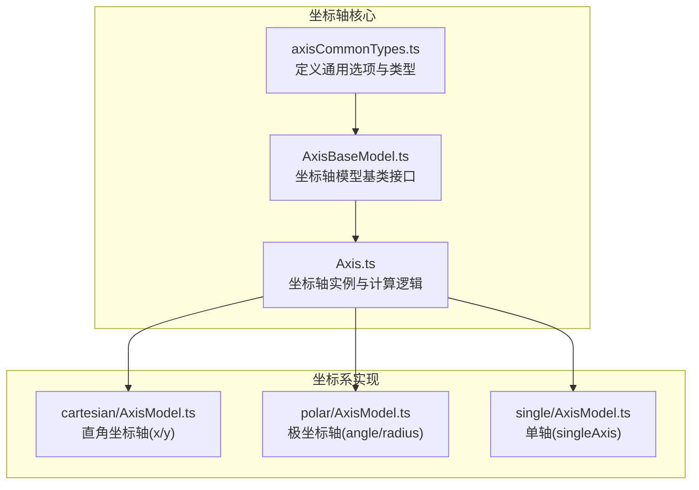
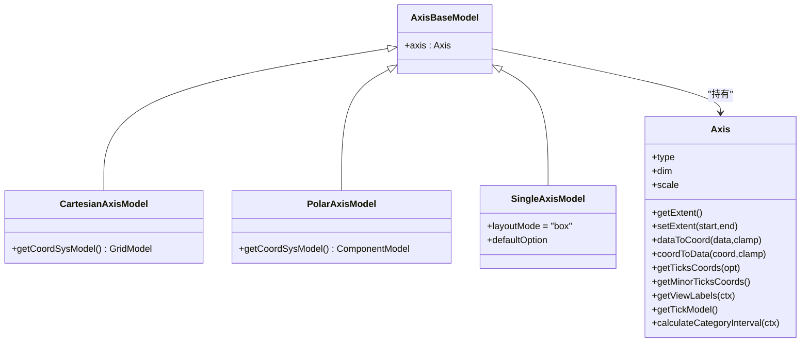
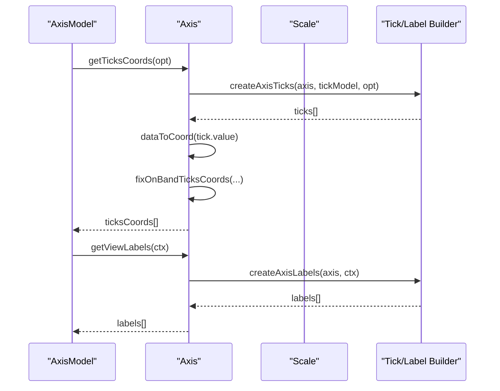
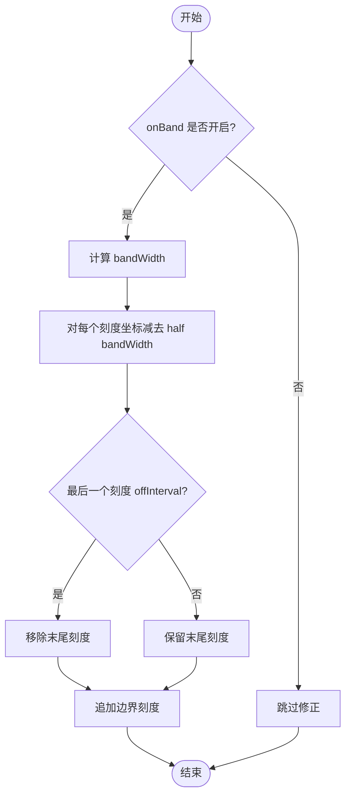
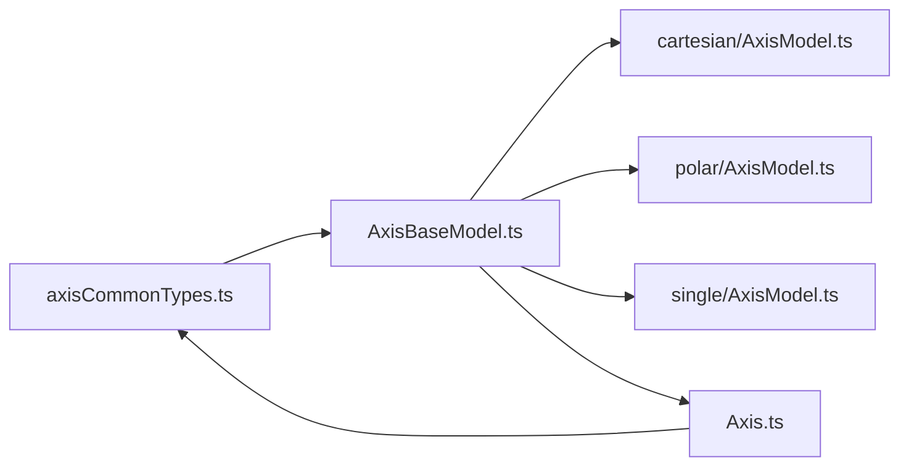

# 坐标轴样式定制

<cite>
**本文引用的文件**
- [src/coord/axisCommonTypes.ts](file://src/coord/axisCommonTypes.ts)
- [src/coord/AxisBaseModel.ts](file://src/coord/AxisBaseModel.ts)
- [src/coord/Axis.ts](file://src/coord/Axis.ts)
- [src/coord/cartesian/AxisModel.ts](file://src/coord/cartesian/AxisModel.ts)
- [src/coord/polar/AxisModel.ts](file://src/coord/polar/AxisModel.ts)
- [src/coord/single/AxisModel.ts](file://src/coord/single/AxisModel.ts)
- [test/axis-style.html](file://test/axis-style.html)
- [test/axis-splitLine.html](file://test/axis-splitLine.html)
- [test/axisLabel.html](file://test/axisLabel.html)
</cite>

## 目录
1. [简介](#简介)
2. [项目结构](#项目结构)
3. [核心组件](#核心组件)
4. [架构总览](#架构总览)
5. [详细组件分析](#详细组件分析)
6. [依赖关系分析](#依赖关系分析)
7. [性能考虑](#性能考虑)
8. [故障排查指南](#故障排查指南)
9. [结论](#结论)
10. [附录：完整示例与最佳实践](#附录完整示例与最佳实践)

## 简介
本章节聚焦 ECharts 坐标轴组件的样式定制能力，系统讲解轴线、刻度、标签、分割线等样式的配置方法，以及坐标轴位置、尺寸、方向的设置选项。同时对比直角坐标轴、极坐标轴、单轴的样式差异，并提供自定义刻度格式、标签旋转、多级坐标轴等高级用法，以及响应式适配与性能优化建议。

## 项目结构
ECharts 坐标轴相关代码集中在 coord 目录下，按坐标系类型划分：
- 通用类型与基础模型：axisCommonTypes.ts、AxisBaseModel.ts、Axis.ts
- 直角坐标系：cartesian/AxisModel.ts（xAxis/yAxis）
- 极坐标系：polar/AxisModel.ts（angleAxis/radiusAxis）
- 单轴：single/AxisModel.ts（singleAxis）
- 测试用例：test/ 下多个 HTML 演示了样式与行为

**图表来源**
- [src/coord/axisCommonTypes.ts:1-419](file://src/coord/axisCommonTypes.ts#L1-L419)
- [src/coord/AxisBaseModel.ts:20-35](file://src/coord/AxisBaseModel.ts#L20-L35)
- [src/coord/Axis.ts:53-101](file://src/coord/Axis.ts#L53-L101)
- [src/coord/cartesian/AxisModel.ts:31-68](file://src/coord/cartesian/AxisModel.ts#L31-L68)
- [src/coord/polar/AxisModel.ts:30-89](file://src/coord/polar/AxisModel.ts#L30-L89)
- [src/coord/single/AxisModel.ts:45-128](file://src/coord/single/AxisModel.ts#L45-L128)

**章节来源**
- [src/coord/axisCommonTypes.ts:1-419](file://src/coord/axisCommonTypes.ts#L1-L419)
- [src/coord/AxisBaseModel.ts:20-35](file://src/coord/AxisBaseModel.ts#L20-L35)
- [src/coord/Axis.ts:53-101](file://src/coord/Axis.ts#L53-L101)
- [src/coord/cartesian/AxisModel.ts:31-68](file://src/coord/cartesian/AxisModel.ts#L31-L68)
- [src/coord/polar/AxisModel.ts:30-89](file://src/coord/polar/AxisModel.ts#L30-L89)
- [src/coord/single/AxisModel.ts:45-128](file://src/coord/single/AxisModel.ts#L45-L128)

## 核心组件
- 通用选项与类型：统一描述 axisLine、axisTick、minorTick、splitLine、minorSplitLine、splitArea、axisLabel、name、min/max、interval、boundaryGap、breaks 等。
- 坐标轴模型基类：为 xAxis/yAxis、angleAxis/radiusAxis、singleAxis 提供统一的模型接口与扩展点。
- 坐标轴实例：负责刻度与标签的计算、坐标转换、区间范围、对齐策略等。

关键要点
- 轴线样式：通过 axisLine.lineStyle 控制颜色、宽度、虚实；支持 onZero 定位到零刻度；支持两端符号 symbol。
- 刻度样式：axisTick 控制长度、内外侧、线型；minorTick 控制次级刻度数量与样式。
- 标签样式：axisLabel 控制显示、旋转、对齐、重叠隐藏、格式化器；支持 showMinLabel/showMaxLabel 控制端点标签。
- 分割线与区域：splitLine/minorSplitLine 控制网格线；splitArea 控制背景区域交替色。
- 数值轴边界与间隔：boundaryGap、splitNumber、interval、minInterval、maxInterval、alignTicks。
- 分类轴特性：boundaryGap 布尔值、data 数组支持对象项自定义文本样式、interval 控制隔位显示。

**章节来源**
- [src/coord/axisCommonTypes.ts:253-398](file://src/coord/axisCommonTypes.ts#L253-L398)
- [src/coord/axisCommonTypes.ts:159-245](file://src/coord/axisCommonTypes.ts#L159-L245)
- [src/coord/axisCommonTypes.ts:330-368](file://src/coord/axisCommonTypes.ts#L330-L368)

## 架构总览
坐标轴在 ECharts 中由“模型 + 实例”组成：
- 模型层：AxisBaseModel 与各坐标系 AxisModel（Cartesian/Polar/Single）负责解析用户配置、关联坐标系、提供默认值。
- 实例层：Axis 负责刻度与标签计算、坐标映射、区间管理、对齐与裁剪。

**图表来源**
- [src/coord/AxisBaseModel.ts:20-35](file://src/coord/AxisBaseModel.ts#L20-L35)
- [src/coord/cartesian/AxisModel.ts:49-68](file://src/coord/cartesian/AxisModel.ts#L49-L68)
- [src/coord/polar/AxisModel.ts:62-89](file://src/coord/polar/AxisModel.ts#L62-L89)
- [src/coord/single/AxisModel.ts:53-128](file://src/coord/single/AxisModel.ts#L53-L128)
- [src/coord/Axis.ts:53-270](file://src/coord/Axis.ts#L53-L270)

## 详细组件分析

### 直角坐标轴（xAxis/yAxis）
- 位置与方向：position 支持 top/bottom/left/right；offset 用于同位置多轴偏移；gridIndex/gridId 指定所属网格。
- 轴线：axisLine.show/onZero/symbol/symbolSize/symbolOffset/lineStyle；breakLine 配合 breaks 显示断点效果。
- 刻度：axisTick.length/inside/lineStyle/customValues；interval 控制隔位显示；alignWithLabel 在 boundaryGap:true 时与标签对齐。
- 标签：axisLabel.rotate/margin/hideOverlap/formatter/interval；showMinLabel/showMaxLabel 控制端点标签。
- 分割线/区域：splitLine/minorSplitLine 的 lineStyle；splitArea 的 areaStyle。
- 数值轴：boundaryGap、splitNumber、interval、minInterval、maxInterval、alignTicks、dataMin/dataMax。

参考示例
- 轴线与分割线样式：见 test/axis-splitLine.html
- 分类轴标签样式：见 test/axis-style.html

**章节来源**
- [src/coord/cartesian/AxisModel.ts:31-68](file://src/coord/cartesian/AxisModel.ts#L31-L68)
- [src/coord/axisCommonTypes.ts:253-398](file://src/coord/axisCommonTypes.ts#L253-L398)
- [test/axis-splitLine.html:45-77](file://test/axis-splitLine.html#L45-L77)
- [test/axis-style.html:56-95](file://test/axis-style.html#L56-L95)

### 极坐标轴（angleAxis/radiusAxis）
- 角度轴：startAngle/endAngle/clockwise 控制起始角、终止角与方向；category/value/time/log 类型均可使用。
- 半径轴：radiusAxis 作为径向尺度，常用于雷达图、极坐标柱状图等。
- 标签与刻度：复用通用 axisLabel/axisTick/splitLine/splitArea 配置；角度轴支持分类数据展示。

参考示例
- 极坐标轴分类标签：见 test/axis-style.html（angleAxis 部分）

**章节来源**
- [src/coord/polar/AxisModel.ts:30-89](file://src/coord/polar/AxisModel.ts#L30-L89)
- [test/axis-style.html:115-158](file://test/axis-style.html#L115-L158)

### 单轴（singleAxis）
- 布局：支持 left/top/right/bottom 定位与 orient（水平/垂直），默认 position 为 bottom。
- 默认样式：内置 axisLine/axisTick/axisLabel/splitLine 的默认值，便于快速启用。
- 适用场景：时间轴滚动、列表滑动、单维度可视化。

参考示例
- 单轴默认样式与交互：见 src/coord/single/AxisModel.ts 中的 defaultOption

**章节来源**
- [src/coord/single/AxisModel.ts:45-128](file://src/coord/single/AxisModel.ts#L45-L128)

### 刻度与标签计算流程
坐标轴在渲染前会计算刻度与标签的位置与可见性，涉及以下关键点：
- 主刻度：createAxisTicks 生成刻度集合，结合 interval、breaks、pruneByBreak 进行过滤与裁剪。
- 坐标映射：dataToCoord/coordToData 将数据与像素坐标相互转换，考虑 onBand（分类轴边界留白）。
- 标签计算：createAxisLabels 根据 rotate、margin、hideOverlap、formatter 等生成最终标签信息。
- 次级刻度：getMinorTicksCoords 在非分类轴上按 splitNumber 生成次级刻度。

**图表来源**
- [src/coord/Axis.ts:167-231](file://src/coord/Axis.ts#L167-L231)
- [src/coord/Axis.ts:274-354](file://src/coord/Axis.ts#L274-L354)

**章节来源**
- [src/coord/Axis.ts:167-231](file://src/coord/Axis.ts#L167-L231)
- [src/coord/Axis.ts:274-354](file://src/coord/Axis.ts#L274-L354)

### 复杂逻辑：分类轴 onBand 与间隔策略
当分类轴开启 boundaryGap:true 时，刻度与标签需与“条带”对齐，内部会对刻度坐标进行修正，确保视觉一致性与避免误导。

**图表来源**
- [src/coord/Axis.ts:274-354](file://src/coord/Axis.ts#L274-L354)

**章节来源**
- [src/coord/Axis.ts:274-354](file://src/coord/Axis.ts#L274-L354)

## 依赖关系分析
- 类型依赖：axisCommonTypes.ts 定义了所有坐标轴相关的选项类型，被各坐标系模型引用。
- 模型依赖：Cartesian/Polar/Single 的 AxisModel 均继承或混入 AxisModelCommonMixin，并指向 AxisBaseModel。
- 实例依赖：Axis 依赖 Scale 与工具函数进行刻度与标签计算，并通过 model.getModel('axisTick'/'axisLabel'...) 获取子模型。

**图表来源**
- [src/coord/axisCommonTypes.ts:1-419](file://src/coord/axisCommonTypes.ts#L1-L419)
- [src/coord/AxisBaseModel.ts:20-35](file://src/coord/AxisBaseModel.ts#L20-L35)
- [src/coord/cartesian/AxisModel.ts:31-68](file://src/coord/cartesian/AxisModel.ts#L31-L68)
- [src/coord/polar/AxisModel.ts:30-89](file://src/coord/polar/AxisModel.ts#L30-L89)
- [src/coord/single/AxisModel.ts:45-128](file://src/coord/single/AxisModel.ts#L45-L128)
- [src/coord/Axis.ts:53-270](file://src/coord/Axis.ts#L53-L270)

**章节来源**
- [src/coord/axisCommonTypes.ts:1-419](file://src/coord/axisCommonTypes.ts#L1-L419)
- [src/coord/Axis.ts:53-270](file://src/coord/Axis.ts#L53-L270)

## 性能考虑
- 控制刻度密度：合理设置 splitNumber、interval、minInterval、maxInterval，避免过多刻度导致渲染压力。
- 关闭不必要的元素：axisTick/axisLabel/minorTick/minorSplitLine 在不必要时可隐藏以减少绘制开销。
- 分类轴 onBand：在大量分类数据时，谨慎使用 boundaryGap:true 与 interval>0 的组合，避免复杂的坐标修正与标签隐藏逻辑。
- 格式化器成本：axisLabel.formatter 若包含复杂计算，应缓存结果或简化逻辑，避免频繁调用。
- 次级刻度：minorTick.splitNumber 不宜过大，否则会增加刻度数量与绘制成本。

[本节为通用指导，不直接分析具体文件]

## 故障排查指南
- 标签重叠：启用 axisLabel.hideOverlap，或通过 margin、rotate、interval 调整；检查 grid.containLabel 对布局的影响。
- 刻度错位：分类轴 boundaryGap:true 时，确认 axisTick.alignWithLabel 与 interval 的设置；查看 onBand 修正逻辑。
- 分割线异常：splitLine.showMinLine/showMaxLine 控制首尾线显示；lineStyle 的颜色与宽度需与主题匹配。
- 数值轴范围：min/max 与 dataMin/dataMax 共同决定范围；注意 scale:true 可能不包含零点。
- 极坐标轴角度：startAngle/endAngle/clockwise 影响标签与刻度分布，需与 series 数据对应。

**章节来源**
- [src/coord/axisCommonTypes.ts:330-398](file://src/coord/axisCommonTypes.ts#L330-L398)
- [src/coord/Axis.ts:167-231](file://src/coord/Axis.ts#L167-L231)
- [test/axis-splitLine.html:45-77](file://test/axis-splitLine.html#L45-L77)

## 结论
ECharts 坐标轴提供了丰富的样式定制能力，覆盖轴线、刻度、标签、分割线及区域。通过 axisCommonTypes 的统一类型定义与 Axis 实例的计算逻辑，直角、极坐标与单轴在不同坐标系下保持一致的配置体验。合理使用 interval、boundaryGap、rotate、formatter 等选项，可实现从基础到高级的多样化定制需求。结合性能与响应式策略，可在大数据与多设备环境下获得稳定表现。

[本节为总结，不直接分析具体文件]

## 附录：完整示例与最佳实践

- 自定义刻度格式
  - 数值轴：使用 axisLabel.formatter 函数或字符串模板，结合单位换算与精度控制。
  - 时间轴：使用 TimeAxisLabelFormatterDictionary 或函数，按层级输出不同格式。
  - 分类轴：axisLabel.interval 控制隔位显示；customValues 可强制指定刻度值。

- 标签旋转与对齐
  - axisLabel.rotate 设置旋转角度；alignMinLabel/alignMaxLabel 与 verticalAlignMinLabel/verticalAlignMaxLabel 控制端点标签对齐。
  - 在空间紧张时，结合 hideOverlap 与 margin 避免重叠。

- 多级坐标轴
  - 直角坐标系：通过多 xAxis/yAxis 与 gridIndex/gridId 组合，实现主次轴或多维度展示。
  - 极坐标系：angleAxis 与 radiusAxis 分别承担角度与半径维度，可叠加多系列。

- 响应式适配
  - 使用 grid 的 containLabel 与边距配置，使标签在不同屏幕尺寸下自适应。
  - 动态调整 interval、splitNumber，依据容器大小与数据量自动优化刻度密度。

- 性能优化
  - 减少不必要的 minorTick/minorSplitLine。
  - 避免在 formatter 中进行重计算，尽量使用简单表达式或预计算。
  - 分类轴 large 数据场景下，优先使用 interval 与 hideOverlap，降低标签渲染压力。

参考示例路径
- 轴线与分割线样式：[test/axis-splitLine.html:45-77](file://test/axis-splitLine.html#L45-L77)
- 分类轴标签样式（直角/极坐标）：[test/axis-style.html:56-95](file://test/axis-style.html#L56-L95)、[test/axis-style.html:115-158](file://test/axis-style.html#L115-L158)
- 标签格式化与旋转：[test/axisLabel.html:112-167](file://test/axisLabel.html#L112-L167)、[test/axisLabel.html:177-200](file://test/axisLabel.html#L177-L200)

**章节来源**
- [test/axis-splitLine.html:45-77](file://test/axis-splitLine.html#L45-L77)
- [test/axis-style.html:56-95](file://test/axis-style.html#L56-L95)
- [test/axis-style.html:115-158](file://test/axis-style.html#L115-L158)
- [test/axisLabel.html:112-167](file://test/axisLabel.html#L112-L167)
- [test/axisLabel.html:177-200](file://test/axisLabel.html#L177-L200)