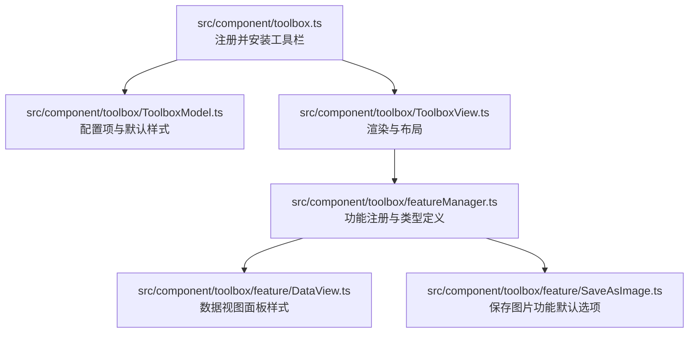
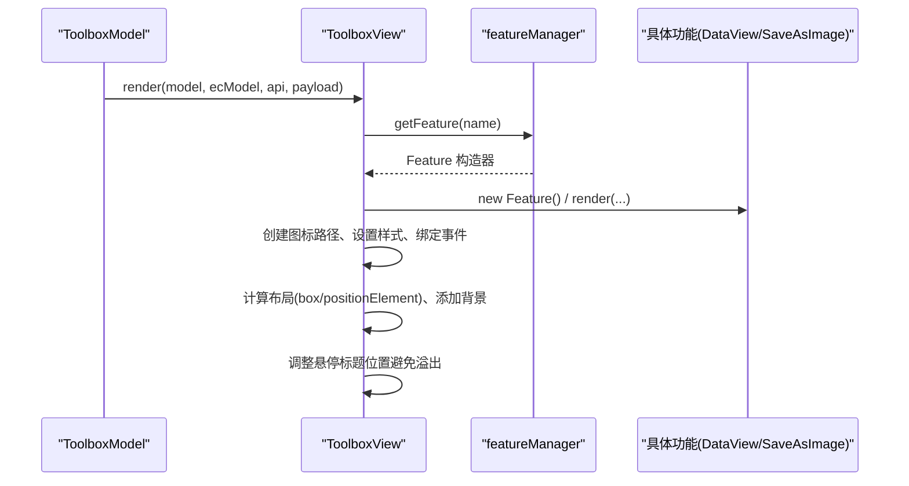
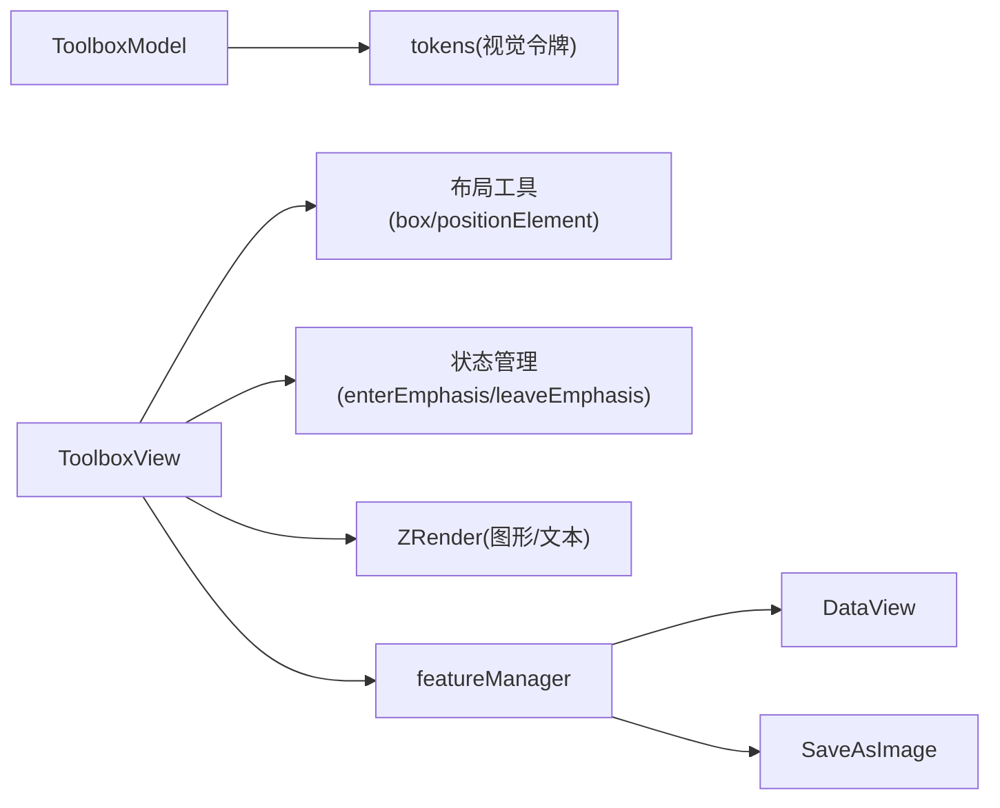

# 工具栏样式定制

<cite>
**本文引用的文件**
- [src/component/toolbox.ts](file://src/component/toolbox.ts)
- [src/component/toolbox/ToolboxModel.ts](file://src/component/toolbox/ToolboxModel.ts)
- [src/component/toolbox/ToolboxView.ts](file://src/component/toolbox/ToolboxView.ts)
- [src/component/toolbox/featureManager.ts](file://src/component/toolbox/featureManager.ts)
- [src/component/toolbox/feature/DataView.ts](file://src/component/toolbox/feature/DataView.ts)
- [src/component/toolbox/feature/SaveAsImage.ts](file://src/component/toolbox/feature/SaveAsImage.ts)
- [test/toolbox-custom.html](file://test/toolbox-custom.html)
- [test/toolbox-textStyle.html](file://test/toolbox-textStyle.html)
- [test/toolbox-title.html](file://test/toolbox-title.html)
</cite>

## 目录
1. [简介](#简介)
2. [项目结构](#项目结构)
3. [核心组件](#核心组件)
4. [架构总览](#架构总览)
5. [详细组件分析](#详细组件分析)
6. [依赖关系分析](#依赖关系分析)
7. [性能考量](#性能考量)
8. [故障排查指南](#故障排查指南)
9. [结论](#结论)
10. [附录：完整示例与最佳实践](#附录完整示例与最佳实践)

## 简介
本章节聚焦 ECharts 工具栏（toolbox）的样式定制能力，覆盖按钮样式、图标样式、分隔符间距、位置与布局、自定义按钮实现、交互效果、响应式布局、无障碍访问与键盘导航支持，以及主题适配方案。内容基于源码与测试用例进行归纳，帮助你在不修改源码的前提下完成高质量的工具栏视觉与交互定制。

## 项目结构
ECharts 工具栏由模型（Model）、视图（View）、功能管理器（featureManager）与各内置功能（如数据视图、保存图片等）组成。入口通过扩展机制注册并安装工具栏组件。

图表来源
- [src/component/toolbox.ts:20-23](file://src/component/toolbox.ts#L20-L23)
- [src/component/toolbox/ToolboxModel.ts:88-197](file://src/component/toolbox/ToolboxModel.ts#L88-L197)
- [src/component/toolbox/ToolboxView.ts:53-372](file://src/component/toolbox/ToolboxView.ts#L53-L372)
- [src/component/toolbox/featureManager.ts:19-123](file://src/component/toolbox/featureManager.ts#L19-L123)
- [src/component/toolbox/feature/DataView.ts:304-478](file://src/component/toolbox/feature/DataView.ts#L304-L478)
- [src/component/toolbox/feature/SaveAsImage.ts:120-148](file://src/component/toolbox/feature/SaveAsImage.ts#L120-L148)

章节来源
- [src/component/toolbox.ts:20-23](file://src/component/toolbox.ts#L20-L23)

## 核心组件
- 工具栏模型（ToolboxModel）
  - 提供工具栏的配置项与默认样式，包括显示开关、方向、背景、边框、圆角、内边距、图标尺寸、图标间距、标题显示、图标样式、强调态样式、文本样式、提示框配置等。
  - 默认值中引用了视觉令牌（tokens），便于主题化。
- 工具栏视图（ToolboxView）
  - 负责创建图标路径、绑定事件、计算布局与定位、生成背景、处理悬停时标题文本的位置调整，确保文本不溢出画布。
  - 使用 box 布局与 positionElement 将工具栏按 orient、left/right/top/bottom、padding、itemGap 等参数进行布局。
- 功能管理器（featureManager）
  - 定义工具栏功能的通用接口与类型，包含 icon/iconStyle/emphasis/iconStatus/title/show 等，并提供注册与获取功能构造器的能力。
- 内置功能
  - DataView：数据视图面板，支持背景色、文字色、输入区样式、按钮样式等。
  - SaveAsImage：保存图片功能，提供默认图标、标题、语言等默认选项。

章节来源
- [src/component/toolbox/ToolboxModel.ts:47-197](file://src/component/toolbox/ToolboxModel.ts#L47-L197)
- [src/component/toolbox/ToolboxView.ts:53-372](file://src/component/toolbox/ToolboxView.ts#L53-L372)
- [src/component/toolbox/featureManager.ts:28-123](file://src/component/toolbox/featureManager.ts#L28-L123)
- [src/component/toolbox/feature/DataView.ts:304-478](file://src/component/toolbox/feature/DataView.ts#L304-L478)
- [src/component/toolbox/feature/SaveAsImage.ts:120-148](file://src/component/toolbox/feature/SaveAsImage.ts#L120-L148)

## 架构总览
工具栏渲染流程从 Model 读取配置，到 View 构建图形元素并进行布局与事件绑定；功能模块按需渲染或更新视图。

图表来源
- [src/component/toolbox/ToolboxView.ts:66-372](file://src/component/toolbox/ToolboxView.ts#L66-L372)
- [src/component/toolbox/featureManager.ts:116-123](file://src/component/toolbox/featureManager.ts#L116-L123)
- [src/component/toolbox/feature/DataView.ts:319-478](file://src/component/toolbox/feature/DataView.ts#L319-L478)
- [src/component/toolbox/feature/SaveAsImage.ts:128-148](file://src/component/toolbox/feature/SaveAsImage.ts#L128-L148)

## 详细组件分析

### 工具栏按钮与图标样式
- 按钮容器与图标尺寸
  - itemSize：控制图标尺寸，影响图标路径的宽高与中心偏移。
  - itemGap：控制按钮之间的间距。
- 图标样式
  - iconStyle：基础图标样式，可设置描边颜色、填充等。
  - emphasis.iconStyle：强调态（悬停/聚焦）下的图标样式，支持 textFill/textBackgroundColor/textBorderRadius/textPadding/textPosition 等文本相关样式。
- 标题显示
  - showTitle：控制是否在悬停时显示标题文本。
  - title：可为字符串或字典，支持多图标时的不同标题。
- 文本样式
  - textStyle：工具栏文本样式（继承自 LabelOption）。
  - 悬停文本字体、对齐、背景、圆角、内边距等可通过 emphasis.iconStyle 中的 text* 属性配置。

参考实现要点
- 视图在创建图标路径时应用 iconStyle 与 emphasis.iconStyle，并为每个图标创建文本内容以展示标题。
- 悬停时根据工具栏方向与位置自动选择标题文本的默认位置，避免溢出画布。

章节来源
- [src/component/toolbox/ToolboxModel.ts:66-86](file://src/component/toolbox/ToolboxModel.ts#L66-L86)
- [src/component/toolbox/ToolboxModel.ts:143-193](file://src/component/toolbox/ToolboxModel.ts#L143-L193)
- [src/component/toolbox/ToolboxView.ts:181-308](file://src/component/toolbox/ToolboxView.ts#L181-L308)
- [src/component/toolbox/ToolboxView.ts:337-371](file://src/component/toolbox/ToolboxView.ts#L337-L371)

### 分隔符样式
- 工具栏未提供独立的“分隔符”样式配置项。
- 可通过 itemGap 控制按钮间距，达到类似分隔的效果。
- 若需更复杂的分隔线，可在业务层通过自定义功能或叠加图形元素实现。

章节来源
- [src/component/toolbox/ToolboxModel.ts:68-69](file://src/component/toolbox/ToolboxModel.ts#L68-L69)
- [src/component/toolbox/ToolboxModel.ts:171-172](file://src/component/toolbox/ToolboxModel.ts#L171-L172)
- [src/component/toolbox/ToolboxView.ts:319-325](file://src/component/toolbox/ToolboxView.ts#L319-L325)

### 工具栏位置、尺寸与布局
- 位置
  - left/right/top/bottom：支持数值或关键字（如 'right'/'top'）。
  - padding：工具栏整体内边距。
- 布局
  - orient：'horizontal' 或 'vertical'，决定按钮排列方向。
  - itemGap：按钮间距。
  - backgroundColor/borderColor/borderRadius/borderWidth：背景与边框样式。
- 布局算法
  - 使用 box 布局函数与 positionElement 进行定位与排列。
  - 背景在布局完成后绘制，确保覆盖正确区域。

章节来源
- [src/component/toolbox/ToolboxModel.ts:56-86](file://src/component/toolbox/ToolboxModel.ts#L56-L86)
- [src/component/toolbox/ToolboxModel.ts:143-193](file://src/component/toolbox/ToolboxModel.ts#L143-L193)
- [src/component/toolbox/ToolboxView.ts:311-335](file://src/component/toolbox/ToolboxView.ts#L311-L335)

### 自定义工具按钮的样式实现
- 自定义按钮命名约定
  - 以 'my' 开头的功能名被视为用户自定义按钮。
- 自定义按钮配置
  - show：是否显示。
  - title：按钮标题。
  - icon：SVG path 或 image URL。
  - onclick：点击回调。
- 样式定制
  - 通过 feature.myXxx.iconStyle 与 emphasis.iconStyle 定制图标与悬停文本样式。
  - 可使用 textFill/textBackgroundColor/textBorderRadius/textPadding/textPosition 等属性。
- 交互效果
  - 视图为每个图标绑定 click 事件，调用对应功能的 onclick。
  - 悬停时进入强调态，离开时恢复。

章节来源
- [src/component/toolbox/ToolboxView.ts:118-179](file://src/component/toolbox/ToolboxView.ts#L118-L179)
- [src/component/toolbox/ToolboxView.ts:399-401](file://src/component/toolbox/ToolboxView.ts#L399-L401)
- [test/toolbox-custom.html:48-75](file://test/toolbox-custom.html#L48-L75)
- [test/toolbox-custom.html:121-141](file://test/toolbox-custom.html#L121-L141)

### 高级用法：自定义图标、交互效果、响应式布局
- 自定义图标
  - 使用 SVG path 或 base64 图片作为 icon。
  - 多图标场景下，icon 可为字典，分别指定不同图标的标识。
- 交互效果
  - 通过 emphasis.iconStyle 设置悬停状态下的文本与图标样式。
  - 使用 setIconStatus 动态切换图标状态（如激活/非激活）。
- 响应式布局
  - 结合 orient、left/right/top/bottom、padding、itemGap 实现不同屏幕下的自适应布局。
  - 悬停标题文本会根据工具栏位置自动调整以避免溢出。

章节来源
- [src/component/toolbox/ToolboxView.ts:220-308](file://src/component/toolbox/ToolboxView.ts#L220-L308)
- [src/component/toolbox/ToolboxView.ts:337-371](file://src/component/toolbox/ToolboxView.ts#L337-L371)
- [test/toolbox-custom.html:48-75](file://test/toolbox-custom.html#L48-L75)
- [test/toolbox-title.html:57-84](file://test/toolbox-title.html#L57-L84)
- [test/toolbox-title.html:91-120](file://test/toolbox-title.html#L91-L120)
- [test/toolbox-title.html:127-158](file://test/toolbox-title.html#L127-L158)
- [test/toolbox-title.html:165-194](file://test/toolbox-title.html#L165-L194)

### 无障碍访问与键盘导航的样式支持
- 工具栏按钮具备标准的鼠标事件（mouseover/mouseout/click），可用于触发强调态与交互。
- 文本样式支持通过 emphasis.iconStyle 的 text* 属性进行高对比度与可读性优化。
- 如需完整的键盘导航与无障碍语义，建议在业务层为自定义按钮补充 tabindex、aria-* 属性与键盘事件处理。

章节来源
- [src/component/toolbox/ToolboxView.ts:266-305](file://src/component/toolbox/ToolboxView.ts#L266-L305)
- [src/component/toolbox/featureManager.ts:28-57](file://src/component/toolbox/featureManager.ts#L28-L57)

### 工具栏主题适配方案
- 默认样式引用 tokens（颜色、尺寸等），便于主题统一。
- 可通过全局 theme 的 toolbox.feature 对内置功能（如 dataView）进行主题化覆盖。
- 各功能提供 getDefaultOption，返回与当前 locale 和 tokens 一致的默认值。

章节来源
- [src/component/toolbox/ToolboxModel.ts:143-193](file://src/component/toolbox/ToolboxModel.ts#L143-L193)
- [src/component/toolbox/feature/DataView.ts:454-474](file://src/component/toolbox/feature/DataView.ts#L454-L474)
- [src/component/toolbox/feature/SaveAsImage.ts:128-148](file://src/component/toolbox/feature/SaveAsImage.ts#L128-L148)
- [test/toolbox-custom.html:105-119](file://test/toolbox-custom.html#L105-L119)
- [test/toolbox-custom.html:238-252](file://test/toolbox-custom.html#L238-L252)

## 依赖关系分析
工具栏组件依赖以下模块与能力：
- ZRender 图形与文本能力（用于创建图标与文本内容）
- 布局工具（box、positionElement、getLayoutRect）
- 状态管理（enterEmphasis/leaveEmphasis）
- 视觉令牌（tokens）用于主题化
- 功能管理器（featureManager）用于注册与获取功能构造器

图表来源
- [src/component/toolbox/ToolboxModel.ts:143-193](file://src/component/toolbox/ToolboxModel.ts#L143-L193)
- [src/component/toolbox/ToolboxView.ts:20-44](file://src/component/toolbox/ToolboxView.ts#L20-L44)
- [src/component/toolbox/ToolboxView.ts:311-335](file://src/component/toolbox/ToolboxView.ts#L311-L335)
- [src/component/toolbox/featureManager.ts:116-123](file://src/component/toolbox/featureManager.ts#L116-L123)

章节来源
- [src/component/toolbox/ToolboxView.ts:20-44](file://src/component/toolbox/ToolboxView.ts#L20-L44)
- [src/component/toolbox/featureManager.ts:19-123](file://src/component/toolbox/featureManager.ts#L19-L123)

## 性能考量
- 图标与文本创建仅在渲染阶段执行，且通过 DataDiffer 进行增量更新，减少不必要的重绘。
- 悬停标题文本的计算与位置调整发生在渲染后期，避免多次布局抖动。
- 背景绘制在布局完成后进行，确保覆盖范围正确。
- 建议合理设置 itemGap 与 itemSize，避免过多按钮导致布局复杂度过高。

章节来源
- [src/component/toolbox/ToolboxView.ts:86-96](file://src/component/toolbox/ToolboxView.ts#L86-L96)
- [src/component/toolbox/ToolboxView.ts:311-335](file://src/component/toolbox/ToolboxView.ts#L311-L335)
- [src/component/toolbox/ToolboxView.ts:337-371](file://src/component/toolbox/ToolboxView.ts#L337-L371)

## 故障排查指南
- 按钮不显示
  - 检查 feature.myXxx.show 是否为 true。
  - 确认 icon 路径或图片有效。
- 悬停标题溢出画布
  - 视图会自动调整标题位置；若仍溢出，检查工具栏位置（left/right/top/bottom）与 orient。
- 主题未生效
  - 确认 theme.toolbox.feature 配置是否正确合并。
  - 检查功能默认选项是否被覆盖。
- 自定义按钮无交互
  - 确认 onclick 已正确绑定。
  - 检查事件冒泡与遮罩层是否拦截事件。

章节来源
- [src/component/toolbox/ToolboxView.ts:118-179](file://src/component/toolbox/ToolboxView.ts#L118-L179)
- [src/component/toolbox/ToolboxView.ts:266-308](file://src/component/toolbox/ToolboxView.ts#L266-L308)
- [src/component/toolbox/ToolboxView.ts:337-371](file://src/component/toolbox/ToolboxView.ts#L337-L371)
- [test/toolbox-custom.html:105-119](file://test/toolbox-custom.html#L105-L119)

## 结论
ECharts 工具栏提供了完善的样式定制能力，涵盖按钮与图标样式、布局与位置、自定义按钮与交互、主题适配等。通过合理的配置与视图逻辑，可实现美观、易用且可访问的工具栏体验。对于更复杂的分隔符或交互需求，可在业务层通过自定义功能扩展。

## 附录：完整示例与最佳实践
- 自定义按钮与图标
  - 使用 myXxx 命名定义自定义按钮，配置 icon、title、onclick。
  - 参考示例：[test/toolbox-custom.html:48-75](file://test/toolbox-custom.html#L48-L75)、[test/toolbox-custom.html:121-141](file://test/toolbox-custom.html#L121-L141)
- 文本样式与悬停效果
  - 通过 emphasis.iconStyle 的 text* 属性设置悬停文本样式。
  - 参考示例：[test/toolbox-textStyle.html:38-67](file://test/toolbox-textStyle.html#L38-L67)
- 标题位置与布局
  - 使用 orient、left/right/top/bottom、padding、itemGap 控制布局。
  - 参考示例：[test/toolbox-title.html:57-84](file://test/toolbox-title.html#L57-L84)、[test/toolbox-title.html:91-120](file://test/toolbox-title.html#L91-L120)、[test/toolbox-title.html:127-158](file://test/toolbox-title.html#L127-L158)、[test/toolbox-title.html:165-194](file://test/toolbox-title.html#L165-L194)
- 主题适配
  - 在 theme.toolbox.feature 中覆盖内置功能样式（如 dataView）。
  - 参考示例：[test/toolbox-custom.html:105-119](file://test/toolbox-custom.html#L105-L119)、[test/toolbox-custom.html:238-252](file://test/toolbox-custom.html#L238-L252)