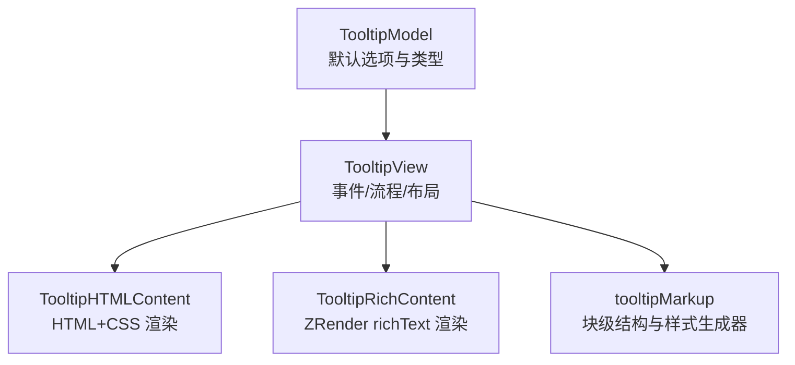
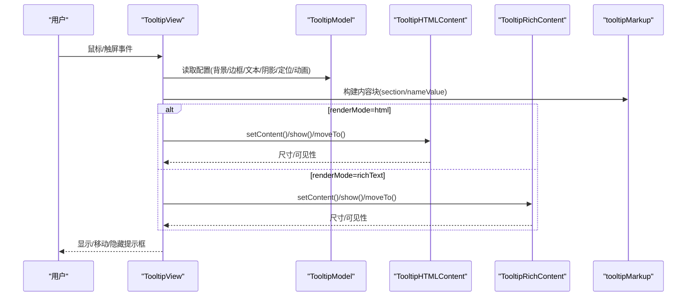
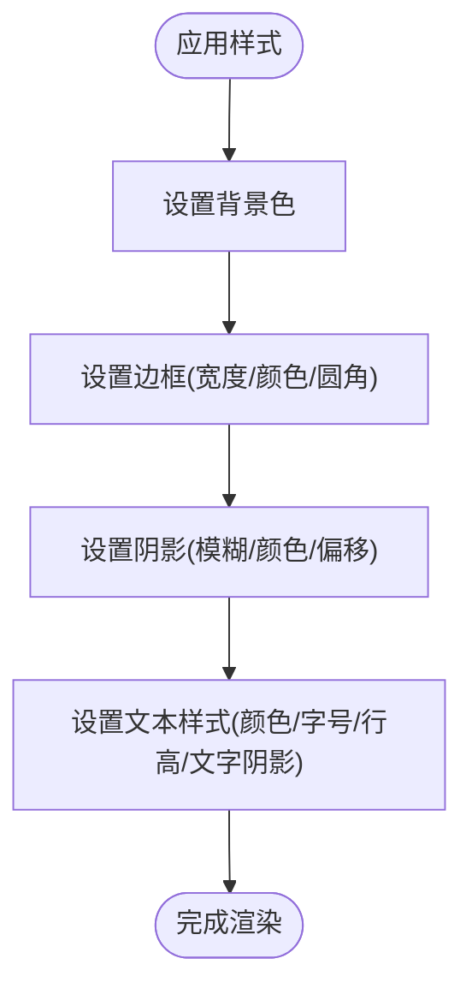
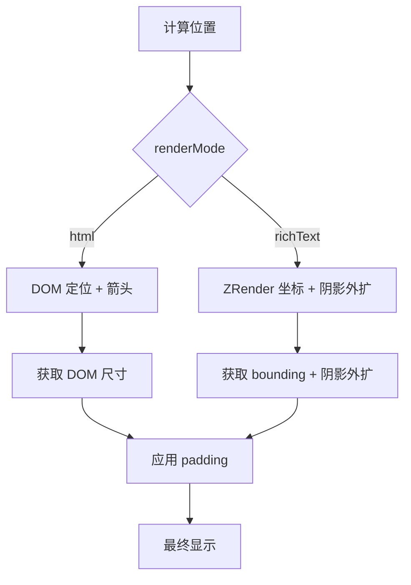
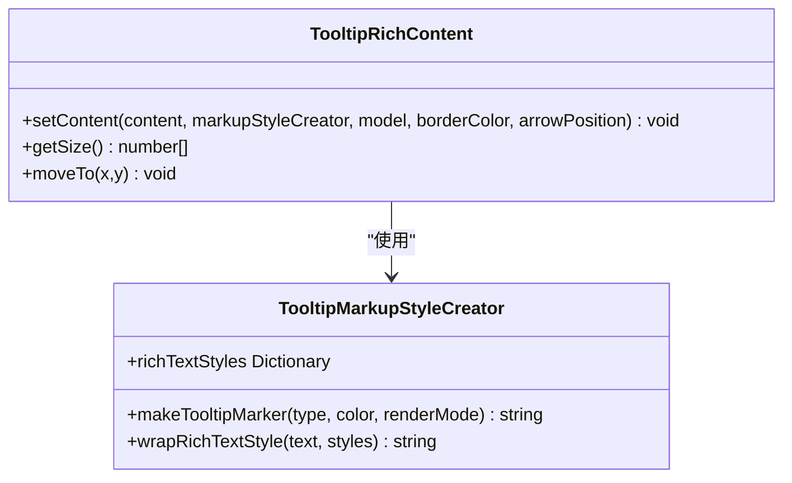
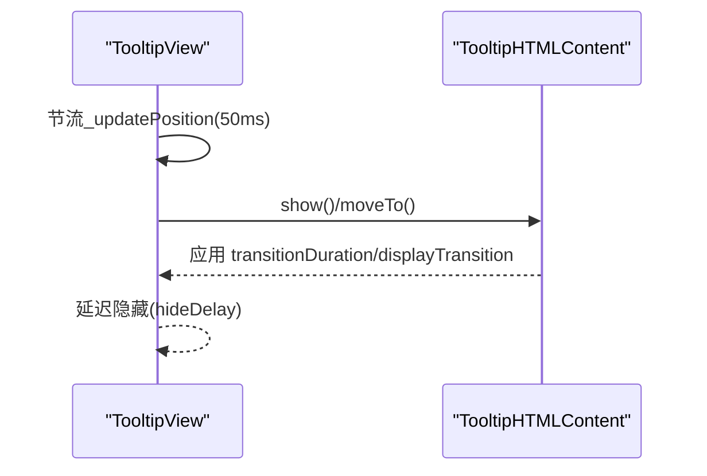
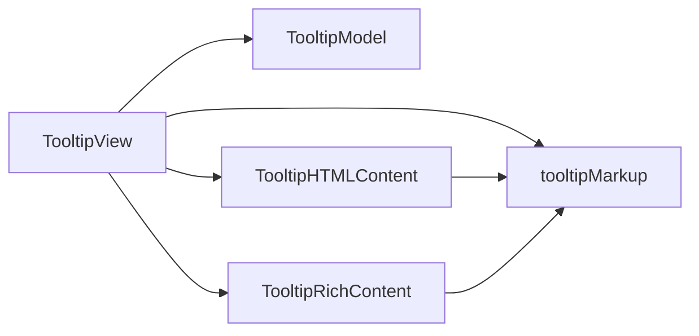

# 提示框样式定制

<cite>
**本文引用的文件**
- [TooltipModel.ts](file://src/component/tooltip/TooltipModel.ts)
- [TooltipView.ts](file://src/component/tooltip/TooltipView.ts)
- [TooltipHTMLContent.ts](file://src/component/tooltip/TooltipHTMLContent.ts)
- [TooltipRichContent.ts](file://src/component/tooltip/TooltipRichContent.ts)
- [tooltipMarkup.ts](file://src/component/tooltip/tooltipMarkup.ts)
- [tooltip-rich.html](file://test/tooltip-rich.html)
- [tooltip-textStyle.html](file://test/tooltip-textStyle.html)
- [tooltip-touch.html](file://test/tooltip-touch.html)
</cite>

## 目录
1. [简介](#简介)
2. [项目结构](#项目结构)
3. [核心组件](#核心组件)
4. [架构总览](#架构总览)
5. [详细组件分析](#详细组件分析)
6. [依赖关系分析](#依赖关系分析)
7. [性能考量](#性能考量)
8. [故障排查指南](#故障排查指南)
9. [结论](#结论)
10. [附录：完整示例与最佳实践](#附录完整示例与最佳实践)

## 简介
本章节聚焦 ECharts 提示框（tooltip）的样式定制能力，系统说明背景、边框、文本、阴影等视觉属性的配置方式；解释定位、尺寸、边距的设置选项；阐述富文本提示框的样式定制方法；并提供完整的示例路径，涵盖自定义模板、动态样式、动画效果以及移动端触摸优化与跨浏览器兼容性处理。

## 项目结构
ECharts 的 tooltip 由模型、视图与渲染内容三部分组成：
- 模型层：定义默认选项与类型约束（如 renderMode、backgroundColor、borderWidth、shadow*、textStyle、padding、position、confine、transitionDuration、displayTransition、enterable、order 等）。
- 视图层：负责事件监听、数据组装、位置计算与显示/隐藏流程控制。
- 渲染内容层：根据 renderMode 选择 HTML 或 richText 两种渲染后端，分别实现 DOM/CSS 或 ZRender 图形绘制。

**图表来源**
- [TooltipModel.ts:94-187](file://src/component/tooltip/TooltipModel.ts#L94-L187)
- [TooltipView.ts:164-217](file://src/component/tooltip/TooltipView.ts#L164-L217)
- [TooltipHTMLContent.ts:270-431](file://src/component/tooltip/TooltipHTMLContent.ts#L270-L431)
- [TooltipRichContent.ts:30-139](file://src/component/tooltip/TooltipRichContent.ts#L30-L139)
- [tooltipMarkup.ts:136-411](file://src/component/tooltip/tooltipMarkup.ts#L136-L411)

**章节来源**
- [TooltipModel.ts:94-187](file://src/component/tooltip/TooltipModel.ts#L94-L187)
- [TooltipView.ts:164-217](file://src/component/tooltip/TooltipView.ts#L164-L217)

## 核心组件
- TooltipModel：集中声明 tooltip 的默认样式与行为，包括背景、边框、阴影、文本样式、内边距、定位策略、过渡动画、可进入性、排序模式等。
- TooltipView：统一调度 show/hide、更新内容、计算位置、节流更新、保持显示等逻辑，并桥接 HTML/richText 渲染器。
- TooltipHTMLContent：基于 DOM + CSS 的提示框实现，支持箭头、box-shadow、transition、pointer-events 等。
- TooltipRichContent：基于 ZRender 的 richText 提示框，支持 rich 文本样式、阴影尺寸精确计算、z-index 控制等。
- tooltipMarkup：抽象构建 tooltip 内容块（section/nameValue），提供样式创建器（TooltipMarkupStyleCreator）以生成 richText 样式映射和标记。

**章节来源**
- [TooltipModel.ts:94-187](file://src/component/tooltip/TooltipModel.ts#L94-L187)
- [TooltipView.ts:164-217](file://src/component/tooltip/TooltipView.ts#L164-L217)
- [TooltipHTMLContent.ts:270-431](file://src/component/tooltip/TooltipHTMLContent.ts#L270-L431)
- [TooltipRichContent.ts:30-139](file://src/component/tooltip/TooltipRichContent.ts#L30-L139)
- [tooltipMarkup.ts:136-411](file://src/component/tooltip/tooltipMarkup.ts#L136-L411)

## 架构总览
下图展示了 tooltip 从触发到渲染的调用链与数据流：

**图表来源**
- [TooltipView.ts:517-657](file://src/component/tooltip/TooltipView.ts#L517-L657)
- [TooltipHTMLContent.ts:404-500](file://src/component/tooltip/TooltipHTMLContent.ts#L404-L500)
- [TooltipRichContent.ts:66-172](file://src/component/tooltip/TooltipRichContent.ts#L66-L172)
- [tooltipMarkup.ts:390-411](file://src/component/tooltip/tooltipMarkup.ts#L390-L411)

## 详细组件分析

### 背景、边框、阴影与文本样式
- 背景色：通过 backgroundColor 设置，HTML 模式下使用 background-color，richText 模式直接映射到样式属性。
- 边框：支持 borderWidth、borderColor、borderRadius；HTML 模式通过 border-* 样式注入，richText 模式映射为对应样式字段。
- 阴影：支持 shadowBlur、shadowColor、shadowOffsetX、shadowOffsetY；HTML 模式使用 box-shadow，richText 模式计算外部尺寸以正确布局。
- 文本样式：textStyle.color/fontSize/fontWeight/lineHeight/textShadow* 等；HTML 模式通过 font 与 text-shadow 注入，richText 模式映射到 ZRender Text 样式。

**图表来源**
- [TooltipModel.ts:131-150](file://src/component/tooltip/TooltipModel.ts#L131-L150)
- [TooltipHTMLContent.ts:182-226](file://src/component/tooltip/TooltipHTMLContent.ts#L182-L226)
- [TooltipRichContent.ts:92-118](file://src/component/tooltip/TooltipRichContent.ts#L92-L118)
- [tooltipMarkup.ts:46-95](file://src/component/tooltip/tooltipMarkup.ts#L46-L95)

**章节来源**
- [TooltipModel.ts:131-150](file://src/component/tooltip/TooltipModel.ts#L131-L150)
- [TooltipHTMLContent.ts:182-226](file://src/component/tooltip/TooltipHTMLContent.ts#L182-L226)
- [TooltipRichContent.ts:92-118](file://src/component/tooltip/TooltipRichContent.ts#L92-L118)
- [tooltipMarkup.ts:46-95](file://src/component/tooltip/tooltipMarkup.ts#L46-L95)

### 定位、尺寸与边距
- 定位：position 可为字符串（如 'top'/'bottom'/'left'/'right'/'inside'）或函数；confine 控制是否限制在可视区域；appendTo/appendToBody 控制 DOM 挂载容器（仅 html 模式）。
- 尺寸：getSize 返回提示框宽高；richText 模式会考虑阴影外扩尺寸，避免溢出裁剪。
- 边距：padding 支持数字或数组；不同渲染模式有默认值差异（richText 更紧凑）。

**图表来源**
- [TooltipView.ts:517-657](file://src/component/tooltip/TooltipView.ts#L517-L657)
- [TooltipHTMLContent.ts:481-515](file://src/component/tooltip/TooltipHTMLContent.ts#L481-L515)
- [TooltipRichContent.ts:145-172](file://src/component/tooltip/TooltipRichContent.ts#L145-L172)
- [tooltipMarkup.ts:497-508](file://src/component/tooltip/tooltipMarkup.ts#L497-L508)

**章节来源**
- [TooltipView.ts:517-657](file://src/component/tooltip/TooltipView.ts#L517-L657)
- [TooltipHTMLContent.ts:481-515](file://src/component/tooltip/TooltipHTMLContent.ts#L481-L515)
- [TooltipRichContent.ts:145-172](file://src/component/tooltip/TooltipRichContent.ts#L145-L172)
- [tooltipMarkup.ts:497-508](file://src/component/tooltip/tooltipMarkup.ts#L497-L508)

### 富文本提示框样式定制
- richText 模式使用 ZRender 的 Text 组件，支持 rich 文本样式映射；可通过 TooltipMarkupStyleCreator 生成样式名并绑定到 rich 文本片段。
- 标记（marker）样式由样式创建器统一管理，确保在不同渲染模式下一致。
- 文本阴影、边框、背景、圆角等均可通过 tooltip 配置项映射到 richText 样式。

**图表来源**
- [tooltipMarkup.ts:515-581](file://src/component/tooltip/tooltipMarkup.ts#L515-L581)
- [TooltipRichContent.ts:78-139](file://src/component/tooltip/TooltipRichContent.ts#L78-L139)

**章节来源**
- [tooltipMarkup.ts:515-581](file://src/component/tooltip/tooltipMarkup.ts#L515-L581)
- [TooltipRichContent.ts:78-139](file://src/component/tooltip/TooltipRichContent.ts#L78-L139)

### 动画与交互
- 过渡动画：transitionDuration 控制显示/移动的过渡时长；displayTransition 控制淡入淡出与位移动画；HTML 模式通过 CSS transition 实现。
- 可进入性：enterable 控制是否允许鼠标进入提示框内容；配合 showDelay/hideDelay 提升交互体验。
- 节流更新：mousemove 高频场景下对 _updatePosition 进行节流，避免抖动。

**图表来源**
- [TooltipView.ts:206-217](file://src/component/tooltip/TooltipView.ts#L206-L217)
- [TooltipHTMLContent.ts:106-124](file://src/component/tooltip/TooltipHTMLContent.ts#L106-L124)
- [TooltipHTMLContent.ts:517-543](file://src/component/tooltip/TooltipHTMLContent.ts#L517-L543)

**章节来源**
- [TooltipView.ts:206-217](file://src/component/tooltip/TooltipView.ts#L206-L217)
- [TooltipHTMLContent.ts:106-124](file://src/component/tooltip/TooltipHTMLContent.ts#L106-L124)
- [TooltipHTMLContent.ts:517-543](file://src/component/tooltip/TooltipHTMLContent.ts#L517-L543)

## 依赖关系分析
- TooltipView 依赖 TooltipModel 获取配置，依赖 tooltipMarkup 构建内容块，依赖具体渲染器（HTML/richText）完成显示。
- TooltipHTMLContent 依赖 helper 中的样式前缀与 computed style 工具，依赖 tooltipMarkup 的 padding 计算。
- TooltipRichContent 依赖 ZRender 的 Text 组件与 tooltipMarkup 的样式创建器。

**图表来源**
- [TooltipView.ts:164-217](file://src/component/tooltip/TooltipView.ts#L164-L217)
- [TooltipHTMLContent.ts:270-431](file://src/component/tooltip/TooltipHTMLContent.ts#L270-L431)
- [TooltipRichContent.ts:30-139](file://src/component/tooltip/TooltipRichContent.ts#L30-L139)
- [tooltipMarkup.ts:136-411](file://src/component/tooltip/tooltipMarkup.ts#L136-L411)

**章节来源**
- [TooltipView.ts:164-217](file://src/component/tooltip/TooltipView.ts#L164-L217)
- [TooltipHTMLContent.ts:270-431](file://src/component/tooltip/TooltipHTMLContent.ts#L270-L431)
- [TooltipRichContent.ts:30-139](file://src/component/tooltip/TooltipRichContent.ts#L30-L139)
- [tooltipMarkup.ts:136-411](file://src/component/tooltip/tooltipMarkup.ts#L136-L411)

## 性能考量
- 高频移动时的节流：在 HTML 模式且启用过渡时，_updatePosition 被节流至 50ms，减少重绘抖动。
- 尺寸计算：richText 模式在 getSize 中考虑阴影外扩，避免裁剪导致的布局误差。
- 动画开销：transitionDuration 与 displayTransition 会影响性能，建议在大数据量或低端设备上谨慎使用。

[本节为通用性能建议，不直接分析具体文件]

## 故障排查指南
- 提示框不显示：检查 renderMode 与 appendTo/appendToBody 配置；确认 DOM 容器存在且可访问。
- 样式未生效：确认 textStyle 与 tooltip 顶层样式优先级；HTML 模式下注意 extraCssText 覆盖顺序。
- 富文本错位：检查 padding 与阴影参数；richText 模式需考虑阴影外扩尺寸。
- 移动端触摸异常：参考测试用例中的 position 回调与 triggerOn 配置，避免遮挡与误触。

**章节来源**
- [TooltipHTMLContent.ts:374-431](file://src/component/tooltip/TooltipHTMLContent.ts#L374-L431)
- [TooltipRichContent.ts:145-172](file://src/component/tooltip/TooltipRichContent.ts#L145-L172)
- [tooltip-touch.html:373-378](file://test/tooltip-touch.html#L373-L378)

## 结论
ECharts 的 tooltip 提供了完善的样式定制能力，覆盖背景、边框、文本、阴影、定位、尺寸、边距与动画等关键维度。通过 renderMode 切换 HTML 与 richText 渲染后端，既能满足复杂富文本需求，也能兼顾兼容性与性能。结合示例与最佳实践，可在多端与多浏览器环境下获得一致的交互体验。

[本节为总结性内容，不直接分析具体文件]

## 附录：完整示例与最佳实践

### 示例索引
- 富文本提示框示例：[tooltip-rich.html](file://test/tooltip-rich.html)
- 文本样式与阴影示例：[tooltip-textStyle.html](file://test/tooltip-textStyle.html)
- 移动端触摸与定位优化示例：[tooltip-touch.html](file://test/tooltip-touch.html)

### 常用配置要点
- 背景与边框：backgroundColor、borderWidth、borderColor、borderRadius
- 阴影：shadowBlur、shadowColor、shadowOffsetX、shadowOffsetY
- 文本样式：textStyle.color、fontSize、fontWeight、lineHeight、textShadow*
- 定位与尺寸：position、confine、padding、className、extraCssText
- 动画与交互：transitionDuration、displayTransition、enterable、showDelay、hideDelay
- 渲染模式：renderMode='html'|'richText'；appendTo/appendToBody（仅 html）

### 高级用法
- 自定义模板：通过 formatter 或 createTooltipMarkup 构建 section/nameValue 块，结合 valueFormatter 格式化数值。
- 动态样式：在运行时修改 tooltip 配置（如 setOption），或使用 extraCssText 注入额外样式。
- 动画效果：合理设置 transitionDuration 与 displayTransition，避免过度动画影响性能。
- 移动端优化：使用 position 回调固定或调整提示框位置；结合 triggerOn 控制触发时机；必要时使用 richText 模式以获得更稳定的布局。

**章节来源**
- [tooltip-rich.html:53-62](file://test/tooltip-rich.html#L53-L62)
- [tooltip-textStyle.html:72-85](file://test/tooltip-textStyle.html#L72-L85)
- [tooltip-touch.html:373-378](file://test/tooltip-touch.html#L373-L378)
- [TooltipModel.ts:94-187](file://src/component/tooltip/TooltipModel.ts#L94-L187)
- [TooltipView.ts:517-657](file://src/component/tooltip/TooltipView.ts#L517-L657)
- [TooltipHTMLContent.ts:182-226](file://src/component/tooltip/TooltipHTMLContent.ts#L182-L226)
- [TooltipRichContent.ts:92-118](file://src/component/tooltip/TooltipRichContent.ts#L92-L118)
- [tooltipMarkup.ts:136-411](file://src/component/tooltip/tooltipMarkup.ts#L136-L411)