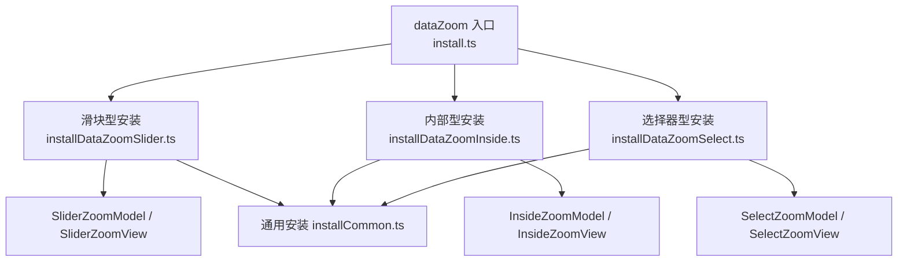
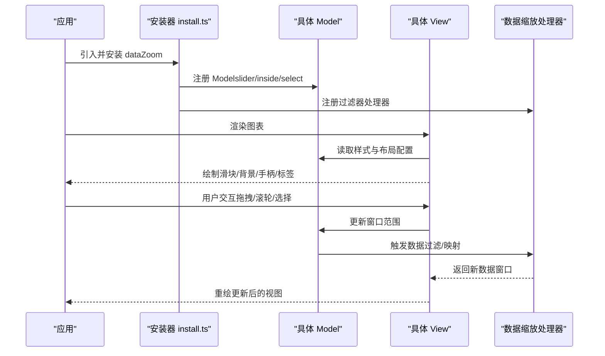
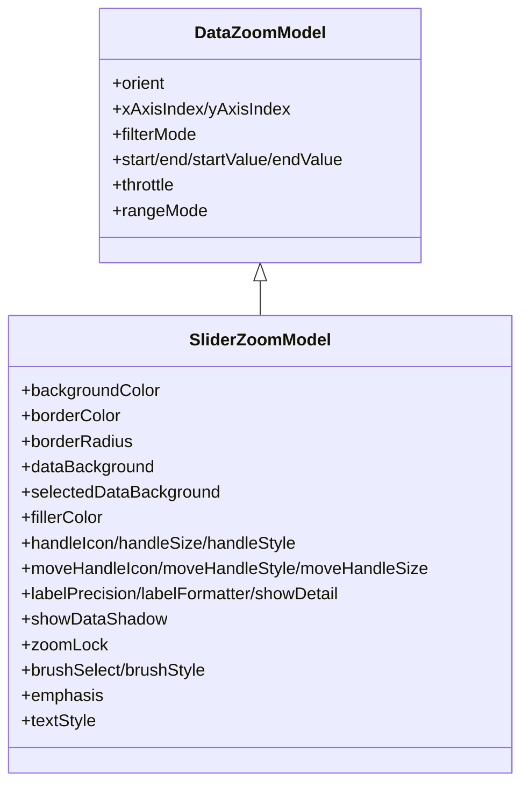
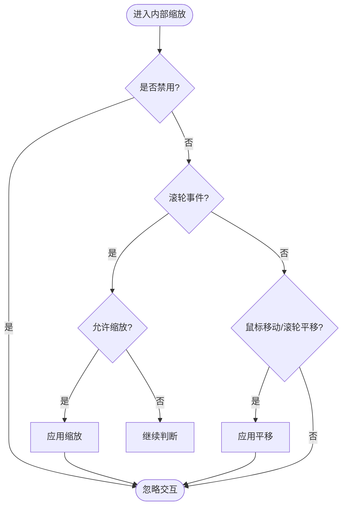
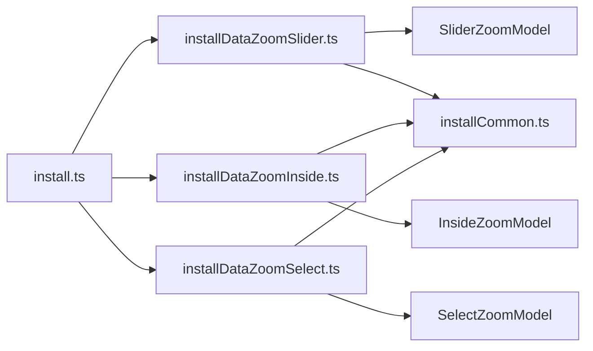

# 数据缩放样式定制

<cite>
**本文引用的文件**
- [src/component/dataZoom.ts](file://src/component/dataZoom.ts)
- [src/component/dataZoomSlider.ts](file://src/component/dataZoomSlider.ts)
- [src/component/dataZoomInside.ts](file://src/component/dataZoomInside.ts)
- [src/component/dataZoomSelect.ts](file://src/component/dataZoomSelect.ts)
- [src/component/dataZoom/install.ts](file://src/component/dataZoom/install.ts)
- [src/component/dataZoom/installDataZoomSlider.ts](file://src/component/dataZoom/installDataZoomSlider.ts)
- [src/component/dataZoom/installDataZoomInside.ts](file://src/component/dataZoom/installDataZoomInside.ts)
- [src/component/dataZoom/installDataZoomSelect.ts](file://src/component/dataZoom/installDataZoomSelect.ts)
- [src/component/dataZoom/DataZoomModel.ts](file://src/component/dataZoom/DataZoomModel.ts)
- [src/component/dataZoom/SliderZoomModel.ts](file://src/component/dataZoom/SliderZoomModel.ts)
- [src/component/dataZoom/InsideZoomModel.ts](file://src/component/dataZoom/InsideZoomModel.ts)
- [src/component/dataZoom/SelectZoomModel.ts](file://src/component/dataZoom/SelectZoomModel.ts)
- [src/component/dataZoom/installCommon.ts](file://src/component/dataZoom/installCommon.ts)
</cite>

## 目录
1. [简介](#简介)
2. [项目结构](#项目结构)
3. [核心组件](#核心组件)
4. [架构总览](#架构总览)
5. [详细组件分析](#详细组件分析)
6. [依赖关系分析](#依赖关系分析)
7. [性能考虑](#性能考虑)
8. [故障排查指南](#故障排查指南)
9. [结论](#结论)
10. [附录](#附录)

## 简介
本章节聚焦 ECharts 数据缩放（dataZoom）组件的样式定制能力，围绕滑块样式、手柄样式、背景样式、标签样式等展开说明，并解释位置、尺寸与布局设置。同时对比三种类型：滑块型（slider）、内部型（inside）、选择器型（select）在样式上的差异，并提供高级用法思路与移动端触摸交互优化建议。

## 项目结构
ECharts 的数据缩放由统一的入口安装模块聚合三类子组件：滑块型、内部型、选择器型。各类型通过独立的 Model/View 注册到扩展系统，共享通用处理器与动作。

图表来源
- [src/component/dataZoom/install.ts:20-31](file://src/component/dataZoom/install.ts#L20-L31)
- [src/component/dataZoom/installDataZoomSlider.ts:20-31](file://src/component/dataZoom/installDataZoomSlider.ts#L20-L31)
- [src/component/dataZoom/installDataZoomInside.ts:20-34](file://src/component/dataZoom/installDataZoomInside.ts#L20-L34)
- [src/component/dataZoom/installDataZoomSelect.ts:20-31](file://src/component/dataZoom/installDataZoomSelect.ts#L20-L31)
- [src/component/dataZoom/installCommon.ts:27-39](file://src/component/dataZoom/installCommon.ts#L27-L39)

章节来源
- [src/component/dataZoom/install.ts:20-31](file://src/component/dataZoom/install.ts#L20-L31)
- [src/component/dataZoom/installDataZoomSlider.ts:20-31](file://src/component/dataZoom/installDataZoomSlider.ts#L20-L31)
- [src/component/dataZoom/installDataZoomInside.ts:20-34](file://src/component/dataZoom/installDataZoomInside.ts#L20-L34)
- [src/component/dataZoom/installDataZoomSelect.ts:20-31](file://src/component/dataZoom/installDataZoomSelect.ts#L20-L31)
- [src/component/dataZoom/installCommon.ts:27-39](file://src/component/dataZoom/installCommon.ts#L27-L39)

## 核心组件
- 基础模型 DataZoomModel：定义通用配置项（如方向 orient、目标轴 xAxisIndex/yAxisIndex、过滤模式 filterMode、范围 start/end/startValue/endValue、节流 throttle、rangeMode 等），以及默认值与初始化逻辑。
- 滑块型 SliderZoomModel：在基础模型之上增加外观相关配置（背景、边框、圆角、填充色、手柄图标与样式、移动手柄、数据阴影、标签精度与格式化、强调态等）。
- 内部型 InsideZoomModel：侧重交互行为（禁用、滚轮缩放、鼠标移动平移、光标样式等），不包含文本样式 textStyle。
- 选择器型 SelectZoomModel：用于工具栏选择区域进行缩放，无额外外观字段。

章节来源
- [src/component/dataZoom/DataZoomModel.ts:39-131](file://src/component/dataZoom/DataZoomModel.ts#L39-L131)
- [src/component/dataZoom/DataZoomModel.ts:149-166](file://src/component/dataZoom/DataZoomModel.ts#L149-L166)
- [src/component/dataZoom/SliderZoomModel.ts:38-145](file://src/component/dataZoom/SliderZoomModel.ts#L38-L145)
- [src/component/dataZoom/InsideZoomModel.ts:23-53](file://src/component/dataZoom/InsideZoomModel.ts#L23-L53)
- [src/component/dataZoom/SelectZoomModel.ts:22-25](file://src/component/dataZoom/SelectZoomModel.ts#L22-L25)

## 架构总览
数据缩放组件通过“安装器”将不同子类型的 Model/View 注册到 ECharts 扩展系统，并统一注册过滤器处理器与 action。渲染时由 View 读取对应 Model 的配置生成图形元素；交互事件驱动 Model 更新窗口范围，再触发视图重绘。

图表来源
- [src/component/dataZoom/install.ts:20-31](file://src/component/dataZoom/install.ts#L20-L31)
- [src/component/dataZoom/installCommon.ts:27-39](file://src/component/dataZoom/installCommon.ts#L27-L39)

## 详细组件分析

### 滑块型（slider）样式定制
- 背景与边框
  - backgroundColor：滑块组件背景色
  - borderColor：边框颜色
  - borderRadius：圆角
- 数据背景与选中区
  - dataBackground.lineStyle/areaStyle：非选中区域的数据阴影线/面样式
  - selectedDataBackground.lineStyle/areaStyle：选中区域的数据阴影线/面样式
  - fillerColor：选中窗口的填充色
- 手柄与移动条
  - handleIcon：手柄图标路径
  - handleSize：手柄尺寸（数值或百分比）
  - handleStyle：手柄样式（颜色、边框等）
  - moveHandleIcon/moveHandleStyle/moveHandleSize：可拖动面板的移动手柄图标与样式
- 标签与精度
  - labelPrecision：显示精度（auto 或数字）
  - labelFormatter：标签格式化函数或模板字符串
  - showDetail：是否展示详情标签
  - textStyle：滑块型支持文本样式（颜色等）
- 其他
  - showDataShadow：是否显示数据阴影（auto/布尔）
  - zoomLock：锁定缩放
  - brushSelect/brushStyle：是否允许刷选及刷选样式
  - emphasis：强调态（手柄标签显示、手柄边框、移动手柄透明度）

位置与布局
- 继承 BoxLayout 与坐标轴/日历/矩阵布局混合选项，支持 top/right/bottom/left/width/height 等定位与尺寸控制，默认对齐网格矩形。

图表来源
- [src/component/dataZoom/DataZoomModel.ts:39-131](file://src/component/dataZoom/DataZoomModel.ts#L39-L131)
- [src/component/dataZoom/SliderZoomModel.ts:38-145](file://src/component/dataZoom/SliderZoomModel.ts#L38-L145)

章节来源
- [src/component/dataZoom/SliderZoomModel.ts:38-145](file://src/component/dataZoom/SliderZoomModel.ts#L38-L145)
- [src/component/dataZoom/SliderZoomModel.ts:148-239](file://src/component/dataZoom/SliderZoomModel.ts#L148-L239)

### 内部型（inside）样式与交互
- 样式方面：内部型不支持 textStyle，主要用于在图表区域内直接交互。
- 交互开关
  - disabled：是否禁用
  - zoomOnMouseWheel：滚轮缩放开关（可绑定修饰键）
  - moveOnMouseMove/moveOnMouseWheel：鼠标移动/滚轮平移开关（可绑定修饰键）
  - preventDefaultMouseMove：阻止默认鼠标移动行为
  - cursorGrab/cursorGrabbing：抓取前后光标样式
- 行为
  - zoomLock：仅平移不缩放

图表来源
- [src/component/dataZoom/InsideZoomModel.ts:23-53](file://src/component/dataZoom/InsideZoomModel.ts#L23-L53)
- [src/component/dataZoom/InsideZoomModel.ts:60-67](file://src/component/dataZoom/InsideZoomModel.ts#L60-L67)

章节来源
- [src/component/dataZoom/InsideZoomModel.ts:23-53](file://src/component/dataZoom/InsideZoomModel.ts#L23-L53)
- [src/component/dataZoom/InsideZoomModel.ts:60-67](file://src/component/dataZoom/InsideZoomModel.ts#L60-L67)

### 选择器型（select）样式
- 选择器型主要用于配合工具箱进行区域选择以缩放，本身不暴露外观配置项。其样式主要由工具箱与视图层决定。

章节来源
- [src/component/dataZoom/SelectZoomModel.ts:22-25](file://src/component/dataZoom/SelectZoomModel.ts#L22-L25)

### 通用配置与默认值
- DataZoomModel 提供通用默认值（如 z 层级、filterMode、start/end），并通过合并主题与用户配置完成最终生效。
- 滑块型默认使用 tokens 中的颜色与透明度，确保视觉一致性。

章节来源
- [src/component/dataZoom/DataZoomModel.ts:149-166](file://src/component/dataZoom/DataZoomModel.ts#L149-L166)
- [src/component/dataZoom/SliderZoomModel.ts:154-239](file://src/component/dataZoom/SliderZoomModel.ts#L154-L239)

## 依赖关系分析
- 安装器职责
  - install.ts：聚合安装 slider/inside 两类（select 仅在 toolbox 场景工作，不在此处安装）
  - installDataZoomSlider.ts：注册 SliderZoomModel/View 并调用通用安装
  - installDataZoomInside.ts：注册 InsideZoomModel/View，并安装漫游处理器
  - installDataZoomSelect.ts：注册 SelectZoomModel/View，并调用通用安装
  - installCommon.ts：注册数据缩放过滤器处理器、action，并设置默认 subType 为 slider
- 模型依赖
  - SliderZoomModel/InsideZoomModel/SelectZoomModel 均继承自 DataZoomModel，复用通用逻辑

图表来源
- [src/component/dataZoom/install.ts:20-31](file://src/component/dataZoom/install.ts#L20-L31)
- [src/component/dataZoom/installDataZoomSlider.ts:20-31](file://src/component/dataZoom/installDataZoomSlider.ts#L20-L31)
- [src/component/dataZoom/installDataZoomInside.ts:20-34](file://src/component/dataZoom/installDataZoomInside.ts#L20-L34)
- [src/component/dataZoom/installDataZoomSelect.ts:20-31](file://src/component/dataZoom/installDataZoomSelect.ts#L20-L31)
- [src/component/dataZoom/installCommon.ts:27-39](file://src/component/dataZoom/installCommon.ts#L27-L39)

章节来源
- [src/component/dataZoom/install.ts:20-31](file://src/component/dataZoom/install.ts#L20-L31)
- [src/component/dataZoom/installCommon.ts:27-39](file://src/component/dataZoom/installCommon.ts#L27-L39)

## 性能考虑
- 节流与动画
  - throttle：可通过全局动画配置自动推导默认节流间隔，避免高频事件导致性能问题。
- 数据阴影
  - showDataShadow：开启后可直观反映数据分布，但会增加渲染开销，大数据量时可关闭或设为 auto。
- 刷选
  - brushSelect：频繁刷选会触发多次重绘，建议在大数据集上谨慎使用或限制频率。

章节来源
- [src/component/dataZoom/DataZoomModel.ts:381-391](file://src/component/dataZoom/DataZoomModel.ts#L381-L391)
- [src/component/dataZoom/SliderZoomModel.ts:211-224](file://src/component/dataZoom/SliderZoomModel.ts#L211-L224)

## 故障排查指南
- 未出现滑块或样式不生效
  - 确认已正确安装 slider/inside 组件（install.ts 中已包含）
  - 检查是否在 toolbox 场景误用 select（需单独安装）
- 标签不显示或格式异常
  - 检查 labelPrecision 与 labelFormatter 是否冲突或返回非法值
  - 确认 textStyle 仅在滑块型有效，内部型不支持
- 交互无效
  - 内部型检查 disabled、zoomOnMouseWheel、moveOnMouseMove 等开关
  - 滑块型检查 zoomLock、realtime 与 throttle 设置

章节来源
- [src/component/dataZoom/install.ts:20-31](file://src/component/dataZoom/install.ts#L20-L31)
- [src/component/dataZoom/InsideZoomModel.ts:60-67](file://src/component/dataZoom/InsideZoomModel.ts#L60-L67)
- [src/component/dataZoom/SliderZoomModel.ts:211-239](file://src/component/dataZoom/SliderZoomModel.ts#L211-L239)

## 结论
- 滑块型具备最丰富的样式定制能力，适合需要可视化控件的场景。
- 内部型专注交互体验，样式极简，适合嵌入图表内部。
- 选择器型配合工具箱使用，样式由外部控制。
- 通过合理配置背景、手柄、标签与数据阴影，可在保证性能的前提下实现高度一致的视觉风格。

## 附录

### 样式配置速查（按类型）
- 滑块型（slider）
  - 背景：backgroundColor、borderColor、borderRadius
  - 数据背景：dataBackground、selectedDataBackground、fillerColor
  - 手柄：handleIcon、handleSize、handleStyle、moveHandleIcon、moveHandleStyle、moveHandleSize
  - 标签：labelPrecision、labelFormatter、showDetail、textStyle
  - 其他：showDataShadow、zoomLock、brushSelect、brushStyle、emphasis
- 内部型（inside）
  - 交互：disabled、zoomOnMouseWheel、moveOnMouseMove、moveOnMouseWheel、preventDefaultMouseMove、cursorGrab、cursorGrabbing、zoomLock
- 选择器型（select）
  - 无外观配置项

### 位置与布局
- 滑块型支持 BoxLayout 与坐标轴/日历/矩阵布局混合选项，可使用 top/right/bottom/left/width/height 精确控制位置与尺寸，默认对齐网格矩形。

### 完整示例思路（不含代码）
- 自定义滑块外观
  - 设置 backgroundColor、borderColor、borderRadius 调整容器外观
  - 通过 handleIcon、handleStyle、handleSize 定制手柄图标与样式
  - 使用 dataBackground/selectedDataBackground/fillerColor 区分选中与非选中区域
- 进度条与数据阴影
  - 启用 showDataShadow 并在 dataBackground/selectedDataBackground 中配置 lineStyle/areaStyle
- 标签与精度
  - 使用 labelPrecision 控制显示精度，labelFormatter 自定义文案
- 强调态
  - 在 emphasis 中设置 handleLabel.show、handleStyle.borderColor、moveHandleStyle.opacity 提升交互反馈
- 移动端触摸优化建议
  - 增大手柄尺寸（handleSize）与移动手柄尺寸（moveHandleSize），提升触控命中率
  - 适当提高透明度与对比度（如 moveHandleStyle.opacity），便于识别
  - 结合 brushSelect 与合适的 brushStyle，提供更直观的刷选反馈
  - 根据设备分辨率调整 defaultLocationEdgeGap，避免边缘遮挡

[本节为概念性指导，不直接分析具体文件]