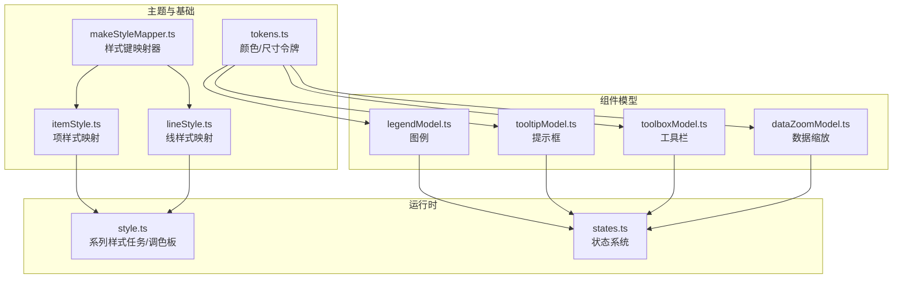
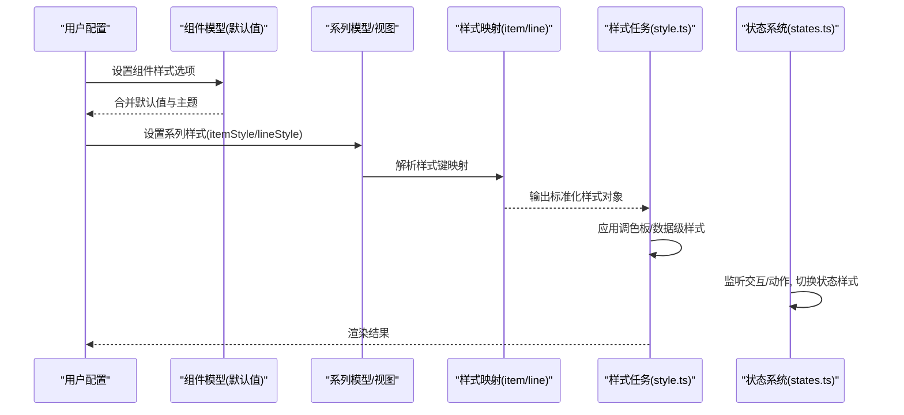
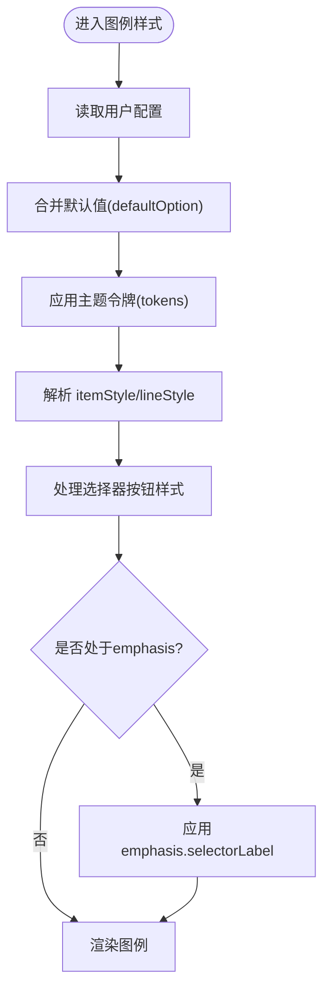
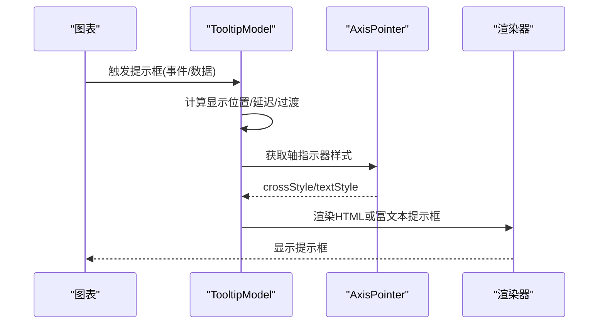
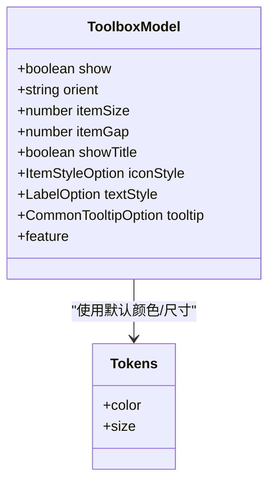
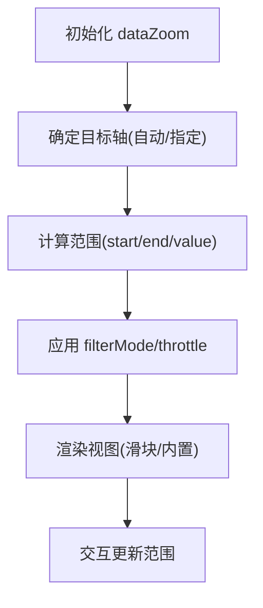
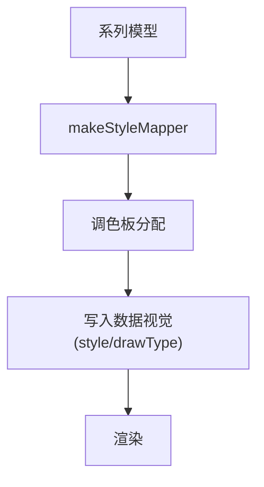
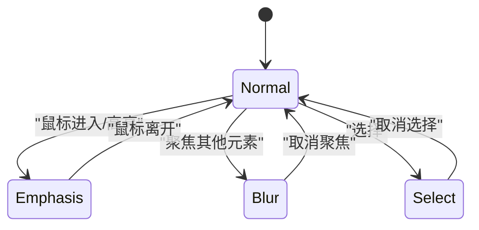
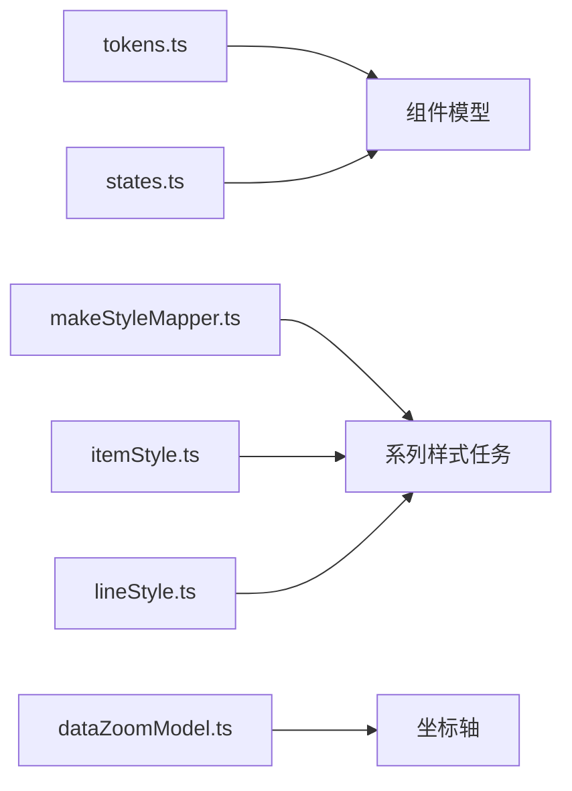

# 组件样式定制

<cite>
**本文引用的文件**
- [src/component/legend/legendModel.ts](file://src/component/legend/legendModel.ts)
- [src/component/tooltip/tooltipModel.ts](file://src/component/tooltip/tooltipModel.ts)
- [src/component/toolbox/toolboxModel.ts](file://src/component/toolbox/toolboxModel.ts)
- [src/component/dataZoom/dataZoomModel.ts](file://src/component/dataZoom/dataZoomModel.ts)
- [src/visual/style.ts](file://src/visual/style.ts)
- [src/visual/tokens.ts](file://src/visual/tokens.ts)
- [src/model/mixin/itemStyle.ts](file://src/model/mixin/itemStyle.ts)
- [src/model/mixin/lineStyle.ts](file://src/model/mixin/lineStyle.ts)
- [src/model/mixin/makeStyleMapper.ts](file://src/model/mixin/makeStyleMapper.ts)
- [src/util/states.ts](file://src/util/states.ts)
</cite>

## 目录
1. [简介](#简介)
2. [项目结构](#项目结构)
3. [核心组件](#核心组件)
4. [架构总览](#架构总览)
5. [详细组件分析](#详细组件分析)
6. [依赖关系分析](#依赖关系分析)
7. [性能考量](#性能考量)
8. [故障排查指南](#故障排查指南)
9. [结论](#结论)
10. [附录](#附录)

## 简介
本文件系统性讲解 ECharts 各组件的样式定制方法，覆盖图例、提示框、工具栏、数据缩放等核心组件的样式配置选项；阐述组件样式的层级结构与优先级规则；说明如何为不同图表类型定制特定组件样式；提供完整的样式定制示例与高级技巧（按钮样式、边框效果、阴影效果、渐变背景等）；并给出组件状态样式（默认、悬停、选中）的配置方法与最佳实践。

## 项目结构
ECharts 的样式系统由“主题令牌 + 通用样式映射 + 组件模型默认值 + 状态系统”共同构成：
- 主题令牌 tokens：集中管理颜色、尺寸等设计令牌，供组件默认值引用。
- 样式映射 itemStyle/lineStyle：将用户配置的语义化键映射到渲染层属性。
- 组件模型 defaultOption：定义各组件的默认样式与布局参数。
- 状态系统 states：统一管理 normal/emphasis/blur/select 等状态的样式提升与切换。

**图示来源**
- [src/visual/tokens.ts:105-233](file://src/visual/tokens.ts#L105-L233)
- [src/model/mixin/makeStyleMapper.ts:27-53](file://src/model/mixin/makeStyleMapper.ts#L27-L53)
- [src/model/mixin/itemStyle.ts:25-43](file://src/model/mixin/itemStyle.ts#L25-L43)
- [src/model/mixin/lineStyle.ts:25-42](file://src/model/mixin/lineStyle.ts#L25-L42)
- [src/component/legend/legendModel.ts:450-539](file://src/component/legend/legendModel.ts#L450-L539)
- [src/component/tooltip/tooltipModel.ts:94-187](file://src/component/tooltip/tooltipModel.ts#L94-L187)
- [src/component/toolbox/toolboxModel.ts:143-193](file://src/component/toolbox/toolboxModel.ts#L143-L193)
- [src/component/dataZoom/dataZoomModel.ts:158-166](file://src/component/dataZoom/dataZoomModel.ts#L158-L166)
- [src/visual/style.ts:67-131](file://src/visual/style.ts#L67-L131)
- [src/util/states.ts:78-95](file://src/util/states.ts#L78-L95)

**章节来源**
- [src/visual/tokens.ts:105-233](file://src/visual/tokens.ts#L105-L233)
- [src/model/mixin/makeStyleMapper.ts:27-53](file://src/model/mixin/makeStyleMapper.ts#L27-L53)
- [src/model/mixin/itemStyle.ts:25-43](file://src/model/mixin/itemStyle.ts#L25-L43)
- [src/model/mixin/lineStyle.ts:25-42](file://src/model/mixin/lineStyle.ts#L25-L42)
- [src/component/legend/legendModel.ts:450-539](file://src/component/legend/legendModel.ts#L450-L539)
- [src/component/tooltip/tooltipModel.ts:94-187](file://src/component/tooltip/tooltipModel.ts#L94-L187)
- [src/component/toolbox/toolboxModel.ts:143-193](file://src/component/toolbox/toolboxModel.ts#L143-L193)
- [src/component/dataZoom/dataZoomModel.ts:158-166](file://src/component/dataZoom/dataZoomModel.ts#L158-L166)
- [src/visual/style.ts:67-131](file://src/visual/style.ts#L67-L131)
- [src/util/states.ts:78-95](file://src/util/states.ts#L78-L95)

## 核心组件
- 图例 legend：支持图标、文本、边框、圆角、内边距、项间距、选择模式、选择器按钮、悬浮态标签等样式。
- 提示框 tooltip：支持触发方式、显示延迟、过渡动画、背景、阴影、圆角、边框、内边距、轴指示器样式、文本样式等。
- 工具栏 toolbox：支持方向、背景、边框、圆角、内边距、图标大小与间距、标题开关、图标样式、悬浮态、工具提示等。
- 数据缩放 dataZoom：支持方向、目标轴绑定、过滤模式、范围控制、节流、文本样式等（其外观主要由具体视图实现，但模型提供行为与默认值）。

**章节来源**
- [src/component/legend/legendModel.ts:162-243](file://src/component/legend/legendModel.ts#L162-L243)
- [src/component/tooltip/tooltipModel.ts:36-86](file://src/component/tooltip/tooltipModel.ts#L36-L86)
- [src/component/toolbox/toolboxModel.ts:47-86](file://src/component/toolbox/toolboxModel.ts#L47-L86)
- [src/component/dataZoom/dataZoomModel.ts:39-131](file://src/component/dataZoom/dataZoomModel.ts#L39-L131)

## 架构总览
下图展示组件样式从配置到渲染的关键路径：用户配置经组件模型的 defaultOption 合并后，通过 itemStyle/lineStyle 映射到渲染属性；系列级样式由 style.ts 的任务阶段统一处理，结合调色板生成最终视觉；状态系统负责在鼠标交互或程序调用时切换 emphasis/blur/select 等状态。

**图示来源**
- [src/component/legend/legendModel.ts:450-539](file://src/component/legend/legendModel.ts#L450-L539)
- [src/component/tooltip/tooltipModel.ts:94-187](file://src/component/tooltip/tooltipModel.ts#L94-L187)
- [src/component/toolbox/toolboxModel.ts:143-193](file://src/component/toolbox/toolboxModel.ts#L143-L193)
- [src/model/mixin/itemStyle.ts:25-43](file://src/model/mixin/itemStyle.ts#L25-L43)
- [src/model/mixin/lineStyle.ts:25-42](file://src/model/mixin/lineStyle.ts#L25-L42)
- [src/visual/style.ts:67-131](file://src/visual/style.ts#L67-L131)
- [src/util/states.ts:168-182](file://src/util/states.ts#L168-L182)

## 详细组件分析

### 图例（legend）样式定制
- 关键样式点
  - 图标与文本：icon、textStyle、formatter、symbolRotate。
  - 未选中态：inactiveColor、inactiveBorderColor、inactiveBorderWidth。
  - 容器样式：backgroundColor、borderRadius、padding、itemGap、itemWidth、itemHeight。
  - 选择器按钮：selector、selectorLabel、emphasis.selectorLabel、selectorPosition、selectorItemGap、selectorButtonGap。
  - 边框与线条：itemStyle、lineStyle（含 inactiveWidth/inactiveColor）。
- 层级与优先级
  - 全局默认值来自组件 defaultOption。
  - 用户配置覆盖默认值。
  - 主题 tokens 影响默认色板与尺寸。
  - 数据/系列视觉可影响图例项的颜色继承。
- 状态样式
  - 选择器按钮支持 emphasis 样式覆盖。
  - 图例项支持通过 itemStyle/lineStyle 的 inherit/auto 策略参与系列配色。

**图示来源**
- [src/component/legend/legendModel.ts:450-539](file://src/component/legend/legendModel.ts#L450-L539)
- [src/visual/tokens.ts:105-233](file://src/visual/tokens.ts#L105-L233)
- [src/model/mixin/itemStyle.ts:25-43](file://src/model/mixin/itemStyle.ts#L25-L43)
- [src/model/mixin/lineStyle.ts:25-42](file://src/model/mixin/lineStyle.ts#L25-L42)

**章节来源**
- [src/component/legend/legendModel.ts:162-243](file://src/component/legend/legendModel.ts#L162-L243)
- [src/component/legend/legendModel.ts:450-539](file://src/component/legend/legendModel.ts#L450-L539)
- [src/visual/tokens.ts:105-233](file://src/visual/tokens.ts#L105-L233)

### 提示框（tooltip）样式定制
- 关键样式点
  - 触发与显示：trigger、triggerOn、showContent、alwaysShowContent、renderMode、confine、showDelay、hideDelay、transitionDuration、displayTransition、enterable。
  - 外观：backgroundColor、shadowBlur/shadowColor/shadowOffsetX/shadowOffsetY、borderRadius、borderWidth、defaultBorderColor、padding、extraCssText、className、appendTo。
  - 轴指示器：axisPointer.type/axis/crossStyle/textStyle。
  - 文本样式：textStyle.color/fontSize。
- 层级与优先级
  - 组件 defaultOption 提供默认外观。
  - 用户配置覆盖默认值。
  - renderMode=html 时可通过 className/appendTo/extraCssText 进行 DOM 级样式扩展。
- 状态样式
  - 提示框本身不直接受 emphasis/blur/select 影响，但其内容可联动 series 状态（如高亮时显示对应数据）。

**图示来源**
- [src/component/tooltip/tooltipModel.ts:94-187](file://src/component/tooltip/tooltipModel.ts#L94-L187)

**章节来源**
- [src/component/tooltip/tooltipModel.ts:36-86](file://src/component/tooltip/tooltipModel.ts#L36-L86)
- [src/component/tooltip/tooltipModel.ts:94-187](file://src/component/tooltip/tooltipModel.ts#L94-L187)

### 工具栏（toolbox）样式定制
- 关键样式点
  - 布局：orient、left/top/right/bottom、padding、itemSize、itemGap。
  - 外观：backgroundColor、borderRadius、borderColor、borderWidth。
  - 图标与文本：showTitle、iconStyle、textStyle。
  - 悬浮态：emphasis.iconStyle。
  - 工具提示：tooltip.show/position。
- 层级与优先级
  - 默认值来自 defaultOption。
  - 主题可注入 feature 默认配置（初始化时合并一次）。
  - 用户配置覆盖默认值与主题。
- 状态样式
  - 支持 emphasis.iconStyle 覆盖图标样式。

**图示来源**
- [src/component/toolbox/toolboxModel.ts:143-193](file://src/component/toolbox/toolboxModel.ts#L143-L193)
- [src/visual/tokens.ts:105-233](file://src/visual/tokens.ts#L105-L233)

**章节来源**
- [src/component/toolbox/toolboxModel.ts:47-86](file://src/component/toolbox/toolboxModel.ts#L47-L86)
- [src/component/toolbox/toolboxModel.ts:143-193](file://src/component/toolbox/toolboxModel.ts#L143-L193)

### 数据缩放（dataZoom）样式与行为
- 关键行为与样式
  - 行为：orient、xAxisIndex/yAxisId/radiusAxisIndex/angleAxisIndex/singleAxisIndex、filterMode、throttle、start/end/startValue/endValue、minSpan/maxSpan、rangeMode、realtime。
  - 文本样式：textStyle（用于滑块/手柄标签等）。
  - 外观：具体外观由视图实现（如 slider/inside），模型主要提供行为与默认值。
- 层级与优先级
  - 默认值来自 defaultOption。
  - 用户配置覆盖默认值。
  - 自动目标轴选择逻辑基于 orient 与坐标系。
- 状态样式
  - 数据缩放本身不直接受 emphasis/blur/select 影响，但可与系列高亮联动。

**图示来源**
- [src/component/dataZoom/dataZoomModel.ts:158-166](file://src/component/dataZoom/dataZoomModel.ts#L158-L166)
- [src/component/dataZoom/dataZoomModel.ts:262-368](file://src/component/dataZoom/dataZoomModel.ts#L262-L368)
- [src/component/dataZoom/dataZoomModel.ts:381-415](file://src/component/dataZoom/dataZoomModel.ts#L381-L415)

**章节来源**
- [src/component/dataZoom/dataZoomModel.ts:39-131](file://src/component/dataZoom/dataZoomModel.ts#L39-L131)
- [src/component/dataZoom/dataZoomModel.ts:158-166](file://src/component/dataZoom/dataZoomModel.ts#L158-L166)
- [src/component/dataZoom/dataZoomModel.ts:262-368](file://src/component/dataZoom/dataZoomModel.ts#L262-L368)
- [src/component/dataZoom/dataZoomModel.ts:381-415](file://src/component/dataZoom/dataZoomModel.ts#L381-L415)

### 系列样式与调色板
- 系列样式任务
  - 通过 makeStyleMapper 将 itemStyle/lineStyle 映射为渲染属性。
  - 若颜色为 auto 或未指定，则从调色板分配。
  - 支持 decal 装饰纹理。
- 数据级样式
  - 数据项可覆盖系列样式，支持 decal 与颜色覆盖。
- 调色板
  - 按系列维度分组作用域，确保切换图例时颜色一致性。

**图示来源**
- [src/visual/style.ts:67-131](file://src/visual/style.ts#L67-L131)
- [src/model/mixin/makeStyleMapper.ts:27-53](file://src/model/mixin/makeStyleMapper.ts#L27-L53)
- [src/model/mixin/itemStyle.ts:25-43](file://src/model/mixin/itemStyle.ts#L25-L43)
- [src/model/mixin/lineStyle.ts:25-42](file://src/model/mixin/lineStyle.ts#L25-L42)

**章节来源**
- [src/visual/style.ts:67-131](file://src/visual/style.ts#L67-L131)
- [src/visual/style.ts:134-171](file://src/visual/style.ts#L134-L171)
- [src/visual/style.ts:175-225](file://src/visual/style.ts#L175-L225)

### 组件状态样式（默认、悬停、选中）
- 状态集合
  - normal、emphasis、blur、select。
- 状态提升
  - emphasis 默认提升 z2 与颜色亮度。
  - select 默认提升 z2。
  - blur 降低透明度。
- 交互流程
  - 鼠标进入/离开触发 emphasis/blur。
  - 选择动作触发 select/unselect。
  - 支持 focus/blurScope 控制模糊范围。

**图示来源**
- [src/util/states.ts:78-95](file://src/util/states.ts#L78-L95)
- [src/util/states.ts:168-182](file://src/util/states.ts#L168-L182)
- [src/util/states.ts:225-325](file://src/util/states.ts#L225-L325)
- [src/util/states.ts:360-398](file://src/util/states.ts#L360-L398)

**章节来源**
- [src/util/states.ts:78-95](file://src/util/states.ts#L78-L95)
- [src/util/states.ts:168-182](file://src/util/states.ts#L168-L182)
- [src/util/states.ts:225-325](file://src/util/states.ts#L225-L325)
- [src/util/states.ts:360-398](file://src/util/states.ts#L360-L398)

## 依赖关系分析
- 组件模型依赖主题 tokens 提供默认颜色与尺寸。
- 系列样式依赖 itemStyle/lineStyle 映射器与调色板。
- 状态系统依赖 ZRender 的状态机制，并在 ECharts 中统一调度。
- 数据缩放依赖坐标轴与系列以计算窗口范围。

**图示来源**
- [src/visual/tokens.ts:105-233](file://src/visual/tokens.ts#L105-L233)
- [src/model/mixin/makeStyleMapper.ts:27-53](file://src/model/mixin/makeStyleMapper.ts#L27-L53)
- [src/model/mixin/itemStyle.ts:25-43](file://src/model/mixin/itemStyle.ts#L25-L43)
- [src/model/mixin/lineStyle.ts:25-42](file://src/model/mixin/lineStyle.ts#L25-L42)
- [src/util/states.ts:78-95](file://src/util/states.ts#L78-L95)
- [src/component/dataZoom/dataZoomModel.ts:153-155](file://src/component/dataZoom/dataZoomModel.ts#L153-L155)

**章节来源**
- [src/visual/tokens.ts:105-233](file://src/visual/tokens.ts#L105-L233)
- [src/model/mixin/makeStyleMapper.ts:27-53](file://src/model/mixin/makeStyleMapper.ts#L27-L53)
- [src/model/mixin/itemStyle.ts:25-43](file://src/model/mixin/itemStyle.ts#L25-L43)
- [src/model/mixin/lineStyle.ts:25-42](file://src/model/mixin/lineStyle.ts#L25-L42)
- [src/util/states.ts:78-95](file://src/util/states.ts#L78-L95)
- [src/component/dataZoom/dataZoomModel.ts:153-155](file://src/component/dataZoom/dataZoomModel.ts#L153-L155)

## 性能考量
- 节流与动画：dataZoom 的 throttle 根据全局动画配置自动设定，避免频繁重绘。
- 样式映射开销：makeStyleMapper 仅浅拷贝必要字段，减少对象创建。
- 调色板作用域：按系列维度分组，保证切换图例时颜色稳定且高效。
- 状态切换：emphasis/select/blur 通过最小化样式变更与 z2 提升，减少重排。

[本节为通用指导，无需特定文件来源]

## 故障排查指南
- 提示框不显示
  - 检查 trigger/triggerOn/showContent/renderMode/confine 配置是否正确。
  - 确认 appendTo/className/extraCssText 未遮挡或隐藏内容。
- 图例样式不生效
  - 确认 itemStyle/lineStyle 的键名映射正确（如 color→fill、borderColor→stroke）。
  - 检查 inherit/auto 策略是否与系列配色冲突。
- 工具栏图标样式异常
  - 确认 iconStyle/emphasis.iconStyle 的键名与值类型正确。
  - 检查主题是否覆盖了默认颜色。
- 数据缩放范围异常
  - 核对 start/end/startValue/endValue 与 rangeMode 的组合。
  - 确认目标轴绑定（xAxisIndex/yAxisId 等）是否正确。

**章节来源**
- [src/component/tooltip/tooltipModel.ts:94-187](file://src/component/tooltip/tooltipModel.ts#L94-L187)
- [src/component/legend/legendModel.ts:450-539](file://src/component/legend/legendModel.ts#L450-L539)
- [src/component/toolbox/toolboxModel.ts:143-193](file://src/component/toolbox/toolboxModel.ts#L143-L193)
- [src/component/dataZoom/dataZoomModel.ts:394-415](file://src/component/dataZoom/dataZoomModel.ts#L394-L415)

## 结论
ECharts 的组件样式体系以 tokens 为基础，通过组件模型的 defaultOption 提供一致默认值，借助 itemStyle/lineStyle 映射器将用户配置转化为渲染属性，并由状态系统统一管理交互态。掌握层级与优先级（默认值 < 主题 < 用户配置 < 数据/系列视觉），即可灵活定制图例、提示框、工具栏、数据缩放等组件的外观与行为，并通过 emphasis/blur/select 实现丰富的交互反馈。

[本节为总结性内容，无需特定文件来源]

## 附录
- 高级样式技巧
  - 按钮样式：通过 iconStyle/emphasis.iconStyle 调整边框、填充、阴影。
  - 边框效果：使用 borderWidth/borderColor/borderRadius 组合实现圆角边框。
  - 阴影效果：利用 shadowBlur/shadowColor/shadowOffsetX/shadowOffsetY 增强层次。
  - 渐变背景：在 HTML 模式下通过 extraCssText/className 注入 CSS 渐变；或在富文本模式下使用图形渐变。
- 状态样式配置要点
  - emphasis：提升 z2、提高颜色亮度，适用于悬停高亮。
  - select：提升 z2，适用于选中态。
  - blur：降低透明度，适用于非焦点区域弱化。

[本节为通用指导，无需特定文件来源]